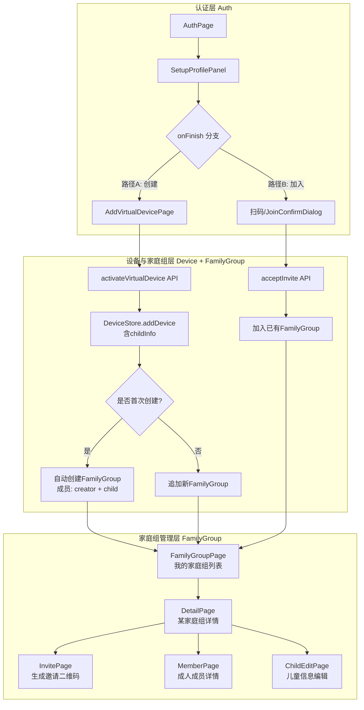

## 产品概述

设计并整理 leBot 前端项目中**家庭组成员管理的完整业务流程**。核心模型为：**一个儿童 + 一台虚拟乐宝设备 = 一个家庭组**。APP注册用户可同时属于多个家庭组（多孩场景），邀请的目的是让不同家庭成员能跨设备查看儿童聊天内容并继续与乐宝对话。

## 核心功能

### 一、核心业务模型：以儿童为中心的家庭组

**家庭组的本质 = 一个儿童信息 + 一台虚拟乐宝设备**

每当用户添加一台新的虚拟乐宝并绑定一个儿童时，系统自动创建一个以该儿童命名的家庭组。初始成员包含两类：

| 成员类型 | 产生方式 | 身份标识 | 说明 |
| --- | --- | --- | --- |
| **创建者（Creator）** | APP注册后添加第一台乐宝自动成为 | 家庭角色（爸爸/妈妈/爷爷/奶奶/朋友等） | 有APP账号，拥有管理权限 |
| **儿童（Child）** | 填写儿童信息（性别/姓名/生日）绑定到虚拟设备 | `role: 'child'` | 无独立APP账号，作为设备使用者存在 |
| **受邀成员（Invitee）** | 扫描邀请二维码加入 | 家庭角色（加入时选择） | 已注册APP的其他用户，查看聊天+继续对话 |


### 二、多孩场景：一个用户属于多个家庭组

```
爸爸（APP账号）
├── "小新的家庭组" ← 设备: 小新的乐宝
│   ├── 爸爸 (creator, role=father)
│   └── 小新 (child, 男5岁)
│       └── [美伢(妈妈) 通过扫码加入] ← 邀请来的成员
│
└── "小葵的家庭组" ← 设备: 小葵的乐宝
    ├── 爸爸 (creator, role=father)
    └── 小葵 (child, 女3岁)
        └── [奶奶(通过扫码加入)] ← 邀请来的成员
```

关键点：**同一个APP用户（如爸爸）同时是两个家庭组的成员**。家庭组列表页展示该用户所属的所有家庭组卡片。

### 三、完整业务流程

```
流程A：新用户注册 → 创建第一个家庭组
━━━━━━━━━━━━━━━━━━━━━━━━━━━━━━━━━
① 邮箱验证码登录 (SignInOrSignUpPanel)
② 设置密码 (NewPasswordPanel, 新用户必走)
③ 完善个人信息 (SetupProfilePanel: 头像/昵称/生日/与孩子关系)
④ ┌─ 选择A: 添加虚拟乐宝 (AddVirtualDevicePage)
│     ├─ Step1: 填写儿童信息(性别/姓名/生日) → 设备命名为"{name}的乐宝"
│     ├─ Step2: 激活设备(API调用 activateVirtualDevice)
│     ├─ Step3: 录入声纹(可选跳过)
│     ├─ Step4: AI性格设置(可选跳过)
│     └─ Step5: 完成 → 自动创建 "{name}的家庭组"
│           初始成员: 当前用户(creator) + 儿童(child)
│           → 进入聊天页或首页
│
└─ 选择B: 扫码加入已有家庭组 (新增入口)
      ├─ 打开扫码界面 / 相册选图识别二维码
      ├─ 解析邀请码 → 获取(groupId, 邀请人, 家庭组名)
      ├─ 弹出确认弹窗: 选择自己的家庭角色
      └─ 确认加入 → 成为该家庭组成员


流程B：已有用户添加更多家庭组（多孩场景）
━━━━━━━━━━━━━━━━━━━━━━━━━━━━━━━━━━
家庭组列表页(FamilyGroupPage)
  → 点击"添加家庭组"按钮
  → AddVirtualDevicePage(填写新的儿童信息)
  → 激活新设备 → 自动创建第二个家庭组
  → 用户同时属于多个家庭组


流程C：邀请其他家庭成员
━━━━━━━━━━━━━━━━━━━━
进入某个家庭组详情页(DetailPage)
  → 点击底部"邀请成员"按钮
  → InvitePage: 展示邀请二维码(含groupId+过期时间)
  → 分享二维码给其他家庭成员(微信/图片/链接)


流程D：被邀请人扫码加入
━━━━━━━━━━━━━━━━━━━━
被邀请人已注册:
  打开APP → 全局扫码入口/首页扫码按钮 → 识别二维码
  → JoinConfirmDialog(确认弹窗): 显示邀请人+家庭组名称+角色选择
  → 选择关系角色 → "确认加入" → 加入成功

被邀请人未注册:
  下载/打开APP → 注册登录 → 完善个人信息
  → 此时提供两个选项: 添加设备 OR 扫码加入(复用流程A的选择B)


流程E：成员管理与聊天
━━━━━━━━━━━━━━━━━━━━
家庭组详情页(DetailPage):
  - 成员列表卡片展示
  - 点击儿童卡片 → 编辑儿童信息(ChildEditPage编辑模式)
  - 点击成人卡片 → 查看成员详情(MemberPage: 称呼/性别/身份/生日/声纹)
  - Owner可见"删除成员"操作
  - 所有该家庭成员可在各自手机上:
    ✓ 查看/继续儿童与乐宝的对话
    ✓ 接收消息通知
```

### 四、邀请的目的与价值

1. **跨设备查看聊天内容**: 被邀请成员可以在自己的手机上看到该儿童与乐宝的历史对话和实时聊天
2. **多端继续对话**: 不同家庭成员都可以在自己手机上代表儿童与乐宝进行交互（如妈妈在上班时也能和小新的乐宝聊天）
3. **共同照护**: 多个家庭成员共享对同一台乐宝设备的访问权限

### 五、关键约束与边界条件

- **多组归属**: 一个APP用户最多属于 N 个家庭组（受 MAX_VIRTUAL_DEVICES=5 限制，即每个用户最多创建5个设备/家庭组）
- **每组一童**: 一个家庭组对应且仅对应一个儿童（一台虚拟设备），不存在一个家庭组下多个儿童的情况
- **邀请时效**: 二维码有效期建议7天，过期需重新生成
- **人数上限**: 每个家庭组成员上限建议10人（1 creator + 1 child + 8 invitees）
- **权限分级**:
- Creator: 邀请成员/移除成员/编辑儿童信息/生成邀请码
- Invitee: 查看成员列表/查看聊天/主动退出
- **退出机制**: 被邀请成员可主动退出；Creator不可自行退出（需先转移或解散家庭组）
- **删除儿童级联**: 删除儿童信息=解绑设备=解散该家庭组（需二次确认）

## 技术栈

- **前端框架**: Vue 3 Composition API + Quasar Framework (已有项目基础)
- **状态管理**: Pinia (遵循现有 stores/device 和 stores/profile 的模式)
- **类型系统**: TypeScript (类型定义放在 src/stores/*/types.ts 和 src/types/api/)
- **API 层**: Axios 封装 (遵循现有 src/utils/api/*.ts 的函数式导出模式)
- **国际化**: i18nSubPath 工具函数 (遵循现有多语言方案)

## 核心架构变更点

### 关键发现：当前代码中的硬编码跳转问题

**文件**: `src/pages/stack/AuthPage.vue:18-21`

```typescript
// 当前代码 — 硬编码跳转到添加设备页，没有分支选项
function onProfileFinish() {
  router.replace('/stack/add-virtual-device').catch(console.error);
}
```

**需要改为分支逻辑**：注册完成后应提供「添加虚拟乐宝」和「扫码加入家庭组」两个入口。

### 数据流设计



### 核心类型体系设计

```typescript
// === 家庭成员角色 ===
// 注意: 不再使用 'owner' 作为独立角色
// Creator 的角色由其选择的 'familyRole' 决定(如 father/mother)
type FamilyMemberRole = 
  | 'child'                              // 儿童(唯一特殊角色)
  | 'father' | 'mother'                 // 父母
  | 'grandpa' | 'grandma'               // 祖父母(父系)
  | 'paternal_grandma' | 'maternal_grandpa' | 'maternal_grandma'  // 外祖父母/祖辈变体
  | 'friend' | 'other';                 // 其他

// === 家庭组成员实体 ===
interface FamilyMember {
  id: string;
  
  // --- 区分 memberType 的核心字段 ---
  memberType: 'user' | 'child';         // user=有APP账号, child=儿童虚拟成员
  
  // === user 类型字段 ===
  userId?: string;                      // APP用户ID(仅user类型有值)
  nickname: string;                     // 显示名称
  avatar?: string;                      // 头像URL
  role: FamilyMemberRole;               // 在该家庭中的角色(不含child时为familyRole)
  gender?: 'male' | 'female';
  birthday?: string;
  hasVoiceprint?: boolean;
  voiceprintPersonId?: string;
  
  // === child 类型字段 ===
  childInfo?: ChildInfo;                // 复用 stores/device/types.ts 中的 ChildInfo
  deviceId?: string;                    // 关联的虚拟设备ID
  
  // === 通用字段 ===
  isCreator: boolean;                   // 是否为该家庭组的创建者
  joinedAt: string;                     // 加入时间(ISO 8601)
}

// === 家庭组实体 ===
interface FamilyGroup {
  id: string;
  name: string;                         // 格式: "{儿童名}的家庭组", 如 "小新的家庭组"
  childName: string;                    // 关联的儿童姓名(冗余存储便于列表展示)
  deviceId: string;                     // 关联的虚拟设备ID (核心关联键)
  creatorId: string;                    // 创建者的userId
  createdAt: string;
  members: FamilyMember[];              // 成员列表(通常含1个child + N个user)
  inviteCode?: InviteCode;              // 当前的有效邀请码(如有)
}

// === 邀请码 ===
interface InviteCode {
  code: string;                         // 邀请码字符串(用于QR编码)
  groupId: string;
  groupName: string;
  inviterNickname: string;
  inviterAvatar?: string;
  expiresAt: string;                    // ISO 8601 过期时间
  qrImageUrl?: string;                  // 后端生成的QR图片URL(或前端本地生成)
  maxUses: number;                      // 最大使用次数
  usedCount: number;                    // 已使用次数
}
```

### API 接口规划（待后端实现）

| 函数名 | 方法 | 路径 | 功能 | 对应当前代码 |
| --- | --- | --- | --- | --- |
| `fetchMyFamilyGroups` | GET | `/family-groups/mine` | 获取我的家庭组列表 | 无(当前Mock) |
| `fetchGroupDetail` | GET | `/family-groups/:id` | 获取家庭组详情+成员列表 | 无 |
| `generateInviteCode` | POST | `/family-groups/:id/invite` | 生成邀请码+QR | 无 |
| `acceptInvite` | POST | `/family-groups/join` | 接受邀请加入(传code+role) | 无 |
| `removeMember` | DELETE | `/family-groups/:id/members/:memberId` | 移除成员(Creator操作) | 无 |
| `leaveGroup` | POST | `/family-groups/:id/leave` | 主动退出(Invitee操作) | 无 |
| `updateChildInfo` | PUT | `/family-groups/:id/child` | 更新儿童信息 | 无(当前仅frontend) |


> 注: `createFamilyGroup` 不需要单独API，应在 `activateVirtualDevice` 时由后端自动创建（设备激活 = 家庭组创建）。

## 目录结构

```
src/
├── types/api/
│   └── family-group.ts                  # [NEW] 家庭组API请求/响应类型
├── utils/api/
│   └── family-group.ts                  # [NEW] 家庭组API调用层(9个函数)
├── stores/
│   └── family-group/
│       ├── index.ts                     # [NEW] FamilyGroupStore (Pinia)
│       └── types.ts                     # [NEW] FamilyGroup/Member/InviteCode 类型定义
├── pages/stack/
│   ├── AuthPage.vue                     # [MODIFY] onProfileFinish增加分支: 添加设备 vs 扫码加入
│   ├── AddVirtualDevicePage.vue         # [MODIFY] Step5完成后触发FamilyGroup创建/关联
│   └── family-group/
│       ├── FamilyGroupPage.vue          # [MODIFY] 替换Mock数据→从Store读取; 卡片显示儿童名+成员数
│       ├── DetailPage.vue               # [MODIFY] 替换Mock成员→从Store读取; 显示creator标识
│       ├── MemberPage.vue               # [MODIFY] 替换Mock数据→从Store读取
│       ├── InvitePage.vue               # [MODIFY] 接入真实QR生成+分享功能+有效期显示
│       ├── ChildEditPage.vue            # [MODIFY] 创建模式对接API; 保存同步更新Store
│       └── JoinConfirmDialog.vue        # [NEW] 全局扫码确认加入弹窗组件
├── components/family-group/
│   ├── MemberCard.vue                   # [NEW] 可复用成员卡片组件
│   └── GroupCard.vue                    # [NEW] 家庭组列表卡片组件(含儿童头像+名称+成员数)
├── router/routes.ts                     # [MODIFY] 新增扫码加入路由/中间页
└── i18n/                                # [MODIFY] 补充家庭组+扫码加入相关i18n文案
```

## 关键实施注意事项

1. **AuthPage 分支改造** (`AuthPage.vue:18-21`): 当前 `onProfileFinish()` 硬编码跳转到 `/stack/add-virtual-device`，需要改为弹出选项或引导页，让用户选择「添加虚拟乐宝」或「扫码加入」。这是整个流程改动的**起点**。
2. **AddVirtualDevicePage 与家庭组联动** (`AddVirtualDevicePage.vue:63-86`): `activateAndAddVirtualDeviceWithChild()` 目前只操作 DeviceStore，需要在 Step5(Done) 时同步触发 FamilyGroupStore 的创建逻辑。如果后端在 `activateVirtualDevice` 时就自动创建了家庭组，则前端只需 fetch 并写入 Store。
3. **ChildInfo 类型复用**: `stores/device/types.ts:6-10` 已定义 `ChildInfo { name, gender, birthday }`，FamilyGroup 中的儿童信息直接引用此类型，不重复定义。
4. **FamilyGroupPage Mock替换** (`FamilyGroupPage.vue:15-23`): 当前接口 `FamilyGroup { id, name }` 和 Mock 数据需扩展为完整类型，从 Store 读取真实数据。
5. **DetailPage 内部类型迁移** (`DetailPage.vue:23-29`): 内部定义的 `FamilyMember` 接口需提取到共享 types 文件中，Mock 成员数组替换为 Store 数据源。
6. **二维码策略** (`InvitePage.vue:28-31`): 当前使用 mdi-qrcode 占位图标。方案优先级：(a)后端生成 QR 图片URL (b)前端 qrcode 库本地生成 (c)后端返回 invite code 字符串前端渲染。
7. **全局扫码入口**: 除了注册后的分支选项，还需要考虑已有用户的全局扫码入口（如首页悬浮按钮/设置页入口），用于随时扫码加入新家庭组。
8. **权限差异化UI**: DetailPage 中 "邀请成员" 按钮、MemberPage 中 "删除成员" 按钮，都应根据 `isCreator` 字段控制显隐。
9. **关系映射一致性**: SetupProfilePanel (`SetupProfilePanel.vue:34`) 中的 `relationOptions` 数组和 JoinConfirmDialog 中的角色选项应保持一致，抽取为共享常量。
10. **向后兼容**: 所有页面改动保持现有 DOM 结构和 CSS class 不变，仅替换数据源(Mock→Store)，避免样式回归问题。

## 设计概述

基于 Quasar Framework 的移动端优先 SPA 设计，延续项目现有的简洁现代视觉语言。整体采用浅色中性背景(#F5F6FA) + 白色圆角卡片的层次化布局，配合品牌主色(#20CCF9)作为强调色。设计风格定位为**Clean Minimalism with Warm Accents**——干净利落的极简底色上点缀温暖的互动元素，营造家庭产品的亲切感。

## 页面规划

### 页面一：注册完成引导页（新增 — AuthPage 分支后的选择页）

这是注册流程完善个人信息后的**首个分支页面**，决定用户走"创建"还是"加入"路径。

- **顶部区域**: 大尺寸插画/图标（展示乐宝机器人形象 + 温馨家庭场景）
- **标题区**: "开始使用乐宝" 主标题 + "选择你的使用方式"副标题
- **选项卡片区域**（两个大卡片纵向排列）:
- **卡片A — 添加我的乐宝**: 图标(+) + "添加虚拟乐宝设备" + 描述文字"为孩子创建专属AI伙伴" + 右箭头
- **卡片B — 加入家庭组**: 图标(QR) + "扫描加入家庭组" +描述文字"家人邀请你一起守护孩子的成长" + 右箭头
- **底部提示**: 小字 "你也可以先跳过，稍后在设置中操作"

### 页面二：家庭组列表页（FamilyGroupPage 改进）

- **顶部导航栏**: 返回 + "家庭组"标题(StackHeader)
- **列表区域**: 
- 每张家庭组卡片(GROUP CARD)包含：
    - 左侧: 儿童头像圆形缩略图(boy/girl区分)
    - 中间: 家庭组名称(如"小新的家庭组", 16px Medium) + 成员数标签(如"3人", Caption色) + 设备在线状态小圆点
    - 右侧: chevron_right箭头
- 卡片间距12px，圆角12px，白色背景带轻微阴影
- **空状态**: 居中插图 + "还没有家庭组" + "添加你的第一个乐宝吧" + "立即添加"按钮
- **底部固定**: "+ 添加家庭组"主按钮(品牌色, 圆角28px, 311x56)

### 页面三：家庭组详情页（DetailPage 改进）

- **顶部导航栏**: StackHeader("XX的家庭组")
- **儿童信息头卡**(区别于普通成员):
- 大号圆形头像(56px) + 儿童昵称(18px Bold) + 性别年龄标签(男/女 X岁, 浅蓝背景pill)
- 关联设备名(如 "小新的乐宝", link色, 可点击跳转到设备详情)
- 底部细线分隔
- **成员列表区域**:
- Section标题 "家庭成员 (N)"
- 成员卡片(MemberCard):
    - 头像(40px圆) + 昵称 + 角色Badge(father=蓝色/mother=粉色/grandpa=灰色等色彩区分)
    - Creator成员右侧显示小皇冠/星标图标
    - 整行可点击 → user类跳MemberPage / child类跳ChildEditPage
- **底部固定操作区**: 
- "邀请成员"主按钮（品牌色填充, 仅 isCreator 可见）
- 或 "退出家庭组"次要文字按钮（非 Creator 可见）

### 页面四：邀请成员页（InvitePage 改进）

- **顶部**: StackHeader("邀请成员")
- **标题区**: "扫码加入{儿童名字}的家庭组" 居中大字
- **二维码展示区**: 
- 240x240 圆角12px白色容器，内嵌真实二维码图片
- 容器下方: 有效期倒计时 "二维码将于 XX:XX:XX 后失效"
- 刷新按钮(小icon)用于重新生成
- **分享提示**: "直接分享到微信聊天" (14px caption色, 微信icon前缀)
- **分享操作栏**:
- 主按钮: "分享二维码"(品牌色填充, 触发系统分享Sheet)
- 次要操作行: "复制链接" | "保存图片" 两个文字按钮

### 页面五：扫码加入确认弹窗（JoinConfirmDialog — 全局新增组件）

- **半透明遮罩**: rgba(0,0,0,0.45), 点击外部不关闭
- **内容卡片**: 从底部滑入(transition: translateY 0→100%, 300ms ease-out), 圆角16px, 最大高度85vh
- **卡片结构自上而下**:

1. **拖拽指示条**: 顶部居中36x4px圆角灰色条
2. **邀请人信息**: 邀请人头像(40px圆) + 昵称(16px Medium) + "邀请你加入"文案
3. **家庭组信息**: 家庭组名称(20px Bold, 品牌色高亮)
4. **说明文字**: "加入后你可以查看{儿童名}与乐宝的聊天内容" (14px caption色)
5. **角色选择区**: 

    - 标题 "你在该家庭中的身份"
    - 3列网格Chip按钮(妈妈/爸爸/奶奶/爷爷/外婆/外公/朋友/其他亲属)
    - 选中态: 品牌色边框+背景浅蓝; 未选中: 灰色边框

6. **底部按钮组**: "取消"(outline次按钮, flex=1) | "确认加入"(实心主按钮, flex=1)

- **加载态**: 确认加入时按钮显示spinner, 文案变为"加入中..."

### 页面六：成员信息页（MemberPage 改进）

- **顶部**: StackHeader("成员信息")
- **头部区域**: 
- 成员大头像(80px圆形, 居中)
- 昵称(20px Bold, 居中) + 角色标签Badge(紧跟右侧)
- 加入时间(13px caption色, 居中, 如"2024年1月加入")
- **信息卡片**: 白色圆角卡片, 结构化列表:
- 每行: label(caption色) + value(正文色, right-aligned)
- 行项: 称呼 / 性别 / 身份角色 / 生日 / 加入时间
- 行间细分割线
- **声纹信息行** (如有声纹): 特殊样式—左侧声纹wave图标 + "已录入声纹" + 右箭头, 可点击跳转
- **危险操作区**: 
- 间隔线 + "移除成员"红色文字按钮(仅Creator可见, 居中block)
- 点击弹出二次确认Dialog: "确定要将 {昵称} 移出家庭组吗？移出后将无法查看聊天记录。"

### 页面七：儿童编辑页（ChildEditPage 改进）

保持现有三步问答式布局不变（性别选择 → 姓名 → 生日）：

- **创建模式增强**: "下一步"提交后调用API创建设备+家庭组, notify成功后跳转到DetailPage而非列表页
- **编辑模式增强**: "保存修改"调用 updateChildInfo API, 同步刷新 FamilyGroupStore + DeviceStore

## Agent Extensions

### SubAgent

- **code-explorer**
- Purpose: 在实施过程中深度探索代码库，查找所有与家庭组相关的引用点、依赖链和数据流
- Expected outcome: 准确找到所有需要修改的文件位置，避免遗漏任何关联代码

### Skill

- **vue-expert**
- Purpose: 构建新的 Vue 组件（JoinConfirmDialog、MemberCard、GroupCard、引导页），确保 Composition API 写法和 Pinia store 集成符合项目现有模式
- Expected outcome: 高质量的新建 Vue 组件，完全遵循项目现有的代码风格和架构模式