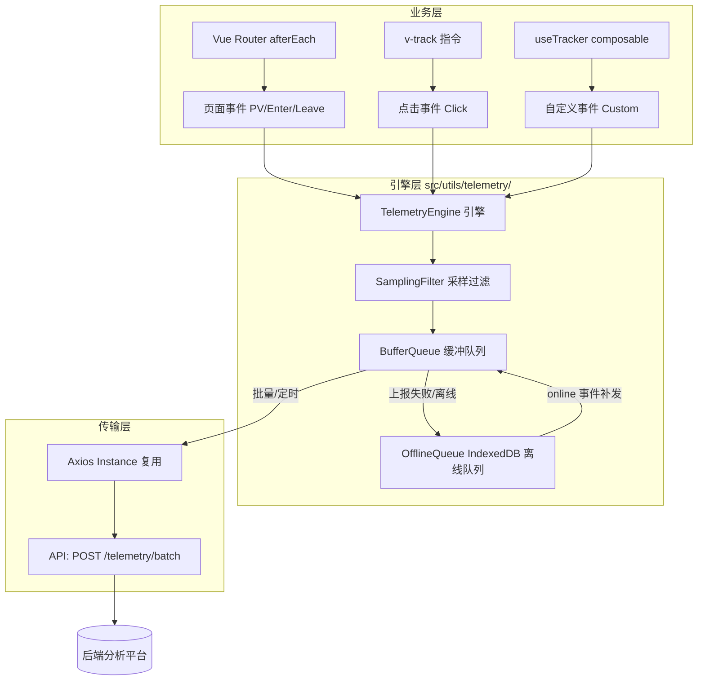

## 产品概述

为 le-bot-frontend（乐宝 PWA 前端应用）建立一套完整的遥测埋点系统，全量采集用户行为数据，覆盖页面浏览、停留时长、交互点击、转化漏斗、行为路径和用户留存六大维度。系统支持批量上报、离线缓存、采样率控制与隐私合规，数据最终由后端团队自建分析看板消费，为产品迭代、用户画像分析和体验优化提供量化依据。

## 核心功能

- **自动页面埋点**：通过 Vue Router 全局守卫自动采集所有页面的进入/离开事件及停留时长，无需逐页手动改造
- **业务点击事件**：提供声明式 Vue 指令 `v-track` 和命令式 API `trackEvent()`，对按钮、链接、Tab 切换、表单提交等关键交互一键埋点
- **批量上报引擎**：本地环形缓冲区缓冲事件，定时（默认每 10 秒）批量 POST 到后端，支持可配置的缓冲区大小和上报间隔
- **离线容灾队列**：上报失败或 PWA 离线时自动降级到 IndexedDB 持久化队列，监听 `online` 事件自动补发，确保数据不丢失
- **采样率控制**：按页面类型（核心/次要）、事件类型独立可配的采样率（0-100%），避免海量数据冲击后端
- **隐私合规**：用户标识 SHA-256 哈希匿名化，不采集姓名/邮箱/手机/儿童信息等明文 PII，所有字段白名单过滤
- **API 契约**：定义 `POST /api/v1/telemetry/batch` 接口请求/响应格式，与后端同步开发

## 技术栈

- **核心框架**: Vue 3 + TypeScript + Composition API
- **路由层**: Vue Router 4（现有 hash mode）
- **状态管理**: Pinia（用于 SessionStore）
- **HTTP 客户端**: Axios（复用现有 boot/axios.ts 实例）
- **离线存储**: IndexedDB（通过 `idb-keyval` 轻量包装）
- **PWA**: Workbox InjectManifest 模式（现有）
- **工具库**: `uuid`（生成事件 ID）、`spark-md5`（设备指纹）

## 实现方案

### 总体策略

遵循"**框架自动采集 + 业务声明式埋点 + 引擎透明上报**"三层架构，最大化复用现有基础设施，最小化对业务代码的侵入。

- **框架自动采集**：在 `src/router/index.ts` 注册 `afterEach` 守卫，自动采集所有页面级别的 PV、进入时间、离开时间、停留时长、前驱页面信息，无需修改任何页面文件
- **业务声明式埋点**：提供 Vue 指令 `v-track` 和 composable `useTracker()`，业务组件通过声明方式添加点击事件，支持传参（eventName、extraData）
- **引擎透明上报**：封装 TelemetryEngine 模块，负责缓冲、批量发送、离线重试、采样过滤，对上层完全透明

### 关键设计决策

1. **为何自建而非用第三方 SDK**：后端自建分析看板，数据格式需高度定制；涉及儿童隐私合规，数据不外传第三方
2. **为何用 Vue Router 守卫而非逐页埋点**：40+ 页面逐页改动量大、易遗漏、维护成本高；路由守卫一处实现，零业务侵入
3. **为何 IndexedDB 而非 localStorage**：埋点数据量大（单用户日积累可能数千条），localStorage 5MB 限制不够，IndexedDB 无容量压力
4. **为何采样在客户端而非服务端**：减少无效网络传输，核心页面全量、次要页面可采样，灵活可控
5. **用户标识方案**：`userIdHash = SHA-256(accessToken + salt)`，未登录用户使用 `deviceFingerprint`（浏览器指纹组合）

## 架构设计

### 系统架构图



### 模块划分

| 模块 | 位置 | 职责 |
| --- | --- | --- |
| TelemetryEngine | `src/utils/telemetry/engine.ts` | 事件调度中心，接收各来源事件，驱动过滤与缓冲 |
| SamplingFilter | `src/utils/telemetry/sampling.ts` | 按事件/页面类型匹配采样率，决定是否丢弃 |
| BufferQueue | `src/utils/telemetry/buffer.ts` | 内存环形缓冲，定时触发批量上报 |
| OfflineQueue | `src/utils/telemetry/offline.ts` | IndexedDB 持久化队列，管理离线重试与补发 |
| TelemetryAPI | `src/utils/api/telemetry.ts` | 批量上报 HTTP 接口，复用现有 axios |
| v-track 指令 | `src/directives/track.ts` | Vue 指令，绑定 click 自动上报 |
| useTracker | `src/composables/useTracker.ts` | Composable，支持页面内自定义事件上报 |
| TelemetryStore | `src/stores/telemetry/index.ts` | Pinia store，管理 sessionId、设备指纹、设备 ID |
| Boot Plugin | `src/boot/telemetry.ts` | 启动插件，初始化引擎 + 注册路由守卫 + 注册全局指令 |


### 数据流

```
用户交互/路由变化
    │
    ▼
事件采集层 (afterEach / v-track / useTracker)
    │ 封装为 TelemetryEvent { type, name, page, timestamp, data, ... }
    ▼
TelemetryEngine.enqueue(event)
    │
    ├── 隐私过滤：剥离 PII (email/phone/childName 等)
    ├── 采样过滤：按事件类型查表，决定保留/丢弃
    │
    ▼
BufferQueue.push(event)
    │ 定时器 (10s 间隔) 或队列满 (50条) 触发 flush
    ▼
TelemetryAPI.batchSend(events[])
    │
    ├── 成功 → 清空缓冲区
    └── 失败/离线 → OfflineQueue.enqueue() → 监听 online → 补发
```

## 实现细节

### 核心目录结构

```
src/
├── types/
│   └── api/
│       └── telemetry.ts              # [NEW] Telemetry 事件/请求/响应类型定义
├── stores/
│   └── telemetry/
│       ├── index.ts                  # [NEW] TelemetryStore: sessionId, deviceFingerprint, deviceId
│       └── types.ts                  # [NEW] Store 内部类型
├── utils/
│   └── api/
│       └── telemetry.ts              # [NEW] TelemetryAPI: batchSend 接口
│   └── telemetry/
│       ├── engine.ts                 # [NEW] TelemetryEngine 事件调度中心
│       ├── sampling.ts               # [NEW] SamplingFilter 采样过滤
│       ├── buffer.ts                 # [NEW] BufferQueue 缓冲队列与定时上报
│       ├── offline.ts                # [NEW] OfflineQueue IndexedDB 持久化
│       ├── privacy.ts               # [NEW] 隐私过滤与匿名化工具
│       └── fingerprint.ts           # [NEW] 设备指纹生成
├── directives/
│   └── track.ts                      # [NEW] v-track 点击埋点指令
├── composables/
│   └── useTracker.ts                 # [NEW] useTracker 自定义事件上报
├── boot/
│   └── telemetry.ts                  # [NEW] 启动插件：初始化引擎+注册守卫+注册指令
├── router/
│   └── index.ts                      # [MODIFY] 新增 afterEach 路由守卫（页面 PV/Enter/Leave/Stayout）
└── stores/
    └── device/
        └── index.ts                  # [MODIFY] 当 currentDevice 变化时触发设备切换业务事件
```

### 关键类型定义

```typescript
// src/types/api/telemetry.ts

/** 事件类型枚举 */
type TelemetryEventType = 
  | 'page_enter'      // 页面进入
  | 'page_leave'      // 页面离开（含停留时长）
  | 'click'           // 点击事件
  | 'custom'          // 自定义业务事件
  | 'session_start'   // 会话开始（留存计算）
  | 'app_resume'      // App 从后台恢复
  | 'conversion';     // 转化节点事件

/** 遥测事件 */
interface TelemetryEvent {
  id: string;                          // UUID 去重
  type: TelemetryEventType;
  name: string;                        // 事件名称 (路由名或业务事件名)
  page: string;                        // 当前页面 path
  referrer: string;                    // 来源页面 path
  userIdHash: string;                  // 用户 SHA-256 哈希（未登录为 deviceFingerprint）
  sessionId: string;                   // 会话 ID（页面关闭/前/后台切换时刷新）
  deviceId: string | null;            // 当前活跃设备 ID
  timestamp: number;                   // 客户端时间戳 ms
  duration?: number;                   // page_leave 事件：停留时长 ms
  data?: Record<string, unknown>;      // 事件自定义数据（白名单过滤后的）
  sampled: boolean;                    // 是否命中采样
}

/** 批量上报请求体 */
interface TelemetryBatchRequest {
  events: TelemetryEvent[];
  clientTime: number;                  // 客户端发送时间 ms
  batchSeq: number;                    // 批次序列号（用于后端去重和排序）
}

/** 批量上报响应 */
interface TelemetryBatchResponse {
  success: boolean;
  message?: string;
}
```

### 采样率配置

```typescript
// src/utils/telemetry/sampling.ts

const SAMPLING_CONFIG = {
  // 核心页面：100% 全量
  'home': 1.0,
  'chat': 1.0,
  'chat-voice-call': 1.0,
  'device-config': 1.0,
  'add-virtual-device': 1.0,
  'family-groups': 1.0,
  'auth': 1.0,
  'profile': 1.0,
  'onboarding-complete': 1.0,
  'onboarding': 1.0,
  // 次要页面：30% 采样
  'settings': 0.3,
  'growth-data': 0.3,
  'help': 0.3,
  'messages': 0.3,
  'orders': 0.3,
  'about': 0.3,
  // 默认
  '__default__': 0.3,
} as const;
```

### 路由守卫伪代码（router/index.ts 变更）

```typescript
// 在 createRouter 之后注册
router.afterEach((to, from) => {
  // 忽略同一路由的 hash/query 变化
  if (to.path === from.path) return;

  const telemetryEngine = getTelemetryEngine();
  
  // 上报上一页面的离开事件（含停留时长）
  if (from.path) {
    telemetryEngine.trackPageLeave(from, router.currentPageEnterTime);
  }
  
  // 记录当前页面进入时间
  router.currentPageEnterTime = Date.now();
  
  // 上报当前页面的进入事件
  telemetryEngine.trackPageEnter(to, from);
});
```

### PWA 离线队列设计

```typescript
// src/utils/telemetry/offline.ts
// 使用 IndexedDB 存储失败或离线事件
// 监听 window 'online' 事件自动补发
// Service Worker 端不做额外处理，页面级 JS 即可满足需求

class OfflineQueue {
  private db: IDBPDatabase;
  
  async enqueue(events: TelemetryEvent[]): Promise<void>;
  async dequeueAll(): Promise<TelemetryEvent[]>;
  async flush(): Promise<void>;       // 批量补发所有离线事件
}
```

## 性能考量

- **缓冲区大小**：上限 50 条，避免内存积压
- **上报间隔**：10 秒定时 + 50 条满触发，减少请求频率
- **IndexedDB 写入**：异步非阻塞，失败降级不影响主线程
- **路由守卫**：仅做轻量时间戳记录和任务入队，耗时 < 1ms
- **采样过滤**：O(1) 查表，无遍历开销
- **隐私哈希**：仅首次计算 SHA-256，后续缓存复用

## 日志策略

- 复用浏览器 `console.debug` 输出埋点事件（仅 `process.env.DEV` 下）
- 上报失败使用 `console.warn`，不阻断业务流程
- 严禁在日志中输出用户 ID 明文或任何 PII

## 兼容性

- 不修改现有任何 Store / Router / API 的接口签名
- 路由守卫为附加行为，不影响现有跳转逻辑
- 新依赖仅 `idb-keyval` 一个轻量包（约 2KB gzip）

## Agent Extensions

### Skill

- **vue-expert**
- 用途：验证 Vue Router 守卫注册方式、Pinia Store Composition API 模式、Quasar boot 插件注入方式与项目现有约定一致
- 预期结果：确保 TelemetryEngine 初始化、router.afterEach 注册、全局指令注册方式与项目架构对齐

### SubAgent

- **code-explorer**
- 用途：深入探索所有核心页面组件中已有的 click 事件处理逻辑，定位需添加 v-track 指令或 useTracker 调用的精确位置
- 预期结果：产出每个核心页面中需要埋点的具体元素列表及其当前事件处理方式