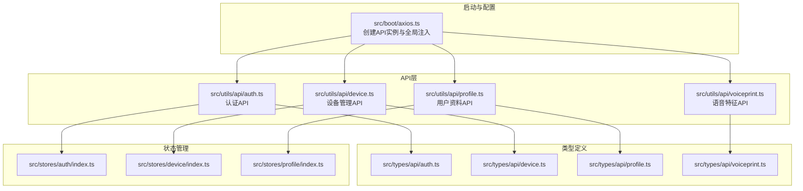
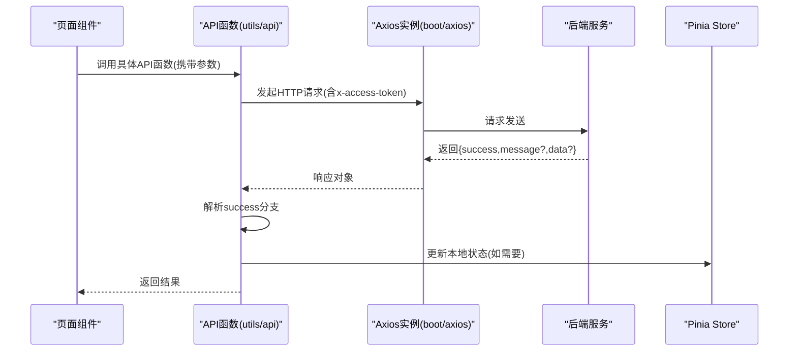
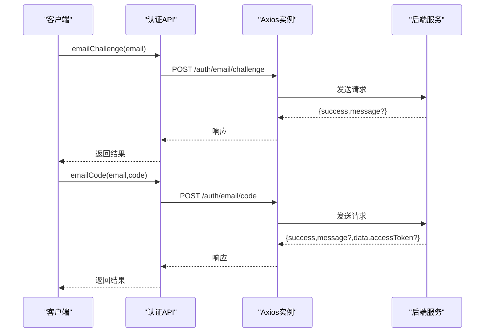
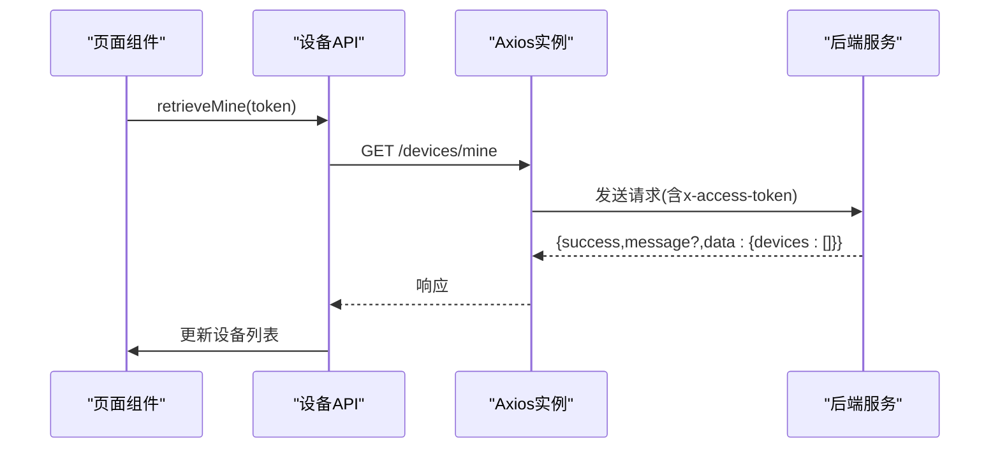
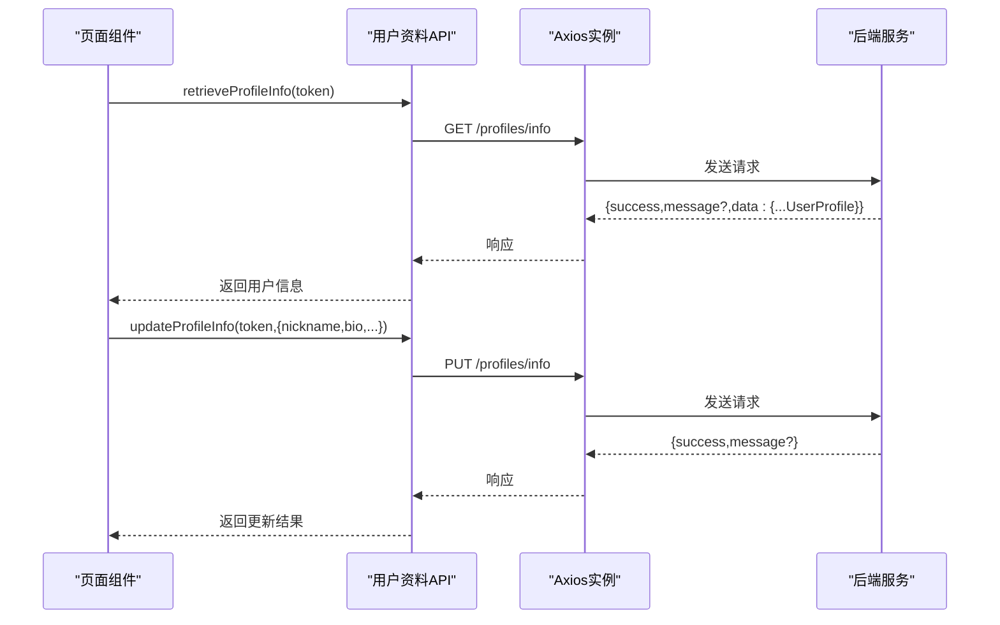
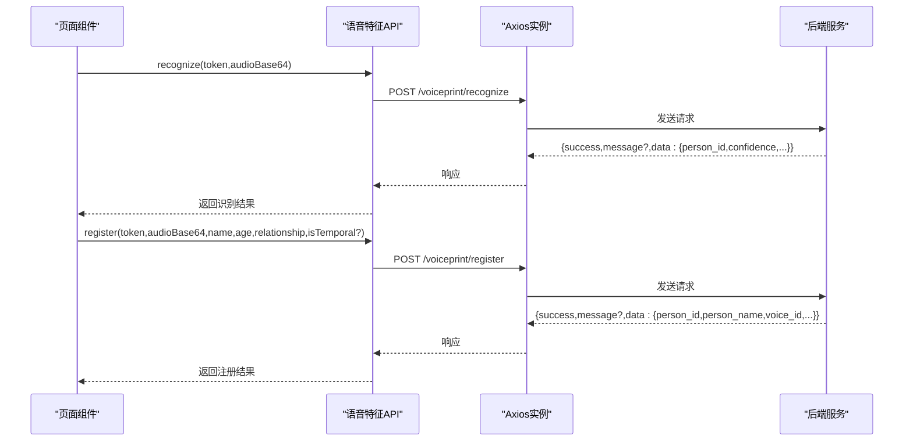
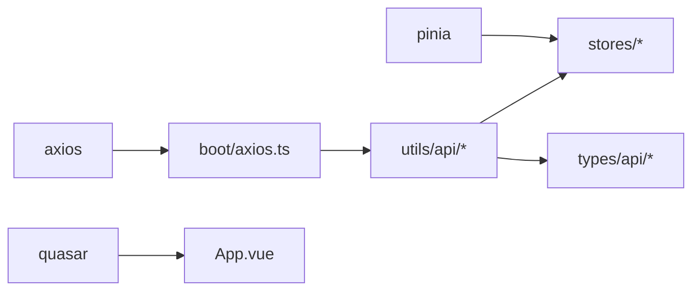

# API接口集成

<cite>
**本文引用的文件**
- [axios.ts](file://src/boot/axios.ts)
- [auth.ts（认证API）](file://src/utils/api/auth.ts)
- [device.ts（设备管理API）](file://src/utils/api/device.ts)
- [profile.ts（用户资料API）](file://src/utils/api/profile.ts)
- [voiceprint.ts（语音特征API）](file://src/utils/api/voiceprint.ts)
- [auth.ts（认证类型）](file://src/types/api/auth.ts)
- [device.ts（设备类型）](file://src/types/api/device.ts)
- [profile.ts（用户资料类型）](file://src/types/api/profile.ts)
- [voiceprint.ts（语音特征类型）](file://src/types/api/voiceprint.ts)
- [auth.ts（认证存储）](file://src/stores/auth/index.ts)
- [device.ts（设备存储）](file://src/stores/device/index.ts)
- [profile.ts（用户资料存储）](file://src/stores/profile/index.ts)
- [RecordPanel.vue（语音录制组件）](file://src/components/settings/voiceprint/RecordPanel.vue)
- [package.json](file://package.json)
</cite>

## 目录
1. [简介](#简介)
2. [项目结构](#项目结构)
3. [核心组件](#核心组件)
4. [架构总览](#架构总览)
5. [详细组件分析](#详细组件分析)
6. [依赖分析](#依赖分析)
7. [性能考虑](#性能考虑)
8. [故障排查指南](#故障排查指南)
9. [结论](#结论)
10. [附录](#附录)

## 简介
本文件面向Le Bot前端的API接口集成，系统性梳理RESTful API设计与实现，覆盖认证、语音特征、设备管理与用户资料四大模块。文档从接口规范、请求/响应格式、错误码与状态码处理、客户端封装与拦截机制、调用示例与参数校验、版本管理与兼容性、网络错误与重试、离线支持、测试与性能监控等方面进行深入说明，并提供可操作的实践建议。

## 项目结构
前端通过Axios实例统一发起HTTP请求，各业务模块在独立的utils/api目录下提供API函数，类型定义集中在src/types/api目录，状态管理采用Pinia Store进行本地持久化。

图表来源
- [axios.ts:1-27](file://src/boot/axios.ts#L1-L27)
- [auth.ts（认证API）:1-28](file://src/utils/api/auth.ts#L1-L28)
- [device.ts（设备管理API）:1-11](file://src/utils/api/device.ts#L1-L11)
- [profile.ts（用户资料API）:1-28](file://src/utils/api/profile.ts#L1-L28)
- [voiceprint.ts（语音特征API）:1-123](file://src/utils/api/voiceprint.ts#L1-L123)
- [auth.ts（认证类型）:1-19](file://src/types/api/auth.ts#L1-L19)
- [device.ts（设备类型）:1-14](file://src/types/api/device.ts#L1-L14)
- [profile.ts（用户资料类型）:1-33](file://src/types/api/profile.ts#L1-L33)
- [voiceprint.ts（语音特征类型）:1-98](file://src/types/api/voiceprint.ts#L1-L98)
- [auth.ts（认证存储）:1-35](file://src/stores/auth/index.ts#L1-L35)
- [device.ts（设备存储）:1-27](file://src/stores/device/index.ts#L1-L27)
- [profile.ts（用户资料存储）:1-25](file://src/stores/profile/index.ts#L1-L25)

章节来源
- [axios.ts:1-27](file://src/boot/axios.ts#L1-L27)
- [package.json:1-61](file://package.json#L1-L61)

## 核心组件
- Axios实例：在启动阶段创建带基础URL的API实例，并注入到全局属性，供全站使用。
- API函数：按业务域拆分，每个API函数负责一个或一组HTTP端点，统一携带访问令牌头。
- 类型定义：为每个端点返回值提供联合类型（success/false），确保强类型约束与错误分支处理。
- 存储：Pinia Store负责会话态、设备列表与用户资料的本地持久化，避免重复拉取。

章节来源
- [axios.ts:18-24](file://src/boot/axios.ts#L18-L24)
- [auth.ts（认证API）:1-28](file://src/utils/api/auth.ts#L1-L28)
- [device.ts（设备管理API）:1-11](file://src/utils/api/device.ts#L1-L11)
- [profile.ts（用户资料API）:1-28](file://src/utils/api/profile.ts#L1-L28)
- [voiceprint.ts（语音特征API）:1-123](file://src/utils/api/voiceprint.ts#L1-L123)
- [auth.ts（认证类型）:1-19](file://src/types/api/auth.ts#L1-L19)
- [device.ts（设备类型）:1-14](file://src/types/api/device.ts#L1-L14)
- [profile.ts（用户资料类型）:1-33](file://src/types/api/profile.ts#L1-L33)
- [voiceprint.ts（语音特征类型）:1-98](file://src/types/api/voiceprint.ts#L1-L98)
- [auth.ts（认证存储）:1-35](file://src/stores/auth/index.ts#L1-L35)
- [device.ts（设备存储）:1-27](file://src/stores/device/index.ts#L1-L27)
- [profile.ts（用户资料存储）:1-25](file://src/stores/profile/index.ts#L1-L25)

## 架构总览
下图展示API调用链路：页面组件通过API函数发起请求，Axios实例统一设置基础URL与访问令牌头；后端返回统一结构的响应体；前端根据success字段决定成功或失败分支，并更新对应Store。

图表来源
- [axios.ts:18-24](file://src/boot/axios.ts#L18-L24)
- [auth.ts（认证API）:21-27](file://src/utils/api/auth.ts#L21-L27)
- [device.ts（设备管理API）:5-10](file://src/utils/api/device.ts#L5-L10)
- [profile.ts（用户资料API）:22-27](file://src/utils/api/profile.ts#L22-L27)
- [voiceprint.ts（语音特征API）:15-26](file://src/utils/api/voiceprint.ts#L15-L26)

## 详细组件分析

### 认证API
- 接口范围
  - 邮箱挑战（发送验证码）
  - 邮箱验证码登录
  - 邮箱密码登录
  - 密码重置（需验证码）
  - 访问令牌校验
- 请求/响应要点
  - 所有接口均通过POST或GET发起。
  - 成功/失败统一返回结构：{success, message?, data?}。
  - 访问令牌校验通过请求头x-access-token传递。
- 错误码与状态码
  - 后端HTTP状态码未在代码中显式定义，建议遵循REST约定：4xx表示客户端错误（如参数无效、验证码错误、令牌无效），5xx表示服务器错误。
  - 统一错误结构中的message用于前端提示。
- 参数校验与数据转换
  - 邮箱格式校验应在前端完成；验证码长度与字符集限制由后端定义。
  - 登录成功后返回access token与用户标识信息，建议结合存储进行持久化。
- 使用示例路径
  - [邮箱挑战:5-7](file://src/utils/api/auth.ts#L5-L7)
  - [邮箱验证码登录:9-11](file://src/utils/api/auth.ts#L9-L11)
  - [邮箱密码登录:13-15](file://src/utils/api/auth.ts#L13-L15)
  - [密码重置:17-19](file://src/utils/api/auth.ts#L17-L19)
  - [访问令牌校验:21-27](file://src/utils/api/auth.ts#L21-L27)

图表来源
- [auth.ts（认证API）:5-11](file://src/utils/api/auth.ts#L5-L11)
- [axios.ts:18-24](file://src/boot/axios.ts#L18-L24)

章节来源
- [auth.ts（认证API）:1-28](file://src/utils/api/auth.ts#L1-L28)
- [auth.ts（认证类型）:1-19](file://src/types/api/auth.ts#L1-L19)
- [auth.ts（认证存储）:1-35](file://src/stores/auth/index.ts#L1-L35)

### 设备管理API
- 接口范围
  - 获取当前用户设备列表
- 请求/响应要点
  - 通过GET /devices/mine获取设备数组。
  - 返回结构包含success与data.devices。
- 参数与权限
  - 必须携带访问令牌头。
- 使用示例路径
  - [获取我的设备:5-10](file://src/utils/api/device.ts#L5-L10)

图表来源
- [device.ts（设备管理API）:5-10](file://src/utils/api/device.ts#L5-L10)
- [axios.ts:18-24](file://src/boot/axios.ts#L18-L24)

章节来源
- [device.ts（设备管理API）:1-11](file://src/utils/api/device.ts#L1-L11)
- [device.ts（设备类型）:1-14](file://src/types/api/device.ts#L1-L14)
- [device.ts（设备存储）:1-27](file://src/stores/device/index.ts#L1-L27)

### 用户资料API
- 接口范围
  - 获取头像信息
  - 获取用户基本信息
  - 更新用户基本信息
- 请求/响应要点
  - 头像与信息分别通过GET获取，信息更新通过PUT提交。
  - 统一返回结构：{success, message?, data?}。
- 参数与权限
  - 所有接口均需携带访问令牌头。
  - 更新时仅传入变更字段（可选字段）。
- 使用示例路径
  - [获取头像:8-13](file://src/utils/api/profile.ts#L8-L13)
  - [获取信息:15-20](file://src/utils/api/profile.ts#L15-L20)
  - [更新信息:22-27](file://src/utils/api/profile.ts#L22-L27)

图表来源
- [profile.ts（用户资料API）:15-27](file://src/utils/api/profile.ts#L15-L27)
- [axios.ts:18-24](file://src/boot/axios.ts#L18-L24)

章节来源
- [profile.ts（用户资料API）:1-28](file://src/utils/api/profile.ts#L1-L28)
- [profile.ts（用户资料类型）:1-33](file://src/types/api/profile.ts#L1-L33)
- [profile.ts（用户资料存储）:1-25](file://src/stores/profile/index.ts#L1-L25)

### 语音特征API
- 接口范围
  - 语音识别（声纹识别）
  - 语音注册（创建/绑定人员）
  - 查询人员列表与详情
  - 更新/删除人员
  - 为人员添加/更新/删除语音样本
- 请求/响应要点
  - 识别与注册均以POST提交音频Base64。
  - 列表查询使用GET，详情查询使用GET，更新/删除使用PUT/DELETE。
  - 统一返回结构：{success, message?, data?}。
- 参数与权限
  - 所有接口均需携带访问令牌头。
  - 注册时可选字段isTemporal控制临时人员；关系枚举来自组件常量。
- 使用示例路径
  - [识别:15-26](file://src/utils/api/voiceprint.ts#L15-L26)
  - [注册:28-52](file://src/utils/api/voiceprint.ts#L28-L52)
  - [查询人员列表:54-59](file://src/utils/api/voiceprint.ts#L54-L59)
  - [查询人员详情:68-73](file://src/utils/api/voiceprint.ts#L68-L73)
  - [更新人员:75-84](file://src/utils/api/voiceprint.ts#L75-L84)
  - [删除人员:61-66](file://src/utils/api/voiceprint.ts#L61-L66)
  - [添加语音样本:86-97](file://src/utils/api/voiceprint.ts#L86-L97)
  - [更新语音样本:106-122](file://src/utils/api/voiceprint.ts#L106-L122)
  - [删除语音样本:99-104](file://src/utils/api/voiceprint.ts#L99-L104)

图表来源
- [voiceprint.ts（语音特征API）:15-52](file://src/utils/api/voiceprint.ts#L15-L52)
- [axios.ts:18-24](file://src/boot/axios.ts#L18-L24)

章节来源
- [voiceprint.ts（语音特征API）:1-123](file://src/utils/api/voiceprint.ts#L1-L123)
- [voiceprint.ts（语音特征类型）:1-98](file://src/types/api/voiceprint.ts#L1-L98)
- [RecordPanel.vue（语音录制组件）:1-104](file://src/components/settings/voiceprint/RecordPanel.vue#L1-L104)

## 依赖分析
- 外部依赖
  - axios：HTTP客户端，提供请求/响应拦截能力。
  - pinia：状态管理，配合持久化插件实现跨会话数据保留。
  - quasar：UI框架，与Axios实例共同构成前端基础设施。
- 内部耦合
  - API函数对Axios实例存在直接依赖，便于集中配置与拦截。
  - Store与API函数松耦合，通过返回值驱动状态更新。
- 潜在循环依赖
  - 当前结构清晰，无明显循环依赖风险。

图表来源
- [axios.ts:1-27](file://src/boot/axios.ts#L1-L27)
- [auth.ts（认证API）:1-28](file://src/utils/api/auth.ts#L1-L28)
- [device.ts（设备管理API）:1-11](file://src/utils/api/device.ts#L1-L11)
- [profile.ts（用户资料API）:1-28](file://src/utils/api/profile.ts#L1-L28)
- [voiceprint.ts（语音特征API）:1-123](file://src/utils/api/voiceprint.ts#L1-L123)
- [auth.ts（认证存储）:1-35](file://src/stores/auth/index.ts#L1-L35)
- [device.ts（设备存储）:1-27](file://src/stores/device/index.ts#L1-L27)
- [profile.ts（用户资料存储）:1-25](file://src/stores/profile/index.ts#L1-L25)

章节来源
- [package.json:17-30](file://package.json#L17-L30)

## 性能考虑
- 请求合并与去抖
  - 对频繁触发的查询（如设备列表、用户资料）可引入去抖策略，减少不必要的网络请求。
- 缓存策略
  - 对只读数据（如用户资料快照）可在Store中缓存，避免重复拉取。
- 传输优化
  - 语音特征接口传输Base64音频，建议在前端进行压缩或分片上传，降低带宽占用。
- 并发控制
  - 对高并发场景（如批量添加语音样本）限制并发数，避免阻塞UI线程。
- 离线支持
  - 结合PWA与Workbox策略，对静态资源与关键接口进行预缓存与离线回退。

## 故障排查指南
- 常见问题
  - 401未授权：检查访问令牌是否正确传递与过期。
  - 400参数错误：核对请求体字段类型与必填项。
  - 500服务器错误：查看后端日志，定位异常堆栈。
- 错误处理流程
  - 统一在API函数中解析success字段，失败时读取message并提示用户。
  - 对网络异常（如超时、断网）进行捕获与重试。
- 重试机制
  - 对幂等请求（如GET、PUT）可自动重试，指数退避策略避免雪崩。
- 日志与监控
  - 在Axios拦截器中记录请求/响应摘要，结合埋点上报关键指标（成功率、耗时、错误码分布）。

## 结论
本项目采用清晰的模块化API设计，统一的Axios实例与类型约束保证了接口的一致性与可维护性。通过Pinia Store实现状态持久化，结合PWA能力提升用户体验。后续可在拦截器中完善鉴权与错误处理，在API层补充更细粒度的错误码与状态码映射，进一步增强系统的健壮性与可观测性。

## 附录

### API版本管理与兼容性
- 版本策略
  - 基础URL已包含/v1版本段，建议未来升级时采用/v2并在新端点提供兼容层。
- 向后兼容
  - 新增字段采用可选策略，避免破坏既有客户端逻辑。
- 迁移策略
  - 提供过渡期的双写与双读，逐步替换旧端点调用。

### 请求拦截器与响应处理
- 请求拦截器
  - 自动注入x-access-token头，必要时附加trace-id与客户端版本。
- 响应拦截器
  - 统一解析success字段，失败时抛出标准化错误对象，供上层捕获。
  - 对401未授权进行登出处理，刷新令牌或引导重新登录。

### API调用示例与参数校验
- 示例路径
  - [邮箱挑战:5-7](file://src/utils/api/auth.ts#L5-L7)
  - [语音识别:15-26](file://src/utils/api/voiceprint.ts#L15-L26)
- 参数校验
  - 前端对邮箱格式、验证码长度、音频Base64进行基础校验；后端负责业务规则校验。

### 数据转换方案
- 前端转换
  - 将Blob转为Base64用于上传；将时间字符串转换为本地时间显示。
- 后端转换
  - 统一日期格式与时区处理；对敏感字段进行脱敏。

### 测试方法与调试工具
- 单元测试
  - 对API函数返回值进行断言，模拟success与failure分支。
- 集成测试
  - 使用Mock服务验证端到端流程（登录->获取资料->更新）。
- 调试工具
  - 浏览器Network面板观察请求头与响应体；Console输出Axios拦截器日志。