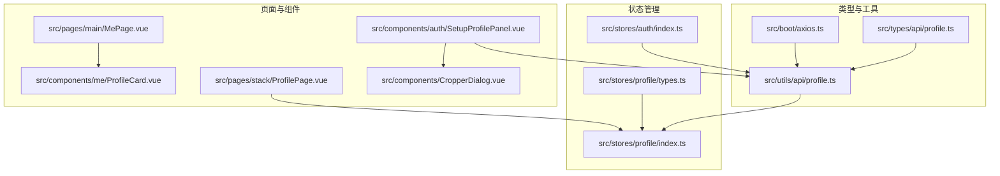
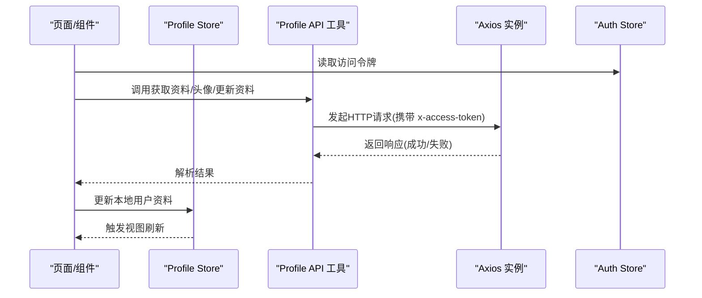
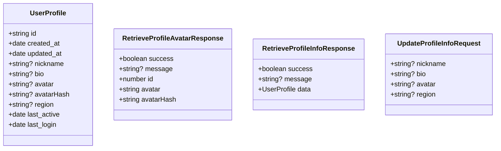
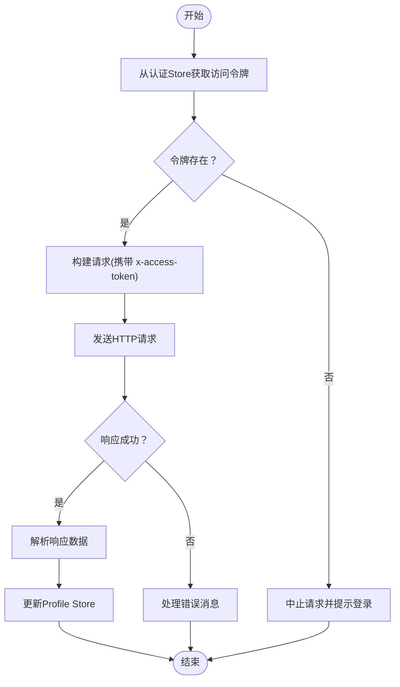
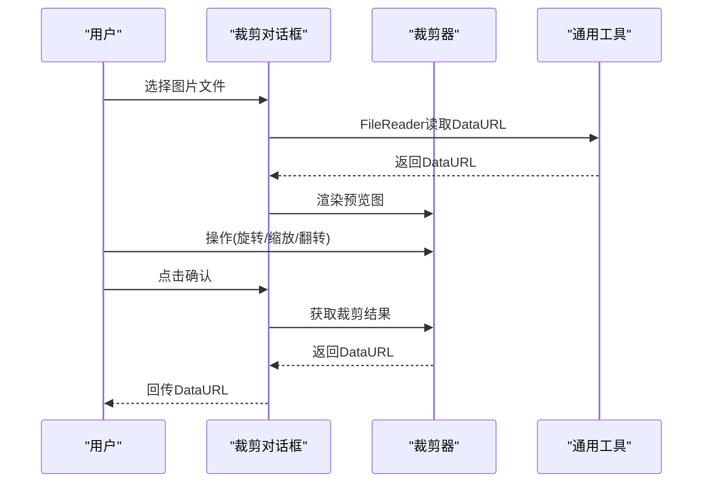
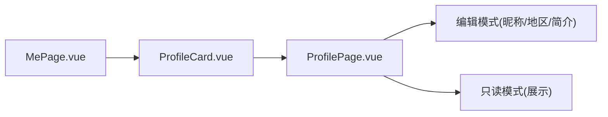
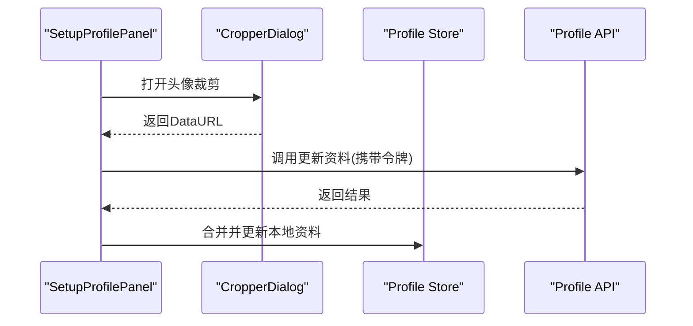
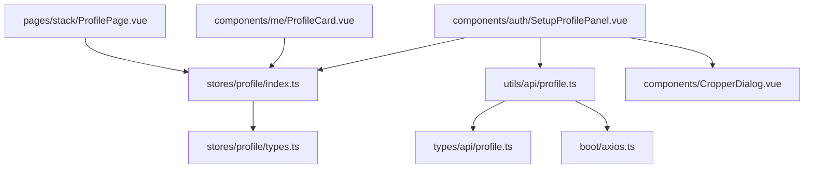

# 用户资料API

<cite>
**本文引用的文件**
- [src/types/api/profile.ts](file://src/types/api/profile.ts)
- [src/utils/api/profile.ts](file://src/utils/api/profile.ts)
- [src/stores/profile/index.ts](file://src/stores/profile/index.ts)
- [src/stores/profile/types.ts](file://src/stores/profile/types.ts)
- [src/boot/axios.ts](file://src/boot/axios.ts)
- [src/pages/main/MePage.vue](file://src/pages/main/MePage.vue)
- [src/components/me/ProfileCard.vue](file://src/components/me/ProfileCard.vue)
- [src/pages/stack/ProfilePage.vue](file://src/pages/stack/ProfilePage.vue)
- [src/components/CropperDialog.vue](file://src/components/CropperDialog.vue)
- [src/components/auth/SetupProfilePanel.vue](file://src/components/auth/SetupProfilePanel.vue)
- [src/stores/auth/index.ts](file://src/stores/auth/index.ts)
- [src/utils/validation.ts](file://src/utils/validation.ts)
- [src/utils/common.ts](file://src/utils/common.ts)
</cite>

## 目录
1. [简介](#简介)
2. [项目结构](#项目结构)
3. [核心组件](#核心组件)
4. [架构总览](#架构总览)
5. [详细组件分析](#详细组件分析)
6. [依赖关系分析](#依赖关系分析)
7. [性能考量](#性能考量)
8. [故障排查指南](#故障排查指南)
9. [结论](#结论)
10. [附录](#附录)

## 简介
本文件系统性梳理前端侧“用户资料”相关API与交互实现，覆盖以下能力：
- 获取用户头像与基本信息
- 更新用户昵称、简介、地区等基础资料
- 头像裁剪与本地预处理（不含后端上传）
- 个人设置页面与资料卡片展示
- 认证令牌传递与请求封装
- 基础数据校验与国际化文案

注意：当前仓库未发现后端头像上传接口的具体实现；本文档聚焦前端侧已实现的功能与调用方式，并在相应章节给出扩展建议。

## 项目结构
围绕用户资料的核心文件组织如下：
- 类型定义：统一描述请求/响应结构
- 工具函数：封装Axios请求与认证令牌传递
- Pinia Store：持久化存储用户资料
- 页面与组件：资料查看、编辑、头像裁剪入口
- 验证工具：邮箱/手机号格式校验

图表来源
- [src/types/api/profile.ts:1-33](file://src/types/api/profile.ts#L1-L33)
- [src/utils/api/profile.ts:1-28](file://src/utils/api/profile.ts#L1-L28)
- [src/boot/axios.ts:18](file://src/boot/axios.ts#L18)
- [src/stores/profile/index.ts:1-25](file://src/stores/profile/index.ts#L1-L25)
- [src/stores/profile/types.ts:1-13](file://src/stores/profile/types.ts#L1-L13)
- [src/stores/auth/index.ts:1-35](file://src/stores/auth/index.ts#L1-L35)
- [src/pages/main/MePage.vue:1-104](file://src/pages/main/MePage.vue#L1-L104)
- [src/components/me/ProfileCard.vue:1-48](file://src/components/me/ProfileCard.vue#L1-L48)
- [src/pages/stack/ProfilePage.vue:1-134](file://src/pages/stack/ProfilePage.vue#L1-L134)
- [src/components/CropperDialog.vue:1-154](file://src/components/CropperDialog.vue#L1-L154)
- [src/components/auth/SetupProfilePanel.vue:1-52](file://src/components/auth/SetupProfilePanel.vue#L1-L52)

章节来源
- [src/types/api/profile.ts:1-33](file://src/types/api/profile.ts#L1-L33)
- [src/utils/api/profile.ts:1-28](file://src/utils/api/profile.ts#L1-L28)
- [src/boot/axios.ts:18](file://src/boot/axios.ts#L18)
- [src/stores/profile/index.ts:1-25](file://src/stores/profile/index.ts#L1-L25)
- [src/stores/profile/types.ts:1-13](file://src/stores/profile/types.ts#L1-L13)
- [src/stores/auth/index.ts:1-35](file://src/stores/auth/index.ts#L1-L35)
- [src/pages/main/MePage.vue:1-104](file://src/pages/main/MePage.vue#L1-L104)
- [src/components/me/ProfileCard.vue:1-48](file://src/components/me/ProfileCard.vue#L1-L48)
- [src/pages/stack/ProfilePage.vue:1-134](file://src/pages/stack/ProfilePage.vue#L1-L134)
- [src/components/CropperDialog.vue:1-154](file://src/components/CropperDialog.vue#L1-L154)
- [src/components/auth/SetupProfilePanel.vue:1-52](file://src/components/auth/SetupProfilePanel.vue#L1-L52)

## 核心组件
- 类型与契约
  - 用户资料模型：包含标识、时间戳、昵称、简介、头像URL、头像哈希、地区、活跃与登录时间等字段
  - 请求/响应类型：头像获取、资料获取、资料更新的联合类型与可选字段
- 请求封装
  - 通过Axios实例统一构造HTTP请求，携带访问令牌作为自定义头部
  - 提供三个方法：获取头像、获取资料、更新资料
- 状态管理
  - 使用Pinia持久化存储用户资料
  - 在更新时保留已有头像以避免空值覆盖
- 页面与组件
  - 我的页面聚合菜单入口
  - 资料卡片用于展示头像与昵称，支持跳转到资料页或登录页
  - 资料页支持编辑昵称、地区、简介等字段
  - 头像裁剪对话框提供图片选择、旋转缩放、翻转与确认输出

章节来源
- [src/stores/profile/types.ts:1-13](file://src/stores/profile/types.ts#L1-L13)
- [src/types/api/profile.ts:1-33](file://src/types/api/profile.ts#L1-L33)
- [src/utils/api/profile.ts:1-28](file://src/utils/api/profile.ts#L1-L28)
- [src/stores/profile/index.ts:1-25](file://src/stores/profile/index.ts#L1-L25)
- [src/pages/main/MePage.vue:1-104](file://src/pages/main/MePage.vue#L1-L104)
- [src/components/me/ProfileCard.vue:1-48](file://src/components/me/ProfileCard.vue#L1-L48)
- [src/pages/stack/ProfilePage.vue:1-134](file://src/pages/stack/ProfilePage.vue#L1-L134)
- [src/components/CropperDialog.vue:1-154](file://src/components/CropperDialog.vue#L1-L154)

## 架构总览
前端侧用户资料API的调用链路如下：

图表来源
- [src/utils/api/profile.ts:8-27](file://src/utils/api/profile.ts#L8-L27)
- [src/boot/axios.ts:18](file://src/boot/axios.ts#L18)
- [src/stores/auth/index.ts:9-29](file://src/stores/auth/index.ts#L9-L29)
- [src/stores/profile/index.ts:11-16](file://src/stores/profile/index.ts#L11-L16)

## 详细组件分析

### 类型与数据模型
- 用户资料模型
  - 字段：标识、创建/更新时间、昵称、简介、头像URL、头像哈希、地区、最后活跃/登录时间
  - 设计要点：可选字段允许部分信息为空；头像哈希可用于缓存/一致性校验
- 接口契约
  - 头像获取：成功/失败二选一，成功时返回头像URL与哈希
  - 资料获取：成功/失败二选一，成功时返回完整用户资料
  - 资料更新：请求为可选字段集合；响应为通用成功/失败结构

图表来源
- [src/stores/profile/types.ts:1-13](file://src/stores/profile/types.ts#L1-L13)
- [src/types/api/profile.ts:3-25](file://src/types/api/profile.ts#L3-L25)
- [src/types/api/profile.ts:27-32](file://src/types/api/profile.ts#L27-L32)

章节来源
- [src/stores/profile/types.ts:1-13](file://src/stores/profile/types.ts#L1-L13)
- [src/types/api/profile.ts:1-33](file://src/types/api/profile.ts#L1-L33)

### 请求封装与认证
- Axios实例
  - 基础URL指向后端API v1路径
  - 全局注入$api供组件使用
- 访问令牌传递
  - 所有资料相关请求均通过自定义头部携带访问令牌
  - 认证令牌来自认证Store，确保在调用前可用
- 方法映射
  - 获取头像：GET /profiles/avatar
  - 获取资料：GET /profiles/info
  - 更新资料：PUT /profiles/info

图表来源
- [src/boot/axios.ts:18](file://src/boot/axios.ts#L18)
- [src/utils/api/profile.ts:8-27](file://src/utils/api/profile.ts#L8-L27)
- [src/stores/auth/index.ts:9-29](file://src/stores/auth/index.ts#L9-L29)

章节来源
- [src/boot/axios.ts:18](file://src/boot/axios.ts#L18)
- [src/utils/api/profile.ts:1-28](file://src/utils/api/profile.ts#L1-L28)
- [src/stores/auth/index.ts:1-35](file://src/stores/auth/index.ts#L1-L35)

### 头像裁剪与本地处理
- 功能概述
  - 支持图片选择、旋转、缩放、翻转
  - 输出裁剪后的DataURL，便于后续提交或预览
- 交互流程
  - 选择文件 -> FileReader读取DataURL -> 显示预览 -> 裁剪 -> 确认回调
- 注意事项
  - 当前仅完成本地裁剪与输出，未包含后端上传逻辑
  - 若需上传，请在调用资料更新接口时传入头像URL或Base64字符串（依据后端约定）

图表来源
- [src/components/CropperDialog.vue:35-45](file://src/components/CropperDialog.vue#L35-L45)
- [src/components/CropperDialog.vue:23-33](file://src/components/CropperDialog.vue#L23-L33)
- [src/utils/common.ts:3-29](file://src/utils/common.ts#L3-L29)

章节来源
- [src/components/CropperDialog.vue:1-154](file://src/components/CropperDialog.vue#L1-L154)
- [src/utils/common.ts:1-52](file://src/utils/common.ts#L1-L52)

### 资料页面与卡片
- 资料页
  - 展示头像、ID与可编辑字段（昵称、地区、简介）
  - 支持切换编辑模式，限制输入长度与自动增长
- 资料卡
  - 登录后显示头像与昵称，点击跳转至资料页
  - 未登录时引导跳转至登录页
- 我的页面
  - 聚合常用入口，包含资料页跳转

图表来源
- [src/pages/main/MePage.vue:1-104](file://src/pages/main/MePage.vue#L1-L104)
- [src/components/me/ProfileCard.vue:1-48](file://src/components/me/ProfileCard.vue#L1-L48)
- [src/pages/stack/ProfilePage.vue:1-134](file://src/pages/stack/ProfilePage.vue#L1-L134)

章节来源
- [src/pages/main/MePage.vue:1-104](file://src/pages/main/MePage.vue#L1-L104)
- [src/components/me/ProfileCard.vue:1-48](file://src/components/me/ProfileCard.vue#L1-L48)
- [src/pages/stack/ProfilePage.vue:1-134](file://src/pages/stack/ProfilePage.vue#L1-L134)

### 设置资料流程（含头像）
- 流程概览
  - 进入设置资料面板
  - 可打开裁剪对话框选择/裁剪头像
  - 填写昵称、简介、地区等
  - 调用更新资料接口提交
- 关键点
  - 令牌校验：在调用前确保访问令牌有效
  - 数据合并：若未更新头像则保留原头像

图表来源
- [src/components/auth/SetupProfilePanel.vue:31-46](file://src/components/auth/SetupProfilePanel.vue#L31-L46)
- [src/components/auth/SetupProfilePanel.vue:47-52](file://src/components/auth/SetupProfilePanel.vue#L47-L52)
- [src/stores/profile/index.ts:11-16](file://src/stores/profile/index.ts#L11-L16)
- [src/utils/api/profile.ts:22-27](file://src/utils/api/profile.ts#L22-L27)

章节来源
- [src/components/auth/SetupProfilePanel.vue:1-52](file://src/components/auth/SetupProfilePanel.vue#L1-L52)
- [src/stores/profile/index.ts:1-25](file://src/stores/profile/index.ts#L1-L25)
- [src/utils/api/profile.ts:1-28](file://src/utils/api/profile.ts#L1-L28)

## 依赖关系分析
- 组件耦合
  - 页面与组件通过Pinia Store解耦，便于复用与测试
  - API工具集中封装请求细节，降低重复代码
- 外部依赖
  - Axios用于HTTP通信
  - Quasar用于UI组件与通知
  - vue-advanced-cropper用于图片裁剪
- 可能的循环依赖
  - 当前模块间为单向依赖，无明显循环

图表来源
- [src/utils/api/profile.ts:1-28](file://src/utils/api/profile.ts#L1-L28)
- [src/types/api/profile.ts:1-33](file://src/types/api/profile.ts#L1-L33)
- [src/boot/axios.ts:18](file://src/boot/axios.ts#L18)
- [src/stores/profile/index.ts:1-25](file://src/stores/profile/index.ts#L1-L25)
- [src/stores/profile/types.ts:1-13](file://src/stores/profile/types.ts#L1-L13)
- [src/pages/stack/ProfilePage.vue:1-134](file://src/pages/stack/ProfilePage.vue#L1-L134)
- [src/components/me/ProfileCard.vue:1-48](file://src/components/me/ProfileCard.vue#L1-L48)
- [src/components/auth/SetupProfilePanel.vue:1-52](file://src/components/auth/SetupProfilePanel.vue#L1-L52)
- [src/components/CropperDialog.vue:1-154](file://src/components/CropperDialog.vue#L1-L154)

章节来源
- [src/utils/api/profile.ts:1-28](file://src/utils/api/profile.ts#L1-L28)
- [src/stores/profile/index.ts:1-25](file://src/stores/profile/index.ts#L1-L25)
- [src/pages/stack/ProfilePage.vue:1-134](file://src/pages/stack/ProfilePage.vue#L1-L134)
- [src/components/me/ProfileCard.vue:1-48](file://src/components/me/ProfileCard.vue#L1-L48)
- [src/components/auth/SetupProfilePanel.vue:1-52](file://src/components/auth/SetupProfilePanel.vue#L1-L52)
- [src/components/CropperDialog.vue:1-154](file://src/components/CropperDialog.vue#L1-L154)

## 性能考量
- 请求合并与去抖
  - 对频繁触发的资料更新建议增加防抖，减少不必要的网络请求
- 图片处理
  - 本地裁剪后DataURL体积较大，建议在提交前进行压缩（如调整质量参数）或转换为Blob再上传
- 缓存策略
  - 头像哈希可用于客户端缓存命中判断，避免重复下载
- UI渲染
  - 使用浅层响应式与按需渲染，避免大列表或复杂计算阻塞主线程

## 故障排查指南
- 令牌缺失
  - 现象：请求被拒绝或返回未授权
  - 处理：检查认证Store中的访问令牌是否为空或过期
- 网络异常
  - 现象：请求超时或连接失败
  - 处理：确认Axios基础URL正确，网络连通性正常
- 数据解析错误
  - 现象：响应结构不符合预期
  - 处理：核对类型定义与后端返回一致；必要时添加字段校验
- 头像裁剪失败
  - 现象：无法生成DataURL或裁剪无效
  - 处理：检查文件类型与大小限制，确认裁剪器初始化完成
- 输入校验
  - 建议：在提交前对邮箱/手机号进行格式校验，避免无效数据进入后端

章节来源
- [src/stores/auth/index.ts:9-29](file://src/stores/auth/index.ts#L9-L29)
- [src/utils/validation.ts:1-7](file://src/utils/validation.ts#L1-L7)
- [src/components/CropperDialog.vue:47-52](file://src/components/CropperDialog.vue#L47-L52)

## 结论
本项目在前端侧已完整实现用户资料的获取、更新与头像本地裁剪能力，并通过Pinia实现持久化存储与状态同步。建议后续补充后端头像上传接口与鉴权策略，完善头像压缩与上传流程，同时加强输入校验与错误提示，提升整体安全性与用户体验。

## 附录

### API规范摘要
- 获取头像
  - 方法：GET
  - 路径：/profiles/avatar
  - 头部：x-access-token
  - 成功响应：包含头像URL与哈希
- 获取资料
  - 方法：GET
  - 路径：/profiles/info
  - 头部：x-access-token
  - 成功响应：完整用户资料对象
- 更新资料
  - 方法：PUT
  - 路径：/profiles/info
  - 头部：x-access-token
  - 请求体：可选字段集合（昵称、简介、头像、地区）
  - 成功响应：通用成功/失败结构

章节来源
- [src/utils/api/profile.ts:8-27](file://src/utils/api/profile.ts#L8-L27)
- [src/types/api/profile.ts:3-25](file://src/types/api/profile.ts#L3-L25)
- [src/types/api/profile.ts:27-32](file://src/types/api/profile.ts#L27-L32)