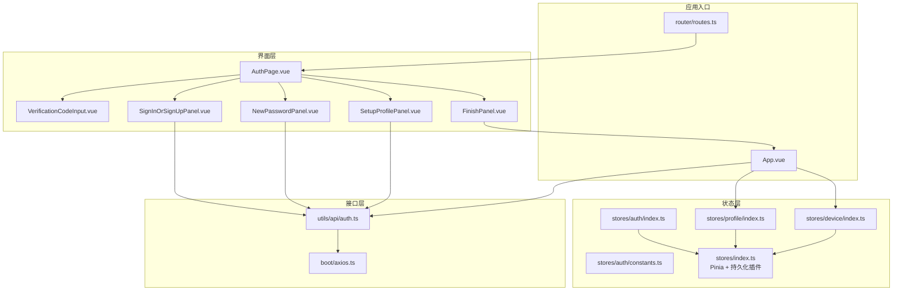
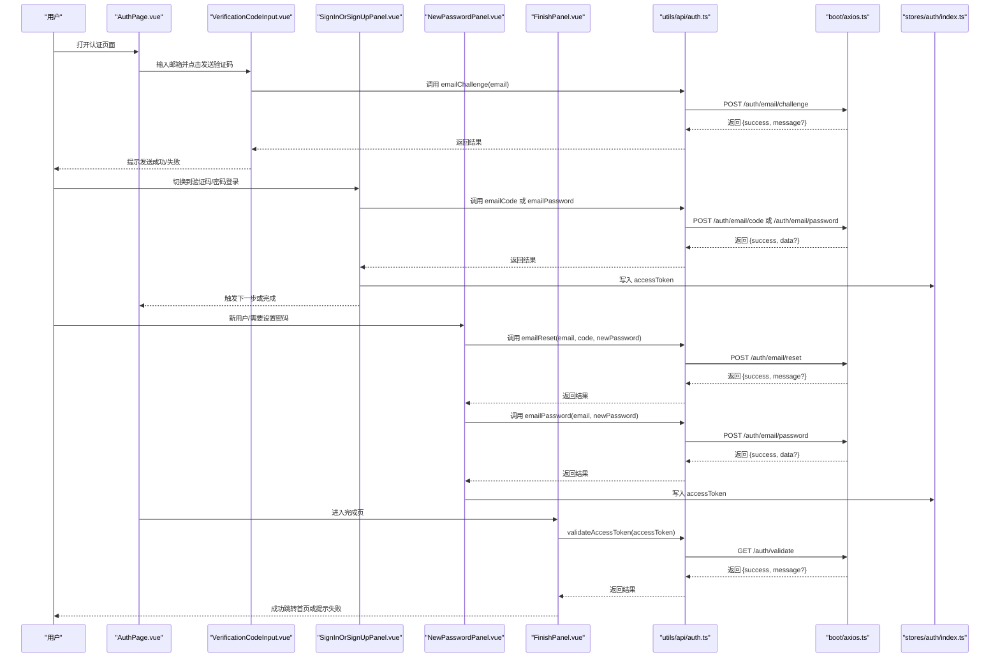
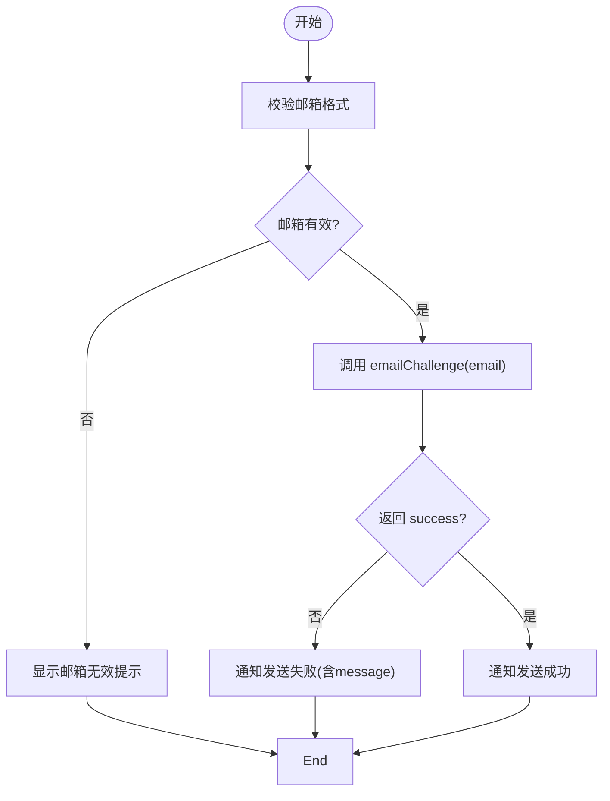
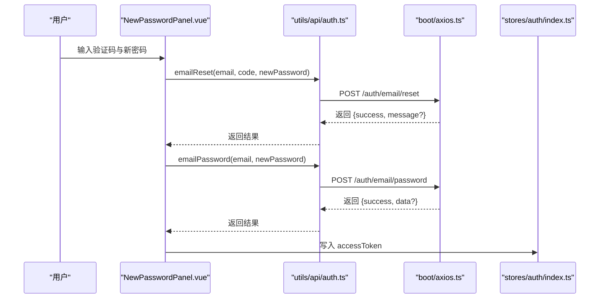
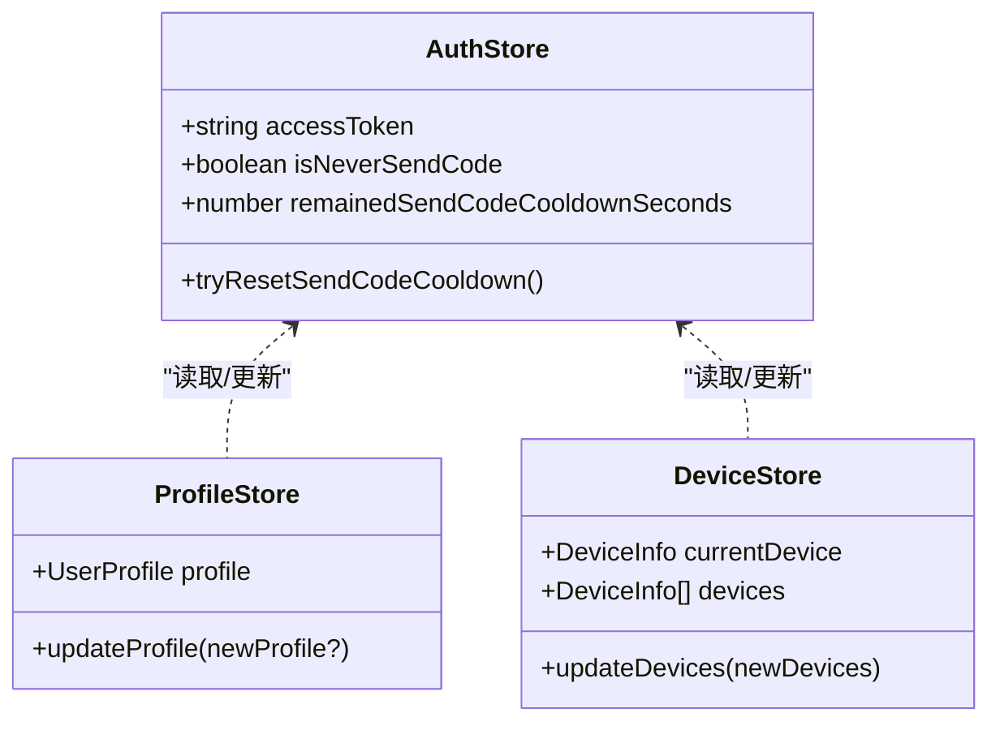
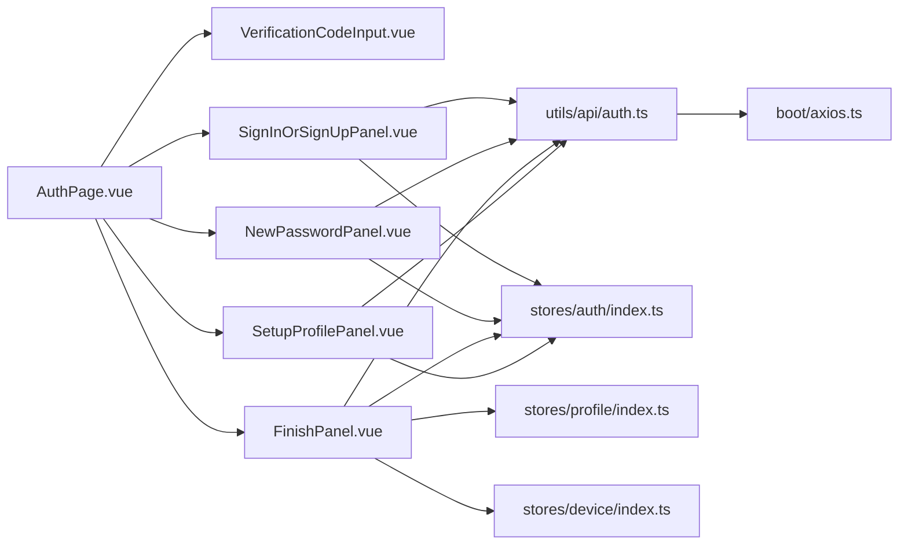

# 认证API

<cite>
**本文引用的文件**
- [src/utils/api/auth.ts](file://src/utils/api/auth.ts)
- [src/tabs/api/auth.ts](file://src/types/api/auth.ts)
- [src/components/auth/VerificationCodeInput.vue](file://src/components/auth/VerificationCodeInput.vue)
- [src/components/auth/SignInOrSignUpPanel.vue](file://src/components/auth/SignInOrSignUpPanel.vue)
- [src/components/auth/NewPasswordPanel.vue](file://src/components/auth/NewPasswordPanel.vue)
- [src/components/auth/FinishPanel.vue](file://src/components/auth/FinishPanel.vue)
- [src/components/auth/SetupProfilePanel.vue](file://src/components/auth/SetupProfilePanel.vue)
- [src/stores/auth/index.ts](file://src/stores/auth/index.ts)
- [src/stores/auth/constants.ts](file://src/stores/auth/constants.ts)
- [src/boot/axios.ts](file://src/boot/axios.ts)
- [src/pages/stack/AuthPage.vue](file://src/pages/stack/AuthPage.vue)
- [src/router/routes.ts](file://src/router/routes.ts)
- [src/utils/account.ts](file://src/utils/account.ts)
- [src/App.vue](file://src/App.vue)
- [src/stores/index.ts](file://src/stores/index.ts)
- [src/stores/profile/index.ts](file://src/stores/profile/index.ts)
- [src/stores/device/index.ts](file://src/stores/device/index.ts)
</cite>

## 目录
1. [简介](#简介)
2. [项目结构](#项目结构)
3. [核心组件](#核心组件)
4. [架构总览](#架构总览)
5. [详细组件分析](#详细组件分析)
6. [依赖关系分析](#依赖关系分析)
7. [性能考量](#性能考量)
8. [故障排查指南](#故障排查指南)
9. [结论](#结论)
10. [附录](#附录)

## 简介
本文件系统性梳理前端认证API的实现与使用方式，覆盖邮箱验证挑战、验证码登录、密码登录、密码重置以及访问令牌验证等流程。文档从架构、组件交互、数据流、错误处理、状态持久化到安全最佳实践进行完整说明，并提供调用示例、参数校验规则与数据转换方案，帮助开发者快速理解与集成。

## 项目结构
认证相关功能主要由以下层次构成：
- 接口层：封装认证HTTP接口（Axios实例）
- 类型层：统一返回体类型定义
- 组件层：用户交互界面（验证码输入、登录/注册面板、新密码设置、完成页、资料设置）
- 状态层：认证状态与持久化（Pinia + 持久化插件）
- 应用入口：应用启动时的令牌校验与本地状态同步

图表来源
- [src/pages/stack/AuthPage.vue:1-69](file://src/pages/stack/AuthPage.vue#L1-L69)
- [src/components/auth/VerificationCodeInput.vue:1-92](file://src/components/auth/VerificationCodeInput.vue#L1-L92)
- [src/components/auth/SignInOrSignUpPanel.vue:1-117](file://src/components/auth/SignInOrSignUpPanel.vue#L1-L117)
- [src/components/auth/NewPasswordPanel.vue:1-119](file://src/components/auth/NewPasswordPanel.vue#L1-L119)
- [src/components/auth/FinishPanel.vue:1-80](file://src/components/auth/FinishPanel.vue#L1-L80)
- [src/components/auth/SetupProfilePanel.vue:1-133](file://src/components/auth/SetupProfilePanel.vue#L1-L133)
- [src/stores/auth/index.ts:1-35](file://src/stores/auth/index.ts#L1-L35)
- [src/stores/auth/constants.ts:1-2](file://src/stores/auth/constants.ts#L1-L2)
- [src/stores/index.ts:1-35](file://src/stores/index.ts#L1-L35)
- [src/stores/profile/index.ts:1-24](file://src/stores/profile/index.ts#L1-L24)
- [src/stores/device/index.ts:1-26](file://src/stores/device/index.ts#L1-L26)
- [src/utils/api/auth.ts:1-28](file://src/utils/api/auth.ts#L1-L28)
- [src/boot/axios.ts:1-27](file://src/boot/axios.ts#L1-L27)
- [src/App.vue:1-40](file://src/App.vue#L1-L40)
- [src/router/routes.ts:1-160](file://src/router/routes.ts#L1-L160)

章节来源
- [src/pages/stack/AuthPage.vue:1-69](file://src/pages/stack/AuthPage.vue#L1-L69)
- [src/router/routes.ts:1-160](file://src/router/routes.ts#L1-L160)

## 核心组件
- 验证码挑战接口：向后端发送邮箱，触发验证码下发
- 验证码登录接口：使用邮箱+验证码登录
- 密码登录接口：使用邮箱+密码登录
- 密码重置接口：使用邮箱+验证码+新密码重置后自动登录
- 访问令牌验证接口：校验客户端持有的访问令牌有效性
- 前端状态管理：保存访问令牌、冷却时间、持久化存储
- 用户界面：验证码输入、登录/注册切换、新密码设置、完成页、资料设置

章节来源
- [src/utils/api/auth.ts:1-28](file://src/utils/api/auth.ts#L1-L28)
- [src/tabs/api/auth.ts:1-19](file://src/types/api/auth.ts#L1-L19)
- [src/stores/auth/index.ts:1-35](file://src/stores/auth/index.ts#L1-L35)
- [src/stores/auth/constants.ts:1-2](file://src/stores/auth/constants.ts#L1-L2)

## 架构总览
认证流程在前端以“页面容器 + 多步骤面板”的形式组织，通过Pinia状态驱动UI与接口调用；Axios实例统一构造请求URL与头部信息；应用启动时对访问令牌进行校验并拉取用户资料与设备列表。

图表来源
- [src/pages/stack/AuthPage.vue:1-69](file://src/pages/stack/AuthPage.vue#L1-L69)
- [src/components/auth/VerificationCodeInput.vue:1-92](file://src/components/auth/VerificationCodeInput.vue#L1-L92)
- [src/components/auth/SignInOrSignUpPanel.vue:1-117](file://src/components/auth/SignInOrSignUpPanel.vue#L1-L117)
- [src/components/auth/NewPasswordPanel.vue:1-119](file://src/components/auth/NewPasswordPanel.vue#L1-L119)
- [src/components/auth/FinishPanel.vue:1-80](file://src/components/auth/FinishPanel.vue#L1-L80)
- [src/utils/api/auth.ts:1-28](file://src/utils/api/auth.ts#L1-L28)
- [src/boot/axios.ts:1-27](file://src/boot/axios.ts#L1-L27)
- [src/stores/auth/index.ts:1-35](file://src/stores/auth/index.ts#L1-L35)

## 详细组件分析

### 验证码挑战（邮箱验证挑战）
- 功能说明：向指定邮箱发送验证码，用于后续验证码登录或密码重置。
- 请求参数
  - email: 字符串，必填，邮箱格式校验
- 响应格式
  - 成功：{ success: true }
  - 失败：{ success: false, message: string }
- 错误处理
  - UI提示发送失败与具体原因
  - 发送冷却：60秒内不可重复发送
- 参数校验
  - 邮箱格式正则校验
- 数据转换
  - 无额外转换，直接POST到 /auth/email/challenge

图表来源
- [src/components/auth/VerificationCodeInput.vue:24-53](file://src/components/auth/VerificationCodeInput.vue#L24-L53)
- [src/utils/api/auth.ts:5-7](file://src/utils/api/auth.ts#L5-L7)

章节来源
- [src/components/auth/VerificationCodeInput.vue:1-92](file://src/components/auth/VerificationCodeInput.vue#L1-L92)
- [src/utils/api/auth.ts:1-28](file://src/utils/api/auth.ts#L1-L28)
- [src/stores/auth/constants.ts:1-2](file://src/stores/auth/constants.ts#L1-L2)

### 验证码登录（邮箱+验证码）
- 功能说明：使用邮箱+6位验证码登录，返回访问令牌及用户状态信息。
- 请求参数
  - email: 字符串，必填
  - code: 字符串，必填，长度为6
- 响应格式
  - 成功：{ success: true, data: { accessToken, isNew, noPassword } }
  - 失败：{ success: false, message: string }
- 错误处理
  - UI提示错误消息
  - 写入 accessToken 到全局状态
- 参数校验
  - 验证码长度必须为6
- 数据转换
  - 将返回的 accessToken 写入 Pinia 状态

章节来源
- [src/components/auth/SignInOrSignUpPanel.vue:40-75](file://src/components/auth/SignInOrSignUpPanel.vue#L40-L75)
- [src/utils/api/auth.ts:9-11](file://src/utils/api/auth.ts#L9-L11)
- [src/tabs/api/auth.ts:8-18](file://src/types/api/auth.ts#L8-L18)
- [src/stores/auth/index.ts:24-29](file://src/stores/auth/index.ts#L24-L29)

### 密码登录（邮箱+密码）
- 功能说明：使用邮箱+密码登录，返回访问令牌及用户状态信息。
- 请求参数
  - email: 字符串，必填
  - password: 字符串，必填
- 响应格式
  - 成功：{ success: true, data: { accessToken, isNew, noPassword } }
  - 失败：{ success: false, message: string }
- 错误处理
  - UI提示错误消息
  - 写入 accessToken 到全局状态
- 参数校验
  - 密码非空
- 数据转换
  - 将返回的 accessToken 写入 Pinia 状态

章节来源
- [src/components/auth/SignInOrSignUpPanel.vue:40-75](file://src/components/auth/SignInOrSignUpPanel.vue#L40-L75)
- [src/utils/api/auth.ts:13-15](file://src/utils/api/auth.ts#L13-L15)
- [src/tabs/api/auth.ts:8-18](file://src/types/api/auth.ts#L8-L18)
- [src/stores/auth/index.ts:24-29](file://src/stores/auth/index.ts#L24-L29)

### 密码重置（邮箱+验证码+新密码）
- 功能说明：使用邮箱+验证码+新密码重置密码，随后自动以新密码登录。
- 请求参数
  - email: 字符串，必填
  - code: 字符串，必填，长度为6
  - newPassword: 字符串，必填，长度≥8
- 响应格式
  - 成功：{ success: true }
  - 失败：{ success: false, message: string }
- 错误处理
  - UI提示重置结果
  - 成功后自动调用密码登录并写入 accessToken
- 参数校验
  - 验证码长度为6
  - 新密码长度≥8
- 数据转换
  - 先调用 emailReset，再调用 emailPassword

图表来源
- [src/components/auth/NewPasswordPanel.vue:35-71](file://src/components/auth/NewPasswordPanel.vue#L35-L71)
- [src/utils/api/auth.ts:17-27](file://src/utils/api/auth.ts#L17-L27)
- [src/stores/auth/index.ts:24-29](file://src/stores/auth/index.ts#L24-L29)

章节来源
- [src/components/auth/NewPasswordPanel.vue:1-119](file://src/components/auth/NewPasswordPanel.vue#L1-L119)
- [src/utils/api/auth.ts:1-28](file://src/utils/api/auth.ts#L1-L28)

### 访问令牌验证
- 功能说明：校验客户端持有的访问令牌是否有效。
- 请求参数
  - accessToken: 字符串，必填
- 请求头
  - x-access-token: accessToken
- 响应格式
  - { success: boolean, message?: string }
- 错误处理
  - UI提示失败并清理本地状态
- 数据转换
  - 无额外转换，GET请求

章节来源
- [src/utils/api/auth.ts:21-27](file://src/utils/api/auth.ts#L21-L27)
- [src/components/auth/FinishPanel.vue:39-58](file://src/components/auth/FinishPanel.vue#L39-L58)

### 前端状态管理与持久化
- 认证状态
  - accessToken: 当前用户的访问令牌
  - isNeverSendCode: 是否从未发送过验证码
  - remainedSendCodeCooldownSeconds: 验证码发送冷却剩余秒数
  - tryResetSendCodeCooldown: 在冷却结束后重置冷却状态
- 持久化策略
  - 使用 Pinia + 持久化插件，重启后仍保留认证状态
- 与其他状态的关系
  - ProfileStore：保存用户资料
  - DeviceStore：保存设备列表与当前设备

图表来源
- [src/stores/auth/index.ts:1-35](file://src/stores/auth/index.ts#L1-L35)
- [src/stores/profile/index.ts:1-24](file://src/stores/profile/index.ts#L1-L24)
- [src/stores/device/index.ts:1-26](file://src/stores/device/index.ts#L1-L26)
- [src/stores/index.ts:26-35](file://src/stores/index.ts#L26-L35)

章节来源
- [src/stores/auth/index.ts:1-35](file://src/stores/auth/index.ts#L1-L35)
- [src/stores/auth/constants.ts:1-2](file://src/stores/auth/constants.ts#L1-L2)
- [src/stores/profile/index.ts:1-24](file://src/stores/profile/index.ts#L1-L24)
- [src/stores/device/index.ts:1-26](file://src/stores/device/index.ts#L1-L26)
- [src/stores/index.ts:1-35](file://src/stores/index.ts#L1-L35)

### 应用启动时的令牌校验与状态同步
- 启动流程
  - 读取本地 accessToken
  - 调用 validateAccessToken 校验
  - 成功：拉取设备列表与用户资料，写入对应Store
  - 失败：清空登录态并刷新页面
- 作用
  - 保证应用启动时的会话一致性与安全性

章节来源
- [src/App.vue:13-40](file://src/App.vue#L13-L40)
- [src/utils/account.ts:17-40](file://src/utils/account.ts#L17-L40)

## 依赖关系分析
- 组件依赖
  - AuthPage 作为容器，组合多个子面板
  - 子面板依赖 utils/api/auth.ts 的接口方法
  - 子面板依赖 stores/auth/index.ts 的状态
- 状态依赖
  - AuthStore 与 ProfileStore/DeviceStore 协作
  - Pinia 持久化确保跨会话状态保持
- 网络依赖
  - axios 实例统一配置基础URL
  - 所有认证接口通过 /api/v1 前缀访问

图表来源
- [src/pages/stack/AuthPage.vue:1-69](file://src/pages/stack/AuthPage.vue#L1-L69)
- [src/components/auth/VerificationCodeInput.vue:1-92](file://src/components/auth/VerificationCodeInput.vue#L1-L92)
- [src/components/auth/SignInOrSignUpPanel.vue:1-117](file://src/components/auth/SignInOrSignUpPanel.vue#L1-L117)
- [src/components/auth/NewPasswordPanel.vue:1-119](file://src/components/auth/NewPasswordPanel.vue#L1-L119)
- [src/components/auth/FinishPanel.vue:1-80](file://src/components/auth/FinishPanel.vue#L1-L80)
- [src/components/auth/SetupProfilePanel.vue:1-133](file://src/components/auth/SetupProfilePanel.vue#L1-L133)
- [src/utils/api/auth.ts:1-28](file://src/utils/api/auth.ts#L1-L28)
- [src/stores/auth/index.ts:1-35](file://src/stores/auth/index.ts#L1-L35)
- [src/stores/profile/index.ts:1-24](file://src/stores/profile/index.ts#L1-L24)
- [src/stores/device/index.ts:1-26](file://src/stores/device/index.ts#L1-L26)
- [src/boot/axios.ts:1-27](file://src/boot/axios.ts#L1-L27)

章节来源
- [src/boot/axios.ts:18](file://src/boot/axios.ts#L18)
- [src/router/routes.ts:54-60](file://src/router/routes.ts#L54-L60)

## 性能考量
- 请求合并与去抖
  - 验证码发送冷却（60秒）避免频繁请求
- 状态缓存
  - ProfileStore/DeviceStore 持久化减少重复拉取
- UI渲染
  - 条件渲染与懒加载组件，降低首屏压力
- 网络层
  - 统一基础URL，减少配置成本

## 故障排查指南
- 常见问题
  - 验证码未收到：检查邮箱格式、冷却时间、网络异常
  - 登录失败：确认邮箱/密码或验证码正确性
  - 令牌失效：调用 validateAccessToken，失败则清空状态并重新登录
- 日志与提示
  - UI通过通知组件反馈错误与成功信息
  - 控制台输出失败原因便于调试
- 清理与恢复
  - 调用登出逻辑清理状态并刷新页面

章节来源
- [src/components/auth/VerificationCodeInput.vue:30-53](file://src/components/auth/VerificationCodeInput.vue#L30-L53)
- [src/components/auth/SignInOrSignUpPanel.vue:50-75](file://src/components/auth/SignInOrSignUpPanel.vue#L50-L75)
- [src/components/auth/NewPasswordPanel.vue:35-71](file://src/components/auth/NewPasswordPanel.vue#L35-L71)
- [src/components/auth/FinishPanel.vue:39-58](file://src/components/auth/FinishPanel.vue#L39-L58)
- [src/utils/account.ts:7-15](file://src/utils/account.ts#L7-L15)

## 结论
该认证体系以清晰的分层设计与完善的前端状态管理实现，覆盖邮箱验证挑战、验证码登录、密码登录、密码重置与访问令牌验证等核心场景。通过Pinia持久化与应用启动校验，保障了用户体验与安全性。建议在后端配合严格的令牌签发与刷新策略，进一步强化整体安全。

## 附录

### API 定义与调用示例

- 邮箱验证挑战
  - 方法：POST
  - 路径：/auth/email/challenge
  - 请求体：{ email }
  - 响应：{ success: boolean, message?: string }

- 验证码登录
  - 方法：POST
  - 路径：/auth/email/code
  - 请求体：{ email, code }
  - 响应：{ success: boolean, data?: { accessToken, isNew, noPassword } }

- 密码登录
  - 方法：POST
  - 路径：/auth/email/password
  - 请求体：{ email, password }
  - 响应：{ success: boolean, data?: { accessToken, isNew, noPassword } }

- 密码重置
  - 方法：POST
  - 路径：/auth/email/reset
  - 请求体：{ email, code, newPassword }
  - 响应：{ success: boolean, message?: string }

- 访问令牌验证
  - 方法：GET
  - 路径：/auth/validate
  - 请求头：x-access-token: accessToken
  - 响应：{ success: boolean, message?: string }

章节来源
- [src/utils/api/auth.ts:5-27](file://src/utils/api/auth.ts#L5-L27)
- [src/tabs/api/auth.ts:1-19](file://src/types/api/auth.ts#L1-L19)

### 参数验证规则
- 邮箱格式：支持标准邮箱正则
- 验证码：长度为6
- 密码：长度≥8
- 通用：非空校验

章节来源
- [src/components/auth/VerificationCodeInput.vue:22-27](file://src/components/auth/VerificationCodeInput.vue#L22-L27)
- [src/components/auth/SignInOrSignUpPanel.vue:35-38](file://src/components/auth/SignInOrSignUpPanel.vue#L35-L38)
- [src/components/auth/NewPasswordPanel.vue:30-33](file://src/components/auth/NewPasswordPanel.vue#L30-L33)
- [src/utils/validation.ts:1-7](file://src/utils/validation.ts#L1-L7)

### 数据转换方案
- 接口返回统一为 { success, data?, message? }
- 成功时写入 accessToken 到 Pinia
- 失败时展示 message 并阻止继续流程

章节来源
- [src/tabs/api/auth.ts:1-19](file://src/types/api/auth.ts#L1-L19)
- [src/components/auth/SignInOrSignUpPanel.vue:50-68](file://src/components/auth/SignInOrSignUpPanel.vue#L50-L68)
- [src/components/auth/NewPasswordPanel.vue:39-61](file://src/components/auth/NewPasswordPanel.vue#L39-L61)

### JWT 令牌管理与会话状态持久化
- 令牌存储：Pinia 状态中保存 accessToken
- 持久化：启用 Pinia 持久化插件，重启后仍可用
- 应用启动：校验令牌并拉取用户资料与设备列表
- 登出：清空 accessToken、Profile/Device 状态并跳转首页

章节来源
- [src/stores/auth/index.ts:24-29](file://src/stores/auth/index.ts#L24-L29)
- [src/stores/index.ts:26-35](file://src/stores/index.ts#L26-L35)
- [src/App.vue:13-40](file://src/App.vue#L13-L40)
- [src/utils/account.ts:7-15](file://src/utils/account.ts#L7-L15)

### 安全考虑与最佳实践
- 传输安全：生产环境使用 HTTPS
- 令牌保护：避免在日志中打印令牌
- 前端限制：验证码冷却、输入长度与格式校验
- 服务端配合：短有效期令牌、刷新策略、防暴力破解

[本节为通用指导，无需特定文件引用]