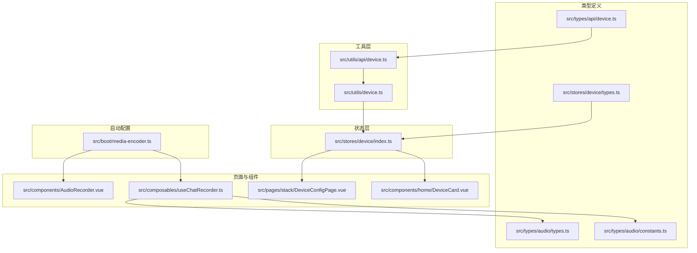
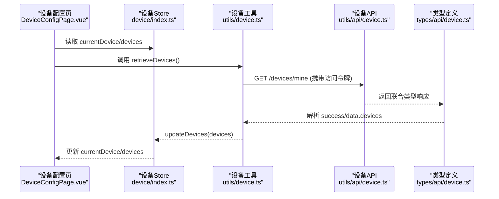
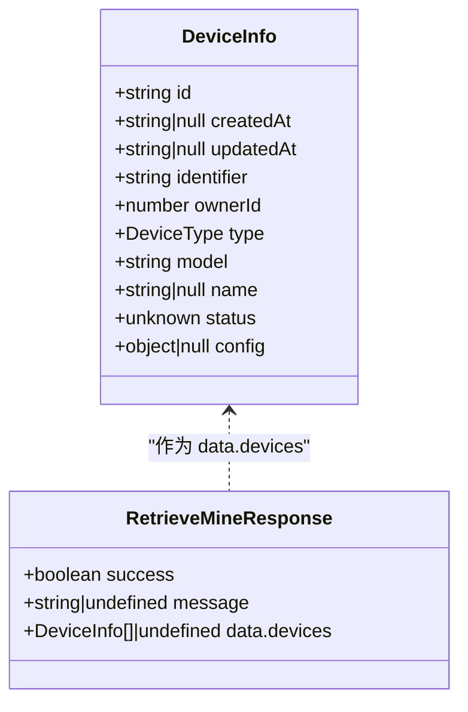
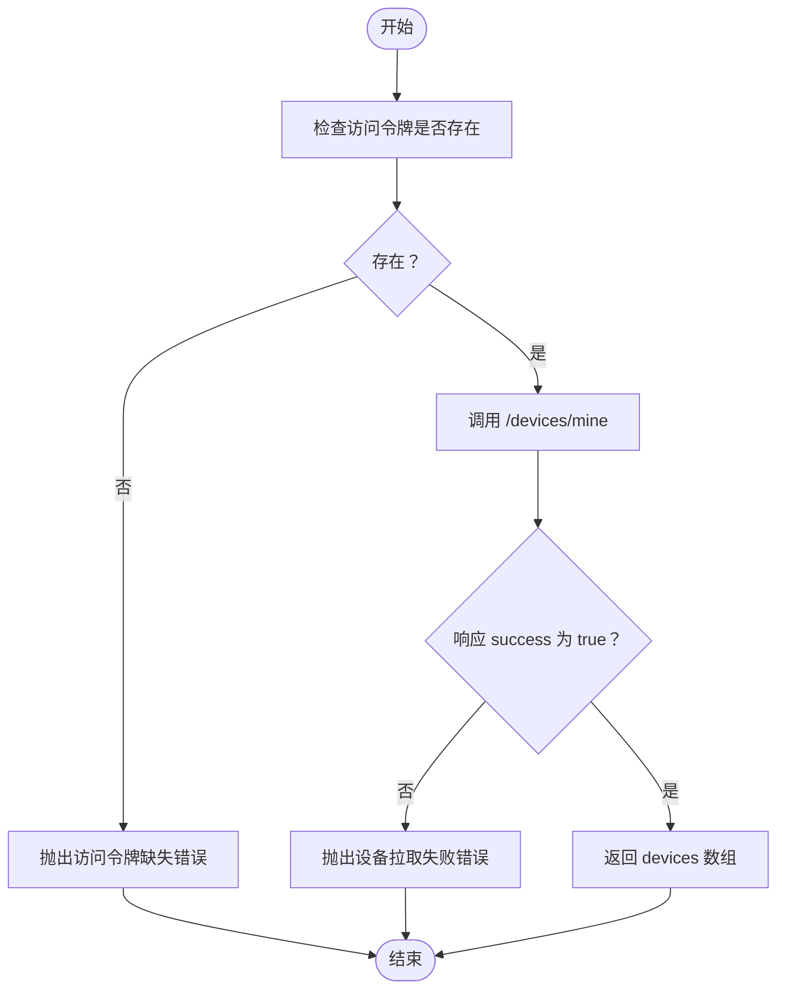
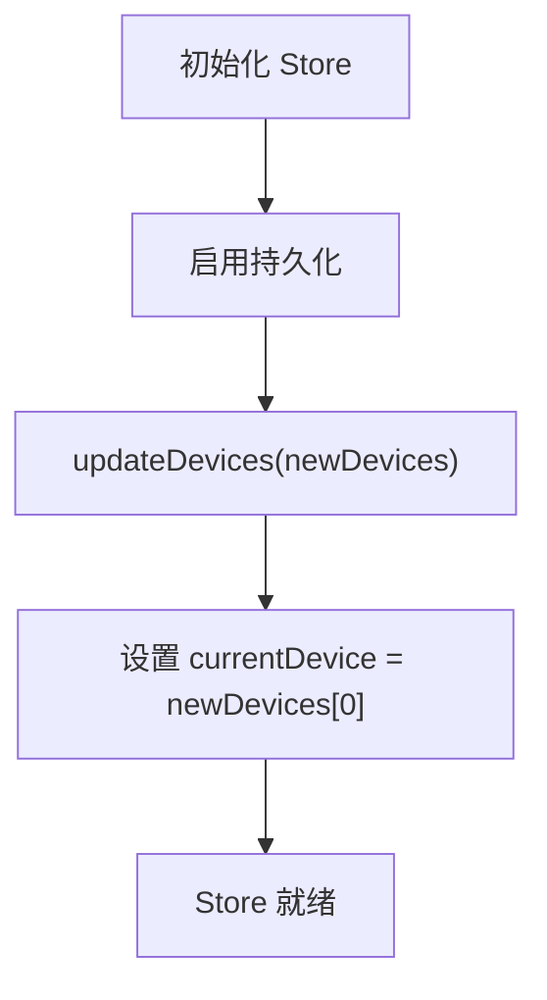
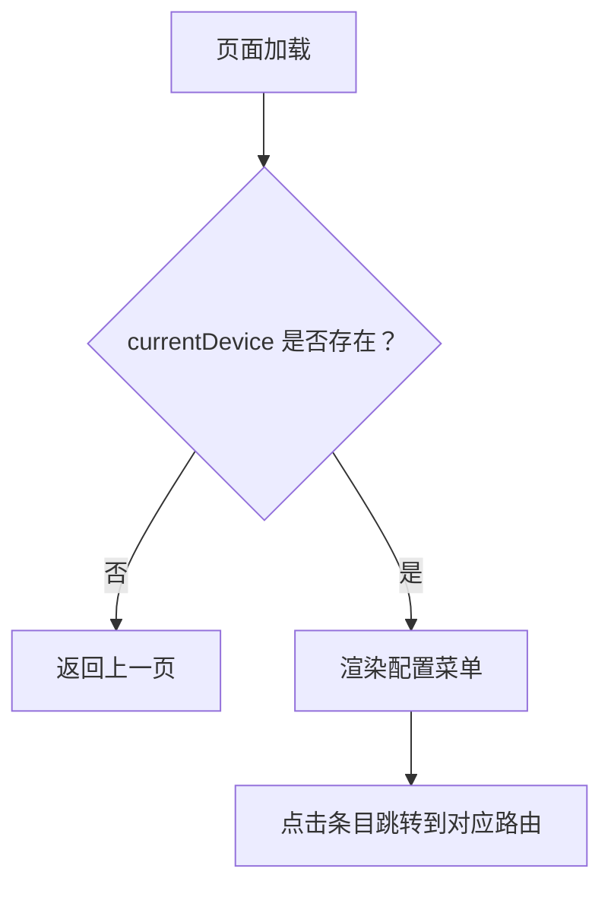
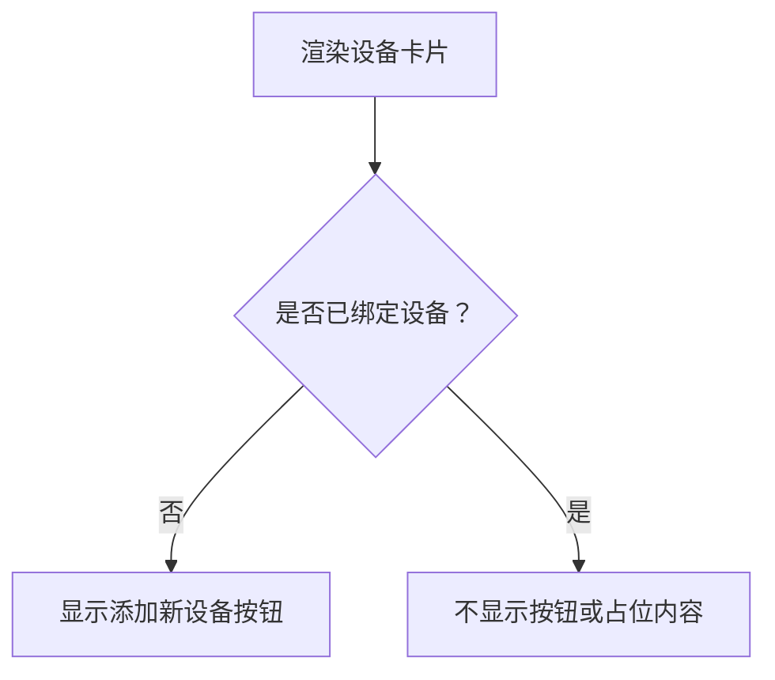
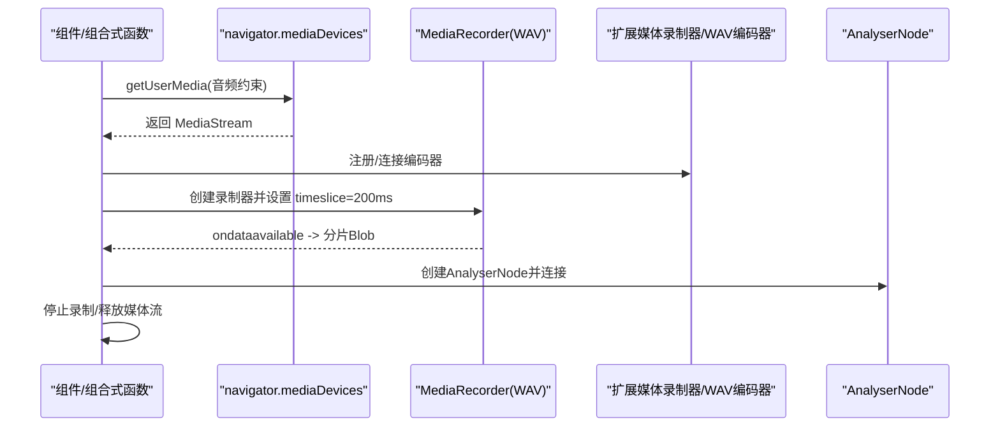
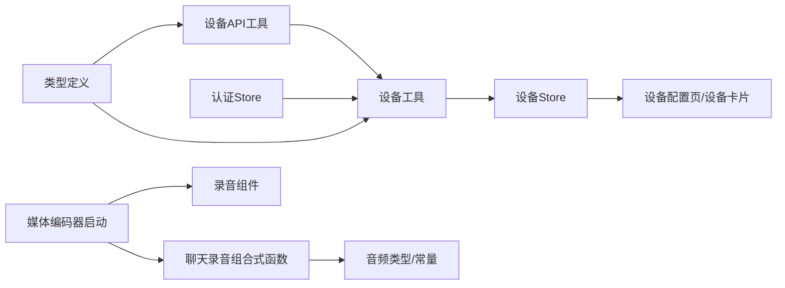

# 设备管理API

<cite>
**本文引用的文件**
- [src\types\api\device.ts](file://src/types/api/device.ts)
- [src\utils\api\device.ts](file://src/utils/api/device.ts)
- [src\utils\device.ts](file://src/utils/device.ts)
- [src\stores\device\index.ts](file://src/stores/device/index.ts)
- [src\stores\device\types.ts](file://src/stores/device/types.ts)
- [src\pages\stack\DeviceConfigPage.vue](file://src/pages/stack/DeviceConfigPage.vue)
- [src\components\home\DeviceCard.vue](file://src/components/home/DeviceCard.vue)
- [src\components\AudioRecorder.vue](file://src/components/AudioRecorder.vue)
- [src\composables\useChatRecorder.ts](file://src/composables/useChatRecorder.ts)
- [src\boot\media-encoder.ts](file://src/boot/media-encoder.ts)
- [src\types\audio\types.ts](file://src/types/audio/types.ts)
- [src\types\audio\constants.ts](file://src/types/audio/constants.ts)
</cite>

## 目录
1. [简介](#简介)
2. [项目结构](#项目结构)
3. [核心组件](#核心组件)
4. [架构总览](#架构总览)
5. [详细组件分析](#详细组件分析)
6. [依赖关系分析](#依赖关系分析)
7. [性能考量](#性能考量)
8. [故障排查指南](#故障排查指南)
9. [结论](#结论)
10. [附录](#附录)

## 简介
本文件面向设备管理API的实现与使用，聚焦于音频设备检测、权限管理、设备配置与状态同步等能力。文档覆盖以下方面：
- 设备枚举：通过后端接口拉取用户设备列表，并在前端持久化存储。
- 权限管理：基于浏览器的媒体访问权限（getUserMedia）与应用内访问令牌校验。
- 设备配置：设备级配置项（如语音风格）在页面中的展示与跳转。
- 状态同步：设备信息在Pinia Store中持久化，确保跨会话可用。
- 跨浏览器兼容：通过扩展录制器注册与WAV编码器连接，提升录音兼容性。
- 权限状态监控与设备变更通知：结合浏览器媒体设备变更事件与应用内状态更新。
- 安全考虑：访问令牌传递、错误处理与资源释放。
- 性能监控与体验优化：录音分片、静音检测、资源复用与及时释放。

## 项目结构
围绕设备管理的关键文件组织如下：
- 类型定义：设备信息类型与设备接口响应类型
- 工具层：设备数据获取与网络请求封装
- 状态层：设备信息的Pinia Store与持久化
- 页面与组件：设备配置页、设备卡片、录音组件与聊天录音组合式函数
- 启动配置：扩展媒体录制器注册

**图表来源**
- [src\types\api\device.ts:1-14](file://src/types/api/device.ts#L1-L14)
- [src\stores\device\types.ts:1-17](file://src/stores/device/types.ts#L1-L17)
- [src\utils\api\device.ts:1-11](file://src/utils/api/device.ts#L1-L11)
- [src\utils\device.ts:1-18](file://src/utils/device.ts#L1-L18)
- [src\stores\device\index.ts:1-27](file://src/stores/device/index.ts#L1-L27)
- [src\pages\stack\DeviceConfigPage.vue:1-84](file://src/pages/stack/DeviceConfigPage.vue#L1-L84)
- [src\components\home\DeviceCard.vue:1-31](file://src/components/home/DeviceCard.vue#L1-L31)
- [src\components\AudioRecorder.vue:1-112](file://src/components/AudioRecorder.vue#L1-L112)
- [src\composables\useChatRecorder.ts:1-147](file://src/composables/useChatRecorder.ts#L1-L147)
- [src\boot\media-encoder.ts:1-8](file://src/boot/media-encoder.ts#L1-L8)
- [src\types\audio\types.ts:1-14](file://src/types/audio/types.ts#L1-L14)
- [src\types\audio\constants.ts:1-2](file://src/types/audio/constants.ts#L1-L2)

**章节来源**
- [src\types\api\device.ts:1-14](file://src/types/api/device.ts#L1-L14)
- [src\stores\device\types.ts:1-17](file://src/stores/device/types.ts#L1-L17)
- [src\utils\api\device.ts:1-11](file://src/utils/api/device.ts#L1-L11)
- [src\utils\device.ts:1-18](file://src/utils/device.ts#L1-L18)
- [src\stores\device\index.ts:1-27](file://src/stores/device/index.ts#L1-L27)
- [src\pages\stack\DeviceConfigPage.vue:1-84](file://src/pages/stack/DeviceConfigPage.vue#L1-L84)
- [src\components\home\DeviceCard.vue:1-31](file://src/components/home/DeviceCard.vue#L1-L31)
- [src\components\AudioRecorder.vue:1-112](file://src/components/AudioRecorder.vue#L1-L112)
- [src\composables\useChatRecorder.ts:1-147](file://src/composables/useChatRecorder.ts#L1-L147)
- [src\boot\media-encoder.ts:1-8](file://src/boot/media-encoder.ts#L1-L8)
- [src\types\audio\types.ts:1-14](file://src/types/audio/types.ts#L1-L14)
- [src\types\audio\constants.ts:1-2](file://src/types/audio/constants.ts#L1-L2)

## 核心组件
- 设备类型与响应类型
  - 设备信息结构包含标识、归属、型号、名称、状态与配置等字段；配置中包含语音风格等项。
  - 设备“我的”接口响应采用联合类型，区分成功与失败两种形态。
- 设备工具函数
  - 从认证Store获取访问令牌，调用后端“我的设备”接口，解析返回并抛出错误。
- 设备状态存储
  - Pinia Store保存当前设备与设备列表，并提供更新方法；开启持久化以跨会话保留。
- 设备配置页面
  - 展示设备配置菜单（语音风格、语言、个性调整、WiFi、固件、关于），并支持解绑设备。
- 录音与音频能力
  - 音频录制组件与聊天录音组合式函数均基于浏览器媒体设备API与扩展媒体录制器，支持WAV分片输出与静音检测。
- 启动配置
  - 在应用启动时注册扩展媒体录制器与WAV编码器连接，提升录音兼容性。

**章节来源**
- [src\stores\device\types.ts:1-17](file://src/stores/device/types.ts#L1-L17)
- [src\types\api\device.ts:1-14](file://src/types/api/device.ts#L1-L14)
- [src\utils\device.ts:1-18](file://src/utils/device.ts#L1-L18)
- [src\utils\api\device.ts:1-11](file://src/utils/api/device.ts#L1-L11)
- [src\stores\device\index.ts:1-27](file://src/stores/device/index.ts#L1-L27)
- [src\pages\stack\DeviceConfigPage.vue:1-84](file://src/pages/stack/DeviceConfigPage.vue#L1-L84)
- [src\components\AudioRecorder.vue:1-112](file://src/components/AudioRecorder.vue#L1-L112)
- [src\composables\useChatRecorder.ts:1-147](file://src/composables/useChatRecorder.ts#L1-L147)
- [src\boot\media-encoder.ts:1-8](file://src/boot/media-encoder.ts#L1-L8)

## 架构总览
下图展示了设备管理API在前端的整体调用链路与模块交互：

**图表来源**
- [src\pages\stack\DeviceConfigPage.vue:1-84](file://src/pages/stack/DeviceConfigPage.vue#L1-L84)
- [src\stores\device\index.ts:1-27](file://src/stores/device/index.ts#L1-L27)
- [src\utils\device.ts:1-18](file://src/utils/device.ts#L1-L18)
- [src\utils\api\device.ts:1-11](file://src/utils/api/device.ts#L1-L11)
- [src\types\api\device.ts:1-14](file://src/types/api/device.ts#L1-L14)

## 详细组件分析

### 组件A：设备信息模型与接口响应
- 设备信息字段涵盖标识、归属、类型、型号、名称、状态与配置；配置为可空对象，当前包含语音风格键。
- 接口响应采用联合类型，成功时返回设备数组，失败时返回错误消息。

**图表来源**
- [src\stores\device\types.ts:1-17](file://src/stores/device/types.ts#L1-L17)
- [src\types\api\device.ts:1-14](file://src/types/api/device.ts#L1-L14)

**章节来源**
- [src\stores\device\types.ts:1-17](file://src/stores/device/types.ts#L1-L17)
- [src\types\api\device.ts:1-14](file://src/types/api/device.ts#L1-L14)

### 组件B：设备工具与API封装
- 工具函数负责从认证Store获取访问令牌，若为空则抛错；随后调用API函数发起请求；对响应进行校验，失败时抛错；成功时返回设备数组。
- API函数通过Axios向“/devices/mine”发起GET请求，并在请求头中携带访问令牌。

**图表来源**
- [src\utils\device.ts:1-18](file://src/utils/device.ts#L1-L18)
- [src\utils\api\device.ts:1-11](file://src/utils/api/device.ts#L1-L11)
- [src\types\api\device.ts:1-14](file://src/types/api/device.ts#L1-L14)

**章节来源**
- [src\utils\device.ts:1-18](file://src/utils/device.ts#L1-L18)
- [src\utils\api\device.ts:1-11](file://src/utils/api/device.ts#L1-L11)

### 组件C：设备状态存储与持久化
- Store提供当前设备与设备列表的响应式引用，并提供更新方法；启用持久化以便跨会话保留设备信息。
- 页面在挂载前检查当前设备是否存在，不存在则回退上一页。

**图表来源**
- [src\stores\device\index.ts:1-27](file://src/stores/device/index.ts#L1-L27)
- [src\pages\stack\DeviceConfigPage.vue:48-52](file://src/pages/stack/DeviceConfigPage.vue#L48-L52)

**章节来源**
- [src\stores\device\index.ts:1-27](file://src/stores/device/index.ts#L1-L27)
- [src\pages\stack\DeviceConfigPage.vue:1-84](file://src/pages/stack/DeviceConfigPage.vue#L1-L84)

### 组件D：设备配置页面与导航
- 页面展示多组配置菜单，包括语音风格、语言、个性调整、WiFi、固件更新与关于设备等；支持跳转至对应子页面。
- 支持解绑设备按钮，点击后触发登出流程。

**图表来源**
- [src\pages\stack\DeviceConfigPage.vue:1-84](file://src/pages/stack/DeviceConfigPage.vue#L1-L84)

**章节来源**
- [src\pages\stack\DeviceConfigPage.vue:1-84](file://src/pages/stack/DeviceConfigPage.vue#L1-L84)

### 组件E：设备卡片与无设备提示
- 当未绑定设备时，显示“添加新设备”入口，引导用户前往设备管理页面。

**图表来源**
- [src\components\home\DeviceCard.vue:1-31](file://src/components/home/DeviceCard.vue#L1-L31)

**章节来源**
- [src\components\home\DeviceCard.vue:1-31](file://src/components/home/DeviceCard.vue#L1-L31)

### 组件F：音频录制与聊天录音组合式函数
- 录音组件与聊天录音组合式函数均基于浏览器媒体设备API，配置采样率、位深、声道数与降噪、回声消除、自动增益等参数。
- 使用扩展媒体录制器与WAV编码器，输出200ms分片的WAV数据；聊天录音还创建AnalyserNode用于静音检测。
- 提供初始化、开始、停止与释放媒体流的完整生命周期管理。

**图表来源**
- [src\components\AudioRecorder.vue:1-112](file://src/components/AudioRecorder.vue#L1-L112)
- [src\composables\useChatRecorder.ts:1-147](file://src/composables/useChatRecorder.ts#L1-L147)
- [src\boot\media-encoder.ts:1-8](file://src/boot/media-encoder.ts#L1-L8)

**章节来源**
- [src\components\AudioRecorder.vue:1-112](file://src/components/AudioRecorder.vue#L1-L112)
- [src\composables\useChatRecorder.ts:1-147](file://src/composables/useChatRecorder.ts#L1-L147)
- [src\boot\media-encoder.ts:1-8](file://src/boot/media-encoder.ts#L1-L8)

## 依赖关系分析
- 类型依赖：设备类型与接口响应类型相互关联，确保前后端契约一致。
- 工具与API：工具函数依赖认证Store与Axios实例，API函数依赖类型定义。
- 状态依赖：页面与组件依赖Store提供的设备信息与更新方法。
- 启动依赖：录音组件与聊天录音组合式函数依赖启动阶段注册的扩展媒体录制器与WAV编码器。
- 音频常量：聊天录音组合式函数使用统一的采样率常量，保证录音参数一致性。

**图表来源**
- [src\types\api\device.ts:1-14](file://src/types/api/device.ts#L1-L14)
- [src\stores\device\types.ts:1-17](file://src/stores/device/types.ts#L1-L17)
- [src\utils\api\device.ts:1-11](file://src/utils/api/device.ts#L1-L11)
- [src\utils\device.ts:1-18](file://src/utils/device.ts#L1-L18)
- [src\stores\device\index.ts:1-27](file://src/stores/device/index.ts#L1-L27)
- [src\pages\stack\DeviceConfigPage.vue:1-84](file://src/pages/stack/DeviceConfigPage.vue#L1-L84)
- [src\components\home\DeviceCard.vue:1-31](file://src/components/home/DeviceCard.vue#L1-L31)
- [src\components\AudioRecorder.vue:1-112](file://src/components/AudioRecorder.vue#L1-L112)
- [src\composables\useChatRecorder.ts:1-147](file://src/composables/useChatRecorder.ts#L1-L147)
- [src\boot\media-encoder.ts:1-8](file://src/boot/media-encoder.ts#L1-L8)
- [src\types\audio\types.ts:1-14](file://src/types/audio/types.ts#L1-L14)
- [src\types\audio\constants.ts:1-2](file://src/types/audio/constants.ts#L1-L2)

**章节来源**
- [src\types\api\device.ts:1-14](file://src/types/api/device.ts#L1-L14)
- [src\stores\device\types.ts:1-17](file://src/stores/device/types.ts#L1-L17)
- [src\utils\api\device.ts:1-11](file://src/utils/api/device.ts#L1-L11)
- [src\utils\device.ts:1-18](file://src/utils/device.ts#L1-L18)
- [src\stores\device\index.ts:1-27](file://src/stores/device/index.ts#L1-L27)
- [src\pages\stack\DeviceConfigPage.vue:1-84](file://src/pages/stack/DeviceConfigPage.vue#L1-L84)
- [src\components\home\DeviceCard.vue:1-31](file://src/components/home/DeviceCard.vue#L1-L31)
- [src\components\AudioRecorder.vue:1-112](file://src/components/AudioRecorder.vue#L1-L112)
- [src\composables\useChatRecorder.ts:1-147](file://src/composables/useChatRecorder.ts#L1-L147)
- [src\boot\media-encoder.ts:1-8](file://src/boot/media-encoder.ts#L1-L8)
- [src\types\audio\types.ts:1-14](file://src/types/audio/types.ts#L1-L14)
- [src\types\audio\constants.ts:1-2](file://src/types/audio/constants.ts#L1-L2)

## 性能考量
- 录音分片与时延控制：录音器以200ms为时间片输出分片，降低单次处理压力并改善实时性。
- 静音检测：聊天录音组合式函数创建AnalyserNode进行RMS计算，避免无效音频传输。
- 资源复用与释放：媒体流与录音器仅在需要时创建，停止或卸载时释放所有资源，防止内存泄漏。
- 编码器注册：在应用启动阶段完成扩展媒体录制器与WAV编码器的注册，减少运行时开销。
- 参数一致性：统一采样率常量，确保录音参数一致，减少重配带来的性能损耗。

[本节为通用性能建议，无需特定文件引用]

## 故障排查指南
- 访问令牌缺失
  - 现象：调用设备工具函数时报错。
  - 处理：确认认证Store中存在有效访问令牌后再调用。
- 设备拉取失败
  - 现象：接口响应success为false，抛出设备拉取失败错误。
  - 处理：检查后端服务状态与网络连通性，确认访问令牌有效。
- 录音权限被拒绝
  - 现象：getUserMedia调用失败或无音频输入。
  - 处理：检查浏览器权限设置、设备选择与HTTPS环境；确保麦克风未被占用。
- 录音分片异常
  - 现象：分片为空或无法播放。
  - 处理：确认扩展媒体录制器与WAV编码器已正确注册；检查分片大小与编码格式。
- 媒体资源未释放
  - 现象：长时间录音导致内存增长或设备占用。
  - 处理：在停止录音与组件卸载时调用释放函数，确保媒体轨道与上下文关闭。
- 静音检测无效
  - 现象：未正确识别静音。
  - 处理：确认AnalyserNode已创建并连接，且未将AnalyserNode连接到扬声器输出。

**章节来源**
- [src\utils\device.ts:1-18](file://src/utils/device.ts#L1-L18)
- [src\components\AudioRecorder.vue:1-112](file://src/components/AudioRecorder.vue#L1-L112)
- [src\composables\useChatRecorder.ts:1-147](file://src/composables/useChatRecorder.ts#L1-L147)

## 结论
本设备管理API围绕“设备枚举—权限校验—配置展示—状态持久化—录音能力—兼容性保障”构建，形成清晰的前端实现路径。通过Pinia Store持久化与统一的类型定义，确保了跨会话的一致性；通过扩展媒体录制器与WAV编码器，提升了录音的稳定性与兼容性。配合静音检测与资源释放策略，兼顾了性能与用户体验。

[本节为总结性内容，无需特定文件引用]

## 附录

### API规范概览
- 设备“我的”接口
  - 方法：GET
  - 路径：/devices/mine
  - 请求头：携带访问令牌
  - 成功响应：包含设备数组
  - 失败响应：包含错误消息

**章节来源**
- [src\utils\api\device.ts:1-11](file://src/utils/api/device.ts#L1-L11)
- [src\types\api\device.ts:1-14](file://src/types/api/device.ts#L1-L14)

### 设备信息字段说明
- id：设备唯一标识
- identifier：设备标识符
- ownerId：归属用户ID
- type：设备类型（如机器人）
- model：设备型号
- name：设备名称（可空）
- status：设备状态（未知类型）
- config：设备配置（可空），包含语音风格等

**章节来源**
- [src\stores\device\types.ts:1-17](file://src/stores/device/types.ts#L1-L17)

### 录音参数与能力
- 采样率：统一采样率常量
- 位深：16bit
- 声道：单声道
- 预处理：回声消除、噪声抑制、自动增益
- 输出：WAV格式，200ms分片
- 静音检测：基于AnalyserNode的RMS计算

**章节来源**
- [src\composables\useChatRecorder.ts:1-147](file://src/composables/useChatRecorder.ts#L1-L147)
- [src\types\audio\constants.ts:1-2](file://src/types/audio/constants.ts#L1-L2)
- [src\types\audio\types.ts:1-14](file://src/types/audio/types.ts#L1-L14)

### 跨浏览器兼容性
- 扩展媒体录制器与WAV编码器注册在应用启动阶段完成，确保录音能力在不同浏览器中稳定可用。

**章节来源**
- [src\boot\media-encoder.ts:1-8](file://src/boot/media-encoder.ts#L1-L8)

### 权限状态监控与设备变更通知
- 浏览器媒体设备变更事件：可通过监听媒体设备变化事件，在设备列表或当前设备发生变化时更新Store。
- 应用内状态更新：Store持久化后，页面可自动感知设备变更并刷新UI。

[本节为概念性说明，无需特定文件引用]

### 安全考虑与错误处理策略
- 访问令牌：严格在请求头中传递，避免明文存储；工具函数在令牌缺失时立即抛错。
- 错误处理：接口响应失败时抛错；录音异常时通过通知组件提示用户并清理状态。
- 资源安全：组件卸载时释放媒体流与上下文，防止资源泄露。

**章节来源**
- [src\utils\device.ts:1-18](file://src/utils/device.ts#L1-L18)
- [src\components\AudioRecorder.vue:1-112](file://src/components/AudioRecorder.vue#L1-L112)

### 用户体验优化方案
- 录音分片与时延：200ms分片降低延迟，提升交互流畅度。
- 静音检测：自动过滤静音片段，减少无效传输。
- 资源复用：媒体流与录音器按需创建，避免重复初始化。
- 反馈提示：录音过程中的状态提示与错误通知，提升用户感知。

**章节来源**
- [src\composables\useChatRecorder.ts:1-147](file://src/composables/useChatRecorder.ts#L1-L147)
- [src\components\AudioRecorder.vue:1-112](file://src/components/AudioRecorder.vue#L1-L112)