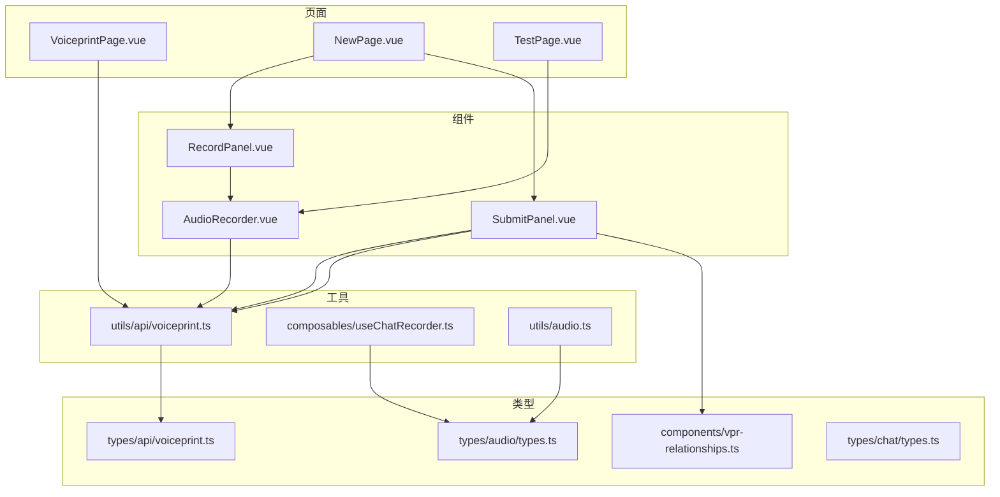
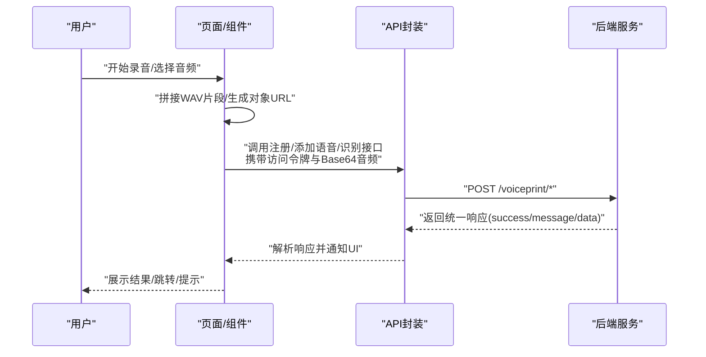
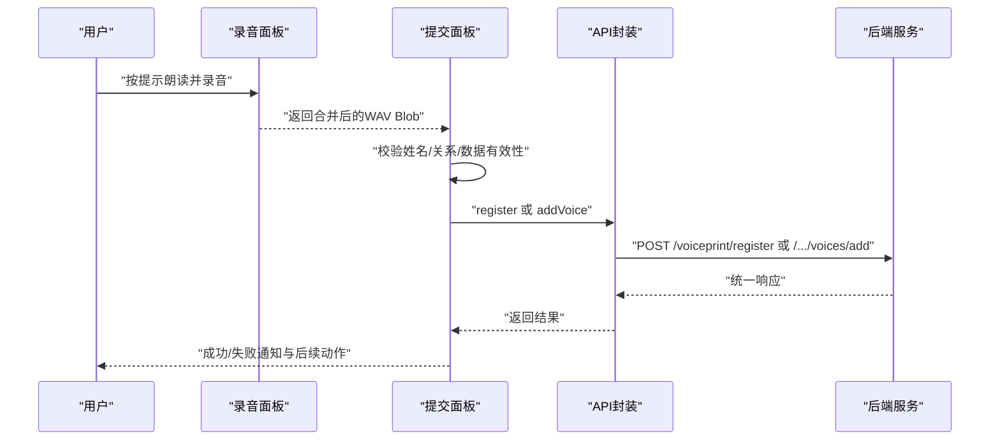
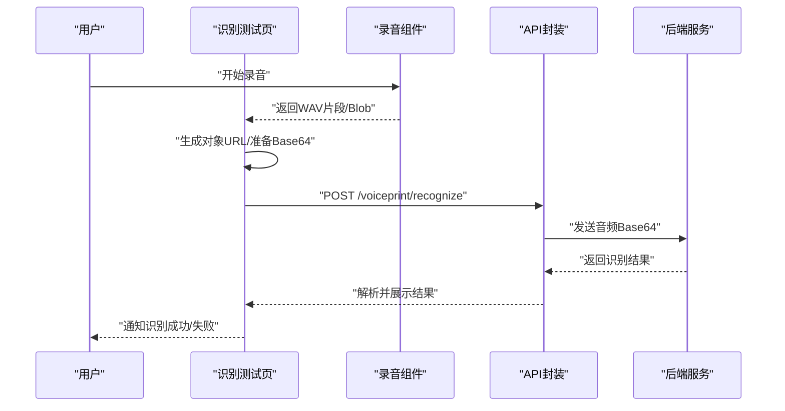
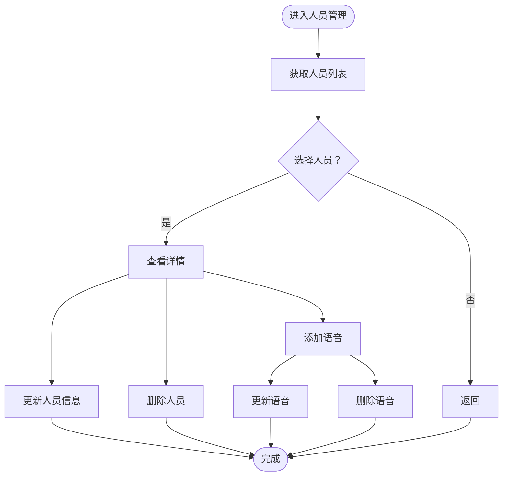
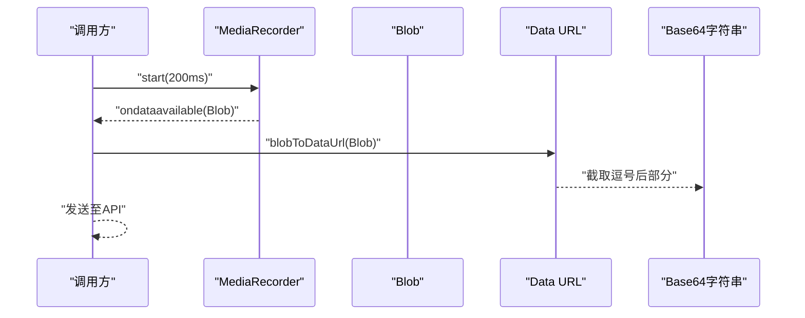
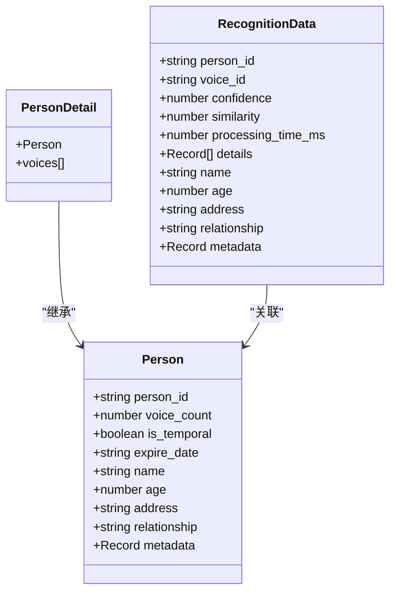
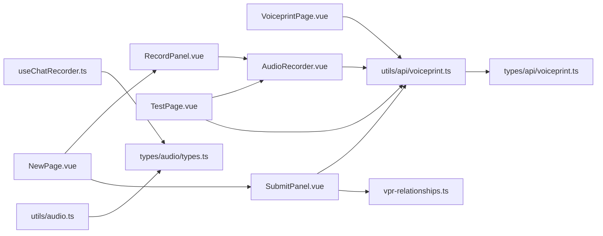

# 语音特征API

<cite>
**本文引用的文件**
- [voiceprint.ts（类型定义）](file://src/types/api/voiceprint.ts)
- [voiceprint.ts（API封装）](file://src/utils/api/voiceprint.ts)
- [vpr-relationships.ts](file://src/components/vpr-relationships.ts)
- [AudioRecorder.vue](file://src/components/AudioRecorder.vue)
- [useChatRecorder.ts](file://src/composables/useChatRecorder.ts)
- [RecordPanel.vue（录音面板）](file://src/components/settings/voiceprint/RecordPanel.vue)
- [SubmitPanel.vue（提交面板）](file://src/components/settings/voiceprint/SubmitPanel.vue)
- [NewPage.vue（新建页面）](file://src/pages/stack/settings/voiceprint/NewPage.vue)
- [TestPage.vue（识别测试页）](file://src/pages/stack/settings/voiceprint/TestPage.vue)
- [VoiceprintPage.vue（声纹主页）](file://src/pages/stack/settings/VoiceprintPage.vue)
- [types.ts（音频常量与流式配置）](file://src/types/audio/types.ts)
- [audio.ts（PCM转WAV工具）](file://src/utils/audio.ts)
- [types.ts（聊天音频常量）](file://src/types/chat/types.ts)
</cite>

## 目录
1. [简介](#简介)
2. [项目结构](#项目结构)
3. [核心组件](#核心组件)
4. [架构总览](#架构总览)
5. [详细组件分析](#详细组件分析)
6. [依赖关系分析](#依赖关系分析)
7. [性能考虑](#性能考虑)
8. [故障排查指南](#故障排查指南)
9. [结论](#结论)
10. [附录](#附录)

## 简介
本文件系统性梳理前端侧“语音特征API”的实现与使用方式，覆盖声纹注册、语音训练（添加语音）、识别测试与人员管理等能力。重点说明：
- 音频采集与二进制数据传输（WAV格式、Base64编码）
- 声纹模型训练与识别流程
- 人员信息与语音样本的增删改查
- 错误处理、重试与用户体验优化
- 文件格式要求、数据校验规则与生命周期管理建议

## 项目结构
前端围绕“页面-组件-工具函数-类型定义”分层组织，关键路径如下：
- 页面：声纹主页、新建声纹、识别测试
- 组件：录音器、录音面板、提交面板
- 工具：API封装、音频工具、录音组合式函数
- 类型：声纹接口响应、请求体、关系枚举

**图表来源**
- [VoiceprintPage.vue:1-72](file://src/pages/stack/settings/VoiceprintPage.vue#L1-L72)
- [NewPage.vue:1-54](file://src/pages/stack/settings/voiceprint/NewPage.vue#L1-L54)
- [TestPage.vue:1-124](file://src/pages/stack/settings/voiceprint/TestPage.vue#L1-L124)
- [AudioRecorder.vue:1-113](file://src/components/AudioRecorder.vue#L1-L113)
- [RecordPanel.vue:1-104](file://src/components/settings/voiceprint/RecordPanel.vue#L1-L104)
- [SubmitPanel.vue:1-158](file://src/components/settings/voiceprint/SubmitPanel.vue#L1-L158)
- [voiceprint.ts（API封装）:1-123](file://src/utils/api/voiceprint.ts#L1-L123)
- [useChatRecorder.ts:1-148](file://src/composables/useChatRecorder.ts#L1-L148)
- [audio.ts（PCM转WAV工具）:1-47](file://src/utils/audio.ts#L1-L47)
- [voiceprint.ts（类型定义）:1-98](file://src/types/api/voiceprint.ts#L1-L98)
- [vpr-relationships.ts:1-19](file://src/components/vpr-relationships.ts#L1-L19)
- [types.ts（音频类型）:1-14](file://src/types/audio/types.ts#L1-L14)
- [types.ts（聊天音频常量）:85-96](file://src/types/chat/types.ts#L85-L96)

**章节来源**
- [VoiceprintPage.vue:1-72](file://src/pages/stack/settings/VoiceprintPage.vue#L1-L72)
- [NewPage.vue:1-54](file://src/pages/stack/settings/voiceprint/NewPage.vue#L1-L54)
- [TestPage.vue:1-124](file://src/pages/stack/settings/voiceprint/TestPage.vue#L1-L124)
- [AudioRecorder.vue:1-113](file://src/components/AudioRecorder.vue#L1-L113)
- [RecordPanel.vue:1-104](file://src/components/settings/voiceprint/RecordPanel.vue#L1-L104)
- [SubmitPanel.vue:1-158](file://src/components/settings/voiceprint/SubmitPanel.vue#L1-L158)
- [voiceprint.ts（API封装）:1-123](file://src/utils/api/voiceprint.ts#L1-L123)
- [voiceprint.ts（类型定义）:1-98](file://src/types/api/voiceprint.ts#L1-L98)
- [vpr-relationships.ts:1-19](file://src/components/vpr-relationships.ts#L1-L19)
- [useChatRecorder.ts:1-148](file://src/composables/useChatRecorder.ts#L1-L148)
- [audio.ts（PCM转WAV工具）:1-47](file://src/utils/audio.ts#L1-L47)
- [types.ts（音频类型）:1-14](file://src/types/audio/types.ts#L1-L14)
- [types.ts（聊天音频常量）:85-96](file://src/types/chat/types.ts#L85-L96)

## 核心组件
- 声纹API封装：提供注册、识别、人员列表、人员详情、更新、删除、添加语音、更新语音、删除语音等方法，统一携带访问令牌头。
- 录音组件：基于浏览器 MediaRecorder 输出 WAV 片段，支持事件回调与对象URL预览。
- 录音组合式函数：面向聊天场景的连续录音，输出200ms WAV片段（Base64），并提供静音检测分析节点。
- 类型与关系：统一的声纹响应类型、人员与语音样本结构、关系枚举及选项。

**章节来源**
- [voiceprint.ts（API封装）:1-123](file://src/utils/api/voiceprint.ts#L1-L123)
- [AudioRecorder.vue:1-113](file://src/components/AudioRecorder.vue#L1-L113)
- [useChatRecorder.ts:1-148](file://src/composables/useChatRecorder.ts#L1-L148)
- [voiceprint.ts（类型定义）:1-98](file://src/types/api/voiceprint.ts#L1-L98)
- [vpr-relationships.ts:1-19](file://src/components/vpr-relationships.ts#L1-L19)

## 架构总览
前端通过页面驱动组件完成音频采集，组件将音频以Base64形式传递给API封装，API封装通过Axios调用后端接口，返回统一的响应结构（成功/失败+数据或错误消息）。识别测试页直接调用识别接口；新建声纹流程包含录音、确认与提交三步。

**图表来源**
- [voiceprint.ts（API封装）:15-122](file://src/utils/api/voiceprint.ts#L15-L122)
- [AudioRecorder.vue:31-67](file://src/components/AudioRecorder.vue#L31-L67)
- [RecordPanel.vue:36-49](file://src/components/settings/voiceprint/RecordPanel.vue#L36-L49)
- [SubmitPanel.vue:34-97](file://src/components/settings/voiceprint/SubmitPanel.vue#L34-L97)
- [TestPage.vue:32-82](file://src/pages/stack/settings/voiceprint/TestPage.vue#L32-L82)

## 详细组件分析

### 1) 声纹注册与语音训练
- 功能要点
  - 新建声纹：提交音频Base64、姓名、年龄、关系、可选地址、是否临时人员标记。
  - 添加语音：为已有人员追加新的语音样本（二次训练）。
  - 数据校验：新建时必须提供姓名与关系；提交前将Blob转换为Data URL并截取Base64部分。
- 接口与参数
  - 注册：POST /voiceprint/register
  - 添加语音：POST /voiceprint/persons/{personId}/voices/add
  - 请求头：x-access-token
  - 请求体字段：audio（Base64）、name、age、address、relationship、isTemporal
- 用户体验
  - 录音面板提供环境提示与分段录制；提交面板进行必填项校验与结果通知。

**图表来源**
- [RecordPanel.vue:36-49](file://src/components/settings/voiceprint/RecordPanel.vue#L36-L49)
- [SubmitPanel.vue:34-97](file://src/components/settings/voiceprint/SubmitPanel.vue#L34-L97)
- [voiceprint.ts（API封装）:28-97](file://src/utils/api/voiceprint.ts#L28-L97)

**章节来源**
- [voiceprint.ts（API封装）:28-97](file://src/utils/api/voiceprint.ts#L28-L97)
- [SubmitPanel.vue:34-97](file://src/components/settings/voiceprint/SubmitPanel.vue#L34-L97)
- [RecordPanel.vue:36-49](file://src/components/settings/voiceprint/RecordPanel.vue#L36-L49)

### 2) 识别测试
- 功能要点
  - 录制测试音频，转换为Base64后调用识别接口。
  - 返回识别结果包含匹配人员信息、置信度、相似度、处理耗时等。
- 接口与参数
  - 识别：POST /voiceprint/recognize
  - 请求头：x-access-token
  - 请求体字段：audio（Base64）
- 用户体验
  - 支持预览测试音频，识别完成后展示结果并记录到状态。

**图表来源**
- [TestPage.vue:24-82](file://src/pages/stack/settings/voiceprint/TestPage.vue#L24-L82)
- [AudioRecorder.vue:31-67](file://src/components/AudioRecorder.vue#L31-L67)
- [voiceprint.ts（API封装）:15-26](file://src/utils/api/voiceprint.ts#L15-L26)

**章节来源**
- [TestPage.vue:24-82](file://src/pages/stack/settings/voiceprint/TestPage.vue#L24-L82)
- [voiceprint.ts（API封装）:15-26](file://src/utils/api/voiceprint.ts#L15-L26)

### 3) 人员管理
- 功能要点
  - 获取人员列表、获取人员详情、更新人员信息、删除人员。
  - 语音管理：为人员添加新语音、更新语音、删除语音。
- 接口与参数
  - 列表：GET /voiceprint/persons
  - 详情：GET /voiceprint/persons/{personId}
  - 更新：PUT /voiceprint/persons/{personId}
  - 删除：DELETE /voiceprint/persons/{personId}
  - 添加语音：POST /voiceprint/persons/{personId}/voices/add
  - 更新语音：PUT /voiceprint/persons/{personId}/voices/{voiceId}
  - 删除语音：DELETE /voiceprint/persons/{personId}/voices/{voiceId}
  - 请求头：x-access-token
  - 更新请求体：name、relationship、isTemporal（可选）

**图表来源**
- [VoiceprintPage.vue:17-33](file://src/pages/stack/settings/VoiceprintPage.vue#L17-L33)
- [voiceprint.ts（API封装）:54-122](file://src/utils/api/voiceprint.ts#L54-L122)

**章节来源**
- [VoiceprintPage.vue:17-33](file://src/pages/stack/settings/VoiceprintPage.vue#L17-L33)
- [voiceprint.ts（API封装）:54-122](file://src/utils/api/voiceprint.ts#L54-L122)

### 4) 音频采集与二进制传输
- 录音组件
  - 使用 MediaRecorder 以 audio/wav 输出，200ms 时间片触发一次 dataavailable 事件。
  - 提供 start/stop 事件与数据事件，便于实时拼接与预览。
- 连续录音组合式函数
  - 面向聊天场景的持续录音，输出200ms WAV片段（Base64），并提供静音检测分析节点。
- Base64传输
  - 将Blob转换为Data URL后截取逗号后的Base64字符串，避免传输多余前缀。
- PCM转WAV工具
  - 在需要自定义采样率/位深/声道时，可将PCM数据封装为WAV Blob。

**图表来源**
- [AudioRecorder.vue:31-67](file://src/components/AudioRecorder.vue#L31-L67)
- [useChatRecorder.ts:72-91](file://src/composables/useChatRecorder.ts#L72-L91)
- [SubmitPanel.vue:46-54](file://src/components/settings/voiceprint/SubmitPanel.vue#L46-L54)
- [TestPage.vue:50-54](file://src/pages/stack/settings/voiceprint/TestPage.vue#L50-L54)
- [audio.ts（PCM转WAV工具）:1-47](file://src/utils/audio.ts#L1-L47)

**章节来源**
- [AudioRecorder.vue:31-67](file://src/components/AudioRecorder.vue#L31-L67)
- [useChatRecorder.ts:72-91](file://src/composables/useChatRecorder.ts#L72-L91)
- [SubmitPanel.vue:46-54](file://src/components/settings/voiceprint/SubmitPanel.vue#L46-L54)
- [TestPage.vue:50-54](file://src/pages/stack/settings/voiceprint/TestPage.vue#L50-L54)
- [audio.ts（PCM转WAV工具）:1-47](file://src/utils/audio.ts#L1-L47)

### 5) 关系枚举与数据模型
- 关系枚举
  - 支持 self、family、friend、colleague、other 等关系类型，并提供选项列表。
- 数据模型
  - 人员：person_id、voice_count、is_temporal、expire_date、name、age、address、relationship、metadata
  - 人员详情：在人员基础上附加 voices 数组（voice_id、feature_vector、created_at）
  - 识别结果：person_id、voice_id、confidence、similarity、processing_time_ms、details、name、age、address、relationship、metadata
  - 统一响应：success 与 message 或 data 字段

**图表来源**
- [voiceprint.ts（类型定义）:14-46](file://src/types/api/voiceprint.ts#L14-L46)
- [vpr-relationships.ts:5-18](file://src/components/vpr-relationships.ts#L5-L18)

**章节来源**
- [voiceprint.ts（类型定义）:14-46](file://src/types/api/voiceprint.ts#L14-L46)
- [vpr-relationships.ts:5-18](file://src/components/vpr-relationships.ts#L5-L18)

## 依赖关系分析
- 页面依赖组件与工具函数，组件依赖浏览器媒体API与本地存储（对象URL）。
- API封装依赖访问令牌与后端接口契约，返回统一响应类型。
- 录音组件与组合式函数提供一致的音频采集与Base64转换能力，保证前后端传输一致性。

**图表来源**
- [VoiceprintPage.vue:1-72](file://src/pages/stack/settings/VoiceprintPage.vue#L1-L72)
- [NewPage.vue:1-54](file://src/pages/stack/settings/voiceprint/NewPage.vue#L1-L54)
- [TestPage.vue:1-124](file://src/pages/stack/settings/voiceprint/TestPage.vue#L1-L124)
- [RecordPanel.vue:1-104](file://src/components/settings/voiceprint/RecordPanel.vue#L1-L104)
- [SubmitPanel.vue:1-158](file://src/components/settings/voiceprint/SubmitPanel.vue#L1-L158)
- [AudioRecorder.vue:1-113](file://src/components/AudioRecorder.vue#L1-L113)
- [voiceprint.ts（API封装）:1-123](file://src/utils/api/voiceprint.ts#L1-L123)
- [voiceprint.ts（类型定义）:1-98](file://src/types/api/voiceprint.ts#L1-L98)
- [vpr-relationships.ts:1-19](file://src/components/vpr-relationships.ts#L1-L19)
- [useChatRecorder.ts:1-148](file://src/composables/useChatRecorder.ts#L1-L148)
- [types.ts（音频类型）:1-14](file://src/types/audio/types.ts#L1-L14)
- [audio.ts（PCM转WAV工具）:1-47](file://src/utils/audio.ts#L1-L47)

**章节来源**
- 同上

## 性能考虑
- 音频分片与传输
  - 使用200ms时间片降低首包延迟，提升交互流畅度。
  - Base64传输体积约为原始二进制的4/3倍，建议在弱网下控制单次音频长度。
- 资源释放
  - 录音结束后及时停止 MediaStream Track 与关闭 AudioContext，避免资源泄漏。
  - 对象URL在不再使用时及时 revoke，防止内存占用。
- 识别并发
  - 识别过程中禁用重复触发，避免并发请求导致的资源竞争。
- 识别结果缓存
  - 可在前端缓存最近识别结果，减少重复识别次数（需结合业务策略）。

[本节为通用指导，无需特定文件来源]

## 故障排查指南
- 访问令牌缺失
  - 现象：接口返回未授权或页面被重定向。
  - 处理：确保登录态有效，调用前检查 accessToken 是否存在。
- 音频为空或格式不正确
  - 现象：识别失败或注册报错。
  - 处理：确认录音组件正常工作，Base64转换逻辑正确；必要时使用PCM转WAV工具生成标准WAV。
- 必填字段缺失
  - 现象：新建声纹时报错。
  - 处理：确保姓名与关系已填写；地址与临时标记为可选。
- 网络异常与超时
  - 现象：请求长时间无响应。
  - 处理：增加重试与超时控制，提示用户稍后重试。
- 静音检测问题
  - 现象：连续录音无法自动结束。
  - 处理：检查音频上下文与分析节点是否创建成功，阈值与采样间隔合理设置。

**章节来源**
- [SubmitPanel.vue:34-97](file://src/components/settings/voiceprint/SubmitPanel.vue#L34-L97)
- [TestPage.vue:32-82](file://src/pages/stack/settings/voiceprint/TestPage.vue#L32-L82)
- [AudioRecorder.vue:69-86](file://src/components/AudioRecorder.vue#L69-L86)
- [useChatRecorder.ts:47-70](file://src/composables/useChatRecorder.ts#L47-L70)

## 结论
该前端实现以清晰的页面-组件-工具-类型分层，完整覆盖了声纹注册、语音训练、识别测试与人员管理的全流程。通过统一的API封装与Base64传输机制，配合录音组件与组合式函数，实现了良好的用户体验与可维护性。建议在实际部署中结合后端能力完善进度上报、模型更新策略与错误重试机制，进一步提升稳定性与性能。

[本节为总结，无需特定文件来源]

## 附录

### A. API清单与调用示例（路径指引）
- 注册声纹
  - 方法：POST
  - 路径：/voiceprint/register
  - 请求头：x-access-token
  - 请求体字段：audio（Base64）、name、age、address、relationship、isTemporal
  - 示例路径：[voiceprint.ts（API封装）:28-52](file://src/utils/api/voiceprint.ts#L28-L52)
- 添加语音
  - 方法：POST
  - 路径：/voiceprint/persons/{personId}/voices/add
  - 请求头：x-access-token
  - 请求体字段：audio（Base64）
  - 示例路径：[voiceprint.ts（API封装）:86-97](file://src/utils/api/voiceprint.ts#L86-L97)
- 识别测试
  - 方法：POST
  - 路径：/voiceprint/recognize
  - 请求头：x-access-token
  - 请求体字段：audio（Base64）
  - 示例路径：[voiceprint.ts（API封装）:15-26](file://src/utils/api/voiceprint.ts#L15-L26)
- 人员管理
  - 获取列表：GET /voiceprint/persons
  - 获取详情：GET /voiceprint/persons/{personId}
  - 更新人员：PUT /voiceprint/persons/{personId}
  - 删除人员：DELETE /voiceprint/persons/{personId}
  - 更新语音：PUT /voiceprint/persons/{personId}/voices/{voiceId}
  - 删除语音：DELETE /voiceprint/persons/{personId}/voices/{voiceId}
  - 示例路径：[voiceprint.ts（API封装）:54-122](file://src/utils/api/voiceprint.ts#L54-L122)

**章节来源**
- [voiceprint.ts（API封装）:15-122](file://src/utils/api/voiceprint.ts#L15-L122)

### B. 文件格式与数据校验
- 音频格式
  - 录音组件默认输出 audio/wav；如需自定义参数，可使用PCM转WAV工具生成标准WAV。
- Base64传输
  - 采用 Data URL 的 Base64 部分进行传输，避免额外前缀开销。
- 校验规则
  - 新建声纹：姓名与关系为必填；地址与临时标记可选。
  - 识别：需提供有效的访问令牌与合法的Base64音频。

**章节来源**
- [AudioRecorder.vue:38-51](file://src/components/AudioRecorder.vue#L38-L51)
- [SubmitPanel.vue:57-64](file://src/components/settings/voiceprint/SubmitPanel.vue#L57-L64)
- [audio.ts（PCM转WAV工具）:1-47](file://src/utils/audio.ts#L1-L47)

### C. 生命周期与模型更新策略
- 生命周期
  - 人员：可设置临时标记与过期日期；语音样本随时间积累，用于模型训练与识别。
- 模型更新
  - 建议在添加多个高质量语音样本后进行批量训练；识别时优先使用最新样本。
- 性能优化
  - 控制单次音频长度，减少传输与识别耗时；在弱网环境下启用重试与降级策略。

[本节为通用指导，无需特定文件来源]