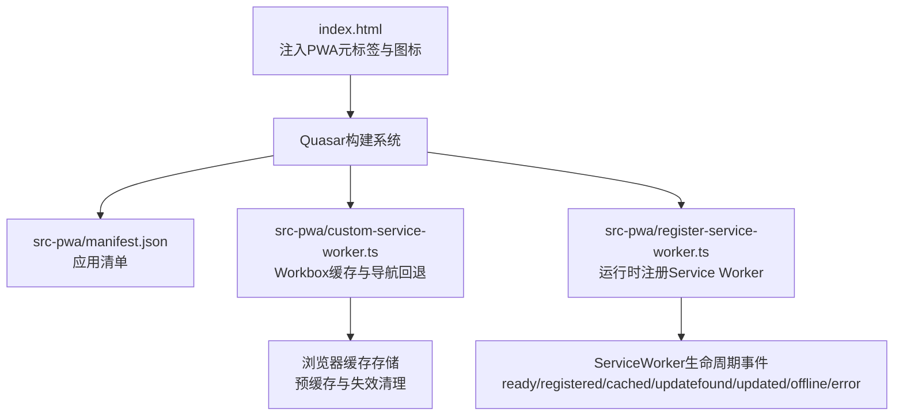
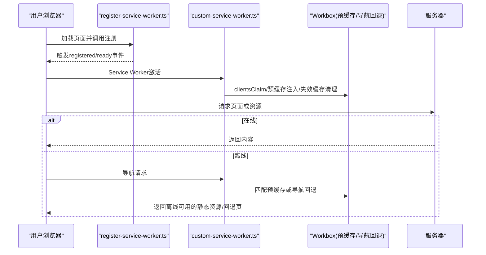
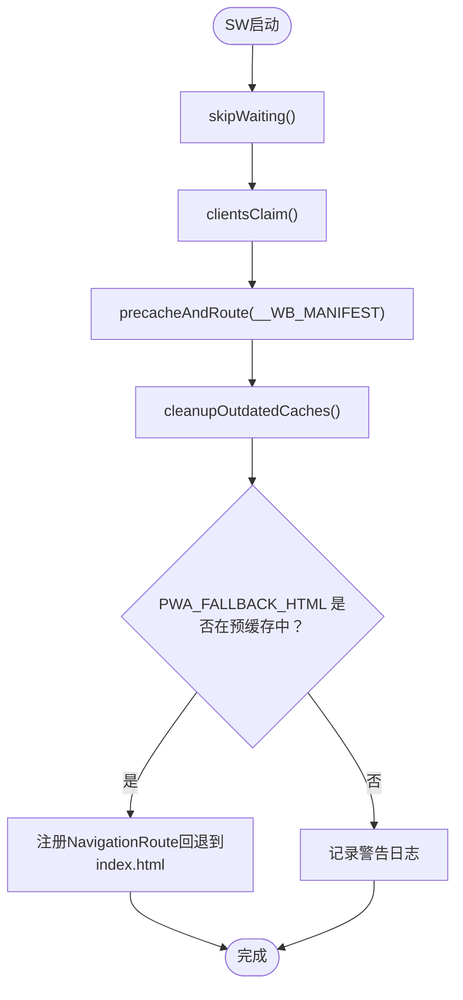
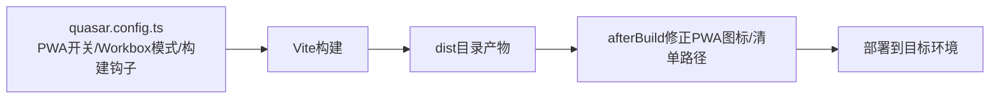
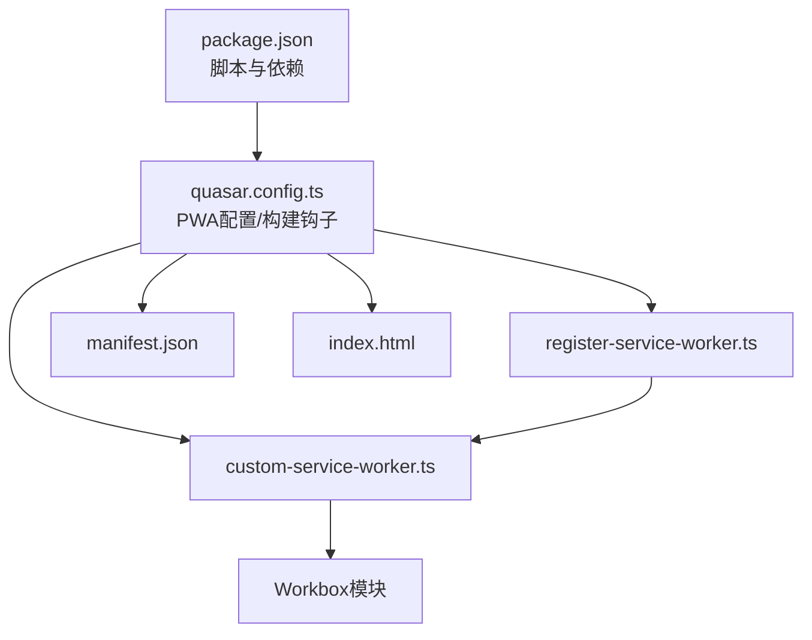

# PWA与离线支持

<cite>
**本文引用的文件**
- [package.json](file://package.json)
- [quasar.config.ts](file://quasar.config.ts)
- [index.html](file://index.html)
- [manifest.json](file://src-pwa/manifest.json)
- [register-service-worker.ts](file://src-pwa/register-service-worker.ts)
- [custom-service-worker.ts](file://src-pwa/custom-service-worker.ts)
- [pwa-env.d.ts](file://src-pwa/pwa-env.d.ts)
- [App.vue](file://src/App.vue)
- [HomePage.vue](file://src/pages/main/HomePage.vue)
- [ErrorNotFound.vue](file://src/pages/ErrorNotFound.vue)
</cite>

## 目录
1. [简介](#简介)
2. [项目结构](#项目结构)
3. [核心组件](#核心组件)
4. [架构总览](#架构总览)
5. [详细组件分析](#详细组件分析)
6. [依赖关系分析](#依赖关系分析)
7. [性能考量](#性能考量)
8. [故障排查指南](#故障排查指南)
9. [结论](#结论)
10. [附录](#附录)

## 简介
本文件面向 Le Bot PWA 系统，系统性阐述渐进式 Web 应用（PWA）的架构设计与实现细节，重点覆盖以下方面：
- Service Worker 的注册、缓存策略与离线能力
- 应用清单（manifest.json）配置、安装提示与桌面图标管理
- 离线资源缓存、动态内容更新与缓存失效策略
- PWA 最佳实践、性能优化与用户体验提升
- 与传统 Web 应用的差异、兼容性处理与调试方法
- PWA 测试工具、发布流程与监控建议
- 离线功能的用户引导与故障恢复机制

## 项目结构
Le Bot 前端采用 Quasar Vite 模板开发，PWA 相关配置集中在 src-pwa 目录，并通过 quasar.config.ts 进行统一管理。关键文件职责如下：
- src-pwa/manifest.json：定义应用图标、主题色、方向等元信息
- src-pwa/register-service-worker.ts：在运行时注册 Service Worker 并监听生命周期事件
- src-pwa/custom-service-worker.ts：基于 Workbox 的 InjectManifest 模式自定义缓存与导航回退逻辑
- src-pwa/pwa-env.d.ts：声明 PWA 构建期环境变量类型
- index.html：注入 PWA 元标签与图标链接
- quasar.config.ts：Quasar CLI 配置，含 PWA 开关、Workbox 模式、构建后处理等
- package.json：脚本与依赖，包含 PWA 相关的 Workbox 工具链

图表来源
- [index.html:1-22](file://index.html#L1-L22)
- [quasar.config.ts:205-216](file://quasar.config.ts#L205-L216)
- [manifest.json:1-33](file://src-pwa/manifest.json#L1-L33)
- [custom-service-worker.ts:1-55](file://src-pwa/custom-service-worker.ts#L1-L55)
- [register-service-worker.ts:1-42](file://src-pwa/register-service-worker.ts#L1-L42)

章节来源
- [quasar.config.ts:173-179](file://quasar.config.ts#L173-L179)
- [quasar.config.ts:205-216](file://quasar.config.ts#L205-L216)
- [package.json:13-16](file://package.json#L13-L16)

## 核心组件
- 应用清单（manifest.json）
  - 定义主题色、背景色、横竖屏方向与多尺寸图标集，确保安装到桌面后的视觉一致性与可识别性
- Service Worker 注册器（register-service-worker.ts）
  - 使用 register-service-worker 在运行时注册 SW，监听 ready、registered、cached、updatefound、updated、offline、error 等事件，便于在 UI 层提示更新与离线状态
- 自定义 Service Worker（custom-service-worker.ts）
  - 基于 Workbox 的 InjectManifest 模式，执行 clientsClaim、预缓存注入、过期缓存清理、导航回退路由注册等
- 构建配置（quasar.config.ts）
  - 启用 PWA，设置 workboxMode 为 InjectManifest；在构建完成后修正 PWA 图标与清单路径；注入后端服务地址等环境变量
- HTML 入口（index.html）
  - 注入 favicon 与基础 meta 信息，配合 Quasar 插件自动注入 apple-touch-icon、safari-pinned-tab、manifest.json 等

章节来源
- [manifest.json:1-33](file://src-pwa/manifest.json#L1-L33)
- [register-service-worker.ts:1-42](file://src-pwa/register-service-worker.ts#L1-L42)
- [custom-service-worker.ts:1-55](file://src-pwa/custom-service-worker.ts#L1-L55)
- [quasar.config.ts:44-56](file://quasar.config.ts#L44-L56)
- [index.html:12-16](file://index.html#L12-L16)

## 架构总览
下图展示从用户访问到离线回退的整体流程，以及 Service Worker 在其中的角色。

图表来源
- [register-service-worker.ts:7-41](file://src-pwa/register-service-worker.ts#L7-L41)
- [custom-service-worker.ts:18-25](file://src-pwa/custom-service-worker.ts#L18-L25)
- [custom-service-worker.ts:42-54](file://src-pwa/custom-service-worker.ts#L42-L54)

## 详细组件分析

### Service Worker 注册与事件处理
- 注册入口
  - 通过 register-service-worker 调用 register，传入 SERVICE_WORKER_FILE 环境变量指定的 SW 文件路径
- 生命周期事件
  - ready：SW 已激活，可开始缓存与拦截
  - registered：SW 已注册
  - cached：已缓存可用于离线的内容
  - updatefound：检测到新版本内容正在下载
  - updated：新内容可用，建议刷新
  - offline：检测到无网络连接
  - error：注册过程中出现错误
- 实践建议
  - 在 updated 事件中弹出“新版本可用”的提示，引导用户刷新
  - 在 offline 事件中显示离线提示与可用的本地内容

章节来源
- [register-service-worker.ts:3-41](file://src-pwa/register-service-worker.ts#L3-L41)

### 自定义 Service Worker 与缓存策略
- 初始化与声明周期
  - 调用 self.skipWaiting() 尽快进入活动状态，clientsClaim() 使 SW 控制已有客户端
- 预缓存注入
  - 读取 __WB_MANIFEST 并执行 precacheAndRoute，确保构建产物被缓存
- 失效缓存清理
  - cleanupOutdatedCaches() 清理旧版本缓存，避免磁盘膨胀
- 导航回退路由
  - 当 PWA_FALLBACK_HTML 存在于预缓存清单时，注册 NavigationRoute，将导航请求回退到该页面
  - denylist 排除 SW 文件与 workbox 资源，避免循环拦截
- 环境变量
  - PWA_FALLBACK_HTML：默认回退页面（通常为 index.html）
  - PWA_SERVICE_WORKER_REGEX：排除匹配的正则表达式
  - SERVICE_WORKER_FILE：运行时注册使用的 SW 文件路径

图表来源
- [custom-service-worker.ts:18-25](file://src-pwa/custom-service-worker.ts#L18-L25)
- [custom-service-worker.ts:30-54](file://src-pwa/custom-service-worker.ts#L30-L54)
- [pwa-env.d.ts:2-6](file://src-pwa/pwa-env.d.ts#L2-L6)

章节来源
- [custom-service-worker.ts:1-55](file://src-pwa/custom-service-worker.ts#L1-L55)
- [pwa-env.d.ts:1-7](file://src-pwa/pwa-env.d.ts#L1-L7)

### 应用清单与安装体验
- 清单字段
  - orientation：固定竖屏方向
  - background_color：启动画面背景色
  - theme_color：浏览器地址栏主题色
  - icons：多尺寸图标集合，覆盖 128x128 到 512x512
- 安装提示与桌面图标
  - 通过 manifest.json 与浏览器安装机制，用户可将应用添加至主屏幕
  - 图标尺寸与主题色直接影响安装卡片的呈现
- HTML 中的图标链接
  - index.html 提供多个 favicon 链接，辅助不同场景下的图标识别

章节来源
- [manifest.json:1-33](file://src-pwa/manifest.json#L1-L33)
- [index.html:12-16](file://index.html#L12-L16)

### 构建与部署集成
- PWA 模式与 Workbox
  - quasar.config.ts 启用 pwa，并设置 workboxMode 为 InjectManifest
- 构建后处理
  - afterBuild 钩子修正 PWA 图标与 manifest.json 的路径前缀，适配 GitHub Pages 或子目录部署
- 环境变量注入
  - LE_BOT_BACKEND_HTTP_BASE_URL、LE_BOT_BACKEND_WS_BASE_URL 等在构建阶段注入，影响运行时 API 地址
- 脚本命令
  - dev/build 脚本通过 -m pwa 参数启用 PWA 模式

图表来源
- [quasar.config.ts:205-216](file://quasar.config.ts#L205-L216)
- [quasar.config.ts:44-56](file://quasar.config.ts#L44-L56)
- [package.json:13-16](file://package.json#L13-L16)

章节来源
- [quasar.config.ts:44-56](file://quasar.config.ts#L44-L56)
- [quasar.config.ts:205-216](file://quasar.config.ts#L205-L216)
- [package.json:13-16](file://package.json#L13-L16)

### 离线页面与导航回退
- 回退策略
  - 若 index.html 在预缓存清单中，则注册 NavigationRoute，将所有导航请求回退到该页面，从而在离线时仍能显示可交互界面
- 未命中回退页
  - 若未找到回退页，控制台输出警告日志，提示可用的预缓存 URL 列表
- 与 404 页面的关系
  - ErrorNotFound.vue 提供 404 页面，但导航回退由 SW 的 NavigationRoute 负责，两者职责互补

章节来源
- [custom-service-worker.ts:29-54](file://src-pwa/custom-service-worker.ts#L29-L54)
- [ErrorNotFound.vue:1-26](file://src/pages/ErrorNotFound.vue#L1-L26)

### 用户引导与故障恢复
- 更新提示
  - 在 updated 事件中提示用户刷新以获取最新版本
- 离线提示
  - 在 offline 事件中提示当前处于离线模式，并引导用户查看已缓存的内容
- 引导策略
  - 在 App.vue 或首页组件中根据登录态与网络状态，结合 SW 事件进行用户提示与操作引导

章节来源
- [register-service-worker.ts:30-36](file://src-pwa/register-service-worker.ts#L30-L36)
- [App.vue:58-80](file://src/App.vue#L58-L80)
- [HomePage.vue:24-28](file://src/pages/main/HomePage.vue#L24-L28)

## 依赖关系分析
- 组件耦合
  - register-service-worker.ts 与 custom-service-worker.ts 通过环境变量与构建产物协同工作
  - quasar.config.ts 作为编排中心，协调 PWA 清单、SW 文件与构建后处理
- 外部依赖
  - register-service-worker：简化 SW 注册与事件监听
  - Workbox 生态（workbox-precaching、workbox-routing、workbox-core 等）：提供预缓存、导航回退与缓存清理能力
- 可能的环路
  - 导航回退路由通过 denylist 排除 SW 文件与 workbox 资源，避免循环拦截

图表来源
- [package.json:17-53](file://package.json#L17-L53)
- [quasar.config.ts:205-216](file://quasar.config.ts#L205-L216)
- [register-service-worker.ts:1](file://src-pwa/register-service-worker.ts#L1)
- [custom-service-worker.ts:10-16](file://src-pwa/custom-service-worker.ts#L10-L16)
- [manifest.json:1-33](file://src-pwa/manifest.json#L1-L33)
- [index.html:1-22](file://index.html#L1-L22)

章节来源
- [package.json:17-53](file://package.json#L17-L53)
- [quasar.config.ts:205-216](file://quasar.config.ts#L205-L216)

## 性能考量
- 预缓存策略
  - 通过 InjectManifest 将构建产物纳入 __WB_MANIFEST，减少首次加载与更新时的网络请求
- 缓存失效
  - 使用 cleanupOutdatedCaches() 清理旧版本缓存，避免缓存膨胀
- 导航回退
  - 将 index.html 设为回退页，确保离线时仍可导航到可交互界面
- 资源路径
  - 构建后修正 PWA 图标与清单路径，避免在子目录部署时的资源 404

## 故障排查指南
- Service Worker 未注册
  - 检查 register-service-worker.ts 中的 SERVICE_WORKER_FILE 环境变量是否正确
  - 确认浏览器控制台无跨域或 HTTPS 限制导致的注册失败
- 更新无法生效
  - 确认 custom-service-worker.ts 中 __WB_MANIFEST 是否包含最新构建产物
  - 检查 clientsClaim 是否成功接管现有客户端
- 导航回退不生效
  - 确认 PWA_FALLBACK_HTML（默认 index.html）存在于预缓存清单
  - 检查 denylist 正则是否正确排除了 SW 文件与 workbox 资源
- 图标与清单路径问题
  - 检查 quasar.config.ts 的 afterBuild 钩子是否正确修正了路径前缀

章节来源
- [register-service-worker.ts:7](file://src-pwa/register-service-worker.ts#L7)
- [custom-service-worker.ts:22-25](file://src-pwa/custom-service-worker.ts#L22-L25)
- [custom-service-worker.ts:42-47](file://src-pwa/custom-service-worker.ts#L42-L47)
- [quasar.config.ts:44-56](file://quasar.config.ts#L44-L56)

## 结论
Le Bot PWA 通过 Quasar 的 PWA 支持与 Workbox 的 InjectManifest 模式，实现了稳定的离线缓存与导航回退能力。结合 register-service-worker 的事件监听，可在运行时提供更新与离线提示，提升用户体验。建议在生产环境中持续关注缓存清理与资源路径修正，确保长期稳定性与可维护性。

## 附录
- 与传统 Web 应用的差异
  - PWA 提供离线能力、安装提示与桌面图标，具备更接近原生应用的体验
- 兼容性处理
  - 通过 quasar.config.ts 的 target 配置与构建后处理，适配主流浏览器与部署场景
- 调试方法
  - 使用浏览器开发者工具的 Application/Service Workers 面板检查 SW 状态与缓存
  - 关注控制台日志中的警告与错误，定位 PWA 配置问题
- 测试工具与发布流程
  - 使用 Lighthouse、PWA Builder、Chrome DevTools 等工具进行 PWA 能力评估与离线模拟
  - 发布流程建议包含构建、路径修正、缓存验证与回滚预案
- 监控方案
  - 建议在 updated/offline 等关键事件中埋点，统计用户更新行为与离线使用情况