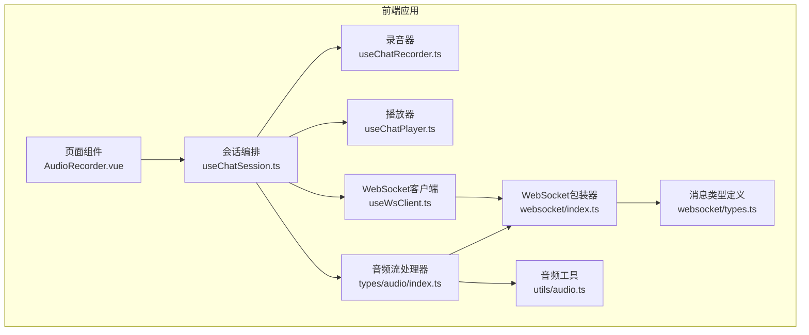
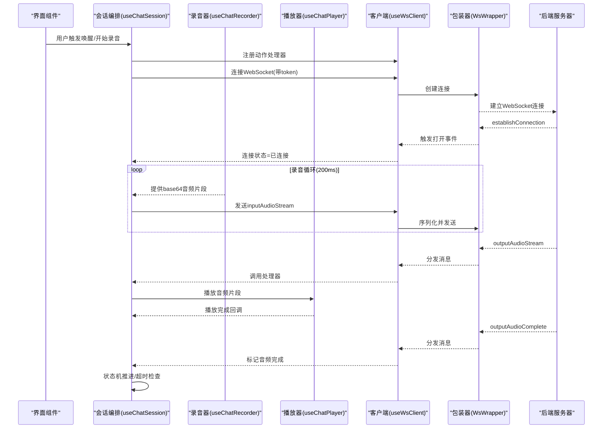
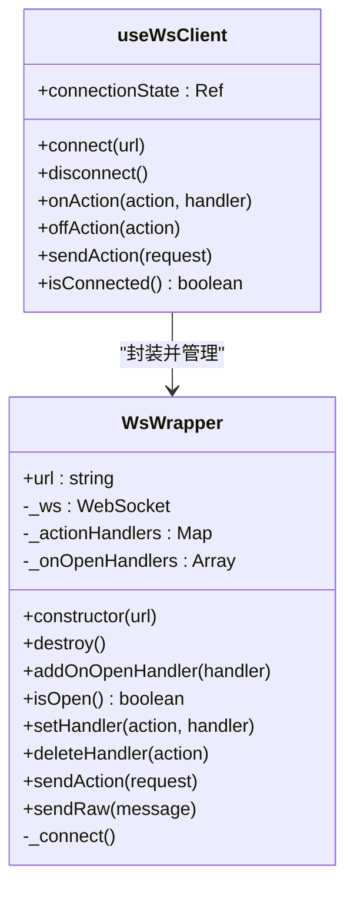
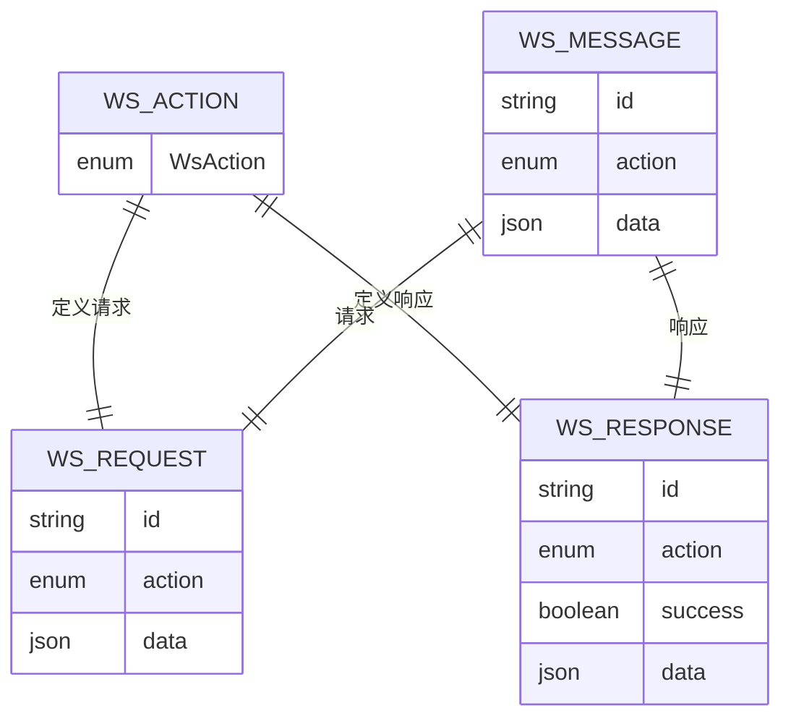
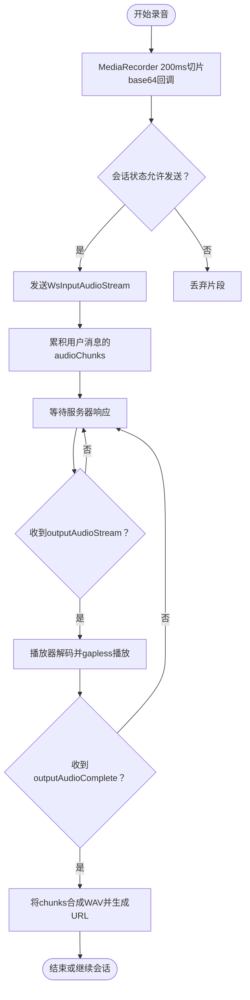
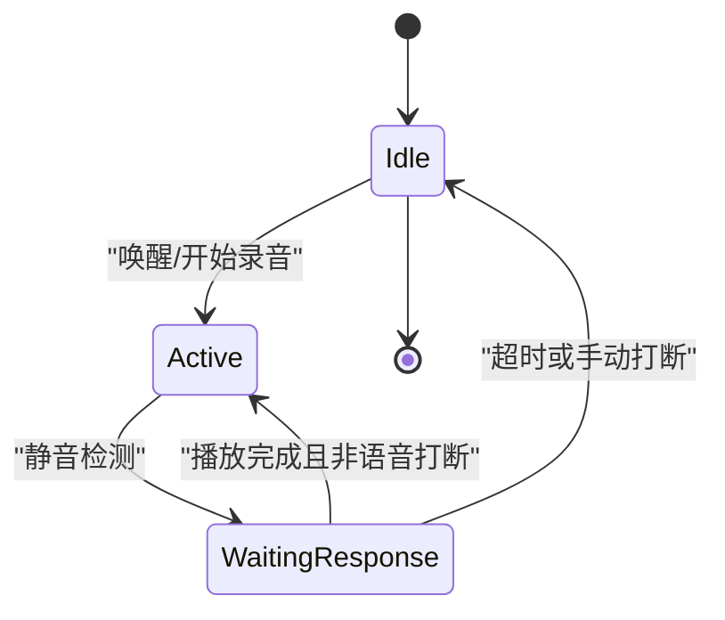
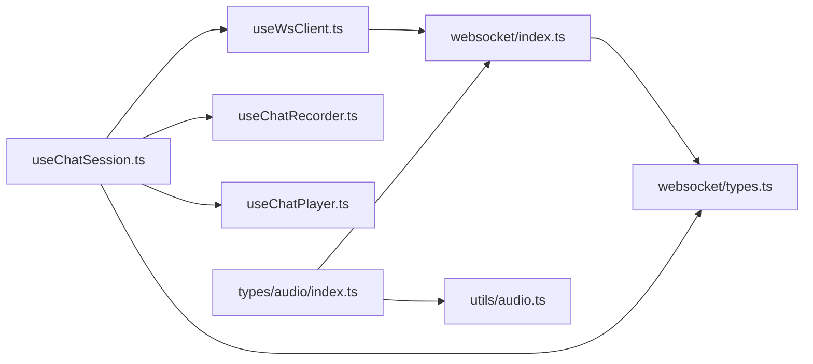

# WebSocket实时通信

<cite>
**本文档引用的文件**
- [useWsClient.ts](file://src/composables/useWsClient.ts)
- [websocket/index.ts](file://src/types/websocket/index.ts)
- [websocket/types.ts](file://src/types/websocket/types.ts)
- [useChatSession.ts](file://src/composables/useChatSession.ts)
- [useChatRecorder.ts](file://src/composables/useChatRecorder.ts)
- [useChatPlayer.ts](file://src/composables/useChatPlayer.ts)
- [audio.ts](file://src/utils/audio.ts)
- [audio/index.ts](file://src/types/audio/index.ts)
- [audio/types.ts](file://src/types/audio/types.ts)
- [AudioRecorder.vue](file://src/components/AudioRecorder.vue)
- [bus.ts](file://src/boot/bus.ts)
</cite>

## 目录
1. [简介](#简介)
2. [项目结构](#项目结构)
3. [核心组件](#核心组件)
4. [架构总览](#架构总览)
5. [详细组件分析](#详细组件分析)
6. [依赖关系分析](#依赖关系分析)
7. [性能考量](#性能考量)
8. [故障排除指南](#故障排除指南)
9. [结论](#结论)

## 简介
本文件面向Le Bot前端的WebSocket通信系统，聚焦实时音频流传输的协议设计与实现细节。内容涵盖连接管理、消息格式定义、事件处理机制、音频数据传输与实时状态同步、错误恢复策略、连接状态监控、自动重连机制、心跳检测、WebSocket API使用示例、消息序列化与反序列化、与音频处理模块的集成、数据缓冲与流控制策略，以及性能优化、并发连接管理与安全考虑。

## 项目结构
前端采用Vue生态，WebSocket通信由独立的可组合函数与类型定义封装，配合音频录制、播放与流处理器共同完成端到端的实时语音对话体验。关键目录与文件如下：
- 组合式函数层：useWsClient.ts、useChatSession.ts、useChatRecorder.ts、useChatPlayer.ts
- WebSocket类型与包装器：types/websocket/index.ts、types/websocket/types.ts
- 音频工具与流处理器：types/audio/index.ts、types/audio/types.ts、utils/audio.ts
- 页面组件：AudioRecorder.vue
- 全局事件总线：boot/bus.ts

**图表来源**
- [useChatSession.ts:75-425](file://src/composables/useChatSession.ts#L75-L425)
- [useWsClient.ts:29-102](file://src/composables/useWsClient.ts#L29-L102)
- [websocket/index.ts:5-91](file://src/types/websocket/index.ts#L5-L91)
- [websocket/types.ts:3-226](file://src/types/websocket/types.ts#L3-L226)
- [useChatRecorder.ts:36-136](file://src/composables/useChatRecorder.ts#L36-L136)
- [useChatPlayer.ts:35-161](file://src/composables/useChatPlayer.ts#L35-L161)
- [audio/index.ts:14-150](file://src/types/audio/index.ts#L14-L150)
- [audio.ts:1-47](file://src/utils/audio.ts#L1-L47)
- [AudioRecorder.vue:1-113](file://src/components/AudioRecorder.vue#L1-L113)

**章节来源**
- [useWsClient.ts:1-103](file://src/composables/useWsClient.ts#L1-L103)
- [websocket/index.ts:1-92](file://src/types/websocket/index.ts#L1-L92)
- [websocket/types.ts:1-226](file://src/types/websocket/types.ts#L1-L226)
- [useChatSession.ts:1-589](file://src/composables/useChatSession.ts#L1-L589)
- [useChatRecorder.ts:1-148](file://src/composables/useChatRecorder.ts#L1-L148)
- [useChatPlayer.ts:1-161](file://src/composables/useChatPlayer.ts#L1-L161)
- [audio/index.ts:1-150](file://src/types/audio/index.ts#L1-L150)
- [audio.ts:1-47](file://src/utils/audio.ts#L1-L47)
- [AudioRecorder.vue:1-113](file://src/components/AudioRecorder.vue#L1-L113)

## 核心组件
- WebSocket包装器与客户端
  - WsWrapper：封装原生WebSocket，提供自动重连、消息分发、连接状态查询等能力；支持注册打开事件回调与动作处理器。
  - useWsClient：Vue可组合函数，暴露连接状态、连接/断开、注册/移除处理器、发送请求等API，并继承自动重连行为。
- 消息协议与类型
  - WsAction枚举：定义所有动作类型，包括建立连接、输入/输出音频流、文本流、取消输出、清空上下文、更新配置等。
  - 请求/响应类型：每种动作对应请求类与成功/失败响应接口，统一携带id与action字段，支持序列化与反序列化。
- 音频处理链路
  - 录音器：使用MediaRecorder以WAV格式输出200ms片段，提供base64编码回调。
  - 播放器：基于Web Audio API解码并调度gapless播放，支持中断与完成标记。
  - 音频流处理器：将音频文件按时间片切分，逐片发送，最后一片使用完成请求。
  - PCM转WAV工具：将PCM数据与WAV头合并为完整音频Blob。
- 会话编排
  - useChatSession：状态机驱动的会话生命周期管理，负责连接建立、消息路由、录音/播放/静音检测、超时控制、打断与清理。

**章节来源**
- [websocket/index.ts:5-91](file://src/types/websocket/index.ts#L5-L91)
- [useWsClient.ts:29-102](file://src/composables/useWsClient.ts#L29-L102)
- [websocket/types.ts:3-226](file://src/types/websocket/types.ts#L3-L226)
- [useChatRecorder.ts:36-136](file://src/composables/useChatRecorder.ts#L36-L136)
- [useChatPlayer.ts:35-161](file://src/composables/useChatPlayer.ts#L35-L161)
- [audio/index.ts:14-150](file://src/types/audio/index.ts#L14-L150)
- [audio.ts:1-47](file://src/utils/audio.ts#L1-L47)
- [useChatSession.ts:75-425](file://src/composables/useChatSession.ts#L75-L425)

## 架构总览
WebSocket通信采用“包装器 + 可组合函数 + 类型系统”的分层设计，确保协议强类型、连接可靠、状态可控、扩展友好。

**图表来源**
- [useChatSession.ts:379-425](file://src/composables/useChatSession.ts#L379-L425)
- [useChatSession.ts:130-166](file://src/composables/useChatSession.ts#L130-L166)
- [useChatRecorder.ts:72-91](file://src/composables/useChatRecorder.ts#L72-L91)
- [useChatPlayer.ts:53-96](file://src/composables/useChatPlayer.ts#L53-L96)
- [useWsClient.ts:37-55](file://src/composables/useWsClient.ts#L37-L55)
- [websocket/index.ts:61-90](file://src/types/websocket/index.ts#L61-L90)

## 详细组件分析

### WebSocket包装器与客户端
- 设计要点
  - 自动重连：连接关闭后延迟重试，提升网络波动下的稳定性。
  - 动作分发：根据消息action分派到注册的处理器，未知动作发出通知并记录日志。
  - 生命周期管理：destroy时清理事件监听与处理器映射。
  - 打开事件：连接建立（含重连）时触发注册的打开回调。
- 关键流程
  - 连接建立：构造函数内创建WebSocket实例并绑定事件。
  - 发送消息：sendAction调用sendRaw，内部进行连接状态校验。
  - 接收消息：onmessage解析JSON后按action分发，未注册处理器则提示未知动作。

**图表来源**
- [websocket/index.ts:5-91](file://src/types/websocket/index.ts#L5-L91)
- [useWsClient.ts:29-102](file://src/composables/useWsClient.ts#L29-L102)

**章节来源**
- [websocket/index.ts:5-91](file://src/types/websocket/index.ts#L5-L91)
- [useWsClient.ts:1-103](file://src/composables/useWsClient.ts#L1-L103)

### 消息协议与类型系统
- 协议设计
  - 统一结构：每条消息包含id、action与data字段，id由uid生成，便于请求-响应关联。
  - 成功/失败：响应接口区分success字段，错误响应包含错误详情。
  - 动作枚举：覆盖建立连接、音频流/完成、文本流/完成、取消输出、清空上下文、更新配置等。
- 请求/响应映射
  - 输入音频：inputAudioStream（流）与inputAudioComplete（完成）。
  - 输出音频：outputAudioStream（流）与outputAudioComplete（完成）。
  - 文本流：outputTextStream（流）与outputTextComplete（完成）。
  - 控制类：cancelOutput、clearContext、updateConfig。
- 序列化与反序列化
  - 请求类实现serialize与toJSON，统一输出{id, action, data}。
  - 接收侧解析JSON后按action分发给对应处理器。

**图表来源**
- [websocket/types.ts:3-226](file://src/types/websocket/types.ts#L3-L226)

**章节来源**
- [websocket/types.ts:3-226](file://src/types/websocket/types.ts#L3-L226)

### 实时音频流传输
- 录音与分片
  - 使用MediaRecorder录制WAV，200ms切片，回调提供base64音频数据。
  - 录音器同时创建AnalyserNode用于静音检测，不进行音频回放。
- 流式发送
  - 会话中在录音回调里将base64片段封装为WsInputAudioStreamRequest并通过WebSocket发送。
  - 用户消息对象累积audioChunks，便于后续合成完整音频。
- 播放与拼接
  - 输出音频流通过WsOutputAudioStream接收，播放器解码并gapless播放。
  - 最后一片输出音频完成后，播放器标记完成，会话推进状态机。
  - 合成阶段将多片段PCM数据转为WAV并生成URL供消息展示。

**图表来源**
- [useChatRecorder.ts:72-91](file://src/composables/useChatRecorder.ts#L72-L91)
- [useChatSession.ts:391-404](file://src/composables/useChatSession.ts#L391-L404)
- [useChatSession.ts:130-166](file://src/composables/useChatSession.ts#L130-L166)
- [useChatPlayer.ts:53-96](file://src/composables/useChatPlayer.ts#L53-L96)
- [audio.ts:1-47](file://src/utils/audio.ts#L1-L47)

**章节来源**
- [useChatRecorder.ts:1-148](file://src/composables/useChatRecorder.ts#L1-L148)
- [useChatSession.ts:130-166](file://src/composables/useChatSession.ts#L130-L166)
- [useChatPlayer.ts:1-161](file://src/composables/useChatPlayer.ts#L1-L161)
- [audio.ts:1-47](file://src/utils/audio.ts#L1-L47)

### 会话状态机与实时同步
- 状态流转
  - Idle → WaitingResponse（等待响应）：录音开始，静音检测启动，定时器检查超时。
  - Active → WaitingResponse（静音检测）：进入等待响应状态，准备接收服务器回复。
  - WaitingResponse → Active/Idle：根据播放完成与超时策略推进。
- 超时与打断
  - 等待响应超时（默认约30秒）自动发送inputAudioComplete并回到Idle。
  - 手动打断或语音打断（用户文本长度≥2）会停止播放并清理缓冲。
- 实时同步
  - outputTextStream与outputTextComplete用于文本流式显示与最终化。
  - cancelOutput用于服务端主动中断当前输出，支持voice与manual两种类型。

**图表来源**
- [useChatSession.ts:244-303](file://src/composables/useChatSession.ts#L244-L303)
- [useChatSession.ts:346-365](file://src/composables/useChatSession.ts#L346-L365)
- [useChatSession.ts:227-238](file://src/composables/useChatSession.ts#L227-L238)

**章节来源**
- [useChatSession.ts:244-303](file://src/composables/useChatSession.ts#L244-L303)
- [useChatSession.ts:346-365](file://src/composables/useChatSession.ts#L346-L365)
- [useChatSession.ts:227-238](file://src/composables/useChatSession.ts#L227-L238)

### 错误恢复与自动重连
- 自动重连
  - WsWrapper在onclose后延迟重连，避免瞬时网络抖动导致频繁断开。
  - 连接建立时触发打开回调，useWsClient更新连接状态。
- 未知动作处理
  - 收到未知action时发出警告通知并打印消息，便于调试。
- 断线容错
  - 发送前检查连接状态，未连接时给出警告；会话层在Idle状态下避免发送音频流。

**章节来源**
- [websocket/index.ts:61-90](file://src/types/websocket/index.ts#L61-L90)
- [useWsClient.ts:37-63](file://src/composables/useWsClient.ts#L37-L63)
- [useChatSession.ts:328-344](file://src/composables/useChatSession.ts#L328-L344)

### 心跳检测与保活
- 当前实现
  - 未发现显式的ping/pong心跳机制。
- 建议
  - 在WsWrapper中增加定期ping与超时检测，onpong更新活跃状态，onclose触发重连。
  - 结合浏览器可见性变化与后台任务限制，动态调整心跳周期。

[本节为通用建议，不直接分析具体文件，故无章节来源]

### WebSocket API使用示例与最佳实践
- 基本使用
  - 注册处理器：在connect之前或之后均可注册，未连接时会缓存直到连接建立。
  - 发送请求：通过sendAction发送强类型请求，自动序列化为{id, action, data}。
  - 断开连接：destroy清理事件与处理器，释放资源。
- 会话集成
  - 在connect中先setupWsHandlers，再发起连接，确保消息到达即刻处理。
  - 录音回调中发送inputAudioStream，注意状态判断避免在Idle发送。
  - 播放完成回调中处理状态推进与资源回收。

**章节来源**
- [useWsClient.ts:65-87](file://src/composables/useWsClient.ts#L65-L87)
- [useChatSession.ts:379-425](file://src/composables/useChatSession.ts#L379-L425)

### 与音频处理模块的集成
- 录音器与播放器
  - 录音器提供base64回调，播放器负责解码与gapless播放。
  - 两者均在会话中被useChatSession协调，形成闭环。
- 文件流处理器
  - AudioStreamProcessor将音频文件按时间片切分，逐片发送，最后一片使用inputAudioComplete。
  - 支持进度回调与停止控制，适合批量上传场景。

**章节来源**
- [useChatRecorder.ts:36-136](file://src/composables/useChatRecorder.ts#L36-L136)
- [useChatPlayer.ts:35-161](file://src/composables/useChatPlayer.ts#L35-L161)
- [audio/index.ts:14-150](file://src/types/audio/index.ts#L14-L150)

## 依赖关系分析
- 组件耦合
  - useChatSession高度依赖useWsClient、useChatRecorder、useChatPlayer，形成会话编排的核心。
  - WsWrapper与websocket/types.ts构成协议层，被上层可组合函数复用。
- 数据流
  - 录音器→会话→WebSocket→服务器；服务器→WebSocket→会话→播放器→UI。
- 循环依赖
  - 未发现循环依赖，各模块职责清晰。

**图表来源**
- [useChatSession.ts:7-28](file://src/composables/useChatSession.ts#L7-L28)
- [useWsClient.ts:1-5](file://src/composables/useWsClient.ts#L1-L5)
- [websocket/index.ts:1-4](file://src/types/websocket/index.ts#L1-L4)
- [websocket/types.ts:1-4](file://src/types/websocket/types.ts#L1-L4)
- [audio/index.ts:1-13](file://src/types/audio/index.ts#L1-L13)
- [audio.ts:1-2](file://src/utils/audio.ts#L1-L2)

**章节来源**
- [useChatSession.ts:1-589](file://src/composables/useChatSession.ts#L1-L589)
- [useWsClient.ts:1-103](file://src/composables/useWsClient.ts#L1-L103)
- [websocket/index.ts:1-92](file://src/types/websocket/index.ts#L1-L92)
- [websocket/types.ts:1-226](file://src/types/websocket/types.ts#L1-L226)
- [audio/index.ts:1-150](file://src/types/audio/index.ts#L1-L150)
- [audio.ts:1-47](file://src/utils/audio.ts#L1-L47)

## 性能考量
- 音频分片与时序
  - 200ms切片平衡延迟与CPU占用；可根据设备性能调整。
  - 播放器gapless调度减少停顿，建议保持稳定的采样率与单声道以降低解码成本。
- 缓冲与内存
  - 会话中累积audioChunks，建议在Idle或销毁时及时清理并释放URL。
  - 播放器维护activeSources列表，播放结束后及时断开连接。
- 网络与重连
  - 自动重连间隔3秒，建议结合指数退避与最大重试次数。
  - 大文件上传建议使用AudioStreamProcessor的分片策略，避免单次消息过大。
- 并发连接管理
  - 单会话单WebSocket连接，避免多实例竞争；如需多会话，应隔离状态与处理器映射。

[本节提供通用指导，不直接分析具体文件，故无章节来源]

## 故障排除指南
- 无法发送消息
  - 检查连接状态，未连接时会给出警告；确保在Connected状态下发送。
  - 确认处理器已注册，未注册的动作会被视为未知并记录日志。
- 音频无声或卡顿
  - 检查录音器初始化与权限，确认getUserMedia成功。
  - 播放器解码失败会给出警告，检查base64数据完整性。
- 连接频繁断开
  - 查看自动重连日志，确认网络波动；必要时调整重连策略。
- 超时未结束
  - 确认WaitingResponse超时检查定时器运行正常，避免长时间无响应。
- 未知动作
  - 服务器新增动作时，前端需同步更新WsAction与处理器映射。

**章节来源**
- [useWsClient.ts:81-87](file://src/composables/useWsClient.ts#L81-L87)
- [websocket/index.ts:77-85](file://src/types/websocket/index.ts#L77-L85)
- [useChatSession.ts:346-365](file://src/composables/useChatSession.ts#L346-L365)
- [useChatPlayer.ts:93-95](file://src/composables/useChatPlayer.ts#L93-L95)

## 结论
Le Bot前端的WebSocket通信系统通过强类型的协议设计、可靠的自动重连机制与清晰的会话状态机，实现了稳定高效的实时音频对话体验。录音器、播放器与流处理器协同工作，配合会话编排，形成了从采集、传输、渲染到控制的完整链路。建议在现有基础上引入心跳保活、指数退避重连与更细粒度的性能监控，以进一步提升鲁棒性与用户体验。