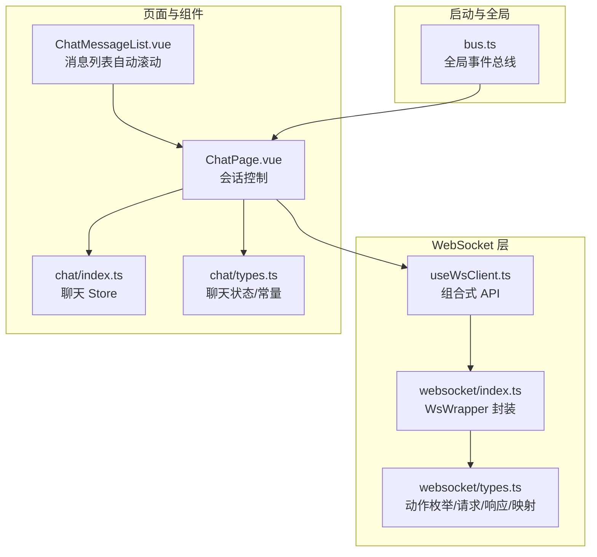
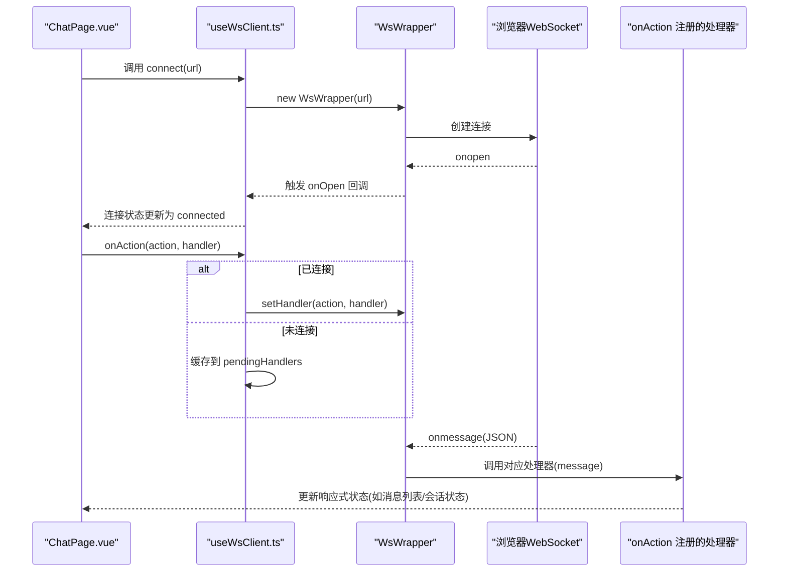
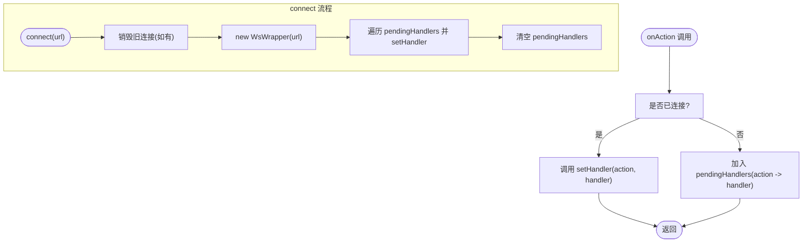
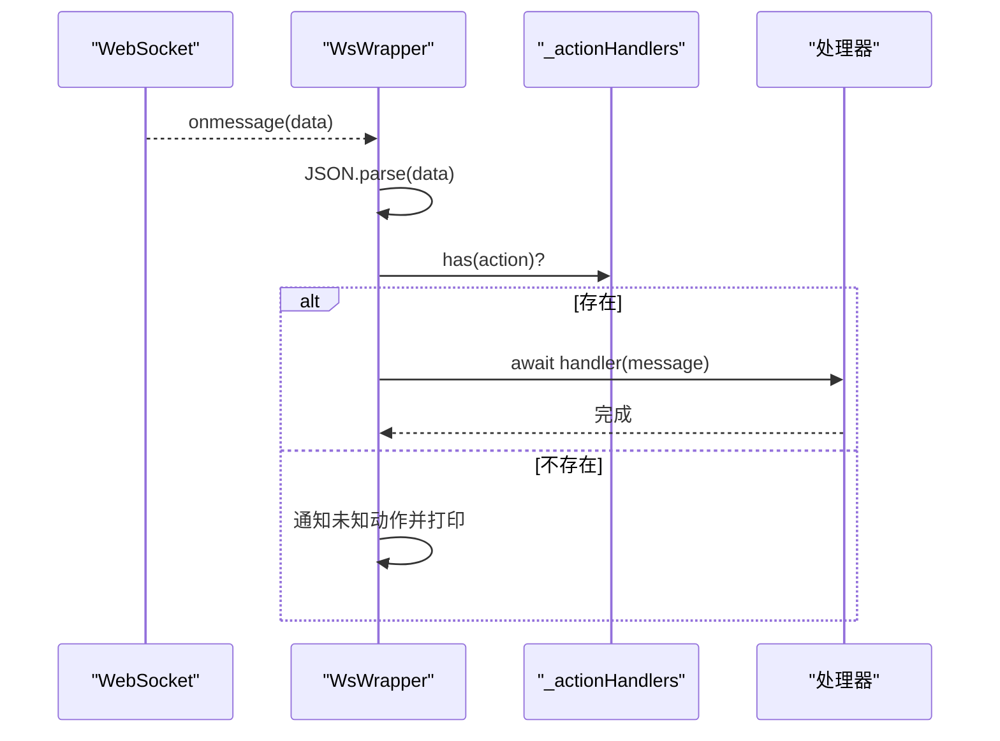
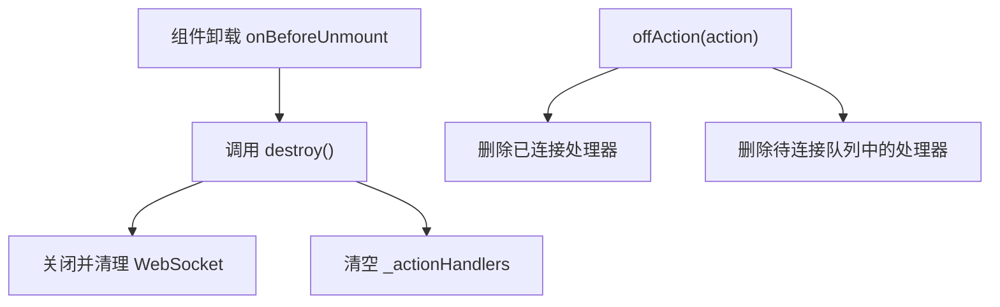
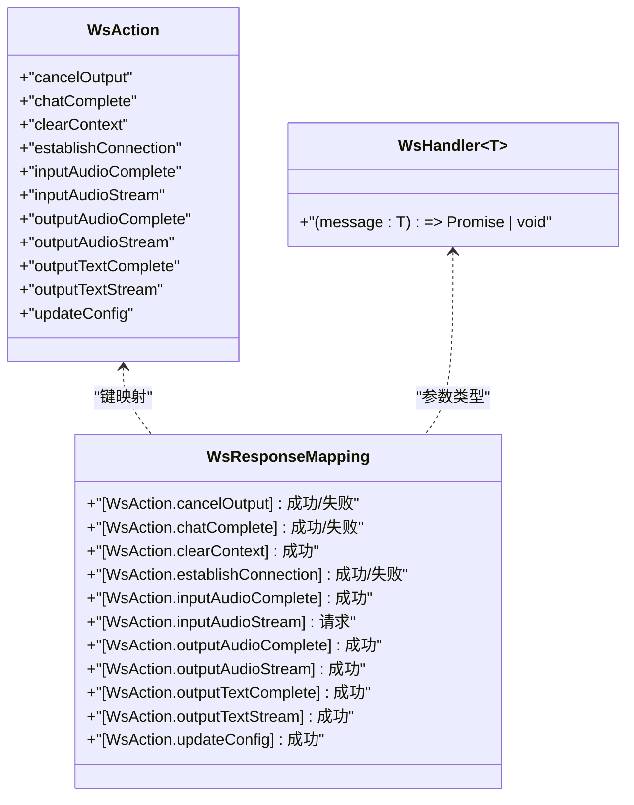
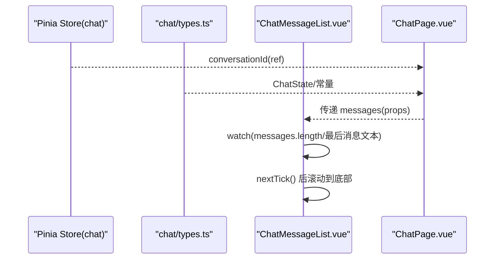
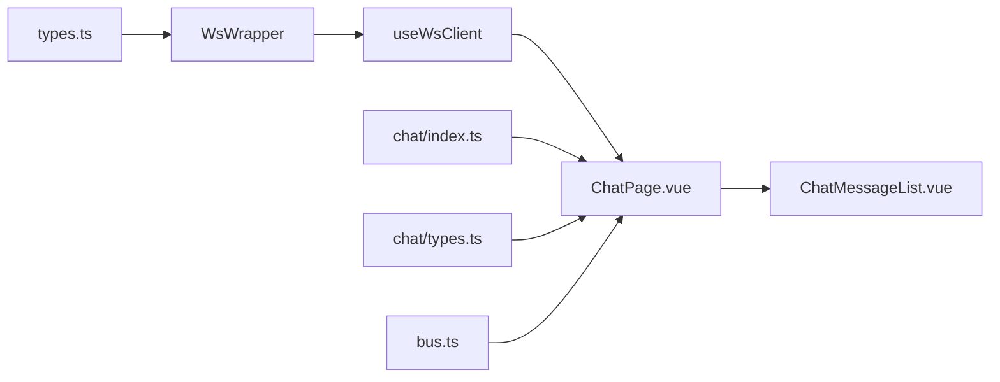

# 事件处理与回调机制

<cite>
**本文引用的文件**
- [src/boot/bus.ts](file://src/boot/bus.ts)
- [src/composables/useWsClient.ts](file://src/composables/useWsClient.ts)
- [src/types/websocket/index.ts](file://src/types/websocket/index.ts)
- [src/types/websocket/types.ts](file://src/types/websocket/types.ts)
- [src/pages/stack/ChatPage.vue](file://src/pages/stack/ChatPage.vue)
- [src/components/chat/ChatMessageList.vue](file://src/components/chat/ChatMessageList.vue)
- [src/stores/chat/index.ts](file://src/stores/chat/index.ts)
- [src/types/chat/types.ts](file://src/types/chat/types.ts)
</cite>

## 目录
1. [简介](#简介)
2. [项目结构](#项目结构)
3. [核心组件](#核心组件)
4. [架构总览](#架构总览)
5. [详细组件分析](#详细组件分析)
6. [依赖关系分析](#依赖关系分析)
7. [性能考虑](#性能考虑)
8. [故障排查指南](#故障排查指南)
9. [结论](#结论)
10. [附录](#附录)

## 简介
本文件面向 Le Bot 前端的 WebSocket 事件处理系统，系统性阐述事件监听器的注册、移除与管理机制，onAction 与 offAction 的使用方式与最佳实践，异步事件处理与回调管理，内存泄漏防护策略，事件队列与批量处理思路，类型安全与泛型约束，以及与 Vue 响应式系统的集成（ref 与 reactive）。同时提供事件调试工具、日志记录与性能监控建议。

## 项目结构
围绕 WebSocket 事件处理的关键目录与文件如下：
- 事件总线与全局注入：src/boot/bus.ts
- WebSocket 客户端封装与组合式 API：src/composables/useWsClient.ts、src/types/websocket/index.ts、src/types/websocket/types.ts
- 页面与组件集成：src/pages/stack/ChatPage.vue、src/components/chat/ChatMessageList.vue
- 聊天状态与配置：src/stores/chat/index.ts、src/types/chat/types.ts

图表来源
- [src/boot/bus.ts:1-18](file://src/boot/bus.ts#L1-L18)
- [src/composables/useWsClient.ts:1-103](file://src/composables/useWsClient.ts#L1-L103)
- [src/types/websocket/index.ts:1-92](file://src/types/websocket/index.ts#L1-L92)
- [src/types/websocket/types.ts:1-226](file://src/types/websocket/types.ts#L1-L226)
- [src/pages/stack/ChatPage.vue:1-179](file://src/pages/stack/ChatPage.vue#L1-L179)
- [src/components/chat/ChatMessageList.vue:1-68](file://src/components/chat/ChatMessageList.vue#L1-L68)
- [src/stores/chat/index.ts:1-17](file://src/stores/chat/index.ts#L1-L17)
- [src/types/chat/types.ts:1-96](file://src/types/chat/types.ts#L1-L96)

章节来源
- [src/boot/bus.ts:1-18](file://src/boot/bus.ts#L1-L18)
- [src/composables/useWsClient.ts:1-103](file://src/composables/useWsClient.ts#L1-L103)
- [src/types/websocket/index.ts:1-92](file://src/types/websocket/index.ts#L1-L92)
- [src/types/websocket/types.ts:1-226](file://src/types/websocket/types.ts#L1-L226)
- [src/pages/stack/ChatPage.vue:1-179](file://src/pages/stack/ChatPage.vue#L1-L179)
- [src/components/chat/ChatMessageList.vue:1-68](file://src/components/chat/ChatMessageList.vue#L1-L68)
- [src/stores/chat/index.ts:1-17](file://src/stores/chat/index.ts#L1-L17)
- [src/types/chat/types.ts:1-96](file://src/types/chat/types.ts#L1-L96)

## 核心组件
- 全局事件总线 bus.ts：基于 Quasar 的 EventBus 实现，定义了类型化的事件签名，便于在应用中进行跨组件通信。
- WebSocket 封装 WsWrapper：负责连接生命周期、消息分发、未知动作提示与自动重连。
- 组合式 API useWsClient：提供 onAction/offAction/sendAction 等接口，维护连接状态与待处理处理器队列。
- 类型系统 types.ts：定义 WsAction 枚举、请求/响应基类、具体请求/响应类型及响应映射，确保 onAction 的类型安全。
- 页面与组件：ChatPage.vue 驱动会话，ChatMessageList.vue 基于响应式数据自动滚动；store 与 chat 类型提供状态与常量支撑。

章节来源
- [src/boot/bus.ts:11-17](file://src/boot/bus.ts#L11-L17)
- [src/types/websocket/index.ts:5-91](file://src/types/websocket/index.ts#L5-L91)
- [src/composables/useWsClient.ts:8-23](file://src/composables/useWsClient.ts#L8-L23)
- [src/types/websocket/types.ts:3-226](file://src/types/websocket/types.ts#L3-L226)
- [src/pages/stack/ChatPage.vue:1-93](file://src/pages/stack/ChatPage.vue#L1-L93)
- [src/components/chat/ChatMessageList.vue:1-42](file://src/components/chat/ChatMessageList.vue#L1-L42)
- [src/stores/chat/index.ts:1-17](file://src/stores/chat/index.ts#L1-L17)
- [src/types/chat/types.ts:1-96](file://src/types/chat/types.ts#L1-L96)

## 架构总览
WebSocket 事件处理采用“组合式 API + 封装层 + 类型系统”的三层设计：
- 类型层：通过 WsAction 与 WsResponseMapping 确保 onAction 注册的处理器与其响应数据严格匹配。
- 封装层：WsWrapper 负责连接、消息解析、分发与自动重连；提供 setHandler/deleteHandler/addOnOpenHandler 等能力。
- 组合式层：useWsClient 提供 onAction/offAction/sendAction 等 API，并在未连接时缓存处理器，连接后统一应用。

图表来源
- [src/pages/stack/ChatPage.vue:21-36](file://src/pages/stack/ChatPage.vue#L21-L36)
- [src/composables/useWsClient.ts:37-55](file://src/composables/useWsClient.ts#L37-L55)
- [src/types/websocket/index.ts:61-90](file://src/types/websocket/index.ts#L61-L90)
- [src/types/websocket/index.ts:73-86](file://src/types/websocket/index.ts#L73-L86)

## 详细组件分析

### 事件监听器注册与移除（onAction/offAction）
- 注册 onAction：通过泛型约束确保处理器的参数类型与 WsResponseMapping[action] 匹配，避免运行期类型错误。
- 移除 offAction：从已连接实例与待连接队列中同时清理，防止悬挂处理器导致内存泄漏。
- 待连接队列：在 connect 之前注册的处理器会被暂存至 pendingHandlers，连接成功后统一应用，保证一致性。

图表来源
- [src/composables/useWsClient.ts:65-79](file://src/composables/useWsClient.ts#L65-L79)
- [src/composables/useWsClient.ts:50-54](file://src/composables/useWsClient.ts#L50-L54)

章节来源
- [src/composables/useWsClient.ts:65-79](file://src/composables/useWsClient.ts#L65-L79)
- [src/composables/useWsClient.ts:50-54](file://src/composables/useWsClient.ts#L50-L54)

### 异步事件处理与回调管理
- 消息分发：WsWrapper 在 onmessage 中解析 JSON，按 action 查找处理器并调用；处理器可返回 Promise，内部以 await 等待完成，确保串行顺序。
- 未知动作：当无法匹配处理器时，弹出警告通知并打印消息，便于调试。
- 连接通知：onOpen 时触发 onOpen 回调数组，用于 UI 反馈连接状态。

图表来源
- [src/types/websocket/index.ts:73-86](file://src/types/websocket/index.ts#L73-L86)
- [src/types/websocket/index.ts:41-47](file://src/types/websocket/index.ts#L41-L47)

章节来源
- [src/types/websocket/index.ts:73-86](file://src/types/websocket/index.ts#L73-L86)
- [src/types/websocket/index.ts:41-47](file://src/types/websocket/index.ts#L41-L47)

### 内存泄漏防护
- offAction 同时清理已连接实例与待连接队列，避免悬挂处理器。
- destroy 清理 WebSocket 与处理器映射，断开连接时释放资源。
- 组件卸载：ChatPage.vue 在 onBeforeUnmount 中调用 destroy，确保离开页面时释放资源。

图表来源
- [src/pages/stack/ChatPage.vue:90-92](file://src/pages/stack/ChatPage.vue#L90-L92)
- [src/types/websocket/index.ts:24-31](file://src/types/websocket/index.ts#L24-L31)
- [src/composables/useWsClient.ts:74-79](file://src/composables/useWsClient.ts#L74-L79)

章节来源
- [src/pages/stack/ChatPage.vue:90-92](file://src/pages/stack/ChatPage.vue#L90-L92)
- [src/types/websocket/index.ts:24-31](file://src/types/websocket/index.ts#L24-L31)
- [src/composables/useWsClient.ts:74-79](file://src/composables/useWsClient.ts#L74-L79)

### 事件队列处理、优先级与批量策略
- 当前实现为单队列（Map）按 action 分发，无显式优先级与批量处理逻辑。
- 建议（概念性）：
  - 优先级：为处理器注册增加优先级字段，分组执行或在分发时按优先级排序。
  - 批量：对高频事件（如 outputTextStream）合并多次更新，减少渲染压力。
  - 背压：在处理器内实现节流/去抖，避免过载。

[本节为概念性建议，不直接分析具体文件，故无章节来源]

### 类型安全与泛型约束
- WsAction 枚举与 WsResponseMapping 映射确保 onAction 的处理器参数类型与响应一致。
- 泛型约束 T extends WsAction 与 WsHandler<WsResponseMapping[T]> 保证编译期类型检查。
- 请求侧 WsRequest 与序列化方法确保发送数据结构正确。

图表来源
- [src/types/websocket/types.ts:3-15](file://src/types/websocket/types.ts#L3-L15)
- [src/types/websocket/types.ts:204-216](file://src/types/websocket/types.ts#L204-L216)
- [src/types/websocket/types.ts:225](file://src/types/websocket/types.ts#L225)

章节来源
- [src/types/websocket/types.ts:3-15](file://src/types/websocket/types.ts#L3-L15)
- [src/types/websocket/types.ts:204-216](file://src/types/websocket/types.ts#L204-L216)
- [src/types/websocket/types.ts:225](file://src/types/websocket/types.ts#L225)

### 与 Vue 响应式系统的集成（ref 与 reactive）
- useWsClient 返回 connectionState 为 ref，页面可直接响应连接状态变化。
- ChatMessageList 基于 props.messages 的长度与最后一条消息文本/完成态变化触发 watch，配合 nextTick 自动滚动到底部。
- Pinia store 与 chat 类型提供持久化与状态常量支持。

图表来源
- [src/stores/chat/index.ts:1-17](file://src/stores/chat/index.ts#L1-L17)
- [src/types/chat/types.ts:11-43](file://src/types/chat/types.ts#L11-L43)
- [src/components/chat/ChatMessageList.vue:14-33](file://src/components/chat/ChatMessageList.vue#L14-L33)
- [src/pages/stack/ChatPage.vue:17-36](file://src/pages/stack/ChatPage.vue#L17-L36)

章节来源
- [src/stores/chat/index.ts:1-17](file://src/stores/chat/index.ts#L1-L17)
- [src/types/chat/types.ts:11-43](file://src/types/chat/types.ts#L11-L43)
- [src/components/chat/ChatMessageList.vue:14-33](file://src/components/chat/ChatMessageList.vue#L14-L33)
- [src/pages/stack/ChatPage.vue:17-36](file://src/pages/stack/ChatPage.vue#L17-L36)

### 事件调试工具、日志记录与性能监控
- 通知与日志：WsWrapper 在连接/断开/未知动作时通过 Notify 输出提示；onmessage 未命中处理器时打印消息，便于定位问题。
- 性能建议（概念性）：
  - 为处理器添加执行耗时统计与阈值告警。
  - 对高频事件（如音频/文本流）采用批处理与节流。
  - 使用浏览器性能面板观察渲染与网络峰值。

章节来源
- [src/types/websocket/index.ts:8-15](file://src/types/websocket/index.ts#L8-L15)
- [src/types/websocket/index.ts:78-85](file://src/types/websocket/index.ts#L78-L85)

## 依赖关系分析
- useWsClient 依赖 WsWrapper 与类型系统，负责生命周期与处理器注册。
- WsWrapper 依赖 Quasar Notify 与浏览器 WebSocket，负责连接与消息分发。
- 页面与组件通过组合式 API 与 store 获取状态，驱动 UI 更新。

图表来源
- [src/types/websocket/types.ts:1-226](file://src/types/websocket/types.ts#L1-L226)
- [src/types/websocket/index.ts:1-92](file://src/types/websocket/index.ts#L1-L92)
- [src/composables/useWsClient.ts:1-103](file://src/composables/useWsClient.ts#L1-L103)
- [src/pages/stack/ChatPage.vue:1-179](file://src/pages/stack/ChatPage.vue#L1-L179)
- [src/components/chat/ChatMessageList.vue:1-68](file://src/components/chat/ChatMessageList.vue#L1-L68)
- [src/stores/chat/index.ts:1-17](file://src/stores/chat/index.ts#L1-L17)
- [src/types/chat/types.ts:1-96](file://src/types/chat/types.ts#L1-L96)
- [src/boot/bus.ts:1-18](file://src/boot/bus.ts#L1-L18)

章节来源
- [src/types/websocket/types.ts:1-226](file://src/types/websocket/types.ts#L1-L226)
- [src/types/websocket/index.ts:1-92](file://src/types/websocket/index.ts#L1-L92)
- [src/composables/useWsClient.ts:1-103](file://src/composables/useWsClient.ts#L1-L103)
- [src/pages/stack/ChatPage.vue:1-179](file://src/pages/stack/ChatPage.vue#L1-L179)
- [src/components/chat/ChatMessageList.vue:1-68](file://src/components/chat/ChatMessageList.vue#L1-L68)
- [src/stores/chat/index.ts:1-17](file://src/stores/chat/index.ts#L1-L17)
- [src/types/chat/types.ts:1-96](file://src/types/chat/types.ts#L1-L96)
- [src/boot/bus.ts:1-18](file://src/boot/bus.ts#L1-L18)

## 性能考虑
- 处理器异步：处理器可返回 Promise，内部 await 保证串行，避免并发竞争；但需注意长耗时处理器可能阻塞后续事件。
- 高频事件：对 outputTextStream/outputAudioStream 等高频事件建议合并更新与节流，减少渲染与字符串拼接开销。
- 连接稳定性：自动重连与 onOpen 回调有助于快速恢复 UI 状态，但频繁断开会影响体验，建议在网络异常时增加退避策略。

[本节提供通用指导，不直接分析具体文件，故无章节来源]

## 故障排查指南
- 无法接收事件：确认 onAction 是否在 connect 之后注册，或是否被 offAction 移除；检查未知动作通知与控制台输出。
- 发送失败：sendAction 在未连接时会给出警告，需先调用 connect 并等待连接状态变为 connected。
- 内存泄漏：确保在组件卸载时调用 destroy 或 offAction 清理处理器；避免在多个组件重复注册相同 action。
- UI 不更新：检查响应式数据是否变更（如 messages），以及 watch/nextTick 的使用是否正确。

章节来源
- [src/composables/useWsClient.ts:81-87](file://src/composables/useWsClient.ts#L81-L87)
- [src/types/websocket/index.ts:78-85](file://src/types/websocket/index.ts#L78-L85)
- [src/pages/stack/ChatPage.vue:90-92](file://src/pages/stack/ChatPage.vue#L90-L92)

## 结论
该系统通过类型安全的泛型约束与封装层实现了清晰的事件处理流程，结合 Vue 响应式系统提供了良好的开发体验。建议在高频事件场景引入批处理与节流策略，并完善性能监控与告警机制，以进一步提升稳定性与用户体验。

## 附录
- 最佳实践清单
  - 在 connect 之后再注册 onAction，或利用待连接队列机制。
  - 为每个 action 单独注册处理器，避免在单一处理器中处理多种 action。
  - 在组件卸载时调用 offAction 或 destroy，防止悬挂处理器。
  - 对高频事件采用节流/去抖与批处理，降低渲染压力。
  - 使用通知与日志辅助调试，建立性能指标与告警。

[本节为总结性内容，不直接分析具体文件，故无章节来源]