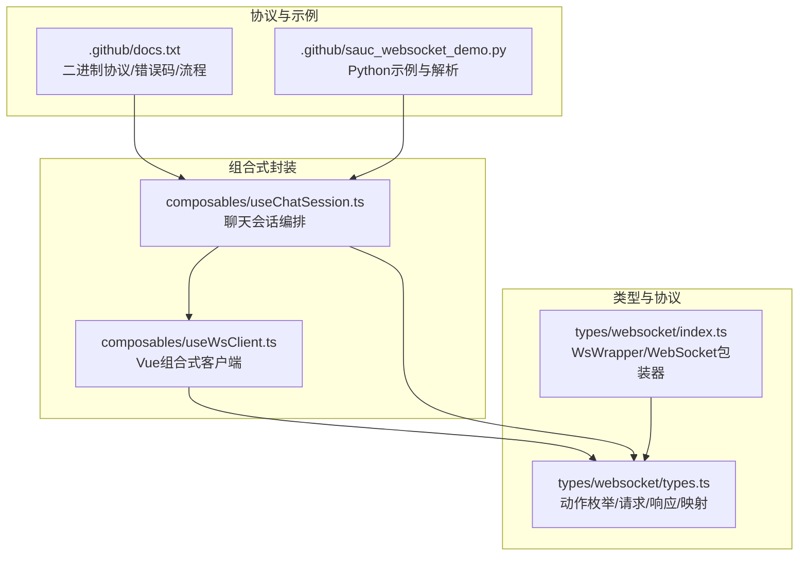
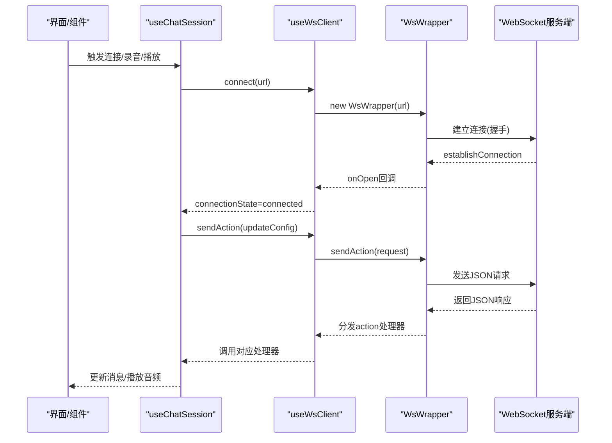
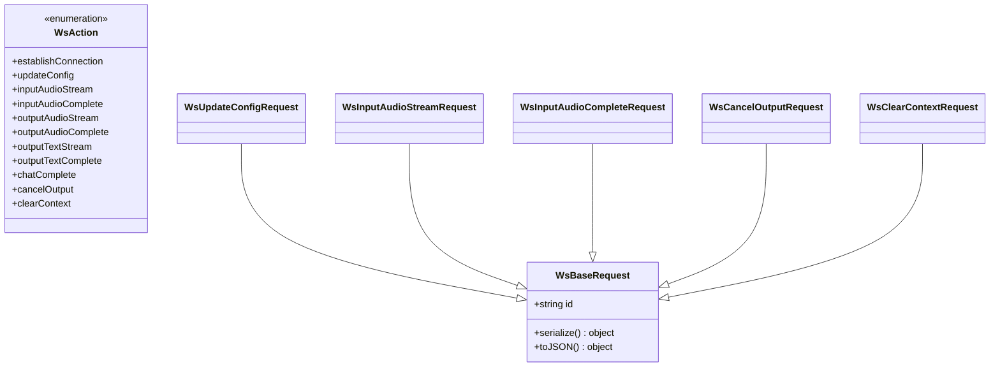
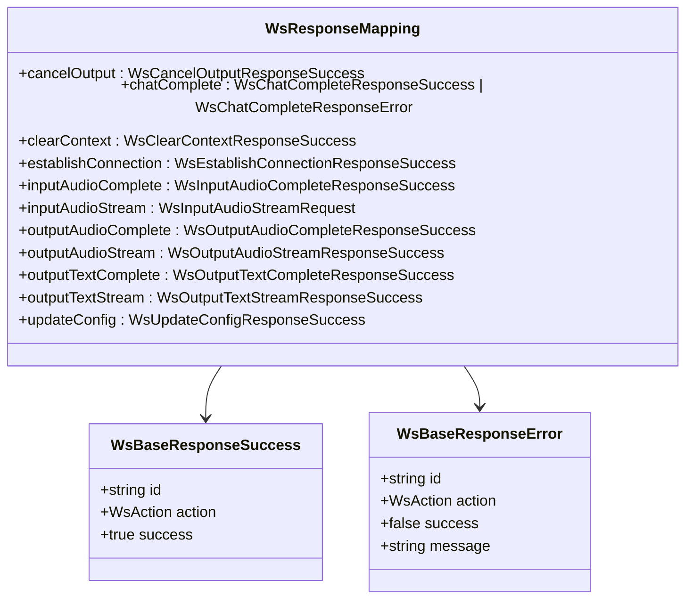
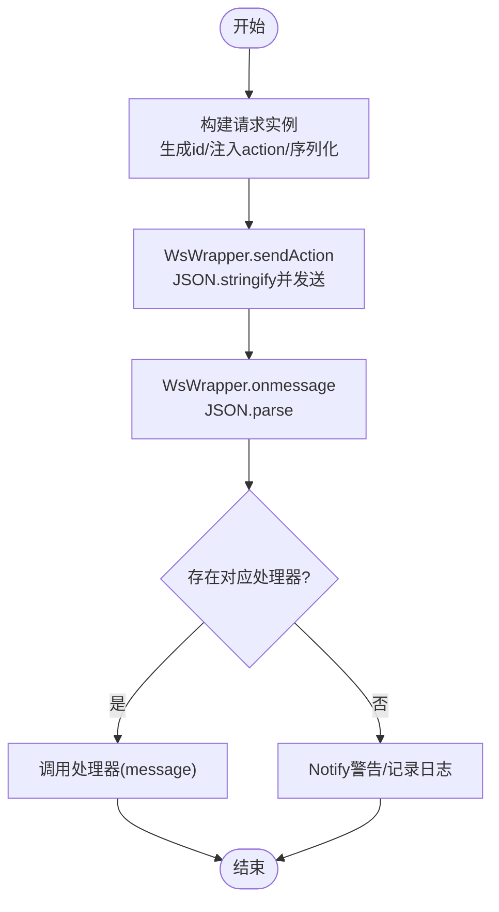
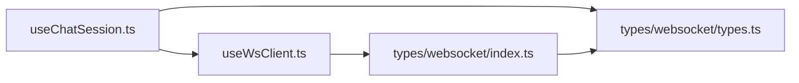

# 消息协议与数据格式

<cite>
**本文引用的文件**
- [src/types/websocket/index.ts](file://src/types/websocket/index.ts)
- [src/types/websocket/types.ts](file://src/types/websocket/types.ts)
- [src/composables/useWsClient.ts](file://src/composables/useWsClient.ts)
- [src/composables/useChatSession.ts](file://src/composables/useChatSession.ts)
- [.github/docs.txt](file://.github/docs.txt)
- [.github/sauc_websocket_demo.py](file://.github/sauc_websocket_demo.py)
</cite>

## 目录
1. [简介](#简介)
2. [项目结构](#项目结构)
3. [核心组件](#核心组件)
4. [架构总览](#架构总览)
5. [详细组件分析](#详细组件分析)
6. [依赖关系分析](#依赖关系分析)
7. [性能考量](#性能考量)
8. [故障排查指南](#故障排查指南)
9. [结论](#结论)
10. [附录](#附录)

## 简介
本文件面向 Le Bot WebSocket 消息协议，系统化梳理请求与响应的数据结构、WsAction 动作类型系统、WsRequest/WsResponse 映射机制、消息序列化与反序列化流程、消息头设计与版本控制策略、向后兼容性、JSON Schema 定义与示例、消息验证规则、错误码与异常处理，以及消息压缩、加密传输与安全校验的实现方案。文档同时结合前端实现与官方二进制协议文档，给出可操作的工程实践建议。

## 项目结构
前端 WebSocket 协议相关代码集中在 types/websocket 与 composables 层：
- 类型与协议定义：src/types/websocket/types.ts
- WebSocket 包装器：src/types/websocket/index.ts
- 组合式封装：src/composables/useWsClient.ts
- 业务会话编排：src/composables/useChatSession.ts
- 协议与示例：.github/docs.txt、.github/sauc_websocket_demo.py

图表来源
- [src/types/websocket/types.ts:1-226](file://src/types/websocket/types.ts#L1-L226)
- [src/types/websocket/index.ts:1-92](file://src/types/websocket/index.ts#L1-L92)
- [src/composables/useWsClient.ts:1-103](file://src/composables/useWsClient.ts#L1-L103)
- [src/composables/useChatSession.ts:1-589](file://src/composables/useChatSession.ts#L1-L589)
- [.github/docs.txt:1-967](file://.github/docs.txt#L1-L967)
- [.github/sauc_websocket_demo.py:1-523](file://.github/sauc_websocket_demo.py#L1-L523)

章节来源
- [src/types/websocket/types.ts:1-226](file://src/types/websocket/types.ts#L1-L226)
- [src/types/websocket/index.ts:1-92](file://src/types/websocket/index.ts#L1-L92)
- [src/composables/useWsClient.ts:1-103](file://src/composables/useWsClient.ts#L1-L103)
- [src/composables/useChatSession.ts:1-589](file://src/composables/useChatSession.ts#L1-L589)
- [.github/docs.txt:1-967](file://.github/docs.txt#L1-L967)
- [.github/sauc_websocket_demo.py:1-523](file://.github/sauc_websocket_demo.py#L1-L523)

## 核心组件
- WsAction 枚举：定义所有动作类型，如 establishConnection、updateConfig、inputAudioStream、outputAudioStream、outputTextStream、chatComplete、cancelOutput 等。
- WsBaseRequest 抽象类：统一 id 生成、action 注入与序列化接口，派生类负责 data 结构。
- WsBaseResponseSuccess/WsBaseResponseError：统一响应头结构，success 字段区分成功/失败。
- WsWrapper：WebSocket 连接、自动重连、消息收发、处理器注册与分发。
- useWsClient：Vue 组合式封装，管理连接状态、处理器队列、发送请求。
- useChatSession：业务层编排，注册各类 WsAction 处理器，驱动录音、播放、中断、超时等。

章节来源
- [src/types/websocket/types.ts:3-47](file://src/types/websocket/types.ts#L3-L47)
- [src/types/websocket/types.ts:17-28](file://src/types/websocket/types.ts#L17-L28)
- [src/types/websocket/index.ts:5-91](file://src/types/websocket/index.ts#L5-L91)
- [src/composables/useWsClient.ts:29-102](file://src/composables/useWsClient.ts#L29-L102)
- [src/composables/useChatSession.ts:100-132](file://src/composables/useChatSession.ts#L100-L132)

## 架构总览
前端 WebSocket 协议架构由“类型定义层 + 包装器层 + 组合式层 + 业务层”构成，遵循“动作驱动 + 类型安全 + 自动重连”的设计原则。

图表来源
- [src/composables/useChatSession.ts:379-425](file://src/composables/useChatSession.ts#L379-L425)
- [src/composables/useWsClient.ts:37-55](file://src/composables/useWsClient.ts#L37-L55)
- [src/types/websocket/index.ts:61-90](file://src/types/websocket/index.ts#L61-L90)
- [src/types/websocket/types.ts:204-226](file://src/types/websocket/types.ts#L204-L226)

## 详细组件分析

### WsAction 动作类型系统
- 动作枚举覆盖：连接建立、配置更新、音频流、文本流、完成通知、取消输出、清空上下文等。
- 类型安全：通过 WsResponseMapping 将每个 WsAction 与对应的响应类型绑定，确保处理器收到的响应与动作一致。

图表来源
- [src/types/websocket/types.ts:3-15](file://src/types/websocket/types.ts#L3-L15)
- [src/types/websocket/types.ts:30-47](file://src/types/websocket/types.ts#L30-L47)
- [src/types/websocket/types.ts:169-195](file://src/types/websocket/types.ts#L169-L195)
- [src/types/websocket/types.ts:119-131](file://src/types/websocket/types.ts#L119-L131)
- [src/types/websocket/types.ts:105-117](file://src/types/websocket/types.ts#L105-L117)
- [src/types/websocket/types.ts:77-89](file://src/types/websocket/types.ts#L77-L89)
- [src/types/websocket/types.ts:91-95](file://src/types/websocket/types.ts#L91-L95)

章节来源
- [src/types/websocket/types.ts:3-15](file://src/types/websocket/types.ts#L3-L15)
- [src/types/websocket/types.ts:30-47](file://src/types/websocket/types.ts#L30-L47)
- [src/types/websocket/types.ts:169-195](file://src/types/websocket/types.ts#L169-L195)
- [src/types/websocket/types.ts:119-131](file://src/types/websocket/types.ts#L119-L131)
- [src/types/websocket/types.ts:105-117](file://src/types/websocket/types.ts#L105-L117)
- [src/types/websocket/types.ts:77-89](file://src/types/websocket/types.ts#L77-L89)
- [src/types/websocket/types.ts:91-95](file://src/types/websocket/types.ts#L91-L95)

### WsRequest/WsResponse 映射机制
- 映射表 WsResponseMapping 将每个 WsAction 对应到唯一响应类型集合，确保处理器签名与响应结构强一致。
- 成功/失败两类响应共享基础字段，便于统一处理与错误分支。

图表来源
- [src/types/websocket/types.ts:204-216](file://src/types/websocket/types.ts#L204-L216)
- [src/types/websocket/types.ts:17-28](file://src/types/websocket/types.ts#L17-L28)

章节来源
- [src/types/websocket/types.ts:204-216](file://src/types/websocket/types.ts#L204-L216)
- [src/types/websocket/types.ts:17-28](file://src/types/websocket/types.ts#L17-L28)

### 消息序列化与反序列化处理流程
- 发送侧：WsWrapper.sendAction 将 WsRequest 实例序列化为字符串并发送；请求实例通过 toJSON/serialize 提供 id 与 action。
- 接收侧：WsWrapper.onmessage 收到消息后 JSON.parse，按 message.action 分发给已注册处理器；未知动作发出警告并记录日志。
- 类型安全：useWsClient 在注册处理器时使用泛型约束，确保处理器签名与 WsResponseMapping 对应类型一致。

图表来源
- [src/types/websocket/index.ts:49-86](file://src/types/websocket/index.ts#L49-L86)
- [src/types/websocket/types.ts:35-46](file://src/types/websocket/types.ts#L35-L46)
- [src/composables/useWsClient.ts:65-72](file://src/composables/useWsClient.ts#L65-L72)

章节来源
- [src/types/websocket/index.ts:49-86](file://src/types/websocket/index.ts#L49-L86)
- [src/types/websocket/types.ts:35-46](file://src/types/websocket/types.ts#L35-L46)
- [src/composables/useWsClient.ts:65-72](file://src/composables/useWsClient.ts#L65-L72)

### 消息头设计、版本控制与向后兼容
- 前端 JSON 协议未使用二进制头，但官方文档与示例展示了二进制协议的头字段：协议版本、头大小、消息类型、消息类型特定标志、序列化方法、压缩方法、保留位等。
- 版本控制：二进制协议头包含协议版本字段，当前版本为 0b0001；保留位用于扩展。
- 兼容策略：二进制协议支持“无序列化/JSON”、“无压缩/Gzip”等组合；客户端与服务端约定一致的序列化与压缩方式，确保跨版本兼容。

章节来源
- [.github/docs.txt:93-207](file://.github/docs.txt#L93-L207)
- [.github/sauc_websocket_demo.py:26-47](file://.github/sauc_websocket_demo.py#L26-L47)
- [.github/sauc_websocket_demo.py:141-176](file://.github/sauc_websocket_demo.py#L141-L176)

### 不同类型消息的 JSON Schema 定义与示例
以下为基于源码的结构化描述（不直接粘贴代码）：
- 基础请求/响应
  - 请求：包含 id、action、data（按动作类型定义）。
  - 响应：包含 id、action、success、data（成功）或 message（失败）。
- updateConfig
  - 请求：包含 conversationId、location、outputText、sampleRate、speechRate、timezone、voiceId 等可选字段。
  - 响应：包含 conversationId。
- inputAudioStream/inputAudioComplete
  - 请求：包含 base64 编码的音频缓冲区。
  - 响应：通用成功确认。
- outputAudioStream/outputAudioComplete
  - 响应：包含 chatId、conversationId、buffer（base64）。
- outputTextStream/outputTextComplete
  - 响应：包含 chatId、conversationId、role、text。
- chatComplete
  - 响应：成功时包含 chatId、conversationId、createdAt、completedAt；失败时包含错误数组。
- cancelOutput/clearContext
  - 响应：cancelOutput 返回 cancelType；clearContext 为简单成功确认。

章节来源
- [src/types/websocket/types.ts:169-202](file://src/types/websocket/types.ts#L169-L202)
- [src/types/websocket/types.ts:105-117](file://src/types/websocket/types.ts#L105-L117)
- [src/types/websocket/types.ts:119-131](file://src/types/websocket/types.ts#L119-L131)
- [src/types/websocket/types.ts:137-152](file://src/types/websocket/types.ts#L137-L152)
- [src/types/websocket/types.ts:159-167](file://src/types/websocket/types.ts#L159-L167)
- [src/types/websocket/types.ts:56-75](file://src/types/websocket/types.ts#L56-L75)
- [src/types/websocket/types.ts:49-54](file://src/types/websocket/types.ts#L49-L54)
- [src/types/websocket/types.ts:97-99](file://src/types/websocket/types.ts#L97-L99)

### 消息验证规则、错误码定义与异常处理
- 验证规则
  - 必填字段：id、action；成功响应包含 success=true 与 data；失败响应包含 success=false 与 message。
  - 动作一致性：message.action 必须与已注册处理器的动作一致。
- 错误码（二进制协议）
  - 成功：20000000
  - 参数无效：45000001
  - 空音频：45000002
  - 等包超时：45000081
  - 音频格式不正确：45000002
  - 服务内部错误：550xxxxx
  - 服务器繁忙/过载：55000031
- 异常处理
  - 未知动作：弹出警告并记录日志。
  - 连接断开：自动重连并提示。
  - 发送前检查连接状态：未连接时给出警告。

章节来源
- [src/types/websocket/types.ts:17-28](file://src/types/websocket/types.ts#L17-L28)
- [src/types/websocket/index.ts:77-85](file://src/types/websocket/index.ts#L77-L85)
- [.github/docs.txt:930-967](file://.github/docs.txt#L930-L967)

### 消息压缩、加密传输与安全校验
- 压缩
  - 二进制协议支持 Gzip 压缩；前端 JSON 协议未使用压缩，但可借鉴二进制协议的压缩策略。
- 加密传输
  - 使用 wss:// 协议进行 TLS 加密传输。
- 安全校验
  - 建连阶段通过 HTTP 头传递鉴权信息（如 X-Api-App-Key、X-Api-Access-Key、X-Api-Resource-Id、X-Api-Connect-Id）。
  - 建连成功后服务端返回 X-Tt-Logid，便于排障。

章节来源
- [.github/docs.txt:21-87](file://.github/docs.txt#L21-L87)
- [.github/docs.txt:93-207](file://.github/docs.txt#L93-L207)
- [.github/sauc_websocket_demo.py:182-190](file://.github/sauc_websocket_demo.py#L182-L190)

## 依赖关系分析
- useChatSession 依赖 useWsClient 与 types/websocket/types，负责注册处理器、发送请求、状态机与业务逻辑编排。
- useWsClient 依赖 WsWrapper，提供连接生命周期管理与处理器队列。
- WsWrapper 依赖 types/websocket/types，负责消息收发与分发。
- 业务层通过 WsAction 与 WsResponseMapping 实现强类型绑定，降低耦合。

图表来源
- [src/composables/useChatSession.ts:1-28](file://src/composables/useChatSession.ts#L1-L28)
- [src/composables/useWsClient.ts:1-5](file://src/composables/useWsClient.ts#L1-L5)
- [src/types/websocket/index.ts:1-4](file://src/types/websocket/index.ts#L1-L4)
- [src/types/websocket/types.ts:1-4](file://src/types/websocket/types.ts#L1-L4)

章节来源
- [src/composables/useChatSession.ts:1-28](file://src/composables/useChatSession.ts#L1-L28)
- [src/composables/useWsClient.ts:1-5](file://src/composables/useWsClient.ts#L1-L5)
- [src/types/websocket/index.ts:1-4](file://src/types/websocket/index.ts#L1-L4)
- [src/types/websocket/types.ts:1-4](file://src/types/websocket/types.ts#L1-L4)

## 性能考量
- 流式音频分包：建议单包 100–200ms，避免过大或过小影响性能。
- 二进制协议：使用 Gzip 压缩与 JSON 序列化，减少带宽占用。
- 实时性优化：双向流式优化版本（如 bigmodel_async）仅在结果变化时返回，RTF 与首字/尾字时延更优。
- 连接与重连：自动重连与连接状态管理，避免长时间无响应导致的体验问题。

章节来源
- [.github/docs.txt:10-19](file://.github/docs.txt#L10-L19)
- [.github/docs.txt:197-207](file://.github/docs.txt#L197-L207)
- [.github/sauc_websocket_demo.py:49-75](file://.github/sauc_websocket_demo.py#L49-L75)

## 故障排查指南
- 未知动作
  - 现象：收到未注册的动作，弹出警告并记录日志。
  - 处理：检查动作枚举与处理器注册是否匹配。
- 连接断开
  - 现象：自动重连并提示“WebSocket closed, reconnecting...”。
  - 处理：检查网络、鉴权头、服务端状态。
- 发送失败
  - 现象：未连接时发送会给出警告。
  - 处理：等待连接状态变为 connected 后再发送。
- 错误码定位
  - 参考错误码表，结合 X-Tt-Logid 定位问题。

章节来源
- [src/types/websocket/index.ts:63-90](file://src/types/websocket/index.ts#L63-L90)
- [src/types/websocket/index.ts:53-59](file://src/types/websocket/index.ts#L53-L59)
- [src/composables/useWsClient.ts:81-87](file://src/composables/useWsClient.ts#L81-L87)
- [.github/docs.txt:930-967](file://.github/docs.txt#L930-L967)

## 结论
前端 WebSocket 协议通过“动作类型 + 类型映射 + 包装器 + 组合式封装”的分层设计，实现了强类型、可维护、可扩展的消息通信。结合官方二进制协议文档与示例，可在保持前端 JSON 协议简洁的同时，借鉴二进制协议的头设计、压缩与安全校验策略，进一步提升性能与稳定性。

## 附录
- 动作类型清单与用途概览
  - establishConnection：建立连接后触发配置更新。
  - updateConfig：更新会话配置（如输出文本、时区、采样率等）。
  - inputAudioStream：持续发送音频流片段（base64）。
  - inputAudioComplete：发送音频结束信号。
  - outputAudioStream/outputAudioComplete：接收音频流与完成通知。
  - outputTextStream/outputTextComplete：接收文本流与完成通知。
  - chatComplete：会话完成（成功/失败）。
  - cancelOutput：取消输出（手动/语音）。
  - clearContext：清空上下文。

章节来源
- [src/types/websocket/types.ts:3-15](file://src/types/websocket/types.ts#L3-L15)
- [src/composables/useChatSession.ts:100-132](file://src/composables/useChatSession.ts#L100-L132)