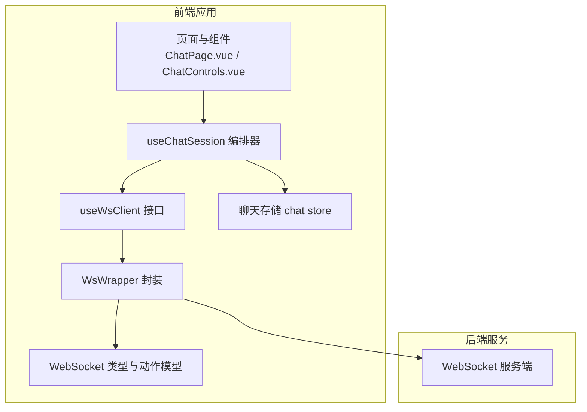
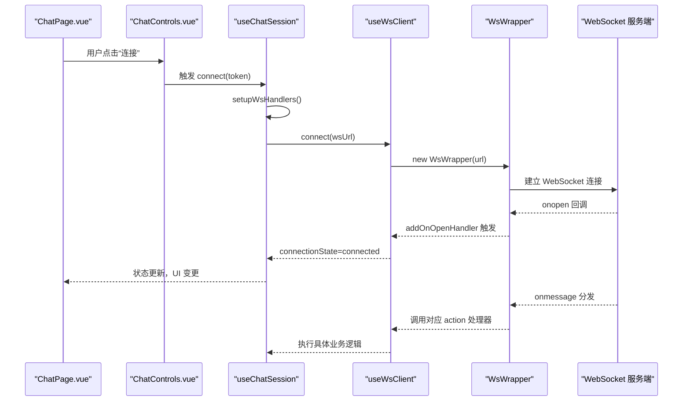
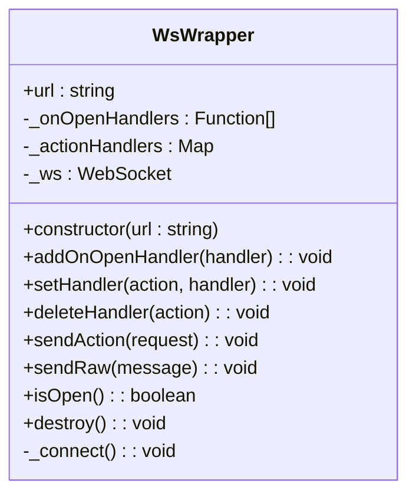
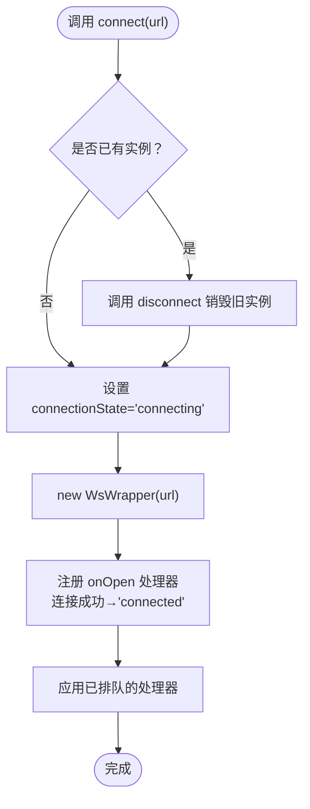
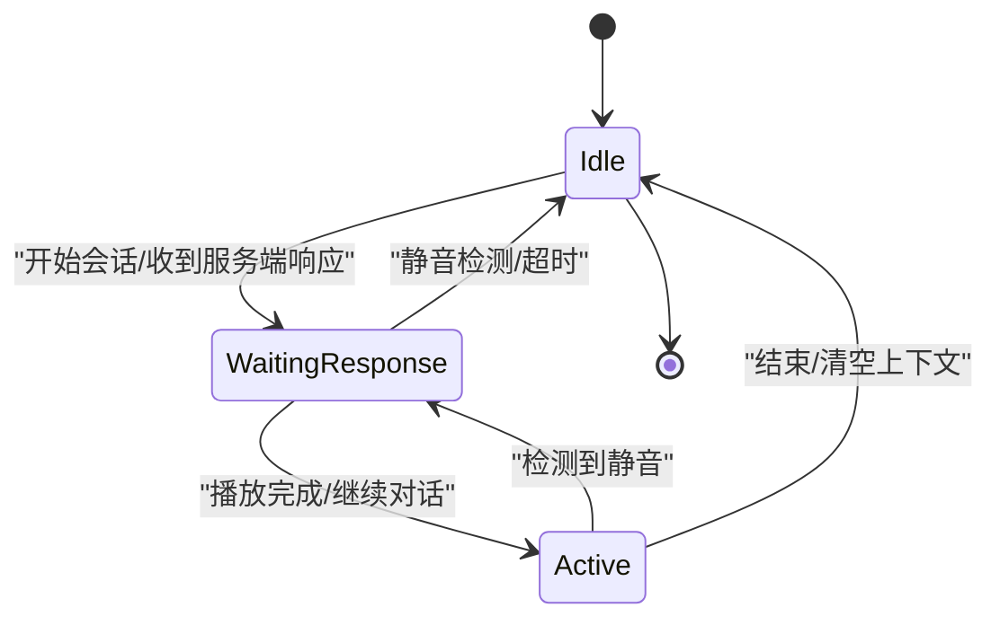
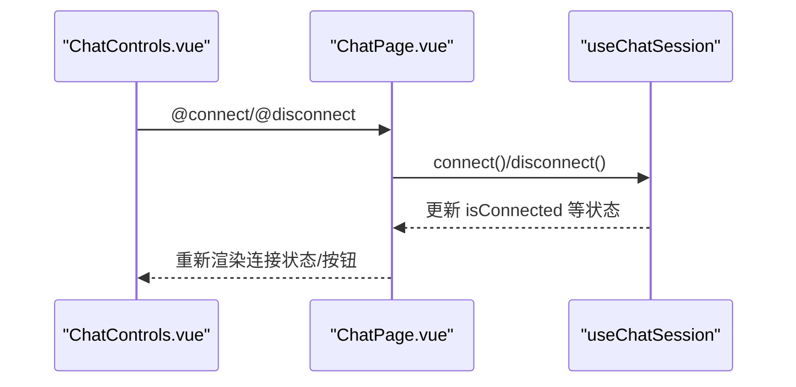
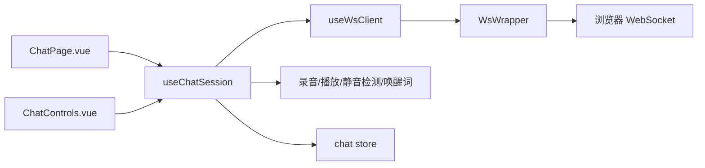

# 连接管理与生命周期

<cite>
**本文引用的文件**
- [useWsClient.ts](file://src/composables/useWsClient.ts)
- [WsWrapper 类](file://src/types/websocket/index.ts)
- [WebSocket 类型与消息模型](file://src/types/websocket/types.ts)
- [useChatSession 聊天会话编排器](file://src/composables/useChatSession.ts)
- [聊天页面 ChatPage.vue](file://src/pages/stack/ChatPage.vue)
- [聊天控制组件 ChatControls.vue](file://src/components/chat/ChatControls.vue)
- [环境变量类型声明 env.d.ts](file://src/env.d.ts)
- [聊天存储 chat store](file://src/stores/chat/index.ts)
- [.github 文档 docs.txt（协议与请求流程）](file://.github/docs.txt)
</cite>

## 目录
1. [简介](#简介)
2. [项目结构](#项目结构)
3. [核心组件](#核心组件)
4. [架构总览](#架构总览)
5. [详细组件分析](#详细组件分析)
6. [依赖关系分析](#依赖关系分析)
7. [性能考量](#性能考量)
8. [故障排查指南](#故障排查指南)
9. [结论](#结论)
10. [附录](#附录)

## 简介
本文件面向 Le Bot 前端的 WebSocket 连接管理系统，系统性梳理连接建立、维护与销毁的全生命周期；详解连接状态(disconnected/connecting/connected)与状态转换；阐述自动重连策略、消息路由与处理；说明连接参数配置、URL 管理与服务端地址切换；给出连接生命周期钩子(onOpen/onClose/onError)的使用方式；解释连接池与并发限制、资源清理策略；并提供常见问题诊断与解决方案。

## 项目结构
围绕 WebSocket 的核心代码集中在以下模块：
- 连接封装与生命周期：WsWrapper 类
- Vue 组合式接口：useWsClient
- 聊天会话编排：useChatSession
- 页面与组件：ChatPage.vue、ChatControls.vue
- 消息类型与动作模型：websocket/types.ts
- 环境变量：env.d.ts
- 聊天上下文存储：chat store

**图表来源**
- [useChatSession 聊天会话编排器:74-571](file://src/composables/useChatSession.ts#L74-L571)
- [useWsClient.ts:29-102](file://src/composables/useWsClient.ts#L29-L102)
- [WsWrapper 类:5-91](file://src/types/websocket/index.ts#L5-L91)
- [WebSocket 类型与消息模型:1-226](file://src/types/websocket/types.ts#L1-L226)
- [聊天页面 ChatPage.vue:1-179](file://src/pages/stack/ChatPage.vue#L1-L179)
- [聊天控制组件 ChatControls.vue:1-204](file://src/components/chat/ChatControls.vue#L1-L204)

**章节来源**
- [useChatSession 聊天会话编排器:74-571](file://src/composables/useChatSession.ts#L74-L571)
- [useWsClient.ts:29-102](file://src/composables/useWsClient.ts#L29-L102)
- [WsWrapper 类:5-91](file://src/types/websocket/index.ts#L5-L91)
- [WebSocket 类型与消息模型:1-226](file://src/types/websocket/types.ts#L1-L226)
- [聊天页面 ChatPage.vue:1-179](file://src/pages/stack/ChatPage.vue#L1-L179)
- [聊天控制组件 ChatControls.vue:1-204](file://src/components/chat/ChatControls.vue#L1-L204)

## 核心组件
- WsWrapper：对原生 WebSocket 的轻量封装，负责连接、消息分发、自动重连、打开回调等。
- useWsClient：Vue 组合式接口，暴露连接状态、连接/断开、注册/移除动作处理器、发送请求、查询连接状态等能力。
- useChatSession：聊天会话编排器，统一管理连接、录音、播放、静音检测、唤醒词、状态机与超时控制。
- 类型与动作模型：定义了所有支持的动作、请求/响应结构与处理器类型，确保消息路由的强类型安全。
- 页面与组件：ChatPage.vue 作为入口，ChatControls.vue 提供连接/断开按钮与状态提示。

**章节来源**
- [WsWrapper 类:5-91](file://src/types/websocket/index.ts#L5-L91)
- [useWsClient.ts:29-102](file://src/composables/useWsClient.ts#L29-L102)
- [useChatSession 聊天会话编排器:74-571](file://src/composables/useChatSession.ts#L74-L571)
- [WebSocket 类型与消息模型:1-226](file://src/types/websocket/types.ts#L1-L226)
- [聊天页面 ChatPage.vue:1-179](file://src/pages/stack/ChatPage.vue#L1-L179)
- [聊天控制组件 ChatControls.vue:1-204](file://src/components/chat/ChatControls.vue#L1-L204)

## 架构总览
下图展示从页面到会话编排、再到连接封装与服务端的整体交互：

**图表来源**
- [聊天页面 ChatPage.vue:40-51](file://src/pages/stack/ChatPage.vue#L40-L51)
- [聊天控制组件 ChatControls.vue:23-28](file://src/components/chat/ChatControls.vue#L23-L28)
- [useChatSession 聊天会话编排器:379-425](file://src/composables/useChatSession.ts#L379-L425)
- [useWsClient.ts:37-55](file://src/composables/useWsClient.ts#L37-L55)
- [WsWrapper 类:61-90](file://src/types/websocket/index.ts#L61-L90)

## 详细组件分析

### WsWrapper：连接封装与自动重连
- 连接建立：构造函数内即创建 WebSocket 实例并立即发起连接。
- 自动重连：监听 onclose，在关闭后延迟一段时间重新连接。
- 消息分发：解析 onmessage 后按 action 查找处理器并执行。
- 打开回调：提供 addOnOpenHandler，用于在连接成功（含重连）时触发。
- 资源清理：destroy 关闭连接并清空处理器集合。

**图表来源**
- [WsWrapper 类:5-91](file://src/types/websocket/index.ts#L5-L91)

**章节来源**
- [WsWrapper 类:5-91](file://src/types/websocket/index.ts#L5-L91)

### useWsClient：Vue 组合式接口
- 状态管理：维护连接状态（disconnected/connecting/connected），并在连接成功时更新。
- 生命周期：connect/disconnect 控制 WsWrapper 的创建与销毁。
- 处理器管理：支持在未连接时排队处理器，连接后批量应用；支持移除处理器。
- 发送消息：封装 sendAction，内部序列化请求对象并发送。
- 连接状态查询：isConnected 基于底层 isOpen 判断。

**图表来源**
- [useWsClient.ts:37-55](file://src/composables/useWsClient.ts#L37-L55)

**章节来源**
- [useWsClient.ts:29-102](file://src/composables/useWsClient.ts#L29-L102)

### useChatSession：会话编排与生命周期
- 连接参数与 URL 管理：通过环境变量拼接 wsUrl 并传入 useWsClient.connect。
- 动作处理器：在 connect 前注册各类 action 处理器（如 establishConnection、updateConfig、outputAudioStream 等）。
- 状态机：Idle → WaitingResponse → Active → Idle，配合静音检测、播放完成回调、超时检查。
- 超时与中断：等待响应超时（默认约 30 秒）自动结束会话；手动/语音中断发送取消输出请求。
- 资源清理：断开连接时释放媒体、停止计时器、撤销音频 URL、重置消息列表。

**图表来源**
- [useChatSession 聊天会话编排器:244-303](file://src/composables/useChatSession.ts#L244-L303)

**章节来源**
- [useChatSession 聊天会话编排器:74-571](file://src/composables/useChatSession.ts#L74-L571)

### 页面与组件：连接控制与状态展示
- ChatPage.vue：登录态校验、连接/断开按钮、会话销毁、显示连接状态与会话 ID。
- ChatControls.vue：根据连接状态与当前会话状态渲染主按钮与辅助控件，支持连接/断开事件。

**图表来源**
- [聊天页面 ChatPage.vue:38-51](file://src/pages/stack/ChatPage.vue#L38-L51)
- [聊天控制组件 ChatControls.vue:23-28](file://src/components/chat/ChatControls.vue#L23-L28)

**章节来源**
- [聊天页面 ChatPage.vue:1-179](file://src/pages/stack/ChatPage.vue#L1-L179)
- [聊天控制组件 ChatControls.vue:1-204](file://src/components/chat/ChatControls.vue#L1-L204)

### 连接参数配置、URL 管理与服务端地址切换
- 环境变量：LE_BOT_BACKEND_WS_BASE_URL 用于拼接 WebSocket URL。
- URL 组装：在 useChatSession.connect 中将 token 附加到查询参数。
- 地址切换：通过修改环境变量或在运行时动态拼接不同 base URL，即可实现服务端地址切换。

**章节来源**
- [环境变量类型声明 env.d.ts:3-9](file://src/env.d.ts#L3-L9)
- [useChatSession 聊天会话编排器:379-385](file://src/composables/useChatSession.ts#L379-L385)

### 连接生命周期钩子与事件处理
- onOpen：通过 WsWrapper.addOnOpenHandler 注册，连接成功（含重连）时触发。
- onClose：WsWrapper 内部监听 onclose 并自动重连，同时通过通知组件提示“正在重连”。
- onError：当前实现未显式注册 onerror 处理器，建议在上层业务中结合 useWsClient 的连接状态与通知进行统一错误处理。
- onMessage：按 action 分发至已注册处理器，未知 action 会弹出警告通知。

**章节来源**
- [WsWrapper 类:61-90](file://src/types/websocket/index.ts#L61-L90)
- [useWsClient.ts:46-48](file://src/composables/useWsClient.ts#L46-L48)

### 连接池管理、并发连接限制与资源清理
- 连接池与并发：当前实现为单连接模型，未见多连接池或并发限制逻辑。
- 资源清理：断开连接时销毁 WebSocket、清空处理器、释放媒体、撤销音频 URL、停止定时器与静音检测。
- 存储：聊天会话 ID 由后端返回并通过 Pinia store 持久化。

**章节来源**
- [useChatSession 聊天会话编排器:427-447](file://src/composables/useChatSession.ts#L427-L447)
- [聊天存储 chat store:1-17](file://src/stores/chat/index.ts#L1-L17)

### 心跳检测与连接超时处理
- 心跳：当前实现未内置心跳检测（ping/pong）。
- 超时：通过 WaitingResponse 状态下的定时检查（约 30 秒）实现超时控制，超时后自动结束会话。
- 建议：若需更强健的连接保活，可在 WsWrapper 内增加 ping/pong 机制与 onclose/onerror 的统一处理。

**章节来源**
- [useChatSession 聊天会话编排器:346-365](file://src/composables/useChatSession.ts#L346-L365)

### 协议与请求流程（参考）
- 客户端请求与服务端响应采用自定义二进制头部 + JSON/Gzip 压缩的消息格式。
- 建立连接后先发送 full client request，随后可发送音频/文本流请求。
- 服务端响应可能包含序列号与压缩标志，客户端需按协议解析。

**章节来源**
- [.github 文档 docs.txt（协议与请求流程）:210-893](file://.github/docs.txt#L210-L893)

## 依赖关系分析
- useChatSession 依赖 useWsClient、录音/播放、静音检测、唤醒词与聊天 store。
- useWsClient 依赖 WsWrapper 与类型系统。
- WsWrapper 依赖原生 WebSocket 与 Quasar Notify。
- 页面组件依赖 useChatSession 与本地化工具。

**图表来源**
- [useChatSession 聊天会话编排器:74-81](file://src/composables/useChatSession.ts#L74-L81)
- [useWsClient.ts:29-32](file://src/composables/useWsClient.ts#L29-L32)
- [WsWrapper 类:5-22](file://src/types/websocket/index.ts#L5-L22)
- [聊天页面 ChatPage.vue:1-36](file://src/pages/stack/ChatPage.vue#L1-L36)
- [聊天控制组件 ChatControls.vue:1-21](file://src/components/chat/ChatControls.vue#L1-L21)

**章节来源**
- [useChatSession 聊天会话编排器:74-81](file://src/composables/useChatSession.ts#L74-L81)
- [useWsClient.ts:29-32](file://src/composables/useWsClient.ts#L29-L32)
- [WsWrapper 类:5-22](file://src/types/websocket/index.ts#L5-L22)

## 性能考量
- 自动重连间隔固定为 3 秒，建议在高抖动网络中引入指数退避与上限控制，避免风暴重连。
- 消息处理为同步/异步混合，注意避免阻塞 onmessage 主线程。
- 静音检测与播放完成回调频率较高，建议在状态切换时复用播放器实例，减少频繁创建销毁。
- 大量音频/文本流传输时，建议启用服务端侧压缩（参考协议文档）并评估带宽占用。

## 故障排查指南
- 无法连接
  - 检查 LE_BOT_BACKEND_WS_BASE_URL 是否正确，token 是否有效。
  - 查看浏览器网络面板与控制台日志，确认握手失败原因。
- 连接后立即断开
  - WsWrapper 在 onclose 后 3 秒重连，若仍失败，检查服务端鉴权与证书配置。
- 未收到消息
  - 确认已注册对应 action 处理器；未知 action 会被记录为警告。
  - 检查消息是否被服务端正确下发（参考协议文档）。
- 超时退出
  - WaitingResponse 超时约 30 秒，属于预期行为；若频繁出现，检查网络质量与服务端处理耗时。
- 资源泄漏
  - 断开连接后需确保录音/播放器销毁、定时器清除、URL.revokeObjectURL 调用。

**章节来源**
- [useChatSession 聊天会话编排器:427-447](file://src/composables/useChatSession.ts#L427-L447)
- [WsWrapper 类:61-90](file://src/types/websocket/index.ts#L61-L90)

## 结论
该系统以 WsWrapper 为核心，通过 useWsClient 提供 Vue 友好的组合式接口，useChatSession 统一编排连接、音频、播放与状态机，形成清晰的连接生命周期管理方案。当前实现具备自动重连与基础超时控制，建议后续补充心跳保活、错误统一处理与指数退避重连策略，以进一步提升稳定性与用户体验。

## 附录
- 动作与消息模型：涵盖 establishConnection、updateConfig、outputAudioStream/Complete、outputTextStream/Complete、chatComplete、cancelOutput、inputAudioStream/Complete、clearContext 等。
- 请求/响应类型：强类型定义，便于编译期校验与 IDE 补全。
- 环境变量：LE_BOT_BACKEND_WS_BASE_URL 用于拼接 WebSocket URL。

**章节来源**
- [WebSocket 类型与消息模型:1-226](file://src/types/websocket/types.ts#L1-L226)
- [环境变量类型声明 env.d.ts:3-9](file://src/env.d.ts#L3-L9)