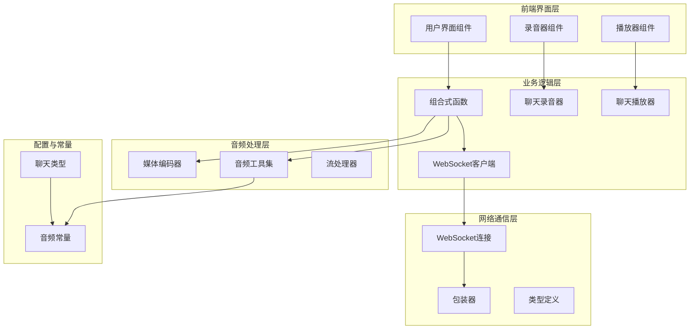
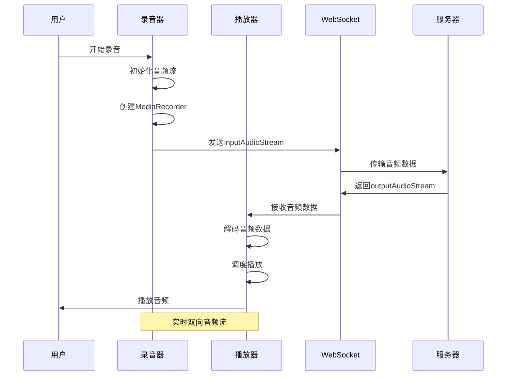
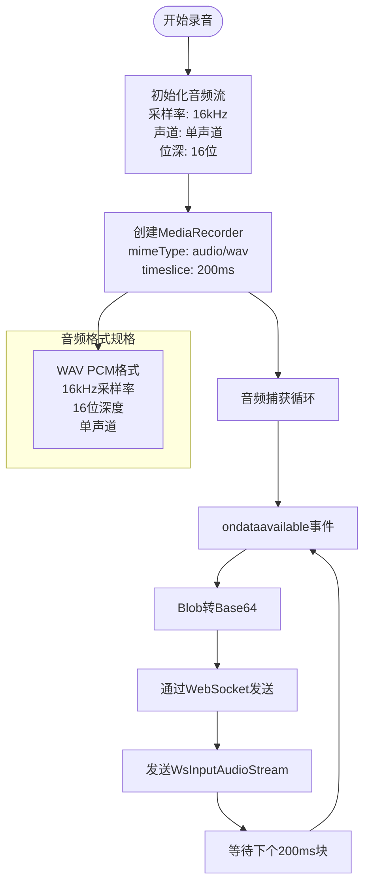
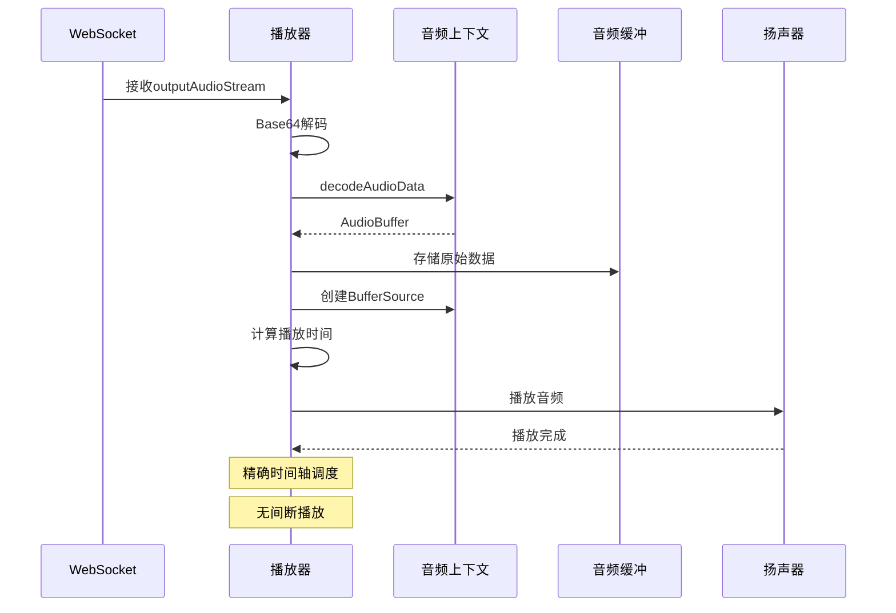
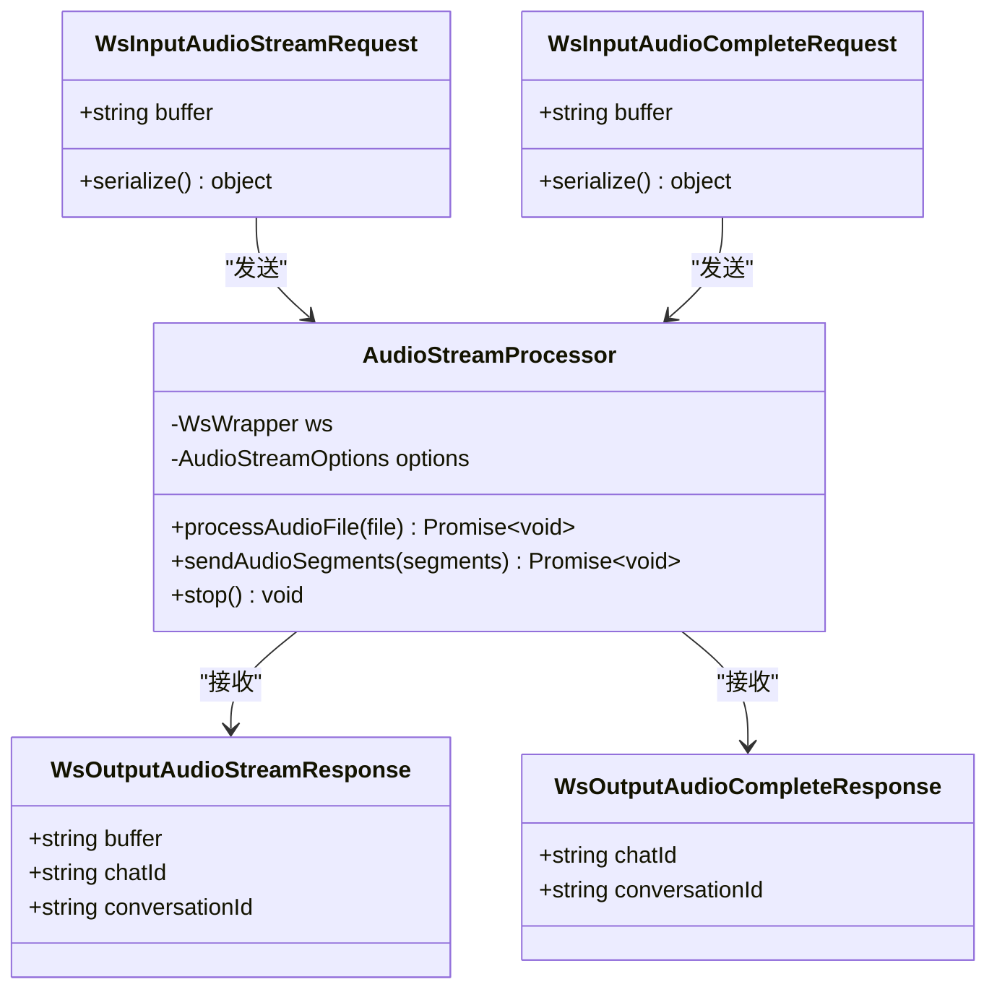
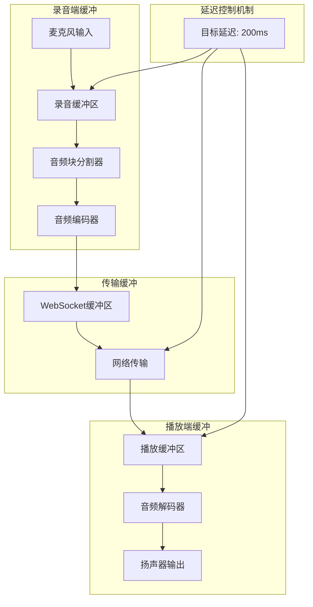
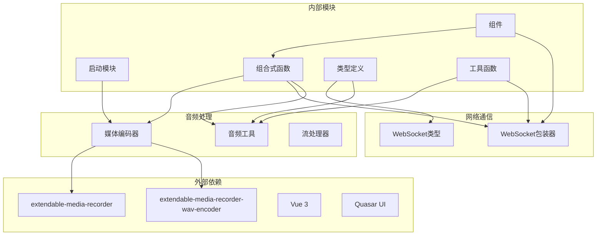
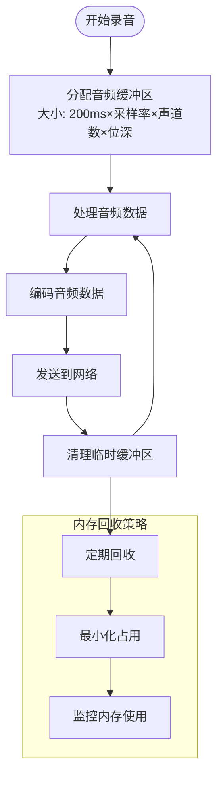

# 音频流传输与实时处理

<cite>
**本文档引用的文件**
- [media-encoder.ts](file://src/boot/media-encoder.ts)
- [useChatRecorder.ts](file://src/composables/useChatRecorder.ts)
- [useChatPlayer.ts](file://src/composables/useChatPlayer.ts)
- [useWsClient.ts](file://src/composables/useWsClient.ts)
- [AudioRecorder.vue](file://src/components/AudioRecorder.vue)
- [AudioStreamProcessor.ts](file://src/types/audio/index.ts)
- [audio-types.ts](file://src/types/audio/types.ts)
- [audio-utils.ts](file://src/types/audio/utils.ts)
- [audio-constants.ts](file://src/types/audio/constants.ts)
- [websocket-types.ts](file://src/types/websocket/types.ts)
- [websocket-index.ts](file://src/types/websocket/index.ts)
- [chat-types.ts](file://src/types/chat/types.ts)
</cite>

## 目录
1. [简介](#简介)
2. [项目结构](#项目结构)
3. [核心组件](#核心组件)
4. [架构概览](#架构概览)
5. [详细组件分析](#详细组件分析)
6. [依赖关系分析](#依赖关系分析)
7. [性能考虑](#性能考虑)
8. [故障排除指南](#故障排除指南)
9. [结论](#结论)

## 简介

Le Bot WebSocket音频流传输系统是一个基于Web技术构建的实时音频通信平台，专为语音助手应用设计。该系统实现了完整的音频采集、编码、传输、解码和播放流水线，支持双向音频流传输，具有低延迟、高稳定性的特点。

系统采用Vue 3组合式API架构，结合Web Audio API和WebSocket技术，提供了从麦克风采集到扬声器播放的完整音频处理链路。音频数据以WAV格式进行编码，通过WebSocket进行实时传输，并在接收端进行解码和播放。

## 项目结构

Le Bot音频系统采用模块化设计，主要分为以下几个核心层次：

**图表来源**
- [media-encoder.ts:1-8](file://src/boot/media-encoder.ts#L1-L8)
- [useChatRecorder.ts:1-148](file://src/composables/useChatRecorder.ts#L1-L148)
- [useChatPlayer.ts:1-161](file://src/composables/useChatPlayer.ts#L1-L161)
- [useWsClient.ts:1-103](file://src/composables/useWsClient.ts#L1-L103)

**章节来源**
- [media-encoder.ts:1-8](file://src/boot/media-encoder.ts#L1-L8)
- [useChatRecorder.ts:1-148](file://src/composables/useChatRecorder.ts#L1-L148)
- [useChatPlayer.ts:1-161](file://src/composables/useChatPlayer.ts#L1-L161)
- [useWsClient.ts:1-103](file://src/composables/useWsClient.ts#L1-L103)

## 核心组件

### 音频录制组件

音频录制组件负责从麦克风采集音频数据，使用extendable-media-recorder库实现高质量的音频录制功能。系统支持以下配置参数：

- **采样率**: 16,000 Hz（匹配语音识别API要求）
- **声道数**: 单声道（mono）
- **位深度**: 16位
- **块大小**: 200ms间隔的音频块
- **音频格式**: WAV PCM

录制组件的核心功能包括：
- 实时音频流获取和初始化
- 基于时间片的音频块分割
- Base64编码的音频数据传输
- 静音检测分析（通过AudioAnalyserNode）

### 音频播放组件

音频播放组件实现了低延迟的音频流播放功能，支持以下特性：

- **无间断播放**: 通过精确的时间轴调度实现无缝音频播放
- **实时缓冲**: 内置音频缓冲区管理
- **播放控制**: 支持停止、清空缓冲区、播放完成回调
- **资源管理**: 自动清理音频上下文和源节点

播放组件的关键算法包括：
- Web Audio API解码和缓冲
- 播放时间线同步
- 活动源节点管理
- 播放完成状态跟踪

### WebSocket通信组件

WebSocket通信组件提供了可靠的音频数据传输通道：

- **自动重连**: 断线自动重连机制
- **类型安全**: TypeScript泛型确保消息类型安全
- **事件驱动**: 基于动作的消息处理模式
- **状态管理**: 连接状态的响应式管理

系统支持的音频相关动作包括：
- `inputAudioStream`: 实时音频流传输
- `inputAudioComplete`: 音频流结束信号
- `outputAudioStream`: 服务器音频响应流
- `outputAudioComplete`: 服务器音频响应结束

**章节来源**
- [useChatRecorder.ts:36-136](file://src/composables/useChatRecorder.ts#L36-L136)
- [useChatPlayer.ts:35-160](file://src/composables/useChatPlayer.ts#L35-L160)
- [useWsClient.ts:29-102](file://src/composables/useWsClient.ts#L29-L102)

## 架构概览

Le Bot音频系统采用分层架构设计，实现了清晰的关注点分离：

**图表来源**
- [useChatRecorder.ts:72-91](file://src/composables/useChatRecorder.ts#L72-L91)
- [useChatPlayer.ts:53-96](file://src/composables/useChatPlayer.ts#L53-L96)
- [websocket-types.ts:105-131](file://src/types/websocket/types.ts#L105-L131)

系统架构的关键特点：

1. **实时性**: 200ms音频块大小确保低延迟传输
2. **可靠性**: WebSocket提供可靠的消息传递
3. **可扩展性**: 模块化设计支持功能扩展
4. **稳定性**: 自动重连和错误处理机制

## 详细组件分析

### 音频编码与传输流程

音频编码流程采用WAV格式，确保与语音识别API的兼容性：

**图表来源**
- [useChatRecorder.ts:47-91](file://src/composables/useChatRecorder.ts#L47-L91)
- [audio-utils.ts:221-262](file://src/types/audio/utils.ts#L221-L262)

音频编码的关键参数配置：

| 参数 | 值 | 说明 |
|------|-----|------|
| 采样率 | 16,000 Hz | 匹配语音识别API要求 |
| 声道数 | 1 | 单声道，减少带宽占用 |
| 位深度 | 16 位 | 提供良好音质同时控制文件大小 |
| 块大小 | 200 ms | 平衡延迟和CPU负载 |
| 编码格式 | WAV PCM | 无损压缩，适合语音识别 |

### 音频解码与播放流程

音频解码和播放流程确保了流畅的用户体验：

**图表来源**
- [useChatPlayer.ts:53-96](file://src/composables/useChatPlayer.ts#L53-L96)
- [websocket-types.ts:145-152](file://src/types/websocket/types.ts#L145-L152)

播放器的核心算法包括：

1. **时间轴同步**: `nextStartTime`变量确保音频块的连续播放
2. **活动源管理**: 维护活跃的AudioBufferSourceNode列表
3. **播放完成检测**: 通过onended事件跟踪播放状态
4. **内存管理**: 及时清理已完成播放的音频数据

### WebSocket音频流协议

系统定义了专门的音频流传输协议：

**图表来源**
- [websocket-types.ts:105-152](file://src/types/websocket/types.ts#L105-L152)
- [AudioStreamProcessor.ts:14-149](file://src/types/audio/index.ts#L14-L149)

音频流协议的关键特性：

1. **分块传输**: 音频数据按200ms块进行分割
2. **最后块标记**: 使用`inputAudioComplete`标识音频流结束
3. **Base64编码**: 确保二进制数据的安全传输
4. **状态同步**: 通过聊天ID和会话ID维护消息关联

### 音频缓冲与延迟控制

系统实现了多层次的音频缓冲机制：

**图表来源**
- [useChatRecorder.ts:72-91](file://src/composables/useChatRecorder.ts#L72-L91)
- [useChatPlayer.ts:53-96](file://src/composables/useChatPlayer.ts#L53-L96)

缓冲机制的关键参数：

| 组件 | 缓冲大小 | 目标延迟 | 说明 |
|------|----------|----------|------|
| 录音缓冲 | 200ms | 200ms | 与音频块大小一致 |
| 播放缓冲 | 动态调整 | 200ms | 根据网络状况自适应 |
| 网络缓冲 | WebSocket | 实时 | 最小化传输延迟 |
| 解码缓冲 | 无 | 实时 | 即时解码播放 |

### 音频质量优化策略

系统采用了多种音频质量优化技术：

1. **采样率优化**: 16kHz采样率平衡音质和带宽
2. **单声道压缩**: 减少50%的数据量
3. **实时编码**: WAV PCM无损压缩
4. **动态缓冲**: 根据网络状况调整缓冲策略

音频质量评估指标：

| 指标 | 目标值 | 说明 |
|------|--------|------|
| 延迟 | < 200ms | 用户感知阈值 |
| 吞吐量 | > 16kb/s | 16kHz单声道WAV |
| 丢包容忍 | < 5% | 语音识别容错范围 |
| CPU使用率 | < 50% | 移动设备友好 |

**章节来源**
- [audio-utils.ts:69-87](file://src/types/audio/utils.ts#L69-L87)
- [chat-types.ts:86-95](file://src/types/chat/types.ts#L86-L95)

## 依赖关系分析

Le Bot音频系统的依赖关系体现了清晰的模块化设计：

**图表来源**
- [media-encoder.ts:1-8](file://src/boot/media-encoder.ts#L1-L8)
- [useChatRecorder.ts:1-5](file://src/composables/useChatRecorder.ts#L1-L5)
- [useChatPlayer.ts:1-2](file://src/composables/useChatPlayer.ts#L1-L2)

系统的主要依赖关系：

1. **extendable-media-recorder**: 提供Web Audio API增强功能
2. **Vue 3组合式API**: 实现响应式状态管理和生命周期管理
3. **Quasar UI框架**: 提供UI组件和通知系统
4. **WebSocket**: 实现实时双向通信

**章节来源**
- [media-encoder.ts:1-8](file://src/boot/media-encoder.ts#L1-L8)
- [useChatRecorder.ts:1-2](file://src/composables/useChatRecorder.ts#L1-L2)
- [useChatPlayer.ts:1-2](file://src/composables/useChatPlayer.ts#L1-L2)

## 性能考虑

### 延迟优化策略

系统采用了多项延迟优化技术：

1. **音频块大小优化**: 200ms块大小在延迟和CPU负载之间取得最佳平衡
2. **预加载机制**: 播放器提前解码下一音频块
3. **时间轴同步**: 精确的播放时间计算避免累积误差
4. **异步处理**: 音频编码和网络传输并行执行

### 内存管理优化

**图表来源**
- [useChatRecorder.ts:139-147](file://src/composables/useChatRecorder.ts#L139-L147)
- [useChatPlayer.ts:140-148](file://src/composables/useChatPlayer.ts#L140-L148)

内存管理的关键策略：

1. **及时释放**: 音频块处理完成后立即释放内存
2. **缓冲池**: 复用音频缓冲区减少分配开销
3. **垃圾回收**: 定期清理未使用的音频对象
4. **监控告警**: 检测内存使用异常及时处理

### 网络优化策略

1. **WebSocket复用**: 单连接传输多种类型的消息
2. **Base64压缩**: 相比原始二进制数据减少约33%体积
3. **批量发送**: 连续音频块合并发送减少网络开销
4. **错误重传**: 关键音频块具备重传机制

## 故障排除指南

### 常见问题及解决方案

#### 音频录制失败

**症状**: 录音按钮无法点击或出现错误提示

**可能原因**:
1. 权限被拒绝
2. 设备不可用
3. 浏览器不支持
4. 音频设备冲突

**解决步骤**:
1. 检查浏览器权限设置
2. 确认麦克风设备正常工作
3. 尝试更换浏览器
4. 关闭其他音频应用

#### 音频播放异常

**症状**: 音频播放卡顿或无声

**可能原因**:
1. 音频上下文未正确初始化
2. 播放时间计算错误
3. 活动源节点泄漏
4. 浏览器音频限制

**解决步骤**:
1. 重新初始化音频上下文
2. 检查播放时间同步
3. 清理活动源节点
4. 允许自动播放音频

#### WebSocket连接问题

**症状**: 音频传输中断或延迟过高

**可能原因**:
1. 网络连接不稳定
2. 服务器超时
3. 消息队列阻塞
4. 客户端重连失败

**解决步骤**:
1. 检查网络连接质量
2. 增加重连间隔
3. 清理消息队列
4. 重启WebSocket连接

### 调试工具和方法

1. **浏览器开发者工具**: 监控音频流和网络请求
2. **日志记录**: 详细的系统状态日志
3. **性能分析**: CPU和内存使用情况监控
4. **网络分析**: WebSocket消息传输统计

**章节来源**
- [useChatRecorder.ts:72-91](file://src/composables/useChatRecorder.ts#L72-L91)
- [useChatPlayer.ts:107-123](file://src/composables/useChatPlayer.ts#L107-L123)
- [websocket-index.ts:61-90](file://src/types/websocket/index.ts#L61-L90)

## 结论

Le Bot WebSocket音频流传输系统展现了现代Web音频技术的先进实践。通过精心设计的架构和优化策略，系统实现了低延迟、高可靠性的音频通信能力。

### 主要优势

1. **实时性强**: 200ms音频块大小确保了良好的用户体验
2. **稳定性高**: 完善的错误处理和自动重连机制
3. **扩展性好**: 模块化设计支持功能扩展和定制
4. **兼容性强**: 标准化的WAV格式确保了广泛的设备兼容性

### 技术亮点

1. **精确的时间轴管理**: 确保音频播放的连续性和准确性
2. **智能的缓冲策略**: 根据网络状况动态调整缓冲参数
3. **高效的内存管理**: 最小化内存占用和GC压力
4. **完善的错误处理**: 全面的异常捕获和恢复机制

### 未来改进方向

1. **压缩算法优化**: 考虑引入更高效的音频压缩算法
2. **网络自适应**: 更智能的带宽自适应算法
3. **质量反馈**: 基于用户感知的质量调整机制
4. **多设备支持**: 扩展到更多音频设备和场景

该系统为语音助手应用提供了坚实的技术基础，其设计理念和实现方案可以作为Web音频应用开发的优秀参考。