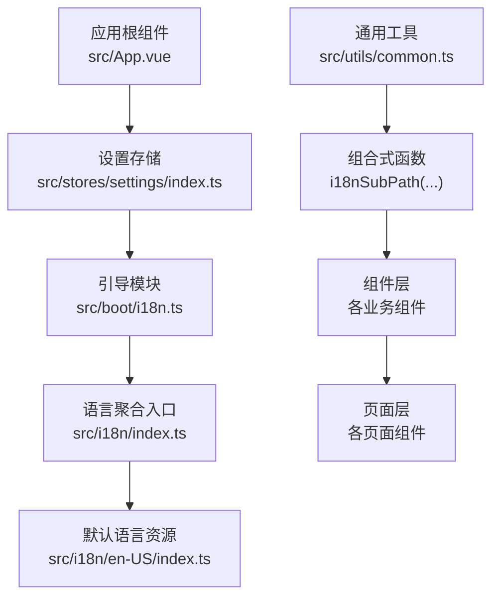
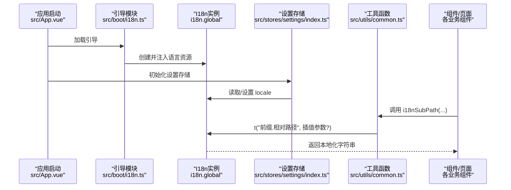
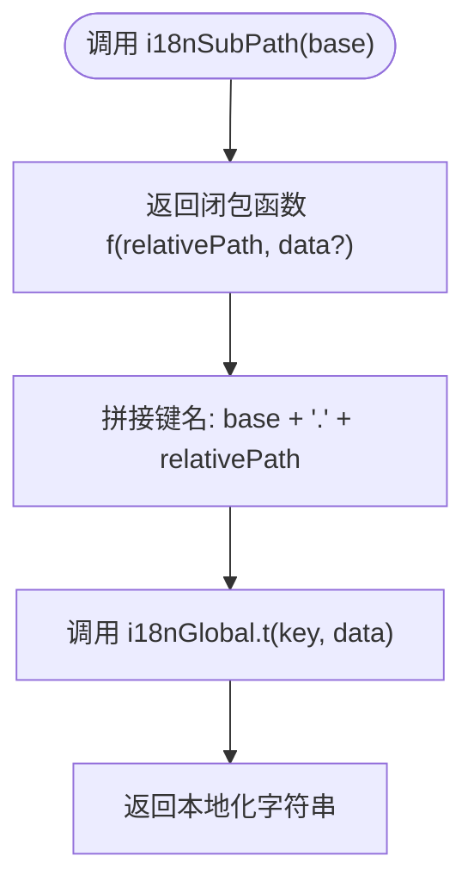
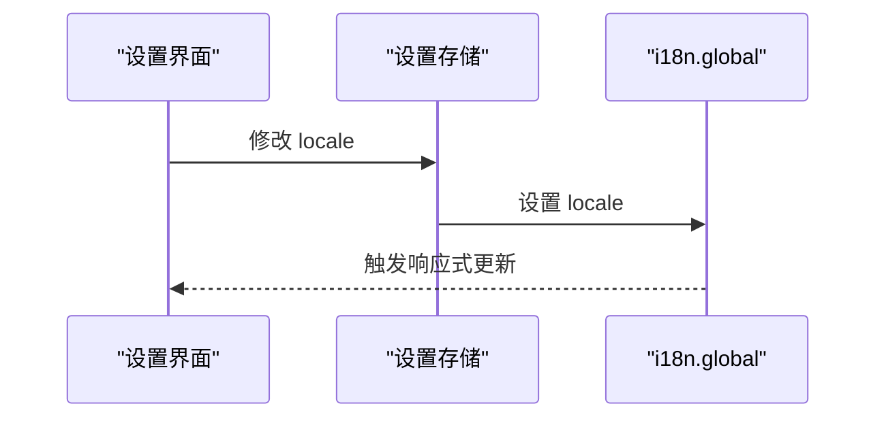
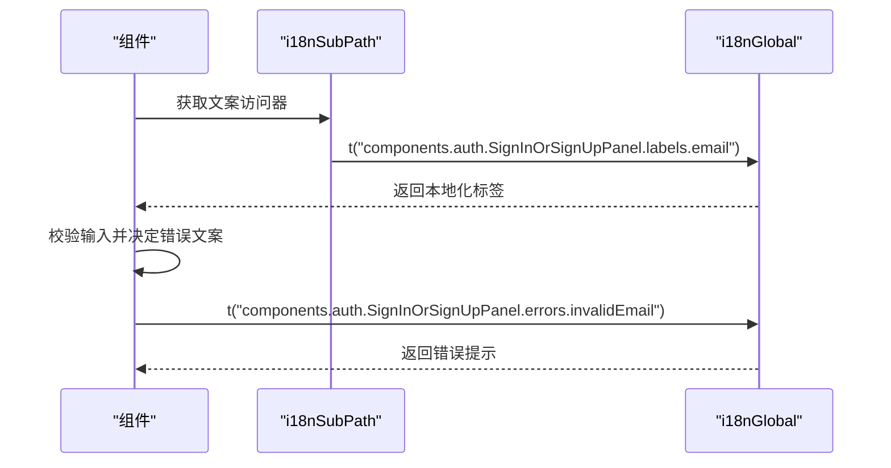
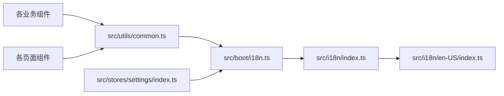

# 国际化与本地化

<cite>
**本文引用的文件**
- [src/boot/i18n.ts](file://src/boot/i18n.ts)
- [src/i18n/index.ts](file://src/i18n/index.ts)
- [src/i18n/en-US/index.ts](file://src/i18n/en-US/index.ts)
- [src/utils/common.ts](file://src/utils/common.ts)
- [src/stores/settings/index.ts](file://src/stores/settings/index.ts)
- [src/stores/settings/types.ts](file://src/stores/settings/types.ts)
- [src/components/navigations.ts](file://src/components/navigations.ts)
- [src/components/auth/SignInOrSignUpPanel.vue](file://src/components/auth/SignInOrSignUpPanel.vue)
- [src/pages/main/HomePage.vue](file://src/pages/main/HomePage.vue)
- [src/App.vue](file://src/App.vue)
- [package.json](file://package.json)
</cite>

## 目录
1. [简介](#简介)
2. [项目结构](#项目结构)
3. [核心组件](#核心组件)
4. [架构总览](#架构总览)
5. [详细组件分析](#详细组件分析)
6. [依赖关系分析](#依赖关系分析)
7. [性能考量](#性能考量)
8. [故障排查指南](#故障排查指南)
9. [结论](#结论)
10. [附录](#附录)

## 简介
本文件系统性梳理 Le Bot 前端的国际化（i18n）体系，围绕基于 Vue I18n 的多语言支持展开，覆盖以下主题：
- 语言资源文件的组织结构、命名规范与维护策略
- 文本提取流程、翻译管理与本地化测试方法
- 语言切换机制、区域设置处理与 RTL 支持现状
- i18n 最佳实践、性能优化与缓存策略
- 与表单验证、错误消息和动态内容的集成方案
- 翻译工作流、自动化工具与质量保证措施

## 项目结构
Le Bot 前端的国际化采用“按模块分层 + 路径前缀”的资源组织方式，主入口在引导阶段注册全局 i18n 实例，并通过统一的工具函数在组件中按路径访问文案。

图示来源
- [src/boot/i18n.ts:1-34](file://src/boot/i18n.ts#L1-L34)
- [src/i18n/index.ts:1-6](file://src/i18n/index.ts#L1-L6)
- [src/i18n/en-US/index.ts:1-413](file://src/i18n/en-US/index.ts#L1-L413)
- [src/utils/common.ts:31-38](file://src/utils/common.ts#L31-L38)
- [src/stores/settings/index.ts:1-57](file://src/stores/settings/index.ts#L1-L57)
- [src/App.vue:1-85](file://src/App.vue#L1-L85)

章节来源
- [src/boot/i18n.ts:1-34](file://src/boot/i18n.ts#L1-L34)
- [src/i18n/index.ts:1-6](file://src/i18n/index.ts#L1-L6)
- [src/i18n/en-US/index.ts:1-413](file://src/i18n/en-US/index.ts#L1-L413)
- [src/utils/common.ts:31-38](file://src/utils/common.ts#L31-L38)
- [src/stores/settings/index.ts:1-57](file://src/stores/settings/index.ts#L1-L57)
- [src/App.vue:1-85](file://src/App.vue#L1-L85)

## 核心组件
- 引导与全局实例
  - 在引导阶段创建并挂载 Vue I18n 实例，设置默认语言为“en-US”，启用非兼容模式，注入全部语言资源。
  - 暴露全局 i18n 实例以供设置存储等模块直接读写当前语言。
- 语言资源聚合
  - 通过聚合入口集中导出各语言包，当前仓库仅包含“en-US”。
- 通用文本访问工具
  - 提供 i18nSubPath 工具函数，用于生成带前缀的文本访问器，避免重复拼接路径。
- 设置存储
  - 将语言切换绑定到 i18n.global.locale，配合持久化插件实现跨会话记忆。
- 组件与页面中的使用
  - 导航、认证面板、主页等广泛使用 i18nSubPath 访问文案，部分组件在运行时根据条件选择不同键值或回退到默认文案。

章节来源
- [src/boot/i18n.ts:23-33](file://src/boot/i18n.ts#L23-L33)
- [src/i18n/index.ts:3-5](file://src/i18n/index.ts#L3-L5)
- [src/utils/common.ts:31-38](file://src/utils/common.ts#L31-L38)
- [src/stores/settings/index.ts:13-18](file://src/stores/settings/index.ts#L13-L18)
- [src/components/navigations.ts:10](file://src/components/navigations.ts#L10)
- [src/components/auth/SignInOrSignUpPanel.vue:20](file://src/components/auth/SignInOrSignUpPanel.vue#L20)
- [src/pages/main/HomePage.vue:12](file://src/pages/main/HomePage.vue#L12)

## 架构总览
下图展示从应用启动到组件渲染期间的 i18n 数据流与控制流：

图示来源
- [src/App.vue:58-80](file://src/App.vue#L58-L80)
- [src/boot/i18n.ts:31-33](file://src/boot/i18n.ts#L31-L33)
- [src/stores/settings/index.ts:13-18](file://src/stores/settings/index.ts#L13-L18)
- [src/utils/common.ts:31-38](file://src/utils/common.ts#L31-L38)

## 详细组件分析

### 引导与类型安全
- 全局实例初始化：设置默认语言、禁用兼容模式、注入全部语言资源。
- 类型增强：通过模块声明为 i18n 定义消息 Schema，确保资源键的类型安全。
- 导出全局实例：便于设置存储等模块直接读写当前语言。

章节来源
- [src/boot/i18n.ts:23-33](file://src/boot/i18n.ts#L23-L33)
- [src/boot/i18n.ts:12-21](file://src/boot/i18n.ts#L12-L21)

### 语言资源组织与命名规范
- 资源文件组织
  - 聚合入口集中导出各语言包；当前仓库仅包含“en-US”。
  - “en-US”资源按领域划分：components、layouts、pages 等，组件内部再细分模块（如 auth、navigations、settings.voiceprint 等）。
- 命名规范
  - 使用小驼峰或点分路径作为键名，避免空格与特殊字符。
  - 键名语义清晰，例如 labels、errors、notifications 等，便于定位与复用。
- 维护策略
  - 新增语言时，在聚合入口添加映射，避免破坏现有键结构。
  - 同步更新所有组件与页面的 i18nSubPath 调用，保持路径一致性。

章节来源
- [src/i18n/index.ts:3-5](file://src/i18n/index.ts#L3-L5)
- [src/i18n/en-US/index.ts:1-413](file://src/i18n/en-US/index.ts#L1-L413)

### 通用文本访问工具 i18nSubPath
- 功能：生成带固定前缀的文本访问器，简化组件内调用。
- 使用场景：导航、认证面板、页面标题与按钮文案等。
- 参数与返回：支持传入相对路径与可选插值数据，返回本地化字符串。

图示来源
- [src/utils/common.ts:31-38](file://src/utils/common.ts#L31-L38)

章节来源
- [src/utils/common.ts:31-38](file://src/utils/common.ts#L31-L38)

### 语言切换机制与区域设置
- 切换机制：设置存储将 locale 绑定到 i18n.global.locale，写入即生效。
- 区域设置：当前资源未体现区域特定格式（日期/数字），可在后续扩展。
- 持久化：设置存储开启持久化，语言偏好跨会话保留。

图示来源
- [src/stores/settings/index.ts:13-18](file://src/stores/settings/index.ts#L13-L18)

章节来源
- [src/stores/settings/index.ts:13-18](file://src/stores/settings/index.ts#L13-L18)

### 与表单验证、错误消息和动态内容的集成
- 表单验证：在输入组件中使用 i18n 键作为错误提示，结合计算属性与规则函数实现动态校验提示。
- 错误消息：API 失败或异常时优先显示后端返回的消息，否则回退到默认错误文案。
- 动态内容：根据用户状态或流程阶段动态选择不同键值，提升交互体验。

图示来源
- [src/components/auth/SignInOrSignUpPanel.vue:83-88](file://src/components/auth/SignInOrSignUpPanel.vue#L83-L88)
- [src/components/auth/SignInOrSignUpPanel.vue:53-74](file://src/components/auth/SignInOrSignUpPanel.vue#L53-L74)
- [src/utils/common.ts:31-38](file://src/utils/common.ts#L31-L38)

章节来源
- [src/components/auth/SignInOrSignUpPanel.vue:20-75](file://src/components/auth/SignInOrSignUpPanel.vue#L20-L75)
- [src/utils/common.ts:31-38](file://src/utils/common.ts#L31-L38)

### 组件与页面中的 i18n 使用范式
- 导航：通过 i18nSubPath('components.navigations') 生成导航项标签。
- 页面：在页面组件中使用 i18nSubPath('pages.main.HomePage') 等路径访问标题与按钮文案。
- 组件：在具体业务组件中使用 i18nSubPath('components.auth.SignInOrSignUpPanel') 等路径访问标签、错误与通知文案。

章节来源
- [src/components/navigations.ts:10](file://src/components/navigations.ts#L10)
- [src/pages/main/HomePage.vue:12](file://src/pages/main/HomePage.vue#L12)
- [src/components/auth/SignInOrSignUpPanel.vue:20](file://src/components/auth/SignInOrSignUpPanel.vue#L20)

### RTL 语言支持现状与建议
- 现状：当前资源与样式未体现 RTL 方向性处理，未检测到针对从右到左语言的布局或样式调整。
- 建议：新增语言时，结合框架的 RTL 支持与方向性类名，对布局、图标与间距进行适配；在设置存储中增加方向性字段并在根组件应用对应类名。

[本节为概念性建议，不直接分析具体文件]

## 依赖关系分析
- 引导模块依赖语言资源聚合入口，后者集中导出各语言包。
- 通用工具依赖引导模块导出的全局 i18n 实例。
- 设置存储依赖引导模块导出的全局 i18n 实例，实现语言切换。
- 组件与页面通过通用工具访问文案，形成自上而下的依赖链。

图示来源
- [src/boot/i18n.ts:1-34](file://src/boot/i18n.ts#L1-L34)
- [src/i18n/index.ts:1-6](file://src/i18n/index.ts#L1-L6)
- [src/i18n/en-US/index.ts:1-413](file://src/i18n/en-US/index.ts#L1-L413)
- [src/utils/common.ts:31-38](file://src/utils/common.ts#L31-L38)
- [src/stores/settings/index.ts:1-57](file://src/stores/settings/index.ts#L1-L57)

章节来源
- [src/boot/i18n.ts:1-34](file://src/boot/i18n.ts#L1-L34)
- [src/i18n/index.ts:1-6](file://src/i18n/index.ts#L1-L6)
- [src/i18n/en-US/index.ts:1-413](file://src/i18n/en-US/index.ts#L1-L413)
- [src/utils/common.ts:31-38](file://src/utils/common.ts#L31-L38)
- [src/stores/settings/index.ts:1-57](file://src/stores/settings/index.ts#L1-L57)

## 性能考量
- 资源加载
  - 当前采用一次性注入全部语言资源，适合中小规模多语言场景；若未来语言增多，可考虑按需动态导入或分包加载。
- 渲染性能
  - i18nSubPath 生成闭包函数，调用成本低；避免在渲染函数中频繁创建新函数，建议在 setup 中生成并复用。
- 响应式更新
  - 语言切换触发全局响应式更新，组件自动重渲染；建议在高频更新场景下减少不必要的深度监听。
- 缓存策略
  - 可在应用层引入轻量缓存（如内存缓存）以减少重复查询，但需注意语言切换时的失效与同步。

[本节提供一般性指导，不直接分析具体文件]

## 故障排查指南
- 文案缺失或回退
  - 症状：出现键名而非本地化文案。
  - 排查：确认资源键是否存在、路径是否正确、是否遗漏语言包。
- 键名冲突或重复
  - 症状：同一键名在不同模块重复导致覆盖。
  - 排查：检查资源文件的命名空间与路径前缀，避免重复。
- 错误消息未显示
  - 症状：API 失败时未显示预期错误文案。
  - 排查：确认组件在失败分支中调用了 i18nSubPath 并提供了回退文案。
- 语言切换无效
  - 症状：修改语言后界面未变化。
  - 排查：确认设置存储已写入 i18n.global.locale，且未被其他逻辑覆盖。

章节来源
- [src/components/auth/SignInOrSignUpPanel.vue:53-74](file://src/components/auth/SignInOrSignUpPanel.vue#L53-L74)
- [src/stores/settings/index.ts:13-18](file://src/stores/settings/index.ts#L13-L18)

## 结论
Le Bot 前端的国际化体系以 Vue I18n 为核心，通过引导模块集中注册、通用工具函数封装访问、设置存储绑定语言切换，形成了清晰、可扩展的本地化架构。当前资源以“en-US”为主，具备良好的类型安全与组件集成能力。后续可在资源分包、RTL 支持、区域格式化与自动化工具链方面进一步完善，以支撑更广泛的国际化需求。

[本节为总结性内容，不直接分析具体文件]

## 附录

### 翻译工作流与质量保证
- 翻译提取
  - 从资源文件中抽取英文键值作为参考文本，生成翻译清单。
- 翻译管理
  - 为每种语言维护独立资源文件，保持与默认语言一致的键结构。
- 质量保证
  - 使用 ESLint 与 TypeScript 类型检查确保键名与类型一致。
  - 在 CI 中加入文案覆盖率检查与键名重复检测。

[本节为概念性内容，不直接分析具体文件]

### 自动化工具建议
- 开发期
  - 使用框架提供的 i18n 插件进行键名扫描与热更新。
- 构建期
  - 配置打包工具按语言拆分代码，减少首屏体积。
- 测试期
  - 编写单元测试验证 i18nSubPath 的调用与回退逻辑。

章节来源
- [package.json:33](file://package.json#L33)
- [package.json:13-16](file://package.json#L13-L16)