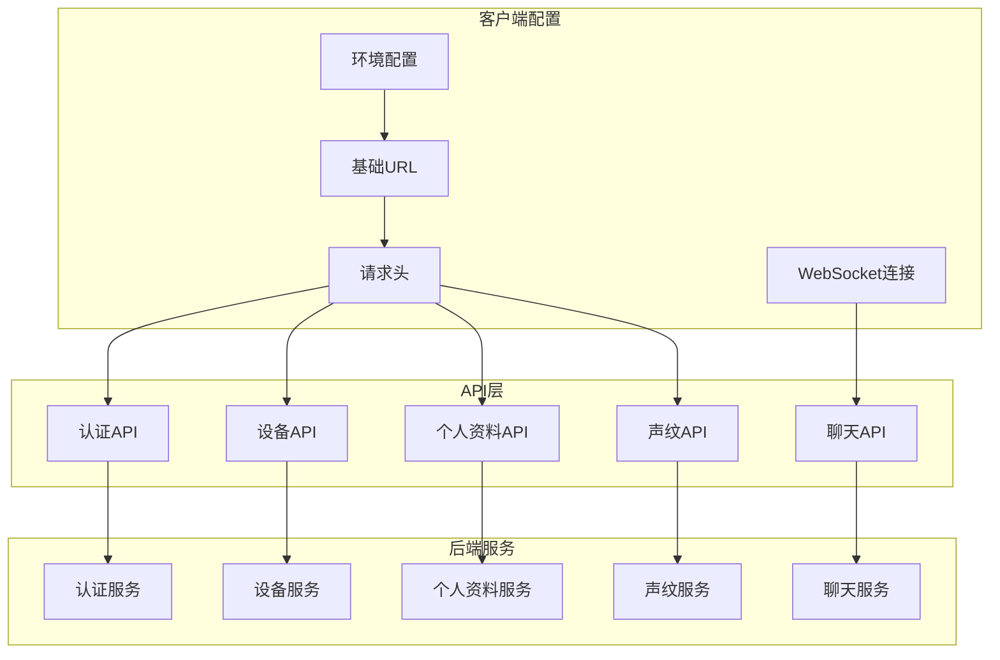
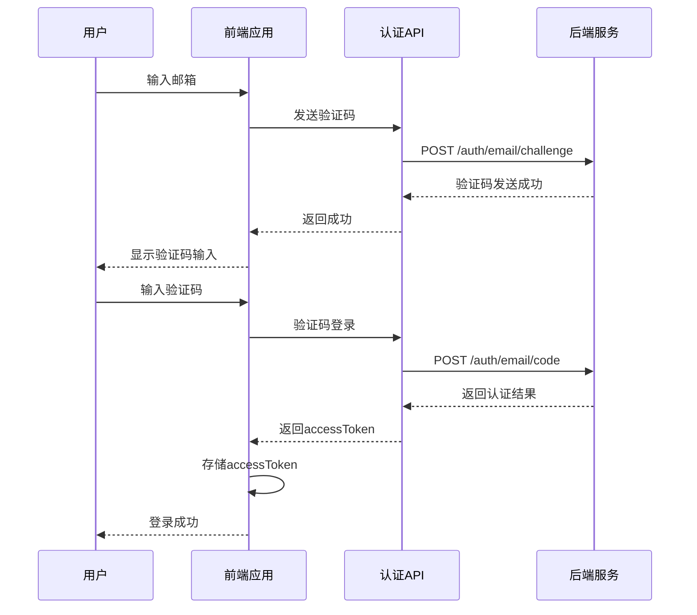
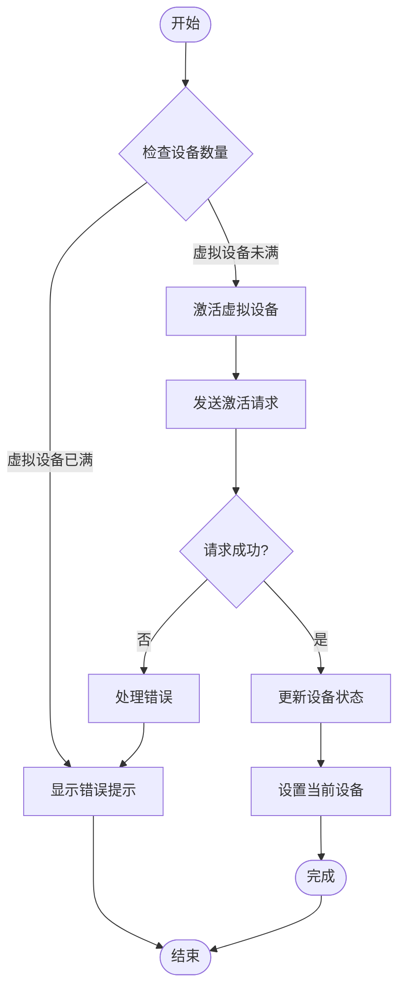
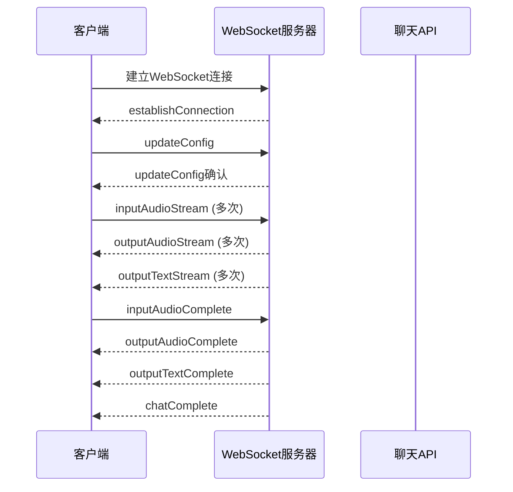
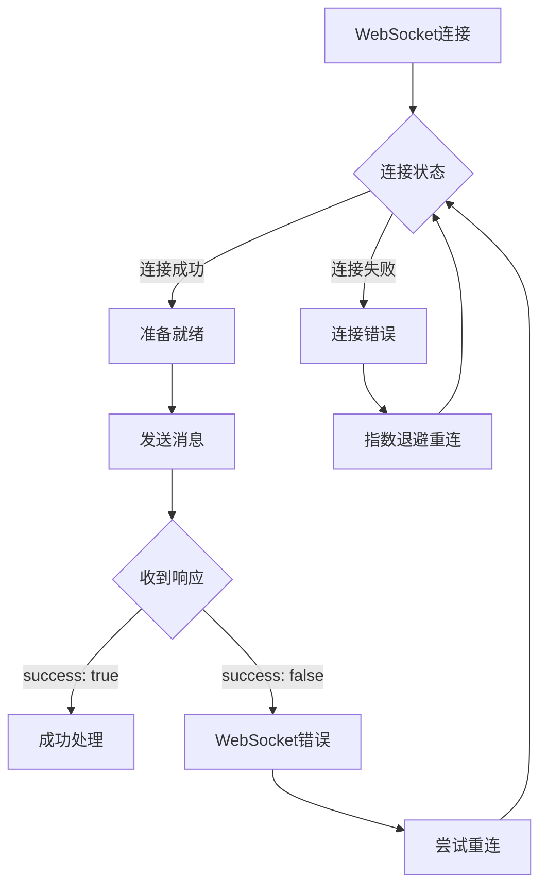
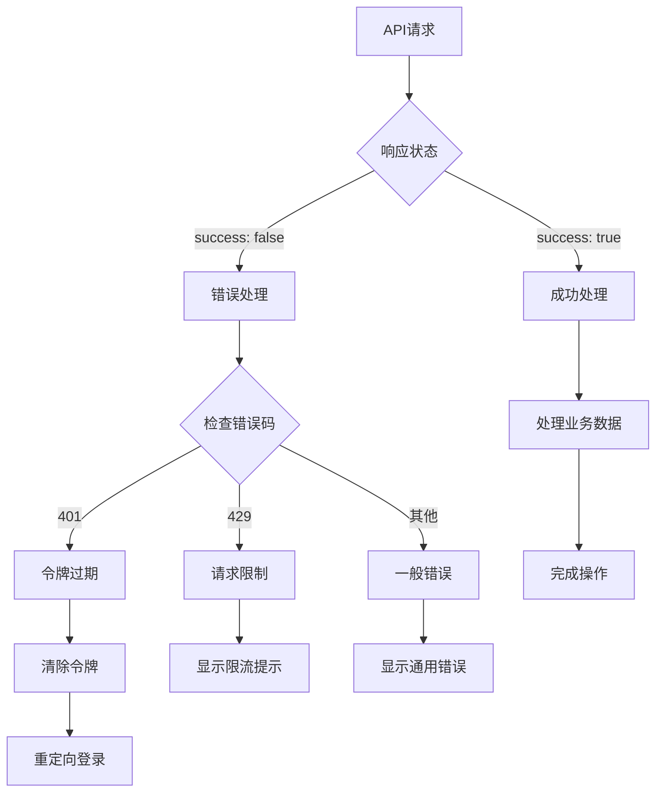

# API接口规范

<cite>
**本文档引用的文件**
- [README.md](file://README.md)
- [api规范文档](file://docs/api-specification.md)
- [axios配置](file://src/boot/axios.ts)
- [认证API工具](file://src/utils/api/auth.ts)
- [设备API工具](file://src/utils/api/device.ts)
- [个人资料API工具](file://src/utils/api/profile.ts)
- [声纹API工具](file://src/utils/api/voiceprint.ts)
- [认证类型定义](file://src/types/api/auth.ts)
- [设备类型定义](file://src/types/api/device.ts)
- [个人资料类型定义](file://src/types/api/profile.ts)
- [声纹类型定义](file://src/types/api/voiceprint.ts)
- [WebSocket类型定义](file://src/types/websocket/types.ts)
- [WebSocket客户端封装](file://src/composables/useWsClient.ts)
- [WebSocket模拟实现](file://src/mock/ws/MockChatWebSocket.ts)
- [认证状态管理](file://src/stores/auth/index.ts)
- [设备状态管理](file://src/stores/device/index.ts)
- [个人资料状态管理](file://src/stores/profile/index.ts)
- [设置状态管理](file://src/stores/settings/index.ts)
- [包配置](file://package.json)
</cite>

## 更新摘要
**所做更改**
- 新增完整的950行API规范文档，涵盖认证、设备管理、个人资料、声纹识别等模块的详细接口定义
- 新增WebSocket通信协议章节，包含完整的聊天协议规范
- 更新API调用流程图，反映新增的WebSocket交互模式
- 扩展错误处理机制，增加WebSocket相关错误处理
- 新增vpr-relationships关系类型定义说明

## 目录
1. [项目概述](#项目概述)
2. [API架构概览](#api架构概览)
3. [通用约定](#通用约定)
4. [认证模块API](#认证模块api)
5. [设备模块API](#设备模块api)
6. [个人资料模块API](#个人资料模块api)
7. [声纹模块API](#声纹模块api)
8. [WebSocket聊天协议](#websocket聊天协议)
9. [API调用流程](#api调用流程)
10. [错误处理机制](#错误处理机制)
11. [性能优化建议](#性能优化建议)
12. [故障排除指南](#故障排除指南)

## 项目概述

Le Bot前端项目是一个基于Vue 3和Quasar框架构建的现代化Web应用，采用前后端分离架构。该项目通过统一的API接口规范与后端服务进行通信，支持多种认证方式、设备管理功能和实时语音交互。

### 核心特性
- **多环境支持**：支持本地开发、测试和生产环境
- **统一认证**：支持邮箱验证码和密码双重认证方式
- **设备管理**：支持虚拟设备激活和物理设备绑定
- **声纹识别**：提供完整的声纹识别和管理功能
- **实时通信**：支持WebSocket实时语音聊天协议
- **状态持久化**：使用Pinia实现状态管理和数据持久化

**章节来源**
- [README.md:1-41](file://README.md#L1-L41)
- [package.json:1-63](file://package.json#L1-L63)

## API架构概览

### 基础配置



**图表来源**
- [axios配置:18-27](file://src/boot/axios.ts#L18-L27)
- [认证API工具:1-28](file://src/utils/api/auth.ts#L1-L28)
- [设备API工具:1-33](file://src/utils/api/device.ts#L1-L33)
- [个人资料API工具:1-49](file://src/utils/api/profile.ts#L1-L49)
- [声纹API工具:1-123](file://src/utils/api/voiceprint.ts#L1-L123)
- [WebSocket类型定义:1-226](file://src/types/websocket/types.ts#L1-L226)

### 通用约定

| 环境 | HTTP基础URL | WebSocket基础URL |
|------|-------------|------------------|
| 本地开发 | `http://localhost:3000/api/v1` | `ws://localhost:3000` |
| 生产环境 | `https://cafuuchino.studio26f.org:10543/api/v1` | `wss://cafuuchino.studio26f.org:10543` |

**章节来源**
- [api规范文档:9-15](file://docs/api-specification.md#L9-L15)

## 通用约定

### 认证要求
除认证模块自身接口外，所有接口需要在HTTP请求头中携带访问令牌：

```
x-access-token: <accessToken>
```

### Content-Type约定
- 请求: `application/json`
- 响应: `application/json`

### 通用响应格式

**成功响应 (HTTP 200):**
```json
{
  "success": true,
  "data": { ... }
}
```

**失败响应 (HTTP 4xx/5xx):**
```json
{
  "success": false,
  "message": "错误描述信息"
}
```

**章节来源**
- [api规范文档:16-48](file://docs/api-specification.md#L16-L48)

## 认证模块API

### 发送邮箱验证码

**接口定义**
- 方法：POST
- 路径：`/auth/email/challenge`
- 请求体：包含邮箱地址的对象

**请求示例**
```json
{
  "email": "user@example.com"
}
```

**响应格式**
- 成功：`{"success": true}`
- 失败：`{"success": false, "message": "发送频率过高，请稍后再试"}`

### 邮箱验证码登录/注册

**接口定义**
- 方法：POST
- 路径：`/auth/email/code`
- 请求体：包含邮箱和验证码的对象

**请求示例**
```json
{
  "email": "user@example.com",
  "code": "123456"
}
```

**响应数据结构**
| 字段 | 类型 | 说明 |
|------|------|------|
| accessToken | string | 访问令牌 |
| isNew | boolean | 是否为新用户 |
| noPassword | boolean | 是否未设置密码 |

### 邮箱密码登录

**接口定义**
- 方法：POST
- 路径：`/auth/email/password`
- 请求体：包含邮箱和密码的对象

**请求示例**
```json
{
  "email": "user@example.com",
  "password": "userPassword123"
}
```

### 重置密码

**接口定义**
- 方法：POST
- 路径：`/auth/email/reset`
- 请求体：包含邮箱、验证码和新密码的对象

**请求示例**
```json
{
  "email": "user@example.com",
  "code": "123456",
  "newPassword": "newPassword123"
}
```

### 验证访问令牌

**接口定义**
- 方法：GET
- 路径：`/auth/validate`
- 请求头：`x-access-token: <accessToken>`

**响应示例**
```json
{
  "success": true,
  "message": "Token is valid"
}
```

**章节来源**
- [api规范文档:51-235](file://docs/api-specification.md#L51-L235)
- [认证API工具:5-27](file://src/utils/api/auth.ts#L5-L27)
- [认证类型定义:1-19](file://src/types/api/auth.ts#L1-L19)

## 设备模块API

### 获取我的设备列表

**接口定义**
- 方法：GET
- 路径：`/devices/mine`
- 请求头：`x-access-token: <accessToken>`

**响应数据结构**

**DeviceInfo字段说明**

| 字段 | 类型 | 说明 |
|------|------|------|
| id | string(UUID) | 设备唯一标识 |
| createdAt | string(null) | 创建时间 |
| updatedAt | string(null) | 更新时间 |
| identifier | string | 设备标识符 |
| ownerId | number | 所属用户ID |
| type | "robot"\|"virtual" | 设备类型 |
| model | string | 设备型号 |
| name | string(null) | 设备名称 |
| status | unknown | 设备状态 |
| config | object(null) | 设备配置 |
| boundPhysicalDeviceId | string(null) | 绑定的物理设备ID |

### 激活虚拟设备

**接口定义**
- 方法：POST
- 路径：`/devices/virtual/activate`
- 请求头：`x-access-token: <accessToken>`
- 请求体：空对象 `{}`

**响应示例**
```json
{
  "success": true,
  "data": {
    "device": {
      "id": "660e8400-e29b-41d4-a716-446655440001",
      "type": "virtual",
      "model": "virtual-device"
    }
  }
}
```

### 解绑/删除设备

**接口定义**
- 方法：DELETE
- 路径：`/devices/:deviceId`
- 请求头：`x-access-token: <accessToken>`
- 路径参数：`deviceId` (UUID)

**章节来源**
- [api规范文档:237-371](file://docs/api-specification.md#L237-L371)
- [设备API工具:9-33](file://src/utils/api/device.ts#L9-L33)
- [设备类型定义:3-35](file://src/types/api/device.ts#L3-L35)

## 个人资料模块API

### 获取头像

**接口定义**
- 方法：GET
- 路径：`/profiles/avatar`
- 请求头：`x-access-token: <accessToken>`

**响应数据结构**
```json
{
  "success": true,
  "data": {
    "id": 1,
    "avatar": "data:image/png;base64,iVBORw0KGgo...",
    "avatarHash": "a1b2c3d4e5f6..."
  }
}
```

### 获取个人资料

**接口定义**
- 方法：GET
- 路径：`/profiles/info`
- 请求头：`x-access-token: <accessToken>`

**UserProfile字段说明**

| 字段 | 类型 | 说明 |
|------|------|------|
| id | string | 用户ID |
| created_at | string(ISO 8601) | 注册时间 |
| updated_at | string(ISO 8601) | 更新时间 |
| nickname | string? | 昵称 |
| bio | string? | 个人简介 |
| avatar | string? | 头像Base64 |
| avatarHash | string? | 头像哈希值 |
| region | string? | 地区 |
| birthday | string? | 生日(YYYY-MM-DD) |
| relationship | string? | 与孩子的关系 |
| last_active | string(ISO 8601) | 最后活跃时间 |
| last_login | string(ISO 8601) | 最后登录时间 |

### 更新个人资料

**接口定义**
- 方法：PUT
- 路径：`/profiles/info`
- 请求头：`x-access-token: <accessToken>`
- 请求体：可选字段对象

**可选字段**
- nickname: string
- bio: string  
- avatar: string
- region: string
- birthday: string (YYYY-MM-DD)
- relationship: string

### 修改密码

**接口定义**
- 方法：POST
- 路径：`/profiles/password`
- 请求头：`x-access-token: <accessToken>`
- 请求体：包含旧密码和新密码的对象

### 注销账户

**接口定义**
- 方法：POST
- 路径：`/profiles/deactivate`
- 请求头：`x-access-token: <accessToken>`
- 请求体：空对象 `{}`

**章节来源**
- [api规范文档:372-529](file://docs/api-specification.md#L372-L529)
- [个人资料API工具:11-49](file://src/utils/api/profile.ts#L11-L49)
- [个人资料类型定义:3-59](file://src/types/api/profile.ts#L3-L59)

## 声纹模块API

### 声纹识别

**接口定义**
- 方法：POST
- 路径：`/voiceprint/recognize`
- 请求头：`x-access-token: <accessToken>`
- 请求体：包含Base64音频数据的对象

**请求示例**
```json
{
  "audio": "<base64 encoded audio data>"
}
```

**识别结果数据结构**

| 字段 | 类型 | 说明 |
|------|------|------|
| person_id | string | 识别到的人物ID |
| voice_id | string | 识别到的声音ID |
| confidence | number | 置信度(0-1) |
| similarity | number | 相似度(0-1) |
| processing_time_ms | number | 处理耗时(毫秒) |
| details | object[] | 详细匹配信息 |
| name | string? | 人物名称 |
| age | number? | 年龄 |
| address | string? | 地址 |
| relationship | string | 关系 |
| metadata | object? | 扩展元数据 |

### 注册声纹

**接口定义**
- 方法：POST
- 路径：`/voiceprint/register`
- 请求头：`x-access-token: <accessToken>`
- 请求体：包含音频数据和人物信息的对象

**注册请求字段**

| 字段 | 类型 | 必填 | 说明 |
|------|------|------|------|
| audio | string | 是 | Base64编码的音频数据 |
| name | string | 是 | 人物名称 |
| age | number | 是 | 年龄 |
| relationship | string | 是 | 关系类型 |
| address | string? | 否 | 地址 |
| isTemporal | boolean | 否 | 是否为临时声纹 |

**注册响应数据结构**
```json
{
  "success": true,
  "data": {
    "person_id": "person-uuid-001",
    "person_name": "张三",
    "voice_id": "voice-uuid-001",
    "voice_count": 1,
    "registration_time": "2024-01-15T12:00:00.000Z"
  }
}
```

### 获取声纹人物列表

**接口定义**
- 方法：GET
- 路径：`/voiceprint/persons`
- 请求头：`x-access-token: <accessToken>`

**Person字段说明**

| 字段 | 类型 | 说明 |
|------|------|------|
| person_id | string | 人物唯一标识 |
| voice_count | number | 声音数量 |
| is_temporal | boolean | 是否为临时声纹 |
| expire_date | string? | 过期时间(临时声纹) |
| name | string? | 名称 |
| age | number? | 年龄 |
| address | string? | 地址 |
| relationship | string | 关系类型 |
| metadata | object? | 扩展元数据 |

### 获取单个人物详情

**接口定义**
- 方法：GET
- 路径：`/voiceprint/persons/:personId`
- 请求头：`x-access-token: <accessToken>`
- 路径参数：`personId` (人物ID)

### 更新人物信息

**接口定义**
- 方法：PUT
- 路径：`/voiceprint/persons/:personId`
- 请求头：`x-access-token: <accessToken>`
- 请求体：可选更新字段

**可选更新字段**
- name: string
- relationship: string
- isTemporal: boolean

### 删除人物

**接口定义**
- 方法：DELETE
- 路径：`/voiceprint/persons/:personId`
- 请求头：`x-access-token: <accessToken>`

### 为人物添加声音

**接口定义**
- 方法：POST
- 路径：`/voiceprint/persons/:personId/voices/add`
- 请求头：`x-access-token: <accessToken>`
- 请求体：包含音频数据的对象

### 更新声音

**接口定义**
- 方法：PUT
- 路径：`/voiceprint/persons/:personId/voices/:voiceId`
- 请求头：`x-access-token: <accessToken>`
- 请求体：包含音频数据的对象

**更新响应数据结构**
```json
{
  "success": true,
  "data": {
    "person_id": "person-uuid-001",
    "voice_id": "voice-uuid-001",
    "voice_count": 3
  }
}
```

### 删除声音

**接口定义**
- 方法：DELETE
- 路径：`/voiceprint/persons/:personId/voices/:voiceId`
- 请求头：`x-access-token: <accessToken>`

**章节来源**
- [api规范文档:531-873](file://docs/api-specification.md#L531-L873)
- [声纹API工具:15-123](file://src/utils/api/voiceprint.ts#L15-L123)
- [声纹类型定义:14-98](file://src/types/api/voiceprint.ts#L14-L98)

## WebSocket聊天协议

### 连接URL

```
ws://{host}/api/v1/chat/ws?token={accessToken}[&deviceId={deviceId}]
```

| 参数 | 类型 | 必填 | 说明 |
|------|------|------|------|
| token | string | 是 | 用户accessToken |
| deviceId | string | 否 | 虚拟设备ID |

### 通用消息格式

所有WebSocket消息均为JSON格式：

**请求格式:**
```json
{
  "id": "message-uuid",
  "action": "actionName",
  "data": { ... }
}
```

**响应格式:**
```json
{
  "id": "message-uuid",
  "action": "actionName",
  "success": true,
  "data": { ... }
}
```

### Action列表

#### 客户端 → 服务器

| Action | 说明 | Data字段 |
|--------|------|----------|
| `updateConfig` | 更新会话配置 | `conversationId?`, `outputText?`, `timezone?`, `voiceId?`, `speechRate?`, `sampleRate?`, `location?` |
| `inputAudioStream` | 流式发送音频数据 | `buffer`: Base64编码PCM音频 |
| `inputAudioComplete` | 音频发送完成 | `buffer`: 最后一块音频数据 |
| `cancelOutput` | 取消当前输出 | `cancelType`: "manual" \| "voice" |
| `clearContext` | 清除对话上下文 | 无 |

#### 服务器 → 客户端

| Action | 说明 | Data字段 |
|--------|------|----------|
| `establishConnection` | 连接建立确认 | - |
| `updateConfig` | 配置更新确认 | `conversationId` |
| `outputAudioStream` | 流式音频响应 | `chatId`, `conversationId`, `buffer`: Base64 PCM音频 |
| `outputAudioComplete` | 音频响应完成 | `chatId`, `conversationId` |
| `outputTextStream` | 流式文本响应 | `chatId`, `conversationId`, `role`: "assistant" \| "user", `text` |
| `outputTextComplete` | 文本响应完成 | 同outputTextStream |
| `chatComplete` | 会话轮次完成 | `chatId`, `conversationId`, `createdAt`, `completedAt` |
| `cancelOutput` | 输出已取消 | `cancelType`: "manual" \| "voice" |

### 完整消息类型定义

详见 `src/types/websocket/types.ts` 中的TypeScript类型定义。

**章节来源**
- [api规范文档:877-943](file://docs/api-specification.md#L877-L943)
- [WebSocket类型定义:1-226](file://src/types/websocket/types.ts#L1-L226)

## API调用流程

### 认证完整流程



**图表来源**
- [认证API工具:5-19](file://src/utils/api/auth.ts#L5-L19)
- [认证状态管理:9-29](file://src/stores/auth/index.ts#L9-L29)

### 设备管理流程



**图表来源**
- [设备API工具:16-25](file://src/utils/api/device.ts#L16-L25)
- [设备状态管理:24-32](file://src/stores/device/index.ts#L24-L32)

### WebSocket聊天流程



**图表来源**
- [WebSocket客户端封装:29-102](file://src/composables/useWsClient.ts#L29-L102)
- [WebSocket模拟实现:29-238](file://src/mock/ws/MockChatWebSocket.ts#L29-L238)

**章节来源**
- [api规范文档:450-484](file://docs/api-specification.md#L450-L484)

## 错误处理机制

### 统一响应格式

所有API响应遵循统一的JSON格式：

**成功响应**
```json
{
  "success": true,
  "data": {}
}
```

**失败响应**
```json
{
  "success": false,
  "message": "错误描述信息"
}
```

### 错误分类

| 错误类型 | HTTP状态码 | 描述 |
|----------|------------|------|
| 400 | Bad Request | 请求参数错误 |
| 401 | Unauthorized | 未授权访问 |
| 403 | Forbidden | 权限不足 |
| 404 | Not Found | 资源不存在 |
| 429 | Too Many Requests | 请求过于频繁 |
| 500 | Internal Server Error | 服务器内部错误 |

### WebSocket错误处理



**图表来源**
- [WebSocket客户端封装:29-102](file://src/composables/useWsClient.ts#L29-L102)
- [WebSocket模拟实现:29-87](file://src/mock/ws/MockChatWebSocket.ts#L29-L87)

### 错误处理策略



**图表来源**
- [认证API工具:21-27](file://src/utils/api/auth.ts#L21-L27)
- [设备API工具:9-14](file://src/utils/api/device.ts#L9-L14)

**章节来源**
- [api规范文档:16-35](file://docs/api-specification.md#L16-L35)

## 性能优化建议

### 缓存策略

1. **状态持久化**
   - 使用Pinia持久化存储关键状态
   - 支持本地存储和会话存储
   - 自动恢复用户会话

2. **请求去重**
   - 避免重复发送相同请求
   - 实现请求队列管理
   - 支持请求取消

3. **数据预加载**
   - 预加载常用API数据
   - 实现智能缓存策略
   - 减少网络请求次数

### 网络优化

1. **连接池管理**
   - 复用HTTP连接
   - 实现连接超时控制
   - 支持断线重连

2. **压缩传输**
   - 启用Gzip压缩
   - 优化图片资源
   - 减少传输体积

3. **WebSocket优化**
   - 实现自动重连机制
   - 支持消息队列缓冲
   - 优化音频数据传输

### 前端优化

1. **组件懒加载**
   - 实现路由级懒加载
   - 延迟加载非关键资源
   - 优化首屏加载时间

2. **内存管理**
   - 及时清理事件监听器
   - 释放大对象引用
   - 避免内存泄漏

3. **WebSocket生命周期管理**
   - 合理管理连接状态
   - 及时清理定时器
   - 优化音频数据处理

## 故障排除指南

### 常见问题诊断

| 问题症状 | 可能原因 | 解决方案 |
|----------|----------|----------|
| 无法发送验证码 | 网络连接异常 | 检查网络状态，重试发送 |
| 验证码无效 | 输入错误或过期 | 重新发送验证码 |
| 登录失败 | 令牌失效 | 清除本地存储，重新登录 |
| 设备激活失败 | 虚拟设备数量已达上限 | 删除不需要的设备 |
| 声纹识别失败 | 音频质量不佳 | 重新录制高质量音频 |
| WebSocket连接失败 | 网络问题或证书错误 | 检查网络连接，验证SSL证书 |
| 实时聊天无响应 | 音频权限未授权 | 授权麦克风访问权限 |

### 开发调试技巧

1. **API调试**
   - 使用浏览器开发者工具查看网络请求
   - 检查请求头和响应内容
   - 监控API调用频率

2. **WebSocket调试**
   - 使用浏览器开发者工具查看WebSocket通信
   - 监控连接状态变化
   - 检查消息序列化和反序列化

3. **状态检查**
   - 查看Pinia状态存储
   - 验证认证令牌有效性
   - 检查设备列表完整性

4. **错误日志**
   - 记录详细的错误信息
   - 包含请求参数和响应数据
   - 分析错误发生的时间和上下文

### 环境配置检查

1. **开发环境**
   - 确认后端服务正常运行
   - 验证CORS配置正确
   - 检查代理设置

2. **生产环境**
   - 验证HTTPS证书有效
   - 检查防火墙规则
   - 确认域名解析正常

3. **WebSocket环境**
   - 验证WebSocket端点可达
   - 检查SSL/TLS配置
   - 确认跨域策略设置

**章节来源**
- [axios配置:18-27](file://src/boot/axios.ts#L18-L27)
- [认证状态管理:9-34](file://src/stores/auth/index.ts#L9-L34)
- [设备状态管理:24-32](file://src/stores/device/index.ts#L24-L32)
- [WebSocket客户端封装:29-102](file://src/composables/useWsClient.ts#L29-L102)