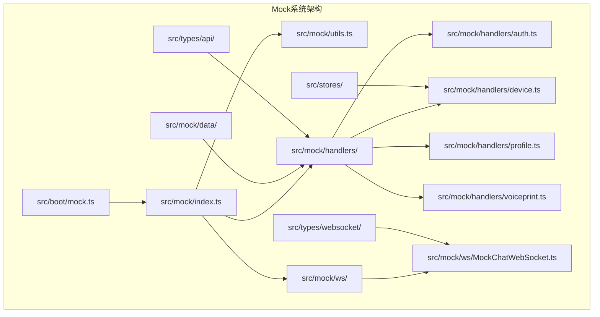
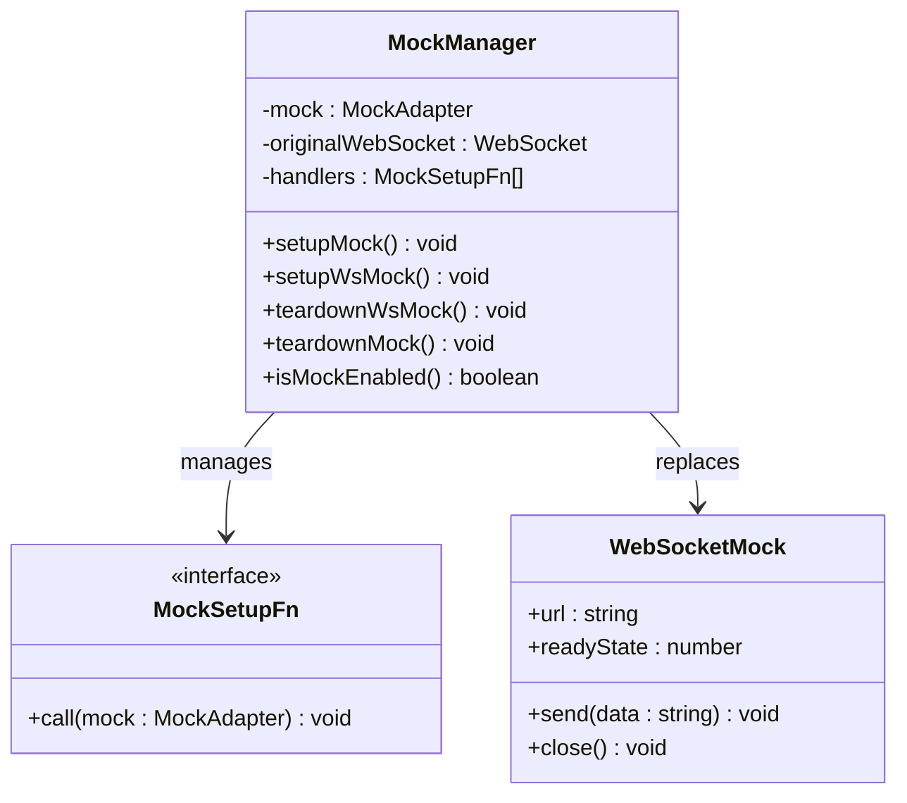
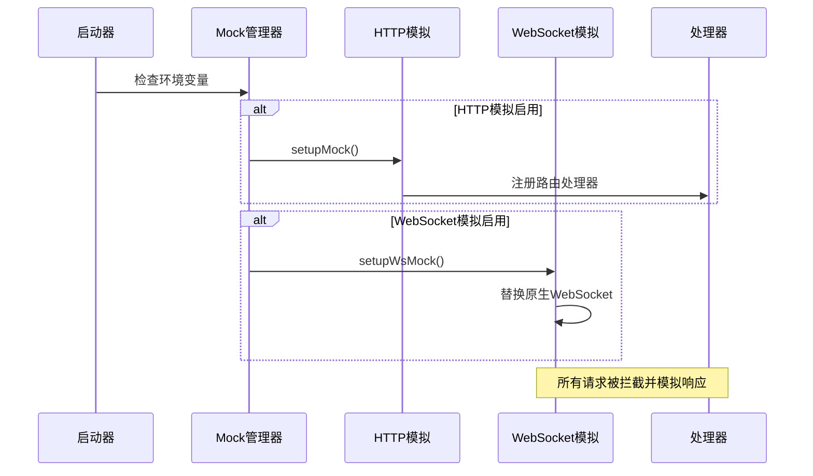
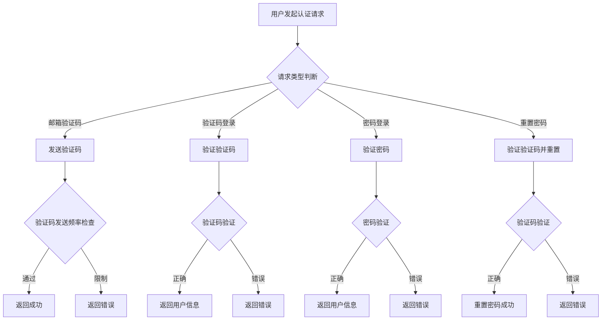
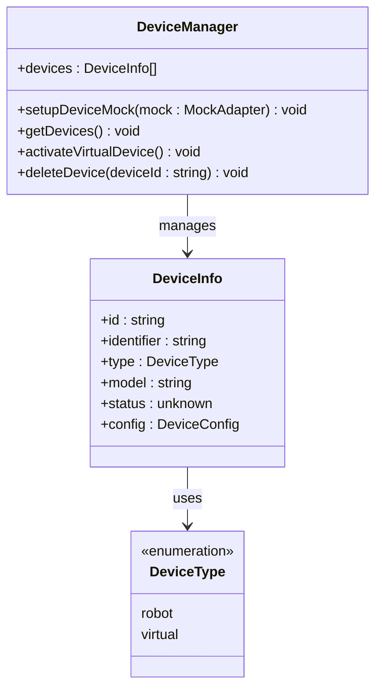
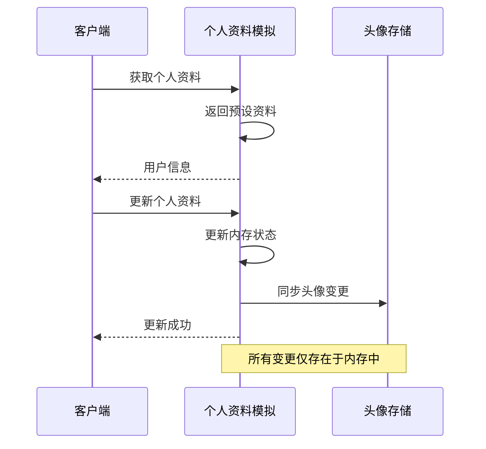
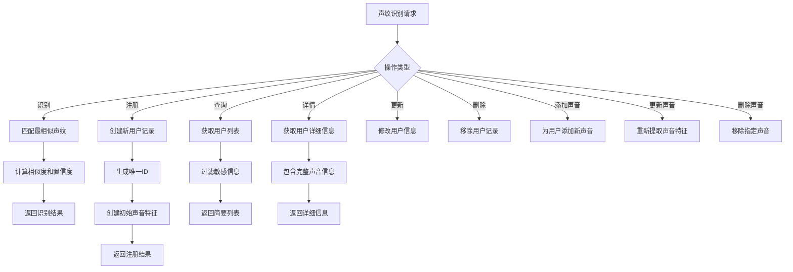
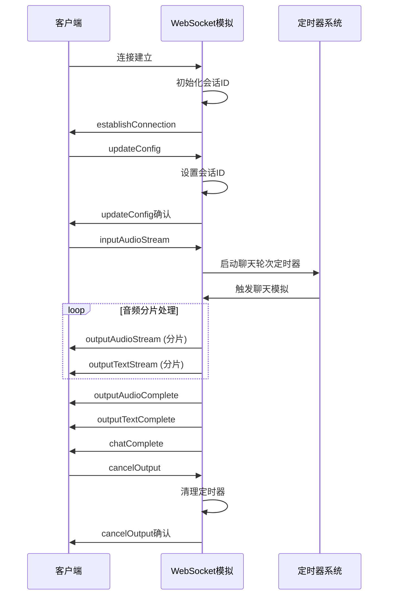
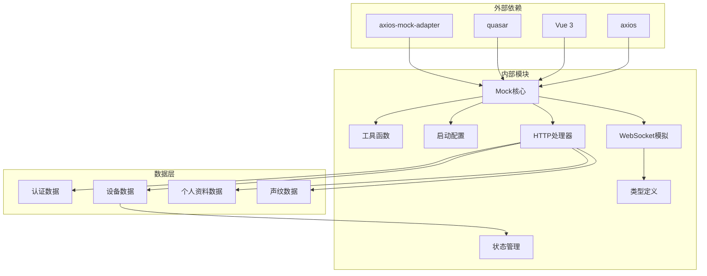

# Mock系统

<cite>
**本文档引用的文件**
- [src/mock/index.ts](file://src/mock/index.ts)
- [src/mock/utils.ts](file://src/mock/utils.ts)
- [src/boot/mock.ts](file://src/boot/mock.ts)
- [src/mock/ws/MockChatWebSocket.ts](file://src/mock/ws/MockChatWebSocket.ts)
- [src/mock/handlers/auth.ts](file://src/mock/handlers/auth.ts)
- [src/mock/handlers/device.ts](file://src/mock/handlers/device.ts)
- [src/mock/handlers/profile.ts](file://src/mock/handlers/profile.ts)
- [src/mock/handlers/voiceprint.ts](file://src/mock/handlers/voiceprint.ts)
- [src/mock/data/auth.ts](file://src/mock/data/auth.ts)
- [src/mock/data/device.ts](file://src/mock/data/device.ts)
- [src/mock/data/profile.ts](file://src/mock/data/profile.ts)
- [src/mock/data/voiceprint.ts](file://src/mock/data/voiceprint.ts)
- [src/types/websocket/types.ts](file://src/types/websocket/types.ts)
- [src/stores/device/types.ts](file://src/stores/device/types.ts)
- [src/types/api/auth.ts](file://src/types/api/auth.ts)
- [src/types/api/device.ts](file://src/types/api/device.ts)
- [src/types/api/profile.ts](file://src/types/api/profile.ts)
- [src/types/api/voiceprint.ts](file://src/types/api/voiceprint.ts)
- [package.json](file://package.json)
</cite>

## 更新摘要
**所做更改**
- 更新了项目结构图以反映完整的Mock系统架构
- 增强了核心组件分析，增加了WebSocket聊天模拟功能的详细说明
- 扩展了依赖关系分析，包含了新的类型定义文件
- 更新了故障排除指南，增加了WebSocket相关的问题诊断
- 完善了性能考虑章节，增加了WebSocket模拟的性能优化建议

## 目录
1. [简介](#简介)
2. [项目结构](#项目结构)
3. [核心组件](#核心组件)
4. [架构概览](#架构概览)
5. [详细组件分析](#详细组件分析)
6. [依赖关系分析](#依赖关系分析)
7. [性能考虑](#性能考虑)
8. [故障排除指南](#故障排除指南)
9. [结论](#结论)

## 简介

Mock系统是Le Bot前端应用中的模拟测试框架，用于在开发和测试环境中模拟后端API响应和WebSocket通信。该系统通过axios-mock-adapter拦截HTTP请求，通过自定义的MockChatWebSocket类模拟实时语音聊天功能，为开发者提供完整的端到端测试体验。

**更新** Mock系统现已提供更全面的测试支持，包括完整的认证、设备管理、个人资料、声纹识别模拟模块，以及WebSocket聊天模拟功能。

Mock系统的主要特点包括：
- 支持HTTP API模拟和WebSocket通信模拟
- 提供完整的认证、设备管理、个人资料和声纹识别功能测试
- 模拟真实的网络延迟和音频流处理
- 支持多种用户场景和边界条件测试
- 全面的WebSocket聊天模拟，包括音频流处理和文本输出

## 项目结构

Mock系统的文件组织采用模块化设计，按照功能领域进行分层：

**图表来源**
- [src/mock/index.ts:1-80](file://src/mock/index.ts#L1-L80)
- [src/boot/mock.ts:1-14](file://src/boot/mock.ts#L1-L14)

**章节来源**
- [src/mock/index.ts:1-80](file://src/mock/index.ts#L1-L80)
- [src/boot/mock.ts:1-14](file://src/boot/mock.ts#L1-L14)

## 核心组件

### Mock初始化管理器

Mock系统的核心入口点负责协调所有模拟组件的初始化和生命周期管理。

**图表来源**
- [src/mock/index.ts:12-80](file://src/mock/index.ts#L12-L80)

### 工具函数库

提供通用的模拟辅助功能，包括响应格式化、ID生成和延迟模拟。

| 工具函数 | 功能描述 | 参数类型 | 返回值类型 |
|---------|----------|----------|------------|
| mockDelay | 模拟网络延迟 | ms?: number | Promise<void> |
| mockSuccess | 创建成功响应 | data: T | ApiResponse<T> |
| mockError | 创建错误响应 | message: string | ApiResponse<T> |
| mockId | 生成随机ID | - | string |

**章节来源**
- [src/mock/utils.ts:1-30](file://src/mock/utils.ts#L1-L30)

## 架构概览

Mock系统的整体架构采用插件化设计，支持按需启用不同的模拟功能：

**图表来源**
- [src/boot/mock.ts:3-13](file://src/boot/mock.ts#L3-L13)
- [src/mock/index.ts:25-48](file://src/mock/index.ts#L25-L48)

## 详细组件分析

### 认证模块模拟

认证模块模拟完整的用户身份验证流程，包括邮箱验证、密码登录和注册流程。

**图表来源**
- [src/mock/handlers/auth.ts:25-119](file://src/mock/handlers/auth.ts#L25-L119)

认证模块的关键特性：
- 验证码发送频率限制（60秒冷却时间）
- 新用户和老用户的差异化处理流程
- 固定的测试凭据和令牌
- 完整的密码重置流程支持

**章节来源**
- [src/mock/handlers/auth.ts:1-120](file://src/mock/handlers/auth.ts#L1-L120)
- [src/mock/data/auth.ts:1-46](file://src/mock/data/auth.ts#L1-L46)

### 设备管理模拟

设备管理模块模拟用户设备的增删改查操作，支持物理设备和虚拟设备的管理。

**图表来源**
- [src/mock/handlers/device.ts:9-63](file://src/mock/handlers/device.ts#L9-L63)
- [src/stores/device/types.ts:1-22](file://src/stores/device/types.ts#L1-L22)

设备管理的关键特性：
- 最大虚拟设备数量限制（5个）
- 自动生成唯一设备标识符
- 支持设备状态和配置管理
- 完整的CRUD操作支持

**章节来源**
- [src/mock/handlers/device.ts:1-64](file://src/mock/handlers/device.ts#L1-L64)
- [src/mock/data/device.ts:1-50](file://src/mock/data/device.ts#L1-L50)

### 个人资料模拟

个人资料模块模拟用户个人信息的查询和更新功能，包括头像管理和基本信息维护。

**图表来源**
- [src/mock/handlers/profile.ts:18-51](file://src/mock/handlers/profile.ts#L18-L51)

个人资料模拟的特点：
- 内存中维护用户状态，重启后丢失
- 自动同步头像数据变更
- 支持部分字段更新（昵称、生日、关系等）
- 完整的头像数据接口支持

**章节来源**
- [src/mock/handlers/profile.ts:1-52](file://src/mock/handlers/profile.ts#L1-L52)
- [src/mock/data/profile.ts:1-33](file://src/mock/data/profile.ts#L1-L33)

### 声纹识别模拟

声纹识别模块提供完整的声纹注册、识别和管理功能，支持多用户和多声音配置。

**图表来源**
- [src/mock/handlers/voiceprint.ts:15-225](file://src/mock/handlers/voiceprint.ts#L15-L225)

声纹识别的关键功能：
- 多用户多声音支持
- 随机相似度和置信度生成
- 完整的CRUD操作链路
- 特征向量的动态更新

**章节来源**
- [src/mock/handlers/voiceprint.ts:1-236](file://src/mock/handlers/voiceprint.ts#L1-L236)
- [src/mock/data/voiceprint.ts:1-70](file://src/mock/data/voiceprint.ts#L1-L70)

### WebSocket聊天模拟

WebSocket聊天模拟器提供完整的语音聊天体验，包括音频流处理、文本输出和会话管理。

**图表来源**
- [src/mock/ws/MockChatWebSocket.ts:29-227](file://src/mock/ws/MockChatWebSocket.ts#L29-L227)

WebSocket模拟的核心特性：
- 实时音频流模拟（200ms分片，16kHz采样率）
- 文本内容的渐进式输出
- 完整的聊天生命周期管理
- 取消输出和清理机制

**章节来源**
- [src/mock/ws/MockChatWebSocket.ts:1-268](file://src/mock/ws/MockChatWebSocket.ts#L1-L268)
- [src/types/websocket/types.ts:1-226](file://src/types/websocket/types.ts#L1-L226)

## 依赖关系分析

Mock系统的依赖关系清晰且模块化，各组件之间耦合度低，便于独立测试和维护。

**图表来源**
- [package.json:17-55](file://package.json#L17-L55)
- [src/mock/index.ts:1-10](file://src/mock/index.ts#L1-L10)

**章节来源**
- [package.json:1-63](file://package.json#L1-L63)

## 性能考虑

Mock系统在设计时充分考虑了性能和用户体验：

### 网络延迟模拟
- 默认响应延迟：300ms，提供真实的网络体验
- 可配置的延迟时间，适应不同测试需求
- 异步处理确保UI流畅性

### 资源使用优化
- 内存中数据存储，避免持久化开销
- 按需加载模拟模块，减少初始包大小
- 定时器自动清理，防止内存泄漏

### 并发处理
- 独立的定时器系统管理异步操作
- 防止重复输入触发的保护机制
- 完善的错误处理和恢复策略

### WebSocket性能优化
- 音频分片大小优化（200ms，16kHz采样率）
- 定时器池管理，避免内存泄漏
- 模拟音频数据压缩，减少传输开销
- 事件驱动的消息分发机制

## 故障排除指南

### 常见问题及解决方案

| 问题类型 | 症状描述 | 解决方案 |
|---------|----------|----------|
| Mock未启用 | API请求直接到达真实服务器 | 检查环境变量VITE_MOCK_ENABLED是否设置为true |
| WebSocket连接失败 | 聊天功能不可用 | 确认VITE_MOCK_WS_ENABLED已启用 |
| 验证码发送限制 | 频繁发送验证码被拒绝 | 等待60秒冷却时间或修改MOCK_CODE_COOLDOWN_MS |
| 设备激活失败 | 虚拟设备数量达到上限 | 删除不需要的虚拟设备或增加MAX_VIRTUAL_DEVICES限制 |
| 声纹识别失败 | 无法找到匹配的声纹 | 确保至少有一个声纹数据记录 |
| WebSocket音频异常 | 音频播放卡顿或无声 | 检查浏览器音频权限和音频上下文状态 |
| WebSocket消息丢失 | 聊天消息不完整 | 确认WebSocket连接状态和消息序列号 |

### 调试技巧

1. **启用详细日志**：所有Mock操作都会在控制台输出详细日志
2. **检查环境变量**：确认开发环境中的Mock配置正确
3. **验证数据完整性**：确保模拟数据符合预期格式
4. **监控内存使用**：注意Mock数据仅存在于内存中
5. **WebSocket调试**：使用浏览器开发者工具监控WebSocket消息流

**章节来源**
- [src/mock/index.ts:25-80](file://src/mock/index.ts#L25-L80)
- [src/boot/mock.ts:3-13](file://src/boot/mock.ts#L3-L13)

## 结论

Le Bot的Mock系统是一个设计精良的测试基础设施，提供了完整的前后端模拟能力。其主要优势包括：

### 技术优势
- **模块化设计**：清晰的功能分离和依赖关系
- **完整的功能覆盖**：涵盖所有核心业务场景
- **真实的用户体验**：模拟网络延迟和异步处理
- **易于扩展**：插件化的架构支持新功能添加
- **全面的WebSocket支持**：提供真实的聊天交互体验

### 开发价值
- **提高开发效率**：快速迭代和测试新功能
- **改善调试体验**：详细的日志和错误信息
- **保证代码质量**：全面的单元测试和集成测试支持
- **降低测试成本**：无需真实后端服务即可完成测试

Mock系统为Le Bot项目的持续开发和维护提供了坚实的技术基础，是现代前端开发中Mock测试的最佳实践案例。通过新增的WebSocket聊天模拟功能，开发者现在可以在本地环境中完整地测试语音聊天的所有交互场景，大大提升了开发和测试的便利性。