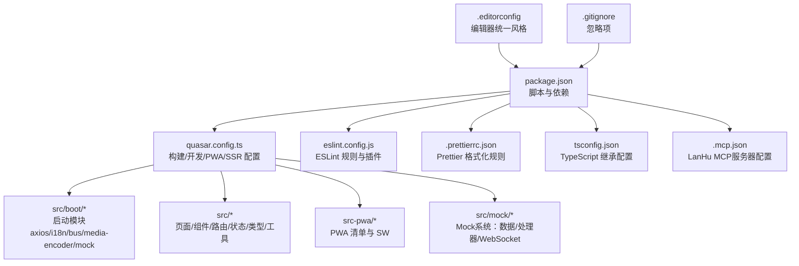
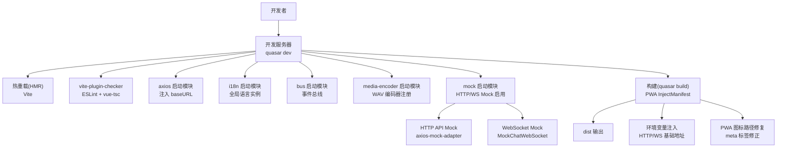
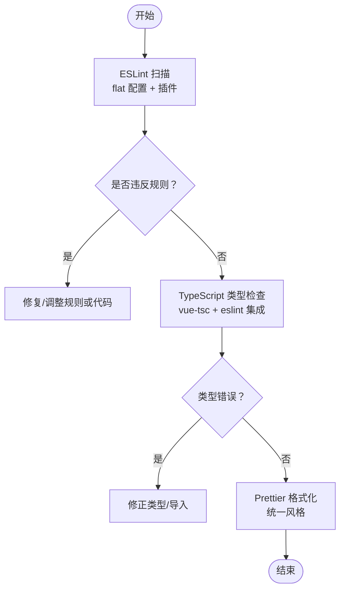
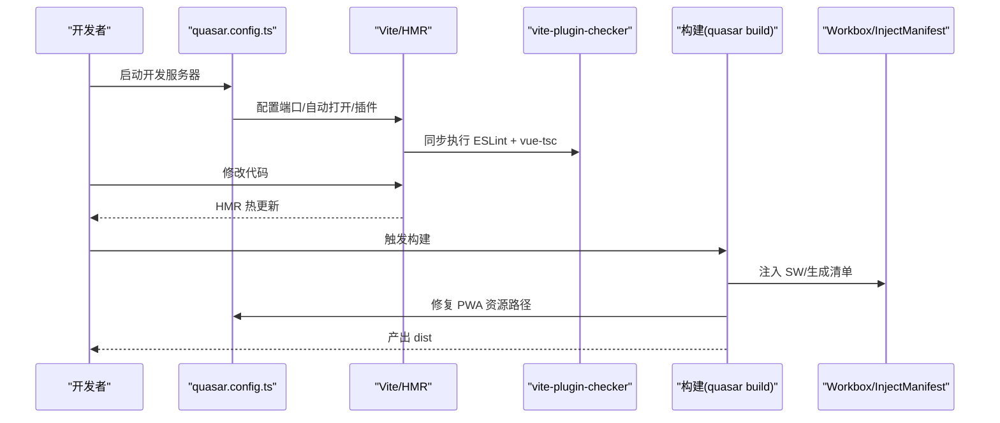
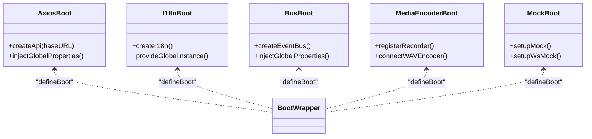
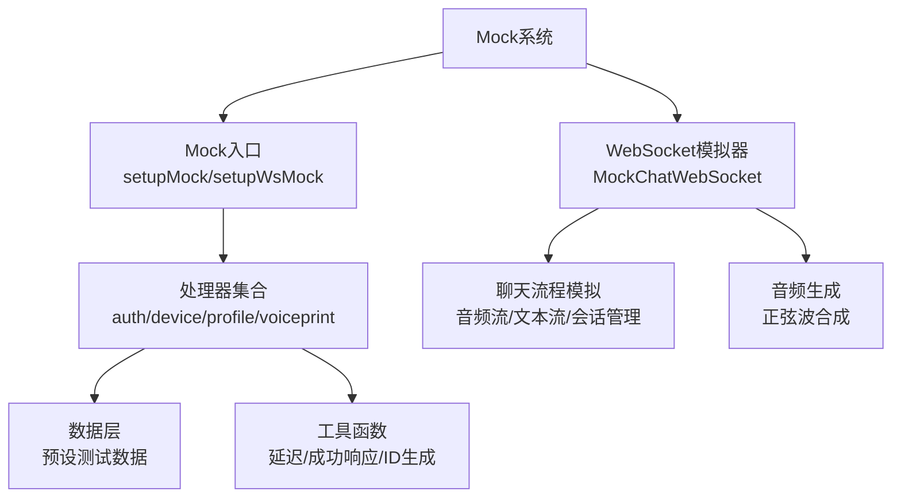
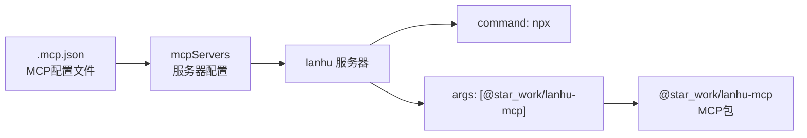
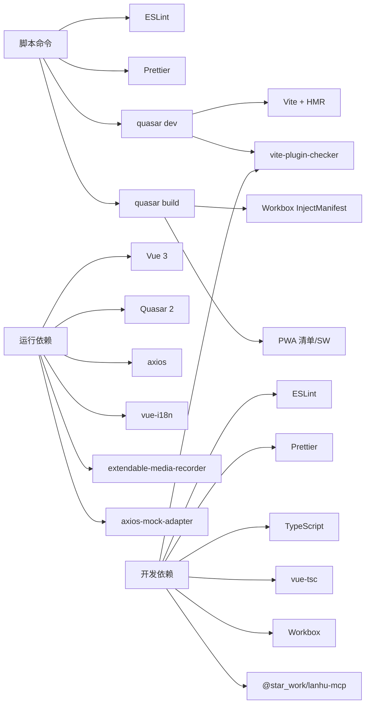

# 开发工作流

<cite>
**本文引用的文件**
- [package.json](file://package.json)
- [eslint.config.js](file://eslint.config.js)
- [.prettierrc.json](file://.prettierrc.json)
- [tsconfig.json](file://tsconfig.json)
- [quasar.config.ts](file://quasar.config.ts)
- [.gitignore](file://.gitignore)
- [.editorconfig](file://.editorconfig)
- [README.md](file://README.md)
- [AGENTS.md](file://AGENTS.md)
- [src/env.d.ts](file://src/env.d.ts)
- [src-pwa/pwa-env.d.ts](file://src-pwa/pwa-env.d.ts)
- [src/boot/axios.ts](file://src/boot/axios.ts)
- [src/boot/i18n.ts](file://src/boot/i18n.ts)
- [src/boot/bus.ts](file://src/boot/bus.ts)
- [src/boot/media-encoder.ts](file://src/boot/media-encoder.ts)
- [src/boot/mock.ts](file://src/boot/mock.ts)
- [.mcp.json](file://.mcp.json)
- [src/mock/index.ts](file://src/mock/index.ts)
- [src/mock/utils.ts](file://src/mock/utils.ts)
- [src/mock/data/auth.ts](file://src/mock/data/auth.ts)
- [src/mock/data/device.ts](file://src/mock/data/device.ts)
- [src/mock/data/profile.ts](file://src/mock/data/profile.ts)
- [src/mock/data/voiceprint.ts](file://src/mock/data/voiceprint.ts)
- [src/mock/handlers/auth.ts](file://src/mock/handlers/auth.ts)
- [src/mock/handlers/device.ts](file://src/mock/handlers/device.ts)
- [src/mock/handlers/profile.ts](file://src/mock/handlers/profile.ts)
- [src/mock/handlers/voiceprint.ts](file://src/mock/handlers/voiceprint.ts)
- [src/mock/ws/MockChatWebSocket.ts](file://src/mock/ws/MockChatWebSocket.ts)
</cite>

## 目录
1. 引言
2. 项目结构
3. 核心组件
4. 架构总览
5. 详细组件分析
6. 依赖分析
7. 性能考虑
8. 故障排除指南
9. 结论
10. 附录

## 引言
本指南面向 Le Bot 前端（Web）开发团队，系统梳理从代码质量保证（ESLint、Prettier、TypeScript）、构建与开发服务器、热重载机制，到代码规范、提交规范、分支管理、团队协作、CI/CD、部署与版本发布的完整工作流。特别新增了Mock系统开发工具集成、LanHu MCP服务器配置(.mcp.json)以及增强的开发工作流支持，提供了更完整的开发环境配置。同时提供开发工具配置、调试技巧、性能分析方法与常见问题排查建议，帮助团队高效协作、稳定交付。

## 项目结构
该前端项目基于 Quasar 2 + Vite，采用 Vue 3 + TypeScript 技术栈，结合 PWA 能力与国际化支持，核心目录与职责如下：
- src：应用源码，包含页面、组件、路由、状态管理、类型定义、工具函数等
- src/boot：应用启动阶段注入的全局模块（如 axios、i18n、事件总线、媒体编码器、Mock系统）
- src/mock：完整的Mock系统，包含数据预设、API处理器、WebSocket模拟器
- src-pwa：PWA 相关配置与自定义 Service Worker
- 配置文件：package.json、eslint.config.js、.prettierrc.json、tsconfig.json、quasar.config.ts、.mcp.json
- 文档：README.md、AGENTS.md

图表来源
- [package.json:1-61](file://package.json#L1-L61)
- [quasar.config.ts:1-278](file://quasar.config.ts#L1-L278)
- [eslint.config.js:1-91](file://eslint.config.js#L1-L91)
- [.prettierrc.json:1-5](file://.prettierrc.json#L1-L5)
- [tsconfig.json:1-3](file://tsconfig.json#L1-L3)
- [.mcp.json:1-9](file://.mcp.json#L1-L9)
- [.editorconfig:1-8](file://.editorconfig#L1-L8)
- [.gitignore:1-34](file://.gitignore#L1-L34)

章节来源
- [README.md:1-41](file://README.md#L1-L41)
- [quasar.config.ts:10-278](file://quasar.config.ts#L10-L278)

## 核心组件
- 质量保障体系
  - ESLint：使用 flat 配置，集成 Vue、Quasar、TypeScript 推荐规则，并通过 Prettier 跳过格式化冲突
  - Prettier：统一缩进、引号、行长等格式化策略
  - TypeScript：严格模式、Vue shim、目标浏览器与 Node 版本约束
- 构建与开发服务器
  - Quasar/Vite：开发服务器端口、自动打开浏览器、PWA 模式构建、Workbox 注入式 SW
  - 环境变量注入：HTTP/WS 后端地址按环境动态切换
- 热重载机制
  - Vite HMR；开发时自动重启与错误提示由 vite-plugin-checker 提供
- PWA 与国际化
  - PWA：InjectManifest 模式，自定义 SW 与清单
  - 国际化：vue-i18n，类型安全的语言资源与全局实例
- Mock系统集成
  - HTTP API Mock：基于axios-mock-adapter，支持认证、设备、个人资料、声纹识别等模块
  - WebSocket Mock：完整的聊天WebSocket模拟器，支持音频流、文本流、会话管理
  - 环境控制：通过VITE_MOCK_ENABLED和VITE_MOCK_WS_ENABLED环境变量控制Mock启用状态

章节来源
- [package.json:9-16](file://package.json#L9-L16)
- [eslint.config.js:1-91](file://eslint.config.js#L1-L91)
- [.prettierrc.json:1-5](file://.prettierrc.json#L1-L5)
- [tsconfig.json:1-3](file://tsconfig.json#L1-L3)
- [quasar.config.ts:38-137](file://quasar.config.ts#L38-L137)
- [quasar.config.ts:140-144](file://quasar.config.ts#L140-L144)
- [quasar.config.ts:206-216](file://quasar.config.ts#L206-L216)
- [src/boot/axios.ts:18](file://src/boot/axios.ts#L18)
- [src/boot/i18n.ts:23-27](file://src/boot/i18n.ts#L23-L27)
- [src/boot/bus.ts:11-13](file://src/boot/bus.ts#L11-L13)
- [src/boot/media-encoder.ts:5-7](file://src/boot/media-encoder.ts#L5-L7)
- [src/boot/mock.ts:1-14](file://src/boot/mock.ts#L1-L14)

## 架构总览
下图展示开发工作流的关键环节：开发者在本地运行开发服务器，ESLint/Prettier/TypeScript 在保存或执行脚本时进行质量检查，构建阶段注入 PWA 与环境变量，Mock系统根据环境变量动态启用HTTP API和WebSocket模拟，最终产出可部署产物。

图表来源
- [quasar.config.ts:140-144](file://quasar.config.ts#L140-L144)
- [quasar.config.ts:107-136](file://quasar.config.ts#L107-L136)
- [quasar.config.ts:44-56](file://quasar.config.ts#L44-L56)
- [quasar.config.ts:58-69](file://quasar.config.ts#L58-L69)
- [src/boot/axios.ts:18](file://src/boot/axios.ts#L18)
- [src/boot/i18n.ts:23-27](file://src/boot/i18n.ts#L23-L27)
- [src/boot/bus.ts:11-13](file://src/boot/bus.ts#L11-L13)
- [src/boot/media-encoder.ts:5-7](file://src/boot/media-encoder.ts#L5-L7)
- [src/boot/mock.ts:1-14](file://src/boot/mock.ts#L1-L14)

## 详细组件分析

### 代码质量保证体系
- ESLint
  - 使用 flat 配置，启用 Vue、Quasar、TypeScript 推荐规则集
  - 针对 Vue 单文件组件关闭部分"未使用变量"误报以适配模板引用
  - 对 TS 导入强制使用 type-only 导入，提升编译期类型安全性
  - 生产环境禁用 debugger，避免误用
  - 为 PWA 自定义 Service Worker 文件单独配置 Service Worker 全局变量
  - 与 Prettier 协同，跳过格式化冲突
- Prettier
  - 统一单引号、行长等策略，与编辑器配置保持一致
- TypeScript
  - 严格模式、Vue shim、目标浏览器与 Node 版本约束
  - 通过继承 .quasar/tsconfig.json 统一工程级配置

图表来源
- [eslint.config.js:36-52](file://eslint.config.js#L36-L52)
- [eslint.config.js:72-78](file://eslint.config.js#L72-L78)
- [eslint.config.js:80-87](file://eslint.config.js#L80-L87)
- [eslint.config.js:89](file://eslint.config.js#L89)
- [.prettierrc.json:1-5](file://.prettierrc.json#L1-L5)
- [tsconfig.json:1-3](file://tsconfig.json#L1-L3)

章节来源
- [eslint.config.js:1-91](file://eslint.config.js#L1-L91)
- [.prettierrc.json:1-5](file://.prettierrc.json#L1-L5)
- [tsconfig.json:1-3](file://tsconfig.json#L1-L3)

### 构建流程与开发服务器
- 开发服务器
  - 端口与自动打开行为在 quasar.config.ts 中配置
  - 启用 vite-plugin-checker，在开发时同步进行 ESLint 与 vue-tsc 检查
- 构建与 PWA
  - PWA 模式构建，Workbox 采用 InjectManifest
  - 构建后钩子自动修复 PWA 图标与清单路径，适配 GitHub Pages 或自定义 base
  - 注入环境变量（HTTP/WS 后端基础地址），区分开发/生产/GitHub Pages 环境
- 目标与兼容性
  - 浏览器目标包含现代主流版本，Node 目标为 Node 20
- 热重载
  - 基于 Vite 的 HMR，配合 vite-plugin-checker 实时反馈

图表来源
- [quasar.config.ts:140-144](file://quasar.config.ts#L140-L144)
- [quasar.config.ts:107-136](file://quasar.config.ts#L107-L136)
- [quasar.config.ts:44-56](file://quasar.config.ts#L44-L56)
- [quasar.config.ts:58-69](file://quasar.config.ts#L58-L69)

章节来源
- [quasar.config.ts:38-137](file://quasar.config.ts#L38-L137)
- [quasar.config.ts:206-216](file://quasar.config.ts#L206-L216)

### 启动模块与运行时注入
- axios 启动模块
  - 创建带 baseURL 的 API 实例，注入到全局属性，便于组件访问
- i18n 启动模块
  - 创建 i18n 实例，启用非遗留模式，提供类型安全的语言资源
- bus 启动模块
  - 基于 Quasar EventBus 的类型化事件总线，用于跨组件通信
- media-encoder 启动模块
  - 注册 Extendable Media Recorder 及 WAV 编码器，为录音/播放提供能力
- mock 启动模块
  - 条件性启用Mock系统：根据VITE_MOCK_ENABLED和VITE_MOCK_WS_ENABLED环境变量决定是否启用HTTP API Mock和WebSocket Mock

图表来源
- [src/boot/axios.ts:1-27](file://src/boot/axios.ts#L1-L27)
- [src/boot/i18n.ts:1-34](file://src/boot/i18n.ts#L1-L34)
- [src/boot/bus.ts:1-18](file://src/boot/bus.ts#L1-L18)
- [src/boot/media-encoder.ts:1-8](file://src/boot/media-encoder.ts#L1-L8)
- [src/boot/mock.ts:1-14](file://src/boot/mock.ts#L1-L14)

章节来源
- [src/boot/axios.ts:18](file://src/boot/axios.ts#L18)
- [src/boot/i18n.ts:23-27](file://src/boot/i18n.ts#L23-L27)
- [src/boot/bus.ts:11-13](file://src/boot/bus.ts#L11-L13)
- [src/boot/media-encoder.ts:5-7](file://src/boot/media-encoder.ts#L5-L7)
- [src/boot/mock.ts:1-14](file://src/boot/mock.ts#L1-L14)

### Mock系统架构与实现
- Mock系统概述
  - 基于axios-mock-adapter实现HTTP API模拟
  - 自定义MockChatWebSocket模拟实时聊天WebSocket
  - 支持认证、设备管理、个人资料、声纹识别等业务模块
  - 通过环境变量控制Mock启用状态，不影响生产环境
- Mock系统核心组件
  - Mock入口：统一初始化和管理所有Mock处理器
  - 数据层：预设的测试数据，模拟真实业务场景
  - 处理器层：针对各业务模块的具体Mock实现
  - WebSocket层：完整的聊天对话模拟器
- Mock系统特性
  - 网络延迟模拟：默认300ms延迟，提升真实感
  - 成功/错误响应：统一的响应格式，便于前端处理
  - ID生成：随机UUID生成，确保唯一性
  - 状态管理：支持增删改查操作的状态变更

图表来源
- [src/mock/index.ts:1-80](file://src/mock/index.ts#L1-L80)
- [src/mock/utils.ts:1-30](file://src/mock/utils.ts#L1-L30)
- [src/mock/ws/MockChatWebSocket.ts:1-268](file://src/mock/ws/MockChatWebSocket.ts#L1-L268)

章节来源
- [src/boot/mock.ts:1-14](file://src/boot/mock.ts#L1-L14)
- [src/mock/index.ts:1-80](file://src/mock/index.ts#L1-L80)
- [src/mock/utils.ts:1-30](file://src/mock/utils.ts#L1-L30)
- [src/mock/data/auth.ts:1-46](file://src/mock/data/auth.ts#L1-L46)
- [src/mock/data/device.ts:1-50](file://src/mock/data/device.ts#L1-L50)
- [src/mock/data/profile.ts:1-33](file://src/mock/data/profile.ts#L1-L33)
- [src/mock/data/voiceprint.ts:1-70](file://src/mock/data/voiceprint.ts#L1-L70)
- [src/mock/handlers/auth.ts:1-120](file://src/mock/handlers/auth.ts#L1-L120)
- [src/mock/handlers/device.ts:1-64](file://src/mock/handlers/device.ts#L1-L64)
- [src/mock/handlers/profile.ts:1-52](file://src/mock/handlers/profile.ts#L1-L52)
- [src/mock/handlers/voiceprint.ts:1-236](file://src/mock/handlers/voiceprint.ts#L1-L236)
- [src/mock/ws/MockChatWebSocket.ts:1-268](file://src/mock/ws/MockChatWebSocket.ts#L1-L268)

### LanHu MCP服务器配置
- MCP配置概述
  - .mcp.json文件定义LanHu MCP服务器的启动方式
  - 使用npx命令启动@star_work/lanhu-mcp包
  - 支持外部MCP服务器集成，扩展开发工具链
- 配置解析
  - mcpServers对象包含服务器配置数组
  - 每个服务器配置包含command和args字段
  - command指定执行命令（npx）
  - args指定命令参数（@star_work/lanhu-mcp）

图表来源
- [.mcp.json:1-9](file://.mcp.json#L1-L9)

章节来源
- [.mcp.json:1-9](file://.mcp.json#L1-L9)

### 环境变量与类型声明
- 运行时环境变量
  - 通过 quasar.config.ts 的 env 注入 HTTP/WS 后端基础地址，区分开发/生产/GitHub Pages
  - Mock系统通过VITE_MOCK_ENABLED和VITE_MOCK_WS_ENABLED控制启用状态
  - 类型声明位于 src/env.d.ts，确保编译期校验
- PWA 环境变量
  - src-pwa/pwa-env.d.ts 定义 PWA 相关环境变量类型

章节来源
- [quasar.config.ts:58-69](file://quasar.config.ts#L58-L69)
- [src/env.d.ts:1-11](file://src/env.d.ts#L1-L11)
- [src-pwa/pwa-env.d.ts:1-8](file://src-pwa/pwa-env.d.ts#L1-L8)

## 依赖分析
- 脚本与命令
  - lint：ESLint 扫描源码
  - format：Prettier 格式化
  - dev/build：Quasar 开发/生产构建（PWA 模式）
  - postinstall：Quasar 准备
- 关键依赖
  - Quasar 2、Vue 3、Pinia、Vue Router、axios、vue-i18n、extendable-media-recorder
  - axios-mock-adapter：Mock系统核心依赖
- 开发依赖
  - ESLint、Prettier、TypeScript、vite-plugin-checker、vue-tsc、Workbox
  - @star_work/lanhu-mcp：MCP服务器支持

图表来源
- [package.json:9-16](file://package.json#L9-L16)
- [package.json:17-53](file://package.json#L17-L53)
- [quasar.config.ts:107-136](file://quasar.config.ts#L107-L136)

章节来源
- [package.json:1-61](file://package.json#L1-L61)

## 性能考虑
- 构建与缓存
  - 使用 vite-plugin-checker 在开发阶段即时发现类型与语法问题，减少反复构建
  - 合理设置浏览器目标，平衡兼容性与打包体积
- 运行时性能
  - 启动模块按需加载，避免在 SSR 场景创建全局单例导致交叉请求污染
  - 媒体录制/播放使用 Extendable Media Recorder，降低内存与 CPU 占用
  - Mock系统仅在开发环境启用，生产环境无额外开销
- PWA 与缓存
  - InjectManifest 模式便于精细控制缓存策略，结合 meta 标签路径修复，确保资源正确加载
- Mock系统性能
  - Mock响应包含300ms延迟，模拟真实网络环境
  - WebSocket模拟器使用定时器管理消息发送，避免阻塞主线程

## 故障排除指南
- ESLint 报错
  - 检查 flat 配置中的 Vue 单文件组件规则与 Prettier 冲突处理
  - 针对 Service Worker 文件单独配置全局变量
- PWA 图标/清单路径异常
  - 构建后钩子会自动修复 meta 标签中的图标与清单路径，确认 DEPLOY_GITHUB_PAGE 或 base 设置
- 环境变量无效
  - 确认 quasar.config.ts 的 env 注入逻辑与 src/env.d.ts 类型声明一致
  - 检查Mock系统环境变量VITE_MOCK_ENABLED和VITE_MOCK_WS_ENABLED设置
- 热重载不生效
  - 检查 vite-plugin-checker 是否正常运行，确认 Vite 配置与端口占用情况
- 依赖安装问题
  - 使用 packageManager 指定的 pnpm 版本，确保 Node 版本满足 engines 要求
- Mock系统问题
  - 确认Mock模块已正确导入和初始化
  - 检查HTTP API Mock和WebSocket Mock的启用状态
  - 验证Mock数据和处理器的正确性

章节来源
- [eslint.config.js:80-87](file://eslint.config.js#L80-L87)
- [eslint.config.js:89](file://eslint.config.js#L89)
- [quasar.config.ts:44-56](file://quasar.config.ts#L44-L56)
- [quasar.config.ts:58-69](file://quasar.config.ts#L58-L69)
- [quasar.config.ts:107-136](file://quasar.config.ts#L107-L136)
- [package.json:54-59](file://package.json#L54-L59)
- [src/boot/mock.ts:1-14](file://src/boot/mock.ts#L1-L14)

## 结论
本工作流以 Quasar/Vite 为核心，结合 ESLint、Prettier、TypeScript 与 vite-plugin-checker 形成完整的质量保障闭环；通过 InjectManifest PWA 与环境变量注入实现灵活部署；启动模块化设计使运行时能力清晰可维护。新增的Mock系统提供了完整的开发环境支持，包括HTTP API模拟和WebSocket聊天模拟，极大提升了开发效率和测试便利性。LanHu MCP服务器配置进一步增强了开发工具链的扩展性。遵循本文规范与流程，可显著提升开发效率与交付质量。

## 附录

### 代码规范与提交规范
- 代码风格
  - 使用 .editorconfig 与 .prettierrc.json 统一缩进、换行、引号与行长
  - ESLint 规则覆盖 Vue、Quasar、TypeScript，禁止在生产环境使用 debugger
- 提交前检查
  - 运行 yarn lint 与 yarn format，确保无 ESLint 错误且已格式化
  - 必要时运行 quasar build 验证构建与 PWA 正常
  - 如使用Mock系统，确保环境变量配置正确
- 分支管理
  - 建议采用功能分支开发，合并前进行代码审查与测试
  - 发布版本打标签并记录变更日志

章节来源
- [.editorconfig:1-8](file://.editorconfig#L1-L8)
- [.prettierrc.json:1-5](file://.prettierrc.json#L1-L5)
- [eslint.config.js:72-78](file://eslint.config.js#L72-L78)
- [README.md:18-37](file://README.md#L18-L37)

### 团队协作与 CI/CD
- 本地开发
  - 使用 quasar dev 启动开发服务器，端口 3001，自动打开浏览器
  - 通过 vite-plugin-checker 实时反馈 ESLint 与类型错误
  - 可选启用Mock系统进行离线开发和测试
- 部署准备
  - 使用 quasar build 生成 dist，确保 PWA 资源路径修复
  - 根据部署目标设置 DEPLOY_GITHUB_PAGE 或自定义 base
  - 生产环境应禁用Mock系统
- 版本发布
  - 更新 package.json 版本号，生成变更日志，推送标签并发布

章节来源
- [quasar.config.ts:140-144](file://quasar.config.ts#L140-L144)
- [quasar.config.ts:107-136](file://quasar.config.ts#L107-L136)
- [quasar.config.ts:44-56](file://quasar.config.ts#L44-L56)
- [package.json:2-4](file://package.json#L2-L4)

### Mock系统使用指南
- 启用条件
  - 设置VITE_MOCK_ENABLED=true启用HTTP API Mock
  - 设置VITE_MOCK_WS_ENABLED=true启用WebSocket Mock
- 支持的业务模块
  - 认证：邮箱验证码、密码登录、令牌验证
  - 设备：设备列表、虚拟设备激活、设备删除
  - 个人资料：头像获取、信息查询、信息更新
  - 声纹识别：声纹识别、人员注册、人员管理
- 开发建议
  - Mock系统仅在开发环境使用
  - 可结合LanHu MCP服务器进行更复杂的开发场景
  - 利用Mock数据进行单元测试和集成测试

章节来源
- [src/boot/mock.ts:1-14](file://src/boot/mock.ts#L1-L14)
- [src/mock/index.ts:1-80](file://src/mock/index.ts#L1-L80)
- [src/mock/handlers/auth.ts:1-120](file://src/mock/handlers/auth.ts#L1-L120)
- [src/mock/handlers/device.ts:1-64](file://src/mock/handlers/device.ts#L1-L64)
- [src/mock/handlers/profile.ts:1-52](file://src/mock/handlers/profile.ts#L1-L52)
- [src/mock/handlers/voiceprint.ts:1-236](file://src/mock/handlers/voiceprint.ts#L1-L236)
- [.mcp.json:1-9](file://.mcp.json#L1-L9)