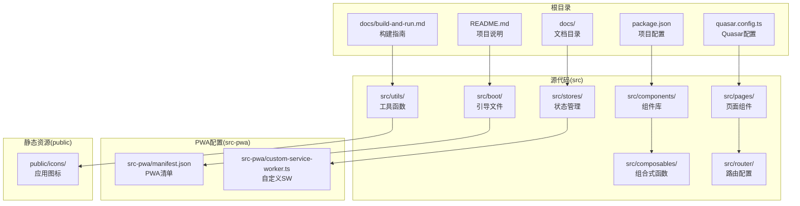
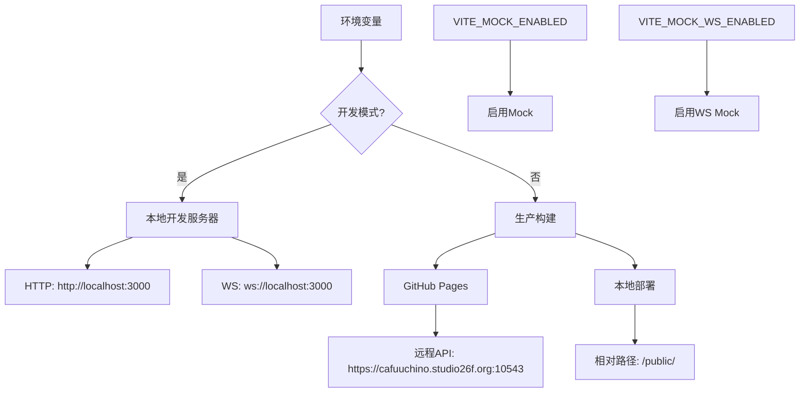
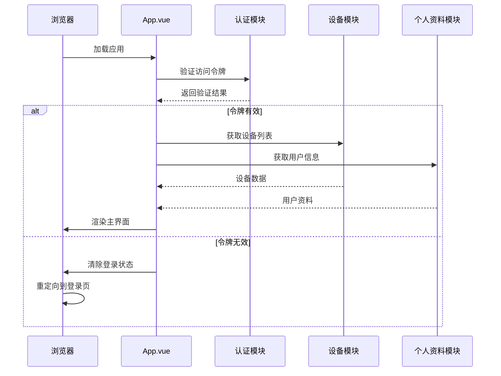
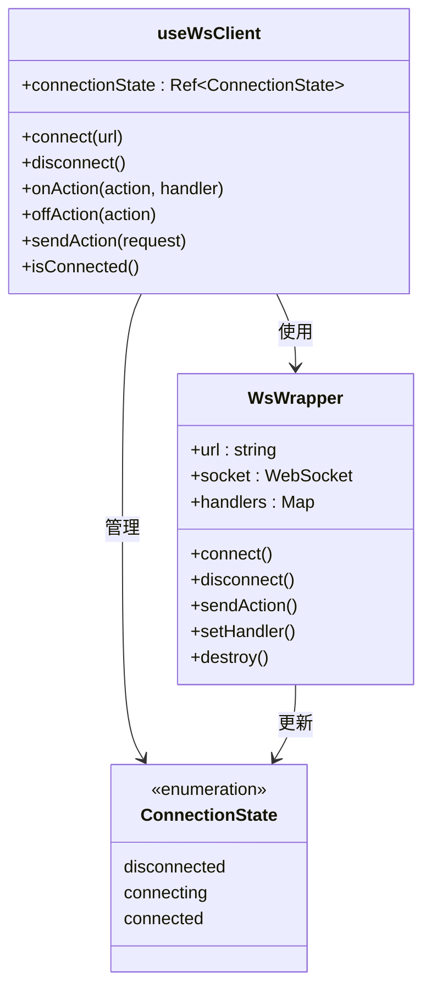
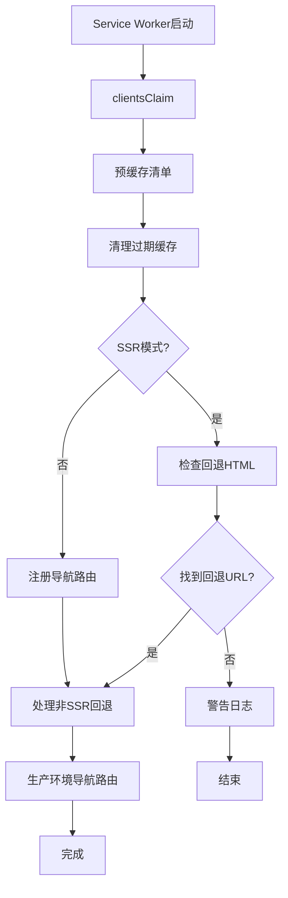
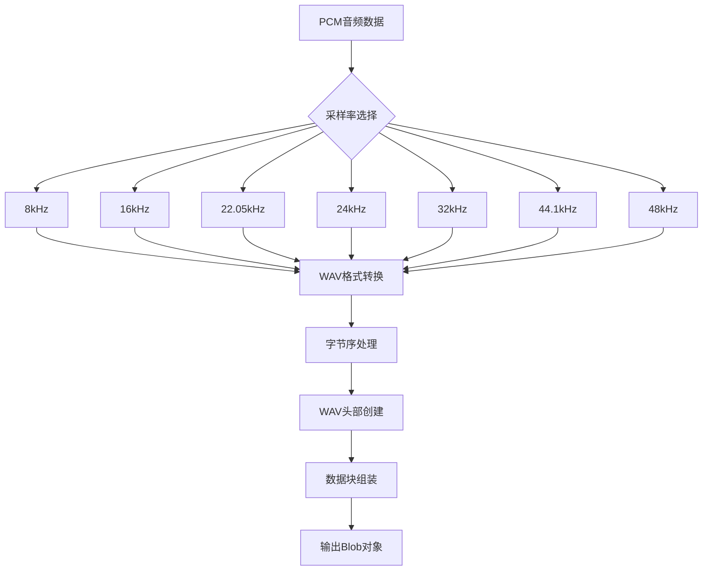
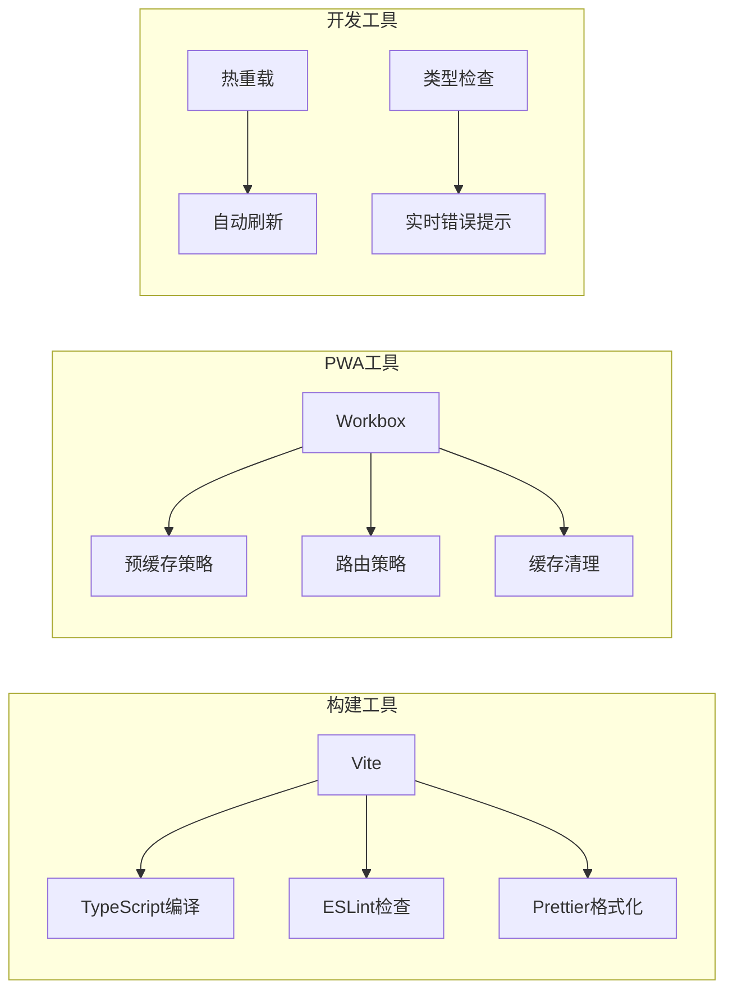

# 构建与运行指南

<cite>
**本文档引用的文件**
- [README.md](file://README.md)
- [package.json](file://package.json)
- [quasar.config.ts](file://quasar.config.ts)
- [docs/build-and-run.md](file://docs/build-and-run.md)
- [src/env.d.ts](file://src/env.d.ts)
- [src/boot/axios.ts](file://src/boot/axios.ts)
- [src/boot/mock.ts](file://src/boot/mock.ts)
- [src/boot/i18n.ts](file://src/boot/i18n.ts)
- [src/boot/media-encoder.ts](file://src/boot/media-encoder.ts)
- [src/boot/bus.ts](file://src/boot/bus.ts)
- [src/router/index.ts](file://src/router/index.ts)
- [src/App.vue](file://src/App.vue)
- [src-pwa/manifest.json](file://src-pwa/manifest.json)
- [src-pwa/custom-service-worker.ts](file://src-pwa/custom-service-worker.ts)
- [src/composables/useWsClient.ts](file://src/composables/useWsClient.ts)
</cite>

## 更新摘要
**所做更改**
- 新增完整的环境要求章节，包含 Node.js 版本要求和 pnpm 包管理器配置
- 更新开发服务器设置，明确端口配置和热重载特性
- 新增生产构建优化和 GitHub Pages 部署策略
- 添加代码质量检查和格式化工具使用指南
- 更新故障排除指南，包含 PWA 构建问题的详细解决方案
- 新增核心功能测试要点和常用命令速查表

## 目录
1. [简介](#简介)
2. [环境要求](#环境要求)
3. [安装依赖](#安装依赖)
4. [开发模式](#开发模式)
5. [生产构建](#生产构建)
6. [代码质量](#代码质量)
7. [故障排除指南](#故障排除指南)
8. [核心功能测试](#核心功能测试)
9. [常用命令速查](#常用命令速查)
10. [项目结构](#项目结构)
11. [核心组件](#核心组件)
12. [架构概览](#架构概览)
13. [详细组件分析](#详细组件分析)
14. [依赖关系分析](#依赖关系分析)
15. [性能考虑](#性能考虑)
16. [结论](#结论)
17. [附录](#附录)

## 简介

Le Bot 是一个基于 Vue 3 和 Quasar Framework 的前端平台，专为 le-bot 平台设计。该项目采用现代前端技术栈，支持 PWA（渐进式 Web 应用）部署，提供完整的聊天机器人交互体验。项目现已提供完整的构建和部署指南，涵盖从环境配置到生产部署的全流程。

## 环境要求

### Node.js 版本要求

项目支持以下 Node.js 版本，推荐使用 LTS 版本：

| 依赖 | 版本 | 说明 |
|------|------|------|
| Node.js | ^18 \|\| ^20 \|\| ^22 \|\| ^24 \|\| ^26 \|\| ^28 | 推荐 LTS（如 v22） |
| pnpm | 10.16.1（由 package.json `packageManager` 字段锁定） | 项目唯一包管理器 |

### 安装 Node.js（推荐 fnm）

```powershell
# 安装 fnm
winget install Schniz.fnm

# 刷新当前终端 PATH（解决 winget 安装后 fnm 不在 PATH 的问题）
$env:Path = [System.Environment]::GetEnvironmentVariable("Path","Machine") + ";" + [System.Environment]::GetEnvironmentVariable("Path","User")

# 安装 Node.js 22 LTS
fnm install 22

# 加载 fnm 环境到当前终端（必须执行，否则 node / pnpm 不可用）
fnm env --use-on-cd --shell powershell | Out-String | Invoke-Expression
```

> **重要**：`fnm use 22` 无法在未初始化的 PowerShell 会话中生效（会报 "We can't find the necessary environment variables"）。
> 必须改用 `fnm env --use-on-cd --shell powershell | Out-String | Invoke-Expression` 来加载 Node.js 环境。
> 建议将该命令加入 PowerShell Profile，避免每次手动执行。

### 激活 pnpm

> 确保已执行 1.1 中的 `fnm env` 命令，当前终端能识别 `node` 和 `corepack`。

```powershell
corepack enable
corepack prepare pnpm@10.16.1 --activate

# 验证
node -v    # v22.x.x
pnpm -v    # 10.16.1
```

**章节来源**
- [docs/build-and-run.md:3-41](file://docs/build-and-run.md#L3-L41)
- [package.json:56-62](file://package.json#L56-L62)

## 安装依赖

```powershell
cd D:\workspace\AIPETCLIENT\leBotChatClient\le-bot-frontend
pnpm install
```

安装完成后会自动运行 `quasar prepare`，在 `.quasar/` 目录生成 TypeScript 配置和类型声明。

若遇到 esbuild 构建脚本审批提示，运行：

```powershell
pnpm approve-builds esbuild
```

**章节来源**
- [docs/build-and-run.md:45-58](file://docs/build-and-run.md#L45-L58)

## 开发模式

```powershell
pnpm dev
# 等价于: npx quasar dev -m pwa
```

- 默认访问地址：**http://localhost:3001**（若端口被占用，Quasar 会自动切换到最近可用端口如 3002）
- 支持热模块替换（HMR），代码修改即时生效
- 集成 `vite-plugin-checker`，实时显示 TypeScript 和 ESLint 错误

### 开发环境后端地址

开发模式下，前端自动连接本地后端：

| 服务 | 地址 |
|------|------|
| HTTP API | `http://localhost:3000/api/v1` |
| WebSocket | `ws://localhost:3000` |

> 需确保 `le-bot-backend` 在本地 3000 端口运行，否则 API 和 WebSocket 调用会失败。

**章节来源**
- [docs/build-and-run.md:62-82](file://docs/build-and-run.md#L62-L82)
- [quasar.config.ts:142-146](file://quasar.config.ts#L142-L146)
- [src/boot/axios.ts:18](file://src/boot/axios.ts#L18)

## 生产构建

```powershell
pnpm build
# 等价于: npx quasar build -m pwa
```

构建产物输出到 `dist/pwa/` 目录。

### GitHub Pages 部署构建

```powershell
$env:DEPLOY_GITHUB_PAGE="1"; pnpm build
```

此模式会将资源 base 路径设为 `/le-bot-frontend/`，API 指向远程服务器 `https://cafuuchino.studio26f.org:10543`。

### 预览生产构建

```powershell
npx quasar serve dist/pwa
```

**章节来源**
- [docs/build-and-run.md:86-107](file://docs/build-and-run.md#L86-L107)
- [quasar.config.ts:38-106](file://quasar.config.ts#L38-L106)

## 代码质量

```powershell
# ESLint 检查
pnpm lint

# Prettier 格式化
pnpm format
```

**章节来源**
- [docs/build-and-run.md:111-119](file://docs/build-and-run.md#L111-L119)

## 故障排除指南

### PWA Service Worker 构建失败（workbox + esbuild）

**现象**：`quasar build -m pwa` 时 esbuild 报错：

```
Transforming destructuring to the configured target environment
("chrome115", "es2022", "firefox115", "safari14") is not supported yet
```

**原因**：workbox 包使用了解构语法，而 esbuild 无法将其降级到配置的目标环境。

**修复**：在 `quasar.config.ts` 的 `pwa` 配置中添加：

```ts
pwa: {
  workboxMode: 'InjectManifest',
  extendPWACustomSWConf(esbuildConf) {
    esbuildConf.target = 'es2022';
  },
},
```

**章节来源**
- [docs/build-and-run.md:125-146](file://docs/build-and-run.md#L125-L146)
- [quasar.config.ts:208-222](file://quasar.config.ts#L208-L222)

## 核心功能测试

| 功能 | 测试方法 | 前提条件 |
|------|----------|----------|
| 用户认证 | 登录/注册页面，验证 Token 持久化 | 后端运行在 localhost:3000 |
| WebSocket 连接 | DevTools → Network → WS 面板观察消息 | 后端运行 + 已登录 |
| 音频录制 | 点击录音按钮，浏览器请求麦克风权限 | 必须使用 localhost 或 HTTPS |
| 音频播放 | 发送语音后观察 AI 音频流式回复 | WebSocket 已连接 |
| 静音检测 | 录音时保持沉默 3 秒，观察自动停止 | 聊天会话进行中 |
| PWA 安装 | 浏览器地址栏出现安装图标 | HTTPS 或 localhost |

**章节来源**
- [docs/build-and-run.md:149-159](file://docs/build-and-run.md#L149-L159)

## 常用命令速查

| 命令 | 说明 |
|------|------|
| `pnpm install` | 安装依赖 |
| `pnpm dev` | 启动开发服务器（PWA 模式，默认端口 3001，占用时自动切换） |
| `pnpm build` | 生产构建（PWA） |
| `pnpm lint` | ESLint 代码检查 |
| `pnpm format` | Prettier 代码格式化 |
| `npx quasar serve dist/pwa` | 预览生产构建产物 |

**章节来源**
- [docs/build-and-run.md:162-172](file://docs/build-and-run.md#L162-L172)

## 项目结构

该项目采用标准的 Quasar CLI 项目结构，主要目录组织如下：



**图表来源**
- [quasar.config.ts:10-284](file://quasar.config.ts#L10-L284)
- [package.json:1-63](file://package.json#L1-L63)

**章节来源**
- [quasar.config.ts:10-284](file://quasar.config.ts#L10-L284)
- [package.json:1-63](file://package.json#L1-L63)

## 核心组件

### 环境配置系统

项目使用环境变量管理系统，通过 `quasar.config.ts` 和 `src/env.d.ts` 实现：



**图表来源**
- [quasar.config.ts:58-71](file://quasar.config.ts#L58-L71)
- [src/env.d.ts:3-11](file://src/env.d.ts#L3-L11)

### 引导模块系统

项目包含多个关键的引导模块，负责初始化各种服务：

| 引导模块 | 功能 | 依赖 |
|---------|------|------|
| axios | HTTP客户端配置 | LE_BOT_BACKEND_HTTP_BASE_URL |
| mock | Mock数据服务 | VITE_MOCK_ENABLED, VITE_MOCK_WS_ENABLED |
| i18n | 国际化支持 | 多语言资源 |
| media-encoder | 音频编码器 | extendable-media-recorder |
| bus | 事件总线 | Quasar EventBus |

**章节来源**
- [src/boot/axios.ts:18](file://src/boot/axios.ts#L18)
- [src/boot/mock.ts:4-12](file://src/boot/mock.ts#L4-L12)
- [src/boot/i18n.ts:23-27](file://src/boot/i18n.ts#L23-L27)
- [src/boot/media-encoder.ts:5-7](file://src/boot/media-encoder.ts#L5-L7)
- [src/boot/bus.ts:11-13](file://src/boot/bus.ts#L11-L13)

## 架构概览

### 应用启动流程



**图表来源**
- [src/App.vue:58-80](file://src/App.vue#L58-L80)
- [src/router/index.ts:19-33](file://src/router/index.ts#L19-L33)

### WebSocket通信架构



**图表来源**
- [src/composables/useWsClient.ts:29-103](file://src/composables/useWsClient.ts#L29-L103)

**章节来源**
- [src/App.vue:1-85](file://src/App.vue#L1-L85)
- [src/composables/useWsClient.ts:1-103](file://src/composables/useWsClient.ts#L1-L103)

## 详细组件分析

### PWA服务工作线程

项目实现了自定义的服务工作线程，支持离线缓存和智能回退：



**图表来源**
- [src-pwa/custom-service-worker.ts:18-54](file://src-pwa/custom-service-worker.ts#L18-L54)

### 音频处理管道

项目提供了完整的音频处理能力，支持多种采样率和格式转换：



**图表来源**
- [src/utils/audio.ts:1-47](file://src/utils/audio.ts#L1-L47)

**章节来源**
- [src-pwa/custom-service-worker.ts:1-55](file://src-pwa/custom-service-worker.ts#L1-L55)

### 国际化系统

项目采用Vue I18n实现多语言支持，支持类型安全的消息定义：

```mermaid
classDiagram
class I18nConfig {
+locale : string
+legacy : boolean
+messages : object
}
class MessageLanguages {
<<enumeration>>
"en-US"
}
class MessageSchema {
<<interface>>
+[key : string] : string
}
class I18nGlobal {
+t(path, data?) string
+te(key) boolean
+locale Ref
}
I18nConfig --> MessageLanguages : 定义
I18nConfig --> MessageSchema : 使用
I18nGlobal --> I18nConfig : 初始化
```

**图表来源**
- [src/boot/i18n.ts:23-33](file://src/boot/i18n.ts#L23-L33)

**章节来源**
- [src/boot/i18n.ts:1-34](file://src/boot/i18n.ts#L1-L34)

## 依赖关系分析

### 核心依赖矩阵

| 类别 | 包名 | 版本 | 用途 |
|------|------|------|------|
| 框架 | vue | ^3.5.28 | 响应式UI框架 |
| UI框架 | quasar | ^2.18.6 | Material Design组件 |
| 状态管理 | pinia | ^3.0.4 | 现代状态管理 |
| HTTP客户端 | axios | ^1.13.5 | API通信 |
| 国际化 | vue-i18n | ^11.2.8 | 多语言支持 |
| 路由 | vue-router | ^5.0.2 | 单页应用路由 |
| 缓存持久化 | pinia-plugin-persistedstate | ^4.7.1 | 状态持久化 |

### 构建工具链



**图表来源**
- [package.json:31-55](file://package.json#L31-L55)
- [quasar.config.ts:109-138](file://quasar.config.ts#L109-L138)

**章节来源**
- [package.json:17-30](file://package.json#L17-L30)
- [package.json:31-55](file://package.json#L31-L55)

## 性能考虑

### 构建优化策略

1. **目标浏览器兼容性**：支持 Chrome 115+, Firefox 115+, Safari 14+
2. **PWA优化**：使用Workbox实现智能缓存策略
3. **代码分割**：按需加载路由组件
4. **资源压缩**：生产环境自动压缩静态资源

### 运行时性能

- **响应式更新**：使用Vue 3的Composition API优化更新性能
- **懒加载**：图片和组件按需加载
- **内存管理**：及时清理WebSocket连接和定时器

## 结论

Le Bot 前端项目采用现代化的技术栈和最佳实践，提供了完整的PWA解决方案。项目结构清晰，模块化程度高，易于维护和扩展。通过合理的配置和优化，能够提供优秀的用户体验和开发效率。

新增的完整构建和部署指南涵盖了从环境配置到生产部署的全流程，包括Node.js版本要求、pnpm包管理器配置、开发服务器设置、生产构建优化、GitHub Pages部署策略等完整指导，为开发者提供了标准化的开发和部署流程。

## 附录

### 快速开始命令

```bash
# 安装依赖
pnpm install

# 开发模式
pnpm dev

# 生产构建
pnpm build

# 代码检查
pnpm lint

# 代码格式化
pnpm format
```

### 环境变量参考

| 变量名 | 默认值 | 说明 |
|--------|--------|------|
| LE_BOT_BACKEND_HTTP_BASE_URL | http://localhost:3000 | HTTP API基础URL |
| LE_BOT_BACKEND_WS_BASE_URL | ws://localhost:3000 | WebSocket基础URL |
| VITE_MOCK_ENABLED | false | 是否启用Mock服务 |
| VITE_MOCK_WS_ENABLED | false | 是否启用WS Mock |
| VUE_ROUTER_MODE | hash | 路由模式 |