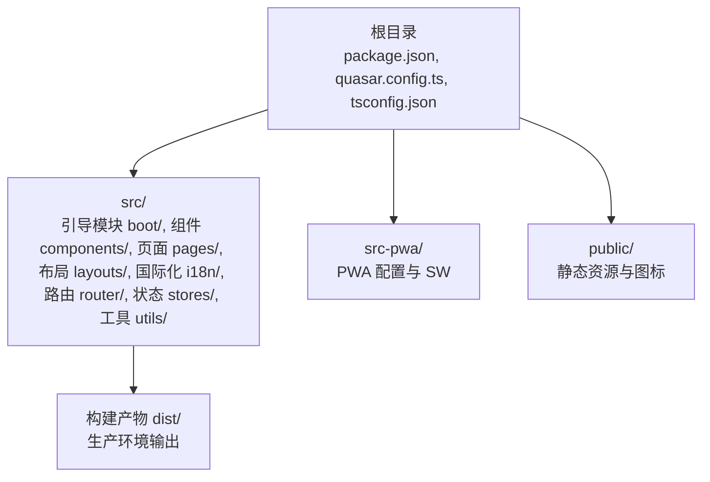
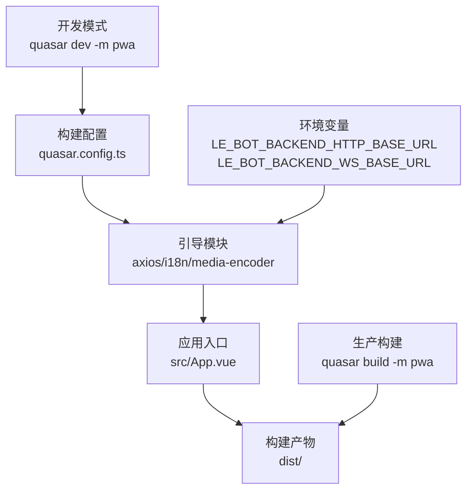
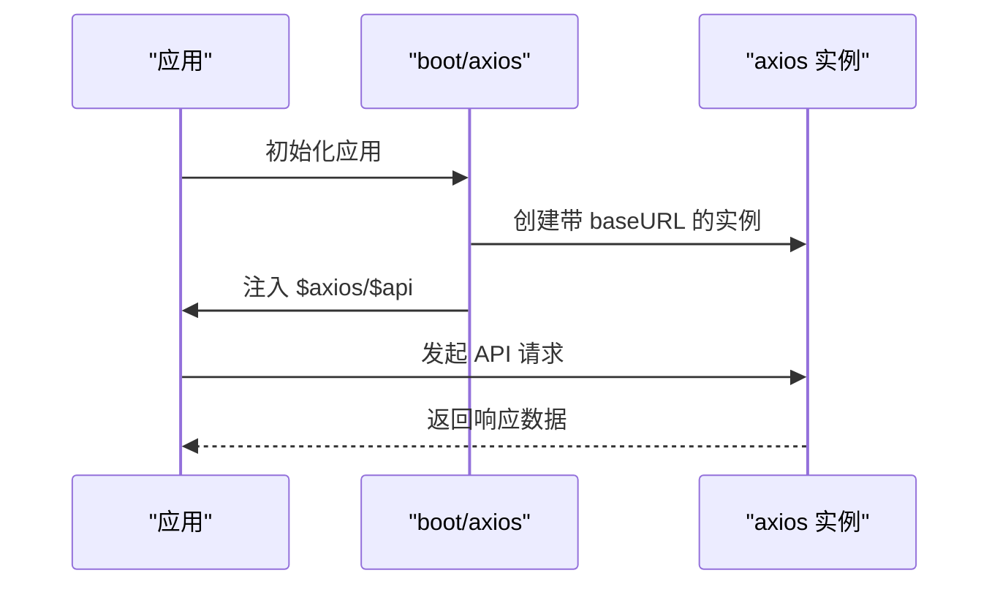
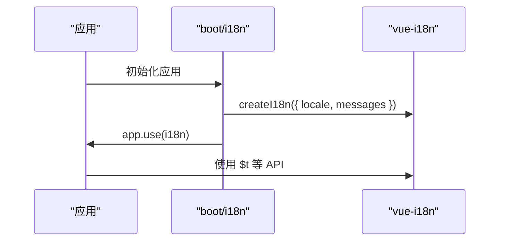
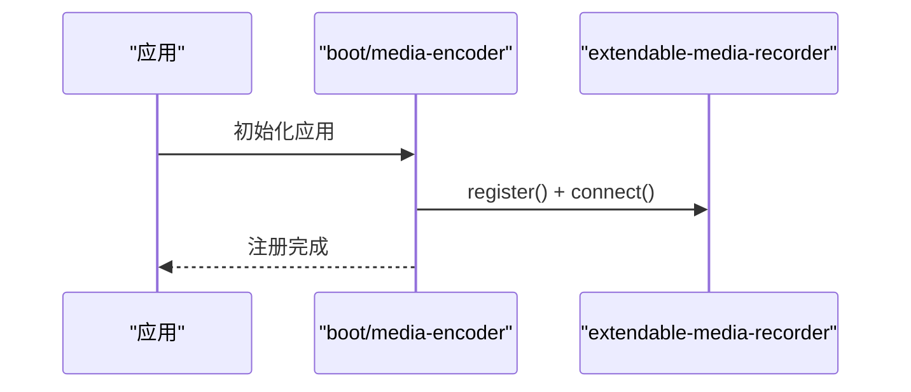
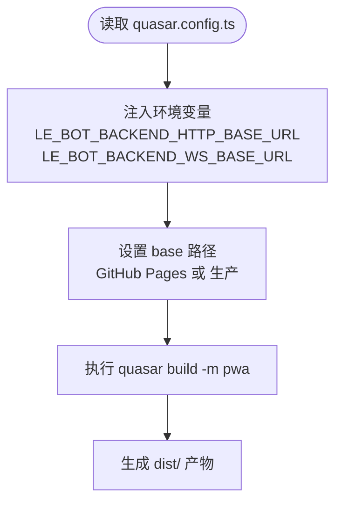
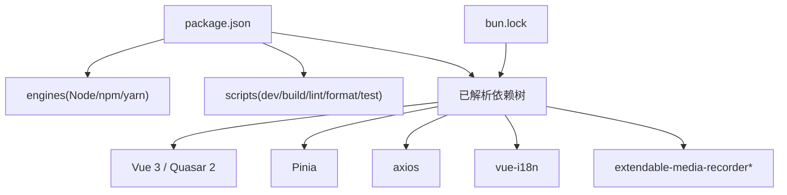

# 快速开始

<cite>
**本文引用的文件**
- [package.json](file://package.json)
- [README.md](file://README.md)
- [quasar.config.ts](file://quasar.config.ts)
- [tsconfig.json](file://tsconfig.json)
- [eslint.config.js](file://eslint.config.js)
- [.prettierrc.json](file://.prettierrc.json)
- [.editorconfig](file://.editorconfig)
- [bun.lock](file://bun.lock)
- [src/boot/axios.ts](file://src/boot/axios.ts)
- [src/boot/i18n.ts](file://src/boot/i18n.ts)
- [src/boot/media-encoder.ts](file://src/boot/media-encoder.ts)
</cite>

## 目录
1. [简介](#简介)
2. [项目结构](#项目结构)
3. [核心组件](#核心组件)
4. [架构总览](#架构总览)
5. [详细组件分析](#详细组件分析)
6. [依赖关系分析](#依赖关系分析)
7. [性能考虑](#性能考虑)
8. [故障排除指南](#故障排除指南)
9. [结论](#结论)
10. [附录](#附录)

## 简介
本指南面向新加入 Le Bot 前端项目的开发者，帮助你在最短时间内完成环境准备、依赖安装、开发服务器启动与生产构建，并提供常见问题排查与最佳实践建议。项目基于 Quasar CLI + Vite，使用 TypeScript 和 Vue 3，采用 Pinia 进行状态管理，支持 PWA 构建。

## 项目结构
- 根目录包含项目元信息与构建配置：package.json、quasar.config.ts、tsconfig.json、eslint.config.js、.prettierrc.json、.editorconfig 等。
- 源码位于 src/，包含 boot 引导模块、组件、页面、布局、国际化资源、路由与状态管理等。
- PWA 相关配置位于 src-pwa/。
- 公共静态资源位于 public/。

章节来源
- [package.json:1-61](file://package.json#L1-L61)
- [quasar.config.ts:1-278](file://quasar.config.ts#L1-L278)

## 核心组件
- 包管理与脚本
  - 支持 npm、yarn、pnpm；默认使用项目内声明的 packageManager（pnpm）。
  - 常用脚本：dev（开发）、build（生产构建）、lint（ESLint）、format（Prettier）、test（占位）。
- 构建与运行时配置
  - Quasar CLI + Vite；PWA 模式；目标浏览器与 Node 版本约束。
  - 开发服务器端口 3001，默认不自动打开浏览器。
- 启动项（Boot）
  - axios：全局注入 HTTP 客户端，自动拼接后端 API 基础路径。
  - i18n：Vue I18n 多语言初始化。
  - media-encoder：注册 Extendable Media Recorder 的 WAV 编码器。
- 类型系统
  - TypeScript 配置通过 tsconfig.json 继承 Quasar 提供的 tsconfig。

章节来源
- [package.json:9-16](file://package.json#L9-L16)
- [quasar.config.ts:140-144](file://quasar.config.ts#L140-L144)
- [quasar.config.ts:18](file://quasar.config.ts#L18)
- [src/boot/axios.ts:18](file://src/boot/axios.ts#L18)
- [src/boot/i18n.ts:23-27](file://src/boot/i18n.ts#L23-L27)
- [src/boot/media-encoder.ts:5-7](file://src/boot/media-encoder.ts#L5-L7)
- [tsconfig.json:1-3](file://tsconfig.json#L1-L3)

## 架构总览
下图展示了从开发到生产的典型流程，以及关键配置与启动项之间的关系。

图表来源
- [quasar.config.ts:108-136](file://quasar.config.ts#L108-L136)
- [quasar.config.ts:58-69](file://quasar.config.ts#L58-L69)
- [src/boot/axios.ts:18](file://src/boot/axios.ts#L18)

章节来源
- [quasar.config.ts:108-136](file://quasar.config.ts#L108-L136)
- [quasar.config.ts:58-69](file://quasar.config.ts#L58-L69)

## 详细组件分析

### 启动项：HTTP 客户端（axios）
- 功能
  - 创建带 baseURL 的 axios 实例，自动拼接 /api/v1 路径。
  - 将 $axios 与 $api 注入全局属性，便于在组件中直接使用。
- 环境变量
  - 通过 quasar.config.ts 的 env 注入后端地址，区分开发/生产/GitHub Pages 场景。
- 错误处理与 SSR 注意
  - 文档注释提示在 SSR 中避免跨请求污染全局实例，必要时将实例创建移至每个客户端作用域。

图表来源
- [src/boot/axios.ts:18](file://src/boot/axios.ts#L18)
- [quasar.config.ts:58-69](file://quasar.config.ts#L58-L69)

章节来源
- [src/boot/axios.ts:1-27](file://src/boot/axios.ts#L1-L27)
- [quasar.config.ts:58-69](file://quasar.config.ts#L58-L69)

### 启动项：国际化（i18n）
- 功能
  - 使用 vue-i18n 初始化多语言，设置 en-US 为默认语言。
  - 通过类型定义增强消息 schema 的类型安全。
- 资源加载
  - messages 从 src/i18n 导入，按模块化组织语言资源。

图表来源
- [src/boot/i18n.ts:23-27](file://src/boot/i18n.ts#L23-L27)

章节来源
- [src/boot/i18n.ts:1-34](file://src/boot/i18n.ts#L1-L34)

### 启动项：媒体编码器（media-encoder）
- 功能
  - 在应用启动时注册 Extendable Media Recorder，并连接 WAV 编码器。
- 用途
  - 为录音与音频处理提供基础能力。

图表来源
- [src/boot/media-encoder.ts:5-7](file://src/boot/media-encoder.ts#L5-L7)

章节来源
- [src/boot/media-encoder.ts:1-8](file://src/boot/media-encoder.ts#L1-L8)

### 构建与 PWA 配置
- 模式
  - 使用 quasar dev/build -m pwa 启动开发或生产构建。
- 环境变量注入
  - 通过 quasar.config.ts 的 env 字段注入后端 HTTP 与 WebSocket 基础地址，支持 GitHub Pages 与本地开发场景。
- 基础路径
  - 根据 DEPLOY_GITHUB_PAGE 或生产模式动态设置 vite.base，修复 PWA 图标与清单路径。
- 目标与严格模式
  - 目标浏览器与 Node 版本；TypeScript 严格模式开启。

图表来源
- [quasar.config.ts:58-69](file://quasar.config.ts#L58-L69)
- [quasar.config.ts:98-104](file://quasar.config.ts#L98-L104)
- [quasar.config.ts:139-137](file://quasar.config.ts#L139-L137)

章节来源
- [quasar.config.ts:58-69](file://quasar.config.ts#L58-L69)
- [quasar.config.ts:98-104](file://quasar.config.ts#L98-L104)
- [quasar.config.ts:139-137](file://quasar.config.ts#L139-L137)

## 依赖关系分析
- 包管理器
  - 项目声明了 engines：Node 18/20/22/24/26/28，npm ≥ 6.13.4，yarn ≥ 1.21.1；同时指定 packageManager 为 pnpm@10.16.1。
- 依赖锁定
  - 使用 bun.lock 记录依赖树，确保团队一致性。
- 关键依赖
  - Quasar 2、Vue 3、Pinia、axios、vue-i18n、extendable-media-recorder 系列等。

图表来源
- [package.json:54-59](file://package.json#L54-L59)
- [package.json:9-16](file://package.json#L9-L16)
- [bun.lock:1-45](file://bun.lock#L1-L45)

章节来源
- [package.json:54-59](file://package.json#L54-L59)
- [package.json:9-16](file://package.json#L9-L16)
- [bun.lock:1-45](file://bun.lock#L1-L45)

## 性能考虑
- 浏览器目标
  - 面向现代浏览器（Chrome 115+、Firefox 115+、Safari 14+），确保兼容性与性能平衡。
- 构建优化
  - 使用 Vite 与 Quasar 插件链，结合 TypeScript 严格模式与 ESLint 规则，减少运行时错误与体积隐患。
- PWA 与缓存
  - 通过 Workbox 注入 Manifest 与 Service Worker，注意在不同部署基路径下的资源路径修正。

章节来源
- [quasar.config.ts:71-74](file://quasar.config.ts#L71-L74)
- [quasar.config.ts:206-216](file://quasar.config.ts#L206-L216)

## 故障排除指南
- Node 版本不匹配
  - 症状：安装失败或构建报错。
  - 解决：根据 engines 要求安装 Node 18/20/22/24/26/28 中的一个版本。
- 包管理器选择
  - 症状：不同包管理器导致依赖不一致。
  - 解决：遵循 package.json 的 packageManager 指示使用 pnpm；如需使用 npm/yarn，请先清理 lock 文件并重新安装。
- 开发服务器无法访问
  - 症状：localhost:3001 无法打开。
  - 排查：确认 quasar.config.ts 的 devServer.port 未被占用；检查防火墙与代理设置。
- PWA 资源路径异常
  - 症状：图标或清单路径 404。
  - 解决：确保 DEPLOY_GITHUB_PAGE 或生产模式下 base 路径正确；查看 afterBuild 对 index.html 的路径修正逻辑。
- ESLint/Prettier 报错
  - 症状：格式或规则检查失败。
  - 解决：运行 yarn lint 或 npm run lint 修复；使用 yarn format 或 npm run format 统一格式；检查 .editorconfig 与 .prettierrc.json 设置。
- 启动项相关问题
  - axios：确认 LE_BOT_BACKEND_HTTP_BASE_URL 正确；若为 SSR/多实例场景，避免全局单例跨请求污染。
  - i18n：确认 messages 导入路径与语言文件存在。
  - media-encoder：确保浏览器支持 WebAssembly 与媒体录制 API。

章节来源
- [package.json:54-59](file://package.json#L54-L59)
- [quasar.config.ts:140-144](file://quasar.config.ts#L140-L144)
- [quasar.config.ts:44-56](file://quasar.config.ts#L44-L56)
- [eslint.config.js:1-91](file://eslint.config.js#L1-L91)
- [.prettierrc.json:1-5](file://.prettierrc.json#L1-L5)
- [.editorconfig:1-8](file://.editorconfig#L1-L8)
- [src/boot/axios.ts:18](file://src/boot/axios.ts#L18)
- [src/boot/i18n.ts:23-27](file://src/boot/i18n.ts#L23-L27)
- [src/boot/media-encoder.ts:5-7](file://src/boot/media-encoder.ts#L5-L7)

## 结论
按照本指南完成环境准备、依赖安装与开发启动后，你将能够：
- 成功运行开发服务器并进行热更新调试；
- 产出符合 PWA 标准的生产构建；
- 理解关键启动项与构建配置的作用；
- 快速定位并解决常见问题。

## 附录

### 快速开始步骤
- 克隆仓库（此处为概念性描述，不对应具体文件）
- 安装依赖
  - 使用 pnpm（推荐）：pnpm install
  - 或使用 npm：npm install
  - 或使用 yarn：yarn
- 启动开发服务器
  - quasar dev -m pwa
- 代码质量
  - Lint：yarn lint 或 npm run lint
  - 格式化：yarn format 或 npm run format
- 生产构建
  - quasar build -m pwa
- 配置与扩展
  - 参考 quasar.config.ts 与 README.md 中的“自定义配置”链接。

章节来源
- [README.md:5-41](file://README.md#L5-L41)
- [package.json:9-16](file://package.json#L9-L16)