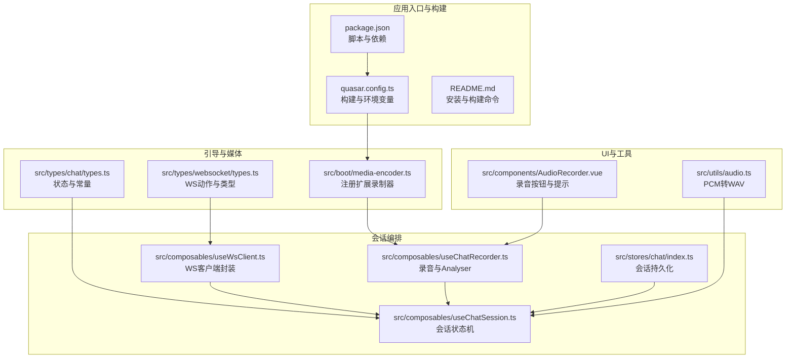
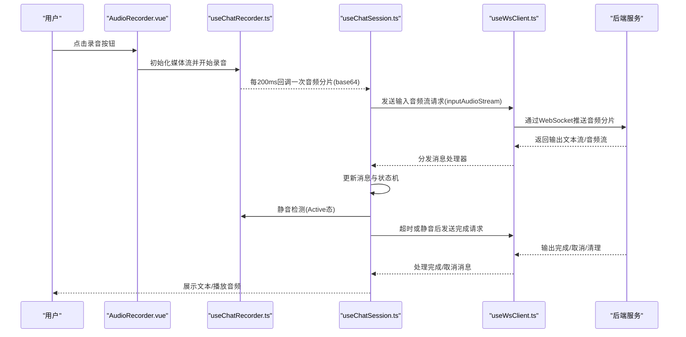
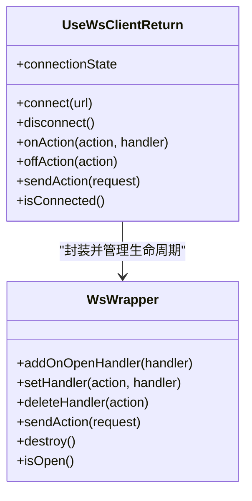
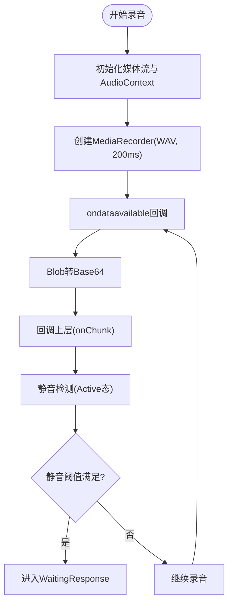
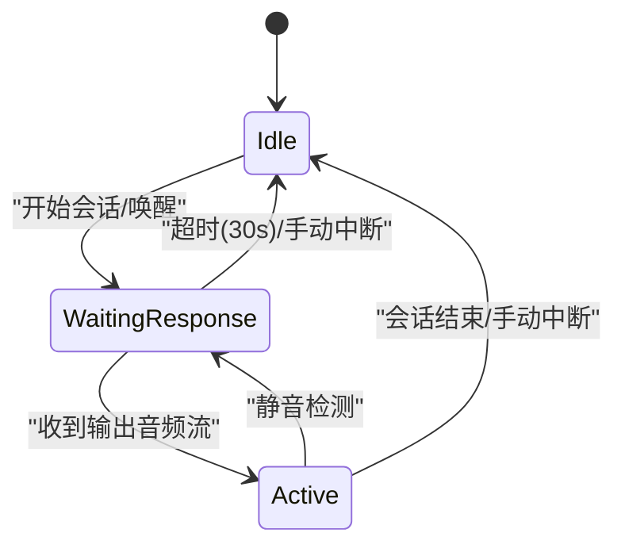
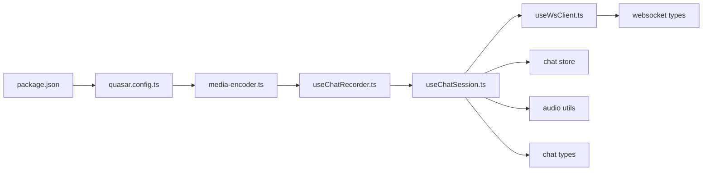

# 故障排除与FAQ

<cite>
**本文引用的文件**
- [README.md](file://README.md)
- [package.json](file://package.json)
- [quasar.config.ts](file://quasar.config.ts)
- [src/boot/media-encoder.ts](file://src/boot/media-encoder.ts)
- [src/components/AudioRecorder.vue](file://src/components/AudioRecorder.vue)
- [src/composables/useChatRecorder.ts](file://src/composables/useChatRecorder.ts)
- [src/composables/useWsClient.ts](file://src/composables/useWsClient.ts)
- [src/composables/useChatSession.ts](file://src/composables/useChatSession.ts)
- [src/utils/audio.ts](file://src/utils/audio.ts)
- [src/types/websocket/types.ts](file://src/types/websocket/types.ts)
- [src/types/chat/types.ts](file://src/types/chat/types.ts)
- [src/stores/chat/index.ts](file://src/stores/chat/index.ts)
</cite>

## 目录
1. [简介](#简介)
2. [项目结构](#项目结构)
3. [核心组件](#核心组件)
4. [架构总览](#架构总览)
5. [详细组件分析](#详细组件分析)
6. [依赖关系分析](#依赖关系分析)
7. [性能考虑](#性能考虑)
8. [故障排除指南](#故障排除指南)
9. [结论](#结论)
10. [附录](#附录)

## 简介
本文件面向Le Bot前端项目的开发者与运维人员，提供覆盖开发、测试、部署全生命周期的故障排除与常见问题解答（FAQ）。重点涵盖以下方面：
- 音频相关问题：录音初始化失败、音频质量异常、回放无声或卡顿、Web Audio上下文管理等
- 网络连接问题：WebSocket连接失败、断线重连、消息收发异常、后端地址配置错误
- 浏览器兼容性问题：媒体权限、扩展录制器注册、浏览器目标版本差异
- 错误代码与日志：WebSocket动作类型、错误响应结构、控制台输出定位
- 性能问题：录音与播放资源占用、内存泄漏检测、资源释放策略
- 用户反馈处理：问题分类、优先级、处理流程与升级建议
- 社区支持与报告模板：问题上报渠道、模板与升级指引

## 项目结构
前端基于Quasar Vite应用，采用Vue 3 + TypeScript + Pinia状态管理，结合Web Audio API与MediaRecorder实现语音对话全流程。

**图表来源**
- [quasar.config.ts:10-137](file://quasar.config.ts#L10-L137)
- [package.json:9-16](file://package.json#L9-L16)
- [src/boot/media-encoder.ts:1-8](file://src/boot/media-encoder.ts#L1-L8)
- [src/composables/useWsClient.ts:1-103](file://src/composables/useWsClient.ts#L1-L103)
- [src/composables/useChatRecorder.ts:1-148](file://src/composables/useChatRecorder.ts#L1-L148)
- [src/composables/useChatSession.ts:1-589](file://src/composables/useChatSession.ts#L1-L589)
- [src/stores/chat/index.ts:1-17](file://src/stores/chat/index.ts#L1-L17)
- [src/components/AudioRecorder.vue:1-113](file://src/components/AudioRecorder.vue#L1-L113)
- [src/utils/audio.ts:1-47](file://src/utils/audio.ts#L1-L47)
- [src/types/websocket/types.ts:1-226](file://src/types/websocket/types.ts#L1-L226)
- [src/types/chat/types.ts:1-96](file://src/types/chat/types.ts#L1-L96)

**章节来源**
- [README.md:1-41](file://README.md#L1-L41)
- [package.json:1-61](file://package.json#L1-L61)
- [quasar.config.ts:10-137](file://quasar.config.ts#L10-L137)

## 核心组件
- WebSocket客户端封装：提供连接状态、自动重连、事件注册与发送请求的能力，统一管理动作类型与回调队列。
- 录音与音频分析：使用扩展MediaRecorder与Web Audio API，生成200ms WAV分片，同时建立AnalyserNode进行静音检测。
- 会话状态机：定义Idle/WaitingResponse/Active三态，驱动录音、播放、静音检测与超时控制。
- 媒体编码器注册：在启动阶段注册扩展录制器，确保浏览器侧WAV编码可用。
- 工具函数：PCM到WAV转换，便于服务端交互与本地回放。

**章节来源**
- [src/composables/useWsClient.ts:1-103](file://src/composables/useWsClient.ts#L1-L103)
- [src/composables/useChatRecorder.ts:1-148](file://src/composables/useChatRecorder.ts#L1-L148)
- [src/composables/useChatSession.ts:1-589](file://src/composables/useChatSession.ts#L1-L589)
- [src/boot/media-encoder.ts:1-8](file://src/boot/media-encoder.ts#L1-L8)
- [src/utils/audio.ts:1-47](file://src/utils/audio.ts#L1-L47)

## 架构总览
下图展示从用户触发到服务器响应的关键路径，以及音频采集、传输与播放的闭环。

**图表来源**
- [src/components/AudioRecorder.vue:1-113](file://src/components/AudioRecorder.vue#L1-L113)
- [src/composables/useChatRecorder.ts:1-148](file://src/composables/useChatRecorder.ts#L1-L148)
- [src/composables/useChatSession.ts:1-589](file://src/composables/useChatSession.ts#L1-L589)
- [src/composables/useWsClient.ts:1-103](file://src/composables/useWsClient.ts#L1-L103)
- [src/types/websocket/types.ts:1-226](file://src/types/websocket/types.ts#L1-L226)

## 详细组件分析

### 组件A：WebSocket客户端封装（useWsClient）
- 功能要点
  - 连接状态：disconnected/connecting/connected
  - 自动重连：继承自底层包装类（由调用方传入URL）
  - 事件注册：支持在连接前注册回调，连接后批量应用
  - 请求发送：按动作类型序列化并发送
- 常见问题
  - 未连接发送请求：控制台警告，需先调用connect
  - 回调未生效：确认在connect之前是否已注册
  - URL错误：检查环境变量LE_BOT_BACKEND_WS_BASE_URL
- 诊断步骤
  - 查看连接状态与onOpen回调是否触发
  - 检查请求/响应动作映射是否匹配
  - 观察断线重连间隔与次数

**图表来源**
- [src/composables/useWsClient.ts:1-103](file://src/composables/useWsClient.ts#L1-L103)
- [src/types/websocket/types.ts:1-226](file://src/types/websocket/types.ts#L1-L226)

**章节来源**
- [src/composables/useWsClient.ts:1-103](file://src/composables/useWsClient.ts#L1-L103)
- [src/types/websocket/types.ts:1-226](file://src/types/websocket/types.ts#L1-L226)

### 组件B：录音与静音检测（useChatRecorder + AudioRecorder.vue）
- 功能要点
  - 使用扩展MediaRecorder录制WAV，200ms切片
  - 创建AudioContext与AnalyserNode用于RMS静音检测
  - 提供initMedia/startRecording/releaseMedia完整生命周期管理
- 常见问题
  - 录音初始化失败：检查媒体设备权限与约束参数
  - 静音检测无效：确认AnalyserNode已正确连接且采样间隔合理
  - 回调未触发：检查onChunk注册时机与状态机流转
- 诊断步骤
  - 在控制台观察录音状态与chunk回调频率
  - 检查音频上下文状态与AnalyserNode节点
  - 验证WAV MIME类型与分片大小

**图表来源**
- [src/composables/useChatRecorder.ts:1-148](file://src/composables/useChatRecorder.ts#L1-L148)
- [src/components/AudioRecorder.vue:1-113](file://src/components/AudioRecorder.vue#L1-L113)
- [src/types/chat/types.ts:75-96](file://src/types/chat/types.ts#L75-L96)

**章节来源**
- [src/composables/useChatRecorder.ts:1-148](file://src/composables/useChatRecorder.ts#L1-L148)
- [src/components/AudioRecorder.vue:1-113](file://src/components/AudioRecorder.vue#L1-L113)
- [src/types/chat/types.ts:75-96](file://src/types/chat/types.ts#L75-L96)

### 组件C：会话状态机（useChatSession）
- 功能要点
  - 三态模型：Idle → WaitingResponse → Active
  - 超时控制：WaitingResponse超过30秒自动结束
  - 中断机制：手动中断或语音中断（cancelOutput）
  - 消息聚合：用户/助手消息对象，累积音频分片与文本
- 常见问题
  - 状态不更新：检查WebSocket事件处理器是否注册
  - 超时不触发：确认waitingResponseSince时间戳与定时器
  - 音频合并失败：检查音频分片到Blob转换与URL回收
- 诊断步骤
  - 观察状态流转日志与定时器执行
  - 检查消息对象字段与conversationId更新
  - 校验播放器完成回调与静音检测停止逻辑

**图表来源**
- [src/composables/useChatSession.ts:1-589](file://src/composables/useChatSession.ts#L1-L589)
- [src/types/chat/types.ts:11-19](file://src/types/chat/types.ts#L11-L19)

**章节来源**
- [src/composables/useChatSession.ts:1-589](file://src/composables/useChatSession.ts#L1-L589)
- [src/types/chat/types.ts:11-19](file://src/types/chat/types.ts#L11-L19)

### 组件D：媒体编码器注册（media-encoder）
- 功能要点
  - 启动时注册扩展MediaRecorder与WAV编码器
  - 保证浏览器侧WAV录制能力可用
- 常见问题
  - 录音无声音：确认注册是否成功
  - MIME类型不支持：检查浏览器对audio/wav的支持
- 诊断步骤
  - 查看启动日志与注册结果
  - 在控制台验证MediaRecorder.mimeType

**章节来源**
- [src/boot/media-encoder.ts:1-8](file://src/boot/media-encoder.ts#L1-L8)

### 组件E：PCM到WAV工具（pcmToWav）
- 功能要点
  - 将PCM数据与WAV头拼接为可播放的Blob
  - 支持采样率、声道数、位深配置
- 常见问题
  - 生成WAV无法播放：检查头字段与字节序
  - 数据长度不一致：确认PCM长度与计算一致
- 诊断步骤
  - 对比生成头部字段与标准WAV格式
  - 验证Blob类型与播放器兼容性

**章节来源**
- [src/utils/audio.ts:1-47](file://src/utils/audio.ts#L1-L47)

## 依赖关系分析
- 构建与运行
  - Quasar配置决定PWA模式、目标浏览器、环境变量注入与构建产物路径
  - 包管理脚本提供开发、构建、格式化与校验命令
- 媒体与音频
  - extendable-media-recorder与WAV编码器提供浏览器侧录音与编码
  - Web Audio API负责静音检测与音频分析
- 状态与通信
  - Pinia持久化存储会话ID，避免刷新丢失
  - WebSocket动作类型与响应结构统一，便于调试与扩展

**图表来源**
- [package.json:9-16](file://package.json#L9-L16)
- [quasar.config.ts:10-137](file://quasar.config.ts#L10-L137)
- [src/boot/media-encoder.ts:1-8](file://src/boot/media-encoder.ts#L1-L8)
- [src/composables/useChatRecorder.ts:1-148](file://src/composables/useChatRecorder.ts#L1-L148)
- [src/composables/useChatSession.ts:1-589](file://src/composables/useChatSession.ts#L1-L589)
- [src/composables/useWsClient.ts:1-103](file://src/composables/useWsClient.ts#L1-L103)
- [src/stores/chat/index.ts:1-17](file://src/stores/chat/index.ts#L1-L17)
- [src/utils/audio.ts:1-47](file://src/utils/audio.ts#L1-L47)
- [src/types/websocket/types.ts:1-226](file://src/types/websocket/types.ts#L1-L226)
- [src/types/chat/types.ts:1-96](file://src/types/chat/types.ts#L1-L96)

**章节来源**
- [package.json:1-61](file://package.json#L1-L61)
- [quasar.config.ts:10-137](file://quasar.config.ts#L10-L137)

## 性能考虑
- 录音与播放
  - 200ms分片降低延迟但增加CPU占用，可根据设备性能调整
  - 避免在Active态重复创建播放器实例，复用当前turn实例
- 内存与资源
  - 及时释放MediaStream与AnalyserNode，销毁AudioContext
  - 会话结束后回收所有Object URL，防止内存泄漏
- 网络
  - 合理设置断线重连基期，避免频繁抖动
  - 控制消息发送速率，避免拥塞

[本节为通用指导，无需特定文件来源]

## 故障排除指南

### 一、音频相关问题
- 症状：录音按钮点击无反应或报错
  - 排查要点
    - 检查媒体权限与getUserMedia约束（采样率、声道、降噪等）
    - 确认扩展录制器已注册（audio/wav可用）
    - 观察控制台错误与通知组件提示
  - 解决方案
    - 在浏览器设置中授予麦克风权限
    - 确保在mounted阶段初始化媒体流
    - 如需更严格的约束，参考录音组件默认参数

- 症状：录音有声音但播放无声
  - 排查要点
    - 检查音频分片是否正确转为Base64并回调
    - 确认播放器实例与回调链路正常
    - 验证WAV头部与Blob类型
  - 解决方案
    - 在会话处理器中打印分片与URL创建日志
    - 使用工具函数将分片合并为WAV后播放

- 症状：静音检测不灵敏或无效
  - 排查要点
    - 确认AnalyserNode已连接且采样间隔合理
    - 检查RMS阈值与连续静音计数配置
    - 观察Active态是否启动了静音检测
  - 解决方案
    - 调整静音检测参数（阈值、采样间隔、连续次数）
    - 在状态流转时显式start/stop静音检测

- 症状：长时间录音后内存增长
  - 排查要点
    - 是否及时releaseMedia与关闭AudioContext
    - 是否在会话结束时回收Object URL
  - 解决方案
    - 在disconnect/destroy中统一释放资源
    - 使用浏览器性能面板监控内存峰值

**章节来源**
- [src/components/AudioRecorder.vue:1-113](file://src/components/AudioRecorder.vue#L1-L113)
- [src/composables/useChatRecorder.ts:1-148](file://src/composables/useChatRecorder.ts#L1-L148)
- [src/composables/useChatSession.ts:1-589](file://src/composables/useChatSession.ts#L1-L589)
- [src/utils/audio.ts:1-47](file://src/utils/audio.ts#L1-L47)
- [src/types/chat/types.ts:66-73](file://src/types/chat/types.ts#L66-L73)

### 二、网络连接问题
- 症状：WebSocket无法连接或频繁断开
  - 排查要点
    - 检查LE_BOT_BACKEND_WS_BASE_URL环境变量
    - 确认后端WebSocket端点与鉴权参数
    - 观察连接状态变化与自动重连行为
  - 解决方案
    - 在开发环境使用本地WS地址，在生产环境使用HTTPS WSS
    - 校验后端证书与跨域配置

- 症状：消息收发异常或顺序错乱
  - 排查要点
    - 检查动作类型与响应映射是否一致
    - 确认请求ID与响应关联
  - 解决方案
    - 在处理器中打印动作与ID，核对配对
    - 保持处理器注册顺序与连接时机一致

**章节来源**
- [quasar.config.ts:58-69](file://quasar.config.ts#L58-L69)
- [src/composables/useWsClient.ts:1-103](file://src/composables/useWsClient.ts#L1-L103)
- [src/types/websocket/types.ts:1-226](file://src/types/websocket/types.ts#L1-L226)

### 三、浏览器兼容性问题
- 症状：页面白屏或功能缺失
  - 排查要点
    - 检查目标浏览器版本（ES2022、Firefox 115、Chrome 115、Safari 14）
    - 确认PWA元标签与路径修正
  - 解决方案
    - 升级到受支持的浏览器版本
    - 按构建钩子修正PWA图标与清单路径

**章节来源**
- [quasar.config.ts:71-74](file://quasar.config.ts#L71-L74)
- [quasar.config.ts:44-56](file://quasar.config.ts#L44-L56)

### 四、错误代码与日志分析
- WebSocket动作类型
  - 常用动作：establishConnection、updateConfig、inputAudioStream、outputAudioStream、outputTextStream、cancelOutput、chatComplete
  - 响应结构：success字段区分成功/失败；失败时包含错误数组
- 日志定位
  - 连接建立、配置更新、输出流与完成、取消输出、聊天完成等均有控制台日志
  - 录音与播放过程中的关键节点均打印状态

**章节来源**
- [src/types/websocket/types.ts:1-226](file://src/types/websocket/types.ts#L1-L226)
- [src/composables/useChatSession.ts:100-238](file://src/composables/useChatSession.ts#L100-L238)

### 五、性能问题诊断与资源占用
- 录音与播放
  - 200ms分片带来更低延迟，但CPU占用上升；可适当增大分片以降低开销
  - 避免重复创建播放器实例，减少上下文切换
- 内存泄漏
  - 释放MediaStream与AnalyserNode，关闭AudioContext
  - 会话结束后遍历消息列表回收Object URL
- 资源占用分析
  - 使用浏览器性能面板记录CPU、内存与网络
  - 关注MediaRecorder与AudioContext生命周期

**章节来源**
- [src/composables/useChatRecorder.ts:101-116](file://src/composables/useChatRecorder.ts#L101-L116)
- [src/composables/useChatSession.ts:442-447](file://src/composables/useChatSession.ts#L442-L447)

### 六、用户反馈问题分类、优先级与处理流程
- 分类
  - 功能缺陷：录音/播放/静音检测异常
  - 配置问题：环境变量、后端地址、浏览器版本
  - 性能问题：卡顿、耗电、内存增长
- 优先级
  - P0：无法连接/录音无声音/崩溃
  - P1：功能不稳定/偶发异常
  - P2：体验优化/小问题
- 处理流程
  - 收集日志与截图
  - 复现步骤与环境信息
  - 提交问题单并跟踪进度

[本节为通用指导，无需特定文件来源]

### 七、社区支持与问题报告模板
- 社区支持渠道
  - GitHub Issues（仓库根目录包含工作流与示例脚本）
- 问题报告模板
  - 环境信息：操作系统、浏览器版本、Node版本
  - 复现步骤：具体操作与预期/实际结果
  - 日志与截图：控制台输出、网络面板、性能面板
  - 附加信息：设备型号、麦克风类型、网络状况
- 升级指南
  - 使用推荐的Node版本范围
  - 安装依赖后执行构建与预检脚本

**章节来源**
- [README.md:1-41](file://README.md#L1-L41)
- [package.json:54-58](file://package.json#L54-L58)

## 结论
通过系统化的组件分析与故障排除流程，可以快速定位并解决Le Bot前端在音频、网络与浏览器兼容方面的常见问题。建议在开发与发布前完成环境校验、资源释放与性能评估，并建立标准化的问题报告与升级流程，持续提升用户体验与稳定性。

[本节为总结性内容，无需特定文件来源]

## 附录

### A. 常用命令与配置
- 开发与构建
  - 安装依赖：yarn 或 npm install
  - 启动开发：quasar dev
  - 构建生产：quasar build
  - 代码规范：yarn lint / yarn format
- 环境变量
  - LE_BOT_BACKEND_HTTP_BASE_URL / LE_BOT_BACKEND_WS_BASE_URL
- 目标浏览器
  - ES2022、Firefox 115、Chrome 115、Safari 14

**章节来源**
- [README.md:5-41](file://README.md#L5-L41)
- [quasar.config.ts:58-69](file://quasar.config.ts#L58-L69)
- [quasar.config.ts:71-74](file://quasar.config.ts#L71-L74)

### B. 关键文件索引
- WebSocket类型与动作
  - [src/types/websocket/types.ts:1-226](file://src/types/websocket/types.ts#L1-L226)
- 会话状态与常量
  - [src/types/chat/types.ts:1-96](file://src/types/chat/types.ts#L1-L96)
- 会话编排
  - [src/composables/useChatSession.ts:1-589](file://src/composables/useChatSession.ts#L1-L589)
- WebSocket客户端
  - [src/composables/useWsClient.ts:1-103](file://src/composables/useWsClient.ts#L1-L103)
- 录音与静音检测
  - [src/composables/useChatRecorder.ts:1-148](file://src/composables/useChatRecorder.ts#L1-L148)
  - [src/components/AudioRecorder.vue:1-113](file://src/components/AudioRecorder.vue#L1-L113)
- 媒体编码器注册
  - [src/boot/media-encoder.ts:1-8](file://src/boot/media-encoder.ts#L1-L8)
- PCM到WAV工具
  - [src/utils/audio.ts:1-47](file://src/utils/audio.ts#L1-L47)
- 聊天状态存储
  - [src/stores/chat/index.ts:1-17](file://src/stores/chat/index.ts#L1-L17)