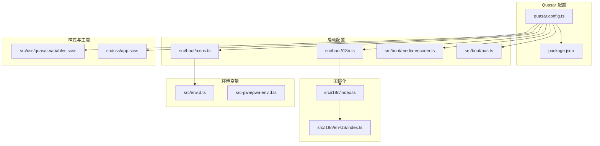
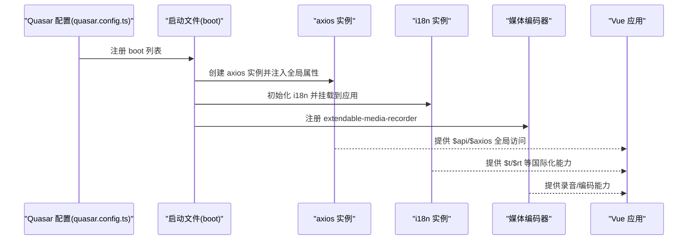
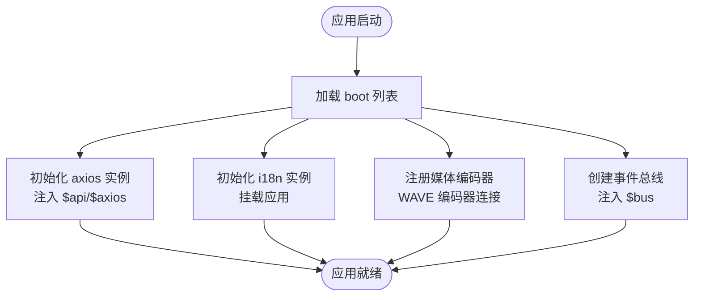
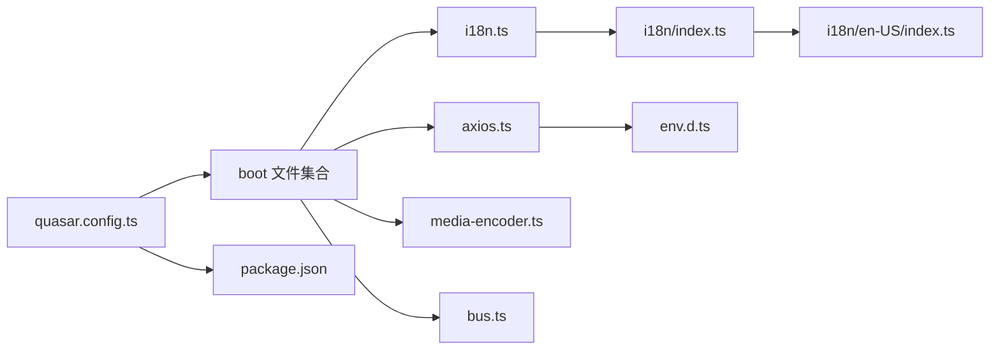

# 全局配置管理

<cite>
**本文引用的文件**
- [quasar.config.ts](file://quasar.config.ts)
- [package.json](file://package.json)
- [src/boot/axios.ts](file://src/boot/axios.ts)
- [src/boot/i18n.ts](file://src/boot/i18n.ts)
- [src/boot/media-encoder.ts](file://src/boot/media-encoder.ts)
- [src/boot/bus.ts](file://src/boot/bus.ts)
- [src/css/quasar.variables.scss](file://src/css/quasar.variables.scss)
- [src/css/app.scss](file://src/css/app.scss)
- [src/env.d.ts](file://src/env.d.ts)
- [src-pwa/pwa-env.d.ts](file://src-pwa/pwa-env.d.ts)
- [src/i18n/index.ts](file://src/i18n/index.ts)
- [src/i18n/en-US/index.ts](file://src/i18n/en-US/index.ts)
</cite>

## 目录
1. [简介](#简介)
2. [项目结构](#项目结构)
3. [核心组件](#核心组件)
4. [架构总览](#架构总览)
5. [详细组件分析](#详细组件分析)
6. [依赖关系分析](#依赖关系分析)
7. [性能考量](#性能考量)
8. [故障排查指南](#故障排查指南)
9. [结论](#结论)
10. [附录](#附录)

## 简介
本文件系统性梳理 Le Bot 前端项目的全局配置管理，覆盖 Quasar 框架配置策略（主题定制、插件与构建）、应用启动配置（axios 实例、国际化、媒体编码器初始化）、CSS 变量与主题机制、环境变量与配置文件组织、以及构建与开发服务器设置。文档同时提供配置项详解与修改指南，并解释配置对应用性能与用户体验的影响。

## 项目结构
Le Bot 前端采用 Quasar CLI + Vite 的现代化前端工程化方案，核心配置集中在 quasar.config.ts 中，启动阶段通过 boot 文件注入全局能力（axios、i18n、媒体编码器、事件总线），样式体系由 SCSS 变量与全局样式构成，国际化资源集中于 src/i18n 目录，环境变量类型在 src/env.d.ts 与 src-pwa/pwa-env.d.ts 中声明。

图表来源
- [quasar.config.ts:10-18](file://quasar.config.ts#L10-L18)
- [src/boot/axios.ts:18](file://src/boot/axios.ts#L18)
- [src/boot/i18n.ts:23-27](file://src/boot/i18n.ts#L23-L27)
- [src/boot/media-encoder.ts:5-7](file://src/boot/media-encoder.ts#L5-L7)
- [src/boot/bus.ts:11-13](file://src/boot/bus.ts#L11-L13)
- [src/css/quasar.variables.scss:15-25](file://src/css/quasar.variables.scss#L15-L25)
- [src/i18n/index.ts:3-5](file://src/i18n/index.ts#L3-L5)
- [src/i18n/en-US/index.ts:1](file://src/i18n/en-US/index.ts#L1)
- [src/env.d.ts:3-9](file://src/env.d.ts#L3-L9)
- [src-pwa/pwa-env.d.ts:2-6](file://src-pwa/pwa-env.d.ts#L2-L6)

章节来源
- [quasar.config.ts:10-18](file://quasar.config.ts#L10-L18)
- [package.json:9-16](file://package.json#L9-L16)

## 核心组件
- 启动配置清单：在 quasar.config.ts 的 boot 数组中注册 axios、bus、i18n、media-encoder 四个启动文件，确保应用初始化时完成全局依赖注入。
- 插件与图标：extras 包含 MDA、Roboto 字体与 Material Icons；framework.plugins 启用 Dialog、Notify。
- 构建与部署：根据 DEPLOY_GITHUB_PAGE 环境变量动态修正 PWA 资源路径与 Vite base；定义后置构建钩子修复 meta 标签路径；设置目标浏览器与 Node 版本；启用 TypeScript 严格模式。
- 开发服务器：默认端口 3001，不自动打开浏览器窗口。
- PWA 与 SSR：PWA 使用 InjectManifest 模式；SSR 生产端口 3000，保留 render 中间件。

章节来源
- [quasar.config.ts:18](file://quasar.config.ts#L18)
- [quasar.config.ts:24-35](file://quasar.config.ts#L24-L35)
- [quasar.config.ts:161](file://quasar.config.ts#L161)
- [quasar.config.ts:44-56](file://quasar.config.ts#L44-L56)
- [quasar.config.ts:58-69](file://quasar.config.ts#L58-L69)
- [quasar.config.ts:71-74](file://quasar.config.ts#L71-L74)
- [quasar.config.ts:76-80](file://quasar.config.ts#L76-L80)
- [quasar.config.ts:82](file://quasar.config.ts#L82)
- [quasar.config.ts:98-104](file://quasar.config.ts#L98-L104)
- [quasar.config.ts:140-144](file://quasar.config.ts#L140-L144)
- [quasar.config.ts:206-216](file://quasar.config.ts#L206-L216)
- [quasar.config.ts:182-203](file://quasar.config.ts#L182-L203)

## 架构总览
下图展示从 Quasar 配置到启动文件、再到运行时全局对象的装配流程，以及国际化与媒体编码器的初始化路径。

图表来源
- [quasar.config.ts:18](file://quasar.config.ts#L18)
- [src/boot/axios.ts:21-24](file://src/boot/axios.ts#L21-L24)
- [src/boot/i18n.ts:31-33](file://src/boot/i18n.ts#L31-L33)
- [src/boot/media-encoder.ts:5-7](file://src/boot/media-encoder.ts#L5-L7)

## 详细组件分析

### Quasar 配置策略
- 主题定制
  - SCSS 变量：通过 src/css/quasar.variables.scss 定义主色、次色、强调色、深色系等，覆盖 Quasar 默认变量，实现品牌化视觉统一。
  - 全局样式：src/css/app.scss 作为全局样式入口，可在此扩展自定义样式或覆盖组件样式。
- 插件配置
  - extras：启用 MDA、Roboto 字体与 Material Icons，兼顾图标与字体一致性。
  - framework.plugins：启用 Dialog、Notify，提升交互反馈体验。
- 构建选项
  - 后置构建钩子 afterBuild：在生产构建后修正 PWA 图标与 manifest 路径，适配 GitHub Pages 或自定义部署路径。
  - extendViteConf：根据 DEPLOY_GITHUB_PAGE 或非开发环境设置 Vite base，保证静态资源正确加载。
  - env：在不同环境注入后端 HTTP/WS 基础地址，便于本地与线上切换。
  - target：限定浏览器与 Node 版本，确保兼容性与性能平衡。
  - TypeScript：开启严格模式，提升类型安全。
  - vueRouterMode：使用 hash 模式，简化部署与路由行为。
  - vitePlugins：集成 @intlify/vue-i18n 与 vite-plugin-checker，分别用于国际化资源与 ESLint/Vue 类型检查。
- 开发服务器
  - 端口 3001，默认不自动打开浏览器，减少开发干扰。
- PWA 与 SSR
  - PWA：InjectManifest 模式，结合 Workbox 工具链进行离线缓存与更新策略。
  - SSR：保留 render 中间件，便于服务端渲染场景。

章节来源
- [quasar.config.ts:24-35](file://quasar.config.ts#L24-L35)
- [quasar.config.ts:161](file://quasar.config.ts#L161)
- [quasar.config.ts:44-56](file://quasar.config.ts#L44-L56)
- [quasar.config.ts:98-104](file://quasar.config.ts#L98-L104)
- [quasar.config.ts:58-69](file://quasar.config.ts#L58-L69)
- [quasar.config.ts:71-74](file://quasar.config.ts#L71-L74)
- [quasar.config.ts:76-80](file://quasar.config.ts#L76-L80)
- [quasar.config.ts:82](file://quasar.config.ts#L82)
- [quasar.config.ts:140-144](file://quasar.config.ts#L140-L144)
- [quasar.config.ts:206-216](file://quasar.config.ts#L206-L216)
- [quasar.config.ts:182-203](file://quasar.config.ts#L182-L203)

### 应用启动配置组织
- axios 实例配置
  - 在 src/boot/axios.ts 中创建带 baseURL 的 axios 实例，并将其注入为 $api 与 $axios 全局属性，便于组件直接调用。
  - baseURL 来源于环境变量 LE_BOT_BACKEND_HTTP_BASE_URL，后端 WS 地址来自 LE_BOT_BACKEND_WS_BASE_URL。
- 国际化设置
  - 在 src/boot/i18n.ts 中使用 vue-i18n 创建 i18n 实例，locale 设为 'en-US'，legacy 关闭，消息资源来自 src/i18n/index.ts。
  - src/i18n/index.ts 导出 en-US 资源，en-US/index.ts 提供完整多层级消息键值。
- 媒体编码器初始化
  - 在 src/boot/media-encoder.ts 中注册 extendable-media-recorder，并连接 WAVE 编码器，为录音与音频处理提供基础能力。
- 事件总线
  - 在 src/boot/bus.ts 中创建类型化的 EventBus，提供抽屉控制等跨组件通信能力，并注入为 $bus。

图表来源
- [quasar.config.ts:18](file://quasar.config.ts#L18)
- [src/boot/axios.ts:21-24](file://src/boot/axios.ts#L21-L24)
- [src/boot/i18n.ts:31-33](file://src/boot/i18n.ts#L31-L33)
- [src/boot/media-encoder.ts:5-7](file://src/boot/media-encoder.ts#L5-L7)
- [src/boot/bus.ts:15-17](file://src/boot/bus.ts#L15-L17)

章节来源
- [src/boot/axios.ts:18](file://src/boot/axios.ts#L18)
- [src/boot/axios.ts:21-24](file://src/boot/axios.ts#L21-L24)
- [src/boot/i18n.ts:23-27](file://src/boot/i18n.ts#L23-L27)
- [src/boot/i18n.ts:31-33](file://src/boot/i18n.ts#L31-L33)
- [src/boot/media-encoder.ts:5-7](file://src/boot/media-encoder.ts#L5-L7)
- [src/boot/bus.ts:11-13](file://src/boot/bus.ts#L11-L13)
- [src/boot/bus.ts:15-17](file://src/boot/bus.ts#L15-L17)
- [src/i18n/index.ts:3-5](file://src/i18n/index.ts#L3-L5)
- [src/i18n/en-US/index.ts:1](file://src/i18n/en-US/index.ts#L1)

### CSS 变量系统与主题定制机制
- 变量覆盖：在 src/css/quasar.variables.scss 中重定义 $primary、$secondary、$accent、$dark、$dark-page、$positive、$negative、$info、$warning 等变量，实现品牌色彩体系。
- 组件样式：全局样式入口 src/css/app.scss 可用于补充自定义样式或覆盖组件默认样式，保持一致的视觉风格。
- 主题联动：Quasar 框架会基于这些变量生成对应的颜色类与样式，确保按钮、标签、通知等组件遵循统一主题。

章节来源
- [src/css/quasar.variables.scss:15-25](file://src/css/quasar.variables.scss#L15-L25)
- [src/css/app.scss:1-2](file://src/css/app.scss#L1-L2)

### 环境变量管理与配置文件组织
- 运行时环境变量
  - LE_BOT_BACKEND_HTTP_BASE_URL：HTTP 后端基础地址，用于 axios 实例的 baseURL。
  - LE_BOT_BACKEND_WS_BASE_URL：WebSocket 后端基础地址，用于实时通信。
  - NODE_ENV：Node 环境标识。
  - VUE_ROUTER_MODE、VUE_ROUTER_BASE：路由模式与基础路径，可在运行时调整。
- PWA 环境变量
  - SERVICE_WORKER_FILE、PWA_FALLBACK_HTML、PWA_SERVICE_WORKER_REGEX：PWA 相关文件与正则配置。
- 类型声明
  - src/env.d.ts 与 src-pwa/pwa-env.d.ts 提供 TypeScript 对上述环境变量的类型约束，避免拼写错误与运行时异常。

章节来源
- [src/env.d.ts:3-9](file://src/env.d.ts#L3-L9)
- [src-pwa/pwa-env.d.ts:2-6](file://src-pwa/pwa-env.d.ts#L2-L6)
- [quasar.config.ts:58-69](file://quasar.config.ts#L58-L69)

### 构建配置与开发服务器设置
- 构建脚本
  - package.json 中定义了 dev/build 脚本，分别调用 quasar dev -m pwa 与 quasar build -m pwa，确保以 PWA 模式运行与打包。
- 开发服务器
  - quasar.config.ts 中 devServer.port 设置为 3001，open 默认关闭，减少开发时的自动弹窗干扰。
- 构建优化
  - extendViteConf 动态设置 base，afterBuild 修正 PWA 资源路径，确保部署后静态资源正确解析。
  - TypeScript 严格模式与 ESLint/Vue 类型检查插件提升代码质量与稳定性。

章节来源
- [package.json:13-15](file://package.json#L13-L15)
- [quasar.config.ts:140-144](file://quasar.config.ts#L140-L144)
- [quasar.config.ts:98-104](file://quasar.config.ts#L98-L104)
- [quasar.config.ts:44-56](file://quasar.config.ts#L44-L56)
- [quasar.config.ts:76-80](file://quasar.config.ts#L76-L80)

## 依赖关系分析
- 启动文件依赖
  - axios.ts 依赖 axios 与环境变量，向应用注入 $axios 与 $api。
  - i18n.ts 依赖 vue-i18n 与 src/i18n 资源，向应用注入 i18n 能力。
  - media-encoder.ts 依赖 extendable-media-recorder 与 extendable-media-recorder-wav-encoder，提供录音编码能力。
  - bus.ts 依赖 quasar 的 EventBus，提供跨组件通信。
- Quasar 配置耦合
  - quasar.config.ts 统一管理 boot、plugins、构建与开发服务器，是全局配置的核心枢纽。
- 国际化资源
  - src/i18n/index.ts 汇总各语言资源，en-US/index.ts 提供具体键值，形成层次化消息结构。

图表来源
- [quasar.config.ts:18](file://quasar.config.ts#L18)
- [src/boot/axios.ts:18](file://src/boot/axios.ts#L18)
- [src/boot/i18n.ts:23-27](file://src/boot/i18n.ts#L23-L27)
- [src/boot/media-encoder.ts:5-7](file://src/boot/media-encoder.ts#L5-L7)
- [src/boot/bus.ts:11-13](file://src/boot/bus.ts#L11-L13)
- [src/i18n/index.ts:3-5](file://src/i18n/index.ts#L3-L5)
- [src/i18n/en-US/index.ts:1](file://src/i18n/en-US/index.ts#L1)
- [src/env.d.ts:3-9](file://src/env.d.ts#L3-L9)
- [package.json:13-15](file://package.json#L13-L15)

章节来源
- [quasar.config.ts:18](file://quasar.config.ts#L18)
- [src/boot/axios.ts:18](file://src/boot/axios.ts#L18)
- [src/boot/i18n.ts:23-27](file://src/boot/i18n.ts#L23-L27)
- [src/boot/media-encoder.ts:5-7](file://src/boot/media-encoder.ts#L5-L7)
- [src/boot/bus.ts:11-13](file://src/boot/bus.ts#L11-L13)
- [src/i18n/index.ts:3-5](file://src/i18n/index.ts#L3-L5)
- [src/i18n/en-US/index.ts:1](file://src/i18n/en-US/index.ts#L1)
- [src/env.d.ts:3-9](file://src/env.d.ts#L3-L9)
- [package.json:13-15](file://package.json#L13-L15)

## 性能考量
- 构建与部署
  - afterBuild 修正 PWA 资源路径，避免因 Vite base 与 Quasar PWA 插件冲突导致的资源 404，提升首屏加载稳定性。
  - extendViteConf 动态设置 base，减少静态资源回退与重定向开销。
- 浏览器兼容
  - target 指定现代浏览器版本，配合严格 TypeScript 与 ESLint 检查，降低运行时错误概率，间接提升性能与可靠性。
- 路由模式
  - 使用 hash 模式简化部署与兼容性，避免 history 模式在某些服务器上的重定向问题。
- 插件与图标
  - 精简 extras 与 plugins，仅引入必要图标与交互组件，减少初始包体积与渲染压力。

[本节为通用性能建议，无需特定文件引用]

## 故障排查指南
- axios 实例无法访问
  - 确认 LE_BOT_BACKEND_HTTP_BASE_URL 是否在运行环境中正确设置，且 baseURL 以 /api/v1 结尾。
  - 检查 src/boot/axios.ts 是否已注入 $api 与 $axios。
- 国际化不生效
  - 确认 locale 是否为 'en-US'，messages 是否正确导入。
  - 检查 src/i18n/index.ts 与 src/i18n/en-US/index.ts 的键值是否完整。
- 媒体编码器初始化失败
  - 确认 extendable-media-recorder 与 extendable-media-recorder-wav-encoder 已安装，且 media-encoder.ts 正常执行。
- PWA 资源路径错误
  - 检查 DEPLOY_GITHUB_PAGE 环境变量与 afterBuild 逻辑，确认 HTML 与 manifest 路径已被修正。
- 开发服务器端口占用
  - 修改 quasar.config.ts 中 devServer.port 或停止占用端口的进程。

章节来源
- [src/boot/axios.ts:18](file://src/boot/axios.ts#L18)
- [src/boot/axios.ts:21-24](file://src/boot/axios.ts#L21-L24)
- [src/boot/i18n.ts:23-27](file://src/boot/i18n.ts#L23-L27)
- [src/boot/i18n.ts:31-33](file://src/boot/i18n.ts#L31-L33)
- [src/boot/media-encoder.ts:5-7](file://src/boot/media-encoder.ts#L5-L7)
- [quasar.config.ts:44-56](file://quasar.config.ts#L44-L56)
- [quasar.config.ts:140-144](file://quasar.config.ts#L140-L144)

## 结论
本项目通过 quasar.config.ts 将主题、插件、构建与开发服务器统一管理，借助 boot 文件在启动阶段完成 axios、i18n、媒体编码器与事件总线的注入，形成清晰的全局配置体系。配合 SCSS 变量与国际化资源的模块化组织，以及严格的环境变量类型声明，既保障了开发效率，也提升了运行时的稳定性与可维护性。按需调整构建与部署策略，可进一步优化性能与用户体验。

[本节为总结性内容，无需特定文件引用]

## 附录

### 配置项速查与修改指南
- 主题颜色
  - 修改位置：src/css/quasar.variables.scss
  - 影响范围：所有使用 Quasar 颜色变量的组件
- 插件与图标
  - 修改位置：quasar.config.ts 的 extras 与 framework.plugins
  - 影响范围：UI 交互与图标显示
- 构建与部署
  - 修改位置：quasar.config.ts 的 build.env、extendViteConf、afterBuild
  - 影响范围：静态资源路径、后端接口地址、部署基路径
- 开发服务器
  - 修改位置：quasar.config.ts 的 devServer
  - 影响范围：本地开发体验
- 国际化
  - 修改位置：src/i18n/index.ts 与 src/i18n/en-US/index.ts
  - 影响范围：界面文案与提示信息
- 媒体编码器
  - 修改位置：src/boot/media-encoder.ts
  - 影响范围：录音与音频处理功能
- 环境变量
  - 类型声明：src/env.d.ts、src-pwa/pwa-env.d.ts
  - 运行时赋值：LE_BOT_BACKEND_HTTP_BASE_URL、LE_BOT_BACKEND_WS_BASE_URL、NODE_ENV、VUE_ROUTER_MODE、VUE_ROUTER_BASE

章节来源
- [src/css/quasar.variables.scss:15-25](file://src/css/quasar.variables.scss#L15-L25)
- [quasar.config.ts:24-35](file://quasar.config.ts#L24-L35)
- [quasar.config.ts:161](file://quasar.config.ts#L161)
- [quasar.config.ts:58-69](file://quasar.config.ts#L58-L69)
- [quasar.config.ts:98-104](file://quasar.config.ts#L98-L104)
- [quasar.config.ts:44-56](file://quasar.config.ts#L44-L56)
- [quasar.config.ts:140-144](file://quasar.config.ts#L140-L144)
- [src/i18n/index.ts:3-5](file://src/i18n/index.ts#L3-L5)
- [src/i18n/en-US/index.ts:1](file://src/i18n/en-US/index.ts#L1)
- [src/boot/media-encoder.ts:5-7](file://src/boot/media-encoder.ts#L5-L7)
- [src/env.d.ts:3-9](file://src/env.d.ts#L3-L9)
- [src-pwa/pwa-env.d.ts:2-6](file://src-pwa/pwa-env.d.ts#L2-L6)