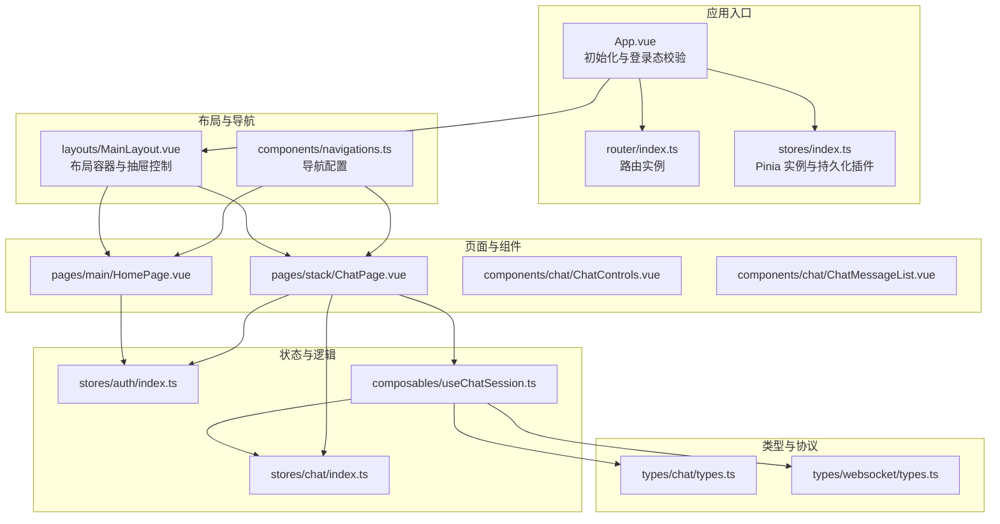
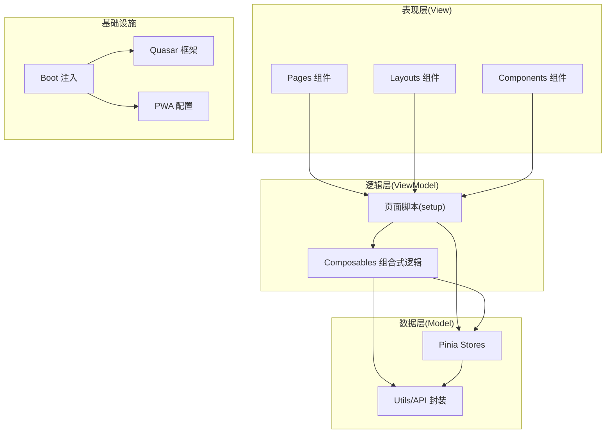
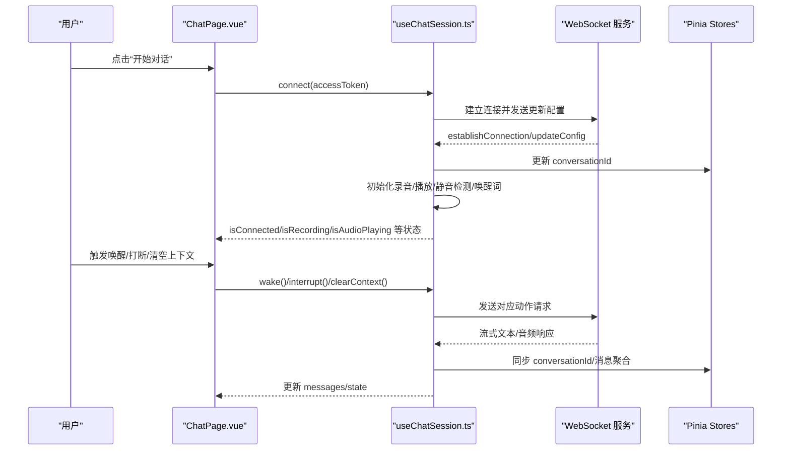
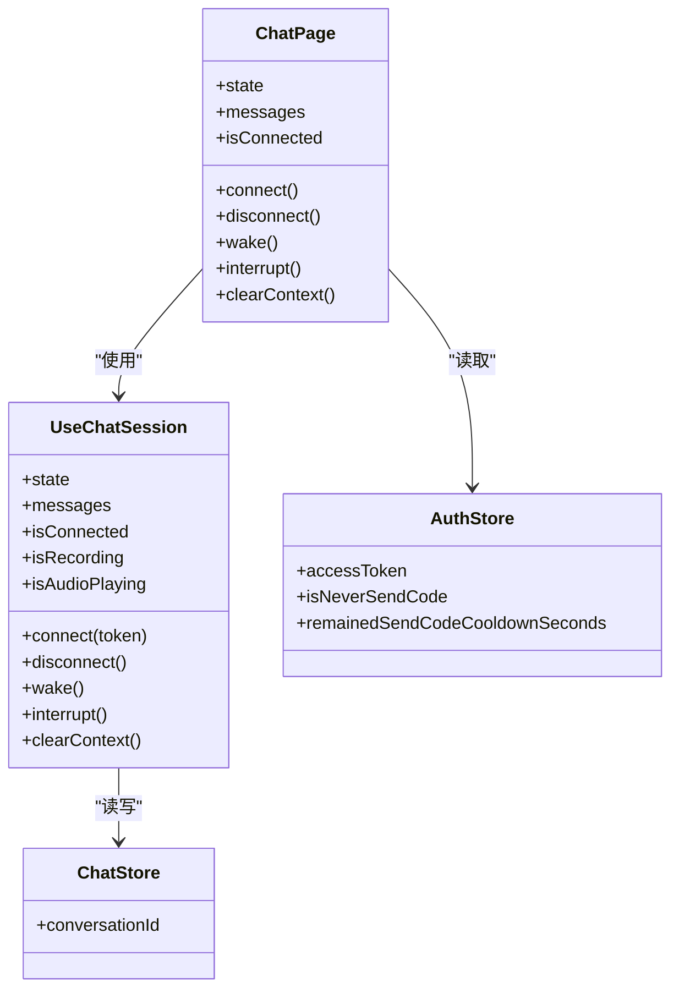
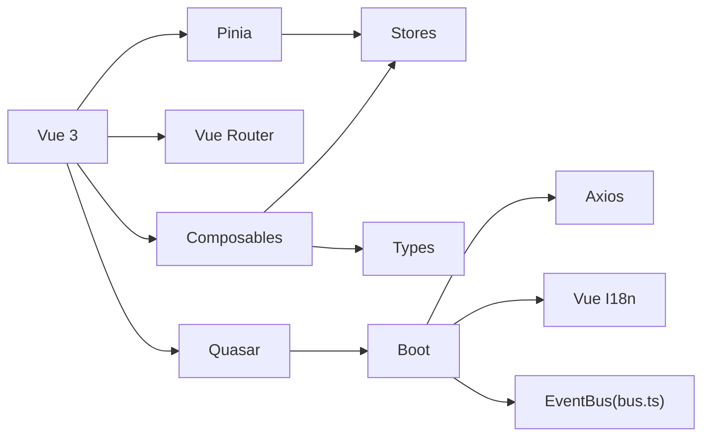

# 整体架构概览

<cite>
**本文引用的文件**
- [package.json](file://package.json)
- [quasar.config.ts](file://quasar.config.ts)
- [src\App.vue](file://src\App.vue)
- [src\router\index.ts](file://src\router\index.ts)
- [src\stores\index.ts](file://src\stores\index.ts)
- [src\stores\auth\index.ts](file://src\stores\auth\index.ts)
- [src\stores\chat\index.ts](file://src\stores\chat\index.ts)
- [src\composables\useChatSession.ts](file://src\composables\useChatSession.ts)
- [src\layouts\MainLayout.vue](file://src\layouts\MainLayout.vue)
- [src\components\navigations.ts](file://src\components\navigations.ts)
- [src\pages\main\HomePage.vue](file://src\pages\main\HomePage.vue)
- [src\pages\stack\ChatPage.vue](file://src\pages\stack\ChatPage.vue)
- [src\types\chat\types.ts](file://src\types\chat\types.ts)
- [src\types\websocket\types.ts](file://src\types\websocket\types.ts)
- [src\boot\bus.ts](file://src\boot\bus.ts)
</cite>

## 目录
1. [引言](#引言)
2. [项目结构](#项目结构)
3. [核心组件](#核心组件)
4. [架构总览](#架构总览)
5. [详细组件分析](#详细组件分析)
6. [依赖分析](#依赖分析)
7. [性能考量](#性能考量)
8. [故障排查指南](#故障排查指南)
9. [结论](#结论)
10. [附录](#附录)

## 引言
本文件为 Le Bot 前端项目的整体架构概览文档，聚焦于基于 Vue 3 + Quasar + Pinia 的现代前端架构设计。文档从 MVVM 架构模式出发，阐释 Model（模型）- View（视图）- ViewModel（视图模型）的分离原则；说明组件化与模块化组织方式；解析技术栈选择理由（Vue 3 Composition API、Quasar UI 框架、Pinia 状态管理）；给出系统边界与分层职责；并提供架构决策记录与权衡考虑。最后通过多幅架构图展示主要组件间的依赖关系与数据流向。

## 项目结构
项目采用按功能域划分的模块化组织方式，核心目录与职责如下：
- src/boot：应用启动阶段注入的全局能力（如 i18n、axios、事件总线、媒体编码器等）
- src/router：路由配置与历史模式选择
- src/stores：Pinia 状态仓库（按业务域拆分，如 auth、chat、device、profile、settings）
- src/composables：可复用的组合式逻辑（useChatSession 等）
- src/layouts：布局容器与抽屉、页眉、页脚等
- src/pages：页面级组件（按主/堆叠两种布局组织）
- src/components：可复用 UI 组件（认证、聊天、设置等）
- src/types：类型定义（聊天状态机、WebSocket 协议、音频常量等）
- src/utils：工具函数（API 封装、设备、账户、校验等）
- src-pwa：PWA 相关配置与服务工作线程
- quasar.config.ts：Quasar CLI 配置（构建、开发服务器、插件、PWA、Electron 等）

图表来源
- [src\App.vue:1-85](file://src\App.vue#L1-L85)
- [src\router\index.ts:1-38](file://src\router\index.ts#L1-L38)
- [src\stores\index.ts:1-36](file://src\stores\index.ts#L1-L36)
- [src\layouts\MainLayout.vue:1-51](file://src\layouts\MainLayout.vue#L1-L51)
- [src\components\navigations.ts:1-95](file://src\components\navigations.ts#L1-L95)
- [src\pages\main\HomePage.vue:1-54](file://src\pages\main\HomePage.vue#L1-L54)
- [src\pages\stack\ChatPage.vue:1-179](file://src\pages\stack\ChatPage.vue#L1-L179)
- [src\composables\useChatSession.ts:1-589](file://src\composables\useChatSession.ts#L1-L589)
- [src\stores\auth\index.ts:1-35](file://src\stores\auth\index.ts#L1-L35)
- [src\stores\chat\index.ts:1-17](file://src\stores\chat\index.ts#L1-L17)
- [src\types\chat\types.ts:1-96](file://src\types\chat\types.ts#L1-L96)
- [src\types\websocket\types.ts:1-226](file://src\types\websocket\types.ts#L1-L226)

章节来源
- [package.json:1-61](file://package.json#L1-L61)
- [quasar.config.ts:1-278](file://quasar.config.ts#L1-L278)

## 核心组件
- 应用入口与初始化：App.vue 在挂载时进行访问令牌校验，并异步拉取设备与用户资料，确保登录态一致与主题应用生效。
- 路由系统：router/index.ts 支持内存历史（SSR）、哈希历史与 HTML5 历史三种模式，配合 quasar.config.ts 的构建配置实现部署路径与环境变量注入。
- 状态管理：stores/index.ts 创建 Pinia 实例并启用持久化插件，按业务域拆分 store（auth、chat、device、profile、settings），实现跨组件共享与本地持久化。
- 组合式逻辑：useChatSession.ts 是会话编排的核心，封装 WebSocket 连接、录音/播放、静音检测、唤醒词监听、消息聚合与状态机转换，向页面暴露统一 API。
- 页面与布局：MainLayout.vue 提供多区域路由视图（头部、左侧/右侧抽屉、内容区、底部），结合 bus.ts 事件总线实现抽屉开合控制；Home/Chat 页面分别承载首页与聊天交互。
- 类型与协议：types/chat/types.ts 定义聊天状态机与消息结构；types/websocket/types.ts 定义 WebSocket 动作与请求/响应类型，保证前后端通信契约清晰。

章节来源
- [src\App.vue:1-85](file://src\App.vue#L1-L85)
- [src\router\index.ts:1-38](file://src\router\index.ts#L1-L38)
- [src\stores\index.ts:1-36](file://src\stores\index.ts#L1-L36)
- [src\composables\useChatSession.ts:1-589](file://src\composables\useChatSession.ts#L1-L589)
- [src\layouts\MainLayout.vue:1-51](file://src\layouts\MainLayout.vue#L1-L51)
- [src\boot\bus.ts:1-18](file://src\boot\bus.ts#L1-L18)
- [src\types\chat\types.ts:1-96](file://src\types\chat\types.ts#L1-L96)
- [src\types\websocket\types.ts:1-226](file://src\types\websocket\types.ts#L1-L226)

## 架构总览
本项目采用 MVVM 架构模式：
- Model（模型）：Pinia stores（auth、chat、device、profile、settings）与后端 API 工具封装，负责数据获取、变更与持久化。
- View（视图）：Vue 组件（pages、layouts、components），负责渲染与用户交互。
- ViewModel（视图模型）：组合式逻辑（composables）与页面脚本（setup），协调模型与视图，处理业务流程与状态转换。

系统边界与分层职责：
- 表现层：pages 与 components，负责 UI 渲染与用户交互。
- 逻辑层：composables 与页面脚本，负责业务编排与状态机转换。
- 数据层：stores 与 utils/api，负责状态管理与网络请求。
- 基础设施：boot 注入（i18n、axios、bus、media-encoder）、Quasar 框架与 PWA 配置。

图表来源
- [src\stores\index.ts:1-36](file://src\stores\index.ts#L1-L36)
- [src\composables\useChatSession.ts:1-589](file://src\composables\useChatSession.ts#L1-L589)
- [src\pages\stack\ChatPage.vue:1-179](file://src\pages\stack\ChatPage.vue#L1-L179)
- [src\boot\bus.ts:1-18](file://src\boot\bus.ts#L1-L18)
- [quasar.config.ts:1-278](file://quasar.config.ts#L1-L278)

## 详细组件分析

### MVVM 架构在项目中的应用
- 视图（View）：ChatPage.vue 作为聊天页面，绑定 useChatSession 返回的状态与方法，渲染连接状态、消息列表与控制面板。
- 视图模型（ViewModel）：useChatSession.ts 将复杂业务（WS 连接、录音/播放、静音检测、唤醒词、状态机）抽象为统一接口，页面仅需调用 connect/wake/interrupt 等方法。
- 模型（Model）：auth 与 chat stores 提供访问令牌与会话标识的持久化存储；utils/api 封装后端接口；types 定义协议与状态。

图表来源
- [src\pages\stack\ChatPage.vue:1-179](file://src\pages\stack\ChatPage.vue#L1-L179)
- [src\composables\useChatSession.ts:1-589](file://src\composables\useChatSession.ts#L1-L589)
- [src\types\websocket\types.ts:1-226](file://src\types\websocket\types.ts#L1-L226)
- [src\types\chat\types.ts:1-96](file://src\types\chat\types.ts#L1-L96)
- [src\stores\chat\index.ts:1-17](file://src\stores\chat\index.ts#L1-L17)

章节来源
- [src\pages\stack\ChatPage.vue:1-179](file://src\pages\stack\ChatPage.vue#L1-L179)
- [src\composables\useChatSession.ts:1-589](file://src\composables\useChatSession.ts#L1-L589)
- [src\types\websocket\types.ts:1-226](file://src\types\websocket\types.ts#L1-L226)
- [src\types\chat\types.ts:1-96](file://src\types\chat\types.ts#L1-L96)
- [src\stores\chat\index.ts:1-17](file://src\stores\chat\index.ts#L1-L17)

### 组件化设计与模块化组织
- 页面级组件：HomePage.vue、ChatPage.vue 分别承载主布局与堆叠布局下的页面职责，按需注入 store 与 i18n。
- 可复用组件：ChatControls.vue、ChatMessageList.vue、ChatMessageItem.vue 等，封装聊天交互与消息展示。
- 布局与导航：MainLayout.vue 提供多区域路由视图；navigations.ts 提供导航项配置，支持国际化子路径。
- 抽象与解耦：useChatSession.ts 将录音、播放、静音检测、唤醒词、WS 通信等能力下沉为组合式逻辑，页面仅关注 UI 与交互。

图表来源
- [src\pages\stack\ChatPage.vue:1-179](file://src\pages\stack\ChatPage.vue#L1-L179)
- [src\composables\useChatSession.ts:1-589](file://src\composables\useChatSession.ts#L1-L589)
- [src\stores\chat\index.ts:1-17](file://src\stores\chat\index.ts#L1-L17)
- [src\stores\auth\index.ts:1-35](file://src\stores\auth\index.ts#L1-L35)

章节来源
- [src\pages\main\HomePage.vue:1-54](file://src\pages\main\HomePage.vue#L1-L54)
- [src\pages\stack\ChatPage.vue:1-179](file://src\pages\stack\ChatPage.vue#L1-L179)
- [src\components\navigations.ts:1-95](file://src\components\navigations.ts#L1-L95)
- [src\layouts\MainLayout.vue:1-51](file://src\layouts\MainLayout.vue#L1-L51)

### 技术栈选择与权衡
- Vue 3 + Composition API：提供更好的逻辑复用（composables）、更清晰的类型推断与更小的包体积；与 TypeScript 结合良好，适合复杂交互场景。
- Quasar 框架：提供丰富的 UI 组件与主题系统，内置暗色模式、通知、对话框等插件，降低移动端与桌面端适配成本；通过 quasar.config.ts 精细配置构建与插件。
- Pinia：相比 Vuex 更轻量、TypeScript 友好、组合式 API 更贴近 Vue 3 设计；结合持久化插件实现跨页面状态保持。
- PWA：通过 Workbox 与 Quasar PWA 模式，提升离线体验与加载性能，便于部署到不同路径的静态站点。

章节来源
- [package.json:17-30](file://package.json#L17-L30)
- [quasar.config.ts:146-162](file://quasar.config.ts#L146-L162)
- [quasar.config.ts:205-216](file://quasar.config.ts#L205-L216)
- [src\stores\index.ts:1-36](file://src\stores\index.ts#L1-L36)

### 系统边界与职责划分
- 边界内：前端应用、Quasar UI、Pinia 状态、Vue Router、PWA 与构建配置。
- 边界外：后端 API（HTTP/WS）、浏览器原生能力（Web Audio、MediaRecorder、Web Speech API）。
- 职责划分：
  - App.vue：应用初始化、登录态校验与资料拉取
  - router/index.ts：路由历史模式与滚动行为
  - stores：状态集中管理与持久化
  - composables：业务编排与跨组件逻辑复用
  - pages/components：UI 渲染与用户交互
  - boot：全局能力注入（i18n、axios、bus、media-encoder）

章节来源
- [src\App.vue:1-85](file://src\App.vue#L1-L85)
- [src\router\index.ts:1-38](file://src\router\index.ts#L1-L38)
- [quasar.config.ts:10-18](file://quasar.config.ts#L10-L18)

## 依赖分析
- 外部依赖：Vue 3、Quasar、Pinia、Vue Router、Axios、Vue I18n、Workbox 等。
- 内部依赖：pages 依赖 composables 与 stores；composables 依赖 stores 与 types；boot 注入为全局可用；layouts 与 components 依赖 boot 与 i18n。
- 循环依赖：未见明显循环依赖迹象；若后续扩展，建议严格遵循单向依赖（页面→组合式逻辑→store→utils）。

图表来源
- [package.json:17-30](file://package.json#L17-L30)
- [src\stores\index.ts:1-36](file://src\stores\index.ts#L1-L36)
- [src\boot\bus.ts:1-18](file://src\boot\bus.ts#L1-L18)
- [quasar.config.ts:146-162](file://quasar.config.ts#L146-L162)

章节来源
- [package.json:1-61](file://package.json#L1-L61)
- [src\boot\bus.ts:1-18](file://src\boot\bus.ts#L1-L18)

## 性能考量
- 构建目标与浏览器兼容：quasar.config.ts 指定浏览器目标版本，兼顾新旧浏览器支持与打包体积。
- PWA 与缓存策略：通过 Workbox 注入清单与缓存策略，减少重复资源加载。
- 组合式逻辑优化：useChatSession.ts 中对音频 URL 的 revoke、定时器清理与资源销毁，避免内存泄漏。
- 路由懒加载：建议在大型应用中对页面组件启用路由懒加载，进一步降低首屏体积。
- 图标与字体：合理选择图标集与 Roboto 字体，避免不必要的资源引入。

章节来源
- [quasar.config.ts:71-74](file://quasar.config.ts#L71-L74)
- [quasar.config.ts:205-216](file://quasar.config.ts#L205-L216)
- [src\composables\useChatSession.ts:442-447](file://src\composables\useChatSession.ts#L442-L447)

## 故障排查指南
- 登录态异常：App.vue 在挂载时校验访问令牌，失败或异常时重置状态并刷新页面。检查后端返回与本地存储。
- WebSocket 连接问题：ChatPage.vue 在连接失败时提示错误并记录日志；确认环境变量 LE_BOT_BACKEND_WS_BASE_URL 正确。
- 音频录制/播放异常：useChatSession.ts 中录音与播放实例的初始化、回调与销毁需正确执行；检查浏览器权限与音频格式。
- 抽屉控制失效：MainLayout.vue 通过 bus.ts 接收抽屉事件；确认事件名与参数一致。
- 国际化与导航：navigations.ts 使用 i18nSubPath；确保语言包路径与键值正确。

章节来源
- [src\App.vue:58-80](file://src\App.vue#L58-L80)
- [src\pages\stack\ChatPage.vue:40-51](file://src\pages\stack\ChatPage.vue#L40-L51)
- [src\composables\useChatSession.ts:379-425](file://src\composables\useChatSession.ts#L379-L425)
- [src\layouts\MainLayout.vue:14-37](file://src\layouts\MainLayout.vue#L14-L37)
- [src\components\navigations.ts](file://src\components\navigations.ts#L10)

## 结论
本项目以 Vue 3 + Quasar + Pinia 为核心，采用 MVVM 架构与组件化/模块化设计，实现了清晰的职责分离与良好的可维护性。通过组合式逻辑抽象复杂业务流程，借助 Pinia 实现跨组件状态共享与持久化，辅以 Quasar 的 UI 与 PWA 能力，满足多端体验需求。未来可在路由懒加载、类型安全与测试覆盖方面持续优化。

## 附录
- 架构决策记录与权衡：
  - 选择 Vue 3 + Composition API：提升逻辑复用与类型推断，适合复杂交互；代价是学习曲线与迁移成本。
  - 选择 Quasar：快速构建跨平台 UI，减少适配成本；代价是包体积与定制灵活性受限。
  - 选择 Pinia：更贴近 Vue 3 设计，TypeScript 友好；代价是生态与历史包袱不及 Redux。
  - 选择 PWA：提升加载与离线体验；代价是额外的构建与维护成本。