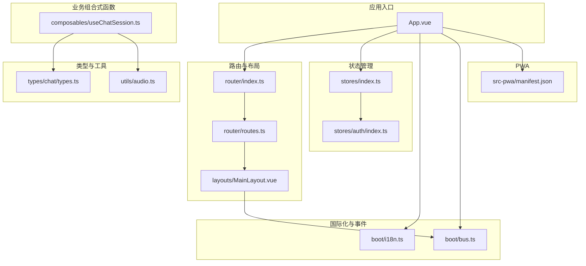
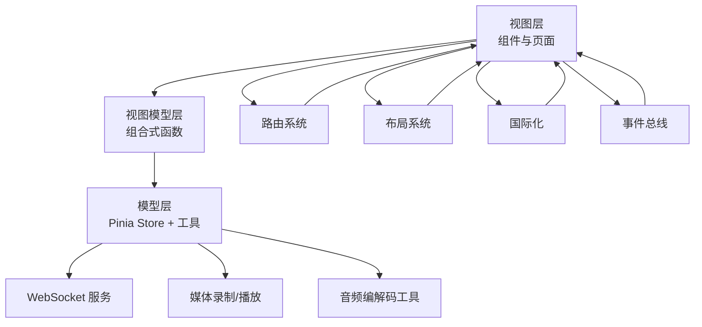
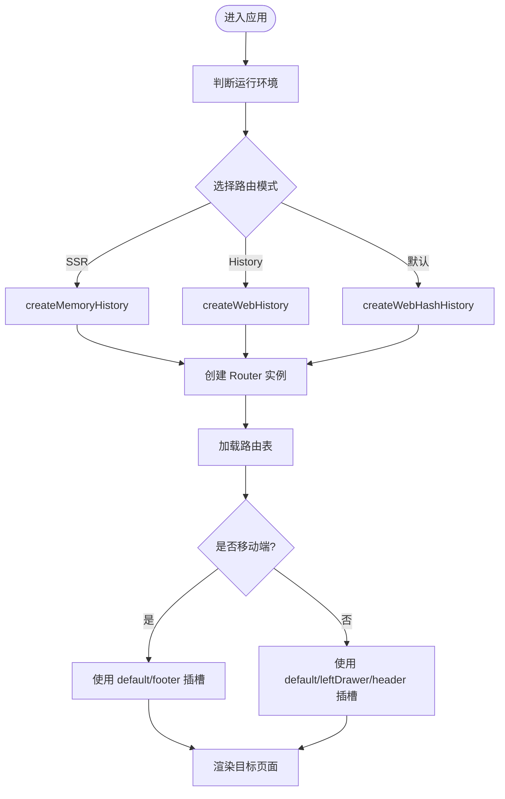
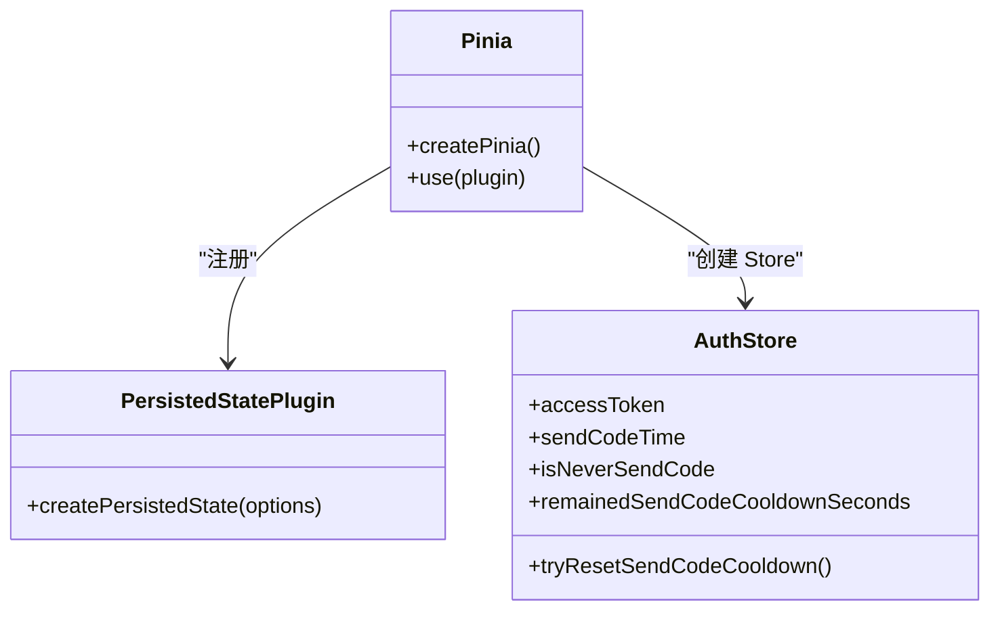
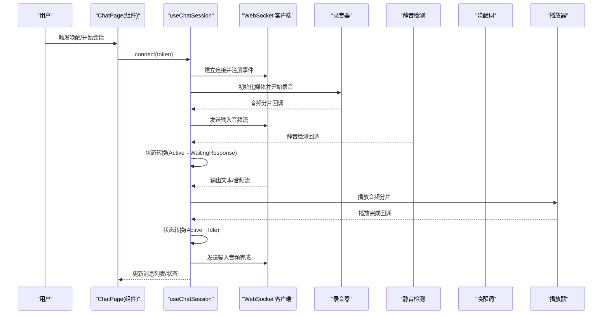
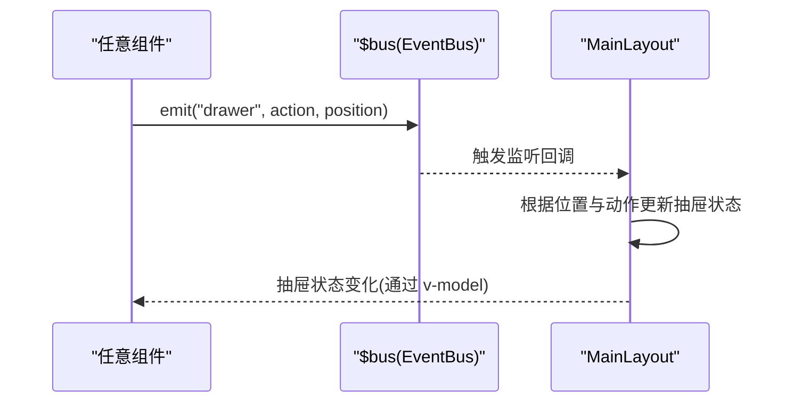
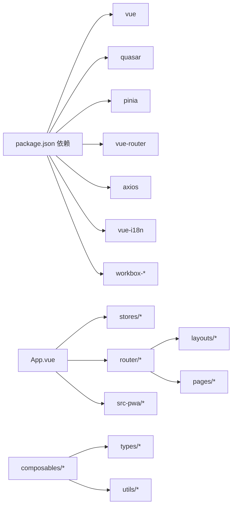

# 架构设计

<cite>
**本文引用的文件**
- [App.vue](file://src/App.vue)
- [quasar.config.ts](file://quasar.config.ts)
- [package.json](file://package.json)
- [router/index.ts](file://src/router/index.ts)
- [router/routes.ts](file://src/router/routes.ts)
- [layouts/MainLayout.vue](file://src/layouts/MainLayout.vue)
- [stores/index.ts](file://src/stores/index.ts)
- [stores/auth/index.ts](file://src/stores/auth/index.ts)
- [components/navigations.ts](file://src/components/navigations.ts)
- [boot/i18n.ts](file://src/boot/i18n.ts)
- [boot/bus.ts](file://src/boot/bus.ts)
- [composables/useChatSession.ts](file://src/composables/useChatSession.ts)
- [types/chat/types.ts](file://src/types/chat/types.ts)
- [utils/audio.ts](file://src/utils/audio.ts)
- [src-pwa/manifest.json](file://src-pwa/manifest.json)
</cite>

## 目录
1. [引言](#引言)
2. [项目结构](#项目结构)
3. [核心组件](#核心组件)
4. [架构总览](#架构总览)
5. [详细组件分析](#详细组件分析)
6. [依赖分析](#依赖分析)
7. [性能考量](#性能考量)
8. [故障排查指南](#故障排查指南)
9. [结论](#结论)
10. [附录](#附录)

## 引言
本文件为 Le Bot 前端项目的架构设计文档，聚焦于基于 Vue 3 + Quasar + Pinia 的现代前端架构模式。文档从 MVVM 架构思想出发，系统阐述组件化设计原则、模块化组织结构、路由与状态管理、全局配置策略，并给出系统边界、技术选型理由与架构决策记录。同时，结合仓库中的实际代码，提供架构图示、数据流图与序列图，帮助读者快速理解并高效扩展该前端应用。

## 项目结构
Le Bot 前端采用“按功能域分层 + 组件化”的组织方式：
- 应用入口与根组件：App.vue 负责启动时的令牌校验与本地数据初始化。
- 路由系统：通过路由表定义页面级布局与子路由，支持移动端与桌面端差异化渲染。
- 布局层：MainLayout.vue 提供多插槽布局（头部、侧边栏、页脚），配合抽屉事件总线实现跨组件通信。
- 状态管理：Pinia 多模块 Store（认证、设备、个人资料、设置等）统一管理应用状态，并启用持久化插件。
- 组合式函数：useChatSession 等组合式函数封装复杂业务流程（WebSocket、录音、播放、静音检测、唤醒词）。
- 国际化与事件总线：i18n 插件与 EventBus 实现语言包注入与组件间解耦通信。
- PWA 配置：Quasar PWA 模式与自定义 Service Worker 支持离线与安装能力。

**图表来源**
- [App.vue:1-85](file://src/App.vue#L1-L85)
- [router/index.ts:1-38](file://src/router/index.ts#L1-L38)
- [router/routes.ts:1-160](file://src/router/routes.ts#L1-L160)
- [layouts/MainLayout.vue:1-51](file://src/layouts/MainLayout.vue#L1-L51)
- [stores/index.ts:1-36](file://src/stores/index.ts#L1-L36)
- [stores/auth/index.ts:1-35](file://src/stores/auth/index.ts#L1-L35)
- [boot/i18n.ts:1-34](file://src/boot/i18n.ts#L1-L34)
- [boot/bus.ts:1-18](file://src/boot/bus.ts#L1-L18)
- [composables/useChatSession.ts:1-589](file://src/composables/useChatSession.ts#L1-L589)
- [types/chat/types.ts:1-96](file://src/types/chat/types.ts#L1-L96)
- [utils/audio.ts:1-47](file://src/utils/audio.ts#L1-L47)
- [src-pwa/manifest.json:1-33](file://src-pwa/manifest.json#L1-L33)

**章节来源**
- [quasar.config.ts:1-278](file://quasar.config.ts#L1-L278)
- [package.json:1-61](file://package.json#L1-L61)

## 核心组件
- 应用根组件 App.vue：在挂载阶段执行令牌校验、设备与个人资料的本地同步更新；通过 Pinia 访存器读取状态，调用工具方法完成主题应用与登录态清理。
- 路由系统：根据运行环境动态选择历史/哈希路由模式；路由表按“主界面”和“堆叠式页面”两类布局组织，支持移动端与桌面端差异化插槽渲染。
- 布局系统：MainLayout.vue 使用 Quasar 布局视图，通过具名插槽承载头部、侧边栏与页脚；使用 EventBus 接收抽屉控制指令，实现跨组件抽屉联动。
- 状态管理：stores/index.ts 创建 Pinia 并注册持久化插件；各领域 Store（如认证）独立维护状态与行为，持久化键空间隔离。
- 组合式函数：useChatSession.ts 将复杂的聊天会话生命周期抽象为状态机，串联 WebSocket、录音、播放、静音检测与唤醒词识别，提供统一的连接、唤醒、中断、清理接口。
- 国际化与事件总线：i18n.ts 注入多语言资源；bus.ts 定义事件总线类型，向全局注入 $bus，用于布局抽屉控制等跨组件通信。

**章节来源**
- [App.vue:1-85](file://src/App.vue#L1-L85)
- [router/index.ts:1-38](file://src/router/index.ts#L1-L38)
- [router/routes.ts:1-160](file://src/router/routes.ts#L1-L160)
- [layouts/MainLayout.vue:1-51](file://src/layouts/MainLayout.vue#L1-L51)
- [stores/index.ts:1-36](file://src/stores/index.ts#L1-L36)
- [stores/auth/index.ts:1-35](file://src/stores/auth/index.ts#L1-L35)
- [boot/i18n.ts:1-34](file://src/boot/i18n.ts#L1-L34)
- [boot/bus.ts:1-18](file://src/boot/bus.ts#L1-L18)
- [composables/useChatSession.ts:1-589](file://src/composables/useChatSession.ts#L1-L589)

## 架构总览
Le Bot 前端采用 MVVM 架构模式：
- Model：Pinia Store（认证、设备、个人资料、设置等）承载应用状态与业务逻辑；WebSocket 类型与音频工具提供底层数据与能力。
- View：Vue 组件（布局、页面、对话组件等）负责渲染与用户交互；路由系统决定页面级视图切换。
- ViewModel：组合式函数（如 useChatSession）封装复杂业务流程，向上提供简洁 API，向下协调多个子系统（WS、录音、播放、静音检测、唤醒词）。

**图表来源**
- [composables/useChatSession.ts:1-589](file://src/composables/useChatSession.ts#L1-L589)
- [stores/index.ts:1-36](file://src/stores/index.ts#L1-L36)
- [utils/audio.ts:1-47](file://src/utils/audio.ts#L1-L47)
- [router/index.ts:1-38](file://src/router/index.ts#L1-L38)
- [layouts/MainLayout.vue:1-51](file://src/layouts/MainLayout.vue#L1-L51)
- [boot/i18n.ts:1-34](file://src/boot/i18n.ts#L1-L34)
- [boot/bus.ts:1-18](file://src/boot/bus.ts#L1-L18)

## 详细组件分析

### 路由系统设计
- 动态路由模式：根据运行环境选择内存历史、Web 历史或哈希路由；默认使用哈希模式，便于部署与兼容性。
- 页面布局与插槽：路由表将页面分为“主界面”和“堆叠式页面”，分别对应 MainLayout 与 StackLayout；移动端与桌面端通过 Quasar Platform 判断，使用不同具名插槽（底部栏/侧边栏/头部）。
- 导航常量：导航项定义在 navigations.ts 中，结合 i18n 子路径生成多语言标签，统一管理可用路由与图标。

**图表来源**
- [router/index.ts:19-33](file://src/router/index.ts#L19-L33)
- [router/routes.ts:14-38](file://src/router/routes.ts#L14-L38)
- [router/routes.ts:26-38](file://src/router/routes.ts#L26-L38)
- [components/navigations.ts:12-95](file://src/components/navigations.ts#L12-L95)

**章节来源**
- [router/index.ts:1-38](file://src/router/index.ts#L1-L38)
- [router/routes.ts:1-160](file://src/router/routes.ts#L1-L160)
- [components/navigations.ts:1-95](file://src/components/navigations.ts#L1-L95)

### 状态管理架构
- Pinia 初始化：stores/index.ts 创建 Pinia 实例并注册持久化插件，自动持久化 Store；持久化键前缀统一，避免冲突。
- 认证 Store：stores/auth/index.ts 维护访问令牌与发送验证码冷却时间，提供计算属性与重置方法；开启持久化以保持登录态。
- 其他 Store：设备、个人资料、设置等 Store 分属各自领域，职责单一，通过 Pinia 进行集中管理与持久化。

**图表来源**
- [stores/index.ts:26-35](file://src/stores/index.ts#L26-L35)
- [stores/auth/index.ts:6-34](file://src/stores/auth/index.ts#L6-L34)

**章节来源**
- [stores/index.ts:1-36](file://src/stores/index.ts#L1-L36)
- [stores/auth/index.ts:1-35](file://src/stores/auth/index.ts#L1-L35)

### 聊天会话状态机与数据流
useChatSession.ts 将整个聊天生命周期抽象为状态机：Idle → WaitingResponse → Active → Idle。它协调 WebSocket、录音、播放、静音检测与唤醒词识别，形成完整的数据流。

**图表来源**
- [composables/useChatSession.ts:379-425](file://src/composables/useChatSession.ts#L379-L425)
- [composables/useChatSession.ts:100-130](file://src/composables/useChatSession.ts#L100-L130)
- [composables/useChatSession.ts:130-167](file://src/composables/useChatSession.ts#L130-L167)
- [composables/useChatSession.ts:168-209](file://src/composables/useChatSession.ts#L168-L209)
- [composables/useChatSession.ts:244-303](file://src/composables/useChatSession.ts#L244-L303)
- [types/chat/types.ts:11-19](file://src/types/chat/types.ts#L11-L19)

**章节来源**
- [composables/useChatSession.ts:1-589](file://src/composables/useChatSession.ts#L1-L589)
- [types/chat/types.ts:1-96](file://src/types/chat/types.ts#L1-L96)

### 布局与事件总线
- 抽屉联动：MainLayout.vue 通过 bus.on 监听 'drawer' 事件，根据位置与动作（打开/关闭/切换/最大化/最小化）更新抽屉状态，实现跨组件解耦控制。
- 事件总线类型：boot/bus.ts 定义了事件签名，确保 $bus 的类型安全。

**图表来源**
- [layouts/MainLayout.vue:14-37](file://src/layouts/MainLayout.vue#L14-L37)
- [boot/bus.ts:11-17](file://src/boot/bus.ts#L11-L17)

**章节来源**
- [layouts/MainLayout.vue:1-51](file://src/layouts/MainLayout.vue#L1-L51)
- [boot/bus.ts:1-18](file://src/boot/bus.ts#L1-L18)

### 国际化与多语言
- i18n.ts 注入多语言资源，定义全局类型，确保模板与业务中对语言包的类型安全访问。
- 导航文案通过 i18nSubPath 生成，统一管理多语言标签。

**章节来源**
- [boot/i18n.ts:1-34](file://src/boot/i18n.ts#L1-L34)
- [components/navigations.ts:10](file://src/components/navigations.ts#L10)

### PWA 与跨平台兼容性
- PWA 模式：Quasar 配置启用 PWA，Workbox 采用 InjectManifest 模式；构建后自动修复 PWA 图标与清单路径，适配 GitHub Pages 或子路径部署。
- Service Worker：register-service-worker 与自定义 custom-service-worker 协同工作，提供缓存与离线能力。
- 兼容性：浏览器目标包含 ES2022 与主流现代浏览器版本，确保在移动端与桌面端稳定运行。

**章节来源**
- [quasar.config.ts:206-216](file://quasar.config.ts#L206-L216)
- [quasar.config.ts:44-56](file://quasar.config.ts#L44-L56)
- [quasar.config.ts:71-74](file://quasar.config.ts#L71-L74)
- [src-pwa/manifest.json:1-33](file://src-pwa/manifest.json#L1-L33)

## 依赖分析
- 外部依赖：Vue 3、Quasar UI、Pinia、Vue Router、Axios、Vue I18n、Workbox 等。
- 内部模块依赖：App.vue 依赖多个 Store 与工具；路由依赖布局与页面；组合式函数依赖类型与工具；PWA 依赖清单与 Service Worker。

**图表来源**
- [package.json:17-30](file://package.json#L17-L30)
- [App.vue:5-11](file://src/App.vue#L5-L11)
- [router/index.ts:1-8](file://src/router/index.ts#L1-L8)
- [composables/useChatSession.ts:1-28](file://src/composables/useChatSession.ts#L1-L28)

**章节来源**
- [package.json:1-61](file://package.json#L1-L61)

## 性能考量
- 路由与懒加载：路由采用动态导入，减少首屏体积，提升加载速度。
- 状态持久化：Pinia 持久化插件仅持久化必要 Store，避免冗余数据写入 IndexedDB。
- 媒体资源释放：useChatSession 在销毁时释放录音、播放器与对象 URL，防止内存泄漏。
- 音频处理：pcmToWav 在输出音频完成后才合成 WAV，避免不必要的 CPU 开销。
- PWA 缓存：Workbox 策略按需缓存静态资源与接口，缩短二次访问延迟。

[本节为通用性能建议，不直接分析具体文件]

## 故障排查指南
- 登录态异常：检查 App.vue 中令牌校验与本地数据更新逻辑；确认认证 Store 的持久化状态是否正确。
- 路由跳转失效：核对 router/index.ts 的路由模式与 quasar.config.ts 的 publicPath 设置；确认路由表中命名路由是否存在。
- 抽屉不响应：检查 bus 事件发射与监听是否匹配；确认 MainLayout 的抽屉状态更新逻辑。
- 聊天无声音/卡顿：检查 useChatSession 的录音初始化、静音检测与播放器回调；确认音频分片与合成流程。
- PWA 安装失败：核对 src-pwa/manifest.json 与 Service Worker 注册路径；检查构建后 HTML 中 PWA 元标签路径修正。

**章节来源**
- [App.vue:58-80](file://src/App.vue#L58-L80)
- [router/index.ts:19-33](file://src/router/index.ts#L19-L33)
- [layouts/MainLayout.vue:14-37](file://src/layouts/MainLayout.vue#L14-L37)
- [composables/useChatSession.ts:379-447](file://src/composables/useChatSession.ts#L379-L447)
- [src-pwa/manifest.json:1-33](file://src-pwa/manifest.json#L1-33)

## 结论
Le Bot 前端以 MVVM 为核心，结合 Vue 3 + Quasar + Pinia 的现代技术栈，实现了高内聚、低耦合的模块化架构。路由系统与布局系统支持多端差异化体验；Pinia 状态管理与组合式函数将复杂业务流程抽象化；PWA 与 Workbox 提供离线与安装能力。整体架构具备良好的可扩展性与可维护性，适合在后续迭代中持续演进。

## 附录
- 系统边界：前端负责视图渲染、用户交互、状态管理与网络请求；后端提供 REST/WebSocket 服务；PWA 与 Service Worker 提供离线能力。
- 技术选型理由：
  - Vue 3：响应式与组合式 API 提升开发效率与可测试性。
  - Quasar：统一的 UI 组件库与跨平台打包能力。
  - Pinia：更直观的状态管理模式与 TypeScript 友好。
  - Vue Router：灵活的路由与导航守卫。
  - Workbox：成熟的 PWA 缓存与更新策略。
- 架构决策记录：
  - 路由模式：默认哈希模式，兼顾部署灵活性与兼容性。
  - 路由表：按布局拆分，移动端与桌面端差异化插槽。
  - 状态持久化：Pinia 持久化插件自动持久化关键 Store。
  - 事件总线：$bus 解耦布局与子组件通信。
  - PWA：InjectManifest 模式，构建期修正 PWA 资源路径。

[本节为概念性总结，不直接分析具体文件]