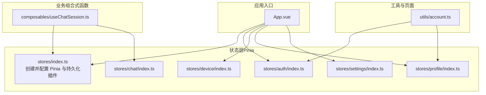
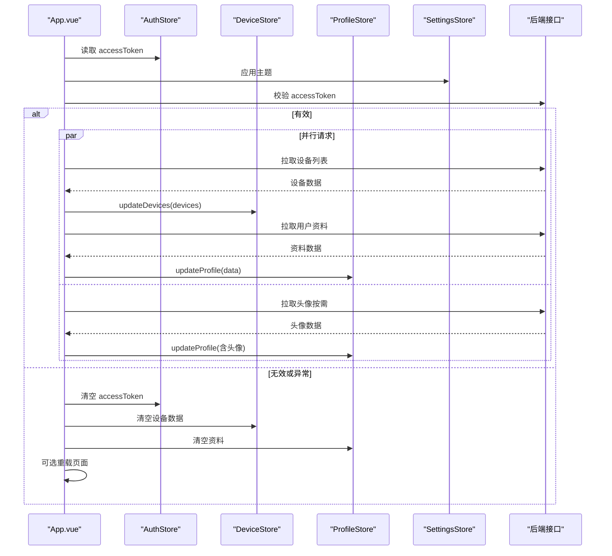
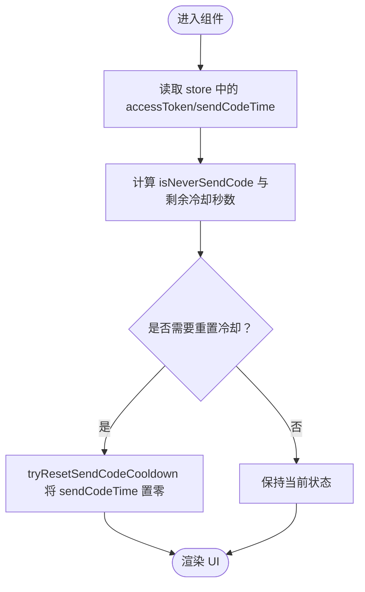
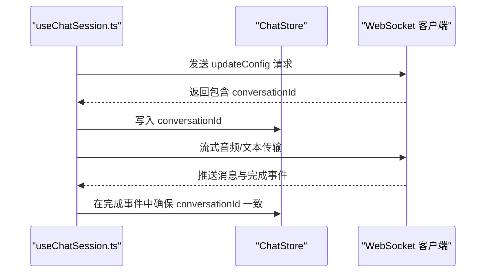
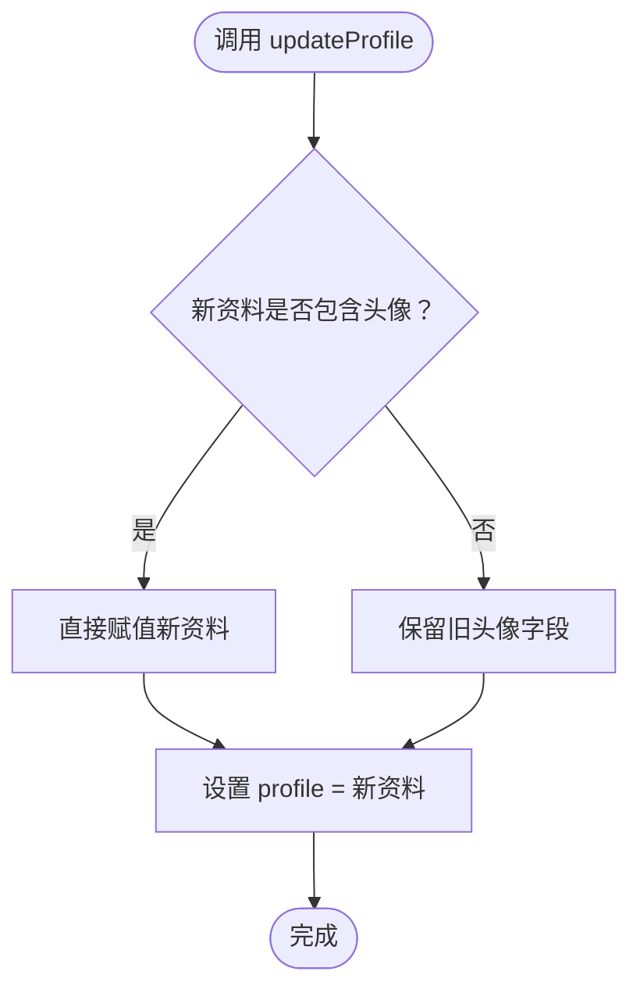
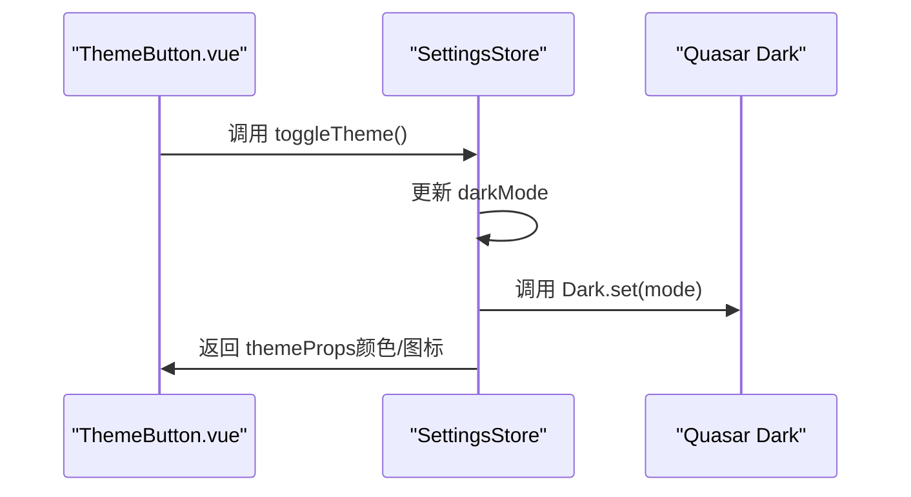
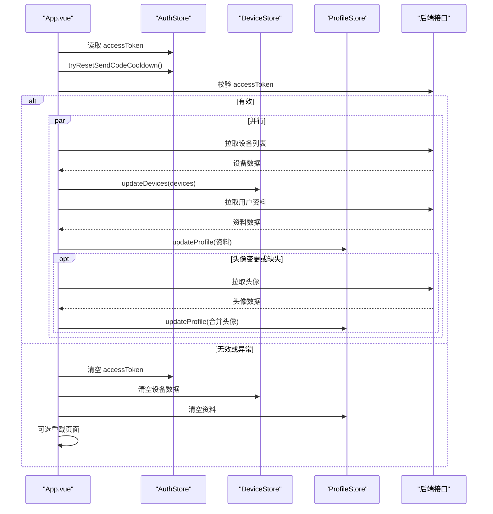
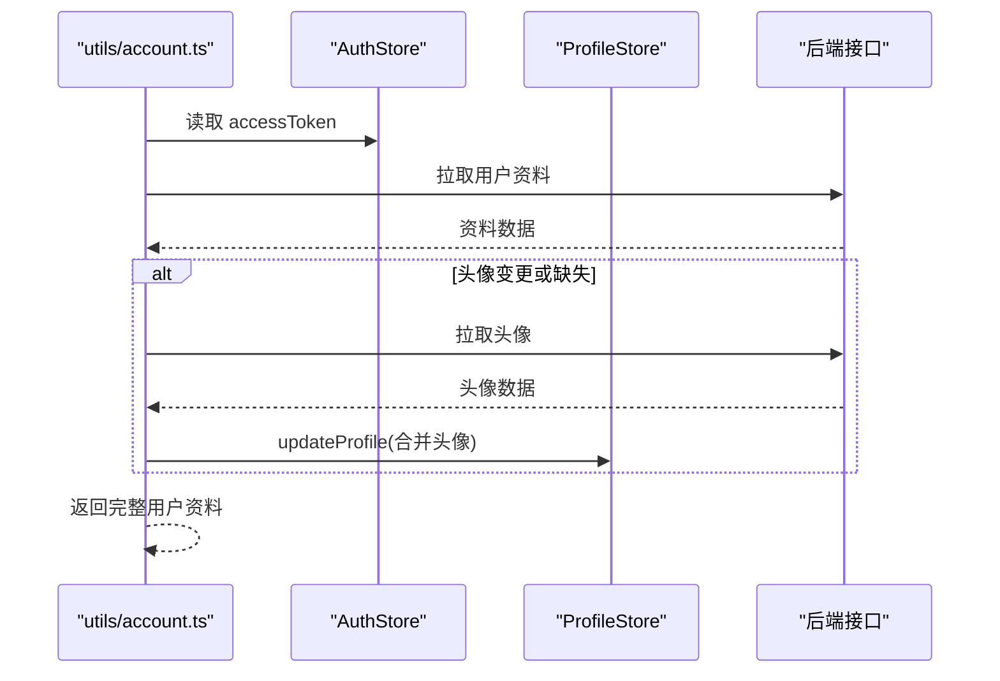
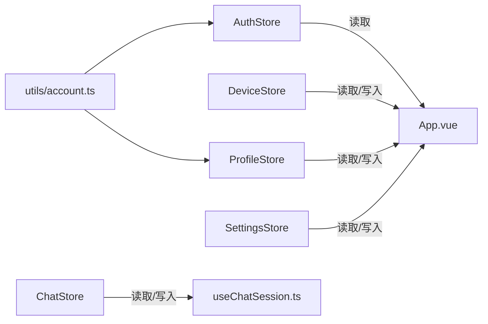

# 状态管理架构

<cite>
**本文引用的文件**
- [src/stores/index.ts](file://src/stores/index.ts)
- [src/stores/auth/index.ts](file://src/stores/auth/index.ts)
- [src/stores/auth/constants.ts](file://src/stores/auth/constants.ts)
- [src/stores/chat/index.ts](file://src/stores/chat/index.ts)
- [src/stores/device/index.ts](file://src/stores/device/index.ts)
- [src/stores/device/types.ts](file://src/stores/device/types.ts)
- [src/stores/profile/index.ts](file://src/stores/profile/index.ts)
- [src/stores/profile/types.ts](file://src/stores/profile/types.ts)
- [src/stores/settings/index.ts](file://src/stores/settings/index.ts)
- [src/stores/settings/constants.ts](file://src/stores/settings/constants.ts)
- [src/stores/settings/types.ts](file://src/stores/settings/types.ts)
- [src/App.vue](file://src/App.vue)
- [src/composables/useChatSession.ts](file://src/composables/useChatSession.ts)
- [src/utils/account.ts](file://src/utils/account.ts)
</cite>

## 目录
1. [引言](#引言)
2. [项目结构](#项目结构)
3. [核心组件](#核心组件)
4. [架构总览](#架构总览)
5. [详细组件分析](#详细组件分析)
6. [依赖关系分析](#依赖关系分析)
7. [性能考量](#性能考量)
8. [故障排查指南](#故障排查指南)
9. [结论](#结论)
10. [附录](#附录)

## 引言
本文件系统性梳理 Le Bot 前端基于 Pinia 的状态管理架构，覆盖以下主题：
- store 模块的组织结构与命名规范
- 状态树设计原则（分层存储与模块化）
- 异步状态处理策略（action 的异步操作与状态更新机制）
- 状态持久化策略与跨组件共享方案
- 最佳实践（不可变性、状态更新原子性）
- 状态流转图与时序流程图
- 与 Vue 响应式系统的集成方式

## 项目结构
前端采用按功能域划分的 store 组织方式，每个领域一个独立模块，便于维护与扩展。持久化通过插件统一启用，确保关键用户态与设备态在刷新后得以恢复。



图表来源
- [src/stores/index.ts:1-36](file://src/stores/index.ts#L1-L36)
- [src/stores/auth/index.ts:1-35](file://src/stores/auth/index.ts#L1-L35)
- [src/stores/chat/index.ts:1-17](file://src/stores/chat/index.ts#L1-L17)
- [src/stores/device/index.ts:1-27](file://src/stores/device/index.ts#L1-L27)
- [src/stores/profile/index.ts:1-25](file://src/stores/profile/index.ts#L1-L25)
- [src/stores/settings/index.ts:1-57](file://src/stores/settings/index.ts#L1-L57)
- [src/App.vue:1-85](file://src/App.vue#L1-L85)
- [src/composables/useChatSession.ts:1-589](file://src/composables/useChatSession.ts#L1-L589)
- [src/utils/account.ts:1-41](file://src/utils/account.ts#L1-L41)

章节来源
- [src/stores/index.ts:1-36](file://src/stores/index.ts#L1-L36)
- [src/App.vue:1-85](file://src/App.vue#L1-L85)

## 核心组件
- Pinia 实例与持久化插件：集中初始化，统一开启持久化，指定键名前缀，避免冲突。
- 认证域（auth）：管理访问令牌与验证码发送冷却时间等认证相关状态。
- 聊天域（chat）：管理会话标识，作为聊天上下文的关键输入。
- 设备域（device）：管理当前设备与设备列表，并提供批量更新方法。
- 用户资料域（profile）：管理用户档案信息，支持带条件的更新逻辑。
- 设置域（settings）：管理主题模式、语言等 UI/UX 相关状态，并与 Quasar 深色模式联动。

章节来源
- [src/stores/index.ts:1-36](file://src/stores/index.ts#L1-L36)
- [src/stores/auth/index.ts:1-35](file://src/stores/auth/index.ts#L1-L35)
- [src/stores/chat/index.ts:1-17](file://src/stores/chat/index.ts#L1-L17)
- [src/stores/device/index.ts:1-27](file://src/stores/device/index.ts#L1-L27)
- [src/stores/profile/index.ts:1-25](file://src/stores/profile/index.ts#L1-L25)
- [src/stores/settings/index.ts:1-57](file://src/stores/settings/index.ts#L1-L57)

## 架构总览
下图展示应用启动时如何加载持久化状态、校验登录态，并拉取设备与用户资料；同时演示聊天会话如何读写会话 ID 并驱动状态机流转。



图表来源
- [src/App.vue:58-80](file://src/App.vue#L58-L80)
- [src/stores/auth/index.ts:24-30](file://src/stores/auth/index.ts#L24-L30)
- [src/stores/device/index.ts:12-15](file://src/stores/device/index.ts#L12-L15)
- [src/stores/profile/index.ts:11-16](file://src/stores/profile/index.ts#L11-L16)
- [src/stores/settings/index.ts:31-39](file://src/stores/settings/index.ts#L31-L39)

## 详细组件分析

### 认证状态（AuthStore）
- 状态字段
  - accessToken：访问令牌
  - sendCodeTime：验证码发送时间戳
- 计算属性
  - isNeverSendCode：是否从未发送过验证码
  - remainedSendCodeCooldownSeconds：剩余冷却秒数
- 行为
  - tryResetSendCodeCooldown：冷却结束时重置时间戳
- 持久化
  - 启用持久化，键名由全局插件生成



图表来源
- [src/stores/auth/index.ts:12-22](file://src/stores/auth/index.ts#L12-L22)
- [src/stores/auth/constants.ts:1-2](file://src/stores/auth/constants.ts#L1-L2)

章节来源
- [src/stores/auth/index.ts:1-35](file://src/stores/auth/index.ts#L1-L35)
- [src/stores/auth/constants.ts:1-2](file://src/stores/auth/constants.ts#L1-L2)

### 聊天状态（ChatStore）
- 状态字段
  - conversationId：当前会话标识
- 行为
  - 由聊天会话组合式函数在连接建立与消息流中更新该值
- 持久化
  - 启用持久化，保证刷新后仍可继续同一会话



图表来源
- [src/composables/useChatSession.ts:115-127](file://src/composables/useChatSession.ts#L115-L127)
- [src/composables/useChatSession.ts:130-147](file://src/composables/useChatSession.ts#L130-L147)
- [src/composables/useChatSession.ts:188-209](file://src/composables/useChatSession.ts#L188-L209)
- [src/composables/useChatSession.ts:211-225](file://src/composables/useChatSession.ts#L211-L225)
- [src/composables/useChatSession.ts:486-489](file://src/composables/useChatSession.ts#L486-L489)
- [src/stores/chat/index.ts:7-11](file://src/stores/chat/index.ts#L7-L11)

章节来源
- [src/stores/chat/index.ts:1-17](file://src/stores/chat/index.ts#L1-L17)
- [src/composables/useChatSession.ts:1-589](file://src/composables/useChatSession.ts#L1-L589)

### 设备状态（DeviceStore）
- 状态字段
  - currentDevice：当前设备
  - devices：设备列表
- 行为
  - updateDevices：批量更新设备列表并设置第一个设备为当前设备
- 类型
  - DeviceInfo：包含设备标识、名称、类型、配置等字段

```mermaid
classDiagram
class DeviceStore {
+currentDevice : DeviceInfo?
+devices : DeviceInfo[]
+updateDevices(newDevices)
}
class DeviceInfo {
+id : string
+identifier : string
+name : string?
+type : "robot"
+config : { voiceStyle : string }?
}
DeviceStore --> DeviceInfo : "持有"
```

图表来源
- [src/stores/device/index.ts:8-21](file://src/stores/device/index.ts#L8-L21)
- [src/stores/device/types.ts:3-16](file://src/stores/device/types.ts#L3-L16)

章节来源
- [src/stores/device/index.ts:1-27](file://src/stores/device/index.ts#L1-L27)
- [src/stores/device/types.ts:1-17](file://src/stores/device/types.ts#L1-L17)

### 用户资料状态（ProfileStore）
- 状态字段
  - profile：用户档案
- 行为
  - updateProfile：在传入新资料且未提供头像时保留旧头像，再整体替换
- 类型
  - UserProfile：包含用户标识、昵称、头像、地区、活跃与登录时间等



图表来源
- [src/stores/profile/index.ts:11-16](file://src/stores/profile/index.ts#L11-L16)
- [src/stores/profile/types.ts:1-12](file://src/stores/profile/types.ts#L1-L12)

章节来源
- [src/stores/profile/index.ts:1-25](file://src/stores/profile/index.ts#L1-L25)
- [src/stores/profile/types.ts:1-13](file://src/stores/profile/types.ts#L1-L13)

### 设置状态（SettingsStore）
- 状态字段
  - darkMode：深色模式枚举（false/auto/true）
  - locale：国际化语言（通过计算属性与 i18n 全局对象双向绑定）
- 行为
  - themeProps：根据当前模式返回颜色与图标
  - applyTheme：应用到 Quasar 深色模式
  - toggleTheme：循环切换模式
- 持久化
  - 启用持久化，键名由全局插件生成
- HMR 支持
  - 开发环境下接受热更新



图表来源
- [src/stores/settings/index.ts:31-39](file://src/stores/settings/index.ts#L31-L39)
- [src/stores/settings/index.ts:12-29](file://src/stores/settings/index.ts#L12-L29)
- [src/stores/settings/constants.ts:3-4](file://src/stores/settings/constants.ts#L3-L4)
- [src/stores/settings/types.ts:1-4](file://src/stores/settings/types.ts#L1-L4)

章节来源
- [src/stores/settings/index.ts:1-57](file://src/stores/settings/index.ts#L1-L57)
- [src/stores/settings/constants.ts:1-4](file://src/stores/settings/constants.ts#L1-L4)
- [src/stores/settings/types.ts:1-4](file://src/stores/settings/types.ts#L1-L4)

### 应用启动与状态同步（App.vue）
- 启动流程
  - 初始化主题与冷却重置
  - 若存在 accessToken，则并行拉取设备与用户资料；若头像哈希变化或缺失头像，则额外拉取头像
  - 若校验失败或异常，则清空登录态并可选重载页面
- 关键交互
  - 使用 storeToRefs 将 store 状态转为可响应的局部引用
  - 通过 updateDevices 与 updateProfile 更新本地状态



图表来源
- [src/App.vue:58-80](file://src/App.vue#L58-L80)
- [src/stores/device/index.ts:12-15](file://src/stores/device/index.ts#L12-L15)
- [src/stores/profile/index.ts:11-16](file://src/stores/profile/index.ts#L11-L16)

章节来源
- [src/App.vue:1-85](file://src/App.vue#L1-L85)

### 登出与资料拉取（utils/account.ts）
- 登出流程
  - 清空 accessToken
  - 清空用户资料
  - 导航至首页并延迟重载
- 资料拉取
  - 从 AuthStore 与 ProfileStore 获取最新状态
  - 按需拉取头像并合并返回



图表来源
- [src/utils/account.ts:17-40](file://src/utils/account.ts#L17-L40)
- [src/stores/auth/index.ts:9-10](file://src/stores/auth/index.ts#L9-L10)
- [src/stores/profile/index.ts:11-16](file://src/stores/profile/index.ts#L11-L16)

章节来源
- [src/utils/account.ts:1-41](file://src/utils/account.ts#L1-L41)

## 依赖关系分析
- 模块内聚与耦合
  - 各 store 模块自包含状态与行为，彼此低耦合
  - App.vue 与多个 store 交互，承担应用级协调职责
  - useChatSession.ts 仅依赖 ChatStore 与其内部状态，不直接依赖其他 store
- 外部依赖
  - Pinia 插件：统一持久化与类型增强
  - Quasar：深色模式与国际化
  - Vue 响应式系统：ref/computed/storeToRefs



图表来源
- [src/App.vue:8-18](file://src/App.vue#L8-L18)
- [src/composables/useChatSession.ts:81](file://src/composables/useChatSession.ts#L81)
- [src/utils/account.ts:3-4](file://src/utils/account.ts#L3-L4)

章节来源
- [src/App.vue:1-85](file://src/App.vue#L1-L85)
- [src/composables/useChatSession.ts:1-589](file://src/composables/useChatSession.ts#L1-L589)
- [src/utils/account.ts:1-41](file://src/utils/account.ts#L1-L41)

## 性能考量
- 响应式更新粒度
  - 使用 storeToRefs 将只读引用注入组件，减少不必要的重渲染
- 并行异步
  - 启动阶段对设备与资料的拉取采用并行，缩短首屏等待
- 状态持久化
  - 仅对必要状态启用持久化，降低存储体积与序列化开销
- 避免深层嵌套
  - store 状态尽量扁平化，减少深层订阅带来的性能损耗

## 故障排查指南
- 登录态失效
  - 现象：进入页面后被重定向或数据为空
  - 排查：检查 accessToken 是否为空；确认校验接口返回；观察 clearLoginState 是否被触发
- 设备/资料未更新
  - 现象：界面显示旧数据
  - 排查：确认 updateDevices 与 updateProfile 是否被调用；检查后端返回结构
- 主题切换不生效
  - 现象：切换主题后 UI 未变化
  - 排查：确认 Dark.set 已调用；检查 themeProps 是否正确返回
- 会话 ID 不一致
  - 现象：消息归属错误或无法续会
  - 排查：确认 WebSocket 回调中是否更新了 conversationId；检查 clearContext 是否误清空

章节来源
- [src/App.vue:20-27](file://src/App.vue#L20-L27)
- [src/stores/settings/index.ts:31-39](file://src/stores/settings/index.ts#L31-L39)
- [src/composables/useChatSession.ts:125-128](file://src/composables/useChatSession.ts#L125-L128)
- [src/composables/useChatSession.ts:486-489](file://src/composables/useChatSession.ts#L486-L489)

## 结论
本项目以 Pinia 为核心构建了清晰、可维护的状态管理架构：
- 模块化组织与命名规范明确，便于团队协作与长期演进
- 通过持久化插件实现关键状态的跨会话保持
- 异步流程采用并行与条件更新，兼顾性能与正确性
- 与 Vue 响应式系统深度集成，确保 UI 与状态的一致性

## 附录

### 状态树设计原则
- 分层存储
  - 认证、设备、资料、设置、聊天分别独立建模，职责单一
- 模块化管理
  - 每个 store 自包含状态、计算属性与动作，边界清晰
- 键名与持久化
  - 通过全局插件统一分配键名前缀，避免多应用或多环境冲突

章节来源
- [src/stores/index.ts:26-35](file://src/stores/index.ts#L26-L35)

### 异步状态处理策略
- 并行初始化：设备与资料拉取并行执行，提升首屏体验
- 条件更新：头像变更或缺失时才重新拉取，减少网络消耗
- 动作幂等：updateProfile 在无头像时保留旧头像，保证更新原子性

章节来源
- [src/App.vue:65-68](file://src/App.vue#L65-L68)
- [src/stores/profile/index.ts:11-16](file://src/stores/profile/index.ts#L11-L16)

### 与 Vue 响应式系统的集成
- 使用 ref/computed 定义状态与派生状态
- 使用 storeToRefs 将 store 状态转为可响应引用，避免丢失响应性
- 在组合式函数中直接读写 store，简化跨组件共享

章节来源
- [src/stores/auth/index.ts:9-16](file://src/stores/auth/index.ts#L9-L16)
- [src/App.vue:13-17](file://src/App.vue#L13-L17)
- [src/composables/useChatSession.ts:81](file://src/composables/useChatSession.ts#L81)