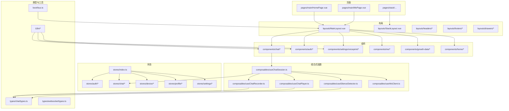
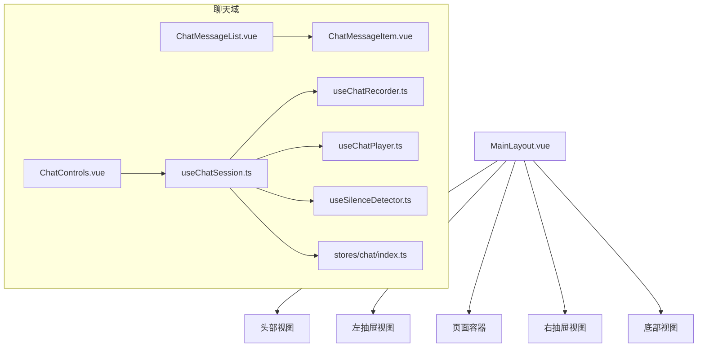
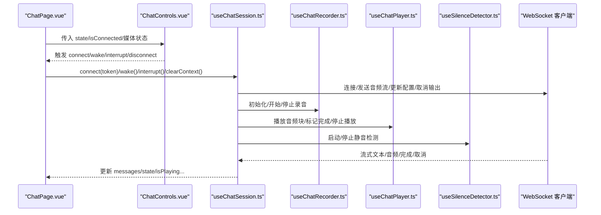
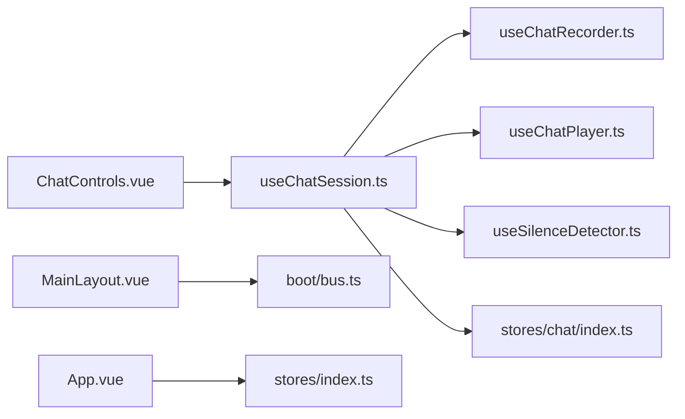

# 组件系统设计

<cite>
**本文引用的文件**
- [App.vue](file://src/App.vue)
- [MainLayout.vue](file://src/layouts/MainLayout.vue)
- [navigations.ts](file://src/components/navigations.ts)
- [bus.ts](file://src/boot/bus.ts)
- [useChatSession.ts](file://src/composables/useChatSession.ts)
- [ChatMessageItem.vue](file://src/components/chat/ChatMessageItem.vue)
- [ChatMessageList.vue](file://src/components/chat/ChatMessageList.vue)
- [ChatControls.vue](file://src/components/chat/ChatControls.vue)
- [types.ts（聊天）](file://src/types/chat/types.ts)
- [SignInOrSignUpPanel.vue](file://src/components/auth/SignInOrSignUpPanel.vue)
- [RecordPanel.vue](file://src/components/settings/voiceprint/RecordPanel.vue)
- [useChatRecorder.ts](file://src/composables/useChatRecorder.ts)
- [useChatPlayer.ts](file://src/composables/useChatPlayer.ts)
- [useSilenceDetector.ts](file://src/composables/useSilenceDetector.ts)
- [stores/index.ts](file://src/stores/index.ts)
</cite>

## 目录
1. [引言](#引言)
2. [项目结构](#项目结构)
3. [核心组件](#核心组件)
4. [架构总览](#架构总览)
5. [组件详解](#组件详解)
6. [依赖关系分析](#依赖关系分析)
7. [性能考量](#性能考量)
8. [故障排查指南](#故障排查指南)
9. [结论](#结论)
10. [附录](#附录)

## 引言
本设计文档面向 Le Bot 前端组件系统，目标是建立一套清晰的组件分类体系与职责划分，明确布局组件、业务组件与通用组件的设计原则；解释组件通信模式（props 传递、事件发射、插槽使用、provide/inject 依赖注入）；阐述组件生命周期管理与状态管理策略；总结组件复用与组合式函数应用；给出组件设计规范、命名约定与代码组织原则；并通过图示展示组件间依赖关系与数据流向，并解释响应式设计在组件中的实现方式。

## 项目结构
前端采用基于功能域的分层组织：页面（pages）、布局（layouts）、组件（components）、组合式函数（composables）、类型定义（types）、状态（stores）、国际化（i18n）、引导与工具（boot/utils）。组件按功能域进一步细分，如 chat、auth、settings 等子目录，便于职责分离与复用。

图表来源
- [MainLayout.vue:1-51](file://src/layouts/MainLayout.vue#L1-L51)
- [useChatSession.ts:1-589](file://src/composables/useChatSession.ts#L1-L589)
- [types.ts（聊天）:1-96](file://src/types/chat/types.ts#L1-L96)
- [stores/index.ts:1-36](file://src/stores/index.ts#L1-L36)
- [bus.ts:1-18](file://src/boot/bus.ts#L1-L18)

章节来源
- [MainLayout.vue:1-51](file://src/layouts/MainLayout.vue#L1-L51)
- [navigations.ts:1-95](file://src/components/navigations.ts#L1-L95)
- [bus.ts:1-18](file://src/boot/bus.ts#L1-L18)

## 核心组件
- 布局组件：负责页面骨架、抽屉、头部、底部等容器级 UI，统一承载路由视图与全局交互。
- 业务组件：围绕具体业务场景构建，如聊天消息列表、消息项、控制面板、认证面板、语音样本录制等。
- 通用组件：可跨页面复用的基础 UI 或工具型组件，如主题切换按钮、裁剪对话框等。

组件分类与职责
- 布局组件
  - MainLayout：集中管理左右抽屉开关与最小化状态，通过全局事件总线接收抽屉动作指令，渲染多命名视图（header/left/right/footer/page-container）。
  - StackLayout：栈式布局，适用于设置类页面的层级导航。
- 业务组件
  - ChatMessageList：滚动区域 + 列表渲染，自动滚动到底部，支持空态提示。
  - ChatMessageItem：单条消息渲染，区分用户/助手、文本/音频、流式状态与完成态。
  - ChatControls：根据会话状态动态生成主按钮与状态提示，触发连接/断开、唤醒、打断等事件。
  - SignInOrSignUpPanel：邮箱验证码/密码登录流程，校验输入并调用后端接口，向父组件发出下一步或完成事件。
  - RecordPanel：语音样本录制流程，指导准备事项，拼接录音片段，生成预览与提交数据。
- 通用组件
  - ThemeButton：主题切换入口。
  - CropperDialog：图片裁剪对话框。
  - 其他基础卡片组件（DeviceCard、TopicCard、ProfileCard、OverviewCard）用于信息展示。

章节来源
- [MainLayout.vue:1-51](file://src/layouts/MainLayout.vue#L1-L51)
- [ChatMessageList.vue:1-68](file://src/components/chat/ChatMessageList.vue#L1-L68)
- [ChatMessageItem.vue:1-73](file://src/components/chat/ChatMessageItem.vue#L1-L73)
- [ChatControls.vue:1-204](file://src/components/chat/ChatControls.vue#L1-L204)
- [SignInOrSignUpPanel.vue:1-117](file://src/components/auth/SignInOrSignUpPanel.vue#L1-L117)
- [RecordPanel.vue:1-104](file://src/components/settings/voiceprint/RecordPanel.vue#L1-L104)

## 架构总览
组件系统以“布局组件承载 + 业务组件编排 + 通用组件复用”的方式组织。业务组件通过组合式函数（composables）封装复杂逻辑（如聊天会话、录音、播放、静音检测），并与 Pinia 状态库协作。全局事件总线用于布局与业务组件之间的松耦合通信。

图表来源
- [MainLayout.vue:40-50](file://src/layouts/MainLayout.vue#L40-L50)
- [ChatMessageList.vue:1-68](file://src/components/chat/ChatMessageList.vue#L1-L68)
- [ChatMessageItem.vue:1-73](file://src/components/chat/ChatMessageItem.vue#L1-L73)
- [ChatControls.vue:1-204](file://src/components/chat/ChatControls.vue#L1-L204)
- [useChatSession.ts:1-589](file://src/composables/useChatSession.ts#L1-L589)
- [useChatRecorder.ts:1-148](file://src/composables/useChatRecorder.ts#L1-L148)
- [useChatPlayer.ts:1-161](file://src/composables/useChatPlayer.ts#L1-L161)
- [useSilenceDetector.ts:1-104](file://src/composables/useSilenceDetector.ts#L1-L104)

## 组件详解

### 聊天组件链路（会话状态机）
该链路体现了 props 传递、事件发射、插槽使用与组合式函数协作的完整闭环。

图表来源
- [ChatControls.vue:1-204](file://src/components/chat/ChatControls.vue#L1-L204)
- [useChatSession.ts:1-589](file://src/composables/useChatSession.ts#L1-L589)
- [useChatRecorder.ts:1-148](file://src/composables/useChatRecorder.ts#L1-L148)
- [useChatPlayer.ts:1-161](file://src/composables/useChatPlayer.ts#L1-L161)
- [useSilenceDetector.ts:1-104](file://src/composables/useSilenceDetector.ts#L1-L104)

章节来源
- [ChatControls.vue:1-204](file://src/components/chat/ChatControls.vue#L1-L204)
- [useChatSession.ts:1-589](file://src/composables/useChatSession.ts#L1-L589)
- [types.ts（聊天）:1-96](file://src/types/chat/types.ts#L1-L96)

### 组件通信模式
- Props 传递
  - ChatControls 接收 state、isConnected、isMediaReady、isWakeWordSupported、isWakeWordListening、isRecording、isAudioPlaying 等只读状态，驱动 UI 行为与样式。
  - ChatMessageList 接收 messages 数组，内部通过 watch 监听长度与最后一条消息的文本变化，自动滚动到底部。
  - ChatMessageItem 接收单条 ChatMessage，计算是否为用户消息、是否有文本/音频、时间标签等。
- 事件发射
  - ChatControls 通过 emit 分别向上抛出 connect、wake、interrupt、disconnect 事件，由上层页面处理。
  - RecordPanel 在录音结束时通过 emit('next', Blob) 将音频数据回传给父组件。
  - SignInOrSignUpPanel 在登录成功后根据结果 emit('next'|'finish')，驱动页面流转。
- 插槽使用
  - 布局组件通过具名 router-view（header/left/right/footer）承载不同区域内容，形成插槽化的页面结构。
- 依赖注入与全局事件
  - 布局组件通过全局事件总线 bus 接收抽屉控制指令，实现跨组件解耦联动。
  - App.vue 在挂载阶段读取本地存储的 token 并拉取设备与头像信息，初始化全局主题与冷却状态。

章节来源
- [ChatControls.vue:23-28](file://src/components/chat/ChatControls.vue#L23-L28)
- [ChatMessageList.vue:14-33](file://src/components/chat/ChatMessageList.vue#L14-L33)
- [ChatMessageItem.vue:6-16](file://src/components/chat/ChatMessageItem.vue#L6-L16)
- [RecordPanel.vue:9-11](file://src/components/settings/voiceprint/RecordPanel.vue#L9-L11)
- [SignInOrSignUpPanel.vue:15-18](file://src/components/auth/SignInOrSignUpPanel.vue#L15-L18)
- [MainLayout.vue:14-37](file://src/layouts/MainLayout.vue#L14-L37)
- [bus.ts:11-13](file://src/boot/bus.ts#L11-L13)
- [App.vue:58-80](file://src/App.vue#L58-L80)

### 生命周期管理与状态管理策略
- 生命周期
  - 布局组件：在 onMounted 中注册事件监听器，确保抽屉控制生效。
  - 页面组件：在 onMounted 中进行鉴权校验与本地数据同步，Promise.all 并行拉取设备与资料。
  - 录制/播放/静音检测：在 useChatSession 的 connect/startSession/destroy 中统一初始化与释放资源，避免内存泄漏。
- 状态管理
  - 全局状态：Pinia stores 提供持久化存储（createPersistedState），覆盖 auth/device/profile/settings/chat 等模块。
  - 组合式函数内部状态：useChatSession 内部维护 state/messages/isConnected 等响应式状态，作为 UI 的直接数据源。
  - 类型约束：types/chat/types.ts 明确定义 ChatState、ChatMessage、SilenceDetectorConfig、AUDIO_CONSTANTS 等，保证跨模块一致性。

章节来源
- [MainLayout.vue:58-80](file://src/layouts/MainLayout.vue#L58-L80)
- [App.vue:58-80](file://src/App.vue#L58-L80)
- [useChatSession.ts:84-91](file://src/composables/useChatSession.ts#L84-L91)
- [stores/index.ts:26-35](file://src/stores/index.ts#L26-L35)
- [types.ts（聊天）:11-96](file://src/types/chat/types.ts#L11-L96)

### 组件复用与组合式函数应用
- 复用策略
  - 业务组件拆分为细粒度：ChatMessageList/Item、ChatControls 独立可复用；RecordPanel 可嵌入多处设置页。
  - 通用组件：ThemeButton、CropperDialog 等可跨页面引入。
- 组合式函数
  - useChatSession：封装完整的会话生命周期、状态机、WebSocket 事件处理、录音/播放/静音检测协调。
  - useChatRecorder/useChatPlayer/useSilenceDetector：分别聚焦录音、播放、静音检测，职责单一、易于测试与替换。
  - useWsClient：抽象 WebSocket 客户端，屏蔽底层细节，便于扩展与模拟。

章节来源
- [useChatSession.ts:74-571](file://src/composables/useChatSession.ts#L74-L571)
- [useChatRecorder.ts:36-136](file://src/composables/useChatRecorder.ts#L36-L136)
- [useChatPlayer.ts:35-160](file://src/composables/useChatPlayer.ts#L35-L160)
- [useSilenceDetector.ts:27-103](file://src/composables/useSilenceDetector.ts#L27-L103)

### 设计规范、命名约定与代码组织
- 命名约定
  - 组件文件：PascalCase.vue（如 ChatMessageItem.vue、SignInOrSignUpPanel.vue）
  - 组合式函数：useXxx.ts（如 useChatSession.ts、useChatRecorder.ts）
  - 类型定义：types.ts（如 types/chat/types.ts）
- 代码组织
  - 功能域内按目录聚合：components/chat、components/auth、components/settings/voiceprint 等
  - 组合式函数集中于 composables，避免在组件中重复实现
  - 布局组件仅做容器与通信，不承载业务逻辑
- 文档与国际化
  - 使用 i18nSubPath 统一管理文案键值，便于扩展与翻译

章节来源
- [navigations.ts:1-95](file://src/components/navigations.ts#L1-L95)
- [SignInOrSignUpPanel.vue](file://src/components/auth/SignInOrSignUpPanel.vue#L20)

### 数据流向示例
- 登录流程
  - 用户输入邮箱与验证码/密码 → SignInOrSignUpPanel 校验并调用后端接口 → 成功后写入 auth store 的 accessToken → App.vue 验证 token 并并行拉取设备与资料 → 布局与页面根据新状态渲染
- 聊天流程
  - ChatControls 触发 connect → useChatSession 建立 WS 连接与录音初始化 → 用户说话 → 录音回调推送音频流 → 服务器返回流式文本/音频 → useChatSession 更新 messages → ChatMessageList 自动滚动 → ChatMessageItem 渲染文本/音频

章节来源
- [SignInOrSignUpPanel.vue:40-75](file://src/components/auth/SignInOrSignUpPanel.vue#L40-L75)
- [App.vue:58-80](file://src/App.vue#L58-L80)
- [useChatSession.ts:379-425](file://src/composables/useChatSession.ts#L379-L425)
- [ChatMessageList.vue:14-41](file://src/components/chat/ChatMessageList.vue#L14-L41)

### 响应式设计实现
- 布局自适应
  - MainLayout 通过 Quasar 的 screen 适配移动端显示，命名视图根据 mobile 参数调整布局
- 组件响应式
  - ChatMessageList 通过 watch 监听消息数组长度与最后一条消息的文本/完成态，确保实时滚动
  - ChatControls 根据 ChatState 与媒体状态动态生成按钮颜色、图标、脉冲动画与禁用态
- 主题与暗色模式
  - stores/settings 中提供主题应用逻辑，App.vue 在挂载时调用 applyTheme

章节来源
- [MainLayout.vue](file://src/layouts/MainLayout.vue#L7)
- [ChatMessageList.vue:14-33](file://src/components/chat/ChatMessageList.vue#L14-L33)
- [ChatControls.vue:31-103](file://src/components/chat/ChatControls.vue#L31-L103)
- [App.vue](file://src/App.vue#L18)

## 依赖关系分析
- 组件到组合式函数
  - ChatControls → useChatSession
  - ChatMessageList/Item → 无直接依赖，仅消费 props
  - RecordPanel → AudioRecorder（外部组件）
- 组合式函数内聚
  - useChatSession 内部依赖 useChatRecorder/useChatPlayer/useSilenceDetector/useWsClient/useChatStore
- 状态与类型
  - useChatSession 与 stores/chat 协作；类型定义集中在 types/chat/types.ts
- 全局通信
  - MainLayout 通过 bus 接收抽屉控制事件，实现布局与业务组件解耦

图表来源
- [ChatControls.vue:1-204](file://src/components/chat/ChatControls.vue#L1-L204)
- [useChatSession.ts:74-81](file://src/composables/useChatSession.ts#L74-L81)
- [useChatRecorder.ts:1-148](file://src/composables/useChatRecorder.ts#L1-L148)
- [useChatPlayer.ts:1-161](file://src/composables/useChatPlayer.ts#L1-L161)
- [useSilenceDetector.ts:1-104](file://src/composables/useSilenceDetector.ts#L1-L104)
- [MainLayout.vue:14-37](file://src/layouts/MainLayout.vue#L14-L37)
- [bus.ts:11-13](file://src/boot/bus.ts#L11-L13)
- [stores/index.ts:26-35](file://src/stores/index.ts#L26-L35)

章节来源
- [useChatSession.ts:74-81](file://src/composables/useChatSession.ts#L74-L81)
- [MainLayout.vue:14-37](file://src/layouts/MainLayout.vue#L14-L37)
- [bus.ts:11-13](file://src/boot/bus.ts#L11-L13)

## 性能考量
- 资源释放
  - useChatSession 在 disconnect/destroy 中统一释放录音、播放器、WebSocket、定时器与 revoke 对象 URL，避免内存泄漏
- 渲染优化
  - ChatMessageList 仅在消息数量变化或最后一条消息文本/完成态变化时触发滚动，减少不必要的 DOM 操作
- 并行初始化
  - App.vue 在验证 token 成功后并行拉取设备与资料，缩短首屏等待时间
- 静音检测与播放调度
  - useSilenceDetector 采用环形缓冲与阈值判断，避免误判；useChatPlayer 通过 AudioContext 时间轴实现无缝衔接播放

章节来源
- [useChatSession.ts:427-447](file://src/composables/useChatSession.ts#L427-L447)
- [ChatMessageList.vue:14-41](file://src/components/chat/ChatMessageList.vue#L14-L41)
- [App.vue:65-68](file://src/App.vue#L65-L68)
- [useSilenceDetector.ts:52-78](file://src/composables/useSilenceDetector.ts#L52-L78)
- [useChatPlayer.ts:53-96](file://src/composables/useChatPlayer.ts#L53-L96)

## 故障排查指南
- 抽屉无法打开/关闭
  - 检查 bus 事件是否正确派发与监听；确认 MainLayout 中事件处理分支与目标 ref 是否匹配
- 聊天按钮不可用
  - 检查 isMediaReady 与 isConnected 状态；确认 useChatSession 已完成录音初始化与连接
- 录音无声或播放卡顿
  - 检查浏览器权限与麦克风可用性；确认 useChatRecorder 的 initMedia/startRecording 顺序；核对 useChatPlayer 的 decodeAudioData 与播放调度
- 静音检测不灵敏
  - 调整 SilenceDetectorConfig 的 rmsThreshold 与 consecutiveSilentCount；确认 AnalyserNode 来自同一 MediaStream
- 登录失败或状态异常
  - 检查后端返回的 accessToken 写入与 Pinia 持久化；确认 App.vue 的 validateAccessToken 与并行拉取逻辑

章节来源
- [MainLayout.vue:14-37](file://src/layouts/MainLayout.vue#L14-L37)
- [ChatControls.vue:31-81](file://src/components/chat/ChatControls.vue#L31-L81)
- [useChatRecorder.ts:47-70](file://src/composables/useChatRecorder.ts#L47-L70)
- [useChatPlayer.ts:53-96](file://src/composables/useChatPlayer.ts#L53-L96)
- [useSilenceDetector.ts:27-34](file://src/composables/useSilenceDetector.ts#L27-L34)
- [App.vue:63-76](file://src/App.vue#L63-L76)

## 结论
本组件系统通过“布局容器 + 业务组件 + 通用组件”的分层设计，结合组合式函数与 Pinia 状态库，实现了高内聚、低耦合的前端架构。借助全局事件总线与严格的类型约束，系统在复杂交互（如语音聊天）下仍保持清晰的数据流与可控的生命周期。建议后续持续完善组件文档与单元测试，强化错误边界与可观测性，以支撑更大规模的功能演进。

## 附录
- 导航配置
  - 主导航与栈式导航均通过 navigations.ts 维护，支持国际化键值与可用性控制
- 类型与常量
  - 聊天状态机、消息模型、静音检测参数、音频常量均在 types/chat/types.ts 中集中定义，确保前后端行为一致

章节来源
- [navigations.ts:12-94](file://src/components/navigations.ts#L12-L94)
- [types.ts（聊天）:11-96](file://src/types/chat/types.ts#L11-L96)