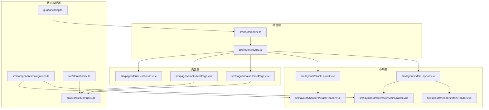
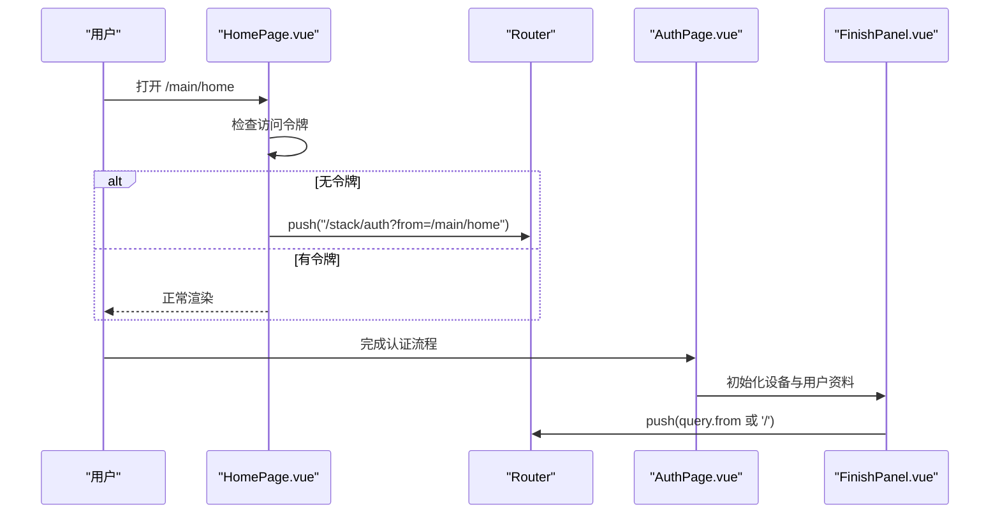
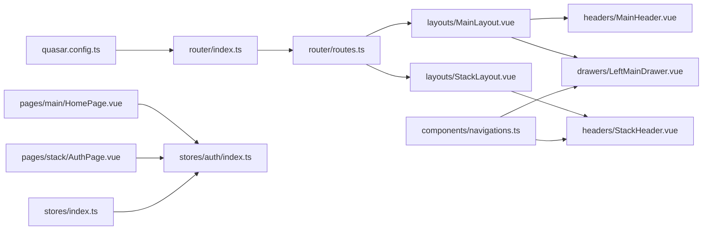

# 路由与导航设计

<cite>
**本文引用的文件**
- [src/router/index.ts](file://src/router/index.ts)
- [src/router/routes.ts](file://src/router/routes.ts)
- [src/layouts/MainLayout.vue](file://src/layouts/MainLayout.vue)
- [src/layouts/StackLayout.vue](file://src/layouts/StackLayout.vue)
- [src/layouts/headers/MainHeader.vue](file://src/layouts/headers/MainHeader.vue)
- [src/layouts/headers/StackHeader.vue](file://src/layouts/headers/StackHeader.vue)
- [src/layouts/drawers/LeftMainDrawer.vue](file://src/layouts/drawers/LeftMainDrawer.vue)
- [src/components/navigations.ts](file://src/components/navigations.ts)
- [src/pages/main/HomePage.vue](file://src/pages/main/HomePage.vue)
- [src/pages/stack/AuthPage.vue](file://src/pages/stack/AuthPage.vue)
- [src/pages/ErrorNotFound.vue](file://src/pages/ErrorNotFound.vue)
- [src/stores/auth/index.ts](file://src/stores/auth/index.ts)
- [src/stores/index.ts](file://src/stores/index.ts)
- [quasar.config.ts](file://quasar.config.ts)
</cite>

## 目录
1. [引言](#引言)
2. [项目结构](#项目结构)
3. [核心组件](#核心组件)
4. [架构总览](#架构总览)
5. [详细组件分析](#详细组件分析)
6. [依赖关系分析](#依赖关系分析)
7. [性能考虑](#性能考虑)
8. [故障排查指南](#故障排查指南)
9. [结论](#结论)
10. [附录](#附录)

## 引言
本设计文档围绕 Le Bot 前端的路由与导航体系展开，重点说明基于 Vue Router 5 的路由配置策略、嵌套路由与命名视图的实现、布局系统（MainLayout 与 StackLayout）的使用场景与切换逻辑、导航守卫与认证状态检查、路由懒加载与代码分割策略、导航状态管理以及面包屑导航的实现思路，并给出与 Quasar 布局系统的集成方式与响应式导航设计要点。

## 项目结构
- 路由定义集中在 src/router 下，包含路由表与路由器实例化。
- 布局层位于 src/layouts，包含主布局 MainLayout 与栈式布局 StackLayout，以及对应的头部、抽屉等子布局。
- 页面层位于 src/pages，按功能域划分 main 与 stack 两大空间。
- 导航配置通过 src/components/navigations.ts 统一维护，供抽屉与头部组件使用。
- 认证状态通过 Pinia store 管理，用于在页面挂载时进行访问控制。

图表来源
- [src/router/index.ts:1-38](file://src/router/index.ts#L1-L38)
- [src/router/routes.ts:1-160](file://src/router/routes.ts#L1-L160)
- [src/layouts/MainLayout.vue:1-51](file://src/layouts/MainLayout.vue#L1-L51)
- [src/layouts/StackLayout.vue:1-17](file://src/layouts/StackLayout.vue#L1-L17)
- [src/layouts/headers/MainHeader.vue:1-27](file://src/layouts/headers/MainHeader.vue#L1-L27)
- [src/layouts/headers/StackHeader.vue:1-38](file://src/layouts/headers/StackHeader.vue#L1-L38)
- [src/layouts/drawers/LeftMainDrawer.vue:1-35](file://src/layouts/drawers/LeftMainDrawer.vue#L1-L35)
- [src/components/navigations.ts:1-95](file://src/components/navigations.ts#L1-L95)
- [src/pages/main/HomePage.vue:1-54](file://src/pages/main/HomePage.vue#L1-L54)
- [src/pages/stack/AuthPage.vue:1-69](file://src/pages/stack/AuthPage.vue#L1-L69)
- [src/pages/ErrorNotFound.vue:1-26](file://src/pages/ErrorNotFound.vue#L1-L26)
- [src/stores/auth/index.ts:1-35](file://src/stores/auth/index.ts#L1-L35)
- [src/stores/index.ts:1-36](file://src/stores/index.ts#L1-L36)
- [quasar.config.ts:82-82](file://quasar.config.ts#L82-L82)

章节来源
- [src/router/index.ts:1-38](file://src/router/index.ts#L1-L38)
- [src/router/routes.ts:1-160](file://src/router/routes.ts#L1-L160)
- [quasar.config.ts:82-82](file://quasar.config.ts#L82-L82)

## 核心组件
- 路由器实例：根据构建模式选择历史或哈希模式，统一滚动行为。
- 路由表：定义主应用区（/main）与栈式导航区（/stack），支持多命名视图与嵌套路由。
- 布局系统：MainLayout 提供头部、左右抽屉、页内容与底部；StackLayout 提供头部与页内容。
- 导航配置：集中维护主区与栈区导航项，供抽屉与头部组件使用。
- 认证状态：通过 Pinia store 持久化存储访问令牌，页面在挂载时进行访问控制。

章节来源
- [src/router/index.ts:19-33](file://src/router/index.ts#L19-L33)
- [src/router/routes.ts:4-157](file://src/router/routes.ts#L4-L157)
- [src/layouts/MainLayout.vue:40-50](file://src/layouts/MainLayout.vue#L40-L50)
- [src/layouts/StackLayout.vue:7-14](file://src/layouts/StackLayout.vue#L7-L14)
- [src/components/navigations.ts:12-94](file://src/components/navigations.ts#L12-L94)
- [src/stores/auth/index.ts:6-34](file://src/stores/auth/index.ts#L6-L34)

## 架构总览
路由系统采用“双布局”策略：
- 主应用区（/main）：以 MainLayout 为主容器，移动端默认不启用左侧抽屉与顶部导航，通过命名视图注入 footer 或 header/leftDrawer。
- 栈式导航区（/stack）：以 StackLayout 为主容器，统一通过命名视图注入 header，页面内部负责返回与标题展示。

```mermaid
graph TB
Root["根路径 ''"] --> Redirect["重定向到 /main/home"]
subgraph "主应用区 /main"
MHome["/main/home<br/>命名视图: default/footer/header/leftDrawer"]
MMe["/main/me<br/>命名视图: default/footer/header/leftDrawer"]
end
subgraph "栈式导航区 /stack"
SAbout["/stack/about<br/>命名视图: default/header"]
SAuth["/stack/auth<br/>命名视图: default/header"]
SChat["/stack/chat<br/>命名视图: default/header"]
SGrowth["/stack/growth-data<br/>命名视图: default/header"]
SProfile["/stack/profile<br/>命名视图: default/header"]
SDevice["/stack/device-config<br/>嵌套路由: '' -> DeviceConfigPage"]
SSettings["/stack/settings<br/>嵌套路由: '' -> SettingsPage"]
SVoice["/stack/settings/voiceprint<br/>嵌套路由: '' -> VoiceprintPage"]
SVDetail["/stack/settings/voiceprint/detail/:personId"]
SVNew["/stack/settings/voiceprint/new"]
SVTest["/stack/settings/voiceprint/test"]
end
CatchAll["/:catchAll(.*)*"] --> NotFound["ErrorNotFound.vue"]
MHome --> MLayout["MainLayout.vue"]
MMe --> MLayout
SAbout --> SLayout["StackLayout.vue"]
SAuth --> SLayout
SChat --> SLayout
SGrowth --> SLayout
SProfile --> SLayout
SDevice --> SLayout
SSettings --> SLayout
SVoice --> SLayout
SVDetail --> SLayout
SVNew --> SLayout
SVTest --> SLayout
```

图表来源
- [src/router/routes.ts:4-157](file://src/router/routes.ts#L4-L157)
- [src/layouts/MainLayout.vue:40-50](file://src/layouts/MainLayout.vue#L40-L50)
- [src/layouts/StackLayout.vue:7-14](file://src/layouts/StackLayout.vue#L7-L14)
- [src/pages/ErrorNotFound.vue:1-26](file://src/pages/ErrorNotFound.vue#L1-L26)

## 详细组件分析

### 路由配置与嵌套路由
- 根路径重定向至 /main/home，确保首次进入即进入主应用区。
- /main 区域：
  - 使用 MainLayout 作为父级布局，子路由通过命名视图注入不同部件。
  - 移动端与桌面端的命名视图差异：移动端注入 footer，桌面端注入 header 与 leftDrawer。
- /stack 区域：
  - 使用 StackLayout 作为父级布局，子路由统一注入 header。
  - settings 子路由进一步嵌套 voiceprint，形成三级路由链路。
- 通配符路由兜底至 ErrorNotFound.vue。

章节来源
- [src/router/routes.ts:4-157](file://src/router/routes.ts#L4-L157)

### 布局系统与命名视图
- MainLayout：
  - 通过多个 router-view 实现命名视图：header、leftDrawer、default、rightDrawer、footer。
  - 使用 Quasar 的 useQuasar 获取屏幕尺寸，配合移动端判断决定注入部件。
  - 通过全局事件总线 bus 接收抽屉开关与最小化/最大化指令，集中控制抽屉状态。
- StackLayout：
  - 仅注入 header 与 default，简化栈式导航场景下的布局复杂度。
  - 通过 useQuasar 的 screen.lt.md 判断移动端显示。

章节来源
- [src/layouts/MainLayout.vue:1-51](file://src/layouts/MainLayout.vue#L1-L51)
- [src/layouts/StackLayout.vue:1-17](file://src/layouts/StackLayout.vue#L1-L17)

### 头部与抽屉导航
- MainHeader：
  - 左右两侧菜单按钮通过 bus 触发抽屉切换，实现跨布局联动。
- StackHeader：
  - 通过 useRoute 与 STACK_NAVIGATIONS 映射当前路由名称到标题，实现动态标题。
  - 提供返回按钮，使用 router.go(-1) 进行上一页导航。
- LeftMainDrawer：
  - 读取 MAIN_NAVIGATIONS，渲染导航项，点击后跳转对应路由名。

章节来源
- [src/layouts/headers/MainHeader.vue:1-27](file://src/layouts/headers/MainHeader.vue#L1-L27)
- [src/layouts/headers/StackHeader.vue:1-38](file://src/layouts/headers/StackHeader.vue#L1-L38)
- [src/layouts/drawers/LeftMainDrawer.vue:1-35](file://src/layouts/drawers/LeftMainDrawer.vue#L1-L35)
- [src/components/navigations.ts:12-94](file://src/components/navigations.ts#L12-L94)

### 导航守卫与认证控制
- 当前实现策略：
  - 在主应用区首页挂载时检查访问令牌是否存在，若无则重定向至 /stack/auth，并携带 from 参数指向原路径。
  - 完成认证流程后，FinishPanel 在成功初始化设备与用户资料后，根据 from 参数回退到原路径。
- 建议增强方案（概念性说明）：
  - 在路由表中增加全局前置守卫，统一拦截未登录访问受保护路由。
  - 对需要权限的角色路由，增加路由元信息与角色校验。
  - 结合 Pinia store 的持久化能力，在刷新后恢复认证状态并执行相应重定向。

图表来源
- [src/pages/main/HomePage.vue:24-28](file://src/pages/main/HomePage.vue#L24-L28)
- [src/pages/stack/AuthPage.vue:1-69](file://src/pages/stack/AuthPage.vue#L1-L69)
- [src/components/auth/FinishPanel.vue:39-47](file://src/components/auth/FinishPanel.vue#L39-L47)

章节来源
- [src/pages/main/HomePage.vue:24-28](file://src/pages/main/HomePage.vue#L24-L28)
- [src/pages/stack/AuthPage.vue:1-69](file://src/pages/stack/AuthPage.vue#L1-L69)
- [src/stores/auth/index.ts:6-34](file://src/stores/auth/index.ts#L6-L34)

### 路由懒加载与代码分割
- 路由表中的所有布局与页面均采用动态导入（import(...)）实现懒加载，按需加载模块，降低首屏体积。
- 配合 Quasar CLI 的打包策略与路由模式（hash/history），在生产环境可结合公共路径与基础路径优化资源加载。

章节来源
- [src/router/routes.ts:11-156](file://src/router/routes.ts#L11-L156)
- [quasar.config.ts:82-82](file://quasar.config.ts#L82-L82)

### 导航状态管理与面包屑
- 导航状态：
  - 抽屉状态通过全局事件总线 bus 与 MainLayout 协同，避免跨组件重复逻辑。
  - 移动端与桌面端的布局差异通过命名视图与平台检测实现。
- 面包屑实现建议（概念性说明）：
  - 可在 StackHeader 中根据路由层级生成面包屑，结合路由元信息与导航配置进行展示。
  - 对于深层嵌套路由（如 settings/voiceprint），可通过路由 name 与 params 动态拼接路径标签。

章节来源
- [src/layouts/MainLayout.vue:14-37](file://src/layouts/MainLayout.vue#L14-L37)
- [src/layouts/headers/StackHeader.vue:13-15](file://src/layouts/headers/StackHeader.vue#L13-L15)
- [src/components/navigations.ts:12-94](file://src/components/navigations.ts#L12-L94)

### 与 Quasar 布局系统的集成与响应式设计
- Quasar 布局：
  - 使用 q-layout 与 view 布局结构，配合命名视图实现灵活组合。
  - 通过 useQuasar 的 screen 与 dark 等能力实现响应式与主题适配。
- 路由模式与公共路径：
  - 通过 quasar.config.ts 的 vueRouterMode 控制路由模式（hash/history）。
  - 在不同部署环境下设置 base 与 publicPath，保证静态资源正确加载。

章节来源
- [src/layouts/MainLayout.vue:7-7](file://src/layouts/MainLayout.vue#L7-L7)
- [src/layouts/StackLayout.vue:4-4](file://src/layouts/StackLayout.vue#L4-L4)
- [quasar.config.ts:82-82](file://quasar.config.ts#L82-L82)
- [quasar.config.ts:98-104](file://quasar.config.ts#L98-L104)

## 依赖关系分析
- 路由器依赖路由表与构建模式配置，运行时根据环境选择历史或哈希模式。
- 路由表依赖布局与页面组件，通过动态导入实现解耦。
- 布局依赖 Quasar 组件库与全局事件总线，实现抽屉联动与响应式布局。
- 页面依赖 Pinia store 与路由工具，实现认证控制与导航回退。
- 导航配置被抽屉与头部组件消费，形成统一的导航语义。

图表来源
- [quasar.config.ts:82-82](file://quasar.config.ts#L82-L82)
- [src/router/index.ts:19-33](file://src/router/index.ts#L19-L33)
- [src/router/routes.ts:4-157](file://src/router/routes.ts#L4-L157)
- [src/layouts/MainLayout.vue:40-50](file://src/layouts/MainLayout.vue#L40-L50)
- [src/layouts/StackLayout.vue:7-14](file://src/layouts/StackLayout.vue#L7-L14)
- [src/layouts/headers/MainHeader.vue:1-27](file://src/layouts/headers/MainHeader.vue#L1-L27)
- [src/layouts/headers/StackHeader.vue:1-38](file://src/layouts/headers/StackHeader.vue#L1-L38)
- [src/layouts/drawers/LeftMainDrawer.vue:1-35](file://src/layouts/drawers/LeftMainDrawer.vue#L1-L35)
- [src/pages/main/HomePage.vue:14-28](file://src/pages/main/HomePage.vue#L14-L28)
- [src/pages/stack/AuthPage.vue:1-69](file://src/pages/stack/AuthPage.vue#L1-L69)
- [src/stores/auth/index.ts:6-34](file://src/stores/auth/index.ts#L6-L34)
- [src/stores/index.ts:26-35](file://src/stores/index.ts#L26-L35)
- [src/components/navigations.ts:12-94](file://src/components/navigations.ts#L12-L94)

章节来源
- [src/router/index.ts:19-33](file://src/router/index.ts#L19-L33)
- [src/router/routes.ts:4-157](file://src/router/routes.ts#L4-L157)
- [src/stores/auth/index.ts:6-34](file://src/stores/auth/index.ts#L6-L34)
- [src/stores/index.ts:26-35](file://src/stores/index.ts#L26-L35)

## 性能考虑
- 路由懒加载：所有布局与页面均采用动态导入，减少初始包体，提升首屏性能。
- 历史/哈希模式：根据部署环境选择合适模式，避免不必要的服务端配置。
- 命名视图：按需注入部件，避免不必要的 DOM 渲染。
- 响应式布局：利用 Quasar 的屏幕断点与条件渲染，减少移动端冗余部件。

## 故障排查指南
- 404 页面：通配符路由兜底至 ErrorNotFound.vue，检查路由是否遗漏或命名错误。
- 认证跳转异常：确认 HomePage 在挂载时的重定向逻辑与 from 参数传递是否正确。
- 抽屉联动失效：检查 bus 事件名称与 MainLayout 的监听逻辑是否一致。
- 栈式头部标题不显示：确认路由 name 与 STACK_NAVIGATIONS 的映射关系是否匹配。

章节来源
- [src/pages/ErrorNotFound.vue:1-26](file://src/pages/ErrorNotFound.vue#L1-L26)
- [src/pages/main/HomePage.vue:24-28](file://src/pages/main/HomePage.vue#L24-L28)
- [src/layouts/MainLayout.vue:14-37](file://src/layouts/MainLayout.vue#L14-L37)
- [src/layouts/headers/StackHeader.vue:13-15](file://src/layouts/headers/StackHeader.vue#L13-L15)
- [src/components/navigations.ts:39-94](file://src/components/navigations.ts#L39-L94)

## 结论
该路由与导航体系通过“双布局 + 命名视图 + 懒加载”的组合，实现了主应用区与栈式导航区的清晰分离与高效渲染。结合 Quasar 布局系统与全局事件总线，抽屉联动与响应式布局得以简化实现。认证控制目前在页面级完成，建议后续引入全局前置守卫以统一处理权限与角色校验，进一步提升安全性与一致性。

## 附录
- 路由配置示例（路径参考）
  - 根路径重定向：[src/router/routes.ts:6-8](file://src/router/routes.ts#L6-L8)
  - 主应用区路由：[src/router/routes.ts:10-40](file://src/router/routes.ts#L10-L40)
  - 栈式导航区路由：[src/router/routes.ts:42-149](file://src/router/routes.ts#L42-L149)
  - 通配符兜底：[src/router/routes.ts:153-156](file://src/router/routes.ts#L153-L156)
- 布局与命名视图
  - MainLayout 命名视图：[src/layouts/MainLayout.vue:42-48](file://src/layouts/MainLayout.vue#L42-L48)
  - StackLayout 命名视图：[src/layouts/StackLayout.vue:9-12](file://src/layouts/StackLayout.vue#L9-L12)
- 导航配置
  - 主区导航项：[src/components/navigations.ts:12-37](file://src/components/navigations.ts#L12-L37)
  - 栈区导航项：[src/components/navigations.ts:39-94](file://src/components/navigations.ts#L39-L94)
- 认证与重定向
  - 主页认证检查：[src/pages/main/HomePage.vue:24-28](file://src/pages/main/HomePage.vue#L24-L28)
  - 完成面板回退：[src/components/auth/FinishPanel.vue:44-47](file://src/components/auth/FinishPanel.vue#L44-L47)
- Quasar 集成
  - 路由模式配置：[quasar.config.ts:82-82](file://quasar.config.ts#L82-L82)
  - 基础路径设置：[quasar.config.ts:98-104](file://quasar.config.ts#L98-L104)