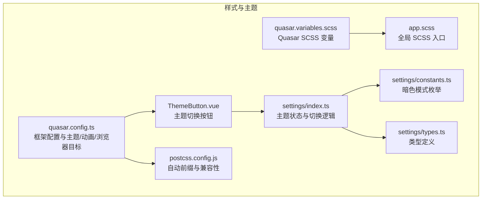
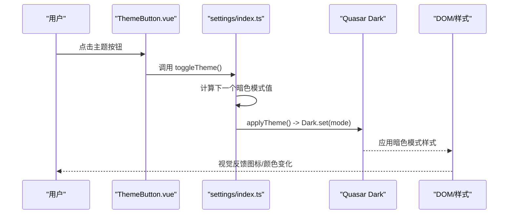
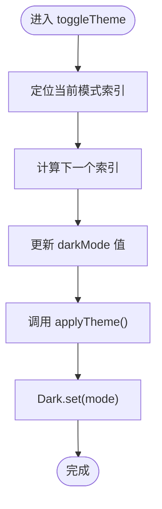
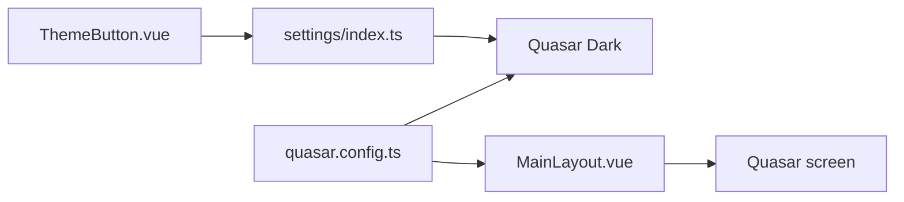

# 样式与主题系统

<cite>
**本文引用的文件**
- [quasar.variables.scss](file://src/css/quasar.variables.scss)
- [app.scss](file://src/css/app.scss)
- [quasar.config.ts](file://quasar.config.ts)
- [ThemeButton.vue](file://src/components/ThemeButton.vue)
- [index.ts](file://src/stores/settings/index.ts)
- [constants.ts](file://src/stores/settings/constants.ts)
- [types.ts](file://src/stores/settings/types.ts)
- [postcss.config.js](file://postcss.config.js)
- [MainLayout.vue](file://src/layouts/MainLayout.vue)
- [HomePage.vue](file://src/pages/main/HomePage.vue)
- [DeviceCard.vue](file://src/components/home/DeviceCard.vue)
- [TopicCard.vue](file://src/components/home/TopicCard.vue)
</cite>

## 目录
1. [简介](#简介)
2. [项目结构](#项目结构)
3. [核心组件](#核心组件)
4. [架构总览](#架构总览)
5. [详细组件分析](#详细组件分析)
6. [依赖关系分析](#依赖关系分析)
7. [性能考虑](#性能考虑)
8. [故障排查指南](#故障排查指南)
9. [结论](#结论)
10. [附录](#附录)

## 简介
本文件系统化梳理 Le Bot 前端的样式与主题体系，围绕 Quasar 框架的主题定制与 SCSS 架构展开，涵盖以下要点：
- CSS 变量系统与颜色主题配置
- 响应式断点与屏幕尺寸使用
- 组件样式隔离与全局样式管理
- 暗色模式实现、主题切换机制与用户偏好持久化
- 动画与过渡效果、视觉反馈与调试技巧
- 与 Quasar 组件库的集成与自定义覆盖方法
- 性能优化与浏览器兼容性策略

## 项目结构
样式与主题系统主要由以下部分组成：
- 全局 SCSS 变量与入口：src/css/quasar.variables.scss、src/css/app.scss
- Quasar 配置：quasar.config.ts（含框架主题、动画、浏览器目标等）
- 主题切换与状态管理：src/stores/settings/index.ts、constants.ts、types.ts
- 主题按钮组件：src/components/ThemeButton.vue
- 布局与页面示例：src/layouts/MainLayout.vue、src/pages/main/HomePage.vue
- 组件示例：src/components/home/DeviceCard.vue、src/components/home/TopicCard.vue
- PostCSS 自动前缀与兼容性：postcss.config.js

图表来源
- [quasar.variables.scss:1-26](file://src/css/quasar.variables.scss#L1-L26)
- [app.scss:1-2](file://src/css/app.scss#L1-L2)
- [quasar.config.ts:147-166](file://quasar.config.ts#L147-L166)
- [ThemeButton.vue:1-28](file://src/components/ThemeButton.vue#L1-L28)
- [index.ts:1-57](file://src/stores/settings/index.ts#L1-L57)
- [constants.ts:1-4](file://src/stores/settings/constants.ts#L1-L4)
- [types.ts:1-4](file://src/stores/settings/types.ts#L1-L4)
- [postcss.config.js:1-30](file://postcss.config.js#L1-L30)

章节来源
- [quasar.variables.scss:1-26](file://src/css/quasar.variables.scss#L1-L26)
- [app.scss:1-2](file://src/css/app.scss#L1-L2)
- [quasar.config.ts:147-166](file://quasar.config.ts#L147-L166)
- [ThemeButton.vue:1-28](file://src/components/ThemeButton.vue#L1-L28)
- [index.ts:1-57](file://src/stores/settings/index.ts#L1-L57)
- [constants.ts:1-4](file://src/stores/settings/constants.ts#L1-L4)
- [types.ts:1-4](file://src/stores/settings/types.ts#L1-L4)
- [postcss.config.js:1-30](file://postcss.config.js#L1-L30)

## 核心组件
- Quasar SCSS 变量：集中定义主色、次色、强调色、暗色系与语义色，作为全局样式基础。
- 全局 SCSS 入口：app.scss 作为应用级全局样式入口，可在此处引入变量并扩展通用样式。
- Quasar 配置：在 framework.config.dark 中启用暗色模式“auto”；在 build.target 中声明浏览器兼容目标；在 animations 中控制动画加载范围。
- 主题状态与切换：Pinia store 负责维护当前暗色模式、派生主题图标与颜色，并通过 Quasar Dark.set 应用。
- 主题按钮：基于 Quasar 按钮与工具提示组件，绑定主题切换动作与动态图标/颜色。
- 响应式断点：通过 Quasar 的 screen 工具在布局中判断断点，如 screen.lt.md 控制移动端行为。

章节来源
- [quasar.variables.scss:15-25](file://src/css/quasar.variables.scss#L15-L25)
- [quasar.config.ts:147-166](file://quasar.config.ts#L147-L166)
- [index.ts:12-39](file://src/stores/settings/index.ts#L12-L39)
- [ThemeButton.vue:14-24](file://src/components/ThemeButton.vue#L14-L24)
- [MainLayout.vue:7-49](file://src/layouts/MainLayout.vue#L7-L49)

## 架构总览
下图展示从用户交互到样式生效的完整链路：主题按钮触发状态变更，Pinia store 更新暗色模式，Quasar Dark.apply 生效，全局样式随之更新。

图表来源
- [ThemeButton.vue:7-8](file://src/components/ThemeButton.vue#L7-L8)
- [index.ts:35-39](file://src/stores/settings/index.ts#L35-L39)
- [index.ts:31-33](file://src/stores/settings/index.ts#L31-L33)

章节来源
- [ThemeButton.vue:1-28](file://src/components/ThemeButton.vue#L1-L28)
- [index.ts:1-57](file://src/stores/settings/index.ts#L1-L57)

## 详细组件分析

### Quasar SCSS 变量系统
- 作用：集中定义品牌主色、次色、强调色以及暗色系与语义色，供全局与组件使用。
- 使用方式：在 .vue 单文件或 app.scss 中直接使用变量名，无需重复声明。
- 扩展建议：新增业务色板时，优先复用语义变量命名，避免硬编码颜色值。

章节来源
- [quasar.variables.scss:15-25](file://src/css/quasar.variables.scss#L15-L25)

### 全局 SCSS 入口与样式隔离
- app.scss：作为全局样式入口，可在此处导入变量并编写全局选择器、重置样式或通用类。
- 组件样式隔离：采用 <style scoped>，确保组件内样式不泄漏至外部；若需跨组件共享样式，建议抽取为全局类或在 app.scss 中定义。

章节来源
- [app.scss:1-2](file://src/css/app.scss#L1-L2)
- [DeviceCard.vue:30](file://src/components/home/DeviceCard.vue#L30)
- [TopicCard.vue:40](file://src/components/home/TopicCard.vue#L40)

### 主题状态与切换机制
- 暗色模式枚举：按顺序循环切换 false → 'auto' → true → false。
- 主题图标与颜色：根据当前模式返回对应图标与文本色，便于按钮呈现一致的视觉反馈。
- 应用机制：通过 Quasar Dark.set 将模式写入 DOM 并驱动全局样式更新。

图表来源
- [index.ts:35-39](file://src/stores/settings/index.ts#L35-L39)
- [index.ts:31-33](file://src/stores/settings/index.ts#L31-L33)
- [constants.ts:3](file://src/stores/settings/constants.ts#L3)

章节来源
- [index.ts:12-29](file://src/stores/settings/index.ts#L12-L29)
- [constants.ts:1-4](file://src/stores/settings/constants.ts#L1-L4)

### 主题按钮组件
- 行为：点击后触发 store.toggleTheme；图标与文本色随当前模式动态变化。
- 交互：配合 Quasar 工具提示组件，提供“切换主题”的文案提示。
- 设计：使用扁平圆形按钮，符合移动端操作习惯。

章节来源
- [ThemeButton.vue:14-24](file://src/components/ThemeButton.vue#L14-L24)
- [ThemeButton.vue:10](file://src/components/ThemeButton.vue#L10)

### 响应式断点与屏幕尺寸使用
- 在布局组件中通过 useQuasar().screen 获取断点信息，例如 screen.lt.md 判断是否小于 md 断点。
- 页面与布局根据断点调整导航抽屉、间距与排版，保证多端一致性。

章节来源
- [MainLayout.vue:7](file://src/layouts/MainLayout.vue#L7)
- [MainLayout.vue:42-48](file://src/layouts/MainLayout.vue#L42-L48)

### 动画与过渡效果
- Quasar 动画：在 quasar.config.ts 中通过 animations 字段控制动画加载范围，默认为空数组以减少体积。
- 组件过渡：主题按钮的工具提示使用 transition-show/transition-hide 属性实现轻量过渡。
- 建议：仅启用必要的动画，避免对低端设备造成性能压力。

章节来源
- [quasar.config.ts:164-166](file://quasar.config.ts#L164-L166)
- [ThemeButton.vue:19-20](file://src/components/ThemeButton.vue#L19-L20)

### 与 Quasar 组件库的集成与自定义覆盖
- 组件使用：广泛使用 Quasar 的卡片、按钮、选择器、骨架屏等组件，统一风格与交互。
- 自定义覆盖：通过 SCSS 变量与 scoped 样式实现局部覆盖；全局覆盖建议在 app.scss 中进行。
- 图标与字体：在 quasar.config.ts 中配置图标集与 Roboto 字体，确保一致的视觉语言。

章节来源
- [quasar.config.ts:24-35](file://quasar.config.ts#L24-L35)
- [HomePage.vue:32-49](file://src/pages/main/HomePage.vue#L32-L49)
- [DeviceCard.vue:8-27](file://src/components/home/DeviceCard.vue#L8-L27)
- [TopicCard.vue:17-37](file://src/components/home/TopicCard.vue#L17-L37)

## 依赖关系分析
- 主题切换链路：ThemeButton.vue 依赖 settings store；store 依赖 Quasar Dark；Dark.set 影响全局样式。
- 配置依赖：quasar.config.ts 决定框架主题、动画与浏览器兼容目标，间接影响运行时表现。
- 响应式依赖：MainLayout.vue 依赖 Quasar screen 工具，决定布局行为。

图表来源
- [ThemeButton.vue:7-8](file://src/components/ThemeButton.vue#L7-L8)
- [index.ts:31-33](file://src/stores/settings/index.ts#L31-L33)
- [quasar.config.ts:147-166](file://quasar.config.ts#L147-L166)
- [MainLayout.vue:7](file://src/layouts/MainLayout.vue#L7)

章节来源
- [ThemeButton.vue:1-28](file://src/components/ThemeButton.vue#L1-L28)
- [index.ts:1-57](file://src/stores/settings/index.ts#L1-L57)
- [quasar.config.ts:147-166](file://quasar.config.ts#L147-L166)
- [MainLayout.vue:1-51](file://src/layouts/MainLayout.vue#L1-L51)

## 性能考虑
- 减少动画体积：在 quasar.config.ts 中将 animations 置空，仅在需要时按需引入。
- 浏览器兼容：在 quasar.config.ts 的 build.target 中声明目标浏览器版本，结合 postcss.config.js 的 autoprefixer 自动添加厂商前缀，兼顾兼容与体积。
- 样式打包：利用 SCSS 变量与 scoped 样式，避免重复样式与全局污染，降低运行时样式计算成本。

章节来源
- [quasar.config.ts:71-74](file://quasar.config.ts#L71-L74)
- [postcss.config.js:9-20](file://postcss.config.js#L9-L20)

## 故障排查指南
- 暗色模式未生效
  - 检查 quasar.config.ts 中 framework.config.dark 是否正确配置。
  - 确认 store.applyTheme 是否被调用，且 Dark.set(mode) 参数有效。
  - 排查用户偏好持久化是否正常（Pinia 持久化开关）。
- 主题按钮无反应
  - 确认 ThemeButton.vue 绑定的 toggleTheme 方法存在且可调用。
  - 检查 store 中 themeProps 的派生逻辑是否正确。
- 响应式布局异常
  - 检查 useQuasar().screen 的断点使用是否符合预期。
  - 确认路由视图传参 mobile 是否正确传递。
- 动画卡顿
  - 检查 animations 是否过多或过大，必要时清空或按需引入。
  - 关注硬件加速与合成层使用，避免过度重绘。

章节来源
- [quasar.config.ts:147-166](file://quasar.config.ts#L147-L166)
- [index.ts:31-39](file://src/stores/settings/index.ts#L31-L39)
- [ThemeButton.vue:14-24](file://src/components/ThemeButton.vue#L14-L24)
- [MainLayout.vue:42-48](file://src/layouts/MainLayout.vue#L42-L48)

## 结论
本项目以 Quasar 为核心，通过 SCSS 变量与 Pinia store 实现了清晰的主题与样式体系：变量集中管理、状态驱动切换、组件样式隔离、响应式断点适配与动画按需加载。配合浏览器兼容与性能优化策略，整体具备良好的可维护性与扩展性。后续可在保持现有架构的前提下，逐步完善动画资源与暗色模式下的细节对比度，提升用户体验。

## 附录
- 最佳实践
  - 优先使用语义化变量与 Quasar 组件，减少自定义样式。
  - 严格区分全局与局部样式，避免样式冲突。
  - 通过 store 持久化用户偏好，确保刷新后状态一致。
- 调试技巧
  - 使用浏览器开发者工具检查 DOM 上的暗色模式类名与样式来源。
  - 在 app.scss 中临时增加边框或背景色，快速定位组件边界。
  - 对复杂布局使用断点标记（如在页面容器上添加占位元素）辅助调试。