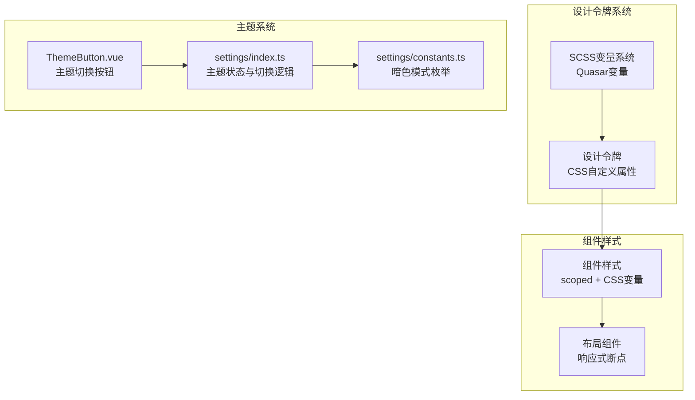
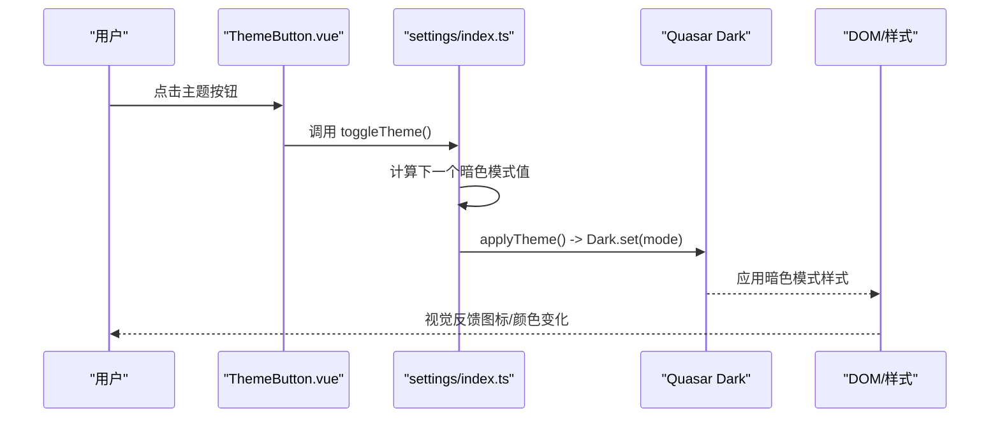
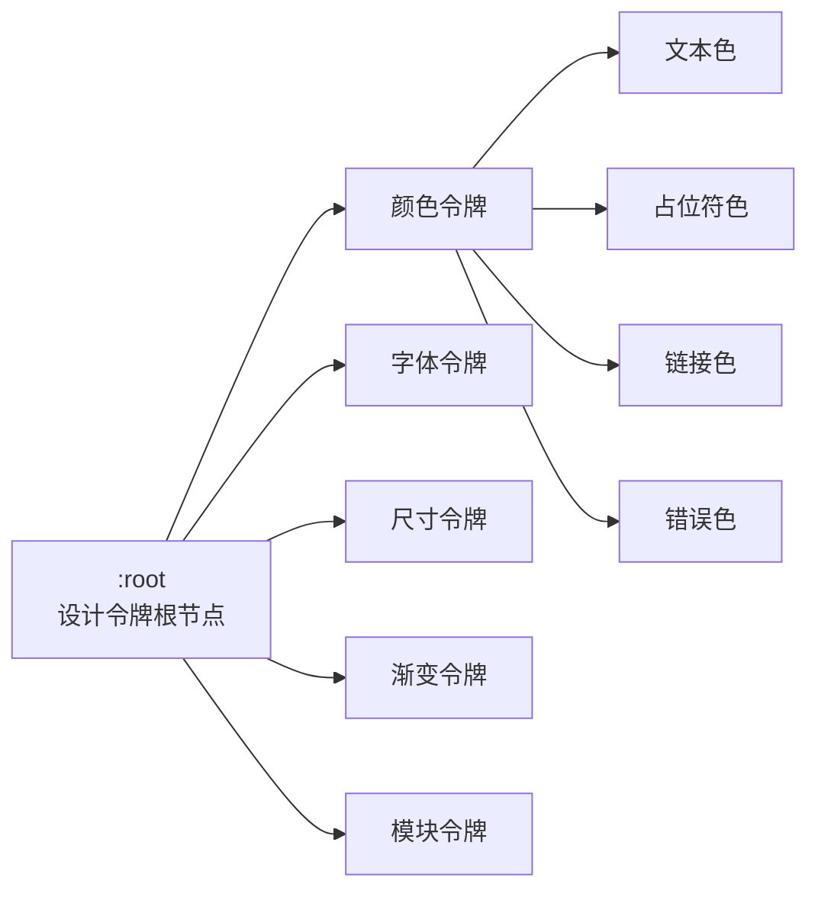
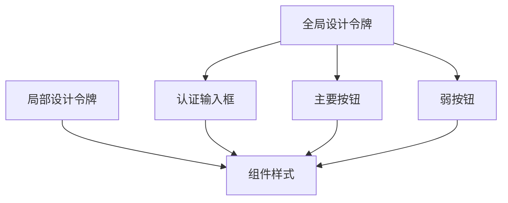
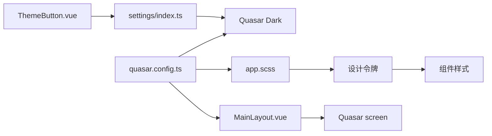

# 样式与主题系统

<cite>
**本文引用的文件**
- [quasar.variables.scss](file://src/css/quasar.variables.scss)
- [app.scss](file://src/css/app.scss)
- [quasar.config.ts](file://quasar.config.ts)
- [ThemeButton.vue](file://src/components/ThemeButton.vue)
- [index.ts](file://src/stores/settings/index.ts)
- [constants.ts](file://src/stores/settings/constants.ts)
- [types.ts](file://src/stores/settings/types.ts)
- [postcss.config.js](file://postcss.config.js)
- [MainLayout.vue](file://src/layouts/MainLayout.vue)
- [HomePage.vue](file://src/pages/main/HomePage.vue)
- [DeviceCard.vue](file://src/components/home/DeviceCard.vue)
- [TopicCard.vue](file://src/components/home/TopicCard.vue)
- [SignInOrSignUpPanel.vue](file://src/components/auth/SignInOrSignUpPanel.vue)
- [FinishPanel.vue](file://src/components/auth/FinishPanel.vue)
- [ProfileCard.vue](file://src/components/me/ProfileCard.vue)
</cite>

## 更新摘要
**变更内容**
- 新增完整的CSS自定义属性设计系统，建立170行的SCSS框架
- 引入设计令牌系统，涵盖颜色、字体、间距、组件尺寸等设计令牌
- 实现基于CSS变量的样式隔离和主题切换机制
- 完善组件级别的样式设计令牌覆盖
- 增强暗色模式下的对比度和视觉层次

## 目录
1. [简介](#简介)
2. [项目结构](#项目结构)
3. [核心组件](#核心组件)
4. [架构总览](#架构总览)
5. [详细组件分析](#详细组件分析)
6. [设计令牌系统](#设计令牌系统)
7. [依赖关系分析](#依赖关系分析)
8. [性能考虑](#性能考虑)
9. [故障排查指南](#故障排查指南)
10. [结论](#结论)
11. [附录](#附录)

## 简介
本文件系统化梳理 Le Bot 前端的样式与主题体系，围绕全新的设计令牌系统与 Quasar 框架主题定制展开，涵盖以下要点：
- **设计令牌系统**：完整的CSS自定义属性设计令牌，包括颜色、字体、间距、组件尺寸等
- **样式隔离机制**：基于CSS变量的组件样式隔离与主题切换
- **暗色模式实现**：完整的暗色模式支持与用户偏好持久化
- **响应式设计**：基于Quasar屏幕工具的响应式断点适配
- **动画与过渡**：轻量级动画效果与视觉反馈
- **性能优化**：CSS变量与SCSS混合架构的性能考量

## 项目结构
样式与主题系统主要由以下部分组成：
- **设计令牌系统**：src/css/app.scss中的CSS自定义属性设计令牌
- **Quasar变量系统**：src/css/quasar.variables.scss中的SCSS变量
- **全局样式入口**：app.scss作为应用级全局样式入口
- **Quasar配置**：quasar.config.ts（含框架主题、动画、浏览器目标等）
- **主题切换与状态管理**：src/stores/settings/index.ts、constants.ts、types.ts
- **主题按钮组件**：src/components/ThemeButton.vue
- **布局与页面示例**：src/layouts/MainLayout.vue、src/pages/main/HomePage.vue
- **组件示例**：src/components/home/DeviceCard.vue、src/components/home/TopicCard.vue、src/components/auth/SignInOrSignUpPanel.vue
- **PostCSS配置**：postcss.config.js（自动前缀与兼容性）

**图表来源**
- [app.scss:7-71](file://src/css/app.scss#L7-L71)
- [quasar.variables.scss:15-25](file://src/css/quasar.variables.scss#L15-L25)
- [ThemeButton.vue:14-24](file://src/components/ThemeButton.vue#L14-L24)
- [index.ts:35-39](file://src/stores/settings/index.ts#L35-L39)

## 核心组件
- **设计令牌系统**：在`:root`选择器中定义完整的CSS自定义属性，包括颜色、字体、间距、组件尺寸等设计令牌
- **SCSS变量系统**：集中定义品牌主色、次色、强调色以及暗色系与语义色，作为全局样式基础
- **全局SCSS入口**：app.scss作为应用级全局样式入口，可在此处引入变量并扩展通用样式
- **Quasar配置**：在framework.config.dark中启用暗色模式"auto"；在build.target中声明浏览器兼容目标；在animations中控制动画加载范围
- **主题状态与切换**：Pinia store负责维护当前暗色模式、派生主题图标与颜色，并通过Quasar Dark.set应用
- **主题按钮**：基于Quasar按钮与工具提示组件，绑定主题切换动作与动态图标/颜色
- **响应式断点**：通过Quasar的screen工具在布局中判断断点，如screen.lt.md控制移动端行为

**章节来源**
- [app.scss:7-71](file://src/css/app.scss#L7-L71)
- [quasar.variables.scss:15-25](file://src/css/quasar.variables.scss#L15-L25)
- [quasar.config.ts:147-166](file://quasar.config.ts#L147-L166)
- [index.ts:12-39](file://src/stores/settings/index.ts#L12-L39)
- [ThemeButton.vue:14-24](file://src/components/ThemeButton.vue#L14-L24)
- [MainLayout.vue:7-49](file://src/layouts/MainLayout.vue#L7-L49)

## 架构总览
下图展示从用户交互到样式生效的完整链路：主题按钮触发状态变更，Pinia store更新暗色模式，Quasar Dark.apply生效，全局样式随之更新。

**图表来源**
- [ThemeButton.vue:7-8](file://src/components/ThemeButton.vue#L7-L8)
- [index.ts:35-39](file://src/stores/settings/index.ts#L35-L39)
- [index.ts:31-33](file://src/stores/settings/index.ts#L31-L33)

## 详细组件分析

### 设计令牌系统
**更新** 新增完整的CSS自定义属性设计系统，建立170行的SCSS框架

设计令牌系统在`:root`选择器中定义了完整的CSS自定义属性，包括：
- **颜色令牌**：文本色、占位符色、链接色、错误色、弱色、白色、标语色等
- **字体令牌**：字体族、正文字号、按钮字号、标语字号、条款字号等
- **尺寸令牌**：输入框宽度、高度、圆角半径、按钮宽度、高度、圆角半径、Logo尺寸、头像尺寸等
- **渐变令牌**：页面背景渐变色
- **模块专用令牌**：我的模块的颜色、卡片背景、圆角半径、菜单行高、标题色、危险背景色、头像尺寸和边框等

**图表来源**
- [app.scss:7-71](file://src/css/app.scss#L7-L71)

**章节来源**
- [app.scss:7-71](file://src/css/app.scss#L7-L71)

### SCSS变量系统
- **作用**：集中定义品牌主色、次色、强调色以及暗色系与语义色，供全局与组件使用
- **使用方式**：在.vue单文件或app.scss中直接使用变量名，无需重复声明
- **扩展建议**：新增业务色板时，优先复用语义变量命名，避免硬编码颜色值

**章节来源**
- [quasar.variables.scss:15-25](file://src/css/quasar.variables.scss#L15-L25)

### 全局SCSS入口与样式隔离
- **app.scss**：作为全局样式入口，可在此处导入变量并编写全局选择器、重置样式或通用类
- **组件样式隔离**：采用<style scoped>，确保组件内样式不泄漏至外部；若需跨组件共享样式，建议抽取为全局类或在app.scss中定义
- **设计令牌覆盖**：组件可在局部作用域中重新定义CSS变量，实现设计令牌的局部覆盖

**章节来源**
- [app.scss:1-256](file://src/css/app.scss#L1-L256)
- [SignInOrSignUpPanel.vue:227-426](file://src/components/auth/SignInOrSignUpPanel.vue#L227-L426)
- [FinishPanel.vue:81-141](file://src/components/auth/FinishPanel.vue#L81-L141)

### 主题状态与切换机制
- **暗色模式枚举**：按顺序循环切换false → 'auto' → true → false
- **主题图标与颜色**：根据当前模式返回对应图标与文本色，便于按钮呈现一致的视觉反馈
- **应用机制**：通过Quasar Dark.set将模式写入DOM并驱动全局样式更新

**图表来源**
- [index.ts:35-39](file://src/stores/settings/index.ts#L35-L39)
- [index.ts:31-33](file://src/stores/settings/index.ts#L31-L33)
- [constants.ts:3](file://src/stores/settings/constants.ts#L3)

**章节来源**
- [index.ts:12-29](file://src/stores/settings/index.ts#L12-L29)
- [constants.ts:1-4](file://src/stores/settings/constants.ts#L1-L4)

### 主题按钮组件
- **行为**：点击后触发store.toggleTheme；图标与文本色随当前模式动态变化
- **交互**：配合Quasar工具提示组件，提供"切换主题"的文案提示
- **设计**：使用扁平圆形按钮，符合移动端操作习惯

**章节来源**
- [ThemeButton.vue:14-24](file://src/components/ThemeButton.vue#L14-L24)
- [ThemeButton.vue:10](file://src/components/ThemeButton.vue#L10)

### 响应式断点与屏幕尺寸使用
- **在布局组件中通过useQuasar().screen获取断点信息**，例如screen.lt.md判断是否小于md断点
- **页面与布局根据断点调整导航抽屉、间距与排版**，保证多端一致性

**章节来源**
- [MainLayout.vue:7](file://src/layouts/MainLayout.vue#L7)
- [MainLayout.vue:42-48](file://src/layouts/MainLayout.vue#L42-L48)

### 动画与过渡效果
- **Quasar动画**：在quasar.config.ts中通过animations字段控制动画加载范围，默认为空数组以减少体积
- **组件过渡**：主题按钮的工具提示使用transition-show/transition-hide属性实现轻量过渡
- **建议**：仅启用必要的动画，避免对低端设备造成性能压力

**章节来源**
- [quasar.config.ts:164-166](file://quasar.config.ts#L164-L166)
- [ThemeButton.vue:19-20](file://src/components/ThemeButton.vue#L19-L20)

### 与Quasar组件库的集成与自定义覆盖
- **组件使用**：广泛使用Quasar的卡片、按钮、选择器、骨架屏等组件，统一风格与交互
- **自定义覆盖**：通过SCSS变量与scoped样式实现局部覆盖；全局覆盖建议在app.scss中进行
- **图标与字体**：在quasar.config.ts中配置图标集与Roboto字体，确保一致的视觉语言

**章节来源**
- [quasar.config.ts:24-35](file://quasar.config.ts#L24-L35)
- [HomePage.vue:32-49](file://src/pages/main/HomePage.vue#L32-L49)
- [DeviceCard.vue:8-27](file://src/components/home/DeviceCard.vue#L8-L27)
- [TopicCard.vue:17-37](file://src/components/home/TopicCard.vue#L17-L37)

## 设计令牌系统

### 设计令牌架构
**更新** 全新的设计令牌系统，提供完整的样式设计规范

设计令牌系统采用CSS自定义属性（CSS Custom Properties）实现，具有以下特点：
- **全局继承**：`:root`中的设计令牌可被所有组件继承
- **局部覆盖**：组件可在局部作用域中重新定义CSS变量，实现设计令牌的局部覆盖
- **类型化设计**：按功能分类组织设计令牌，包括颜色、字体、尺寸、渐变等

### 颜色设计令牌
颜色设计令牌涵盖了完整的视觉色彩体系：
- **文本色**：`--clr-text`、`--clr-placeholder`、`--clr-link`、`--clr-error`、`--clr-weak`、`--clr-white`
- **品牌色**：`--clr-slogan-entry`用于标语入口
- **按钮色**：`--clr-btn-primary-bg`、`--clr-btn-weak-border`、`--clr-btn-weak-text`
- **输入框色**：`--clr-input-bg`、`--clr-input-border`
- **动作链接色**：`--clr-action-link`、`--clr-action-link-disabled`
- **页面背景色**：`--clr-page-bg-neutral`、`--clr-card-bg`
- **危险色**：`--clr-danger-bg`

### 字体设计令牌
字体设计令牌提供了完整的排版规范：
- **字体族**：`--font-family`指定AlibabaPuHuiTi、PingFang SC、Microsoft YaHei等字体栈
- **字号**：`--font-size-body`、`--font-size-btn`、`--font-size-slogan`、`--font-size-slogan-entry`、`--font-size-terms`
- **行高**：`--line-height-body`、`--line-height-btn`
- **动作链接**：`--font-size-action-link`、`--font-weight-action-link`、`--line-height-action-link`

### 尺寸设计令牌
尺寸设计令牌定义了组件的标准尺寸规范：
- **输入框**：`--input-width`、`--input-height`、`--input-radius`
- **按钮**：`--btn-width`、`--btn-height`、`--btn-radius`
- **媒体**：`--logo-size`、`--avatar-size`
- **卡片**：`--card-radius`
- **菜单**：`--menu-row-height`
- **个人资料**：`--profile-avatar-size`、`--profile-avatar-border`

### 渐变设计令牌
渐变设计令牌提供了页面背景的渐变效果：
- **页面背景渐变**：`--gradient-page-bg`实现从浅蓝到白色的垂直渐变

### 模块专用设计令牌
模块专用设计令牌针对特定功能模块提供设计规范：
- **我的模块**：`--clr-page-bg-neutral`、`--clr-card-bg`、`--card-radius`、`--menu-row-height`、`--clr-caption`、`--clr-danger-bg`
- **个人资料**：`--profile-avatar-size`、`--profile-avatar-border`

### 组件样式模式
**更新** 组件现在使用设计令牌系统实现统一的样式规范

组件采用了两种主要的样式模式：
1. **全局设计令牌模式**：使用`.auth-input-base`、`.auth-btn-primary`、`.auth-btn-weak`等全局类，这些类直接引用设计令牌
2. **局部设计令牌模式**：组件在局部作用域中重新定义CSS变量，实现设计令牌的局部覆盖

**图表来源**
- [app.scss:98-170](file://src/css/app.scss#L98-L170)
- [SignInOrSignUpPanel.vue:227-426](file://src/components/auth/SignInOrSignUpPanel.vue#L227-L426)

**章节来源**
- [app.scss:7-71](file://src/css/app.scss#L7-L71)
- [app.scss:98-170](file://src/css/app.scss#L98-L170)
- [SignInOrSignUpPanel.vue:227-426](file://src/components/auth/SignInOrSignUpPanel.vue#L227-L426)

## 依赖关系分析
- **主题切换链路**：ThemeButton.vue依赖settings store；store依赖Quasar Dark；Dark.set影响全局样式
- **设计令牌依赖**：组件样式依赖app.scss中的设计令牌；SCSS变量依赖quasar.variables.scss
- **配置依赖**：quasar.config.ts决定框架主题、动画与浏览器兼容目标，间接影响运行时表现
- **响应式依赖**：MainLayout.vue依赖Quasar screen工具，决定布局行为

**图表来源**
- [ThemeButton.vue:7-8](file://src/components/ThemeButton.vue#L7-L8)
- [index.ts:31-33](file://src/stores/settings/index.ts#L31-L33)
- [quasar.config.ts:147-166](file://quasar.config.ts#L147-L166)
- [MainLayout.vue:7](file://src/layouts/MainLayout.vue#L7)

**章节来源**
- [ThemeButton.vue:1-28](file://src/components/ThemeButton.vue#L1-L28)
- [index.ts:1-57](file://src/stores/settings/index.ts#L1-L57)
- [quasar.config.ts:147-166](file://quasar.config.ts#L147-L166)
- [MainLayout.vue:1-51](file://src/layouts/MainLayout.vue#L1-L51)

## 性能考虑
- **减少动画体积**：在quasar.config.ts中将animations置空，仅在需要时按需引入
- **浏览器兼容**：在quasar.config.ts的build.target中声明目标浏览器版本，结合postcss.config.js的autoprefixer自动添加厂商前缀，兼顾兼容与体积
- **样式打包**：利用SCSS变量与scoped样式，避免重复样式与全局污染，降低运行时样式计算成本
- **CSS变量性能**：现代浏览器对CSS变量有良好支持，相比SCSS编译更高效
- **设计令牌缓存**：CSS变量在运行时解析，但浏览器会缓存解析结果，性能开销较小

**章节来源**
- [quasar.config.ts:71-74](file://quasar.config.ts#L71-L74)
- [postcss.config.js:9-20](file://postcss.config.js#L9-L20)

## 故障排查指南
- **暗色模式未生效**
  - 检查quasar.config.ts中framework.config.dark是否正确配置
  - 确认store.applyTheme是否被调用，且Dark.set(mode)参数有效
  - 排查用户偏好持久化是否正常（Pinia持久化开关）
- **主题按钮无反应**
  - 确认ThemeButton.vue绑定的toggleTheme方法存在且可调用
  - 检查store中themeProps的派生逻辑是否正确
- **响应式布局异常**
  - 检查useQuasar().screen的断点使用是否符合预期
  - 确认路由视图传参mobile是否正确传递
- **动画卡顿**
  - 检查animations是否过多或过大，必要时清空或按需引入
  - 关注硬件加速与合成层使用，避免过度重绘
- **设计令牌不生效**
  - 确认CSS变量名称拼写正确
  - 检查组件是否正确引用了设计令牌
  - 验证CSS变量的作用域是否正确

**章节来源**
- [quasar.config.ts:147-166](file://quasar.config.ts#L147-L166)
- [index.ts:31-39](file://src/stores/settings/index.ts#L31-L39)
- [ThemeButton.vue:14-24](file://src/components/ThemeButton.vue#L14-L24)
- [MainLayout.vue:42-48](file://src/layouts/MainLayout.vue#L42-L48)

## 结论
本项目以全新的设计令牌系统为核心，通过CSS自定义属性与Quasar框架实现了完整的样式与主题体系。新的设计令牌系统提供了170行的完整设计规范，包括颜色、字体、间距、组件尺寸等设计令牌，实现了真正的设计系统化管理。配合SCSS变量系统、Pinia store的状态驱动切换、组件样式隔离、响应式断点适配与动画按需加载，整体具备优秀的可维护性、扩展性和视觉一致性。后续可在保持现有架构的前提下，进一步完善设计令牌的文档化和组件级别的样式覆盖机制，提升开发效率和用户体验。

## 附录
- **最佳实践**
  - 优先使用设计令牌而非硬编码值，确保视觉一致性
  - 严格区分全局设计令牌与局部设计令牌，避免样式冲突
  - 通过store持久化用户偏好，确保刷新后状态一致
  - 组件样式应遵循设计令牌规范，必要时在局部作用域中进行覆盖
- **调试技巧**
  - 使用浏览器开发者工具检查DOM上的暗色模式类名与样式来源
  - 在app.scss中临时增加边框或背景色，快速定位组件边界
  - 对复杂布局使用断点标记（如在页面容器上添加占位元素）辅助调试
  - 利用CSS变量面板查看设计令牌的实际值
- **扩展建议**
  - 完善设计令牌的文档化，建立设计系统规范
  - 考虑添加更多设计令牌类别，如阴影、边框、间距等
  - 实现设计令牌的实时预览和调试工具
  - 建立设计令牌变更的版本控制和向后兼容机制