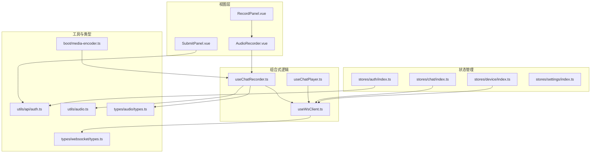
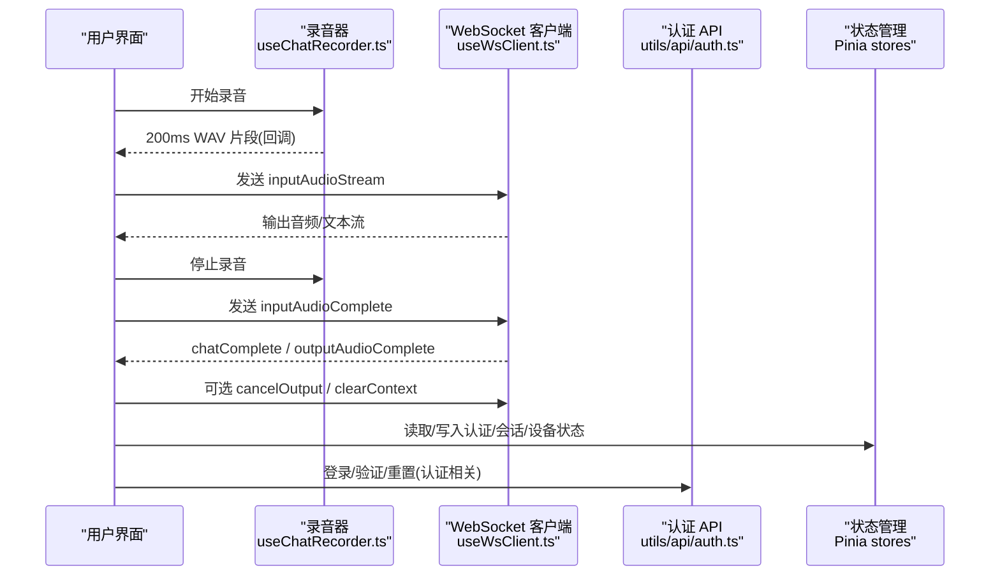
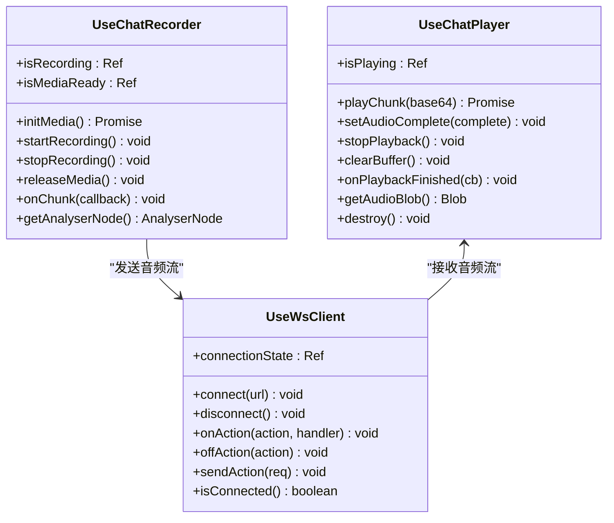
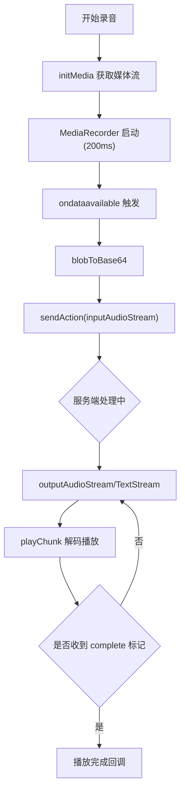
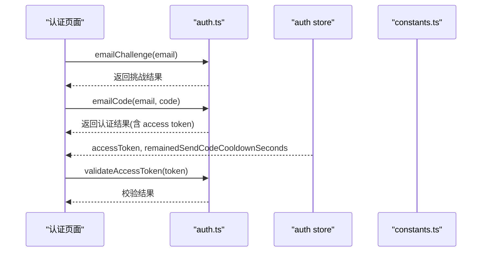
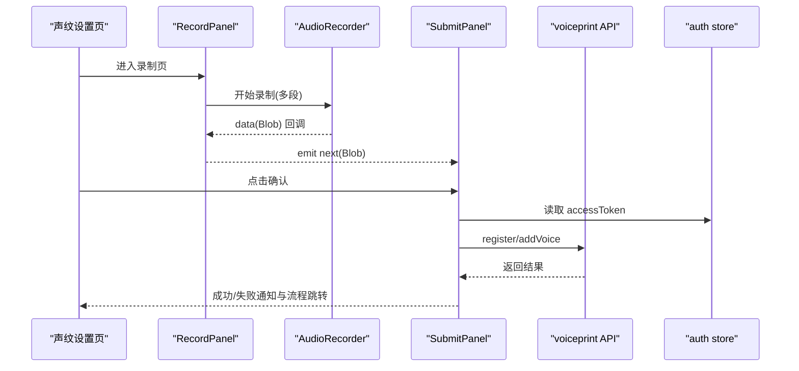
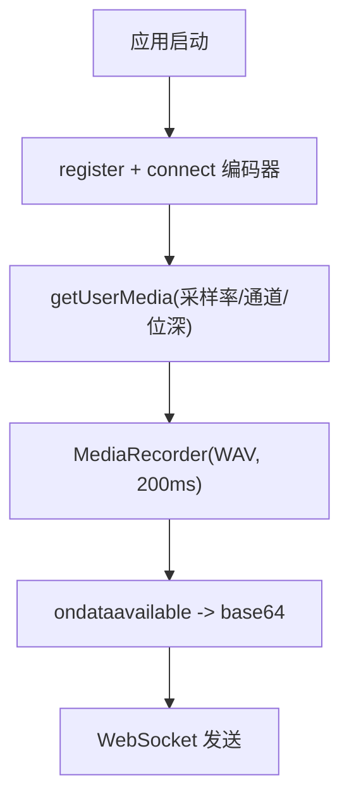
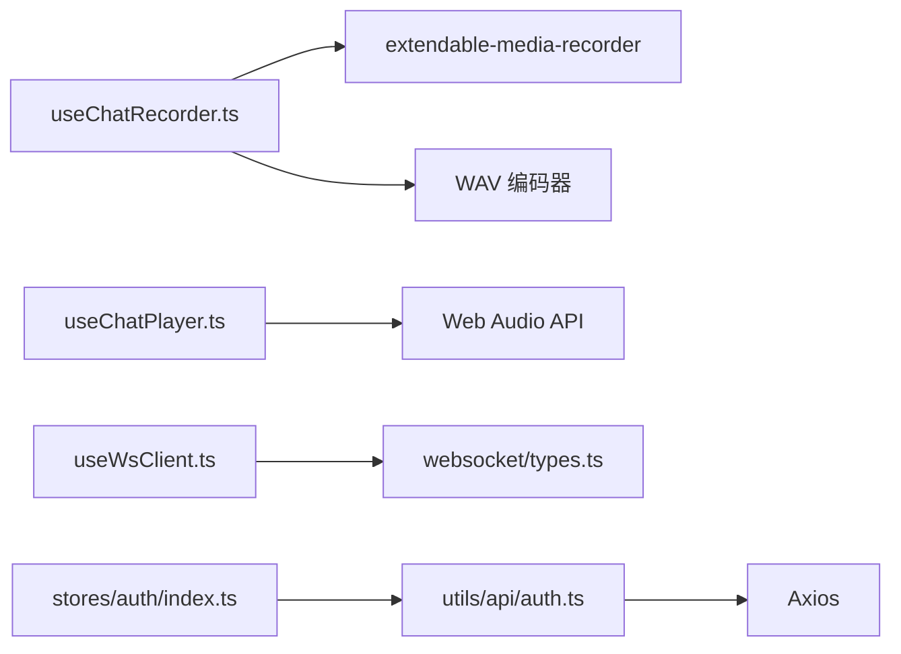

# 核心功能模块

<cite>
**本文引用的文件**
- [README.md](file://README.md)
- [useChatRecorder.ts](file://src/composables/useChatRecorder.ts)
- [useChatPlayer.ts](file://src/composables/useChatPlayer.ts)
- [useWsClient.ts](file://src/composables/useWsClient.ts)
- [AudioRecorder.vue](file://src/components/AudioRecorder.vue)
- [RecordPanel.vue](file://src/components/settings/voiceprint/RecordPanel.vue)
- [SubmitPanel.vue](file://src/components/settings/voiceprint/SubmitPanel.vue)
- [media-encoder.ts](file://src/boot/media-encoder.ts)
- [audio.ts](file://src/utils/audio.ts)
- [types.ts](file://src/types/audio/types.ts)
- [websocket/types.ts](file://src/types/websocket/types.ts)
- [auth/index.ts](file://src/stores/auth/index.ts)
- [auth/constants.ts](file://src/stores/auth/constants.ts)
- [auth.ts](file://src/utils/api/auth.ts)
- [chat/index.ts](file://src/stores/chat/index.ts)
- [device/index.ts](file://src/stores/device/index.ts)
- [settings/index.ts](file://src/stores/settings/index.ts)
</cite>

## 目录
1. [简介](#简介)
2. [项目结构](#项目结构)
3. [核心组件](#核心组件)
4. [架构总览](#架构总览)
5. [详细组件分析](#详细组件分析)
6. [依赖分析](#依赖分析)
7. [性能考虑](#性能考虑)
8. [故障排查指南](#故障排查指南)
9. [结论](#结论)
10. [附录](#附录)

## 简介
本文件面向 Le Bot 前端的核心功能模块，围绕以下主题进行系统化梳理与说明：
- 语音对话系统：包括录音、播放、WebSocket 传输、状态机与流式处理。
- 用户认证系统：邮箱验证码挑战、登录、密码登录、重置、令牌校验与冷却控制。
- 语音特征管理（声纹）：录制、预览、提交注册或添加到已有人员。
- 设备音频管理：媒体权限初始化、采样率/通道/位深配置、WAV 编码与流式传输。

文档将从架构、数据流、用户交互、API 接口、配置项、错误处理、性能与安全等方面展开，并提供可视化图示与最佳实践建议。

## 项目结构
前端采用 Quasar + Vue 3 + Pinia 架构，核心目录与职责概览：
- src/composables：可复用的组合式逻辑（录音器、播放器、WebSocket 客户端）
- src/components：页面级组件（如录音器、声纹设置页）
- src/stores：全局状态（认证、聊天会话、设备、设置）
- src/utils：通用工具（API 调用、音频编解码）
- src/types：类型定义（WebSocket 协议、音频参数、设备信息等）
- src/boot：应用启动阶段初始化（媒体编码器注册）

图表来源
- [AudioRecorder.vue:1-113](file://src/components/AudioRecorder.vue#L1-L113)
- [RecordPanel.vue:1-104](file://src/components/settings/voiceprint/RecordPanel.vue#L1-L104)
- [SubmitPanel.vue:1-158](file://src/components/settings/voiceprint/SubmitPanel.vue#L1-L158)
- [useChatRecorder.ts:1-148](file://src/composables/useChatRecorder.ts#L1-L148)
- [useChatPlayer.ts:1-161](file://src/composables/useChatPlayer.ts#L1-L161)
- [useWsClient.ts:1-103](file://src/composables/useWsClient.ts#L1-L103)
- [auth/index.ts:1-35](file://src/stores/auth/index.ts#L1-L35)
- [auth.ts:1-28](file://src/utils/api/auth.ts#L1-L28)
- [websocket/types.ts:1-226](file://src/types/websocket/types.ts#L1-L226)
- [audio.ts:1-47](file://src/utils/audio.ts#L1-L47)
- [media-encoder.ts:1-8](file://src/boot/media-encoder.ts#L1-L8)

章节来源
- [README.md:1-41](file://README.md#L1-L41)

## 核心组件
本节对四大核心模块进行要点归纳与接口说明。

- 语音对话系统
  - 组合式逻辑：useChatRecorder（录音）、useChatPlayer（播放）、useWsClient（连接与消息编排）
  - 关键能力：连续录音（200ms WAV 片段）、Web Audio Gapless 播放、WebSocket 流式收发、取消输出、清空上下文、更新配置
  - 数据流：录音片段 -> WebSocket -> 服务端推理 -> 音频/文本流 -> 播放器 -> 用户感知

- 用户认证系统
  - 状态：Pinia 认证 store（访问令牌、发送验证码冷却）
  - API：邮箱挑战、验证码登录、密码登录、重置、令牌校验
  - 冷却：验证码发送冷却时间常量控制

- 语音特征管理（声纹）
  - 录制：RecordPanel + AudioRecorder 组件串联，支持多段拼接
  - 提交：SubmitPanel 负责表单与调用注册/添加接口，通知反馈与流程推进
  - 依赖：认证 store 提供 access token

- 设备音频管理
  - 初始化：extendable-media-recorder 注册 + WAV 编码器连接
  - 参数：采样率、通道数、位深、回声消除/降噪/自动增益
  - 编码：PCM 到 WAV 的封装工具函数

章节来源
- [useChatRecorder.ts:1-148](file://src/composables/useChatRecorder.ts#L1-L148)
- [useChatPlayer.ts:1-161](file://src/composables/useChatPlayer.ts#L1-L161)
- [useWsClient.ts:1-103](file://src/composables/useWsClient.ts#L1-L103)
- [AudioRecorder.vue:1-113](file://src/components/AudioRecorder.vue#L1-L113)
- [RecordPanel.vue:1-104](file://src/components/settings/voiceprint/RecordPanel.vue#L1-L104)
- [SubmitPanel.vue:1-158](file://src/components/settings/voiceprint/SubmitPanel.vue#L1-L158)
- [media-encoder.ts:1-8](file://src/boot/media-encoder.ts#L1-L8)
- [audio.ts:1-47](file://src/utils/audio.ts#L1-L47)
- [auth/index.ts:1-35](file://src/stores/auth/index.ts#L1-L35)
- [auth/constants.ts:1-2](file://src/stores/auth/constants.ts#L1-L2)
- [auth.ts:1-28](file://src/utils/api/auth.ts#L1-L28)

## 架构总览
下图展示从用户交互到后端服务的整体链路，以及关键模块之间的耦合关系。

图表来源
- [useChatRecorder.ts:36-136](file://src/composables/useChatRecorder.ts#L36-L136)
- [useWsClient.ts:29-102](file://src/composables/useWsClient.ts#L29-L102)
- [auth.ts:1-28](file://src/utils/api/auth.ts#L1-L28)
- [auth/index.ts:1-35](file://src/stores/auth/index.ts#L1-L35)

## 详细组件分析

### 语音对话系统

#### 组件与职责
- useChatRecorder：初始化媒体流、创建 AnalyserNode、分片录音（WAV，200ms）、回调输出 base64 片段、释放资源
- useChatPlayer：解码 base64 -> AudioBuffer -> Gapless 播放、完成标记、停止/清理/销毁
- useWsClient：封装 WebSocket 生命周期、事件注册、请求发送、连接状态

图表来源
- [useChatRecorder.ts:6-136](file://src/composables/useChatRecorder.ts#L6-L136)
- [useChatPlayer.ts:3-160](file://src/composables/useChatPlayer.ts#L3-L160)
- [useWsClient.ts:8-102](file://src/composables/useWsClient.ts#L8-L102)

#### 数据流与处理逻辑
- 录音：getUserMedia -> MediaRecorder(WAV, 200ms) -> ondataavailable 回调 -> base64 传递
- 播放：atob -> decodeAudioData -> AudioBufferSourceNode -> gapless 调度
- WebSocket：typed actions（输入/输出音频/文本、取消、清空上下文、更新配置）

图表来源
- [useChatRecorder.ts:47-91](file://src/composables/useChatRecorder.ts#L47-L91)
- [useChatPlayer.ts:53-96](file://src/composables/useChatPlayer.ts#L53-L96)
- [websocket/types.ts:105-167](file://src/types/websocket/types.ts#L105-L167)

章节来源
- [useChatRecorder.ts:1-148](file://src/composables/useChatRecorder.ts#L1-L148)
- [useChatPlayer.ts:1-161](file://src/composables/useChatPlayer.ts#L1-L161)
- [useWsClient.ts:1-103](file://src/composables/useWsClient.ts#L1-L103)
- [websocket/types.ts:1-226](file://src/types/websocket/types.ts#L1-L226)

#### API 接口与配置
- WebSocket 动作与请求类型
  - 输入音频流：WsInputAudioStreamRequest
  - 输入音频结束：WsInputAudioCompleteRequest
  - 输出音频流：WsOutputAudioStreamResponseSuccess
  - 输出文本流：WsOutputTextStreamResponseSuccess
  - 取消输出：WsCancelOutputRequest
  - 清空上下文：WsClearContextRequest
  - 更新配置：WsUpdateConfigRequest
- 录音参数（来自类型与实现）
  - 采样率、通道数、位深、分片时长（200ms）
- 播放参数
  - 使用 Web Audio API 进行解码与调度

章节来源
- [websocket/types.ts:3-226](file://src/types/websocket/types.ts#L3-L226)
- [types.ts:1-14](file://src/types/audio/types.ts#L1-L14)
- [useChatRecorder.ts:4-6](file://src/composables/useChatRecorder.ts#L4-L6)

### 用户认证系统

#### 组件与职责
- stores/auth：保存访问令牌、验证码发送冷却时间；计算剩余冷却秒数；持久化
- utils/api/auth：封装邮箱挑战、验证码登录、密码登录、重置、令牌校验
- stores/auth/constants：验证码冷却时间常量

图表来源
- [auth.ts:1-28](file://src/utils/api/auth.ts#L1-L28)
- [auth/index.ts:1-35](file://src/stores/auth/index.ts#L1-L35)
- [auth/constants.ts:1-2](file://src/stores/auth/constants.ts#L1-L2)

#### 业务逻辑与数据流
- 邮箱挑战：向服务端请求发送验证码
- 验证码登录：携带邮箱+验证码换取访问令牌
- 密码登录：携带邮箱+密码换取访问令牌
- 令牌校验：携带 x-access-token 头部请求校验接口
- 冷却控制：记录上次发送时间，计算剩余冷却秒数

章节来源
- [auth.ts:1-28](file://src/utils/api/auth.ts#L1-L28)
- [auth/index.ts:1-35](file://src/stores/auth/index.ts#L1-L35)
- [auth/constants.ts:1-2](file://src/stores/auth/constants.ts#L1-L2)

#### API 接口与配置
- 邮箱挑战：POST /auth/email/challenge
- 验证码登录：POST /auth/email/code
- 密码登录：POST /auth/email/password
- 重置：POST /auth/email/reset
- 令牌校验：GET /auth/validate（请求头 x-access-token）

章节来源
- [auth.ts:5-27](file://src/utils/api/auth.ts#L5-L27)

### 语音特征管理（声纹）

#### 组件与职责
- RecordPanel：准备提示、录制多段音频、合并 Blob、生成预览 URL
- SubmitPanel：表单收集（姓名/关系），调用注册/添加接口，通知反馈，流程推进
- 依赖：AudioRecorder 组件、认证 store（access token）

图表来源
- [RecordPanel.vue:36-49](file://src/components/settings/voiceprint/RecordPanel.vue#L36-L49)
- [AudioRecorder.vue:31-60](file://src/components/AudioRecorder.vue#L31-L60)
- [SubmitPanel.vue:34-97](file://src/components/settings/voiceprint/SubmitPanel.vue#L34-L97)
- [auth/index.ts:1-35](file://src/stores/auth/index.ts#L1-L35)

#### 业务逻辑与数据流
- 录制：多段 WAV 片段拼接为完整 Blob
- 预览：生成对象 URL 供用户试听
- 提交：根据是否存在 personId 调用不同接口；成功后延时触发完成事件
- 错误处理：缺少令牌/数据、必填字段缺失、异常捕获与通知

章节来源
- [RecordPanel.vue:1-104](file://src/components/settings/voiceprint/RecordPanel.vue#L1-L104)
- [SubmitPanel.vue:1-158](file://src/components/settings/voiceprint/SubmitPanel.vue#L1-L158)
- [AudioRecorder.vue:1-113](file://src/components/AudioRecorder.vue#L1-L113)
- [auth/index.ts:1-35](file://src/stores/auth/index.ts#L1-L35)

#### API 接口与配置
- 注册新人员并添加声纹：register(access_token, base64, name, age, relationship)
- 为已有人员添加声纹：addVoice(access_token, personId, base64)
- 表单字段：姓名、年龄、与机器人关系（枚举选项）

章节来源
- [SubmitPanel.vue:8-74](file://src/components/settings/voiceprint/SubmitPanel.vue#L8-L74)

### 设备音频管理

#### 组件与职责
- boot/media-encoder.ts：在应用启动时注册 extendable-media-recorder 并连接 WAV 编码器
- useChatRecorder：统一的录音器实现，确保媒体流与 AnalyserNode 创建顺序正确
- utils/audio.ts：PCM 到 WAV 的封装（用于需要自定义编码的场景）

图表来源
- [media-encoder.ts:5-7](file://src/boot/media-encoder.ts#L5-L7)
- [useChatRecorder.ts:47-91](file://src/composables/useChatRecorder.ts#L47-L91)
- [audio.ts:1-47](file://src/utils/audio.ts#L1-L47)

#### 配置与参数
- 采样率、通道数、位深、回声消除、降噪、自动增益
- 分片时长：200ms（WAV）
- WAV 编码：通过 extendable-media-recorder + WAV encoder

章节来源
- [useChatRecorder.ts:50-58](file://src/composables/useChatRecorder.ts#L50-L58)
- [media-encoder.ts:1-8](file://src/boot/media-encoder.ts#L1-L8)
- [audio.ts:1-47](file://src/utils/audio.ts#L1-L47)

## 依赖分析
- 组件内聚性
  - 录音/播放/WS 三者通过组合式逻辑解耦，便于测试与替换
  - 认证 store 与 API 层分离，便于扩展其他认证方式
- 外部依赖
  - extendable-media-recorder + WAV 编码器：录音与编码
  - Web Audio API：解码与播放
  - Axios：HTTP 请求封装
- 潜在循环依赖
  - 当前未见直接循环导入；若后续引入更多 store 或工具类，需避免相互引用

图表来源
- [useChatRecorder.ts:1-2](file://src/composables/useChatRecorder.ts#L1-L2)
- [useChatPlayer.ts:1-2](file://src/composables/useChatPlayer.ts#L1-L2)
- [useWsClient.ts:3-4](file://src/composables/useWsClient.ts#L3-L4)
- [auth.ts:1-1](file://src/utils/api/auth.ts#L1-L1)
- [auth/index.ts:1-2](file://src/stores/auth/index.ts#L1-L2)

章节来源
- [useChatRecorder.ts:1-148](file://src/composables/useChatRecorder.ts#L1-L148)
- [useChatPlayer.ts:1-161](file://src/composables/useChatPlayer.ts#L1-L161)
- [useWsClient.ts:1-103](file://src/composables/useWsClient.ts#L1-L103)
- [auth.ts:1-28](file://src/utils/api/auth.ts#L1-L28)
- [auth/index.ts:1-35](file://src/stores/auth/index.ts#L1-L35)

## 性能考虑
- 录音分片与时序
  - 200ms 分片降低首包延迟，提升交互流畅度
  - AnalyserNode 仅分析不播放，避免回放开销
- 播放调度
  - 使用 AudioContext currentTime 与 nextStartTime 对齐，减少拼接断点
  - 及时清理 activeSources，防止内存泄漏
- 资源释放
  - 停止录音后及时关闭 AudioContext、释放 MediaStream
  - 组件卸载时回收对象 URL
- 网络与并发
  - WebSocket 连接复用，避免频繁握手
  - 批量发送 inputAudioStream，结束后发送 inputAudioComplete

[本节为通用性能建议，无需特定文件引用]

## 故障排查指南
- 录音无声音/权限被拒
  - 检查浏览器权限与 HTTPS 环境
  - 确认 getUserMedia 参数与设备可用
- 录音无声或断断续续
  - 检查回声消除/降噪/自动增益设置
  - 确认采样率/通道/位深一致
- 播放卡顿/破音
  - 检查 base64 解码与 decodeAudioData 是否抛错
  - 确认 gapless 调度逻辑与 activeSources 清理
- WebSocket 不连通
  - 检查连接状态与 onOpen 回调
  - 确认请求序列（先 sendAction，再 inputAudioComplete）
- 认证失败
  - 校验 access token 是否存在与有效
  - 检查验证码冷却时间与必填字段

章节来源
- [useChatRecorder.ts:72-116](file://src/composables/useChatRecorder.ts#L72-L116)
- [useChatPlayer.ts:93-123](file://src/composables/useChatPlayer.ts#L93-L123)
- [useWsClient.ts:37-63](file://src/composables/useWsClient.ts#L37-L63)
- [auth.ts:21-27](file://src/utils/api/auth.ts#L21-L27)

## 结论
本项目以组合式逻辑为核心，将录音、播放、WebSocket 与认证解耦，形成清晰的数据流与交互链路。通过 Pinia 管理关键状态，借助 extendable-media-recorder 与 Web Audio API 实现高质量的音频采集与播放体验。声纹管理流程简洁直观，认证体系覆盖常用场景。建议在后续迭代中进一步完善错误上报、埋点统计与离线缓存策略，持续优化用户体验与稳定性。

[本节为总结性内容，无需特定文件引用]

## 附录

### 功能特性清单
- 语音对话
  - 连续录音（200ms WAV 片段）
  - 流式音频/文本传输
  - 取消输出、清空上下文、更新配置
- 用户认证
  - 邮箱挑战与验证码登录
  - 密码登录与令牌校验
  - 验证码发送冷却控制
- 语音特征管理
  - 多段录制与预览
  - 新人注册与已有人员添加声纹
- 设备音频管理
  - 媒体权限初始化
  - 采样率/通道/位深配置
  - PCM/WAV 编码工具

[本节为概览性内容，无需特定文件引用]

### 使用场景与实现原理
- 场景一：实时语音对话
  - 实现：录音器分片 -> WebSocket 发送 -> 服务端推理 -> 播放器解码播放
- 场景二：声纹注册
  - 实现：录制多段音频 -> 合并 Blob -> 提交注册/添加接口 -> 成功通知
- 场景三：认证登录
  - 实现：邮箱挑战 -> 验证码登录 -> 令牌持久化 -> 校验

[本节为概念性说明，无需特定文件引用]

### 最佳实践
- 录音
  - 在会话开始前调用 initMedia，避免重复初始化
  - 录制完成后及时 releaseMedia，释放资源
- 播放
  - 使用 onPlaybackFinished 监听播放完成，避免状态错乱
  - stopPlayback 时重置 nextStartTime，保证下次播放正确
- WebSocket
  - 先注册 onAction，再 connect，确保消息可达
  - 发送 inputAudioComplete 后再断开或切换会话
- 认证
  - 严格校验 access token 存在与有效期
  - 冷却期间禁用“重新发送验证码”按钮
- 声纹
  - 录制环境安静、自然发声、适中距离
  - 提交前预览音频，确保质量达标

[本节为通用建议，无需特定文件引用]