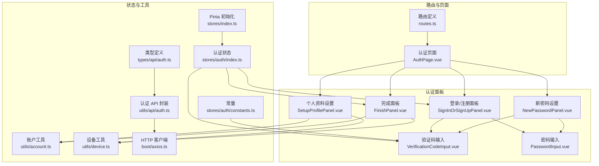
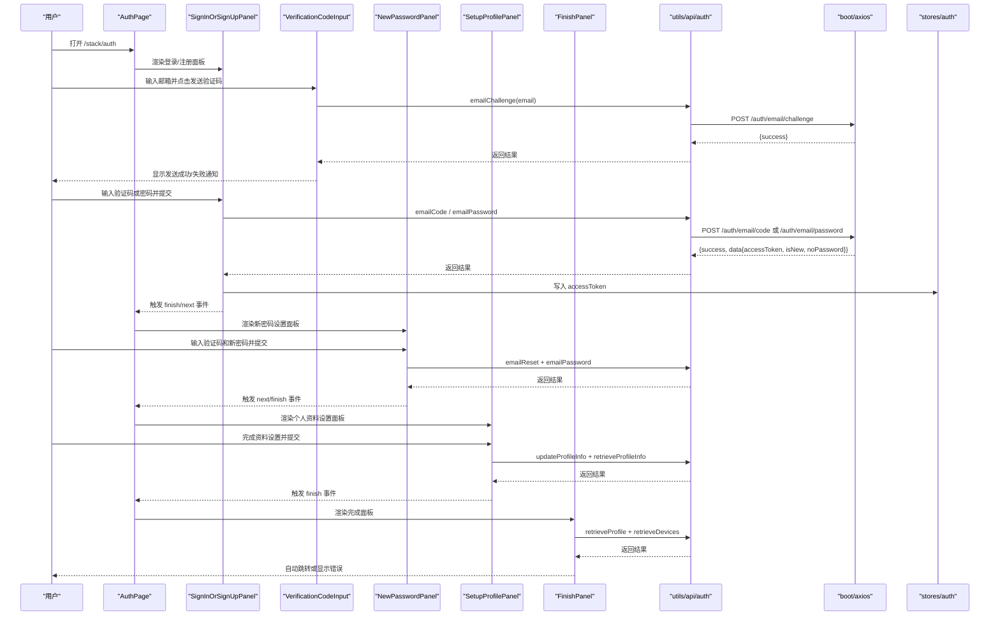
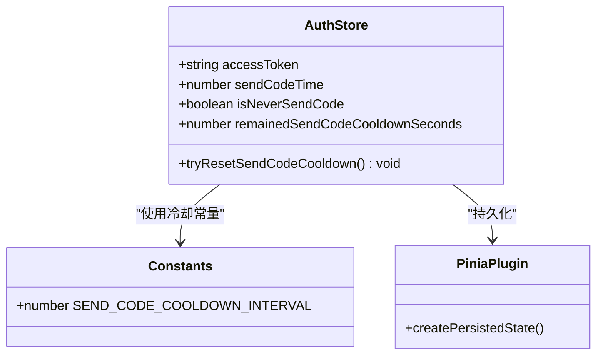
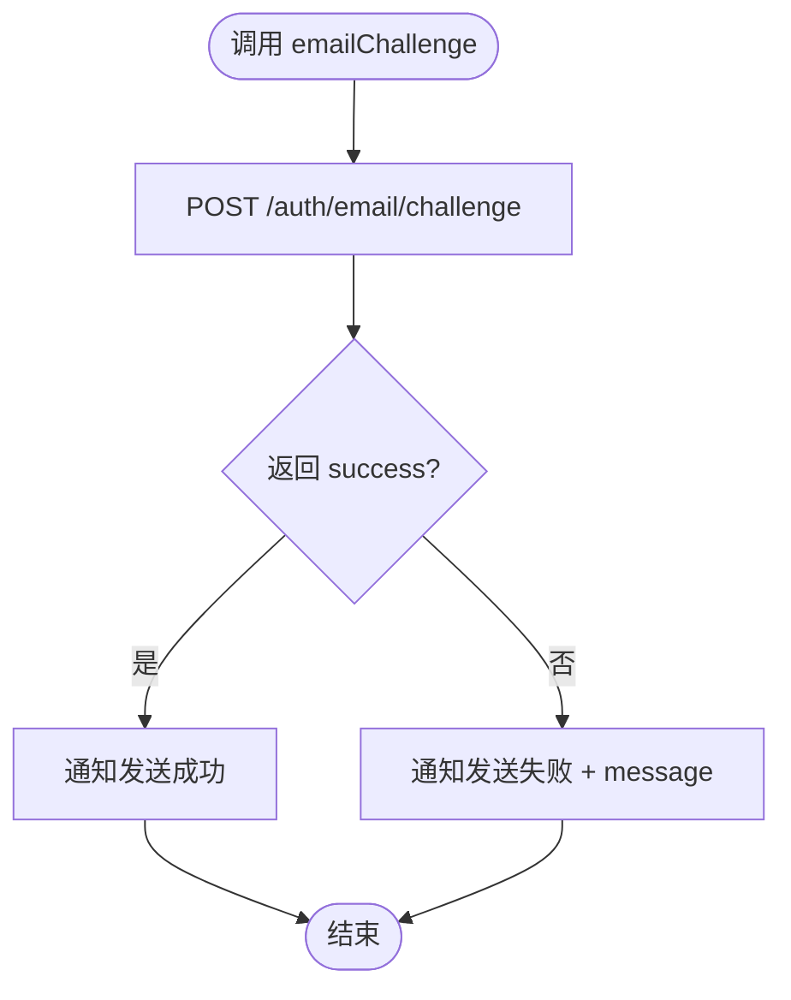
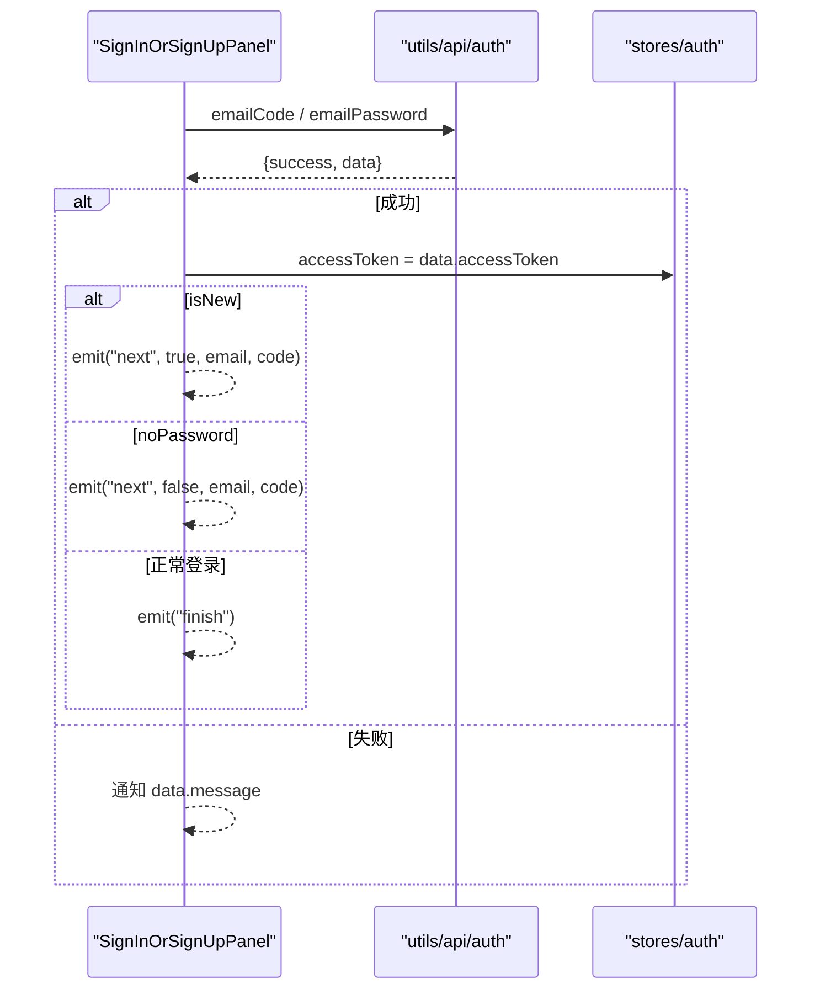
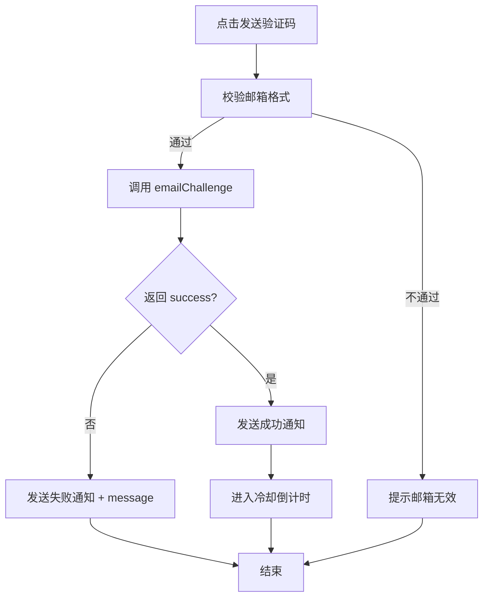
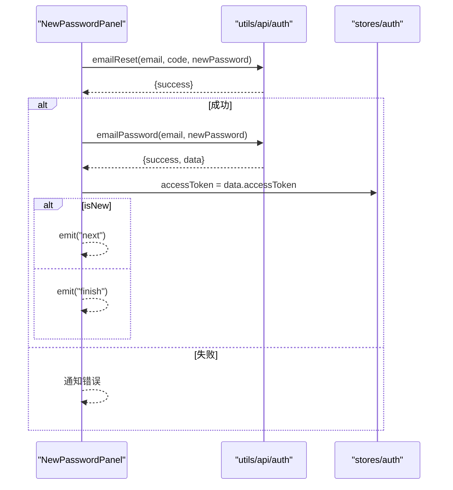
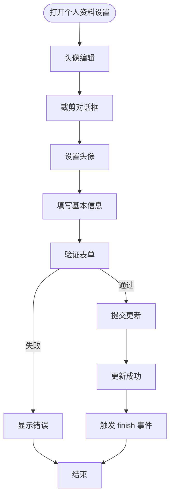
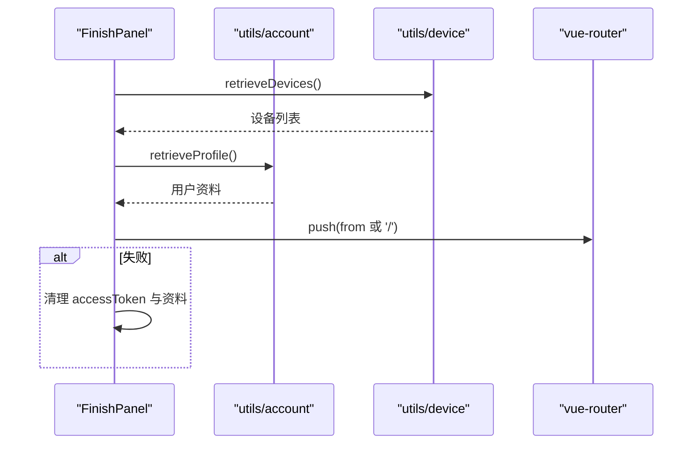
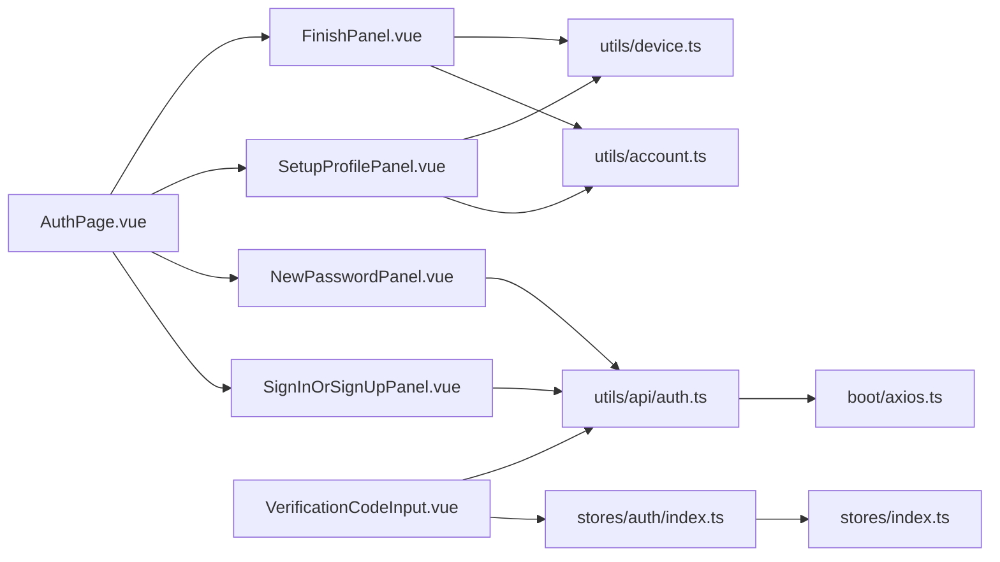

# 用户认证系统

<cite>
**本文引用的文件**
- [src/stores/auth/index.ts](file://src/stores/auth/index.ts)
- [src/stores/auth/constants.ts](file://src/stores/auth/constants.ts)
- [src/utils/api/auth.ts](file://src/utils/api/auth.ts)
- [src/types/api/auth.ts](file://src/types/api/auth.ts)
- [src/components/auth/SignInOrSignUpPanel.vue](file://src/components/auth/SignInOrSignUpPanel.vue)
- [src/components/auth/VerificationCodeInput.vue](file://src/components/auth/VerificationCodeInput.vue)
- [src/components/auth/PasswordInput.vue](file://src/components/auth/PasswordInput.vue)
- [src/components/auth/FinishPanel.vue](file://src/components/auth/FinishPanel.vue)
- [src/components/auth/NewPasswordPanel.vue](file://src/components/auth/NewPasswordPanel.vue)
- [src/components/auth/SetupProfilePanel.vue](file://src/components/auth/SetupProfilePanel.vue)
- [src/pages/stack/AuthPage.vue](file://src/pages/stack/AuthPage.vue)
- [src/utils/account.ts](file://src/utils/account.ts)
- [src/utils/device.ts](file://src/utils/device.ts)
- [src/boot/axios.ts](file://src/boot/axios.ts)
- [src/router/routes.ts](file://src/router/routes.ts)
- [src/stores/index.ts](file://src/stores/index.ts)
</cite>

## 更新摘要
**变更内容**
- 全面重构了认证UI组件，显著提升了用户体验和视觉一致性
- FinishPanel、NewPasswordPanel、PasswordInput、SignInOrSignUpPanel、VerificationCodeInput等组件进行了重大改进
- 增强了密码可见性切换、实时验证反馈、验证码发送集成等交互特性
- 完善了个人资料设置面板的头像上传、生日选择、关系选项等完整功能
- 优化了状态管理和错误处理机制，提供了更好的用户反馈

## 目录
1. [简介](#简介)
2. [项目结构](#项目结构)
3. [核心组件](#核心组件)
4. [架构总览](#架构总览)
5. [详细组件分析](#详细组件分析)
6. [依赖关系分析](#依赖关系分析)
7. [性能考量](#性能考量)
8. [故障排查指南](#故障排查指南)
9. [结论](#结论)
10. [附录](#附录)

## 简介
本文件为 le-bot 前端认证系统的综合技术文档，覆盖邮箱登录、注册验证、验证码机制与密码重置等完整流程；解释 JWT 令牌管理、会话状态持久化与安全策略；梳理各认证组件职责、数据绑定与事件处理机制；给出认证状态管理、错误处理与用户体验优化策略；提供 API 接口规范、请求/响应格式与安全注意事项；并附带实际代码示例路径与最佳实践。

**更新** 本版本经过重大UI组件重构，新增了完整的多步骤认证流程，包括个人资料设置和现代化UI设计，显著提升了用户体验和功能完整性。所有认证相关组件都经过全面优化，增强了密码可见性切换、实时验证反馈、验证码冷却倒计时等关键交互特性。

## 项目结构
认证系统围绕"页面容器 + 多步骤面板 + 工具函数 + 状态存储 + 路由配置"组织，采用 Pinia 状态持久化与 Axios 封装的统一后端访问层。

**图表来源**
- [src/router/routes.ts:1-160](file://src/router/routes.ts#L1-L160)
- [src/pages/stack/AuthPage.vue:1-200](file://src/pages/stack/AuthPage.vue#L1-L200)
- [src/components/auth/SignInOrSignUpPanel.vue:1-427](file://src/components/auth/SignInOrSignUpPanel.vue#L1-L427)
- [src/components/auth/VerificationCodeInput.vue:1-170](file://src/components/auth/VerificationCodeInput.vue#L1-L170)
- [src/components/auth/PasswordInput.vue:1-119](file://src/components/auth/PasswordInput.vue#L1-L119)
- [src/components/auth/NewPasswordPanel.vue:1-434](file://src/components/auth/NewPasswordPanel.vue#L1-L434)
- [src/components/auth/SetupProfilePanel.vue:1-516](file://src/components/auth/SetupProfilePanel.vue#L1-L516)
- [src/components/auth/FinishPanel.vue:1-142](file://src/components/auth/FinishPanel.vue#L1-L142)
- [src/stores/auth/index.ts:1-35](file://src/stores/auth/index.ts#L1-L35)
- [src/stores/auth/constants.ts:1-2](file://src/stores/auth/constants.ts#L1-L2)
- [src/utils/api/auth.ts:1-28](file://src/utils/api/auth.ts#L1-L28)
- [src/types/api/auth.ts:1-19](file://src/types/api/auth.ts#L1-L19)
- [src/utils/account.ts:1-41](file://src/utils/account.ts#L1-L41)
- [src/utils/device.ts:1-60](file://src/utils/device.ts#L1-L60)
- [src/boot/axios.ts:1-27](file://src/boot/axios.ts#L1-L27)
- [src/stores/index.ts:1-36](file://src/stores/index.ts#L1-L36)

**章节来源**
- [src/router/routes.ts:1-160](file://src/router/routes.ts#L1-L160)
- [src/pages/stack/AuthPage.vue:1-200](file://src/pages/stack/AuthPage.vue#L1-L200)

## 核心组件
- 认证状态存储（Pinia）
  - 维护 accessToken、发送验证码时间戳与冷却剩余秒数
  - 提供冷却重置能力，支持持久化
  - 参考：[src/stores/auth/index.ts:1-35](file://src/stores/auth/index.ts#L1-L35)，[src/stores/auth/constants.ts:1-2](file://src/stores/auth/constants.ts#L1-L2)，[src/stores/index.ts:1-36](file://src/stores/index.ts#L1-L36)

- 认证 API 封装
  - 邮箱挑战（发送验证码）、邮箱验证码登录、邮箱密码登录、邮箱重置+登录、访问令牌校验
  - 返回统一响应类型，包含 success 与 data/message 字段
  - 参考：[src/utils/api/auth.ts:1-28](file://src/utils/api/auth.ts#L1-L28)，[src/types/api/auth.ts:1-19](file://src/types/api/auth.ts#L1-L19)，[src/boot/axios.ts:18](file://src/boot/axios.ts#L18)

- 认证页面容器
  - 多步骤流程编排：邮箱登录/注册 -> 新用户设置密码 -> 设置资料 -> 完成跳转
  - 支持返回箭头、Logo展示、标语显示等UI元素
  - 参考：[src/pages/stack/AuthPage.vue:1-200](file://src/pages/stack/AuthPage.vue#L1-L200)

- 登录/注册面板
  - 支持验证码登录与密码登录切换，表单校验与错误提示
  - 触发认证 API 并根据返回值决定下一步
  - **新增** 密码可见性切换、实时验证反馈、服务条款同意功能
  - **更新** 增强了焦点状态管理、图标切换、错误状态高亮等用户体验特性
  - 参考：[src/components/auth/SignInOrSignUpPanel.vue:1-427](file://src/components/auth/SignInOrSignUpPanel.vue#L1-L427)

- 验证码输入组件
  - 邮箱格式校验、发送验证码按钮与冷却倒计时显示、调用挑战 API
  - 支持 v-model 双向绑定、国际化消息提示
  - **更新** 优化了冷却倒计时显示逻辑，增强了用户反馈
  - 参考：[src/components/auth/VerificationCodeInput.vue:1-170](file://src/components/auth/VerificationCodeInput.vue#L1-L170)，[src/stores/auth/constants.ts:1-2](file://src/stores/auth/constants.ts#L1-L2)

- 密码输入组件
  - 密码强度规则（长度等），支持密码可见性切换
  - **更新** 新增焦点状态管理、图标切换功能，优化了用户体验
  - 参考：[src/components/auth/PasswordInput.vue:1-119](file://src/components/auth/PasswordInput.vue#L1-L119)

- 新密码设置面板
  - 验证码 + 新密码设置，随后自动登录并进入下一步
  - 支持密码确认、错误状态高亮、冷却倒计时显示
  - **更新** 增强了密码可见性切换、实时验证反馈、冷却倒计时显示等特性
  - 参考：[src/components/auth/NewPasswordPanel.vue:1-434](file://src/components/auth/NewPasswordPanel.vue#L1-L434)

- 个人资料设置面板
  - **新增** 完整的个人资料设置功能，包括头像上传、昵称、生日、关系选择
  - 支持头像裁剪对话框、生日日期选择器、关系选项网格
  - **更新** 优化了头像编辑、生日选择、关系选项的交互体验
  - 参考：[src/components/auth/SetupProfilePanel.vue:1-516](file://src/components/auth/SetupProfilePanel.vue#L1-L516)

- 完成面板
  - 拉取用户资料与设备列表，成功后自动跳转，失败则清理状态
  - 支持失败状态显示、重新开始功能
  - **更新** 增强了失败状态显示、重新开始功能等用户体验特性
  - 参考：[src/components/auth/FinishPanel.vue:1-142](file://src/components/auth/FinishPanel.vue#L1-L142)，[src/utils/account.ts:1-41](file://src/utils/account.ts#L1-L41)，[src/utils/device.ts:1-60](file://src/utils/device.ts#L1-L60)

**章节来源**
- [src/stores/auth/index.ts:1-35](file://src/stores/auth/index.ts#L1-L35)
- [src/utils/api/auth.ts:1-28](file://src/utils/api/auth.ts#L1-L28)
- [src/types/api/auth.ts:1-19](file://src/types/api/auth.ts#L1-L19)
- [src/pages/stack/AuthPage.vue:1-200](file://src/pages/stack/AuthPage.vue#L1-L200)
- [src/components/auth/SignInOrSignUpPanel.vue:1-427](file://src/components/auth/SignInOrSignUpPanel.vue#L1-L427)
- [src/components/auth/VerificationCodeInput.vue:1-170](file://src/components/auth/VerificationCodeInput.vue#L1-L170)
- [src/components/auth/PasswordInput.vue:1-119](file://src/components/auth/PasswordInput.vue#L1-L119)
- [src/components/auth/NewPasswordPanel.vue:1-434](file://src/components/auth/NewPasswordPanel.vue#L1-L434)
- [src/components/auth/SetupProfilePanel.vue:1-516](file://src/components/auth/SetupProfilePanel.vue#L1-L516)
- [src/components/auth/FinishPanel.vue:1-142](file://src/components/auth/FinishPanel.vue#L1-L142)
- [src/utils/account.ts:1-41](file://src/utils/account.ts#L1-L41)
- [src/utils/device.ts:1-60](file://src/utils/device.ts#L1-L60)

## 架构总览
认证系统采用"页面容器 + 步骤化面板 + 状态存储 + API 封装"的分层设计，通过 Pinia 持久化保存访问令牌与验证码冷却状态，Axios 统一注入基础 URL，路由负责页面级导航。

**图表来源**
- [src/pages/stack/AuthPage.vue:1-200](file://src/pages/stack/AuthPage.vue#L1-L200)
- [src/components/auth/SignInOrSignUpPanel.vue:1-427](file://src/components/auth/SignInOrSignUpPanel.vue#L1-L427)
- [src/components/auth/VerificationCodeInput.vue:1-170](file://src/components/auth/VerificationCodeInput.vue#L1-L170)
- [src/components/auth/NewPasswordPanel.vue:1-434](file://src/components/auth/NewPasswordPanel.vue#L1-L434)
- [src/components/auth/SetupProfilePanel.vue:1-516](file://src/components/auth/SetupProfilePanel.vue#L1-L516)
- [src/components/auth/FinishPanel.vue:1-142](file://src/components/auth/FinishPanel.vue#L1-L142)
- [src/utils/api/auth.ts:1-28](file://src/utils/api/auth.ts#L1-L28)
- [src/boot/axios.ts:18](file://src/boot/axios.ts#L18)
- [src/stores/auth/index.ts:1-35](file://src/stores/auth/index.ts#L1-L35)

## 详细组件分析

### 认证状态存储（Pinia）
- 数据结构
  - accessToken: 当前用户的访问令牌
  - sendCodeTime: 上次发送验证码的时间戳（毫秒）
  - isNeverSendCode: 是否从未发送过验证码
  - remainedSendCodeCooldownSeconds: 验证码冷却剩余秒数
- 行为
  - 冷却重置：当冷却结束时将 sendCodeTime 归零
  - 持久化：通过插件持久化到本地存储
- 复杂度
  - 计算属性均为 O(1) 时间复杂度
- 依赖链
  - 与 stores/auth/constants 的冷却间隔常量耦合
  - 与 Pinia 初始化插件耦合
- 最佳实践
  - 在应用启动时读取持久化状态
  - 在登出时清空 accessToken 并刷新页面

**图表来源**
- [src/stores/auth/index.ts:1-35](file://src/stores/auth/index.ts#L1-L35)
- [src/stores/auth/constants.ts:1-2](file://src/stores/auth/constants.ts#L1-L2)
- [src/stores/index.ts:1-36](file://src/stores/index.ts#L1-L36)

**章节来源**
- [src/stores/auth/index.ts:1-35](file://src/stores/auth/index.ts#L1-L35)
- [src/stores/auth/constants.ts:1-2](file://src/stores/auth/constants.ts#L1-L2)
- [src/stores/index.ts:1-36](file://src/stores/index.ts#L1-L36)

### 认证 API 封装与类型
- 接口定义
  - emailChallenge(email): 发送验证码
  - emailCode(email, code): 验证码登录
  - emailPassword(email, password): 密码登录
  - emailReset(email, code, newPassword): 重置密码
  - validateAccessToken(accessToken): 校验令牌
- 响应类型
  - ChallengeResponse: {success: boolean, message?}
  - AuthResponse: {success: boolean, message?, data:{accessToken, isNew, noPassword}}
- 安全要点
  - 使用 x-access-token 请求头传递令牌
  - 后端应限制验证码发送频率与重试次数

**图表来源**
- [src/utils/api/auth.ts:1-28](file://src/utils/api/auth.ts#L1-L28)
- [src/types/api/auth.ts:1-19](file://src/types/api/auth.ts#L1-L19)

**章节来源**
- [src/utils/api/auth.ts:1-28](file://src/utils/api/auth.ts#L1-L28)
- [src/types/api/auth.ts:1-19](file://src/types/api/auth.ts#L1-L19)

### 登录/注册面板（SignInOrSignUpPanel）
- 功能
  - 切换验证码登录与密码登录
  - 表单校验（邮箱格式、验证码长度、密码长度）
  - 调用对应 API，写入 accessToken，并触发 finish/next 事件
  - **新增** 密码可见性切换、实时验证反馈、服务条款同意
  - **更新** 增强了焦点状态管理、图标切换、错误状态高亮等用户体验特性
- 错误处理
  - 对后端返回的 message 进行通知展示
  - 异常捕获统一提示未知错误
- 用户体验
  - 按钮禁用态与实时校验反馈
  - 国际化文案按组件子路径加载
  - 密码输入支持显示/隐藏切换

**图表来源**
- [src/components/auth/SignInOrSignUpPanel.vue:1-427](file://src/components/auth/SignInOrSignUpPanel.vue#L1-L427)
- [src/utils/api/auth.ts:1-28](file://src/utils/api/auth.ts#L1-L28)
- [src/stores/auth/index.ts:1-35](file://src/stores/auth/index.ts#L1-L35)

**章节来源**
- [src/components/auth/SignInOrSignUpPanel.vue:1-427](file://src/components/auth/SignInOrSignUpPanel.vue#L1-L427)

### 验证码输入组件（VerificationCodeInput）
- 功能
  - 邮箱格式校验
  - 发送验证码按钮与冷却倒计时显示
  - 调用 emailChallenge 并处理通知
  - **新增** v-model 双向绑定、国际化消息提示
  - **更新** 优化了冷却倒计时显示逻辑，增强了用户反馈
- 冷却机制
  - 依据 sendCodeTime 与常量计算剩余秒数
  - 冷却期间禁用发送按钮
- 用户体验
  - 输入框限制长度为 6，实时校验
  - 支持多种状态的国际化文案

**图表来源**
- [src/components/auth/VerificationCodeInput.vue:1-170](file://src/components/auth/VerificationCodeInput.vue#L1-L170)
- [src/stores/auth/constants.ts:1-2](file://src/stores/auth/constants.ts#L1-L2)
- [src/stores/auth/index.ts:1-35](file://src/stores/auth/index.ts#L1-L35)
- [src/utils/api/auth.ts:1-28](file://src/utils/api/auth.ts#L1-L28)

**章节来源**
- [src/components/auth/VerificationCodeInput.vue:1-170](file://src/components/auth/VerificationCodeInput.vue#L1-L170)

### 新密码设置面板（NewPasswordPanel）
- 流程
  - 输入验证码与新密码，调用 emailReset 重置密码
  - 随后调用 emailPassword 自动登录
  - 根据 isNew 决定下一步
- 校验
  - 验证码长度 6，密码长度至少 8，密码确认匹配
- 用户体验
  - 成功后通知登录成功，失败提示错误信息
  - **新增** 密码可见性切换、实时验证反馈、冷却倒计时显示
  - **更新** 增强了焦点状态管理、图标切换、错误状态高亮等用户体验特性

**图表来源**
- [src/components/auth/NewPasswordPanel.vue:1-434](file://src/components/auth/NewPasswordPanel.vue#L1-L434)
- [src/utils/api/auth.ts:1-28](file://src/utils/api/auth.ts#L1-L28)
- [src/stores/auth/index.ts:1-35](file://src/stores/auth/index.ts#L1-L35)

**章节来源**
- [src/components/auth/NewPasswordPanel.vue:1-434](file://src/components/auth/NewPasswordPanel.vue#L1-L434)

### 个人资料设置面板（SetupProfilePanel）
- **新增** 功能
  - 头像上传与裁剪：支持图片上传、裁剪对话框、占位符显示
  - 个人信息填写：昵称输入、生日选择器、关系选项网格
  - 提交处理：调用 updateProfileInfo 和 retrieveProfileInfo
- 交互特性
  - 头像点击编辑、生日日期选择器、关系选项底部弹窗
  - 支持跳过设置直接完成
  - **更新** 优化了头像编辑、生日选择、关系选项的交互体验
- 用户体验
  - 完整的表单验证与错误处理
  - 流畅的动画过渡效果

**图表来源**
- [src/components/auth/SetupProfilePanel.vue:1-516](file://src/components/auth/SetupProfilePanel.vue#L1-L516)

**章节来源**
- [src/components/auth/SetupProfilePanel.vue:1-516](file://src/components/auth/SetupProfilePanel.vue#L1-L516)

### 完成面板（FinishPanel）
- 功能
  - 登录成功后拉取用户资料与设备列表
  - 成功后延时跳转至来源页或首页
  - 失败时清理 accessToken 与用户资料
  - **新增** 失败状态显示、重新开始功能
  - **更新** 增强了失败状态显示、重新开始功能等用户体验特性
- 依赖
  - utils/account.ts 与 utils/device.ts
  - 路由参数 from 用于回跳

**图表来源**
- [src/components/auth/FinishPanel.vue:1-142](file://src/components/auth/FinishPanel.vue#L1-L142)
- [src/utils/account.ts:1-41](file://src/utils/account.ts#L1-L41)
- [src/utils/device.ts:1-60](file://src/utils/device.ts#L1-L60)

**章节来源**
- [src/components/auth/FinishPanel.vue:1-142](file://src/components/auth/FinishPanel.vue#L1-L142)
- [src/utils/account.ts:1-41](file://src/utils/account.ts#L1-L41)
- [src/utils/device.ts:1-60](file://src/utils/device.ts#L1-L60)

## 依赖关系分析
- 组件耦合
  - AuthPage 作为容器协调多个面板，支持返回箭头和页面标题
  - 面板之间通过事件进行状态推进，支持多步骤流程
  - 验证码输入组件依赖认证状态存储以控制冷却
  - **更新** 所有组件都经过优化，增强了组件间的协作和用户体验
- 外部依赖
  - Axios 注入基础 URL，统一处理后端接口
  - Pinia 插件持久化认证状态
  - Quasar UI 框架提供通知、对话框等组件
- 路由集成
  - /stack/auth 页面承载认证流程
  - 完成面板根据路由参数进行回跳

**图表来源**
- [src/pages/stack/AuthPage.vue:1-200](file://src/pages/stack/AuthPage.vue#L1-L200)
- [src/components/auth/SignInOrSignUpPanel.vue:1-427](file://src/components/auth/SignInOrSignUpPanel.vue#L1-L427)
- [src/components/auth/VerificationCodeInput.vue:1-170](file://src/components/auth/VerificationCodeInput.vue#L1-L170)
- [src/components/auth/NewPasswordPanel.vue:1-434](file://src/components/auth/NewPasswordPanel.vue#L1-L434)
- [src/components/auth/SetupProfilePanel.vue:1-516](file://src/components/auth/SetupProfilePanel.vue#L1-L516)
- [src/components/auth/FinishPanel.vue:1-142](file://src/components/auth/FinishPanel.vue#L1-L142)
- [src/stores/auth/index.ts:1-35](file://src/stores/auth/index.ts#L1-L35)
- [src/utils/api/auth.ts:1-28](file://src/utils/api/auth.ts#L1-L28)
- [src/utils/account.ts:1-41](file://src/utils/account.ts#L1-L41)
- [src/utils/device.ts:1-60](file://src/utils/device.ts#L1-L60)
- [src/boot/axios.ts:1-27](file://src/boot/axios.ts#L1-L27)
- [src/stores/index.ts:1-36](file://src/stores/index.ts#L1-L36)

**章节来源**
- [src/router/routes.ts:1-160](file://src/router/routes.ts#L1-L160)
- [src/boot/axios.ts:1-27](file://src/boot/axios.ts#L1-L27)
- [src/stores/index.ts:1-36](file://src/stores/index.ts#L1-L36)

## 性能考量
- 状态持久化
  - 使用 Pinia 持久化避免每次刷新丢失登录态
- 冷却控制
  - 前端冷却减少后端压力，建议后端同样限制频率
- 请求合并
  - 完成面板一次性拉取资料与设备，减少多次往返
- UI 响应
  - 表单禁用态与加载态提升交互反馈
- **新增** 组件优化
  - 使用 computed 属性进行实时验证，减少不必要的重渲染
  - 采用 v-model 双向绑定，提升数据同步效率
  - **更新** 所有组件都经过优化，提升了整体性能表现

## 故障排查指南
- 常见问题
  - 验证码未收到：检查邮箱格式、冷却时间、网络状态
  - 登录失败：确认验证码/密码正确性，查看后端返回 message
  - 登录后无法跳转：检查路由参数 from，确认完成面板未抛异常
  - **新增** 个人资料设置失败：检查头像上传、生日格式、关系选项
  - **更新** UI 组件相关问题：检查密码可见性切换、焦点状态管理等
- 日志与调试
  - 完成面板在失败时输出警告日志并清理状态
  - 面板内对 API 异常进行统一通知
  - **新增** 使用 Quasar notify 组件提供用户友好的错误提示
  - **更新** 增强了错误处理和用户反馈机制
- 安全建议
  - 严格校验邮箱格式与输入长度
  - 密码最小长度建议不低于 8 位
  - 令牌校验失败时及时清理本地状态
  - **新增** 密码可见性切换仅在输入框聚焦时显示
  - **更新** 所有组件都增强了安全性和用户体验

**章节来源**
- [src/components/auth/FinishPanel.vue:39-58](file://src/components/auth/FinishPanel.vue#L39-L58)
- [src/components/auth/SignInOrSignUpPanel.vue:40-75](file://src/components/auth/SignInOrSignUpPanel.vue#L40-L75)
- [src/components/auth/VerificationCodeInput.vue:24-53](file://src/components/auth/VerificationCodeInput.vue#L24-L53)

## 结论
该认证系统通过清晰的多步骤面板与 Pinia 状态持久化，实现了邮箱登录、验证码发送与校验、密码重置与自动登录的完整闭环。配合 Axios 统一封装与路由编排，具备良好的可维护性与扩展性。

**更新** 新版本经过重大UI组件重构，新增了完整的个人资料设置功能，实现了从登录到完善的完整用户体验流程。现代化的UI设计、密码可见性切换、实时验证反馈等特性显著提升了用户交互体验。所有认证相关组件都经过全面优化，增强了用户体验和视觉一致性。建议后续完善后端限流策略与令牌刷新机制，进一步提升安全性与用户体验。

## 附录

### API 接口规范
- 发送验证码
  - 方法: POST
  - 路径: /auth/email/challenge
  - 请求体: { email }
  - 响应: { success: boolean, message? }
- 验证码登录
  - 方法: POST
  - 路径: /auth/email/code
  - 请求体: { email, code }
  - 响应: { success: boolean, message?, data: { accessToken, isNew, noPassword } }
- 密码登录
  - 方法: POST
  - 路径: /auth/email/password
  - 请求体: { email, password }
  - 响应: { success: boolean, message?, data: { accessToken, isNew, noPassword } }
- 重置密码
  - 方法: POST
  - 路径: /auth/email/reset
  - 请求体: { email, code, newPassword }
  - 响应: { success: boolean, message? }
- 校验访问令牌
  - 方法: GET
  - 路径: /auth/validate
  - 请求头: x-access-token: accessToken
  - 响应: { success: boolean, message? }

**章节来源**
- [src/utils/api/auth.ts:1-28](file://src/utils/api/auth.ts#L1-L28)
- [src/types/api/auth.ts:1-19](file://src/types/api/auth.ts#L1-L19)

### 安全考虑事项
- 输入校验
  - 邮箱格式、验证码长度、密码长度
- 传输安全
  - 使用 HTTPS，令牌通过请求头传递
- 频率限制
  - 前端冷却与后端限流结合
- 令牌管理
  - 登出时清理 accessToken，必要时引入刷新机制
- **新增** UI 安全
  - 密码输入框隐藏浏览器原生显示切换按钮
  - 实时验证反馈避免敏感信息泄露
  - **更新** 所有组件都增强了UI安全性和用户体验