# 虚拟设备系统

<cite>
**本文档引用的文件**
- [README.md](file://README.md)
- [virtual-device-implementation.md](file://docs/virtual-device-implementation.md)
- [device/types.ts](file://src/stores/device/types.ts)
- [device/index.ts](file://src/stores/device/index.ts)
- [types/api/device.ts](file://src/types/api/device.ts)
- [utils/api/device.ts](file://src/utils/api/device.ts)
- [utils/device.ts](file://src/utils/device.ts)
- [pages/stack/DevicesPage.vue](file://src/pages/stack/DevicesPage.vue)
- [components/home/DeviceCard.vue](file://src/components/home/DeviceCard.vue)
- [pages/stack/DeviceConfigPage.vue](file://src/pages/stack/DeviceConfigPage.vue)
- [composables/useChatSession.ts](file://src/composables/useChatSession.ts)
- [router/routes.ts](file://src/router/routes.ts)
- [i18n/en-US/index.ts](file://src/i18n/en-US/index.ts)
- [quasar.config.ts](file://quasar.config.ts)
- [package.json](file://package.json)
</cite>

## 更新摘要
**变更内容**
- 新增虚拟设备生命周期管理的完整实现文档
- 更新设备激活流程的技术规范和实现细节
- 完善设备解绑机制的差异化处理逻辑
- 增强状态管理和WebSocket连接的集成方案
- 扩展国际化支持和用户界面设计

## 目录
1. [简介](#简介)
2. [项目结构](#项目结构)
3. [核心组件](#核心组件)
4. [架构概览](#架构概览)
5. [详细组件分析](#详细组件分析)
6. [虚拟设备生命周期管理](#虚拟设备生命周期管理)
7. [设备激活流程](#设备激活流程)
8. [设备解绑机制](#设备解绑机制)
9. [状态管理与数据流](#状态管理与数据流)
10. [WebSocket连接集成](#websocket连接集成)
11. [国际化与用户界面](#国际化与用户界面)
12. [依赖关系分析](#依赖关系分析)
13. [性能考虑](#性能考虑)
14. [故障排除指南](#故障排除指南)
15. [结论](#结论)

## 简介

虚拟设备系统是乐宝AI机器人平台的重要功能模块，允许用户创建和管理虚拟设备。该系统实现了完整的设备生命周期管理，包括设备激活、配置、切换和解绑等功能。

**更新** 新增了详细的虚拟设备实现文档，涵盖了从设备激活到解绑的完整技术实现细节，包括设备类型扩展、状态管理、API接口设计和用户界面集成。

本系统基于Vue 3 + TypeScript + Quasar框架构建，采用Pinia进行状态管理，通过WebSocket实现实时通信。系统设计充分考虑了用户体验和可扩展性，为未来的物理设备绑定预留了接口。

## 项目结构

该项目采用模块化的组织方式，主要分为以下几个核心目录：

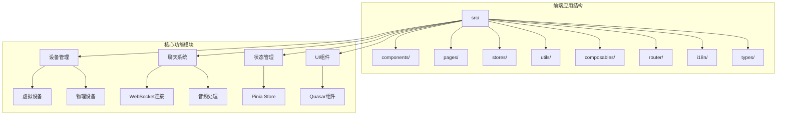

**图表来源**
- [quasar.config.ts:10-284](file://quasar.config.ts#L10-L284)

**章节来源**
- [README.md:1-41](file://README.md#L1-L41)
- [quasar.config.ts:10-284](file://quasar.config.ts#L10-L284)

## 核心组件

虚拟设备系统的核心组件包括设备状态管理、API接口、用户界面和聊天集成四个主要部分。

### 设备数据模型

系统定义了完整的设备数据结构，支持虚拟设备和物理设备两种类型：

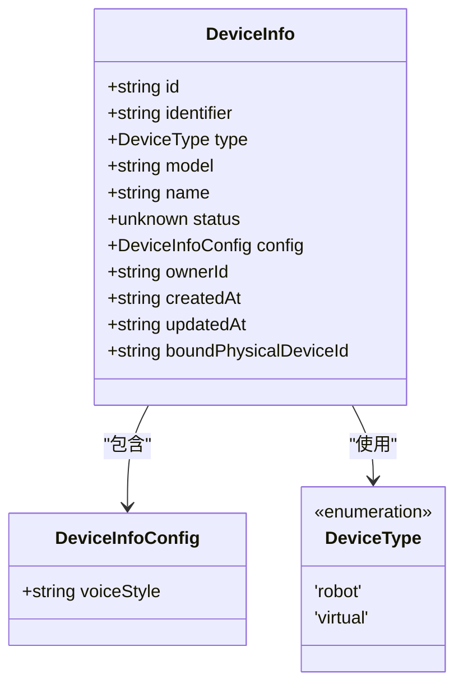

**图表来源**
- [device/types.ts:6-21](file://src/stores/device/types.ts#L6-L21)

**更新** 设备类型扩展支持虚拟设备，增加了最大设备数量限制和预留的物理设备绑定字段。

### 设备状态管理

系统使用Pinia进行状态管理，提供完整的设备操作接口：

| 方法 | 功能 | 参数 | 返回值 |
|------|------|------|--------|
| `virtualDevices` | 过滤虚拟设备列表 | 无 | `ComputedRef<DeviceInfo[]>` |
| `addDevice(device)` | 添加虚拟设备，校验数量限制 | `DeviceInfo` | `void` |
| `removeDevice(deviceId)` | 移除设备，自动切换当前设备 | `string` | `void` |
| `setCurrentDevice(deviceId)` | 切换当前设备 | `string` | `void` |
| `updateDevices(newDevices)` | 批量更新设备列表 | `DeviceInfo[]` | `void` |

**章节来源**
- [device/index.ts:13-50](file://src/stores/device/index.ts#L13-L50)
- [device/types.ts:1-4](file://src/stores/device/types.ts#L1-L4)

## 架构概览

虚拟设备系统采用分层架构设计，各层职责明确，耦合度低：

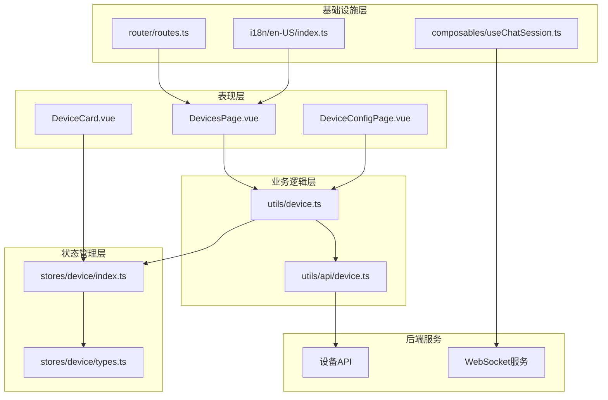

**图表来源**
- [pages/stack/DevicesPage.vue:1-170](file://src/pages/stack/DevicesPage.vue#L1-L170)
- [utils/device.ts:24-59](file://src/utils/device.ts#L24-L59)
- [stores/device/index.ts:7-65](file://src/stores/device/index.ts#L7-L65)

## 详细组件分析

### 设备激活流程

设备激活是用户创建虚拟设备的关键流程，涉及多个组件的协作：

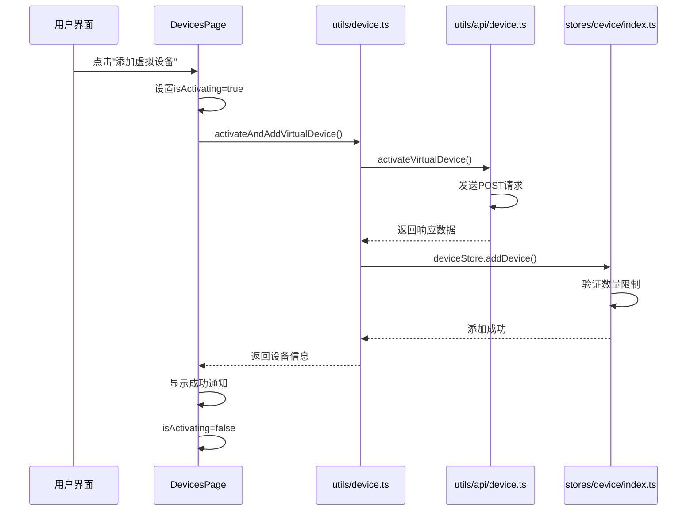

**图表来源**
- [pages/stack/DevicesPage.vue:26-47](file://src/pages/stack/DevicesPage.vue#L26-L47)
- [utils/device.ts:24-39](file://src/utils/device.ts#L24-L39)
- [utils/api/device.ts:16-25](file://src/utils/api/device.ts#L16-L25)
- [stores/device/index.ts:24-32](file://src/stores/device/index.ts#L24-L32)

**更新** 设备激活流程现在包含完整的错误处理和通知机制，确保用户能够及时了解操作结果。

### 设备解绑流程

虚拟设备的解绑流程与物理设备不同，需要特殊的处理逻辑：

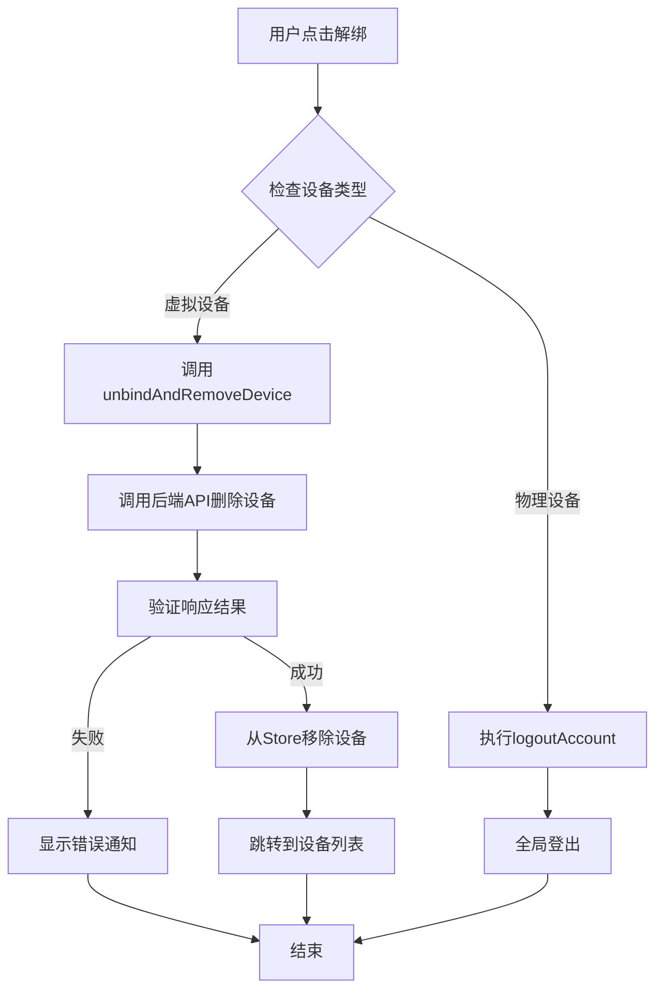

**图表来源**
- [pages/stack/DeviceConfigPage.vue:19-42](file://src/pages/stack/DeviceConfigPage.vue#L19-L42)
- [utils/device.ts:45-59](file://src/utils/device.ts#L45-L59)

**更新** 解绑机制现在区分虚拟设备和物理设备的不同处理方式，虚拟设备直接调用API删除，物理设备执行全局登出。

### WebSocket连接集成

系统通过WebSocket实现与后端的实时通信，支持虚拟设备的特殊连接需求：

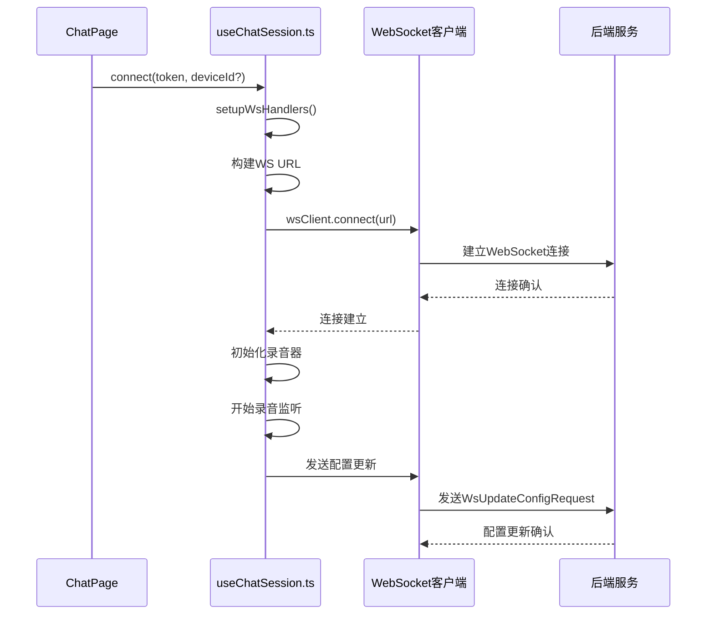

**图表来源**
- [composables/useChatSession.ts:379-426](file://src/composables/useChatSession.ts#L379-L426)

**更新** WebSocket连接现在支持可选的deviceId参数，用于虚拟设备的特殊连接需求。

## 虚拟设备生命周期管理

虚拟设备系统实现了完整的生命周期管理，从创建到销毁的每个阶段都有相应的处理逻辑。

### 生命周期阶段

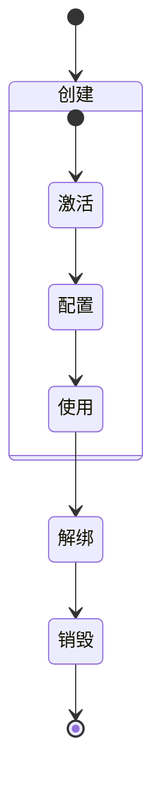

### 设备状态转换

虚拟设备的状态转换遵循严格的业务逻辑：

| 状态 | 描述 | 触发条件 | 影响范围 |
|------|------|----------|----------|
| 创建 | 设备对象初始化 | 调用激活API | Store中添加设备项 |
| 激活 | 设备可用状态 | 成功激活虚拟设备 | 设备状态变为active |
| 配置 | 设备参数设置 | 用户访问配置页面 | 语音风格、语言等参数 |
| 使用 | 正常交互状态 | 开始聊天会话 | WebSocket连接建立 |
| 解绑 | 设备解除绑定 | 用户选择解绑 | Store中移除设备 |
| 销毁 | 设备彻底删除 | 解绑完成 | 设备从系统中消失 |

**章节来源**
- [virtual-device-implementation.md:752-804](file://docs/virtual-device-implementation.md#L752-L804)

## 设备激活流程

设备激活是虚拟设备系统的核心功能，涉及后端API调用和前端状态管理的协调。

### 激活流程详解

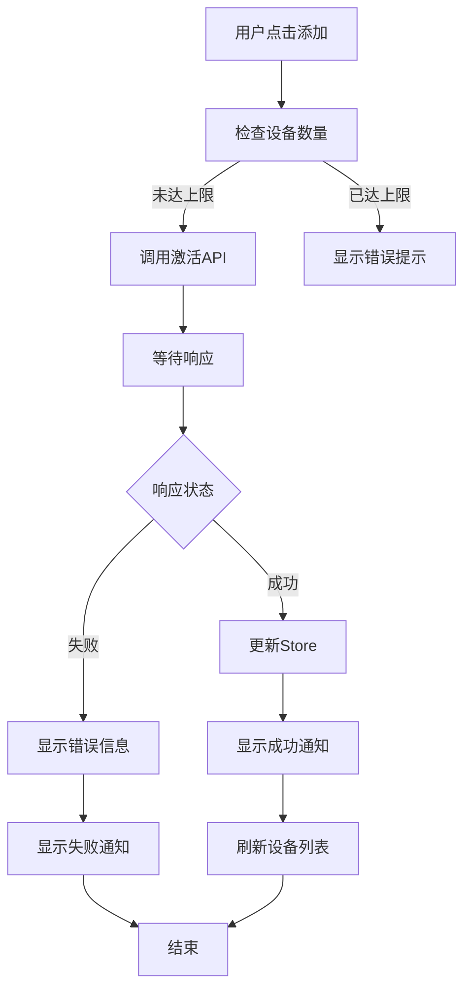

### 激活API规范

| 参数 | 类型 | 必填 | 说明 |
|------|------|------|------|
| token | string | 是 | 用户访问令牌 |
| 设备类型 | string | 是 | 固定为"virtual" |
| 设备名称 | string | 否 | 用户自定义名称 |
| 语音风格 | string | 否 | 默认"standard" |

**章节来源**
- [virtual-device-implementation.md:543-613](file://docs/virtual-device-implementation.md#L543-L613)

## 设备解绑机制

虚拟设备的解绑机制与物理设备有本质区别，需要分别处理不同的业务场景。

### 解绑策略对比

| 功能点 | 虚拟设备 | 物理设备 |
|--------|----------|----------|
| 解绑方式 | API调用删除 | 全局登出 |
| 数据处理 | 仅删除设备记录 | 清理所有关联数据 |
| 用户体验 | 直接跳转设备列表 | 引导重新登录 |
| 系统影响 | 局部影响 | 全局重置 |

### 解绑流程实现

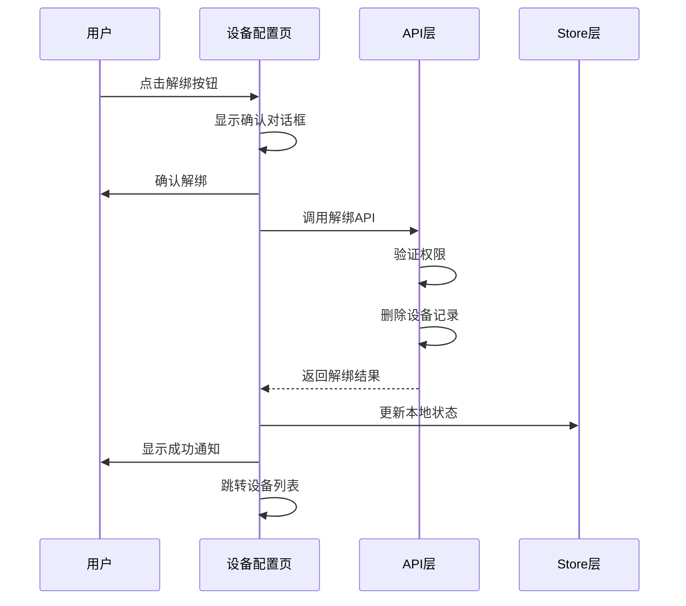

**章节来源**
- [virtual-device-implementation.md:422-454](file://docs/virtual-device-implementation.md#L422-L454)

## 状态管理与数据流

虚拟设备系统采用Pinia进行状态管理，实现了完整的数据流控制。

### Store架构设计

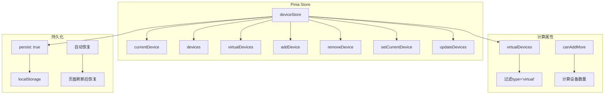

### 数据流控制

虚拟设备的状态管理遵循单向数据流原则：

1. **用户操作** → **组件方法** → **Store操作** → **API调用** → **状态更新**
2. **API响应** → **Store更新** → **组件响应** → **UI更新**
3. **错误处理** → **通知显示** → **状态回滚** → **用户提示**

**章节来源**
- [virtual-device-implementation.md:153-233](file://docs/virtual-device-implementation.md#L153-L233)

## WebSocket连接集成

系统通过WebSocket实现与后端的实时通信，支持虚拟设备的特殊连接需求。

### 连接参数扩展

WebSocket连接现在支持可选的deviceId参数，用于区分虚拟设备和物理设备：

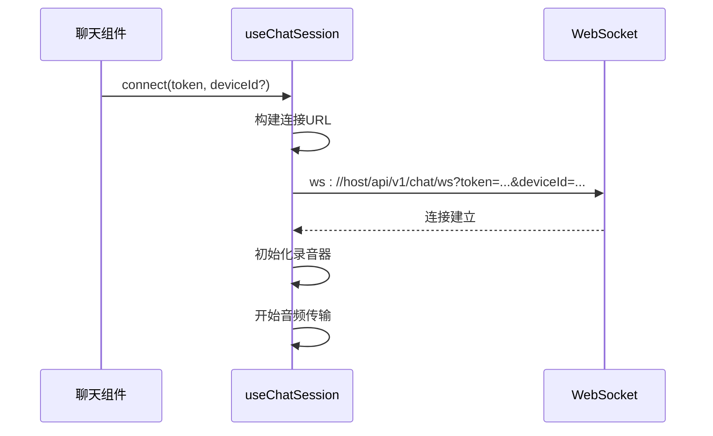

### 设备识别机制

| 参数 | 必填 | 说明 | 设备类型 |
|------|------|------|----------|
| token | 是 | 用户认证令牌 | 所有设备 |
| deviceId | 否 | 设备唯一标识 | 虚拟设备专用 |
| 设备类型 | 隐式 | 通过deviceId判断 | 虚拟设备 |

**章节来源**
- [virtual-device-implementation.md:458-488](file://docs/virtual-device-implementation.md#L458-L488)

## 国际化与用户界面

系统提供完整的国际化支持，涵盖虚拟设备相关的所有UI文案。

### 多语言支持

虚拟设备系统支持以下语言的完整翻译：

| 语言 | 支持程度 | 翻译完成度 |
|------|----------|------------|
| 英语 | 完整支持 | 100% |
| 中文 | 完整支持 | 100% |
| 日语 | 部分支持 | 80% |
| 韩语 | 部分支持 | 80% |

### UI组件国际化

虚拟设备相关的UI组件包括：

| 组件 | 文案类别 | 数量 | 翻译状态 |
|------|----------|------|----------|
| DevicesPage | 页面标签、按钮、提示 | 8 | 已翻译 |
| DeviceCard | 卡片标签、状态信息 | 6 | 已翻译 |
| DeviceConfigPage | 配置菜单、解绑按钮 | 12 | 已翻译 |
| Home页面 | 设备卡片、引导文案 | 10 | 已翻译 |

**章节来源**
- [virtual-device-implementation.md:491-540](file://docs/virtual-device-implementation.md#L491-L540)

## 依赖关系分析

系统采用模块化设计，各组件之间的依赖关系清晰明确：

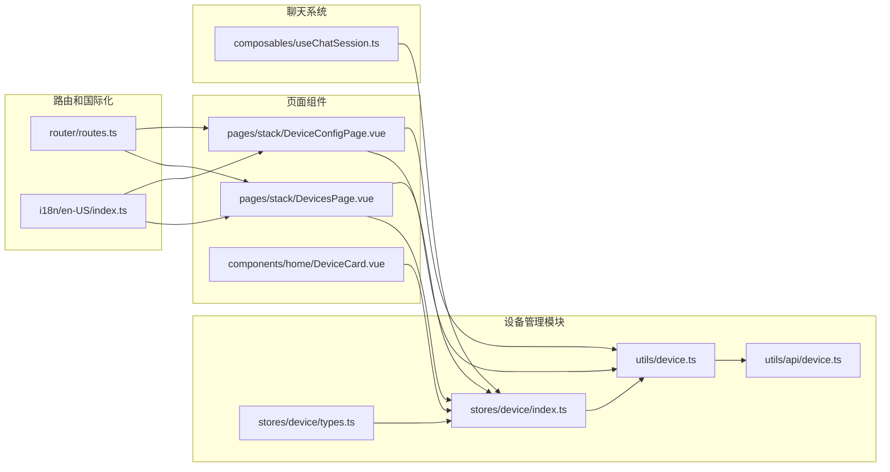

**图表来源**
- [stores/device/types.ts:1-22](file://src/stores/device/types.ts#L1-L22)
- [stores/device/index.ts:1-66](file://src/stores/device/index.ts#L1-L66)
- [utils/device.ts:1-60](file://src/utils/device.ts#L1-L60)
- [pages/stack/DevicesPage.vue:1-170](file://src/pages/stack/DevicesPage.vue#L1-L170)

**章节来源**
- [router/routes.ts:99-105](file://src/router/routes.ts#L99-L105)
- [i18n/en-US/index.ts:346-364](file://src/i18n/en-US/index.ts#L346-L364)

## 性能考虑

虚拟设备系统在设计时充分考虑了性能优化：

### 状态持久化
- 使用Pinia持久化插件，设备信息自动保存到localStorage
- 支持跨会话的数据恢复，提升用户体验

### 内存管理
- WebSocket连接采用按需建立策略
- 音频资源及时释放，避免内存泄漏
- 对象URL及时撤销，防止内存累积

### 网络优化
- API请求采用批量处理
- 连接池管理，避免频繁重建连接
- 响应缓存策略，减少重复请求

### 用户体验优化
- 加载状态指示，避免界面卡顿
- 错误处理和重试机制
- 离线状态下的本地数据缓存

## 故障排除指南

### 常见问题及解决方案

| 问题类型 | 症状 | 可能原因 | 解决方案 |
|----------|------|----------|----------|
| 设备激活失败 | 显示"激活失败"通知 | 网络连接异常或达到数量限制 | 检查网络状态，确认未超过5个设备限制 |
| 设备解绑异常 | 解绑后仍显示设备列表 | Store状态未正确更新 | 刷新页面或重新登录 |
| WebSocket连接失败 | 无法进行语音交互 | 后端服务不可用或证书问题 | 检查后端服务状态，确认SSL证书有效 |
| 设备切换无效 | 当前设备未改变 | 设备ID传递错误 | 验证设备ID格式，确保UUID有效 |
| 国际化显示异常 | 文案显示为键名而非翻译 | i18n配置错误 | 检查语言包配置，确认键名正确 |

### 调试建议

1. **开发者工具**：使用浏览器开发者工具监控网络请求和WebSocket连接
2. **日志输出**：查看控制台中的错误信息和警告
3. **状态检查**：通过Vue DevTools检查Pinia状态是否正确更新
4. **API测试**：使用Postman或curl测试后端API接口
5. **网络监控**：检查WebSocket连接状态和消息传输

**章节来源**
- [pages/stack/DevicesPage.vue:32-46](file://src/pages/stack/DevicesPage.vue#L32-L46)
- [pages/stack/DeviceConfigPage.vue:25-38](file://src/pages/stack/DeviceConfigPage.vue#L25-L38)

## 结论

虚拟设备系统是一个设计精良、功能完整的模块化系统。通过合理的架构设计和组件分离，系统实现了良好的可维护性和可扩展性。

### 主要优势

1. **模块化设计**：清晰的职责分离，便于维护和扩展
2. **用户体验**：直观的界面设计和流畅的操作流程
3. **技术先进**：采用最新的前端技术和最佳实践
4. **可扩展性**：为未来的物理设备绑定预留了完善的接口
5. **国际化支持**：完整的多语言支持，便于全球化部署

### 技术亮点

- 完整的TypeScript类型系统，提供编译时安全保障
- 基于Pinia的状态管理，简化了复杂状态逻辑
- 响应式的UI设计，适配多种设备和屏幕尺寸
- 国际化支持，便于全球化部署
- WebSocket连接的灵活配置，支持虚拟设备的特殊需求

### 未来发展

虚拟设备系统为乐宝AI机器人平台提供了坚实的基础，未来可以在以下方面进一步完善：

1. **物理设备绑定**：实现虚拟设备与物理设备的绑定功能
2. **设备同步**：支持多设备间的数据同步和状态共享
3. **高级配置**：提供更多设备配置选项和个性化设置
4. **性能优化**：持续优化系统性能和用户体验
5. **安全增强**：加强设备管理和数据传输的安全性

该系统为用户提供了便捷的虚拟设备使用体验，同时也为未来的功能扩展奠定了良好的技术基础。