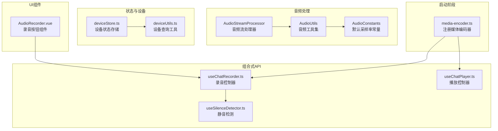
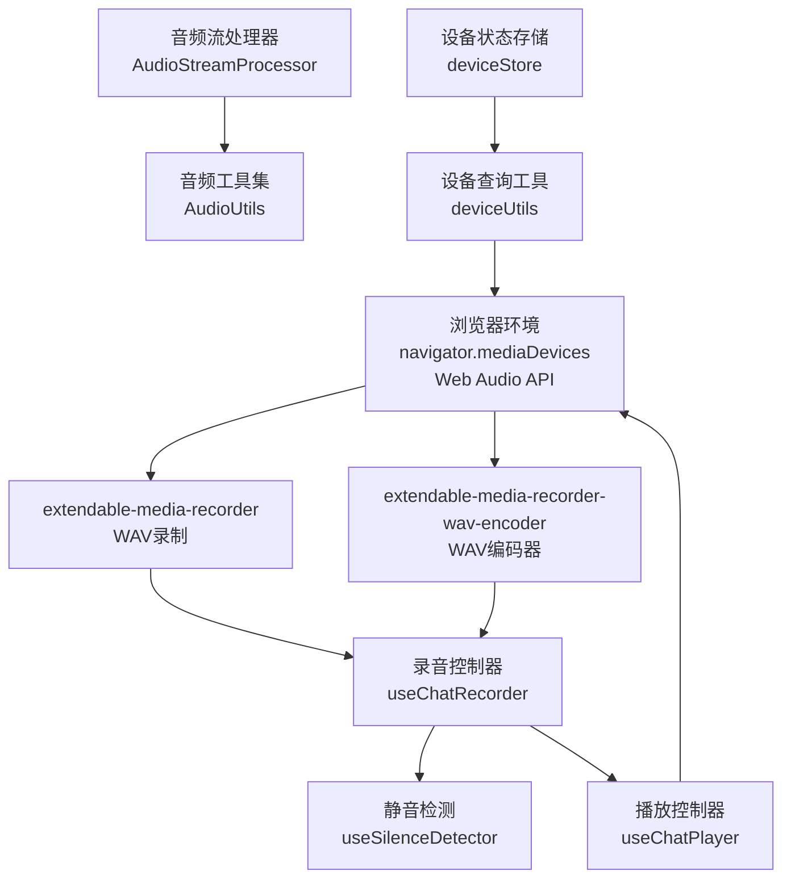
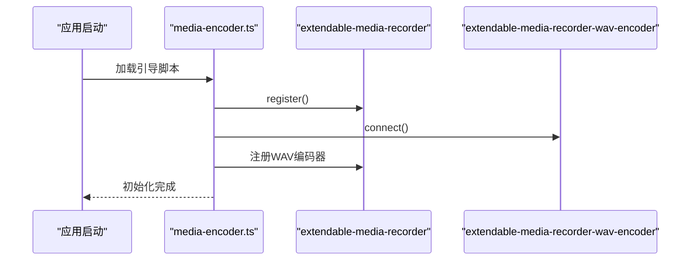
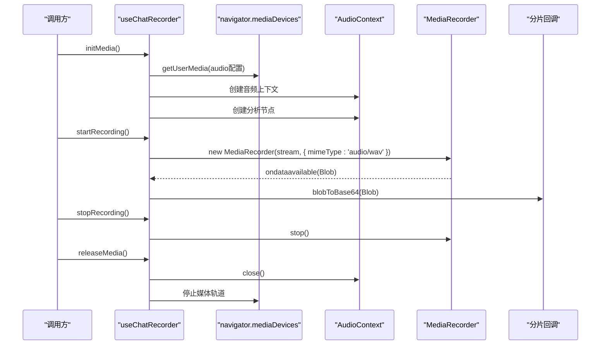
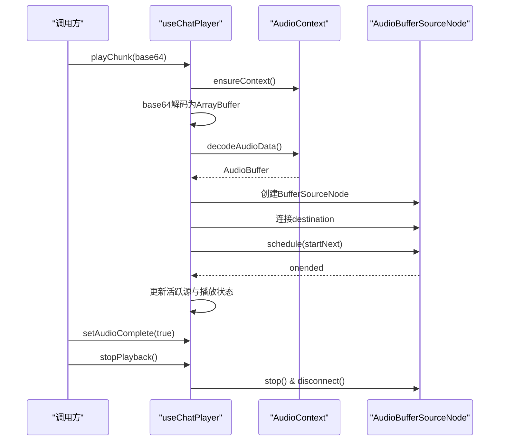
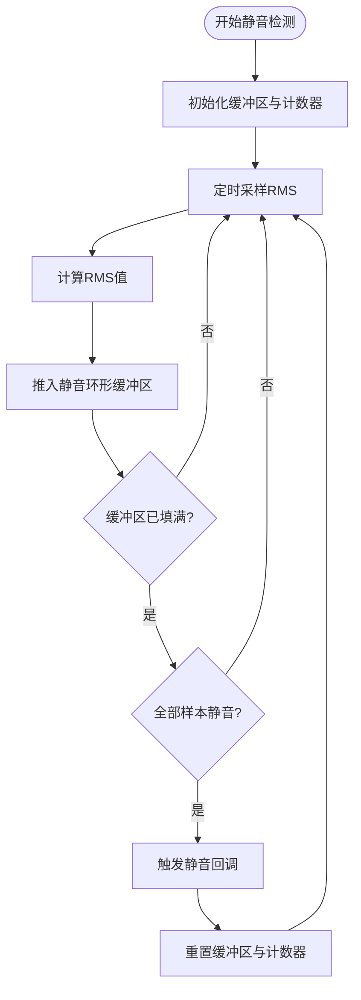
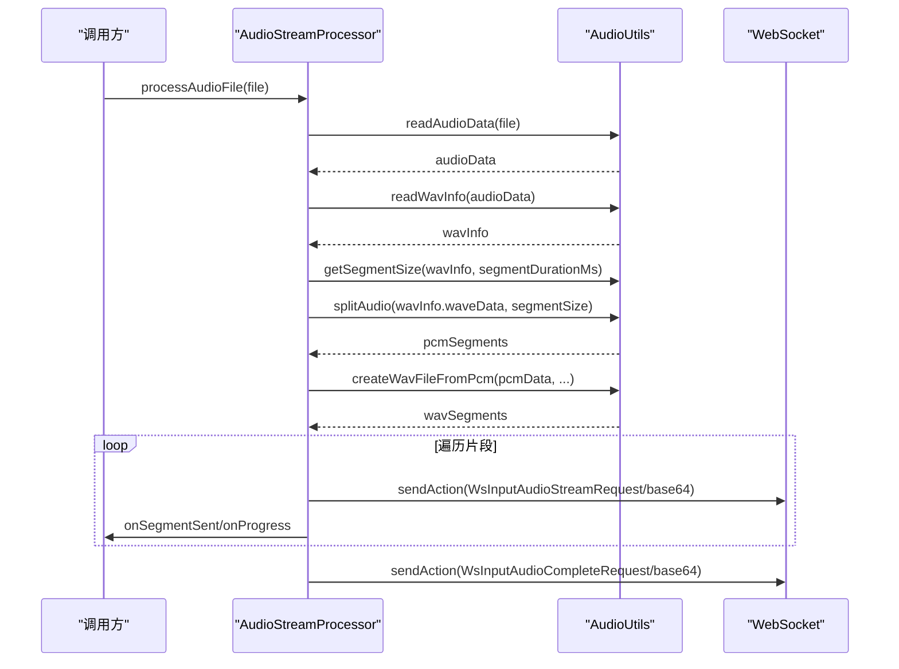
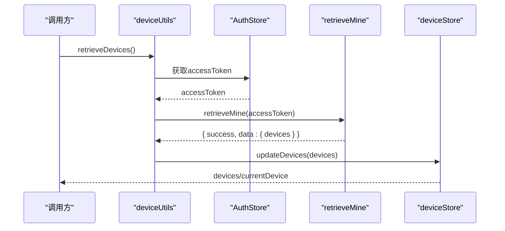
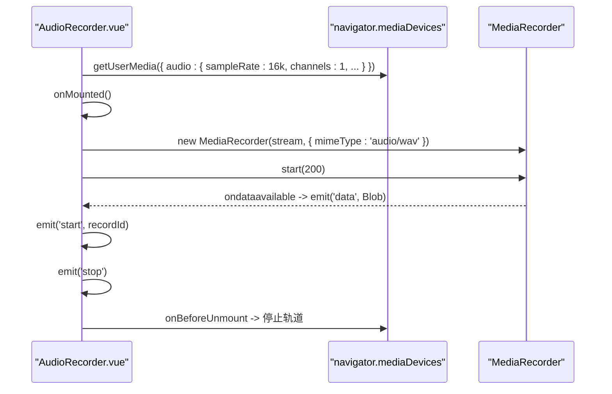
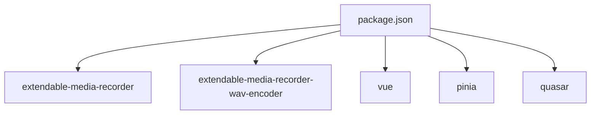

# 设备与音频管理

<cite>
**本文档引用的文件**
- [media-encoder.ts](file://src/boot/media-encoder.ts)
- [useChatRecorder.ts](file://src/composables/useChatRecorder.ts)
- [useChatPlayer.ts](file://src/composables/useChatPlayer.ts)
- [audio.ts](file://src/utils/audio.ts)
- [AudioStreamProcessor](file://src/types/audio/index.ts)
- [AudioStreamTypes](file://src/types/audio/types.ts)
- [AudioUtils](file://src/types/audio/utils.ts)
- [AudioConstants](file://src/types/audio/constants.ts)
- [deviceStore.ts](file://src/stores/device/index.ts)
- [deviceUtils.ts](file://src/utils/device.ts)
- [AudioRecorder.vue](file://src/components/AudioRecorder.vue)
- [useSilenceDetector.ts](file://src/composables/useSilenceDetector.ts)
- [chatTypes.ts](file://src/types/chat/types.ts)
- [package.json](file://package.json)
</cite>

## 目录
1. [简介](#简介)
2. [项目结构](#项目结构)
3. [核心组件](#核心组件)
4. [架构总览](#架构总览)
5. [详细组件分析](#详细组件分析)
6. [依赖关系分析](#依赖关系分析)
7. [性能考虑](#性能考虑)
8. [故障排除指南](#故障排除指南)
9. [结论](#结论)
10. [附录](#附录)

## 简介
本文件面向设备与音频管理系统，系统围绕浏览器设备检测、权限管理、音频格式处理与跨浏览器兼容性展开，覆盖设备状态监控、音频流控制、媒体编码器配置、音频录制与播放控制、以及音频处理工具函数。文档提供设备API使用示例、错误处理机制与兼容性解决方案，并总结与浏览器API的集成方式与最佳实践。

## 项目结构
系统采用模块化组织，关键目录与职责如下：
- boot：应用启动阶段注册媒体编码器，确保浏览器支持扩展媒体录制能力
- composables：封装可复用的音频录制与播放逻辑，提供组合式API
- types：定义音频流处理类与工具函数，统一音频格式转换与分段策略
- utils：通用工具函数，包括设备查询与音频格式转换
- stores：状态管理，维护设备列表与当前选中设备
- components：UI组件，如录音按钮组件，封装底层录制流程

**图表来源**
- [media-encoder.ts:1-8](file://src/boot/media-encoder.ts#L1-L8)
- [useChatRecorder.ts:1-148](file://src/composables/useChatRecorder.ts#L1-L148)
- [useChatPlayer.ts:1-161](file://src/composables/useChatPlayer.ts#L1-L161)
- [useSilenceDetector.ts:1-104](file://src/composables/useSilenceDetector.ts#L1-L104)
- [AudioStreamProcessor:1-150](file://src/types/audio/index.ts#L1-L150)
- [AudioUtils:1-312](file://src/types/audio/utils.ts#L1-L312)
- [AudioConstants:1-2](file://src/types/audio/constants.ts#L1-L2)
- [deviceStore.ts:1-27](file://src/stores/device/index.ts#L1-L27)
- [deviceUtils.ts:1-18](file://src/utils/device.ts#L1-L18)
- [AudioRecorder.vue:1-113](file://src/components/AudioRecorder.vue#L1-L113)

**章节来源**
- [media-encoder.ts:1-8](file://src/boot/media-encoder.ts#L1-L8)
- [useChatRecorder.ts:1-148](file://src/composables/useChatRecorder.ts#L1-L148)
- [useChatPlayer.ts:1-161](file://src/composables/useChatPlayer.ts#L1-L161)
- [useSilenceDetector.ts:1-104](file://src/composables/useSilenceDetector.ts#L1-L104)
- [AudioStreamProcessor:1-150](file://src/types/audio/index.ts#L1-L150)
- [AudioUtils:1-312](file://src/types/audio/utils.ts#L1-L312)
- [AudioConstants:1-2](file://src/types/audio/constants.ts#L1-L2)
- [deviceStore.ts:1-27](file://src/stores/device/index.ts#L1-L27)
- [deviceUtils.ts:1-18](file://src/utils/device.ts#L1-L18)
- [AudioRecorder.vue:1-113](file://src/components/AudioRecorder.vue#L1-L113)

## 核心组件
- 媒体编码器注册：在应用启动时注册扩展媒体录制器与WAV编码器，确保浏览器具备录制WAV格式的能力
- 录音控制器：提供媒体流初始化、录音启动/停止、分片回调、静音分析节点获取等功能
- 播放控制器：提供基于Web Audio API的无间断音频流播放、完成标记、缓冲清理与资源释放
- 静音检测：基于RMS阈值的周期性静音检测，支持配置阈值、采样间隔与连续静音计数
- 音频流处理器：负责将音频文件按固定时长切分为WAV片段，进行base64传输与进度回调
- 设备状态存储与查询：维护设备列表与当前设备，提供设备查询工具函数

**章节来源**
- [media-encoder.ts:1-8](file://src/boot/media-encoder.ts#L1-L8)
- [useChatRecorder.ts:1-148](file://src/composables/useChatRecorder.ts#L1-L148)
- [useChatPlayer.ts:1-161](file://src/composables/useChatPlayer.ts#L1-L161)
- [useSilenceDetector.ts:1-104](file://src/composables/useSilenceDetector.ts#L1-L104)
- [AudioStreamProcessor:1-150](file://src/types/audio/index.ts#L1-L150)
- [deviceStore.ts:1-27](file://src/stores/device/index.ts#L1-L27)
- [deviceUtils.ts:1-18](file://src/utils/device.ts#L1-L18)

## 架构总览
系统整体架构围绕浏览器Web Audio API与MediaRecorder API构建，结合扩展媒体录制器实现稳定的WAV录制与播放体验。设备管理与权限申请贯穿于应用生命周期，音频处理工具链确保格式一致性与跨浏览器兼容性。

**图表来源**
- [media-encoder.ts:1-8](file://src/boot/media-encoder.ts#L1-L8)
- [useChatRecorder.ts:1-148](file://src/composables/useChatRecorder.ts#L1-L148)
- [useChatPlayer.ts:1-161](file://src/composables/useChatPlayer.ts#L1-L161)
- [useSilenceDetector.ts:1-104](file://src/composables/useSilenceDetector.ts#L1-L104)
- [AudioStreamProcessor:1-150](file://src/types/audio/index.ts#L1-L150)
- [AudioUtils:1-312](file://src/types/audio/utils.ts#L1-L312)
- [deviceStore.ts:1-27](file://src/stores/device/index.ts#L1-L27)
- [deviceUtils.ts:1-18](file://src/utils/device.ts#L1-L18)

## 详细组件分析

### 媒体编码器注册
- 目标：在应用启动时注册扩展媒体录制器与WAV编码器，确保浏览器具备录制WAV格式的能力
- 实现要点：通过引导脚本注册，避免在运行时重复初始化；与extendable-media-recorder和extendable-media-recorder-wav-encoder协作

**图表来源**
- [media-encoder.ts:1-8](file://src/boot/media-encoder.ts#L1-L8)

**章节来源**
- [media-encoder.ts:1-8](file://src/boot/media-encoder.ts#L1-L8)

### 录音控制器（useChatRecorder）
- 功能概述：提供媒体流初始化、录音启动/停止、分片回调、静音分析节点获取
- 关键流程：
  - 初始化媒体流：请求用户媒体设备，设置采样率、位深、声道数与自动降噪、回声消除、自动增益
  - 创建音频上下文与分析节点：用于静音检测，不连接到扬声器
  - 启动录制：使用MediaRecorder以WAV格式、200ms切片输出音频分片
  - 分片回调：将Blob转为base64字符串，供上层处理
  - 资源释放：关闭音频上下文、停止媒体轨道、重置状态

**图表来源**
- [useChatRecorder.ts:1-148](file://src/composables/useChatRecorder.ts#L1-L148)

**章节来源**
- [useChatRecorder.ts:1-148](file://src/composables/useChatRecorder.ts#L1-L148)
- [chatTypes.ts:85-96](file://src/types/chat/types.ts#L85-L96)

### 播放控制器（useChatPlayer）
- 功能概述：基于Web Audio API的无间断音频流播放，支持立即中断、完成标记与缓冲清理
- 关键流程：
  - 确保音频上下文存在并初始化下一播放时间线
  - 将base64音频解码为AudioBuffer，创建BufferSourceNode
  - 基于当前时间与下一播放时间计算开始时间，确保无缝衔接
  - 监听播放结束事件，更新活跃源列表与播放状态
  - 支持停止播放、清空缓冲、生成合并后的Blob

**图表来源**
- [useChatPlayer.ts:1-161](file://src/composables/useChatPlayer.ts#L1-L161)

**章节来源**
- [useChatPlayer.ts:1-161](file://src/composables/useChatPlayer.ts#L1-L161)

### 静音检测（useSilenceDetector）
- 功能概述：基于RMS阈值的周期性静音检测，支持配置阈值、采样间隔与连续静音计数
- 关键流程：
  - 计算分析节点的RMS值，维护固定长度的静音环形缓冲区
  - 在缓冲区填满后，若全部样本均低于阈值则触发静音回调
  - 触发后重置缓冲区，避免重复触发

**图表来源**
- [useSilenceDetector.ts:1-104](file://src/composables/useSilenceDetector.ts#L1-L104)
- [chatTypes.ts:56-73](file://src/types/chat/types.ts#L56-L73)

**章节来源**
- [useSilenceDetector.ts:1-104](file://src/composables/useSilenceDetector.ts#L1-L104)
- [chatTypes.ts:56-73](file://src/types/chat/types.ts#L56-L73)

### 音频流处理器（AudioStreamProcessor）
- 功能概述：将音频文件按固定时长切分为WAV片段，进行base64传输与进度回调
- 关键流程：
  - 读取音频文件数据，解析WAV信息（声道数、采样率、位深、PCM数据）
  - 计算分段大小（基于PCM数据与时长），分割纯PCM数据
  - 为每个PCM片段生成完整WAV文件（含头部），最后片段通过特定请求类型发送
  - 提供停止处理与进度回调接口

**图表来源**
- [AudioStreamProcessor:1-150](file://src/types/audio/index.ts#L1-L150)
- [AudioUtils:1-312](file://src/types/audio/utils.ts#L1-L312)
- [AudioStreamTypes:1-14](file://src/types/audio/types.ts#L1-L14)

**章节来源**
- [AudioStreamProcessor:1-150](file://src/types/audio/index.ts#L1-L150)
- [AudioUtils:1-312](file://src/types/audio/utils.ts#L1-L312)
- [AudioStreamTypes:1-14](file://src/types/audio/types.ts#L1-L14)

### 设备状态管理与查询
- 功能概述：维护设备列表与当前设备，提供设备查询工具函数
- 关键流程：
  - 通过认证状态获取访问令牌
  - 调用设备查询API获取设备列表
  - 更新Pinia存储中的设备列表与当前设备

**图表来源**
- [deviceUtils.ts:1-18](file://src/utils/device.ts#L1-L18)
- [deviceStore.ts:1-27](file://src/stores/device/index.ts#L1-L27)

**章节来源**
- [deviceUtils.ts:1-18](file://src/utils/device.ts#L1-L18)
- [deviceStore.ts:1-27](file://src/stores/device/index.ts#L1-L27)

### UI组件：录音按钮（AudioRecorder.vue）
- 功能概述：封装录音按钮组件，提供开始/停止录音事件与错误通知
- 关键流程：
  - 组件挂载时请求媒体设备权限并创建媒体流
  - 开始录音时创建MediaRecorder实例，设置200ms切片
  - 录音过程中通过事件发射音频数据
  - 组件卸载时停止媒体轨道

**图表来源**
- [AudioRecorder.vue:1-113](file://src/components/AudioRecorder.vue#L1-L113)

**章节来源**
- [AudioRecorder.vue:1-113](file://src/components/AudioRecorder.vue#L1-L113)

## 依赖关系分析
系统依赖的关键外部库与版本：
- extendable-media-recorder：提供扩展媒体录制能力
- extendable-media-recorder-wav-encoder：提供WAV编码器
- vue：响应式框架
- pinia：状态管理
- quasar：UI框架

**图表来源**
- [package.json:17-30](file://package.json#L17-L30)

**章节来源**
- [package.json:17-30](file://package.json#L17-L30)

## 性能考虑
- 录音切片：采用200ms切片，平衡延迟与CPU占用
- 静音检测：RMS采样间隔与连续静音计数可调，避免误判与过度触发
- 播放调度：基于AudioContext时间线的无缝播放，减少停顿
- 资源释放：及时关闭音频上下文与停止媒体轨道，防止内存泄漏
- 跨浏览器兼容：通过扩展媒体录制器与WAV编码器确保录制稳定性

[本节为通用性能建议，无需具体文件引用]

## 故障排除指南
- 权限问题：录音前需确保用户授予媒体设备权限；若失败，检查HTTPS与浏览器权限设置
- 录音失败：确认浏览器支持WAV录制；若失败，检查扩展媒体录制器是否正确注册
- 播放异常：解码失败时会记录警告；检查base64数据完整性与音频格式
- 静音检测不生效：调整RMS阈值与采样间隔，确保分析节点正确连接且未被意外断开
- 设备查询失败：检查访问令牌与网络状态；确认API返回成功标志

**章节来源**
- [useChatRecorder.ts:72-91](file://src/composables/useChatRecorder.ts#L72-L91)
- [useChatPlayer.ts:93-96](file://src/composables/useChatPlayer.ts#L93-L96)
- [useSilenceDetector.ts:52-78](file://src/composables/useSilenceDetector.ts#L52-L78)
- [deviceUtils.ts:8-17](file://src/utils/device.ts#L8-L17)

## 结论
本系统通过扩展媒体录制器与Web Audio API实现了稳定、可配置的音频录制与播放能力，配合静音检测与音频流处理器，满足实时语音交互需求。设备状态管理与权限申请贯穿应用生命周期，确保用户体验与系统稳定性。建议在生产环境中持续关注浏览器兼容性与性能优化，定期评估音频格式与采样参数以适配不同场景。

[本节为总结性内容，无需具体文件引用]

## 附录

### 设备API使用示例
- 获取设备列表：调用设备查询工具函数，内部通过认证状态与API获取设备数组
- 更新当前设备：将设备列表写入Pinia存储，自动选择首个设备作为当前设备

**章节来源**
- [deviceUtils.ts:5-17](file://src/utils/device.ts#L5-L17)
- [deviceStore.ts:12-21](file://src/stores/device/index.ts#L12-L21)

### 错误处理机制
- 录音：捕获MediaRecorder异常并通过通知组件提示错误
- 播放：解码失败时记录警告并继续播放队列
- 设备查询：令牌缺失或API失败时抛出错误并阻断流程

**章节来源**
- [AudioRecorder.vue:52-59](file://src/components/AudioRecorder.vue#L52-L59)
- [useChatPlayer.ts:93-96](file://src/composables/useChatPlayer.ts#L93-L96)
- [deviceUtils.ts:8-17](file://src/utils/device.ts#L8-L17)

### 兼容性解决方案
- 使用扩展媒体录制器与WAV编码器，统一录制格式
- 在播放端严格遵循WAV格式规范，确保跨浏览器一致性
- 对非WAV文件进行格式转换，强制采样率与声道数满足API要求

**章节来源**
- [media-encoder.ts:1-8](file://src/boot/media-encoder.ts#L1-L8)
- [AudioUtils:93-139](file://src/types/audio/utils.ts#L93-L139)
- [AudioUtils:221-262](file://src/types/audio/utils.ts#L221-L262)