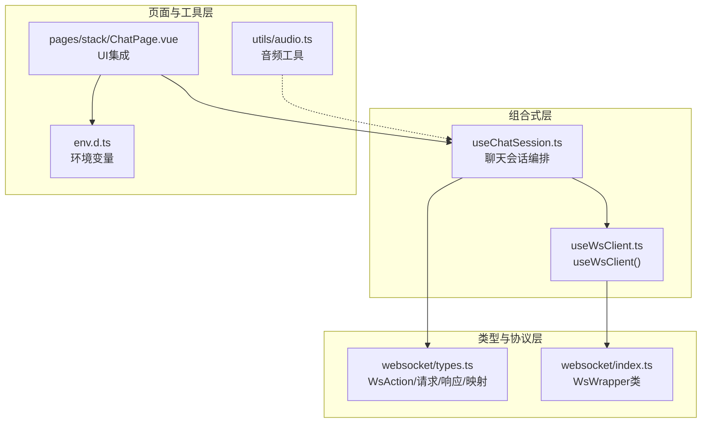
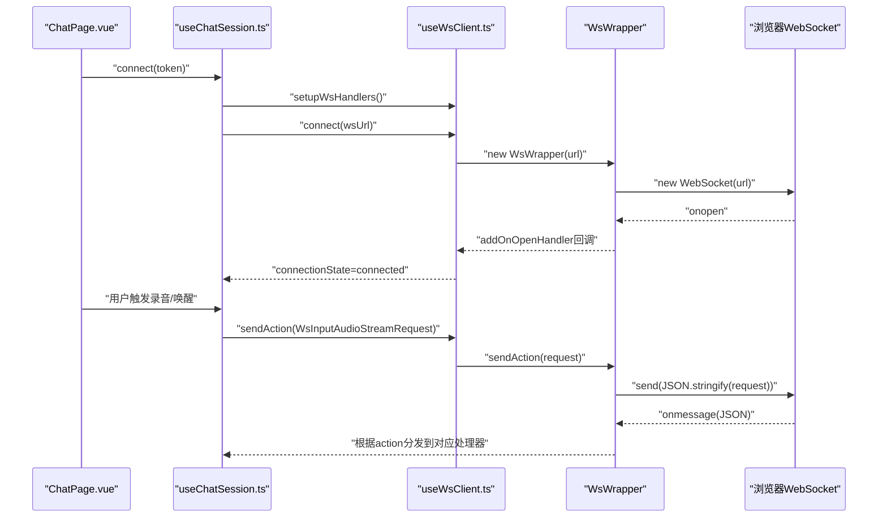
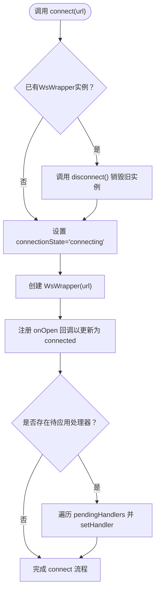
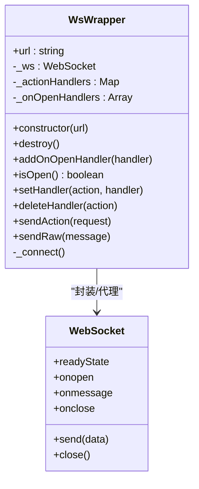
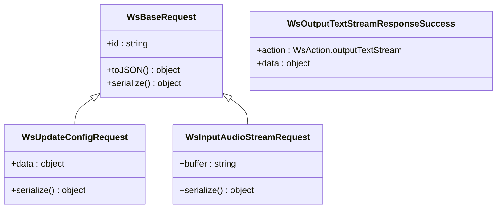
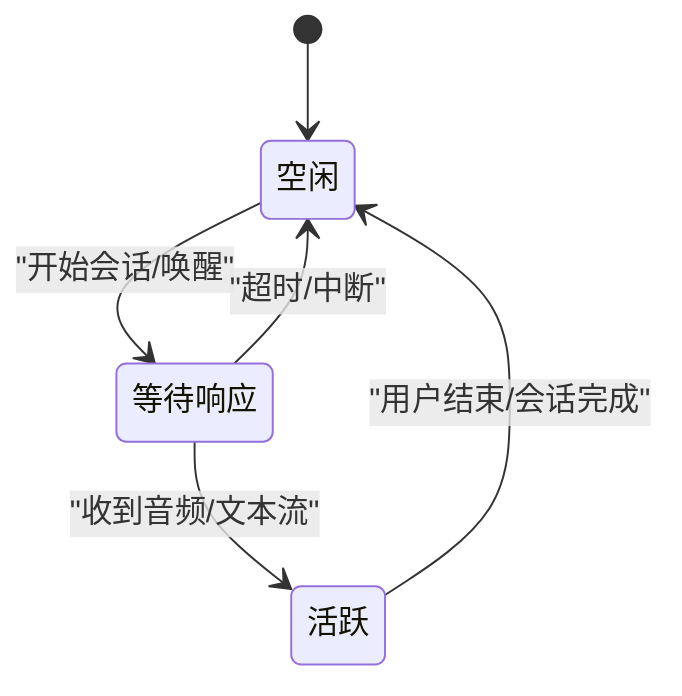
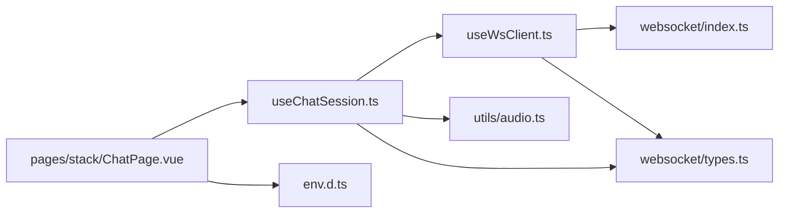

# WebSocket通信

<cite>
**本文引用的文件**
- [useWsClient.ts](file://src/composables/useWsClient.ts)
- [websocket/index.ts](file://src/types/websocket/index.ts)
- [websocket/types.ts](file://src/types/websocket/types.ts)
- [useChatSession.ts](file://src/composables/useChatSession.ts)
- [chat/types.ts](file://src/types/chat/types.ts)
- [pages/stack/ChatPage.vue](file://src/pages/stack/ChatPage.vue)
- [utils/audio.ts](file://src/utils/audio.ts)
- [env.d.ts](file://src/env.d.ts)
- [package.json](file://package.json)
</cite>

## 目录
1. [简介](#简介)
2. [项目结构](#项目结构)
3. [核心组件](#核心组件)
4. [架构总览](#架构总览)
5. [详细组件分析](#详细组件分析)
6. [依赖关系分析](#依赖关系分析)
7. [性能考量](#性能考量)
8. [故障排查指南](#故障排查指南)
9. [结论](#结论)
10. [附录](#附录)

## 简介
本文件聚焦于前端WebSocket通信模块的技术文档，系统性解析useWsClient组合式函数的实现原理与使用方式，涵盖连接管理、消息路由、事件处理、错误恢复机制；明确WebSocket消息格式、动作类型定义、连接状态管理与自动重连策略；阐述消息序列化/反序列化流程、心跳检测机制现状与网络异常处理；提供API使用示例、连接池管理策略与性能优化建议，并解释与后端服务的协议交互、消息队列与实时数据传输机制。

## 项目结构
WebSocket相关代码主要分布在以下位置：
- 组合式函数：src/composables/useWsClient.ts（对外暴露useWsClient）
- WebSocket封装：src/types/websocket/index.ts（WsWrapper类）
- 类型与协议：src/types/websocket/types.ts（WsAction枚举、请求/响应类型、处理器签名）
- 会话编排：src/composables/useChatSession.ts（聊天会话生命周期与消息路由）
- 聊天类型常量：src/types/chat/types.ts（超时、采样率等常量）
- 页面集成：src/pages/stack/ChatPage.vue（连接、断开、唤醒、中断等操作）
- 音频工具：src/utils/audio.ts（PCM到WAV转换）
- 环境变量：src/env.d.ts（后端WS基础URL）
- 依赖：package.json（运行时依赖）

图表来源
- [useWsClient.ts:1-103](file://src/composables/useWsClient.ts#L1-L103)
- [websocket/index.ts:1-92](file://src/types/websocket/index.ts#L1-L92)
- [websocket/types.ts:1-226](file://src/types/websocket/types.ts#L1-L226)
- [useChatSession.ts:1-589](file://src/composables/useChatSession.ts#L1-L589)
- [pages/stack/ChatPage.vue:1-179](file://src/pages/stack/ChatPage.vue#L1-L179)
- [utils/audio.ts:1-47](file://src/utils/audio.ts#L1-L47)
- [env.d.ts:1-10](file://src/env.d.ts#L1-L10)

章节来源
- [useWsClient.ts:1-103](file://src/composables/useWsClient.ts#L1-L103)
- [websocket/index.ts:1-92](file://src/types/websocket/index.ts#L1-L92)
- [websocket/types.ts:1-226](file://src/types/websocket/types.ts#L1-L226)
- [useChatSession.ts:1-589](file://src/composables/useChatSession.ts#L1-L589)
- [pages/stack/ChatPage.vue:1-179](file://src/pages/stack/ChatPage.vue#L1-L179)
- [utils/audio.ts:1-47](file://src/utils/audio.ts#L1-L47)
- [env.d.ts:1-10](file://src/env.d.ts#L1-L10)
- [package.json:1-61](file://package.json#L1-L61)

## 核心组件
- useWsClient：对外暴露连接、断开、注册/移除处理器、发送请求、查询连接状态等能力，内部基于WsWrapper进行WebSocket生命周期管理与自动重连。
- WsWrapper：对原生WebSocket的封装，负责连接建立、消息收发、动作分发、自动重连、打开回调通知等。
- 类型系统：通过WsAction枚举与请求/响应类型定义，确保消息格式与处理器签名的强类型约束。
- useChatSession：在useWsClient之上构建聊天会话编排逻辑，包括状态机、超时控制、录音/播放/静音检测、与后端协议的交互。

章节来源
- [useWsClient.ts:29-102](file://src/composables/useWsClient.ts#L29-L102)
- [websocket/index.ts:5-91](file://src/types/websocket/index.ts#L5-L91)
- [websocket/types.ts:3-226](file://src/types/websocket/types.ts#L3-L226)
- [useChatSession.ts:74-571](file://src/composables/useChatSession.ts#L74-L571)

## 架构总览
WebSocket通信采用“组合式函数 + 封装类 + 强类型协议”的分层设计：
- 组合式函数层：useWsClient提供响应式连接状态与统一API。
- 封装类层：WsWrapper封装WebSocket细节，提供自动重连、消息路由、打开回调。
- 协议层：通过WsAction与请求/响应类型定义消息契约。
- 业务层：useChatSession将协议与UI、录音、播放、静音检测等子系统整合。

图表来源
- [useChatSession.ts:379-425](file://src/composables/useChatSession.ts#L379-L425)
- [useWsClient.ts:37-55](file://src/composables/useWsClient.ts#L37-L55)
- [websocket/index.ts:61-90](file://src/types/websocket/index.ts#L61-L90)

## 详细组件分析

### useWsClient组合式函数
- 连接管理
  - connect(url)：若已存在实例则先断开，设置连接状态为connecting，创建WsWrapper实例，并在连接打开时更新为connected；同时应用之前注册但尚未生效的处理器。
  - disconnect()：销毁底层WsWrapper，清空连接状态。
  - isConnected()：基于底层WsWrapper的isOpen()判断是否处于OPEN状态。
- 消息路由
  - onAction(action, handler)：若已连接则直接注册到WsWrapper；否则暂存至pendingHandlers，待connect()时批量应用。
  - offAction(action)：从已连接实例或pendingHandlers中移除处理器。
  - sendAction(request)：若已连接则调用WsWrapper.sendAction()序列化并发送；否则记录警告。
- 错误恢复机制
  - 通过WsWrapper继承的自动重连策略，在连接关闭时延迟重试，保证会话稳定性。

图表来源
- [useWsClient.ts:37-55](file://src/composables/useWsClient.ts#L37-L55)

章节来源
- [useWsClient.ts:29-102](file://src/composables/useWsClient.ts#L29-L102)

### WsWrapper封装类
- 连接与自动重连
  - 构造函数内即发起连接；onclose时弹出提示并延时重连（固定间隔）。
  - isOpen()返回当前readyState是否为OPEN。
- 消息收发
  - sendAction()将请求对象序列化为JSON字符串后发送。
  - sendRaw()支持原始二进制/文本消息发送（带连接态检查）。
- 动作分发
  - setHandler()/deleteHandler()维护action到处理器的映射。
  - onmessage中解析JSON，按message.action分发给对应处理器；未知动作发出警告并打印日志。
- 打开回调
  - addOnOpenHandler()注册连接成功回调（默认包含一次通知）。

图表来源
- [websocket/index.ts:5-91](file://src/types/websocket/index.ts#L5-L91)

章节来源
- [websocket/index.ts:5-91](file://src/types/websocket/index.ts#L5-L91)

### 类型与协议系统
- 动作类型定义
  - WsAction枚举覆盖建立连接、输入/输出音频流、文本流、取消输出、清理上下文、更新配置、完成事件等。
- 请求/响应模型
  - 基类WsBaseRequest提供唯一id与序列化接口；具体请求类覆盖serialize()以生成data字段。
  - 响应类型包含成功与错误两种形态（success: true/false），并携带统一的id/action字段。
  - WsResponseMapping将每个WsAction映射到对应的响应类型集合。
- 处理器签名
  - WsHandler<T>表示针对特定响应类型的处理器，可异步执行。

图表来源
- [websocket/types.ts:30-195](file://src/types/websocket/types.ts#L30-L195)
- [websocket/types.ts:204-226](file://src/types/websocket/types.ts#L204-L226)

章节来源
- [websocket/types.ts:3-226](file://src/types/websocket/types.ts#L3-L226)

### useChatSession会话编排
- 连接与初始化
  - 在connect()中先setupWsHandlers()，再构造WS URL并调用wsClient.connect()。
  - 同时初始化录音、静音检测、唤醒词监听与播放器回调。
- 消息路由
  - 注册establishConnection、updateConfig、outputAudioStream/Complete、outputTextStream/Complete、chatComplete、cancelOutput等处理器。
- 会话生命周期
  - 三态机：Idle → WaitingResponse → Active → Idle，结合超时检查与静音检测驱动状态切换。
  - 超时：WaitingResponse超过阈值自动结束会话并回到Idle。
  - 中断：手动或语音中断均会发送取消输出请求并清理播放缓冲。
- 录音/播放/音频处理
  - 录音chunk通过WsInputAudioStreamRequest持续发送。
  - 输出音频通过WsOutputAudioStreamResponseSuccess接收，逐块播放并累积，最终合并为WAV供回放。

图表来源
- [useChatSession.ts:244-303](file://src/composables/useChatSession.ts#L244-L303)
- [chat/types.ts:11-83](file://src/types/chat/types.ts#L11-L83)

章节来源
- [useChatSession.ts:74-571](file://src/composables/useChatSession.ts#L74-L571)
- [chat/types.ts:11-83](file://src/types/chat/types.ts#L11-L83)

### 页面集成与API使用示例
- ChatPage.vue
  - 提供连接/断开、唤醒、中断、清空上下文等操作入口。
  - 展示连接状态、会话ID、当前状态等信息。
- 典型调用链
  - connect(token)：构造WS URL（从环境变量读取）、注册处理器、启动录音/播放/静音检测、开始唤醒监听。
  - sendAction(new WsInputAudioStreamRequest(base64))：在录音chunk回调中发送音频流。
  - sendAction(new WsCancelOutputRequest('manual'))：手动中断当前会话。
  - sendAction(new WsClearContextRequest())：清空会话上下文。

章节来源
- [pages/stack/ChatPage.vue:1-179](file://src/pages/stack/ChatPage.vue#L1-L179)
- [useChatSession.ts:379-425](file://src/composables/useChatSession.ts#L379-L425)
- [useChatSession.ts:391-404](file://src/composables/useChatSession.ts#L391-L404)
- [useChatSession.ts:340](file://src/composables/useChatSession.ts#L340)
- [useChatSession.ts:487](file://src/composables/useChatSession.ts#L487)
- [env.d.ts:3-5](file://src/env.d.ts#L3-L5)

## 依赖关系分析
- useWsClient依赖WsWrapper与类型系统（WsAction/WsHandler/WsRequest/WsResponseMapping）。
- WsWrapper依赖浏览器原生WebSocket与Quasar通知组件。
- useChatSession依赖useWsClient、录音/播放/静音检测子组合式函数、Pinia聊天store、音频工具等。
- 页面ChatPage.vue依赖useChatSession与路由、权限store。

图表来源
- [useWsClient.ts:1-5](file://src/composables/useWsClient.ts#L1-L5)
- [websocket/index.ts:1-4](file://src/types/websocket/index.ts#L1-L4)
- [websocket/types.ts:1-4](file://src/types/websocket/types.ts#L1-L4)
- [useChatSession.ts:1-28](file://src/composables/useChatSession.ts#L1-L28)
- [pages/stack/ChatPage.vue:1-14](file://src/pages/stack/ChatPage.vue#L1-L14)
- [utils/audio.ts:1-47](file://src/utils/audio.ts#L1-L47)
- [env.d.ts:1-10](file://src/env.d.ts#L1-L10)

章节来源
- [useWsClient.ts:1-5](file://src/composables/useWsClient.ts#L1-L5)
- [websocket/index.ts:1-4](file://src/types/websocket/index.ts#L1-L4)
- [websocket/types.ts:1-4](file://src/types/websocket/types.ts#L1-L4)
- [useChatSession.ts:1-28](file://src/composables/useChatSession.ts#L1-L28)
- [pages/stack/ChatPage.vue:1-14](file://src/pages/stack/ChatPage.vue#L1-L14)
- [utils/audio.ts:1-47](file://src/utils/audio.ts#L1-L47)
- [env.d.ts:1-10](file://src/env.d.ts#L1-L10)

## 性能考量
- 连接与重连
  - 自动重连采用固定延迟，简单可靠；如需降低抖动，可在WsWrapper中引入指数退避与抖动因子。
- 消息序列化
  - sendAction()使用JSON.stringify，建议避免频繁大对象序列化；对音频流等高频场景可考虑二进制帧或压缩。
- 处理器注册
  - 使用pendingHandlers在connect前注册处理器，避免重复注册与竞态；注意及时清理不再使用的处理器以减少内存占用。
- 音频处理
  - 录音chunk大小与频率影响网络负载与延迟；结合静音检测与超时控制，减少无效传输。
- UI渲染
  - 文本流与音频流的增量更新应配合虚拟滚动与节流，避免频繁重绘。

## 故障排查指南
- 无法连接/频繁断开
  - 检查LE_BOT_BACKEND_WS_BASE_URL是否正确；确认WsWrapper的onclose重连逻辑是否触发。
  - 查看控制台日志与Quasar通知，定位网络异常或服务端问题。
- 未知动作/消息丢失
  - 确认WsAction枚举与后端一致；检查WsResponseMapping映射是否完整。
  - 对未识别的动作，系统会发出警告通知，便于快速定位问题。
- 发送失败
  - 若未连接，sendAction会记录警告；请先确保connectionState为connected后再发送。
- 音频播放异常
  - 检查PCM到WAV转换流程与对象URL释放；确认播放器实例与当前回合匹配。

章节来源
- [websocket/index.ts:63-89](file://src/types/websocket/index.ts#L63-L89)
- [websocket/types.ts:204-216](file://src/types/websocket/types.ts#L204-L216)
- [useWsClient.ts:81-87](file://src/composables/useWsClient.ts#L81-L87)
- [useChatSession.ts:130-147](file://src/composables/useChatSession.ts#L130-L147)
- [utils/audio.ts:1-47](file://src/utils/audio.ts#L1-L47)

## 结论
该WebSocket通信模块通过useWsClient与WsWrapper实现了清晰的连接管理与消息路由，结合useChatSession的会话编排，满足了实时音频/文本交互的复杂需求。类型系统确保了消息契约的强一致性，自动重连提升了鲁棒性。建议后续在重连策略、消息压缩与UI渲染优化方面进一步完善，以获得更佳的用户体验与性能表现。

## 附录

### WebSocket消息格式与动作类型
- 通用字段
  - id：请求唯一标识（由请求基类生成）
  - action：动作类型（WsAction枚举）
  - data：动作相关数据（按具体请求/响应定义）
- 成功/错误响应
  - 成功：success=true，携带data
  - 错误：success=false，携带message与可能的错误详情

章节来源
- [websocket/types.ts:17-28](file://src/types/websocket/types.ts#L17-L28)
- [websocket/types.ts:30-47](file://src/types/websocket/types.ts#L30-L47)

### 心跳检测机制
- 当前实现未内置心跳保活；如需增强可靠性，可在WsWrapper中增加ping/pong逻辑并在onclose前主动清理。

章节来源
- [websocket/index.ts:61-90](file://src/types/websocket/index.ts#L61-L90)

### 连接池管理策略
- 单实例策略：useWsClient仅维护一个WsWrapper实例，避免多连接带来的资源竞争与状态不一致。
- 多会话支持：通过不同会话独立调用connect/disconnect，确保会话隔离。

章节来源
- [useWsClient.ts:32-63](file://src/composables/useWsClient.ts#L32-L63)
- [useChatSession.ts:427-447](file://src/composables/useChatSession.ts#L427-L447)

### API使用示例路径
- 连接与断开
  - [connect/token:379-385](file://src/composables/useChatSession.ts#L379-L385)
  - [disconnect:427-447](file://src/composables/useChatSession.ts#L427-L447)
- 注册/移除处理器
  - [onAction:65-72](file://src/composables/useWsClient.ts#L65-L72)
  - [offAction:74-79](file://src/composables/useWsClient.ts#L74-L79)
- 发送请求
  - [sendAction(WsInputAudioStreamRequest):391-404](file://src/composables/useChatSession.ts#L391-L404)
  - [sendAction(WsCancelOutputRequest)](file://src/composables/useChatSession.ts#L340)
  - [sendAction(WsClearContextRequest)](file://src/composables/useChatSession.ts#L487)
- 查询连接状态
  - [isConnected:89-91](file://src/composables/useWsClient.ts#L89-L91)