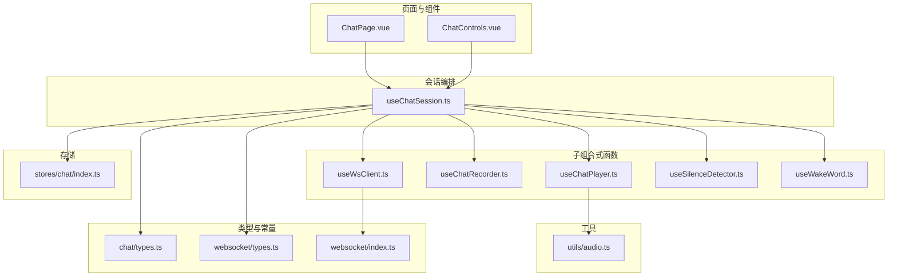
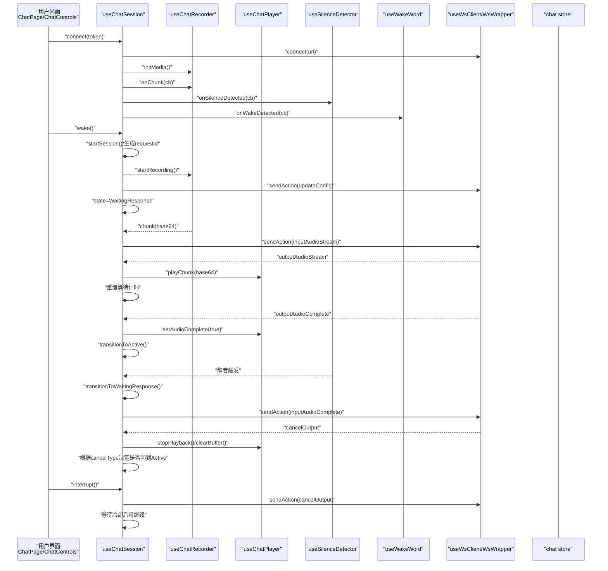
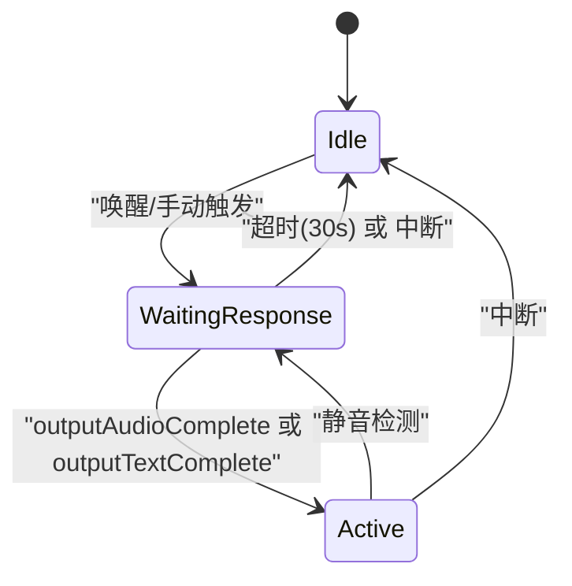
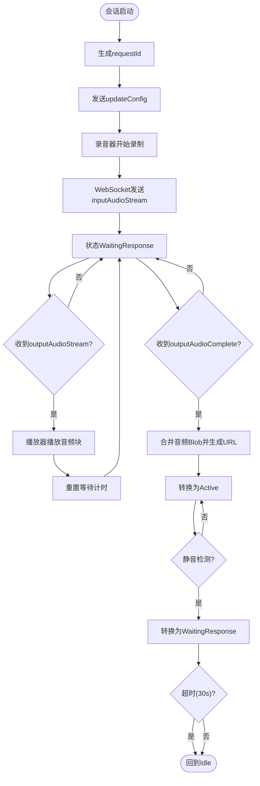
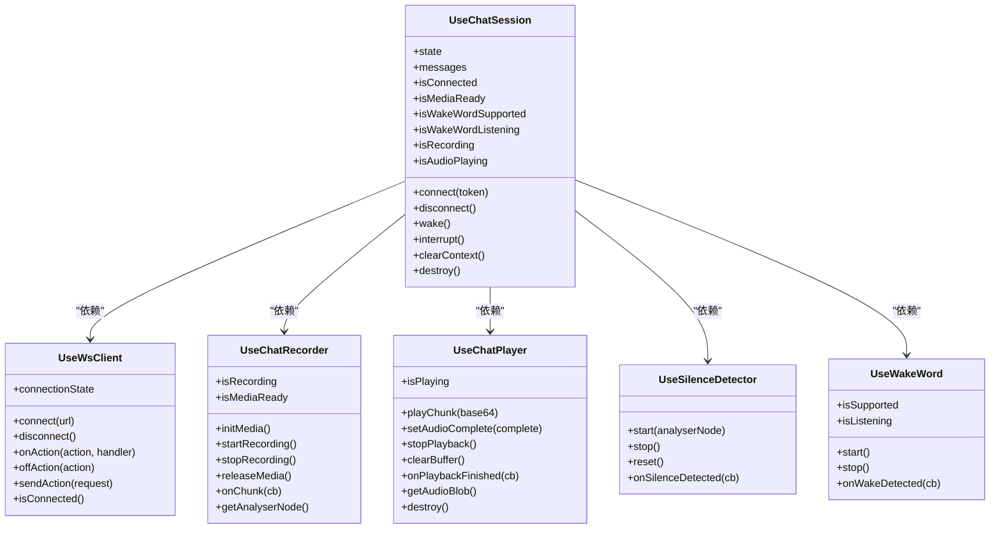

# 会话管理

<cite>
**本文引用的文件列表**
- [useChatSession.ts](file://src/composables/useChatSession.ts)
- [types.ts](file://src/types/chat/types.ts)
- [websocket/types.ts](file://src/types/websocket/types.ts)
- [websocket/index.ts](file://src/types/websocket/index.ts)
- [useWsClient.ts](file://src/composables/useWsClient.ts)
- [useChatRecorder.ts](file://src/composables/useChatRecorder.ts)
- [useChatPlayer.ts](file://src/composables/useChatPlayer.ts)
- [useSilenceDetector.ts](file://src/composables/useSilenceDetector.ts)
- [useWakeWord.ts](file://src/composables/useWakeWord.ts)
- [audio.ts](file://src/utils/audio.ts)
- [ChatPage.vue](file://src/pages/stack/ChatPage.vue)
- [ChatControls.vue](file://src/components/chat/ChatControls.vue)
- [index.ts](file://src/stores/chat/index.ts)
</cite>

## 目录
1. [简介](#简介)
2. [项目结构](#项目结构)
3. [核心组件](#核心组件)
4. [架构总览](#架构总览)
5. [详细组件分析](#详细组件分析)
6. [依赖关系分析](#依赖关系分析)
7. [性能考量](#性能考量)
8. [故障排查指南](#故障排查指南)
9. [结论](#结论)
10. [附录：API 使用示例与最佳实践](#附录api-使用示例与最佳实践)

## 简介
本文件面向“会话管理”模块，聚焦 useChatSession 组合式函数的架构与实现细节，系统阐述其状态机设计（Idle → WaitingResponse → Active）、会话生命周期管理、消息路由与状态转换逻辑，并覆盖请求ID生成、超时机制与清理策略。同时给出状态转换图、数据流图与组件交互关系图，提供 API 使用示例、错误处理策略与性能优化建议，解释与后端服务的协议交互、消息格式与实时数据传输机制。

## 项目结构
围绕会话管理的关键文件组织如下：
- 组合式函数层：useChatSession 负责会话编排；useWsClient 提供 WebSocket 客户端封装；useChatRecorder/useChatPlayer/useSilenceDetector/useWakeWord 提供音频采集、播放、静音检测与唤醒词检测能力。
- 类型与常量层：chat/types.ts 定义状态机、消息模型、超时与音频参数；websocket/types.ts 定义动作枚举与请求/响应类型；websocket/index.ts 提供 WebSocket 包装器与自动重连。
- 页面与组件：ChatPage.vue 作为入口页面，绑定 useChatSession 的公共 API；ChatControls.vue 展示状态与控制按钮。
- 存储层：Pinia chat store 保存会话标识等上下文信息。

图表来源
- [useChatSession.ts:1-589](file://src/composables/useChatSession.ts#L1-L589)
- [useWsClient.ts:1-103](file://src/composables/useWsClient.ts#L1-L103)
- [useChatRecorder.ts:1-148](file://src/composables/useChatRecorder.ts#L1-L148)
- [useChatPlayer.ts:1-161](file://src/composables/useChatPlayer.ts#L1-L161)
- [useSilenceDetector.ts:1-104](file://src/composables/useSilenceDetector.ts#L1-L104)
- [useWakeWord.ts:1-163](file://src/composables/useWakeWord.ts#L1-L163)
- [types.ts:1-96](file://src/types/chat/types.ts#L1-L96)
- [websocket/types.ts:1-226](file://src/types/websocket/types.ts#L1-L226)
- [websocket/index.ts:1-92](file://src/types/websocket/index.ts#L1-L92)
- [audio.ts:1-47](file://src/utils/audio.ts#L1-L47)
- [ChatPage.vue:1-179](file://src/pages/stack/ChatPage.vue#L1-L179)
- [ChatControls.vue:1-204](file://src/components/chat/ChatControls.vue#L1-L204)
- [index.ts:1-17](file://src/stores/chat/index.ts#L1-L17)

章节来源
- [useChatSession.ts:1-589](file://src/composables/useChatSession.ts#L1-L589)
- [types.ts:1-96](file://src/types/chat/types.ts#L1-L96)
- [websocket/types.ts:1-226](file://src/types/websocket/types.ts#L1-L226)
- [websocket/index.ts:1-92](file://src/types/websocket/index.ts#L1-L92)
- [useWsClient.ts:1-103](file://src/composables/useWsClient.ts#L1-L103)
- [useChatRecorder.ts:1-148](file://src/composables/useChatRecorder.ts#L1-L148)
- [useChatPlayer.ts:1-161](file://src/composables/useChatPlayer.ts#L1-L161)
- [useSilenceDetector.ts:1-104](file://src/composables/useSilenceDetector.ts#L1-L104)
- [useWakeWord.ts:1-163](file://src/composables/useWakeWord.ts#L1-L163)
- [audio.ts:1-47](file://src/utils/audio.ts#L1-L47)
- [ChatPage.vue:1-179](file://src/pages/stack/ChatPage.vue#L1-L179)
- [ChatControls.vue:1-204](file://src/components/chat/ChatControls.vue#L1-L204)
- [index.ts:1-17](file://src/stores/chat/index.ts#L1-L17)

## 核心组件
- useChatSession：会话编排核心，负责状态机、消息路由、超时与清理、与子组合式函数协作。
- useWsClient：WebSocket 客户端封装，提供连接、断开、事件订阅与发送请求的能力。
- useChatRecorder：录音器，基于 MediaRecorder 输出 200ms WAV 片段并通过回调推送。
- useChatPlayer：播放器，基于 Web Audio API 播放 base64 音频片段，支持无间断调度与中断。
- useSilenceDetector：基于 RMS 的静音检测，周期采样并判定连续静音窗口。
- useWakeWord：基于 Web Speech API 的唤醒词检测，适配浏览器环境。
- 类型与常量：ChatState、ChatMessage、超时配置、音频参数、WebSocket 动作与请求/响应类型。
- 存储：chat store 保存 conversationId 等会话上下文。

章节来源
- [useChatSession.ts:32-61](file://src/composables/useChatSession.ts#L32-L61)
- [useWsClient.ts:8-23](file://src/composables/useWsClient.ts#L8-L23)
- [useChatRecorder.ts:6-23](file://src/composables/useChatRecorder.ts#L6-L23)
- [useChatPlayer.ts:3-20](file://src/composables/useChatPlayer.ts#L3-L20)
- [useSilenceDetector.ts:3-12](file://src/composables/useSilenceDetector.ts#L3-L12)
- [useWakeWord.ts:40-51](file://src/composables/useWakeWord.ts#L40-L51)
- [types.ts:11-96](file://src/types/chat/types.ts#L11-L96)
- [websocket/types.ts:3-15](file://src/types/websocket/types.ts#L3-L15)
- [index.ts:4-16](file://src/stores/chat/index.ts#L4-L16)

## 架构总览
useChatSession 将多个子组合式函数整合为统一的会话编排器，通过 WebSocket 与后端进行协议交互，驱动录音、播放、静音检测与唤醒词监听，完成从“唤醒”到“等待响应”再到“活跃对话”的完整生命周期。

图表来源
- [useChatSession.ts:379-425](file://src/composables/useChatSession.ts#L379-L425)
- [useChatSession.ts:309-326](file://src/composables/useChatSession.ts#L309-L326)
- [useChatSession.ts:130-166](file://src/composables/useChatSession.ts#L130-L166)
- [useChatSession.ts:258-273](file://src/composables/useChatSession.ts#L258-L273)
- [useChatSession.ts:328-344](file://src/composables/useChatSession.ts#L328-L344)
- [useWsClient.ts:37-55](file://src/composables/useWsClient.ts#L37-L55)
- [websocket/index.ts:61-90](file://src/types/websocket/index.ts#L61-L90)
- [useChatRecorder.ts:72-91](file://src/composables/useChatRecorder.ts#L72-L91)
- [useChatPlayer.ts:53-96](file://src/composables/useChatPlayer.ts#L53-L96)
- [useSilenceDetector.ts:52-78](file://src/composables/useSilenceDetector.ts#L52-L78)
- [useWakeWord.ts:81-136](file://src/composables/useWakeWord.ts#L81-L136)
- [index.ts:4-16](file://src/stores/chat/index.ts#L4-L16)

## 详细组件分析

### 状态机设计与生命周期
- 状态集合：Idle（空闲）、WaitingResponse（等待响应）、Active（活跃）。
- 初始状态：Idle。
- 关键转换：
  - Idle → WaitingResponse：收到唤醒或手动触发后进入，开始录音与会话准备。
  - WaitingResponse → Active：收到输出音频完成或文本完成事件后进入，开始播放与继续对话。
  - Active → WaitingResponse：检测到持续静音后进入，结束当前用户输入并等待响应。
  - WaitingResponse/Active → Idle：超时或中断后进入，释放资源并重启唤醒监听。

图表来源
- [types.ts:11-19](file://src/types/chat/types.ts#L11-L19)
- [useChatSession.ts:244-303](file://src/composables/useChatSession.ts#L244-L303)

章节来源
- [types.ts:11-19](file://src/types/chat/types.ts#L11-L19)
- [useChatSession.ts:244-303](file://src/composables/useChatSession.ts#L244-L303)

### 会话启动流程与请求ID生成
- 启动步骤：
  - 生成唯一 requestId（uid）。
  - 发送更新配置请求（包含时区等），并记录 conversationId。
  - 初始化麦克风与录音器，注册分片回调。
  - 进入 WaitingResponse 并启动等待响应超时检查器。
- 请求ID：
  - 每次会话开始生成新的 requestId，用于区分不同轮次。
- 清理策略：
  - 断开连接时停止录音、静音检测、播放器销毁、撤销所有音频 URL、清空消息列表。

章节来源
- [useChatSession.ts:309-326](file://src/composables/useChatSession.ts#L309-L326)
- [useChatSession.ts:379-425](file://src/composables/useChatSession.ts#L379-L425)
- [useChatSession.ts:427-447](file://src/composables/useChatSession.ts#L427-L447)

### 超时机制与清理策略
- 等待响应超时（默认 30 秒）：
  - 在 WaitingResponse 状态下，每 2 秒检查一次，若超过阈值且当前未在播放，则发送 inputAudioComplete 并回到 Idle。
- 取消输出冷却（默认 300ms）：
  - 手动取消后等待冷却时间再允许新会话，避免频繁打断。
- 资源清理：
  - 停止录音、静音检测、播放器销毁、WebSocket 断开、定时器清理、撤销音频对象 URL。

章节来源
- [types.ts:75-83](file://src/types/chat/types.ts#L75-L83)
- [useChatSession.ts:346-365](file://src/composables/useChatSession.ts#L346-L365)
- [useChatSession.ts:328-344](file://src/composables/useChatSession.ts#L328-L344)
- [useChatSession.ts:427-447](file://src/composables/useChatSession.ts#L427-L447)

### 消息路由与状态转换逻辑
- WebSocket 事件处理：
  - updateConfig：设置 conversationId。
  - outputAudioStream：累积音频片段并播放，重置等待计时。
  - outputAudioComplete：合并音频并标记完成，若处于 WaitingResponse 则进入 Active。
  - outputTextStream：更新用户/助手文本，若检测到用户语音（长度≥2）则中断播放。
  - outputTextComplete：标记文本完成，用户完成后准备下一轮播放器实例。
  - chatComplete：标记会话回合完成，记录错误信息。
  - cancelOutput：根据 cancelType 决定是否回到 Active。
- 状态转换：
  - transitionToActive：启动静音检测，准备 Active。
  - transitionToWaitingResponse：停止静音检测，准备下一轮播放器。
  - transitionToIdle：停止录音与静音检测，销毁播放器，重启唤醒监听，停止定时器。

章节来源
- [useChatSession.ts:100-113](file://src/composables/useChatSession.ts#L100-L113)
- [useChatSession.ts:130-166](file://src/composables/useChatSession.ts#L130-L166)
- [useChatSession.ts:168-209](file://src/composables/useChatSession.ts#L168-L209)
- [useChatSession.ts:211-225](file://src/composables/useChatSession.ts#L211-L225)
- [useChatSession.ts:227-238](file://src/composables/useChatSession.ts#L227-L238)
- [useChatSession.ts:244-303](file://src/composables/useChatSession.ts#L244-L303)

### 数据流与组件交互
- 录音流：录音器以 200ms WAV 片段推送 base64 数据，useChatSession 在 WaitingResponse/Active 状态下转发给服务器。
- 播放流：服务器返回音频流，useChatSession 调用播放器逐块解码与调度播放，保持无间断。
- 静音检测：Active 状态下基于 AnalyserNode 的 RMS 采样，连续静音窗口触发转换至 WaitingResponse。
- 唤醒词检测：Idle 状态下持续监听唤醒短语，命中后触发会话启动。
- 存储与上下文：conversationId 由服务器下发并持久化到 chat store。

图表来源
- [useChatSession.ts:309-326](file://src/composables/useChatSession.ts#L309-L326)
- [useChatSession.ts:130-166](file://src/composables/useChatSession.ts#L130-L166)
- [useChatSession.ts:149-166](file://src/composables/useChatSession.ts#L149-L166)
- [useChatSession.ts:258-273](file://src/composables/useChatSession.ts#L258-L273)
- [useChatSession.ts:346-365](file://src/composables/useChatSession.ts#L346-L365)
- [useSilenceDetector.ts:52-78](file://src/composables/useSilenceDetector.ts#L52-L78)

章节来源
- [useChatSession.ts:309-326](file://src/composables/useChatSession.ts#L309-L326)
- [useChatSession.ts:130-166](file://src/composables/useChatSession.ts#L130-L166)
- [useChatSession.ts:149-166](file://src/composables/useChatSession.ts#L149-L166)
- [useChatSession.ts:258-273](file://src/composables/useChatSession.ts#L258-L273)
- [useChatSession.ts:346-365](file://src/composables/useChatSession.ts#L346-L365)
- [useSilenceDetector.ts:52-78](file://src/composables/useSilenceDetector.ts#L52-L78)

### 与后端服务的协议交互
- WebSocket 地址拼接：基于环境变量与访问令牌构造连接 URL。
- 动作枚举：establishConnection、updateConfig、inputAudioStream、inputAudioComplete、outputAudioStream、outputAudioComplete、outputTextStream、outputTextComplete、chatComplete、cancelOutput、clearContext。
- 请求/响应类型：每个请求携带自增 id，响应包含 action 与 data 字段，成功/失败字段区分。
- 自动重连：WsWrapper 在断开后延迟重连，onOpen 时触发连接状态变更。

章节来源
- [useChatSession.ts:379-385](file://src/composables/useChatSession.ts#L379-L385)
- [websocket/types.ts:3-15](file://src/types/websocket/types.ts#L3-L15)
- [websocket/types.ts:105-131](file://src/types/websocket/types.ts#L105-L131)
- [websocket/types.ts:137-152](file://src/types/websocket/types.ts#L137-L152)
- [websocket/types.ts:159-167](file://src/types/websocket/types.ts#L159-L167)
- [websocket/types.ts:204-216](file://src/types/websocket/types.ts#L204-L216)
- [websocket/index.ts:61-90](file://src/types/websocket/index.ts#L61-L90)

### 实时数据传输机制
- 音频：录音器以 200ms 片段推送 base64 WAV，服务器按流式返回音频与文本。
- 文本：outputTextStream 逐步增量更新，outputTextComplete 标记完成。
- 音频合并：outputAudioComplete 后将多块 PCM 合并为 WAV Blob 并生成 URL 供播放。

章节来源
- [useChatRecorder.ts:72-91](file://src/composables/useChatRecorder.ts#L72-L91)
- [useChatSession.ts:130-166](file://src/composables/useChatSession.ts#L130-L166)
- [useChatSession.ts:168-209](file://src/composables/useChatSession.ts#L168-L209)
- [useChatSession.ts:149-166](file://src/composables/useChatSession.ts#L149-L166)
- [audio.ts:1-47](file://src/utils/audio.ts#L1-L47)

## 依赖关系分析

图表来源
- [useChatSession.ts:74-81](file://src/composables/useChatSession.ts#L74-L81)
- [useWsClient.ts:29-102](file://src/composables/useWsClient.ts#L29-L102)
- [useChatRecorder.ts:36-136](file://src/composables/useChatRecorder.ts#L36-L136)
- [useChatPlayer.ts:35-160](file://src/composables/useChatPlayer.ts#L35-L160)
- [useSilenceDetector.ts:27-103](file://src/composables/useSilenceDetector.ts#L27-L103)
- [useWakeWord.ts:64-162](file://src/composables/useWakeWord.ts#L64-L162)

章节来源
- [useChatSession.ts:74-81](file://src/composables/useChatSession.ts#L74-L81)
- [useWsClient.ts:29-102](file://src/composables/useWsClient.ts#L29-L102)
- [useChatRecorder.ts:36-136](file://src/composables/useChatRecorder.ts#L36-L136)
- [useChatPlayer.ts:35-160](file://src/composables/useChatPlayer.ts#L35-L160)
- [useSilenceDetector.ts:27-103](file://src/composables/useSilenceDetector.ts#L27-L103)
- [useWakeWord.ts:64-162](file://src/composables/useWakeWord.ts#L64-L162)

## 性能考量
- 音频采样与分片：
  - 采样率与通道数固定，200ms 分片大小平衡延迟与带宽占用。
- 播放调度：
  - 使用 AudioContext 的时间线进行无间断播放，减少停顿。
- 静音检测：
  - RMS 计算与环形缓冲区降低 CPU 占用，避免频繁触发。
- 超时与冷却：
  - 30s 超时与 300ms 冷却避免资源浪费与误触发。
- 内存与资源：
  - 断开连接时及时释放媒体流、播放器与对象 URL，防止内存泄漏。

[本节为通用性能建议，不直接分析具体文件]

## 故障排查指南
- 连接问题：
  - 检查 WebSocket URL 与访问令牌；确认 useWsClient 的连接状态变化；查看 WsWrapper 的自动重连日志。
- 录音问题：
  - 确认 initMedia 已调用且 isMediaReady 为真；检查 MediaRecorder 是否正常工作；确认浏览器权限已授予。
- 播放问题：
  - 检查 base64 解码与 AudioContext 初始化；确认播放器未被意外销毁；关注 onended 回调。
- 静音检测：
  - 确认 AnalyserNode 来自同一 MediaStream；调整 rmsThreshold 与 consecutiveSilentCount；观察采样频率。
- 唤醒词：
  - 确认浏览器支持 Web Speech API；检查语言设置与识别错误日志；注意自动重启逻辑。
- 错误处理：
  - 对于未知 action，WsWrapper 会发出通知；useChatSession 中对关键路径添加了条件判断与警告日志。

章节来源
- [useWsClient.ts:37-55](file://src/composables/useWsClient.ts#L37-L55)
- [websocket/index.ts:73-86](file://src/types/websocket/index.ts#L73-L86)
- [useChatRecorder.ts:47-70](file://src/composables/useChatRecorder.ts#L47-L70)
- [useChatPlayer.ts:53-96](file://src/composables/useChatPlayer.ts#L53-L96)
- [useSilenceDetector.ts:52-78](file://src/composables/useSilenceDetector.ts#L52-L78)
- [useWakeWord.ts:123-128](file://src/composables/useWakeWord.ts#L123-L128)

## 结论
useChatSession 将复杂的音频采集、播放、静音检测与唤醒词监听整合为统一的状态机编排器，通过 WebSocket 与后端进行标准化协议交互，实现了从唤醒到等待响应再到活跃对话的完整生命周期管理。其设计在保证实时性的同时兼顾了稳定性与可维护性，适合在浏览器环境中提供流畅的语音对话体验。

[本节为总结性内容，不直接分析具体文件]

## 附录：API 使用示例与最佳实践

### API 使用示例
- 连接与断开
  - 在页面挂载时调用 connect(token)，断开时调用 disconnect()，卸载时调用 destroy()。
- 唤醒与中断
  - 用户点击按钮或唤醒词触发 wake()；需要中断时调用 interrupt()。
- 清理上下文
  - clearContext() 会向服务器发送清理请求并清空本地 conversationId。

章节来源
- [ChatPage.vue:40-51](file://src/pages/stack/ChatPage.vue#L40-L51)
- [ChatPage.vue:53-55](file://src/pages/stack/ChatPage.vue#L53-L55)
- [ChatPage.vue:57-62](file://src/pages/stack/ChatPage.vue#L57-L62)
- [ChatPage.vue:64-66](file://src/pages/stack/ChatPage.vue#L64-L66)
- [ChatPage.vue:68-71](file://src/pages/stack/ChatPage.vue#L68-L71)
- [useChatSession.ts:379-425](file://src/composables/useChatSession.ts#L379-L425)
- [useChatSession.ts:427-447](file://src/composables/useChatSession.ts#L427-L447)
- [useChatSession.ts:449-484](file://src/composables/useChatSession.ts#L449-L484)
- [useChatSession.ts:486-489](file://src/composables/useChatSession.ts#L486-L489)

### 最佳实践
- 生命周期管理：在 onBeforeUnmount 中调用 destroy()，确保资源回收。
- 条件触发：仅在 isConnected 为真时执行 wake()，避免无效操作。
- 用户反馈：结合 Quasar Notify 提示连接状态、错误与操作结果。
- 参数校准：根据设备性能调整静音检测阈值与采样间隔，提升稳定性。

章节来源
- [ChatPage.vue:90-92](file://src/pages/stack/ChatPage.vue#L90-L92)
- [useChatSession.ts:449-477](file://src/composables/useChatSession.ts#L449-L477)
- [useSilenceDetector.ts:27-103](file://src/composables/useSilenceDetector.ts#L27-L103)