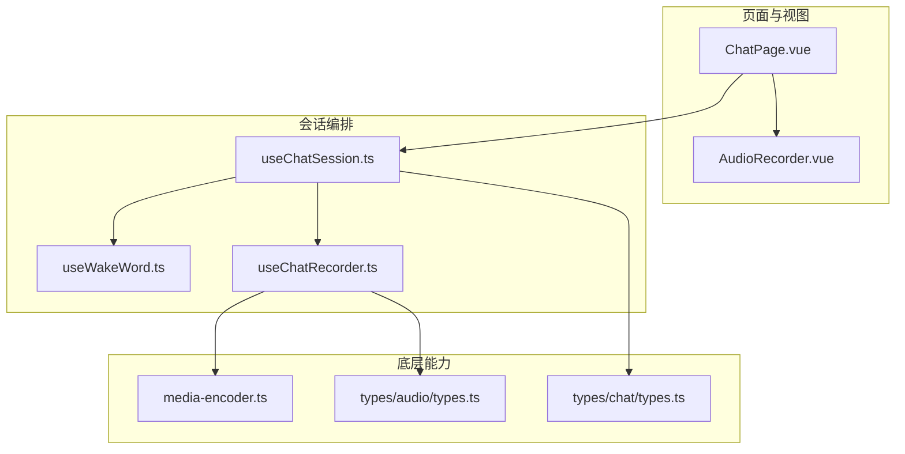
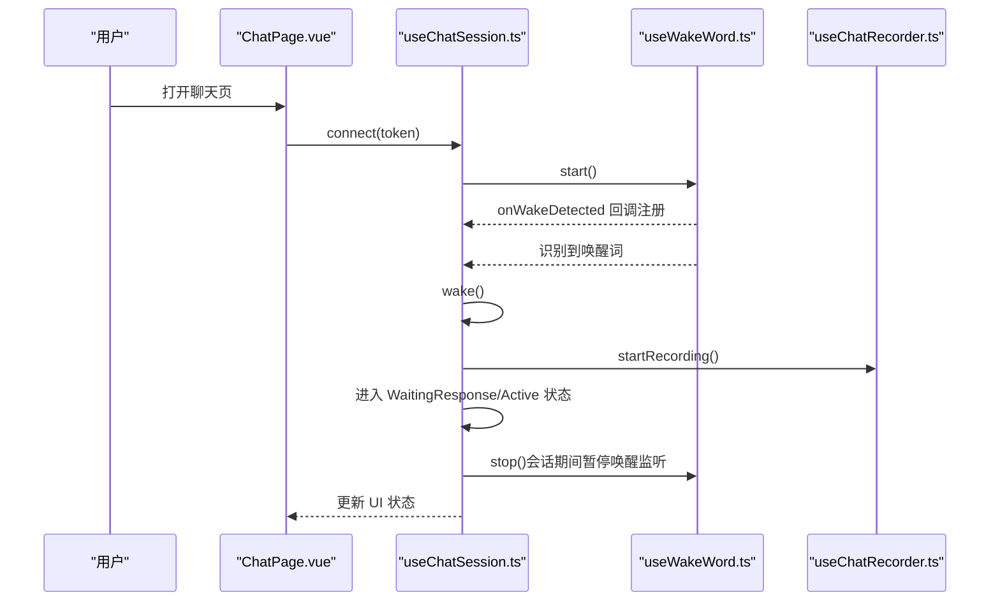
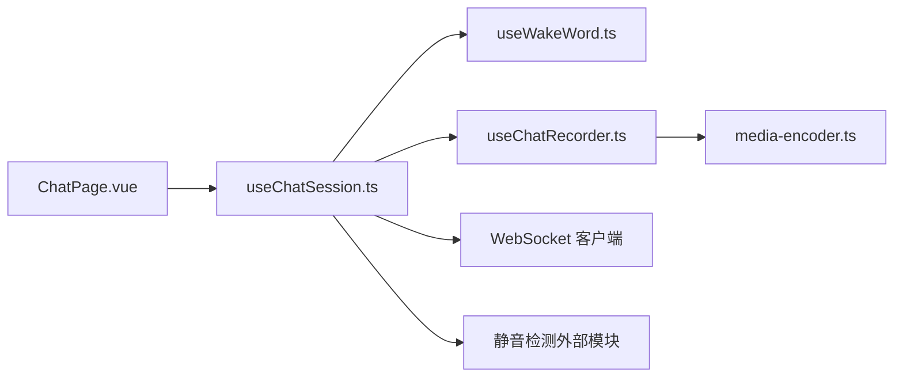

# 唤醒词识别

<cite>
**本文引用的文件**
- [useWakeWord.ts](file://src/composables/useWakeWord.ts)
- [useChatSession.ts](file://src/composables/useChatSession.ts)
- [useChatRecorder.ts](file://src/composables/useChatRecorder.ts)
- [ChatPage.vue](file://src/pages/stack/ChatPage.vue)
- [AudioRecorder.vue](file://src/components/AudioRecorder.vue)
- [media-encoder.ts](file://src/boot/media-encoder.ts)
- [types.ts](file://src/types/chat/types.ts)
- [types.ts](file://src/types/audio/types.ts)
- [package.json](file://package.json)
</cite>

## 目录
1. [简介](#简介)
2. [项目结构](#项目结构)
3. [核心组件](#核心组件)
4. [架构总览](#架构总览)
5. [组件详解](#组件详解)
6. [依赖关系分析](#依赖关系分析)
7. [性能考量](#性能考量)
8. [故障排查指南](#故障排查指南)
9. [结论](#结论)
10. [附录](#附录)

## 简介
本文件面向“唤醒词识别”模块，围绕 useWakeWord 组合式函数展开，系统阐述其基于 Web Speech API 的实现原理、语音识别配置、唤醒词匹配逻辑、回调机制与自动重启策略；并结合 useChatSession 的会话管理，说明与录音、播放、静音检测等子模块的集成方式，以及用户体验优化策略。同时给出识别配置参数、跨浏览器适配方案、误唤醒处理建议与性能优化要点。

## 项目结构
与唤醒词识别直接相关的前端模块主要分布在以下位置：
- 组合式函数：src/composables/useWakeWord.ts（唤醒词）、src/composables/useChatSession.ts（会话编排）、src/composables/useChatRecorder.ts（录音）
- 页面与组件：src/pages/stack/ChatPage.vue（聊天页面）、src/components/AudioRecorder.vue（录音器）
- 引擎注册：src/boot/media-encoder.ts（extendable-media-recorder 注册）
- 类型定义：src/types/chat/types.ts（会话状态、超时、录音常量）、src/types/audio/types.ts（音频流参数）

图表来源
- [ChatPage.vue:1-179](file://src/pages/stack/ChatPage.vue#L1-L179)
- [useChatSession.ts:1-589](file://src/composables/useChatSession.ts#L1-L589)
- [useWakeWord.ts:1-163](file://src/composables/useWakeWord.ts#L1-L163)
- [useChatRecorder.ts:1-148](file://src/composables/useChatRecorder.ts#L1-L148)
- [media-encoder.ts:1-8](file://src/boot/media-encoder.ts#L1-L8)
- [types.ts:1-96](file://src/types/chat/types.ts#L1-L96)
- [types.ts:1-14](file://src/types/audio/types.ts#L1-L14)

章节来源
- [ChatPage.vue:1-179](file://src/pages/stack/ChatPage.vue#L1-L179)
- [useChatSession.ts:1-589](file://src/composables/useChatSession.ts#L1-L589)
- [useWakeWord.ts:1-163](file://src/composables/useWakeWord.ts#L1-L163)
- [useChatRecorder.ts:1-148](file://src/composables/useChatRecorder.ts#L1-L148)
- [media-encoder.ts:1-8](file://src/boot/media-encoder.ts#L1-L8)
- [types.ts:1-96](file://src/types/chat/types.ts#L1-L96)
- [types.ts:1-14](file://src/types/audio/types.ts#L1-L14)

## 核心组件
- useWakeWord：封装 Web Speech API 的唤醒词监听，支持自动重启、错误过滤与回调触发。
- useChatSession：会话编排器，负责状态机、WebSocket 消息路由、录音/播放/静音检测、唤醒词回调接入与生命周期管理。
- useChatRecorder：录音器，提供 200ms WAV 片段输出、AnalyserNode 供静音检测使用。
- ChatPage：页面入口，绑定会话能力并展示连接状态、唤醒词支持与监听状态。
- AudioRecorder：通用录音组件，演示录音流程与权限提示。
- media-encoder：注册 extendable-media-recorder 及 WAV 编码器，确保录音可用。
- 类型定义：统一会话状态、超时、录音参数与音频流配置。

章节来源
- [useWakeWord.ts:1-163](file://src/composables/useWakeWord.ts#L1-L163)
- [useChatSession.ts:1-589](file://src/composables/useChatSession.ts#L1-L589)
- [useChatRecorder.ts:1-148](file://src/composables/useChatRecorder.ts#L1-L148)
- [ChatPage.vue:1-179](file://src/pages/stack/ChatPage.vue#L1-L179)
- [AudioRecorder.vue:1-113](file://src/components/AudioRecorder.vue#L1-L113)
- [media-encoder.ts:1-8](file://src/boot/media-encoder.ts#L1-L8)
- [types.ts:1-96](file://src/types/chat/types.ts#L1-L96)
- [types.ts:1-14](file://src/types/audio/types.ts#L1-L14)

## 架构总览
唤醒词识别在整体会话生命周期中的位置如下：

图表来源
- [ChatPage.vue:1-179](file://src/pages/stack/ChatPage.vue#L1-L179)
- [useChatSession.ts:1-589](file://src/composables/useChatSession.ts#L1-L589)
- [useWakeWord.ts:1-163](file://src/composables/useWakeWord.ts#L1-L163)
- [useChatRecorder.ts:1-148](file://src/composables/useChatRecorder.ts#L1-L148)

## 组件详解

### useWakeWord：唤醒词识别组合式函数
- 功能概述
  - 通过 Web Speech API（SpeechRecognition 或 webkitSpeechRecognition）持续监听语音输入。
  - 支持中文语言 zh-CN，连续识别与中间结果。
  - 提供唤醒词匹配（多变体、标点与空白归一化），并在命中时触发回调。
  - 自动重启：在识别结束或异常后延时重试，避免频繁重启。
  - 错误过滤：仅记录非预期错误（如 no-speech、aborted）。
  - 生命周期：start/stop 控制，isListening 响应式状态，onWakeDetected 注册回调。

- 关键实现要点
  - 识别器构造与兼容性：优先使用标准接口，回退至 webkit 前缀。
  - 识别配置：continuous=true、interimResults=true、lang='zh-CN'。
  - 匹配策略：将识别文本与唤醒短语均归一化（小写、去标点与空白），判断包含关系。
  - 回调触发：命中后立即执行注册的回调，并停止识别，避免重复触发。
  - 自动重启：onend 中延时 300ms 后尝试重新 start，若仍处于监听状态。
  - 错误处理：onerror 中过滤常见预期错误，其他错误打印警告。

- API 使用示例（路径）
  - 启动监听与注册回调：[useWakeWord.ts:81-136](file://src/composables/useWakeWord.ts#L81-L136)
  - 停止监听：[useWakeWord.ts:138-149](file://src/composables/useWakeWord.ts#L138-L149)
  - 注册唤醒回调：[useWakeWord.ts:151-153](file://src/composables/useWakeWord.ts#L151-L153)

- 识别配置参数
  - continuous：true（持续识别）
  - interimResults：true（启用中间结果）
  - lang：'zh-CN'（中文）
  - 结果处理：遍历 resultIndex 之后的新结果，取首个候选 transcript 进行匹配。

- 识别精度与误唤醒处理
  - 精度优化：匹配采用归一化包含判断，覆盖多种标点与空格变体。
  - 误唤醒抑制：命中后立即停止识别并清空重启标记，避免重复触发；自动重启仅在需要时进行。
  - 延迟控制：onend 延时 300ms 再重启，减少快速循环重启带来的抖动。

- 浏览器兼容性
  - 识别器构造：优先标准接口，回退 webkitSpeechRecognition。
  - 支持范围：Chrome/Edge 等基于 Chromium 的浏览器通常具备较好的支持。
  - 不支持降级：isSupported=false 时，唤醒功能不可用，界面层应隐藏相关控件。

- 与会话管理集成
  - 在 Idle 状态启动唤醒监听；唤醒后调用 wake()，进入 WaitingResponse/Active。
  - 会话期间停止唤醒监听，避免干扰录音与服务器交互。
  - 退出会话回到 Idle 时，若已连接则重启唤醒监听。

章节来源
- [useWakeWord.ts:1-163](file://src/composables/useWakeWord.ts#L1-L163)
- [useChatSession.ts:1-589](file://src/composables/useChatSession.ts#L1-L589)

### useChatSession：会话编排与唤醒词集成
- 功能概述
  - 管理三态状态机：Idle → WaitingResponse → Active → Idle。
  - 与 WebSocket 交互，处理音频/文本流、取消输出、清理上下文等。
  - 集成录音、播放、静音检测与唤醒词回调。
  - 提供手动唤醒、中断、清理上下文等操作。

- 与唤醒词的集成
  - 初始化时注册唤醒回调：onWakeDetected(() => wake())。
  - 唤醒后停止唤醒监听，必要时中断当前会话，创建用户消息占位，开始录音并进入 WaitingResponse。
  - 退出会话回到 Idle 时，若已连接则重启唤醒监听。

- 与录音/播放/静音检测的协作
  - 录音：useChatRecorder 提供 200ms WAV 片段，按状态发送至服务器。
  - 播放：useChatPlayer 处理音频流播放完成回调。
  - 静音检测：useSilenceDetector 基于 AnalyserNode 的 RMS 判断静默，触发从 Active → WaitingResponse。

- API 使用示例（路径）
  - 注册唤醒回调与启动监听：[useChatSession.ts:414-425](file://src/composables/useChatSession.ts#L414-L425)
  - 唤醒处理与状态转换：[useChatSession.ts:449-477](file://src/composables/useChatSession.ts#L449-L477)
  - 退出会话重启唤醒监听：[useChatSession.ts:291-294](file://src/composables/useChatSession.ts#L291-L294)

章节来源
- [useChatSession.ts:1-589](file://src/composables/useChatSession.ts#L1-L589)

### useChatRecorder：录音器（与唤醒词的协作）
- 功能概述
  - 通过 extendable-media-recorder 获取媒体流，创建 WAV 片段（200ms timeslice）。
  - 创建 AnalyserNode 供静音检测使用，不连接扬声器，仅分析。
  - 提供 onChunk 回调，将 Blob 转为 Base64 并传递给上层。

- 与唤醒词的关系
  - 唤醒词识别期间通常不发送音频流；会话开始后由录音器持续输出音频片段。
  - 录音参数与服务器期望一致（16kHz、单声道、16bit、200ms 片段）。

- API 使用示例（路径）
  - 初始化媒体流与 AnalyserNode：[useChatRecorder.ts:47-70](file://src/composables/useChatRecorder.ts#L47-L70)
  - 开始录音与 onChunk 回调：[useChatRecorder.ts:72-91](file://src/composables/useChatRecorder.ts#L72-L91)
  - 释放资源：[useChatRecorder.ts:101-116](file://src/composables/useChatRecorder.ts#L101-L116)

章节来源
- [useChatRecorder.ts:1-148](file://src/composables/useChatRecorder.ts#L1-L148)

### ChatPage：页面入口与状态展示
- 功能概述
  - 展示连接状态、会话 ID、当前状态（Idle/WaitingResponse/Active）。
  - 提供连接/断开、手动唤醒、中断、清空上下文等操作。
  - 读取 useChatSession 返回的能力标志：isWakeWordSupported、isWakeWordListening 等。

- 与唤醒词的交互
  - 通过 props 将 isWakeWordSupported/isWakeWordListening 传入控件，驱动 UI 行为。

章节来源
- [ChatPage.vue:1-179](file://src/pages/stack/ChatPage.vue#L1-L179)

### AudioRecorder：通用录音组件
- 功能概述
  - 基于 MediaRecorder 录制 WAV 片段，提供开始/停止事件与错误通知。
  - 适用于测试与演示场景，与本项目主录音器（extendable-media-recorder）略有差异。

章节来源
- [AudioRecorder.vue:1-113](file://src/components/AudioRecorder.vue#L1-L113)

### media-encoder：录音引擎注册
- 功能概述
  - 在应用启动时注册 extendable-media-recorder 及 WAV 编码器，确保 MediaRecorder 可用。

章节来源
- [media-encoder.ts:1-8](file://src/boot/media-encoder.ts#L1-L8)

## 依赖关系分析
- 组件耦合
  - ChatPage 依赖 useChatSession 的能力暴露（状态、连接、唤醒支持等）。
  - useChatSession 依赖 useWakeWord（唤醒回调）、useChatRecorder（录音）、WebSocket 客户端等。
  - useChatRecorder 依赖 extendable-media-recorder 与 WAV 编码器（通过 media-encoder 注册）。
- 外部依赖
  - Web Speech API（SpeechRecognition/webkitSpeechRecognition）用于唤醒词识别。
  - extendable-media-recorder 与 extendable-media-recorder-wav-encoder 用于高质量录音。
  - Vue 3 + Quasar 提供 UI 与响应式能力。

图表来源
- [ChatPage.vue:1-179](file://src/pages/stack/ChatPage.vue#L1-L179)
- [useChatSession.ts:1-589](file://src/composables/useChatSession.ts#L1-L589)
- [useWakeWord.ts:1-163](file://src/composables/useWakeWord.ts#L1-L163)
- [useChatRecorder.ts:1-148](file://src/composables/useChatRecorder.ts#L1-L148)
- [media-encoder.ts:1-8](file://src/boot/media-encoder.ts#L1-L8)

章节来源
- [package.json:1-61](file://package.json#L1-L61)

## 性能考量
- 识别延迟控制
  - 自动重启延时 300ms，避免快速重启导致的 CPU 抖动。
  - 识别器配置为连续与中间结果，有助于更快地捕获唤醒短语。
- 录音与传输
  - 200ms 片段与 16kHz 单声道 16bit 符合服务器期望，降低网络与解码压力。
  - Base64 转换在主线程进行，建议在高负载场景评估转码成本。
- 资源释放
  - 会话结束与断开连接时，及时停止录音、关闭音频上下文、释放媒体流，防止资源泄漏。
- 浏览器兼容与稳定性
  - 仅在支持的浏览器中启用唤醒功能；对不支持的环境降级显示，避免阻塞主流程。

## 故障排查指南
- 唤醒无响应
  - 检查 isSupported 是否为 true，确认浏览器支持 Web Speech API。
  - 确认 isWakeWordListening 为 true，且未被会话期间 stop() 停止。
  - 查看控制台是否有识别错误日志（非 no-speech/aborted 的异常）。
- 误唤醒或漏唤醒
  - 确认唤醒短语变体是否完整（含不同标点与空格形式）。
  - 若误唤醒频繁，可考虑提高匹配严格度（例如改为精确相等而非包含）。
- 识别器异常停止
  - 观察 onend 是否频繁触发；若频繁重启，检查环境噪音与麦克风权限。
- 录音问题
  - 确认媒体流初始化成功（isMediaReady），录音状态 isRecording 为 true。
  - 检查浏览器权限与设备选择是否正确。

章节来源
- [useWakeWord.ts:105-128](file://src/composables/useWakeWord.ts#L105-L128)
- [useChatSession.ts:414-425](file://src/composables/useChatSession.ts#L414-L425)
- [useChatRecorder.ts:47-70](file://src/composables/useChatRecorder.ts#L47-L70)

## 结论
useWakeWord 通过 Web Speech API 实现了中文唤醒词的稳定监听，结合 useChatSession 的状态机与录音/播放/静音检测，构建了完整的语音交互体验。其自动重启、错误过滤与生命周期管理策略提升了鲁棒性；与 extendable-media-recorder 的配合保证了录音质量与一致性。在实际部署中，建议关注浏览器兼容性、识别阈值与误唤醒处理，并结合业务需求优化识别延迟与资源占用。

## 附录

### 识别配置参数速查
- 识别器配置
  - continuous：true
  - interimResults：true
  - lang：'zh-CN'
- 匹配策略
  - 文本归一化：小写、去除标点与空白
  - 包含匹配：识别文本包含任一唤醒短语变体即视为命中
- 自动重启
  - onend 延时 300ms 后尝试重启
  - 仅在 shouldBeListening 为真时重启
- 错误过滤
  - 忽略 'no-speech' 与 'aborted'
  - 其他错误打印警告

章节来源
- [useWakeWord.ts:81-136](file://src/composables/useWakeWord.ts#L81-L136)
- [useWakeWord.ts:105-128](file://src/composables/useWakeWord.ts#L105-L128)

### 与会话管理的集成要点
- 启动/停止时机
  - Idle 状态：启动唤醒监听
  - 唤醒后：停止唤醒监听，进入会话
  - 会话结束：回到 Idle，若已连接则重启唤醒监听
- 回调链路
  - useChatSession 注册 onWakeDetected 回调，内部调用 wake()，进而启动录音与状态转换

章节来源
- [useChatSession.ts:414-425](file://src/composables/useChatSession.ts#L414-L425)
- [useChatSession.ts:291-294](file://src/composables/useChatSession.ts#L291-L294)