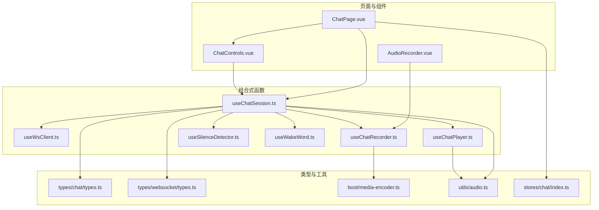
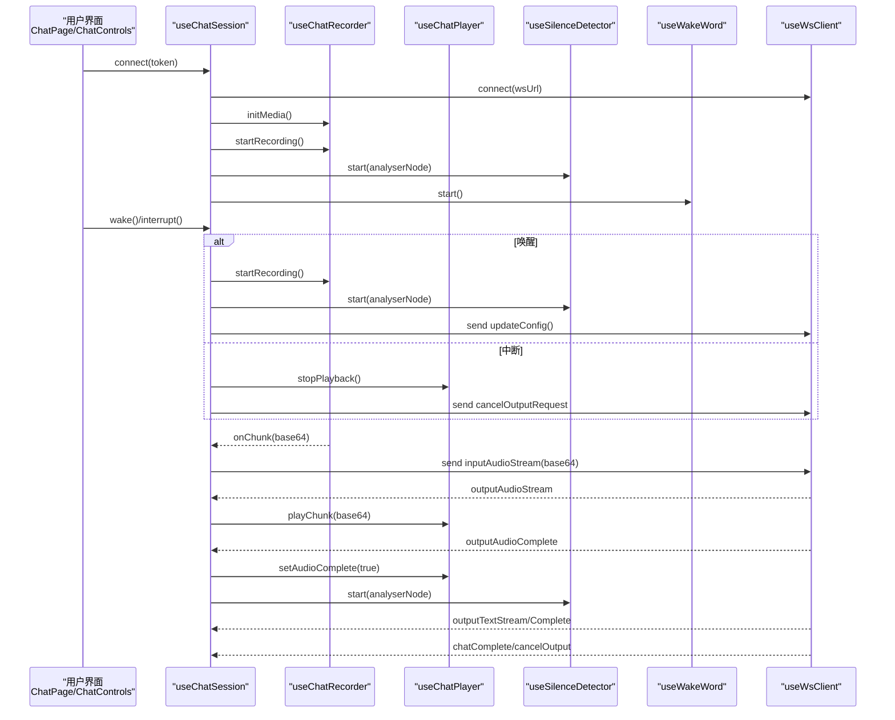
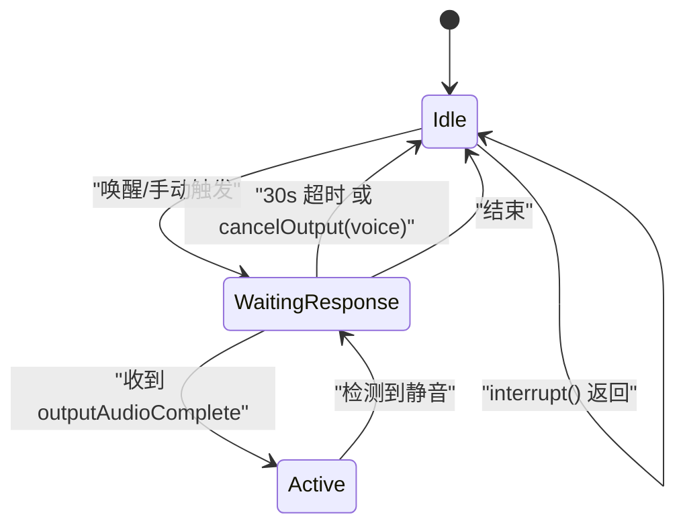
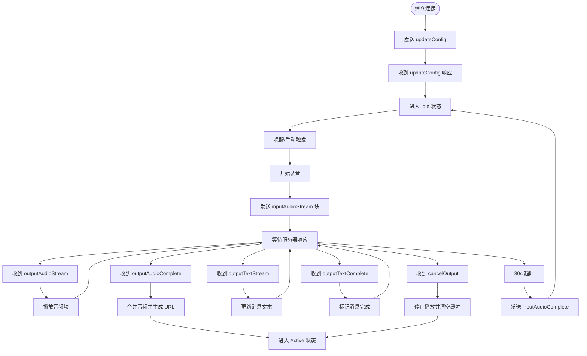
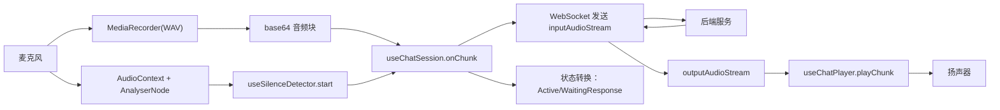
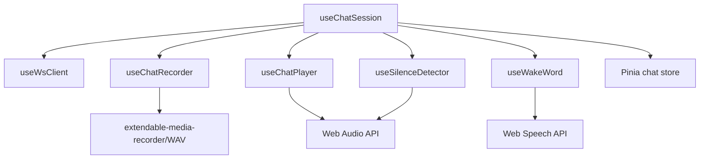

# 语音对话系统

<cite>
**本文引用的文件**
- [useChatSession.ts](file://src/composables/useChatSession.ts)
- [useWsClient.ts](file://src/composables/useWsClient.ts)
- [useChatRecorder.ts](file://src/composables/useChatRecorder.ts)
- [useChatPlayer.ts](file://src/composables/useChatPlayer.ts)
- [useSilenceDetector.ts](file://src/composables/useSilenceDetector.ts)
- [useWakeWord.ts](file://src/composables/useWakeWord.ts)
- [types.ts](file://src/types/chat/types.ts)
- [websocket/types.ts](file://src/types/websocket/types.ts)
- [media-encoder.ts](file://src/boot/media-encoder.ts)
- [audio.ts](file://src/utils/audio.ts)
- [ChatPage.vue](file://src/pages/stack/ChatPage.vue)
- [ChatControls.vue](file://src/components/chat/ChatControls.vue)
- [AudioRecorder.vue](file://src/components/AudioRecorder.vue)
- [chat/index.ts](file://src/stores/chat/index.ts)
</cite>

## 目录
1. [引言](#引言)
2. [项目结构](#项目结构)
3. [核心组件](#核心组件)
4. [架构总览](#架构总览)
5. [详细组件分析](#详细组件分析)
6. [依赖关系分析](#依赖关系分析)
7. [性能考虑](#性能考虑)
8. [故障排查指南](#故障排查指南)
9. [结论](#结论)
10. [附录](#附录)

## 引言
本技术文档围绕语音对话系统的前端核心——组合式函数 useChatSession 的架构与实现进行深入解析。重点涵盖以下方面：
- 状态机设计：Idle → WaitingResponse → Active 的三态流转与超时控制
- WebSocket 通信机制：请求/响应类型、消息路由与自动重连
- 音频处理流水线：录音、播放、静音检测与唤醒词识别
- 实时交互逻辑：会话管理、消息路由、音频流处理、中断与清理
- 与后端服务的协议交互、消息格式与实时数据传输机制
- API 使用示例、错误处理策略与性能优化建议

## 项目结构
前端采用 Vue 3 + TypeScript + Pinia 架构，核心位于 src/composables 目录下的组合式函数，配合 src/types 定义的类型与 src/utils 提供的工具函数，形成清晰的分层：
- 组合式函数层：useChatSession、useWsClient、useChatRecorder、useChatPlayer、useSilenceDetector、useWakeWord
- 类型定义层：聊天状态、音频常量、WebSocket 协议类型
- 工具函数层：音频编解码、媒体录制初始化
- 页面与组件层：ChatPage、ChatControls、AudioRecorder 等
- 状态存储：Pinia chat store 用于持久化会话标识

图表来源
- [useChatSession.ts:1-589](file://src/composables/useChatSession.ts#L1-L589)
- [useWsClient.ts:1-103](file://src/composables/useWsClient.ts#L1-L103)
- [useChatRecorder.ts:1-148](file://src/composables/useChatRecorder.ts#L1-L148)
- [useChatPlayer.ts:1-161](file://src/composables/useChatPlayer.ts#L1-L161)
- [useSilenceDetector.ts:1-104](file://src/composables/useSilenceDetector.ts#L1-L104)
- [useWakeWord.ts:1-163](file://src/composables/useWakeWord.ts#L1-L163)
- [types.ts:1-96](file://src/types/chat/types.ts#L1-L96)
- [websocket/types.ts:1-226](file://src/types/websocket/types.ts#L1-L226)
- [media-encoder.ts:1-8](file://src/boot/media-encoder.ts#L1-L8)
- [audio.ts:1-47](file://src/utils/audio.ts#L1-L47)
- [ChatPage.vue:1-179](file://src/pages/stack/ChatPage.vue#L1-L179)
- [ChatControls.vue:1-204](file://src/components/chat/ChatControls.vue#L1-L204)
- [AudioRecorder.vue:1-113](file://src/components/AudioRecorder.vue#L1-L113)
- [chat/index.ts:1-17](file://src/stores/chat/index.ts#L1-L17)

章节来源
- [useChatSession.ts:1-589](file://src/composables/useChatSession.ts#L1-L589)
- [types.ts:1-96](file://src/types/chat/types.ts#L1-L96)
- [websocket/types.ts:1-226](file://src/types/websocket/types.ts#L1-L226)

## 核心组件
本节聚焦 useChatSession 的职责与接口，它是整个语音对话生命周期的编排者，协调 WebSocket、录音、播放、静音检测与唤醒词识别。

- 主要职责
  - 管理三态状态机：Idle → WaitingResponse → Active
  - 建立与维护 WebSocket 连接，注册各类动作处理器
  - 发送配置更新、音频流、完成标记与取消输出请求
  - 管理会话上下文：消息列表、会话标识、超时与冷却
  - 集成录音、播放、静音检测与唤醒词识别子组合式函数
- 公开 API
  - connect(token)：建立连接并初始化媒体
  - disconnect()：断开连接并释放资源
  - wake()：手动触发唤醒或按钮唤醒
  - interrupt()：手动中断当前会话
  - clearContext()：清空会话上下文
  - destroy()：销毁所有资源（在页面卸载时调用）

章节来源
- [useChatSession.ts:32-61](file://src/composables/useChatSession.ts#L32-L61)
- [useChatSession.ts:379-493](file://src/composables/useChatSession.ts#L379-L493)

## 架构总览
useChatSession 将多个子系统整合为统一的会话编排器，其核心交互如下：

图表来源
- [useChatSession.ts:379-425](file://src/composables/useChatSession.ts#L379-L425)
- [useChatSession.ts:130-166](file://src/composables/useChatSession.ts#L130-L166)
- [useChatSession.ts:168-225](file://src/composables/useChatSession.ts#L168-L225)
- [useChatRecorder.ts:72-91](file://src/composables/useChatRecorder.ts#L72-L91)
- [useWsClient.ts:37-55](file://src/composables/useWsClient.ts#L37-L55)

## 详细组件分析

### 状态机设计与超时控制
- 状态定义
  - Idle：空闲监听唤醒词或等待用户点击开始
  - WaitingResponse：已开始录音并发送音频流，等待服务器响应
  - Active：正在录音与播放，静音检测运行中
- 转换规则
  - Idle → WaitingResponse：唤醒或手动触发后进入
  - WaitingResponse → Active：收到 outputAudioComplete 后进入
  - WaitingResponse → Idle：30 秒超时或收到 cancelOutput 且类型为 voice
  - Active → WaitingResponse：检测到持续静音
  - Idle → Idle：中断后返回
- 超时检查
  - 每 2 秒检查一次，若超过 30 秒且未在播放，则发送 inputAudioComplete 并进入 Idle

图表来源
- [useChatSession.ts:244-303](file://src/composables/useChatSession.ts#L244-L303)
- [useChatSession.ts:346-365](file://src/composables/useChatSession.ts#L346-L365)
- [types.ts:11-19](file://src/types/chat/types.ts#L11-L19)

章节来源
- [useChatSession.ts:244-303](file://src/composables/useChatSession.ts#L244-L303)
- [useChatSession.ts:346-365](file://src/composables/useChatSession.ts#L346-L365)
- [types.ts:75-83](file://src/types/chat/types.ts#L75-L83)

### WebSocket 通信机制与消息路由
- 连接与自动重连
  - useWsClient 提供连接状态、事件注册、请求发送与自动重连能力
  - 在 connect 之前注册的处理器会在连接建立后自动应用
- 请求/响应类型
  - 更新配置：WsUpdateConfigRequest/Response
  - 输入音频：WsInputAudioStreamRequest/Complete
  - 输出音频：WsOutputAudioStream/Complete
  - 输出文本：WsOutputTextStream/Complete
  - 取消输出：WsCancelOutputRequest/Response
  - 清空上下文：WsClearContextRequest/Response
  - 会话完成：WsChatCompleteResponseSuccess/Error
- 处理流程
  - 建立连接后发送 updateConfig
  - 录音回调中按 200ms 块发送 inputAudioStream
  - 收到 outputAudioStream 时累积块并播放
  - 收到 outputAudioComplete 后合并音频并切换到 Active
  - 收到 outputTextStream/Complete 时更新消息内容与状态
  - 收到 cancelOutput 时停止播放并根据类型决定是否回到 Active

图表来源
- [useChatSession.ts:100-123](file://src/composables/useChatSession.ts#L100-L123)
- [useChatSession.ts:130-166](file://src/composables/useChatSession.ts#L130-L166)
- [useChatSession.ts:168-225](file://src/composables/useChatSession.ts#L168-L225)
- [useChatSession.ts:346-365](file://src/composables/useChatSession.ts#L346-L365)
- [websocket/types.ts:3-15](file://src/types/websocket/types.ts#L3-L15)
- [websocket/types.ts:169-202](file://src/types/websocket/types.ts#L169-L202)

章节来源
- [useWsClient.ts:29-102](file://src/composables/useWsClient.ts#L29-L102)
- [websocket/types.ts:105-131](file://src/types/websocket/types.ts#L105-L131)
- [websocket/types.ts:145-152](file://src/types/websocket/types.ts#L145-L152)
- [websocket/types.ts:159-167](file://src/types/websocket/types.ts#L159-L167)
- [websocket/types.ts:49-54](file://src/types/websocket/types.ts#L49-L54)

### 音频处理流水线
- 录音（useChatRecorder）
  - 使用 extendable-media-recorder + WAV 编码器，200ms 时间片输出
  - 同时创建 AudioContext + AnalyserNode 用于静音检测
  - 输出 base64 WAV 片段并通过回调传递给会话编排器
- 播放（useChatPlayer）
  - 接收 base64 音频块，解码后通过 Web Audio API 调度无缝播放
  - 维护播放队列与时间线，支持立即停止与完成后回调
  - 收到 outputAudioComplete 后标记完成并触发回调
- 静音检测（useSilenceDetector）
  - 基于 RMS 计算，周期性采样（默认 500ms），连续 3 秒静音判定
  - 有启动/停止/重置与回调注册接口
- 唤醒词识别（useWakeWord）
  - 使用 Web Speech API（Chrome/Edge）持续监听“你好乐宝”
  - 自动重启识别，遇到匹配即回调并停止监听

图表来源
- [useChatRecorder.ts:36-136](file://src/composables/useChatRecorder.ts#L36-L136)
- [useChatPlayer.ts:35-160](file://src/composables/useChatPlayer.ts#L35-L160)
- [useSilenceDetector.ts:27-103](file://src/composables/useSilenceDetector.ts#L27-L103)
- [useWakeWord.ts:64-162](file://src/composables/useWakeWord.ts#L64-L162)
- [media-encoder.ts:1-8](file://src/boot/media-encoder.ts#L1-L8)

章节来源
- [useChatRecorder.ts:47-124](file://src/composables/useChatRecorder.ts#L47-L124)
- [useChatPlayer.ts:53-96](file://src/composables/useChatPlayer.ts#L53-L96)
- [useSilenceDetector.ts:52-78](file://src/composables/useSilenceDetector.ts#L52-L78)
- [useWakeWord.ts:81-136](file://src/composables/useWakeWord.ts#L81-L136)

### 会话管理与消息路由
- 会话标识
  - 通过 updateConfig 获取 conversationId，并持久化到 chat store
  - 在各消息中携带 chatId 与 conversationId，确保跨轮次一致性
- 消息模型
  - 用户与助手消息分别维护，支持文本增量流式更新与音频块累积
  - 文本流式更新时标记 isStreaming；最终完成时标记 isFinished
- 中断与取消
  - voice 类型的 cancelOutput：保持 Active 状态继续监听
  - manual 类型：先停止播放与录音，再冷却一段时间后可重新唤醒

章节来源
- [useChatSession.ts:125-128](file://src/composables/useChatSession.ts#L125-L128)
- [useChatSession.ts:149-166](file://src/composables/useChatSession.ts#L149-L166)
- [useChatSession.ts:188-209](file://src/composables/useChatSession.ts#L188-L209)
- [useChatSession.ts:227-238](file://src/composables/useChatSession.ts#L227-L238)
- [types.ts:21-43](file://src/types/chat/types.ts#L21-L43)
- [chat/index.ts:1-17](file://src/stores/chat/index.ts#L1-L17)

### API 使用示例与最佳实践
- 页面集成
  - ChatPage 通过 useChatSession 获取状态与方法，绑定到 ChatControls
  - 在 onMounted 时检查登录状态，在 onBeforeUnmount 时 destroy
- 基本流程
  - 登录成功后调用 connect(token)，等待 isConnected 为真
  - 在 Idle 时点击“唤醒”或说出唤醒词触发 wake()
  - Active 时自由说话，静音后自动进入 WaitingResponse
  - WaitingResponse 时可点击“打断”发送 cancelOutput
  - 结束后可选择 clearContext 清空上下文
- 错误处理
  - 连接失败：捕获异常并提示
  - 唤醒失败：记录警告并提示
  - 未连接时禁止唤醒
- 性能建议
  - 避免在 Active 时频繁创建播放器实例，复用 currentTurnPlayer
  - 合理设置静音阈值与窗口大小，平衡误检与延迟
  - 使用 revokeObjectURL 及时释放音频 URL

章节来源
- [ChatPage.vue:17-92](file://src/pages/stack/ChatPage.vue#L17-L92)
- [ChatControls.vue:30-81](file://src/components/chat/ChatControls.vue#L30-L81)
- [useChatSession.ts:449-477](file://src/composables/useChatSession.ts#L449-L477)
- [useChatSession.ts:328-344](file://src/composables/useChatSession.ts#L328-L344)

## 依赖关系分析
- 组件耦合
  - useChatSession 作为编排者，依赖 useWsClient、useChatRecorder、useChatPlayer、useSilenceDetector、useWakeWord
  - 子组件通过回调与事件与编排者解耦
- 外部依赖
  - extendable-media-recorder + WAV 编码器：录音与编码
  - Web Audio API：播放与静音检测
  - Web Speech API：唤醒词识别
  - Pinia：会话标识持久化
- 循环依赖
  - 无直接循环依赖，组合式函数间通过回调与事件解耦

图表来源
- [useChatSession.ts:74-81](file://src/composables/useChatSession.ts#L74-L81)
- [media-encoder.ts:1-8](file://src/boot/media-encoder.ts#L1-L8)
- [chat/index.ts:1-17](file://src/stores/chat/index.ts#L1-L17)

章节来源
- [useChatSession.ts:74-81](file://src/composables/useChatSession.ts#L74-L81)
- [media-encoder.ts:1-8](file://src/boot/media-encoder.ts#L1-L8)
- [chat/index.ts:1-17](file://src/stores/chat/index.ts#L1-L17)

## 性能考虑
- 音频块大小与延迟
  - 200ms 块平衡实时性与网络负载，避免过小导致频繁握手
- 播放调度
  - 通过 AudioContext 时间线与源节点队列实现无缝衔接，减少停顿
- 静音检测参数
  - RMS 阈值与连续样本数需结合设备噪声调整，避免误判
- 内存与资源
  - 及时释放 MediaStream、AudioContext 与对象 URL
  - 复用播放器实例，减少频繁创建销毁
- 网络稳定性
  - useWsClient 提供自动重连，合理设置基础重连间隔
  - 超时检查与取消输出协同，避免长时间卡死

## 故障排查指南
- 无法连接 WebSocket
  - 检查 token 与后端地址，确认 onOpen 回调是否触发
  - 查看 pendingHandlers 是否正确应用
- 唤醒词无效
  - 确认浏览器支持 Web Speech API，语言设置为 zh-CN
  - 观察 onend 自动重启逻辑是否正常
- 录音无声或失真
  - 检查 getUserMedia 权限与设备选择
  - 确认 extendable-media-recorder 注册成功
- 播放卡顿或断续
  - 检查音频块解码是否成功，关注 onended 回调
  - 确保 nextStartTime 正确推进
- 静音检测不生效
  - 确认 AnalyserNode 已创建并传入 start
  - 调整 rmsThreshold 与 consecutiveSilentCount
- 会话卡在 WaitingResponse
  - 检查 30s 超时定时器是否启动与清除
  - 确认 outputAudioComplete 是否到达

章节来源
- [useWsClient.ts:37-55](file://src/composables/useWsClient.ts#L37-L55)
- [useWakeWord.ts:123-128](file://src/composables/useWakeWord.ts#L123-L128)
- [useChatRecorder.ts:47-70](file://src/composables/useChatRecorder.ts#L47-L70)
- [useChatPlayer.ts:93-96](file://src/composables/useChatPlayer.ts#L93-L96)
- [useSilenceDetector.ts:52-78](file://src/composables/useSilenceDetector.ts#L52-L78)
- [useChatSession.ts:346-365](file://src/composables/useChatSession.ts#L346-L365)

## 结论
useChatSession 将复杂的语音对话流程以组合式函数的形式模块化，实现了从唤醒、录音、实时音频/文本流式处理到播放与静音检测的完整闭环。通过明确的状态机、严格的超时与取消机制以及清晰的组件边界，系统在保证实时性的同时具备良好的可维护性与扩展性。建议在实际部署中结合设备特性微调静音检测参数，并完善错误上报与日志记录以提升可观测性。

## 附录
- 关键类型与常量
  - ChatState：Idle、WaitingResponse、Active
  - AUDIO_CONSTANTS：采样率、通道数、位深、块时长
  - CHAT_TIMEOUTS：等待响应超时、取消冷却、重连基线
- 常用操作路径
  - 连接与断开：[useChatSession.ts:379-447](file://src/composables/useChatSession.ts#L379-L447)
  - 唤醒与中断：[useChatSession.ts:449-484](file://src/composables/useChatSession.ts#L449-L484)
  - 录音与播放：[useChatRecorder.ts:72-124](file://src/composables/useChatRecorder.ts#L72-L124)、[useChatPlayer.ts:53-132](file://src/composables/useChatPlayer.ts#L53-L132)
  - 静音检测：[useSilenceDetector.ts:52-78](file://src/composables/useSilenceDetector.ts#L52-L78)
  - 唤醒词识别：[useWakeWord.ts:81-136](file://src/composables/useWakeWord.ts#L81-L136)
  - WebSocket 类型：[websocket/types.ts:105-202](file://src/types/websocket/types.ts#L105-L202)
  - 页面集成：[ChatPage.vue:21-36](file://src/pages/stack/ChatPage.vue#L21-L36)、[ChatControls.vue:30-81](file://src/components/chat/ChatControls.vue#L30-L81)