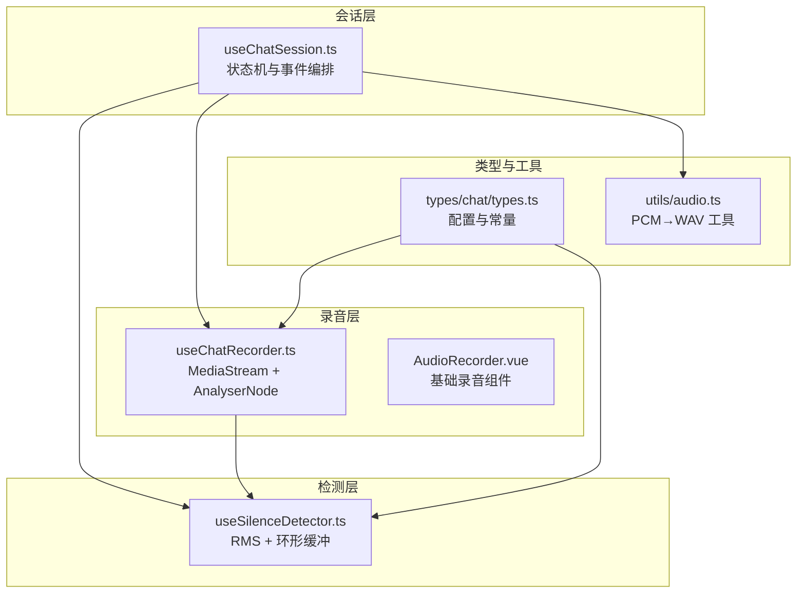
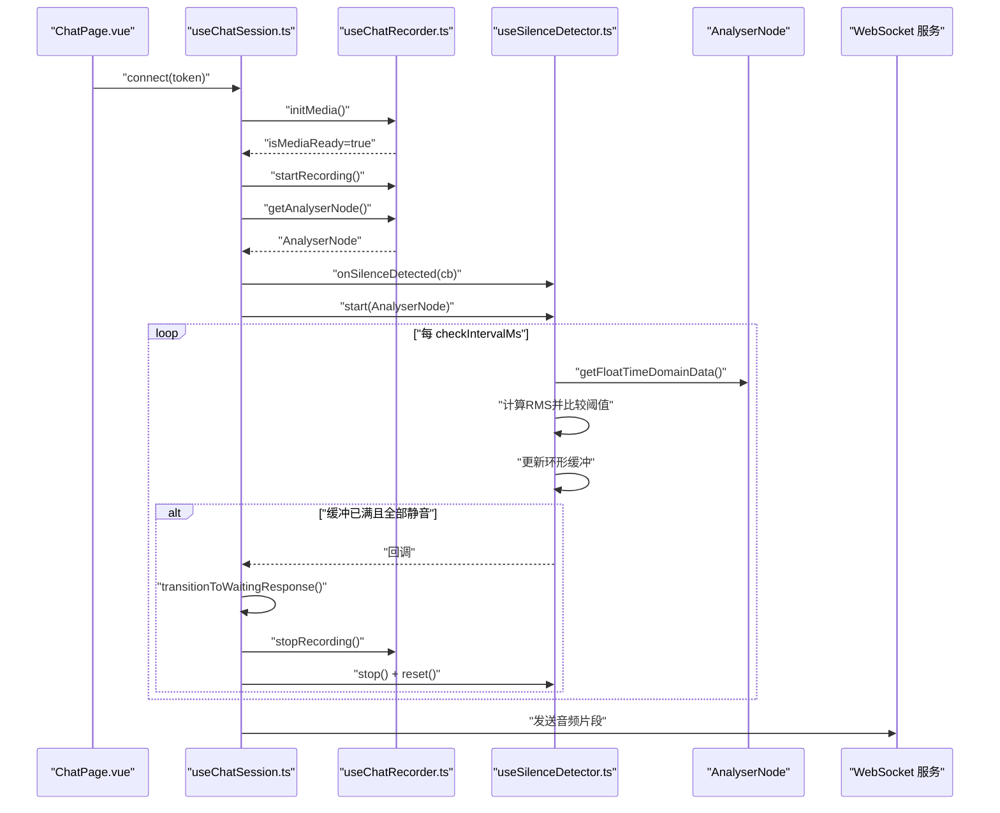
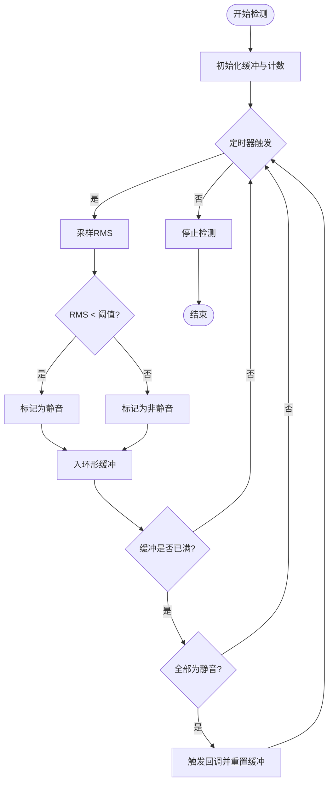
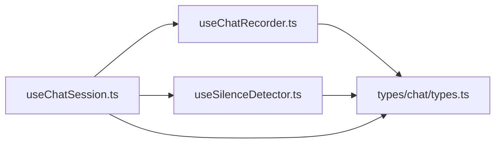

# 静音检测

<cite>
**本文引用的文件列表**
- [useSilenceDetector.ts](file://src/composables/useSilenceDetector.ts)
- [useChatRecorder.ts](file://src/composables/useChatRecorder.ts)
- [useChatSession.ts](file://src/composables/useChatSession.ts)
- [types.ts](file://src/types/chat/types.ts)
- [AudioRecorder.vue](file://src/components/AudioRecorder.vue)
- [ChatPage.vue](file://src/pages/stack/ChatPage.vue)
- [audio.ts](file://src/utils/audio.ts)
</cite>

## 目录
1. [简介](#简介)
2. [项目结构](#项目结构)
3. [核心组件](#核心组件)
4. [架构总览](#架构总览)
5. [详细组件分析](#详细组件分析)
6. [依赖关系分析](#依赖关系分析)
7. [性能考量](#性能考量)
8. [故障排查指南](#故障排查指南)
9. [结论](#结论)
10. [附录](#附录)

## 简介
本技术文档围绕前端静音检测模块展开，重点解析 useSilenceDetector 组合式函数的实现原理与工程实践，涵盖：
- 基于 Web Audio API 的音频 RMS 分析流程
- 阈值设定、滑动窗口（环形缓冲）与触发策略
- 回调机制与与录音器、会话状态机的集成方式
- 检测参数配置、性能优化与误检处理
- 具体 API 使用示例、阈值设置与自适应调整建议
- 在会话状态转换中的作用与最佳实践

## 项目结构
静音检测模块位于 src/composables/useSilenceDetector.ts，配合录音器 useChatRecorder.ts 提供 AnalyserNode，由会话组合式 useChatSession.ts 在 Active 状态启动检测，并在检测到静音时触发状态转换。

图表来源
- [useChatSession.ts:74-136](file://src/composables/useChatSession.ts#L74-L136)
- [useChatRecorder.ts:36-136](file://src/composables/useChatRecorder.ts#L36-L136)
- [useSilenceDetector.ts:27-103](file://src/composables/useSilenceDetector.ts#L27-L103)
- [types.ts:56-96](file://src/types/chat/types.ts#L56-L96)
- [AudioRecorder.vue:1-113](file://src/components/AudioRecorder.vue#L1-L113)
- [audio.ts:1-47](file://src/utils/audio.ts#L1-L47)

章节来源
- [useChatSession.ts:74-136](file://src/composables/useChatSession.ts#L74-L136)
- [useChatRecorder.ts:36-136](file://src/composables/useChatRecorder.ts#L36-L136)
- [useSilenceDetector.ts:27-103](file://src/composables/useSilenceDetector.ts#L27-L103)
- [types.ts:56-96](file://src/types/chat/types.ts#L56-L96)
- [AudioRecorder.vue:1-113](file://src/components/AudioRecorder.vue#L1-L113)
- [audio.ts:1-47](file://src/utils/audio.ts#L1-L47)

## 核心组件
- useSilenceDetector：基于 RMS 的静音检测器，周期性采样 AnalyserNode，维护固定长度的静音环形缓冲，全为静音时触发回调。
- useChatRecorder：负责初始化麦克风、创建 AudioContext 与 AnalyserNode，并以 200ms 片段输出 WAV 数据流。
- useChatSession：会话状态机，负责在 Active 状态启动静音检测，在检测到静音后进入 WaitingResponse；同时管理录音、播放、唤醒词等。
- 类型与常量：SilenceDetectorConfig、AUDIO_CONSTANTS、DEFAULT_SILENCE_CONFIG 等，统一了检测参数与录音参数。

章节来源
- [useSilenceDetector.ts:27-103](file://src/composables/useSilenceDetector.ts#L27-L103)
- [useChatRecorder.ts:36-136](file://src/composables/useChatRecorder.ts#L36-L136)
- [useChatSession.ts:244-273](file://src/composables/useChatSession.ts#L244-L273)
- [types.ts:56-96](file://src/types/chat/types.ts#L56-L96)

## 架构总览
静音检测在会话生命周期中的位置如下：
- 初始化阶段：useChatSession 调用 useChatRecorder.initMedia() 获取 MediaStream 并创建 AnalyserNode。
- Active 阶段：useChatSession 启动 useSilenceDetector，开始周期性采样 RMS。
- 触发条件：连续 N 次采样均低于阈值，且缓冲已填满（“宽限期”），触发回调。
- 状态转换：回调中切换到 WaitingResponse，停止录音并清理资源，等待服务器响应或超时。

图表来源
- [useChatSession.ts:244-273](file://src/composables/useChatSession.ts#L244-L273)
- [useChatSession.ts:406-412](file://src/composables/useChatSession.ts#L406-L412)
- [useChatRecorder.ts:61-66](file://src/composables/useChatRecorder.ts#L61-L66)
- [useSilenceDetector.ts:52-78](file://src/composables/useSilenceDetector.ts#L52-L78)

## 详细组件分析

### useSilenceDetector 实现原理
- 输入：AnalyserNode（来自录音器）
- 周期采样：默认每 500ms 采样一次
- RMS 计算：从 AnalyserNode 读取时间域数据，计算均方根
- 判定：若当前 RMS 小于阈值则认为静音
- 环形缓冲：维护最近 N 次判定结果（默认 N=6，即 3 秒窗口）
- 宽限期：在缓冲未填满前不触发，避免启动瞬间误判
- 触发：缓冲全部为静音时触发回调，并重置缓冲
- 生命周期：start/stop/reset/onSilenceDetected

图表来源
- [useSilenceDetector.ts:52-78](file://src/composables/useSilenceDetector.ts#L52-L78)

章节来源
- [useSilenceDetector.ts:27-103](file://src/composables/useSilenceDetector.ts#L27-L103)

### Web Audio API 使用与音频频谱分析
- 时间域采样：通过 AnalyserNode.getFloatTimeDomainData 获取浮点数组，用于 RMS 计算
- FFT 大小：默认 fftSize=2048，平衡频率分辨率与性能
- 不连接扬声器：仅分析，避免回放开销与反馈
- 采样率与通道：与录音器一致（16kHz、单声道）

章节来源
- [useChatRecorder.ts:61-66](file://src/composables/useChatRecorder.ts#L61-L66)
- [useSilenceDetector.ts:41-50](file://src/composables/useSilenceDetector.ts#L41-L50)

### 静音判断逻辑与灵敏度调节
- 阈值：默认 0.01，对应 Go 客户端 int16 200 的归一化值
- 连续次数：默认 6 次（3 秒），避免瞬时噪声导致误判
- 宽限期：样本数不足时不触发，确保统计稳定性
- 自适应建议：可按环境噪声动态调整阈值；在嘈杂环境中提高阈值；在安静环境中降低阈值

章节来源
- [types.ts:66-73](file://src/types/chat/types.ts#L66-L73)
- [useSilenceDetector.ts:58-77](file://src/composables/useSilenceDetector.ts#L58-L77)

### 回调机制与与录音器、会话集成
- 录音器提供 AnalyserNode：在 initMedia 中创建 AudioContext 与 AnalyserNode
- 会话在 Active 状态启动检测：transitionToActive 中获取 AnalyserNode 并启动
- 回调触发后进入 WaitingResponse：停止录音、清理播放器、准备等待服务器响应
- 与唤醒词协作：在 Idle 状态监听唤醒词，Active 状态关闭唤醒词监听

章节来源
- [useChatSession.ts:244-273](file://src/composables/useChatSession.ts#L244-L273)
- [useChatSession.ts:406-412](file://src/composables/useChatSession.ts#L406-L412)
- [useChatRecorder.ts:122-124](file://src/composables/useChatRecorder.ts#L122-L124)

### API 使用示例与参数配置
- 基本用法
  - 获取 AnalyserNode：recorder.getAnalyserNode()
  - 注册回调：silenceDetector.onSilenceDetected(() => {...})
  - 启动检测：silenceDetector.start(analyserNode)
  - 停止与重置：silenceDetector.stop() / reset()
- 参数配置
  - 阈值：rmsThreshold（默认 0.01）
  - 采样间隔：checkIntervalMs（默认 500ms）
  - 连续静音次数：consecutiveSilentCount（默认 6）
- 参考路径
  - [useSilenceDetector.ts:27-34](file://src/composables/useSilenceDetector.ts#L27-L34)
  - [types.ts:56-73](file://src/types/chat/types.ts#L56-L73)

章节来源
- [useSilenceDetector.ts:27-34](file://src/composables/useSilenceDetector.ts#L27-L34)
- [types.ts:56-73](file://src/types/chat/types.ts#L56-L73)

### 与录音器的集成方式
- 录音器负责：
  - 初始化麦克风与 AudioContext
  - 创建 AnalyserNode 用于静音检测
  - 以 200ms 片段输出 WAV 数据流（用于实时传输）
- 静音检测复用同一 MediaStreamSource，不引入额外播放链路

章节来源
- [useChatRecorder.ts:47-70](file://src/composables/useChatRecorder.ts#L47-L70)
- [useChatRecorder.ts:72-91](file://src/composables/useChatRecorder.ts#L72-L91)
- [useChatRecorder.ts:122-124](file://src/composables/useChatRecorder.ts#L122-L124)

### 在会话状态转换中的作用
- Idle → WaitingResponse：会话启动时进入 WaitingResponse，不启动静音检测
- WaitingResponse → Active：服务器返回音频完成后进入 Active，启动静音检测
- Active → WaitingResponse：检测到静音后进入 WaitingResponse，停止录音并清理
- Idle → Active：手动唤醒或语音中断后进入 Active，启动静音检测

章节来源
- [useChatSession.ts:162-166](file://src/composables/useChatSession.ts#L162-L166)
- [useChatSession.ts:244-273](file://src/composables/useChatSession.ts#L244-L273)
- [useChatSession.ts:406-412](file://src/composables/useChatSession.ts#L406-L412)

## 依赖关系分析
- useChatSession 依赖 useChatRecorder 与 useSilenceDetector
- useChatRecorder 依赖 Web Audio API 与浏览器媒体设备
- useSilenceDetector 依赖 useChatRecorder 提供的 AnalyserNode
- 类型与常量统一由 types/chat/types.ts 提供

图表来源
- [useChatSession.ts:74-81](file://src/composables/useChatSession.ts#L74-L81)
- [useChatRecorder.ts:36-136](file://src/composables/useChatRecorder.ts#L36-L136)
- [useSilenceDetector.ts:27-103](file://src/composables/useSilenceDetector.ts#L27-L103)
- [types.ts:56-96](file://src/types/chat/types.ts#L56-L96)

章节来源
- [useChatSession.ts:74-81](file://src/composables/useChatSession.ts#L74-L81)
- [useChatRecorder.ts:36-136](file://src/composables/useChatRecorder.ts#L36-L136)
- [useSilenceDetector.ts:27-103](file://src/composables/useSilenceDetector.ts#L27-L103)
- [types.ts:56-96](file://src/types/chat/types.ts#L56-L96)

## 性能考量
- 采样频率与缓冲大小
  - fftSize=2048 提供较好频率分辨率，但会增加 CPU 占用
  - 建议在低端设备上适当降低采样频率或增大采样间隔
- 定时器开销
  - 默认 500ms 采样频率较低，一般不会造成明显负担
  - 若需要更快速响应，可缩短间隔，但需权衡 CPU 与电池消耗
- 环形缓冲长度
  - 连续静音次数越多，越稳定但响应越慢
  - 可根据场景折中选择（如 3–6 次）
- 阈值与噪声
  - 在嘈杂环境下提高阈值，减少误检
  - 可考虑动态阈值（基于一段时间内 RMS 的统计值）
- 资源释放
  - 状态切换时及时 stop() 与 reset()，避免内存泄漏与后台任务持续运行

[本节为通用性能建议，无需特定文件引用]

## 故障排查指南
- 无法启动录音
  - 检查浏览器权限与 HTTPS 环境
  - 确认 useChatRecorder.initMedia() 成功创建 MediaStream 与 AnalyserNode
- 静音检测不触发
  - 确认在 Active 状态启动检测
  - 检查阈值是否过高或过低
  - 确认定时器正常运行，缓冲未被提前清空
- 回调频繁触发
  - 降低阈值或增加连续静音次数
  - 检查环境噪声与麦克风增益
- 资源未释放
  - 状态切换时调用 stop() 与 reset()
  - 页面卸载时调用 releaseMedia()

章节来源
- [useChatRecorder.ts:47-70](file://src/composables/useChatRecorder.ts#L47-L70)
- [useChatSession.ts:244-273](file://src/composables/useChatSession.ts#L244-L273)
- [useSilenceDetector.ts:81-91](file://src/composables/useSilenceDetector.ts#L81-L91)

## 结论
useSilenceDetector 采用简单而稳健的 RMS + 环形缓冲策略，结合会话状态机与录音器，实现了可靠的静音检测能力。通过合理配置阈值、采样间隔与连续次数，可在不同场景下取得良好的误检控制与响应速度。建议在实际部署中结合环境噪声与设备性能进行参数微调，并在状态切换时严格释放资源，确保系统稳定与低功耗。

[本节为总结性内容，无需特定文件引用]

## 附录

### API 一览（路径参考）
- useSilenceDetector
  - [start(analyserNode):52-78](file://src/composables/useSilenceDetector.ts#L52-L78)
  - [stop():81-86](file://src/composables/useSilenceDetector.ts#L81-L86)
  - [reset():88-91](file://src/composables/useSilenceDetector.ts#L88-L91)
  - [onSilenceDetected(callback):93-95](file://src/composables/useSilenceDetector.ts#L93-L95)
- useChatRecorder
  - [initMedia():47-70](file://src/composables/useChatRecorder.ts#L47-L70)
  - [startRecording():72-91](file://src/composables/useChatRecorder.ts#L72-L91)
  - [stopRecording():93-99](file://src/composables/useChatRecorder.ts#L93-L99)
  - [releaseMedia():101-116](file://src/composables/useChatRecorder.ts#L101-L116)
  - [getAnalyserNode():122-124](file://src/composables/useChatRecorder.ts#L122-L124)
- useChatSession
  - [transitionToActive():244-256](file://src/composables/useChatSession.ts#L244-L256)
  - [transitionToWaitingResponse():258-273](file://src/composables/useChatSession.ts#L258-L273)
  - [transitionToIdle():275-303](file://src/composables/useChatSession.ts#L275-L303)
- 类型与常量
  - [SilenceDetectorConfig:56-64](file://src/types/chat/types.ts#L56-L64)
  - [DEFAULT_SILENCE_CONFIG:66-73](file://src/types/chat/types.ts#L66-L73)
  - [AUDIO_CONSTANTS:85-96](file://src/types/chat/types.ts#L85-L96)