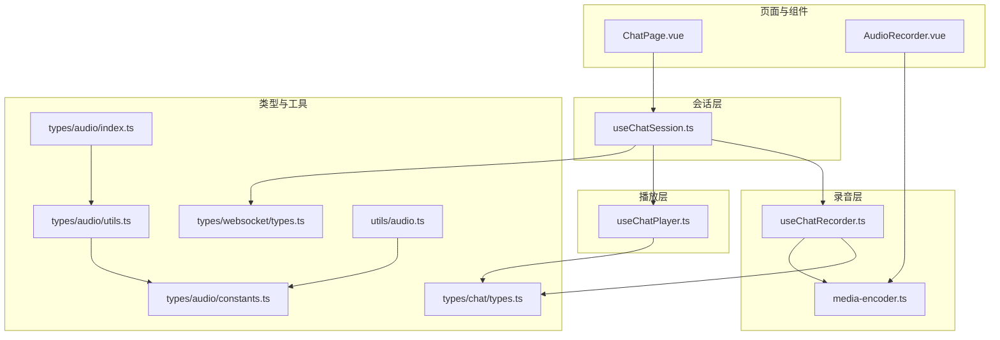
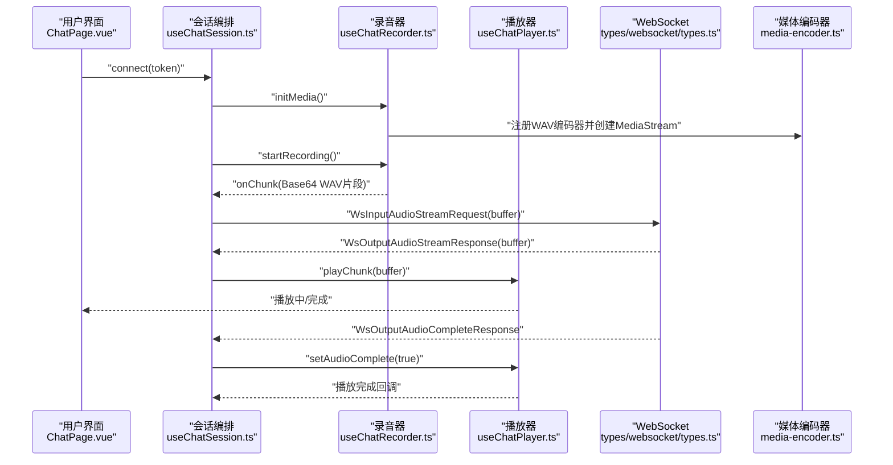
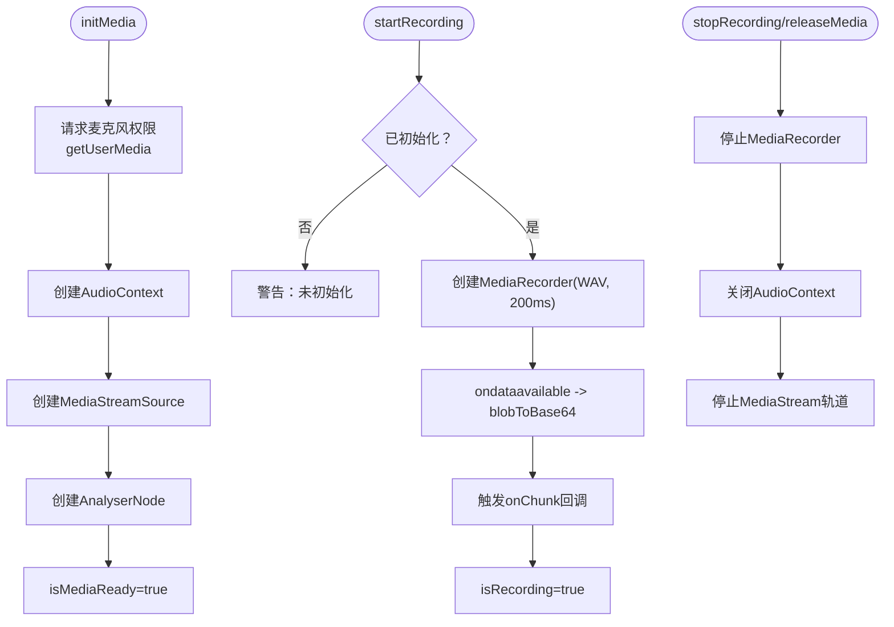
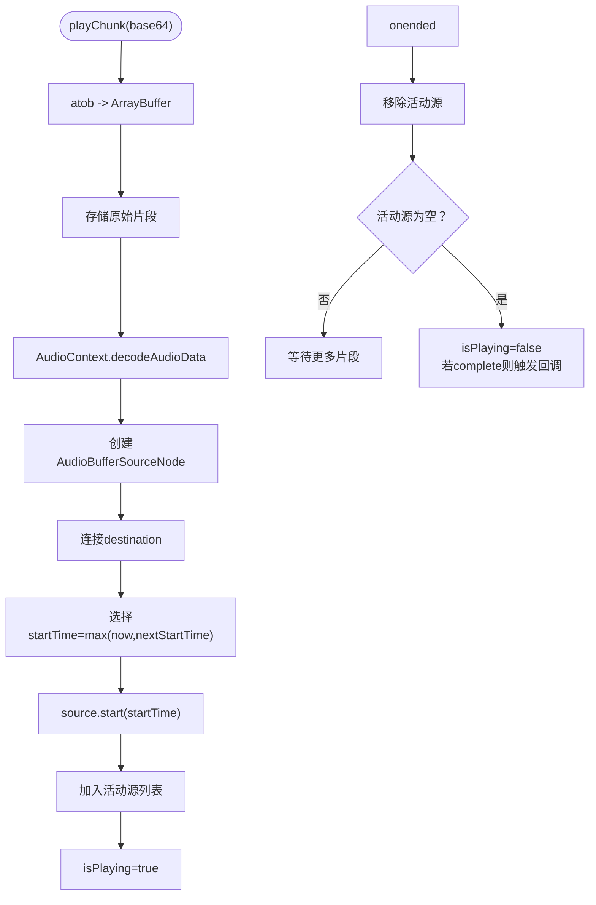
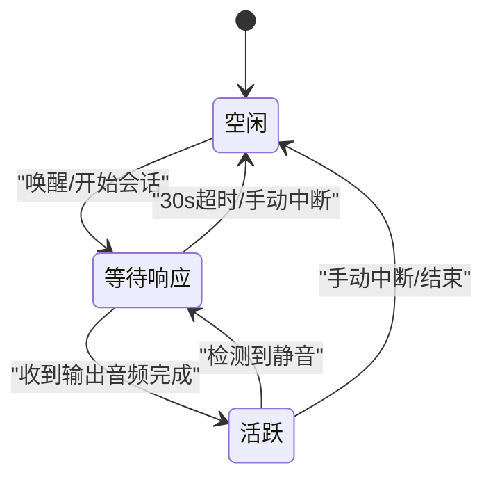
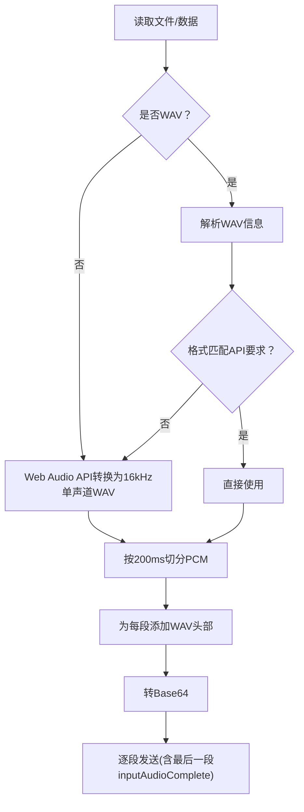
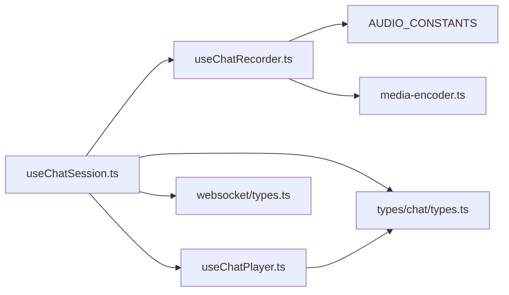

# 音频处理

<cite>
**本文引用的文件**
- [useChatRecorder.ts](file://src/composables/useChatRecorder.ts)
- [useChatPlayer.ts](file://src/composables/useChatPlayer.ts)
- [useChatSession.ts](file://src/composables/useChatSession.ts)
- [media-encoder.ts](file://src/boot/media-encoder.ts)
- [types.ts](file://src/types/chat/types.ts)
- [websocket/types.ts](file://src/types/websocket/types.ts)
- [audio/index.ts](file://src/types/audio/index.ts)
- [audio/utils.ts](file://src/types/audio/utils.ts)
- [audio/constants.ts](file://src/types/audio/constants.ts)
- [utils/audio.ts](file://src/utils/audio.ts)
- [AudioRecorder.vue](file://src/components/AudioRecorder.vue)
- [ChatPage.vue](file://src/pages/stack/ChatPage.vue)
</cite>

## 目录
1. [简介](#简介)
2. [项目结构](#项目结构)
3. [核心组件](#核心组件)
4. [架构总览](#架构总览)
5. [详细组件分析](#详细组件分析)
6. [依赖关系分析](#依赖关系分析)
7. [性能考量](#性能考量)
8. [故障排查指南](#故障排查指南)
9. [结论](#结论)
10. [附录](#附录)

## 简介
本技术文档围绕前端音频处理模块，系统阐述两个组合式函数 useChatRecorder 与 useChatPlayer 的实现原理与协作机制，覆盖以下主题：
- 录音与播放控制：录音初始化、分片采集、播放调度与中断
- 格式转换与缓冲管理：WAV 分片生成、PCM/WAV 转换、Base64 编解码
- 实时音频处理：Web Audio API 的解码与无间断播放
- 采样率与质量：统一采样率、单声道、16bit 位深的约束与优化
- 内存与性能：资源释放、对象URL清理、播放队列与时间线管理
- 设备与权限：麦克风权限获取与设备能力检测
- 跨浏览器兼容：extendable-media-recorder 与 WAV 编码器注册
- 音频处理流水线：从录音到服务器传输再到播放完成的完整链路

## 项目结构
音频处理相关代码主要分布在如下位置：
- 组合式函数：录音 useChatRecorder、播放 useChatPlayer、会话 useChatSession
- 启动引导：媒体编码器注册 media-encoder.ts
- 类型与常量：聊天配置 AUDIO_CONSTANTS、WebSocket 动作类型
- 工具与处理器：音频流处理器 AudioStreamProcessor、PCM→WAV 工具
- 页面与组件：聊天页 ChatPage.vue、独立录音组件 AudioRecorder.vue

**图表来源**
- [useChatSession.ts:1-589](file://src/composables/useChatSession.ts#L1-L589)
- [useChatRecorder.ts:1-148](file://src/composables/useChatRecorder.ts#L1-L148)
- [useChatPlayer.ts:1-161](file://src/composables/useChatPlayer.ts#L1-L161)
- [media-encoder.ts:1-8](file://src/boot/media-encoder.ts#L1-L8)
- [types/chat/types.ts:85-96](file://src/types/chat/types.ts#L85-L96)
- [types/websocket/types.ts:1-226](file://src/types/websocket/types.ts#L1-L226)
- [types/audio/index.ts:1-150](file://src/types/audio/index.ts#L1-L150)
- [types/audio/utils.ts:1-312](file://src/types/audio/utils.ts#L1-L312)
- [types/audio/constants.ts:1-2](file://src/types/audio/constants.ts#L1-L2)
- [utils/audio.ts:1-47](file://src/utils/audio.ts#L1-L47)
- [AudioRecorder.vue:1-113](file://src/components/AudioRecorder.vue#L1-L113)
- [ChatPage.vue:1-179](file://src/pages/stack/ChatPage.vue#L1-L179)

**章节来源**
- [useChatSession.ts:1-589](file://src/composables/useChatSession.ts#L1-L589)
- [useChatRecorder.ts:1-148](file://src/composables/useChatRecorder.ts#L1-L148)
- [useChatPlayer.ts:1-161](file://src/composables/useChatPlayer.ts#L1-L161)
- [media-encoder.ts:1-8](file://src/boot/media-encoder.ts#L1-L8)
- [types/chat/types.ts:85-96](file://src/types/chat/types.ts#L85-L96)
- [types/websocket/types.ts:1-226](file://src/types/websocket/types.ts#L1-L226)
- [types/audio/index.ts:1-150](file://src/types/audio/index.ts#L1-L150)
- [types/audio/utils.ts:1-312](file://src/types/audio/utils.ts#L1-L312)
- [types/audio/constants.ts:1-2](file://src/types/audio/constants.ts#L1-L2)
- [utils/audio.ts:1-47](file://src/utils/audio.ts#L1-L47)
- [AudioRecorder.vue:1-113](file://src/components/AudioRecorder.vue#L1-L113)
- [ChatPage.vue:1-179](file://src/pages/stack/ChatPage.vue#L1-L179)

## 核心组件
- useChatRecorder：负责麦克风权限获取、MediaStream 创建、MediaRecorder 分片录制（WAV，200ms）、AnalyserNode 用于静音检测，并以 Base64 WAV 片段回调上层。
- useChatPlayer：负责接收 Base64 音频片段，解码为 AudioBuffer，通过 AudioContext 播放，维护播放队列与时间线，支持立即停止与播放完成回调。
- useChatSession：编排会话状态机，连接 WebSocket，转发录音分片到服务端，接收并播放回放音频，处理静音检测与超时。

**章节来源**
- [useChatRecorder.ts:36-136](file://src/composables/useChatRecorder.ts#L36-L136)
- [useChatPlayer.ts:35-160](file://src/composables/useChatPlayer.ts#L35-L160)
- [useChatSession.ts:74-571](file://src/composables/useChatSession.ts#L74-L571)

## 架构总览
录音与播放的端到端流程如下：

**图表来源**
- [useChatSession.ts:379-425](file://src/composables/useChatSession.ts#L379-L425)
- [useChatRecorder.ts:72-91](file://src/composables/useChatRecorder.ts#L72-L91)
- [useChatPlayer.ts:53-96](file://src/composables/useChatPlayer.ts#L53-L96)
- [websocket/types.ts:105-131](file://src/types/websocket/types.ts#L105-L131)
- [media-encoder.ts:5-7](file://src/boot/media-encoder.ts#L5-L7)

## 详细组件分析

### useChatRecorder：录音与静音检测
- 初始化与权限
  - 通过 getUserMedia 获取 MediaStream，设置采样率、位深、声道数与降噪/回声抑制等参数。
  - 创建 AudioContext 与 AnalyserNode，用于静音检测；注意不连接到扬声器，仅分析。
- 录音与分片
  - 使用 extendable-media-recorder，指定 MIME 类型为 audio/wav，分片时长为 200ms。
  - ondataavailable 回调中将 Blob 转为 Base64 并触发上层回调。
- 生命周期管理
  - startRecording/startRecording/stopRecording/releaseMedia，确保资源释放与状态同步。
- 输出接口
  - isRecording/isMediaReady、onChunk、getAnalyserNode。

**图表来源**
- [useChatRecorder.ts:47-124](file://src/composables/useChatRecorder.ts#L47-L124)
- [useChatRecorder.ts:139-147](file://src/composables/useChatRecorder.ts#L139-L147)

**章节来源**
- [useChatRecorder.ts:36-136](file://src/composables/useChatRecorder.ts#L36-L136)
- [media-encoder.ts:5-7](file://src/boot/media-encoder.ts#L5-L7)
- [types/chat/types.ts:85-96](file://src/types/chat/types.ts#L85-L96)

### useChatPlayer：实时播放与无间断调度
- 解码与播放
  - 接收 Base64，转 ArrayBuffer，AudioContext.decodeAudioData 解码为 AudioBuffer。
  - 创建 AudioBufferSourceNode，连接到 AudioContext.destination。
- 时间线与无间断
  - 维护 nextStartTime，按当前时间或下一时刻开始播放，确保片段无缝衔接。
  - 记录活动源数组，监听 onended 清理并判断是否全部播放完毕。
- 控制与清理
  - stopPlayback 立即停止并断开所有源；clearBuffer 清空缓存但不打断播放；destroy 关闭上下文并清理回调。
- 输出接口
  - isPlaying/playChunk/setAudioComplete/onPlaybackFinished/getAudioBlob/destroy。

**图表来源**
- [useChatPlayer.ts:53-96](file://src/composables/useChatPlayer.ts#L53-L96)
- [useChatPlayer.ts:107-123](file://src/composables/useChatPlayer.ts#L107-L123)

**章节来源**
- [useChatPlayer.ts:35-160](file://src/composables/useChatPlayer.ts#L35-L160)

### useChatSession：会话编排与状态机
- WebSocket 事件处理
  - 建立连接后发送更新配置；处理输出文本/音频流与完成事件；处理取消输出与聊天完成。
- 录音与播放联动
  - 录音分片通过 onChunk 回调发送至服务端；收到音频流时调用当前播放器播放；收到完成事件后标记完成并可生成消息音频URL。
- 静音检测与超时
  - 在 Active 状态启动静音检测；超时（30s）自动结束会话并发送 inputAudioComplete。
- 中断与清理
  - 支持手动中断与语音中断；清理播放队列、AnalyserNode、MediaStream 与定时器；销毁播放器实例。

**图表来源**
- [useChatSession.ts:244-303](file://src/composables/useChatSession.ts#L244-L303)
- [types/chat/types.ts:11-19](file://src/types/chat/types.ts#L11-L19)

**章节来源**
- [useChatSession.ts:74-571](file://src/composables/useChatSession.ts#L74-L571)

### PCM/WAV 处理与音频流处理器
- PCM→WAV
  - 通过工具函数为 PCM 数据添加标准 WAV 头部，支持自定义采样率、声道数与位深。
- 音频流处理器
  - 读取音频文件，解析 WAV 信息，按固定时长切分 PCM，为每段添加 WAV 头，再转为 Base64 流式发送。
  - 最后一段通过 inputAudioComplete 请求发送，确保服务端正确识别结束。
- 转换与校验
  - 若输入非 WAV 或不符合 API 要求（16kHz、单声道、16bit），则转换为目标格式。

**图表来源**
- [audio/utils.ts:221-262](file://src/types/audio/utils.ts#L221-L262)
- [audio/utils.ts:267-270](file://src/types/audio/utils.ts#L267-L270)
- [audio/utils.ts:276-311](file://src/types/audio/utils.ts#L276-L311)
- [utils/audio.ts:1-47](file://src/utils/audio.ts#L1-L47)

**章节来源**
- [audio/index.ts:26-131](file://src/types/audio/index.ts#L26-L131)
- [audio/utils.ts:11-64](file://src/types/audio/utils.ts#L11-L64)
- [utils/audio.ts:1-47](file://src/utils/audio.ts#L1-L47)

### 跨浏览器兼容与设备管理
- 兼容性
  - 通过 extendable-media-recorder 与 extendable-media-recorder-wav-encoder 注册，确保浏览器对 WAV 录制的支持。
- 设备管理
  - 录音组件与组合式函数均通过 navigator.mediaDevices.getUserMedia 获取设备；在卸载或释放时停止轨道。
- 权限处理
  - 录音失败时通过通知提示错误信息；会话层在连接前先初始化媒体。

**章节来源**
- [media-encoder.ts:5-7](file://src/boot/media-encoder.ts#L5-L7)
- [AudioRecorder.vue:69-86](file://src/components/AudioRecorder.vue#L69-L86)
- [useChatRecorder.ts:47-70](file://src/composables/useChatRecorder.ts#L47-L70)

## 依赖关系分析
- 组件耦合
  - useChatSession 同时依赖 useChatRecorder、useChatPlayer、WebSocket 类型与聊天状态常量。
  - useChatRecorder 依赖 AUDIO_CONSTANTS 与 extendable-media-recorder 注册。
  - useChatPlayer 依赖 Web Audio API，内部管理播放队列与时间线。
- 外部依赖
  - extendable-media-recorder 与 WAV 编码器注册
  - 浏览器 Web Audio API 与 MediaStream/MediaRecorder API

**图表来源**
- [useChatSession.ts:74-571](file://src/composables/useChatSession.ts#L74-L571)
- [useChatRecorder.ts:1-23](file://src/composables/useChatRecorder.ts#L1-L23)
- [media-encoder.ts:1-8](file://src/boot/media-encoder.ts#L1-L8)
- [types/chat/types.ts:85-96](file://src/types/chat/types.ts#L85-L96)
- [types/websocket/types.ts:1-226](file://src/types/websocket/types.ts#L1-L226)

**章节来源**
- [useChatSession.ts:74-571](file://src/composables/useChatSession.ts#L74-L571)
- [useChatRecorder.ts:1-23](file://src/composables/useChatRecorder.ts#L1-L23)
- [media-encoder.ts:1-8](file://src/boot/media-encoder.ts#L1-L8)
- [types/chat/types.ts:85-96](file://src/types/chat/types.ts#L85-L96)
- [types/websocket/types.ts:1-226](file://src/types/websocket/types.ts#L1-L226)

## 性能考量
- 采样率与质量
  - 统一使用 16kHz、单声道、16bit，降低带宽与处理开销，满足多数语音识别 API 要求。
- 分片与时延
  - 200ms 分片平衡实时性与网络开销；播放端严格按时间线调度，避免重叠与卡顿。
- 内存与资源
  - 及时释放 MediaStream 轨道、AudioContext、播放源与对象URL；在会话结束与组件卸载时统一清理。
- 解码与渲染
  - 使用 OfflineAudioContext 进行格式转换，减少主线程阻塞；播放解码采用异步 decodeAudioData。
- 缓冲与队列
  - 播放器维护活动源数组与 nextStartTime，避免累积延迟；提供 clearBuffer 与 stopPlayback 快速清空。

[本节为通用性能建议，无需特定文件引用]

## 故障排查指南
- 录音无输出
  - 检查是否先调用 initMedia；确认浏览器权限与设备可用；查看 onChunk 是否被注册。
- 播放无声或卡顿
  - 确认 Base64 数据有效且未损坏；检查 decodeAudioData 是否抛错；关注 onended 事件是否触发。
- 静音检测不生效
  - 确认 AnalyserNode 已创建且未连接到扬声器；检查 getAnalyserNode 是否返回有效节点。
- 超时提前结束
  - 确保在收到音频流时重置等待计时；检查 WaitingResponse 超时阈值与定时器逻辑。
- 资源泄漏
  - 确保在 disconnect/destroy 中调用 releaseMedia/destroy；及时 revoke 对象URL。

**章节来源**
- [useChatRecorder.ts:72-124](file://src/composables/useChatRecorder.ts#L72-L124)
- [useChatPlayer.ts:53-96](file://src/composables/useChatPlayer.ts#L53-L96)
- [useChatSession.ts:346-365](file://src/composables/useChatSession.ts#L346-L365)

## 结论
该音频处理模块以组合式函数为核心，结合会话编排与类型系统，实现了从录音、分片、传输到播放的完整闭环。通过统一的采样率与格式、严格的资源管理与时间线调度，确保了跨浏览器的稳定性与良好的用户体验。建议在生产环境中持续监控内存占用与播放延迟，并根据业务需求调整分片时长与播放策略。

[本节为总结性内容，无需特定文件引用]

## 附录

### API 使用示例（路径指引）
- 录音初始化与开始
  - [useChatRecorder.ts:47-70](file://src/composables/useChatRecorder.ts#L47-L70)
  - [useChatRecorder.ts:72-91](file://src/composables/useChatRecorder.ts#L72-L91)
- 录音回调与分片发送
  - [useChatSession.ts:391-404](file://src/composables/useChatSession.ts#L391-L404)
- 播放控制与完成回调
  - [useChatPlayer.ts:53-96](file://src/composables/useChatPlayer.ts#L53-L96)
  - [useChatPlayer.ts:130-132](file://src/composables/useChatPlayer.ts#L130-L132)
- 会话状态流转
  - [useChatSession.ts:244-303](file://src/composables/useChatSession.ts#L244-L303)
- 音频流处理器
  - [audio/index.ts:26-131](file://src/types/audio/index.ts#L26-L131)

### 音频格式支持与约束
- 输入：WAV（16kHz、单声道、16bit）或自动转换为目标格式
- 输出：WAV 分片（200ms），Base64 编码
- 播放：Web Audio API 解码与播放

**章节来源**
- [types/audio/utils.ts:93-139](file://src/types/audio/utils.ts#L93-L139)
- [types/audio/utils.ts:221-262](file://src/types/audio/utils.ts#L221-L262)
- [types/chat/types.ts:85-96](file://src/types/chat/types.ts#L85-L96)