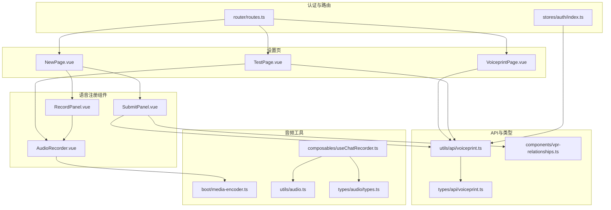
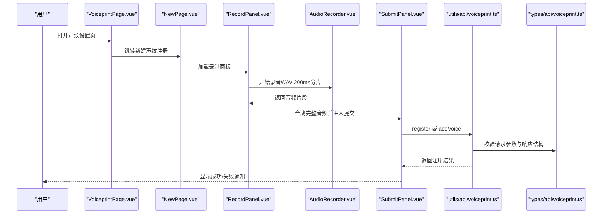
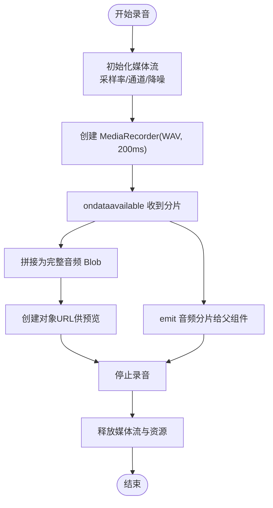
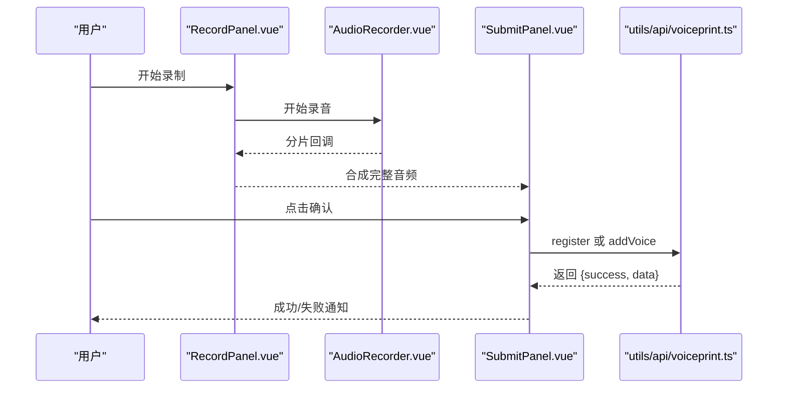
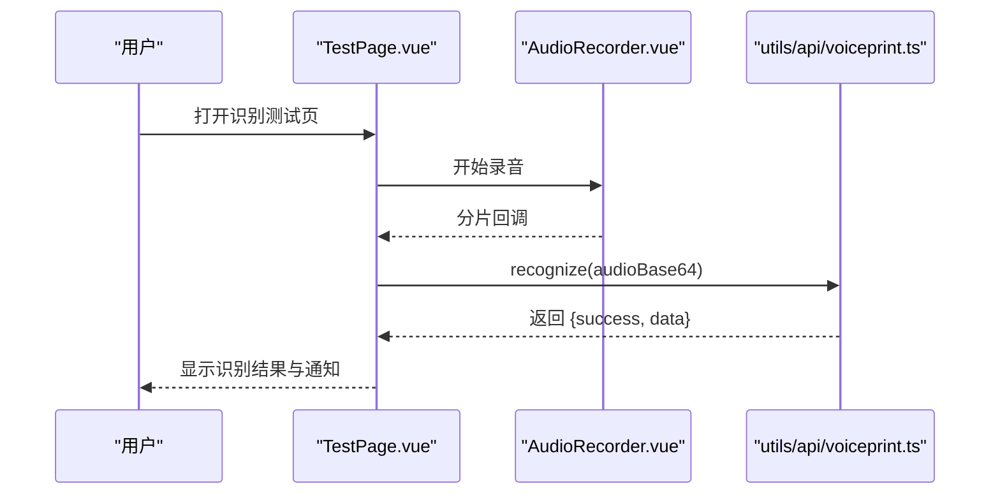
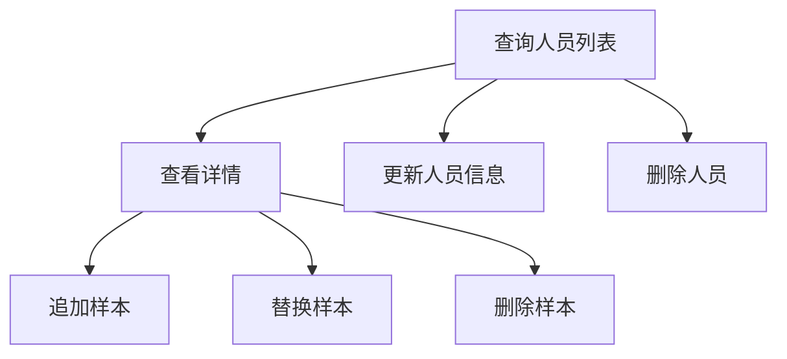
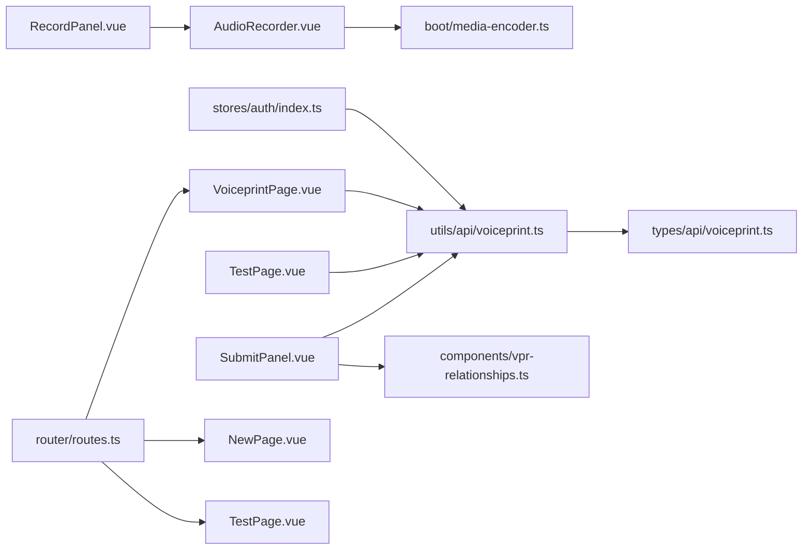

# 语音特征管理系统

<cite>
**本文档引用的文件**
- [voiceprint.ts（类型定义）](file://src/types/api/voiceprint.ts)
- [voiceprint.ts（API封装）](file://src/utils/api/voiceprint.ts)
- [AudioRecorder.vue](file://src/components/AudioRecorder.vue)
- [RecordPanel.vue](file://src/components/settings/voiceprint/RecordPanel.vue)
- [SubmitPanel.vue](file://src/components/settings/voiceprint/SubmitPanel.vue)
- [NewPage.vue](file://src/pages/stack/settings/voiceprint/NewPage.vue)
- [TestPage.vue](file://src/pages/stack/settings/voiceprint/TestPage.vue)
- [VoiceprintPage.vue](file://src/pages/stack/settings/VoiceprintPage.vue)
- [routes.ts](file://src/router/routes.ts)
- [useChatRecorder.ts](file://src/composables/useChatRecorder.ts)
- [media-encoder.ts](file://src/boot/media-encoder.ts)
- [audio.ts](file://src/utils/audio.ts)
- [types.ts（音频常量）](file://src/types/audio/types.ts)
- [vpr-relationships.ts](file://src/components/vpr-relationships.ts)
- [auth store](file://src/stores/auth/index.ts)
</cite>

## 目录
1. [简介](#简介)
2. [项目结构](#项目结构)
3. [核心组件](#核心组件)
4. [架构总览](#架构总览)
5. [详细组件分析](#详细组件分析)
6. [依赖关系分析](#依赖关系分析)
7. [性能考虑](#性能考虑)
8. [故障排除指南](#故障排除指南)
9. [结论](#结论)
10. [附录](#附录)

## 简介
本系统为语音特征管理系统，提供以下核心能力：
- 声纹注册：采集用户语音样本，提交至后端生成声纹特征向量并绑定到人员档案。
- 语音识别测试：实时或离线上传音频进行身份识别，返回匹配结果与置信度。
- 人员信息管理：查询、更新、删除人员档案及关联的语音样本。
- 语音样本管理：为已存在人员追加新的语音样本，提升识别鲁棒性。

系统采用前端录音组件与API封装层，统一处理音频格式转换（WAV）、Base64传输与后端交互；同时提供聊天场景下的连续录音与静音检测能力，便于后续扩展到语音唤醒与对话流。

## 项目结构
前端采用模块化组织，语音特征相关功能集中在 settings/voiceprint 页面与组件中，配合通用的音频处理工具与类型定义。

图表来源
- [VoiceprintPage.vue:1-72](file://src/pages/stack/settings/VoiceprintPage.vue#L1-L72)
- [NewPage.vue:1-54](file://src/pages/stack/settings/voiceprint/NewPage.vue#L1-L54)
- [TestPage.vue:1-124](file://src/pages/stack/settings/voiceprint/TestPage.vue#L1-L124)
- [RecordPanel.vue:1-104](file://src/components/settings/voiceprint/RecordPanel.vue#L1-L104)
- [SubmitPanel.vue:1-158](file://src/components/settings/voiceprint/SubmitPanel.vue#L1-L158)
- [AudioRecorder.vue:1-113](file://src/components/AudioRecorder.vue#L1-L113)
- [voiceprint.ts（API封装）:1-123](file://src/utils/api/voiceprint.ts#L1-L123)
- [voiceprint.ts（类型定义）:1-98](file://src/types/api/voiceprint.ts#L1-L98)
- [vpr-relationships.ts:1-19](file://src/components/vpr-relationships.ts#L1-L19)
- [useChatRecorder.ts:1-148](file://src/composables/useChatRecorder.ts#L1-L148)
- [media-encoder.ts:1-8](file://src/boot/media-encoder.ts#L1-L8)
- [audio.ts:1-47](file://src/utils/audio.ts#L1-L47)
- [types.ts（音频常量）:1-14](file://src/types/audio/types.ts#L1-L14)
- [auth store:1-35](file://src/stores/auth/index.ts#L1-L35)
- [routes.ts:1-160](file://src/router/routes.ts#L1-L160)

章节来源
- [routes.ts:110-145](file://src/router/routes.ts#L110-L145)
- [VoiceprintPage.vue:1-72](file://src/pages/stack/settings/VoiceprintPage.vue#L1-L72)
- [NewPage.vue:1-54](file://src/pages/stack/settings/voiceprint/NewPage.vue#L1-L54)
- [TestPage.vue:1-124](file://src/pages/stack/settings/voiceprint/TestPage.vue#L1-L124)

## 核心组件
- 录音组件：基于 extendable-media-recorder 提供 200ms WAV 分片录制，支持实时预览与错误提示。
- 注册流程：分两步，先录制再提交，支持新增人员或为已有人员追加语音样本。
- 测试流程：在线或离线录制音频，调用识别接口返回识别结果。
- API封装：统一封装注册、识别、人员与语音样本的增删改查接口。
- 类型定义：明确人员、语音样本、识别结果的数据结构与响应格式。
- 关系映射：提供人员关系枚举与选项，用于注册时选择。

章节来源
- [AudioRecorder.vue:1-113](file://src/components/AudioRecorder.vue#L1-L113)
- [RecordPanel.vue:1-104](file://src/components/settings/voiceprint/RecordPanel.vue#L1-L104)
- [SubmitPanel.vue:1-158](file://src/components/settings/voiceprint/SubmitPanel.vue#L1-L158)
- [voiceprint.ts（API封装）:1-123](file://src/utils/api/voiceprint.ts#L1-L123)
- [voiceprint.ts（类型定义）:1-98](file://src/types/api/voiceprint.ts#L1-L98)
- [vpr-relationships.ts:1-19](file://src/components/vpr-relationships.ts#L1-L19)

## 架构总览
系统前端通过页面组件编排录音与提交流程，使用API封装层与后端交互；认证状态由 Pinia store 管理，路由控制访问权限。

图表来源
- [VoiceprintPage.vue:1-72](file://src/pages/stack/settings/VoiceprintPage.vue#L1-L72)
- [NewPage.vue:1-54](file://src/pages/stack/settings/voiceprint/NewPage.vue#L1-L54)
- [RecordPanel.vue:1-104](file://src/components/settings/voiceprint/RecordPanel.vue#L1-L104)
- [AudioRecorder.vue:1-113](file://src/components/AudioRecorder.vue#L1-L113)
- [SubmitPanel.vue:1-158](file://src/components/settings/voiceprint/SubmitPanel.vue#L1-L158)
- [voiceprint.ts（API封装）:1-123](file://src/utils/api/voiceprint.ts#L1-L123)
- [voiceprint.ts（类型定义）:1-98](file://src/types/api/voiceprint.ts#L1-L98)

## 详细组件分析

### 录音组件与音频处理
- 录音参数：采样率 16kHz、单声道、16bit，WAV 格式，200ms 分片输出。
- 实时预览：将分片拼接为完整 Blob 并生成对象 URL 供播放。
- 错误处理：捕获设备权限与初始化异常，弹出通知。
- 连续录音：聊天场景下复用相同逻辑，提供 onChunk 回调与静音检测节点。

图表来源
- [AudioRecorder.vue:1-113](file://src/components/AudioRecorder.vue#L1-L113)
- [useChatRecorder.ts:1-148](file://src/composables/useChatRecorder.ts#L1-L148)
- [media-encoder.ts:1-8](file://src/boot/media-encoder.ts#L1-L8)

章节来源
- [AudioRecorder.vue:69-86](file://src/components/AudioRecorder.vue#L69-L86)
- [useChatRecorder.ts:47-124](file://src/composables/useChatRecorder.ts#L47-L124)
- [media-encoder.ts:5-7](file://src/boot/media-encoder.ts#L5-L7)

### 声纹注册流程
- 新建人员：填写姓名、关系等信息，提交音频 Base64 完成注册。
- 追加样本：在已有人员下提交新音频，提升识别稳定性。
- 参数校验：前端确保必要字段非空，后端返回统一错误结构。
- 结果反馈：成功后显示通知并返回人员与语音样本统计信息。

图表来源
- [RecordPanel.vue:36-49](file://src/components/settings/voiceprint/RecordPanel.vue#L36-L49)
- [AudioRecorder.vue:31-60](file://src/components/AudioRecorder.vue#L31-L60)
- [SubmitPanel.vue:34-97](file://src/components/settings/voiceprint/SubmitPanel.vue#L34-L97)
- [voiceprint.ts（API封装）:28-52](file://src/utils/api/voiceprint.ts#L28-L52)

章节来源
- [RecordPanel.vue:1-104](file://src/components/settings/voiceprint/RecordPanel.vue#L1-L104)
- [SubmitPanel.vue:1-158](file://src/components/settings/voiceprint/SubmitPanel.vue#L1-L158)
- [voiceprint.ts（API封装）:28-52](file://src/utils/api/voiceprint.ts#L28-L52)

### 识别测试功能
- 在线测试：直接在测试页录制并识别，展示识别结果与置信度。
- 离线测试：可先录制再上传，兼容不同使用场景。
- 结果解析：解析后端返回的识别数据，包括匹配人员信息与相似度。

图表来源
- [TestPage.vue:32-82](file://src/pages/stack/settings/voiceprint/TestPage.vue#L32-L82)
- [AudioRecorder.vue:31-60](file://src/components/AudioRecorder.vue#L31-L60)
- [voiceprint.ts（API封装）:15-26](file://src/utils/api/voiceprint.ts#L15-L26)

章节来源
- [TestPage.vue:1-124](file://src/pages/stack/settings/voiceprint/TestPage.vue#L1-L124)
- [voiceprint.ts（API封装）:15-26](file://src/utils/api/voiceprint.ts#L15-L26)

### 人员信息与语音样本管理
- 查询人员列表：支持分页与筛选，跳转详情查看语音样本。
- 更新人员信息：修改姓名、关系、是否临时等元数据。
- 删除人员：清理该人员所有样本与记录。
- 语音样本操作：新增、替换、删除样本，支持多次录制以提高鲁棒性。

图表来源
- [VoiceprintPage.vue:17-33](file://src/pages/stack/settings/VoiceprintPage.vue#L17-L33)
- [voiceprint.ts（API封装）:54-104](file://src/utils/api/voiceprint.ts#L54-L104)
- [voiceprint.ts（类型定义）:68-86](file://src/types/api/voiceprint.ts#L68-L86)

章节来源
- [VoiceprintPage.vue:1-72](file://src/pages/stack/settings/VoiceprintPage.vue#L1-L72)
- [voiceprint.ts（API封装）:54-104](file://src/utils/api/voiceprint.ts#L54-L104)
- [voiceprint.ts（类型定义）:14-86](file://src/types/api/voiceprint.ts#L14-L86)

## 依赖关系分析
- 组件耦合：页面组件依赖录音组件与API封装；API封装依赖类型定义与认证 store。
- 外部依赖：extendable-media-recorder 提供 WAV 编码器；Axios 作为 HTTP 客户端。
- 数据流：从录音组件到页面组件，再到 API 封装，最终返回到 UI 展示。

图表来源
- [AudioRecorder.vue:1-113](file://src/components/AudioRecorder.vue#L1-L113)
- [media-encoder.ts:1-8](file://src/boot/media-encoder.ts#L1-L8)
- [RecordPanel.vue:1-104](file://src/components/settings/voiceprint/RecordPanel.vue#L1-L104)
- [SubmitPanel.vue:1-158](file://src/components/settings/voiceprint/SubmitPanel.vue#L1-L158)
- [TestPage.vue:1-124](file://src/pages/stack/settings/voiceprint/TestPage.vue#L1-L124)
- [VoiceprintPage.vue:1-72](file://src/pages/stack/settings/VoiceprintPage.vue#L1-L72)
- [voiceprint.ts（API封装）:1-123](file://src/utils/api/voiceprint.ts#L1-L123)
- [voiceprint.ts（类型定义）:1-98](file://src/types/api/voiceprint.ts#L1-L98)
- [vpr-relationships.ts:1-19](file://src/components/vpr-relationships.ts#L1-L19)
- [auth store:1-35](file://src/stores/auth/index.ts#L1-L35)
- [routes.ts:110-145](file://src/router/routes.ts#L110-L145)

章节来源
- [routes.ts:110-145](file://src/router/routes.ts#L110-L145)
- [voiceprint.ts（API封装）:1-123](file://src/utils/api/voiceprint.ts#L1-L123)

## 性能考虑
- 录音分片：200ms 分片降低首包延迟，适合实时交互；过大分片会增加等待时间。
- 音频格式：WAV 无损且浏览器支持良好，适合特征提取；如需压缩可在服务端处理。
- 内存管理：及时 revoke 对象 URL，避免内存泄漏；停止录音后释放媒体流。
- 识别频率：合理设置识别间隔，避免频繁请求导致网络拥塞。
- 静音检测：在聊天场景中结合 RMS 阈值与连续静默计数，减少无效传输。

## 故障排除指南
- 设备权限问题：检查浏览器权限与麦克风可用性；录音组件捕获异常并提示。
- 网络异常：API 封装统一处理请求失败，前端显示错误通知。
- 参数缺失：注册前校验必填项（如姓名、关系），后端返回统一错误结构。
- 认证失效：未登录时重定向到认证页，避免调用受保护接口。

章节来源
- [AudioRecorder.vue:52-58](file://src/components/AudioRecorder.vue#L52-L58)
- [SubmitPanel.vue:35-42](file://src/components/settings/voiceprint/SubmitPanel.vue#L35-L42)
- [TestPage.vue:44-48](file://src/pages/stack/settings/voiceprint/TestPage.vue#L44-L48)
- [voiceprint.ts（API封装）:15-26](file://src/utils/api/voiceprint.ts#L15-L26)

## 结论
本系统通过清晰的组件划分与统一的 API 封装，实现了从录音采集、特征提交到识别测试与人员管理的完整闭环。前端采用标准 Web API 与流行库，具备良好的可维护性与扩展性。建议在生产环境中进一步完善服务端模型训练与评估流程，并持续优化识别准确率与用户体验。

## 附录

### API 接口文档
- 识别接口
  - 方法：POST
  - 路径：/voiceprint/recognize
  - 请求头：x-access-token
  - 请求体：{ audio: string }（Base64）
  - 响应：RecognizeResponse
- 注册接口
  - 方法：POST
  - 路径：/voiceprint/register
  - 请求头：x-access-token
  - 请求体：{ audio: string, name: string, age: number, relationship: VprRelationship, address?: string, isTemporal?: boolean }
  - 响应：RegisterResponse
- 获取人员列表
  - 方法：GET
  - 路径：/voiceprint/persons
  - 请求头：x-access-token
  - 响应：GetPersonsResponse
- 获取人员详情
  - 方法：GET
  - 路径：/voiceprint/persons/{personId}
  - 请求头：x-access-token
  - 响应：GetPersonResponse
- 更新人员
  - 方法：PUT
  - 路径：/voiceprint/persons/{personId}
  - 请求头：x-access-token
  - 请求体：UpdatePersonRequest
  - 响应：EmptyResponse
- 删除人员
  - 方法：DELETE
  - 路径：/voiceprint/persons/{personId}
  - 请求头：x-access-token
  - 响应：EmptyResponse
- 追加语音样本
  - 方法：POST
  - 路径：/voiceprint/persons/{personId}/voices/add
  - 请求头：x-access-token
  - 请求体：{ audio: string }
  - 响应：AddVoiceResponse
- 替换语音样本
  - 方法：PUT
  - 路径：/voiceprint/persons/{personId}/voices/{voiceId}
  - 请求头：x-access-token
  - 请求体：{ audio: string }
  - 响应：AddVoiceResponse
- 删除语音样本
  - 方法：DELETE
  - 路径：/voiceprint/persons/{personId}/voices/{voiceId}
  - 请求头：x-access-token
  - 响应：EmptyResponse

章节来源
- [voiceprint.ts（API封装）:15-123](file://src/utils/api/voiceprint.ts#L15-L123)

### 数据模型定义
- 人员（Person）
  - 字段：person_id, voice_count, is_temporal, expire_date?, name?, age?, address?, relationship, metadata?
- 人员详情（PersonDetail）
  - 字段：继承 Person，并包含 voices 数组，每条包含 voice_id, feature_vector[], created_at
- 识别结果（RecognitionData）
  - 字段：person_id, voice_id, confidence, similarity, processing_time_ms, details[], name?, age?, address?, relationship, metadata?
- 响应类型
  - RecognizeResponse, RegisterResponse, GetPersonsResponse, GetPersonResponse, AddVoiceResponse, EmptyResponse

章节来源
- [voiceprint.ts（类型定义）:14-98](file://src/types/api/voiceprint.ts#L14-L98)

### 最佳实践
- 录音环境：保持安静、自然语速、适中距离，提升样本质量。
- 样本数量：每人至少 3-5 条样本，覆盖不同情绪与背景。
- 识别策略：结合置信度阈值与相似度阈值，避免误识别。
- 用户体验：提供录制指导与预览，及时反馈加载状态与错误信息。
- 安全与隐私：严格管理访问令牌与音频数据，遵循最小化原则。