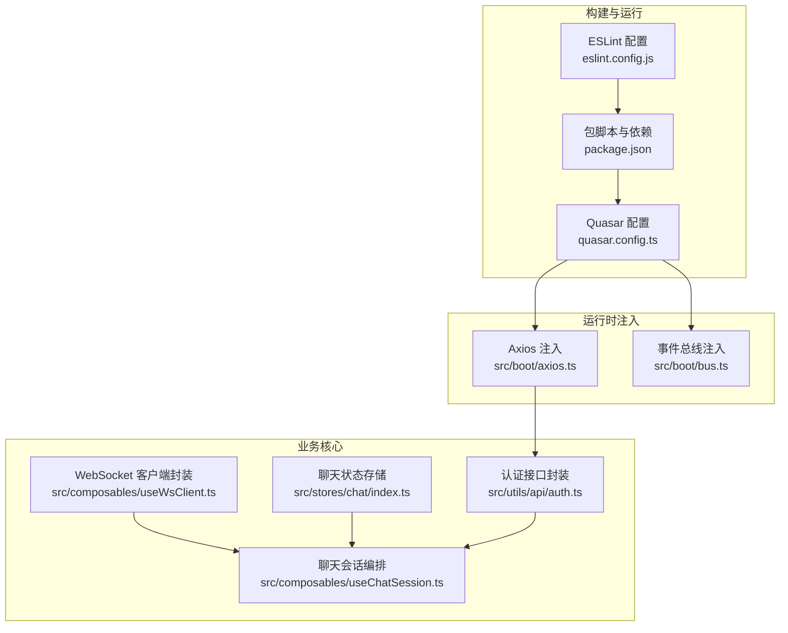
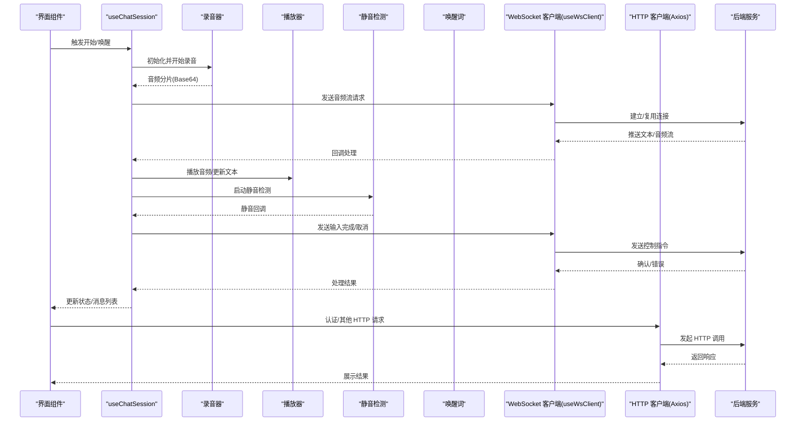
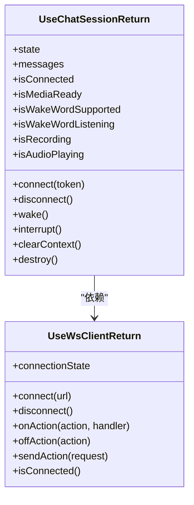
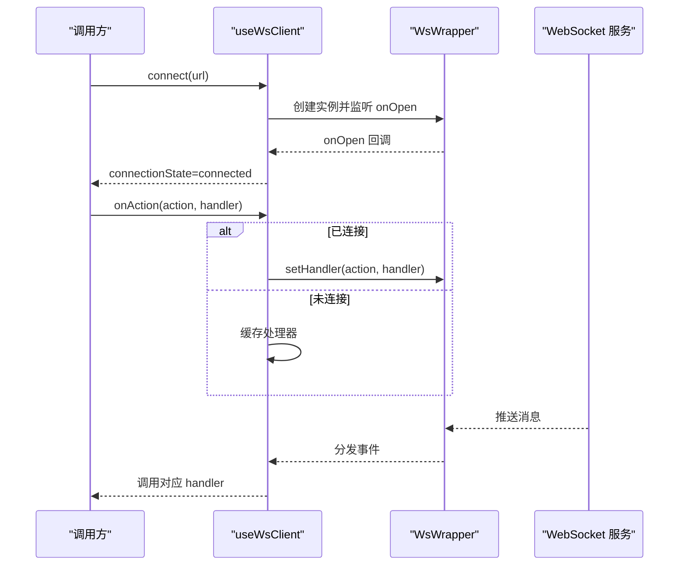
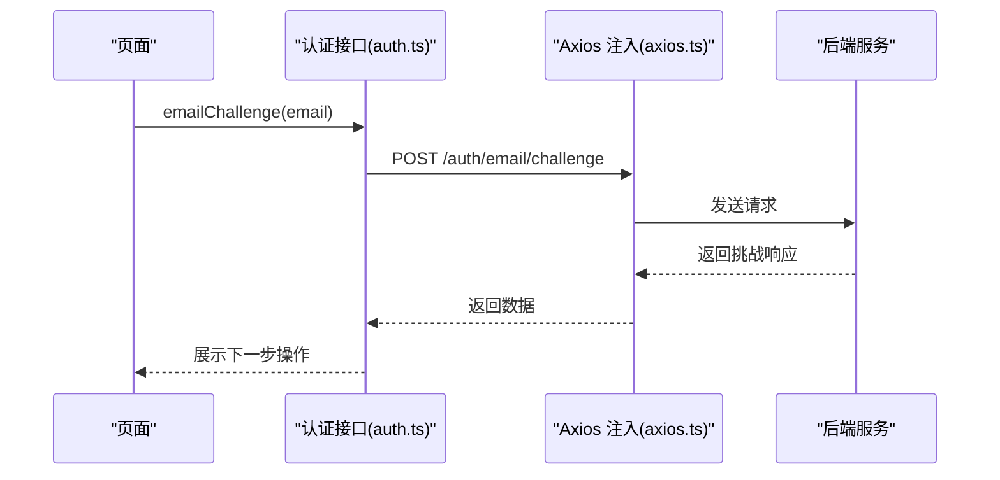
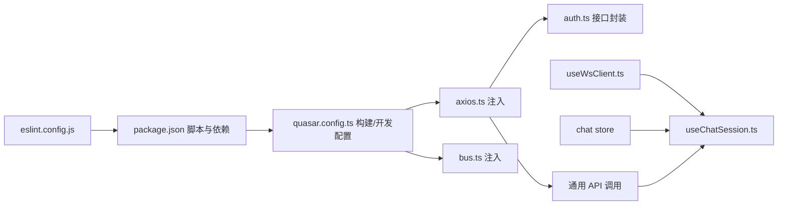

# 测试与调试

<cite>
**本文引用的文件**
- [package.json](file://package.json)
- [quasar.config.ts](file://quasar.config.ts)
- [eslint.config.js](file://eslint.config.js)
- [src/boot/axios.ts](file://src/boot/axios.ts)
- [src/boot/bus.ts](file://src/boot/bus.ts)
- [src/composables/useChatSession.ts](file://src/composables/useChatSession.ts)
- [src/composables/useWsClient.ts](file://src/composables/useWsClient.ts)
- [src/stores/chat/index.ts](file://src/stores/chat/index.ts)
- [src/utils/api/auth.ts](file://src/utils/api/auth.ts)
</cite>

## 目录
1. [简介](#简介)
2. [项目结构](#项目结构)
3. [核心组件](#核心组件)
4. [架构总览](#架构总览)
5. [详细组件分析](#详细组件分析)
6. [依赖分析](#依赖分析)
7. [性能考虑](#性能考虑)
8. [故障排查指南](#故障排查指南)
9. [结论](#结论)
10. [附录](#附录)

## 简介
本指南面向 Le Bot 前端测试与调试体系，围绕单元测试、集成测试与端到端测试的实施策略展开，结合当前仓库中的构建配置、运行时环境与关键业务模块，给出可落地的测试框架配置建议、模拟数据准备、测试环境搭建、调试工具使用（含浏览器开发者工具与Vue DevTools）、性能测试与内存泄漏检测方法、用户体验测试流程、测试覆盖率与代码质量评估、持续测试集成思路，以及错误监控、日志记录与问题追踪机制。同时提供测试最佳实践、自动化测试与回归测试策略，帮助团队在不引入外部测试框架的前提下，也能高效开展质量保障工作。

## 项目结构
本项目基于 Quasar + Vue 3 + Vite 构建，前端采用 Pinia 状态管理，Axios 进行 HTTP 请求封装，WebSocket 客户端通过自定义包装器接入聊天会话。关键测试相关配置点包括：
- 构建与开发服务器：Quasar 配置中定义了开发端口、PWA 模式、环境变量注入与插件链路。
- 质量工具：ESLint 平台规则与类型检查配置，便于在 CI 中统一执行静态检查。
- 运行时环境：通过环境变量注入后端 HTTP 与 WebSocket 基础地址，便于在不同环境切换。

图表来源
- [quasar.config.ts:10-144](file://quasar.config.ts#L10-L144)
- [package.json:9-16](file://package.json#L9-L16)
- [eslint.config.js:1-91](file://eslint.config.js#L1-L91)
- [src/boot/axios.ts:1-27](file://src/boot/axios.ts#L1-L27)
- [src/boot/bus.ts:1-18](file://src/boot/bus.ts#L1-L18)
- [src/composables/useWsClient.ts:1-103](file://src/composables/useWsClient.ts#L1-L103)
- [src/composables/useChatSession.ts:1-589](file://src/composables/useChatSession.ts#L1-L589)
- [src/stores/chat/index.ts:1-17](file://src/stores/chat/index.ts#L1-L17)
- [src/utils/api/auth.ts:1-28](file://src/utils/api/auth.ts#L1-L28)

章节来源
- [quasar.config.ts:10-144](file://quasar.config.ts#L10-L144)
- [package.json:9-16](file://package.json#L9-L16)
- [eslint.config.js:1-91](file://eslint.config.js#L1-L91)

## 核心组件
- Axios 注入与后端地址：通过全局属性注入 Axios 实例，并以环境变量控制 HTTP 基础地址，便于在本地、CI 或生产环境切换。
- 事件总线注入：全局注入类型化 EventBus，便于跨组件通信与测试时对事件进行断言。
- WebSocket 客户端封装：useWsClient 提供连接状态、事件订阅、请求发送与自动重连能力，是集成测试与端到端测试的关键对象。
- 聊天会话编排：useChatSession 将录音、播放、静音检测、唤醒词、超时控制与状态机整合，是端到端测试的主要目标。
- 聊天状态存储：Pinia 存储持久化，便于在多页面场景下保持会话上下文一致性。
- 认证接口封装：集中暴露邮箱挑战、验证码登录、密码登录、重置等接口，适合单元测试与集成测试。

章节来源
- [src/boot/axios.ts:1-27](file://src/boot/axios.ts#L1-L27)
- [src/boot/bus.ts:1-18](file://src/boot/bus.ts#L1-L18)
- [src/composables/useWsClient.ts:1-103](file://src/composables/useWsClient.ts#L1-L103)
- [src/composables/useChatSession.ts:1-589](file://src/composables/useChatSession.ts#L1-L589)
- [src/stores/chat/index.ts:1-17](file://src/stores/chat/index.ts#L1-L17)
- [src/utils/api/auth.ts:1-28](file://src/utils/api/auth.ts#L1-L28)

## 架构总览
下图展示从用户交互到后端服务的端到端路径，以及测试关注点：

图表来源
- [src/composables/useChatSession.ts:379-425](file://src/composables/useChatSession.ts#L379-L425)
- [src/composables/useWsClient.ts:37-55](file://src/composables/useWsClient.ts#L37-L55)
- [src/boot/axios.ts:18-24](file://src/boot/axios.ts#L18-L24)
- [src/utils/api/auth.ts:5-27](file://src/utils/api/auth.ts#L5-L27)

## 详细组件分析

### 组件一：useChatSession（聊天会话编排）
- 关键职责
  - 管理三态状态机：空闲、等待响应、活跃。
  - 管理 WebSocket 连接与事件路由。
  - 协调录音、播放、静音检测与唤醒词。
  - 会话生命周期管理与资源清理。
- 测试关注点
  - 状态机转换条件与边界（如超时、静音、取消）。
  - WebSocket 事件处理与错误分支。
  - 录音/播放与媒体资源释放。
  - 与 Pinia store 的交互与持久化行为。
- 可视化类图

图表来源
- [src/composables/useChatSession.ts:32-61](file://src/composables/useChatSession.ts#L32-L61)
- [src/composables/useWsClient.ts:8-23](file://src/composables/useWsClient.ts#L8-L23)

章节来源
- [src/composables/useChatSession.ts:74-589](file://src/composables/useChatSession.ts#L74-L589)

### 组件二：useWsClient（WebSocket 客户端封装）
- 关键职责
  - 管理连接状态与自动重连。
  - 提供事件订阅/取消与请求发送。
  - 在未连接时缓存处理器，连接后批量应用。
- 测试关注点
  - 连接建立、断开与重连逻辑。
  - 事件处理器注册/移除与调用时机。
  - 请求发送失败的兜底与日志。
- 序列图（连接与事件处理）

图表来源
- [src/composables/useWsClient.ts:37-79](file://src/composables/useWsClient.ts#L37-L79)

章节来源
- [src/composables/useWsClient.ts:29-103](file://src/composables/useWsClient.ts#L29-L103)

### 组件三：Axios 注入与认证接口
- 关键职责
  - 全局注入 Axios 实例与 API 命名空间。
  - 通过环境变量控制基础 URL，支持本地/生产切换。
  - 提供认证相关接口封装。
- 测试关注点
  - 环境变量注入是否生效。
  - 请求头携带与鉴权字段。
  - 错误响应与异常分支。
- 序列图（认证流程）

图表来源
- [src/utils/api/auth.ts:5-11](file://src/utils/api/auth.ts#L5-L11)
- [src/boot/axios.ts:18-24](file://src/boot/axios.ts#L18-L24)

章节来源
- [src/boot/axios.ts:1-27](file://src/boot/axios.ts#L1-L27)
- [src/utils/api/auth.ts:1-28](file://src/utils/api/auth.ts#L1-L28)

### 组件四：事件总线注入（bus）
- 关键职责
  - 类型化 EventBus 注入全局，便于跨组件通信。
- 测试关注点
  - 事件发布/订阅的类型安全与调用次数。
  - 生命周期内资源释放与内存泄漏风险。

章节来源
- [src/boot/bus.ts:1-18](file://src/boot/bus.ts#L1-L18)

## 依赖分析
- 构建与开发
  - Quasar 配置中定义了开发服务器端口、PWA 模式、环境变量注入与插件链（含 ESLint 检查），便于在本地与 CI 中统一校验。
  - 包脚本提供 lint/format/test 等命令，当前 test 脚本为空，建议扩展为测试入口。
- 运行时依赖
  - Axios 用于 HTTP 请求；Pinia 用于状态管理；Quasar 提供 UI 与通知能力；Vue Router 提供路由能力。
- 测试耦合点
  - useChatSession 依赖 useWsClient 与多个子组合式函数；Axios 注入影响认证与通用 API 调用；Pinia store 的持久化会影响会话状态的跨页一致性。

图表来源
- [package.json:9-16](file://package.json#L9-L16)
- [quasar.config.ts:10-144](file://quasar.config.ts#L10-L144)
- [eslint.config.js:1-91](file://eslint.config.js#L1-L91)
- [src/boot/axios.ts:1-27](file://src/boot/axios.ts#L1-L27)
- [src/boot/bus.ts:1-18](file://src/boot/bus.ts#L1-L18)
- [src/composables/useWsClient.ts:1-103](file://src/composables/useWsClient.ts#L1-L103)
- [src/composables/useChatSession.ts:1-589](file://src/composables/useChatSession.ts#L1-L589)
- [src/stores/chat/index.ts:1-17](file://src/stores/chat/index.ts#L1-L17)
- [src/utils/api/auth.ts:1-28](file://src/utils/api/auth.ts#L1-L28)

章节来源
- [package.json:9-16](file://package.json#L9-L16)
- [quasar.config.ts:10-144](file://quasar.config.ts#L10-L144)
- [eslint.config.js:1-91](file://eslint.config.js#L1-L91)

## 性能考虑
- 端到端性能
  - 使用浏览器性能面板记录首屏渲染、交互延迟与帧率波动；结合网络面板观察 WebSocket 重连与音频流传输耗时。
- 内存泄漏检测
  - 在聊天会话销毁路径中，确保撤销所有音频 URL、停止录音与播放、关闭 WebSocket、清理定时器与事件监听。
  - 对比内存快照，确认组件卸载后无残留闭包与全局事件。
- 用户体验测试
  - 验证唤醒词触发、静音检测灵敏度、语音打断、长时间会话稳定性与超时处理。
  - 在弱网环境下验证自动重连与消息去重/合并策略。

## 故障排查指南
- 日志与错误监控
  - 在 useChatSession 与 useWsClient 中的关键节点输出结构化日志，便于定位状态机异常与连接问题。
  - 对网络异常、WebSocket 断开与播放/录音失败进行捕获与上报。
- 调试工具
  - 浏览器开发者工具：Console 查看日志；Network 观察请求/响应与 WebSocket 事件；Performance/Memory 分析性能与内存。
  - Vue DevTools：检查组件状态、Pinia store、事件总线与生命周期钩子。
- 常见问题
  - 无法连接：检查环境变量注入的后端地址与代理设置。
  - 无声音/卡顿：检查录音权限、音频解码与播放缓冲。
  - 会话中断：核对静音检测阈值、超时时间与取消逻辑。

章节来源
- [src/composables/useChatSession.ts:100-238](file://src/composables/useChatSession.ts#L100-L238)
- [src/composables/useWsClient.ts:37-55](file://src/composables/useWsClient.ts#L37-L55)

## 结论
本指南基于现有仓库结构与关键模块，给出了覆盖单元、集成与端到端的测试策略与调试方法。建议优先完善测试脚本与断言，结合浏览器与 Vue DevTools 进行可视化调试，并在 CI 中集成 ESLint 与构建检查，逐步引入覆盖率与性能回归指标，形成可持续的质量保障闭环。

## 附录

### 测试实施策略
- 单元测试
  - 针对 useWsClient 的连接/断开、事件处理与请求发送进行隔离测试；对 useChatSession 的状态机转换与超时逻辑进行边界测试。
  - 使用 Mock 替换 WebSocket 与录音/播放实现，确保测试稳定与可重复。
- 集成测试
  - 以本地后端或模拟服务为依赖，验证 Axios 注入、认证接口与聊天会话编排的协同。
  - 关注 Pinia store 的持久化与跨页面一致性。
- 端到端测试
  - 在真实浏览器中启动应用，模拟用户交互（唤醒、说话、打断、退出），观测状态机与 UI 更新。
  - 验证网络异常下的自动重连与消息恢复。

### 测试环境搭建
- 开发环境
  - 通过 Quasar 开发服务器启动应用，默认端口已在配置中定义。
  - 利用环境变量注入后端地址，便于切换本地/远程服务。
- CI 环境
  - 在流水线中执行 ESLint 与构建检查；若新增测试脚本，可在 CI 中运行测试并生成报告。

章节来源
- [quasar.config.ts:140-144](file://quasar.config.ts#L140-L144)
- [package.json:9-16](file://package.json#L9-L16)