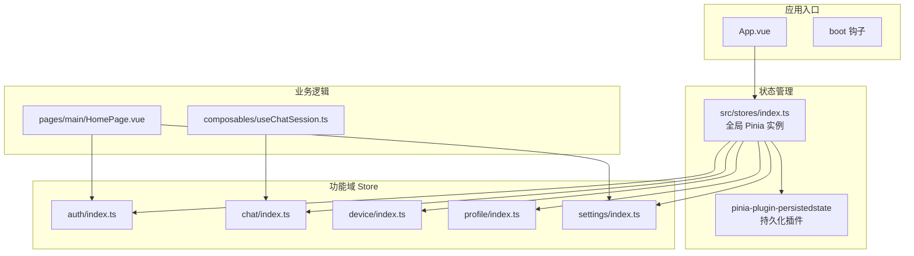
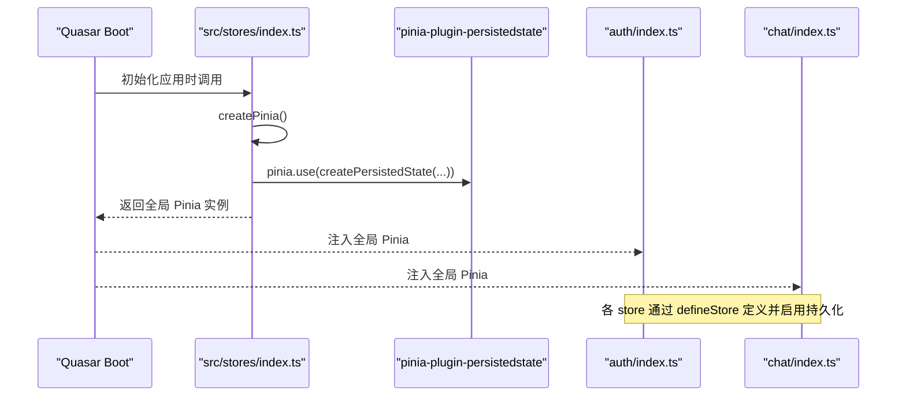
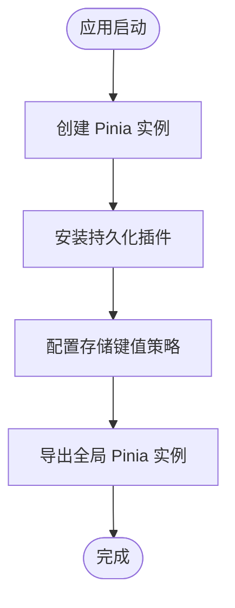
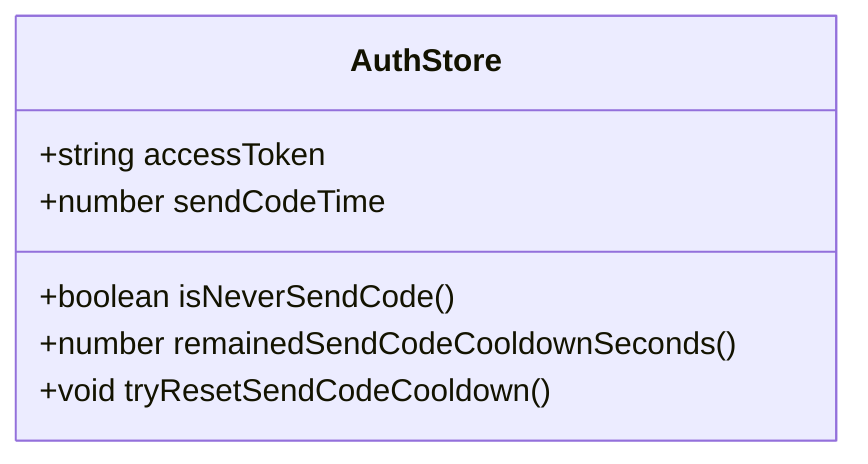
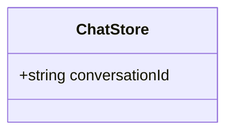
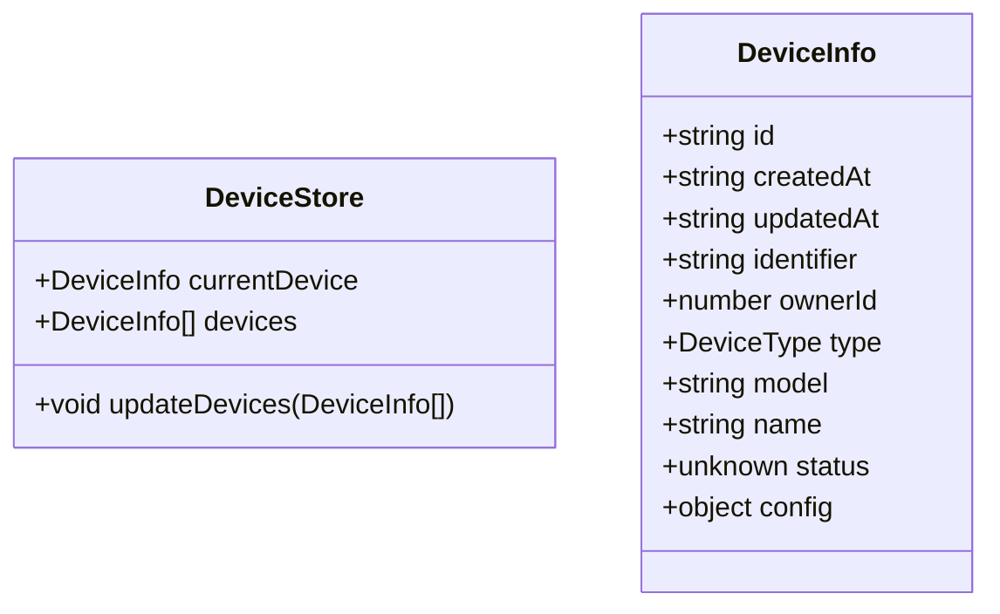
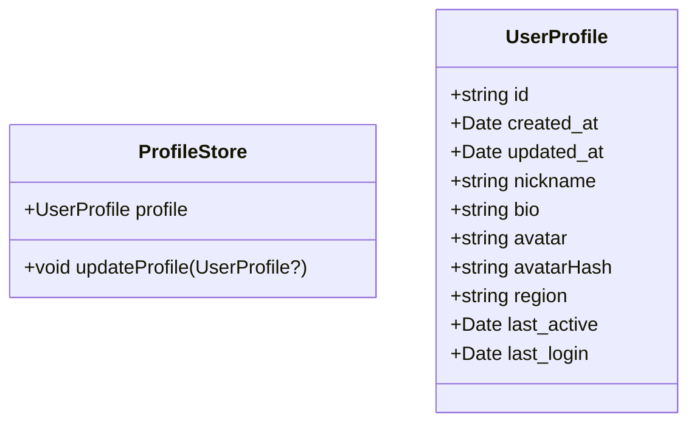
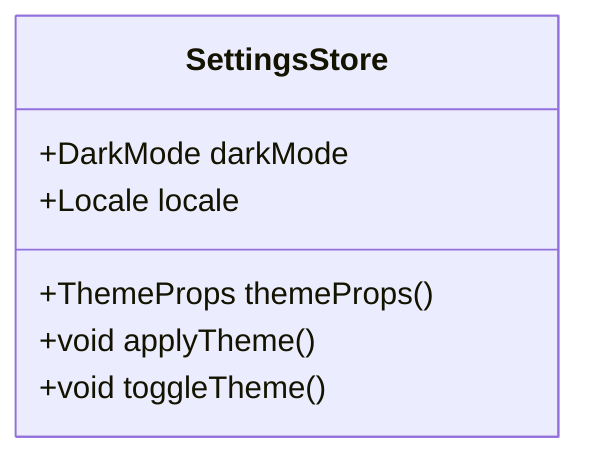
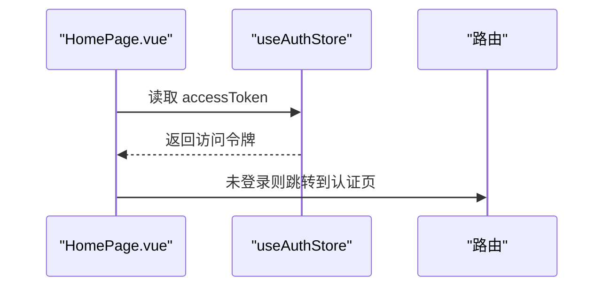
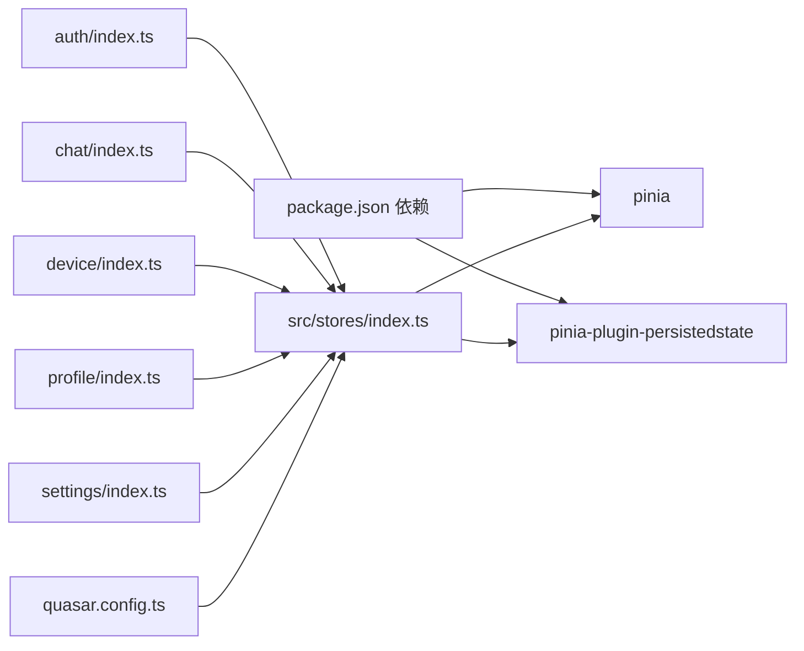

# Pinia Store 架构设计

<cite>
**本文档引用的文件**
- [src/stores/index.ts](file://src/stores/index.ts)
- [src/stores/auth/index.ts](file://src/stores/auth/index.ts)
- [src/stores/chat/index.ts](file://src/stores/chat/index.ts)
- [src/stores/device/index.ts](file://src/stores/device/index.ts)
- [src/stores/profile/index.ts](file://src/stores/profile/index.ts)
- [src/stores/settings/index.ts](file://src/stores/settings/index.ts)
- [src/stores/auth/constants.ts](file://src/stores/auth/constants.ts)
- [src/stores/device/types.ts](file://src/stores/device/types.ts)
- [src/stores/profile/types.ts](file://src/stores/profile/types.ts)
- [src/composables/useChatSession.ts](file://src/composables/useChatSession.ts)
- [src/pages/main/HomePage.vue](file://src/pages/main/HomePage.vue)
- [src/App.vue](file://src/App.vue)
- [quasar.config.ts](file://quasar.config.ts)
- [package.json](file://package.json)
</cite>

## 目录
1. [简介](#简介)
2. [项目结构](#项目结构)
3. [核心组件](#核心组件)
4. [架构总览](#架构总览)
5. [详细组件分析](#详细组件分析)
6. [依赖关系分析](#依赖关系分析)
7. [性能考量](#性能考量)
8. [故障排除指南](#故障排除指南)
9. [结论](#结论)

## 简介
本文件系统性梳理 Le Bot 前端项目中基于 Pinia 的状态管理架构，重点覆盖以下方面：
- 全局 Pinia 实例的创建、注册与初始化流程
- 持久化插件的配置与使用策略
- 与 Quasar 框架的集成方式及全局 store 管理机制
- 状态持久化的键值策略、存储介质选择与数据恢复机制
- 插件系统的扩展能力、类型安全配置与性能优化建议
- 架构决策的技术背景与最佳实践指导

## 项目结构
Le Bot 前端采用模块化的 store 组织方式，按功能域划分（认证、聊天、设备、个人资料、设置），并在根目录集中导出全局 Pinia 实例。

**图表来源**
- [src/stores/index.ts:1-36](file://src/stores/index.ts#L1-L36)
- [src/stores/auth/index.ts:1-35](file://src/stores/auth/index.ts#L1-L35)
- [src/stores/chat/index.ts:1-17](file://src/stores/chat/index.ts#L1-L17)
- [src/stores/device/index.ts:1-27](file://src/stores/device/index.ts#L1-L27)
- [src/stores/profile/index.ts:1-25](file://src/stores/profile/index.ts#L1-L25)
- [src/stores/settings/index.ts:1-57](file://src/stores/settings/index.ts#L1-L57)
- [src/composables/useChatSession.ts:1-589](file://src/composables/useChatSession.ts#L1-L589)
- [src/pages/main/HomePage.vue:1-54](file://src/pages/main/HomePage.vue#L1-L54)

**章节来源**
- [src/stores/index.ts:1-36](file://src/stores/index.ts#L1-L36)
- [quasar.config.ts:172-178](file://quasar.config.ts#L172-L178)

## 核心组件
- 全局 Pinia 实例：在根目录集中创建并注入持久化插件，统一管理各功能域 store。
- 功能域 store：每个领域独立定义，通过选项式配置启用持久化。
- 类型安全：通过模块声明扩展 PiniaCustomProperties，确保自定义属性具备类型支持。
- Quasar 集成：通过 boot 文件加载与全局 store 协同工作。

**章节来源**
- [src/stores/index.ts:10-35](file://src/stores/index.ts#L10-L35)
- [quasar.config.ts:18-18](file://quasar.config.ts#L18-L18)

## 架构总览
Pinia 在 Le Bot 中采用“根实例 + 功能域 store”的分层架构。根实例负责插件装配与全局配置；功能域 store 负责各自领域的状态与行为；业务逻辑通过组合式函数或页面组件消费 store。

**图表来源**
- [src/stores/index.ts:26-35](file://src/stores/index.ts#L26-L35)
- [src/stores/auth/index.ts:31-34](file://src/stores/auth/index.ts#L31-L34)
- [src/stores/chat/index.ts:13-16](file://src/stores/chat/index.ts#L13-L16)

**章节来源**
- [src/stores/index.ts:26-35](file://src/stores/index.ts#L26-L35)

## 详细组件分析

### 全局 Pinia 实例与持久化插件
- 创建与注册：在根实例文件中创建 Pinia 实例并通过 use 方法安装持久化插件。
- 插件配置：启用自动持久化，自定义存储键值前缀，确保跨标签页隔离与版本兼容。
- 类型扩展：通过模块声明扩展 PiniaCustomProperties，为后续自定义属性提供类型安全。

**图表来源**
- [src/stores/index.ts:26-35](file://src/stores/index.ts#L26-L35)

**章节来源**
- [src/stores/index.ts:26-35](file://src/stores/index.ts#L26-L35)

### 认证 Store（useAuthStore）
- 状态模型：包含访问令牌与验证码发送冷却时间等状态。
- 行为方法：计算属性用于判断是否首次发送与剩余冷却秒数；提供重置冷却时间的方法。
- 持久化策略：通过选项启用持久化，确保用户登录态在刷新后得以保留。

**图表来源**
- [src/stores/auth/index.ts:6-34](file://src/stores/auth/index.ts#L6-L34)

**章节来源**
- [src/stores/auth/index.ts:6-34](file://src/stores/auth/index.ts#L6-L34)
- [src/stores/auth/constants.ts:1-2](file://src/stores/auth/constants.ts#L1-L2)

### 聊天 Store（useChatStore）
- 状态模型：维护当前会话标识，作为聊天上下文的关键索引。
- 持久化策略：启用持久化，便于跨页面或刷新后继续同一会话。

**图表来源**
- [src/stores/chat/index.ts:4-16](file://src/stores/chat/index.ts#L4-L16)

**章节来源**
- [src/stores/chat/index.ts:4-16](file://src/stores/chat/index.ts#L4-L16)

### 设备 Store（useDeviceStore）
- 状态模型：包含当前设备与设备列表；提供更新设备列表并同步当前设备的方法。
- 类型约束：使用设备信息接口，确保数据结构一致。
- 持久化策略：启用持久化，保存用户设备偏好。

**图表来源**
- [src/stores/device/index.ts:6-26](file://src/stores/device/index.ts#L6-L26)
- [src/stores/device/types.ts:3-16](file://src/stores/device/types.ts#L3-L16)

**章节来源**
- [src/stores/device/index.ts:6-26](file://src/stores/device/index.ts#L6-L26)
- [src/stores/device/types.ts:1-17](file://src/stores/device/types.ts#L1-L17)

### 个人资料 Store（useProfileStore）
- 状态模型：包含用户档案；提供更新档案的方法，支持头像字段的保留策略。
- 持久化策略：启用持久化，保存用户个性化设置。

**图表来源**
- [src/stores/profile/index.ts:6-24](file://src/stores/profile/index.ts#L6-L24)
- [src/stores/profile/types.ts:1-12](file://src/stores/profile/types.ts#L1-L12)

**章节来源**
- [src/stores/profile/index.ts:6-24](file://src/stores/profile/index.ts#L6-L24)
- [src/stores/profile/types.ts:1-12](file://src/stores/profile/types.ts#L1-L12)

### 设置 Store（useSettingsStore）
- 状态模型：包含深色模式、语言等设置；提供主题切换与应用方法。
- 与 Quasar 集成：直接操作 Quasar 的暗色模式配置。
- HMR 支持：启用热模块替换，提升开发体验。
- 持久化策略：启用持久化，保存用户偏好。

**图表来源**
- [src/stores/settings/index.ts:9-52](file://src/stores/settings/index.ts#L9-L52)

**章节来源**
- [src/stores/settings/index.ts:9-52](file://src/stores/settings/index.ts#L9-L52)

### 业务逻辑与 Store 的交互
- 会话编排：聊天会话组合式函数通过 useChatStore 维护会话标识，驱动 WebSocket 交互。
- 页面级消费：首页组件通过 storeToRefs 获取认证状态，进行路由守卫与页面渲染控制。

**图表来源**
- [src/pages/main/HomePage.vue:14-28](file://src/pages/main/HomePage.vue#L14-L28)

**章节来源**
- [src/composables/useChatSession.ts:81-127](file://src/composables/useChatSession.ts#L81-L127)
- [src/pages/main/HomePage.vue:14-28](file://src/pages/main/HomePage.vue#L14-L28)

## 依赖关系分析
- 外部依赖：Pinia 与 pinia-plugin-persistedstate 提供核心状态管理与持久化能力。
- 内部依赖：各功能域 store 依赖根实例提供的全局上下文；业务逻辑通过组合式函数消费 store。
- 集成点：Quasar 通过 boot 文件加载全局 store；PWA 配置与构建参数影响运行环境。

**图表来源**
- [package.json:22-23](file://package.json#L22-L23)
- [src/stores/index.ts:1-3](file://src/stores/index.ts#L1-L3)
- [quasar.config.ts:18-18](file://quasar.config.ts#L18-L18)

**章节来源**
- [package.json:22-23](file://package.json#L22-L23)
- [quasar.config.ts:18-18](file://quasar.config.ts#L18-L18)

## 性能考量
- 持久化粒度：仅对必要状态启用持久化，避免过度序列化导致的 I/O 开销。
- 存储介质：浏览器本地存储容量有限，建议对大对象进行压缩或拆分。
- 键值策略：统一的键值前缀可避免命名冲突，便于版本迁移与清理。
- 类型安全：通过模块声明扩展类型，减少运行时错误与调试成本。
- 插件扩展：利用 Pinia 插件机制实现日志、监控等横切能力，注意插件链路的执行顺序与性能影响。

## 故障排除指南
- 登录态丢失：检查持久化插件配置与键值前缀，确认浏览器本地存储可用且未被清理。
- 状态不一致：核对 store 的响应式更新路径，避免直接修改深层嵌套对象导致的变更检测失效。
- 开发体验：启用 HMR 的 store 在开发环境下可热更新，生产环境需关闭以避免意外状态变化。
- Quasar 集成问题：确认 boot 文件已正确加载全局 store，且在应用初始化阶段完成实例注入。

**章节来源**
- [src/stores/settings/index.ts:54-56](file://src/stores/settings/index.ts#L54-L56)

## 结论
Le Bot 的 Pinia 架构通过“根实例 + 功能域 store”的清晰分层，结合持久化插件与 Quasar 集成，实现了类型安全、可维护且高性能的状态管理方案。建议在后续迭代中持续关注持久化策略的精细化与插件生态的扩展性，以支撑更复杂的业务场景。