# 个人资料状态管理

<cite>
**本文档引用的文件**
- [src/stores/profile/index.ts](file://src/stores/profile/index.ts)
- [src/stores/profile/types.ts](file://src/stores/profile/types.ts)
- [src/types/api/profile.ts](file://src/types/api/profile.ts)
- [src/utils/api/profile.ts](file://src/utils/api/profile.ts)
- [src/utils/account.ts](file://src/utils/account.ts)
- [src/App.vue](file://src/App.vue)
- [src/pages/stack/ProfilePage.vue](file://src/pages/stack/ProfilePage.vue)
- [src/components/me/ProfileCard.vue](file://src/components/me/ProfileCard.vue)
- [src/stores/index.ts](file://src/stores/index.ts)
- [src/boot/axios.ts](file://src/boot/axios.ts)
- [src/stores/auth/index.ts](file://src/stores/auth/index.ts)
- [src/utils/api/auth.ts](file://src/utils/api/auth.ts)
- [src/utils/validation.ts](file://src/utils/validation.ts)
- [src/utils/common.ts](file://src/utils/common.ts)
</cite>

## 目录
1. [简介](#简介)
2. [项目结构](#项目结构)
3. [核心组件](#核心组件)
4. [架构概览](#架构概览)
5. [详细组件分析](#详细组件分析)
6. [依赖关系分析](#依赖关系分析)
7. [性能考虑](#性能考虑)
8. [故障排除指南](#故障排除指南)
9. [结论](#结论)

## 简介

个人资料状态管理模块是前端应用中负责用户个人信息存储、管理和同步的核心组件。该模块实现了完整的用户资料生命周期管理，包括用户基本信息存储、头像上传状态跟踪、资料更新流程控制、缓存策略和数据同步机制。

本模块采用Vue 3 + Pinia的状态管理模式，结合TypeScript实现强类型安全，确保用户数据在应用中的完整性和一致性。通过持久化存储机制，用户资料能够在页面刷新和应用重启后保持不变，提升用户体验。

## 项目结构

个人资料状态管理模块主要由以下层次组成：

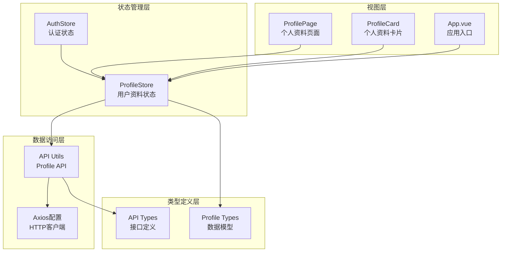

**图表来源**
- [src/stores/profile/index.ts:1-25](file://src/stores/profile/index.ts#L1-L25)
- [src/utils/api/profile.ts:1-28](file://src/utils/api/profile.ts#L1-L28)
- [src/stores/profile/types.ts:1-13](file://src/stores/profile/types.ts#L1-L13)

**章节来源**
- [src/stores/profile/index.ts:1-25](file://src/stores/profile/index.ts#L1-L25)
- [src/stores/profile/types.ts:1-13](file://src/stores/profile/types.ts#L1-L13)
- [src/types/api/profile.ts:1-33](file://src/types/api/profile.ts#L1-L33)

## 核心组件

### 用户资料数据模型

个人资料状态管理的核心是`UserProfile`接口，定义了完整的用户信息结构：

| 字段名 | 类型 | 必填 | 描述 |
|--------|------|------|------|
| id | string | 是 | 用户唯一标识符 |
| created_at | Date | 是 | 账户创建时间 |
| updated_at | Date | 是 | 资料最后更新时间 |
| nickname | string | 否 | 用户昵称 |
| bio | string | 否 | 个人简介 |
| avatar | string | 否 | 头像URL或Base64数据 |
| avatarHash | string | 否 | 头像哈希值 |
| region | string | 否 | 所在地区 |
| last_active | Date | 是 | 最后活跃时间 |
| last_login | Date | 是 | 最后登录时间 |

### 状态存储结构

ProfileStore使用Pinia的响应式ref来管理用户资料状态，支持自动持久化：

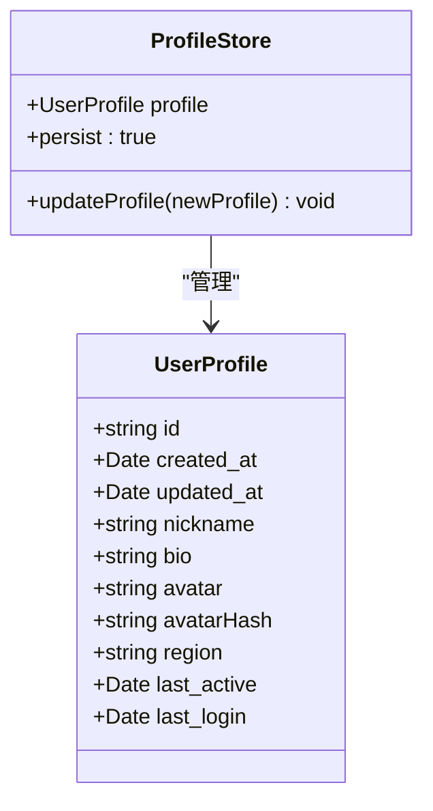

**图表来源**
- [src/stores/profile/index.ts:6-24](file://src/stores/profile/index.ts#L6-L24)
- [src/stores/profile/types.ts:1-13](file://src/stores/profile/types.ts#L1-L13)

**章节来源**
- [src/stores/profile/types.ts:1-13](file://src/stores/profile/types.ts#L1-L13)
- [src/stores/profile/index.ts:1-25](file://src/stores/profile/index.ts#L1-L25)

## 架构概览

个人资料状态管理采用分层架构设计，确保关注点分离和模块化：

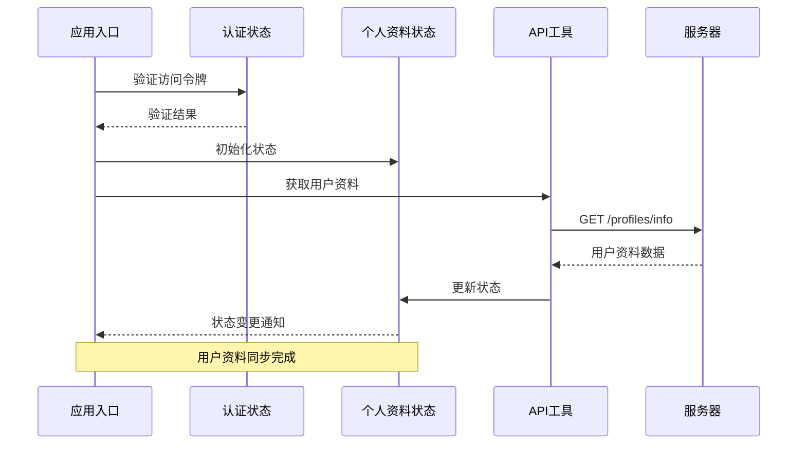

**图表来源**
- [src/App.vue:39-56](file://src/App.vue#L39-L56)
- [src/utils/account.ts:17-40](file://src/utils/account.ts#L17-L40)
- [src/utils/api/profile.ts:15-20](file://src/utils/api/profile.ts#L15-L20)

### 数据流管理

系统实现了双向数据流管理，确保本地状态与服务器状态的一致性：

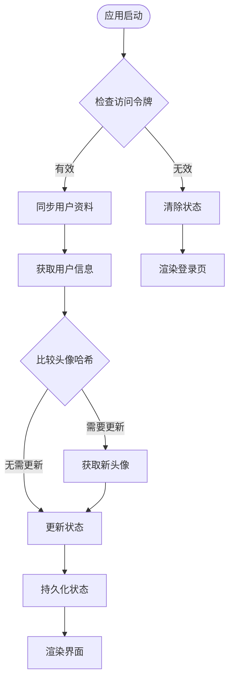

**图表来源**
- [src/App.vue:58-80](file://src/App.vue#L58-L80)
- [src/utils/account.ts:17-40](file://src/utils/account.ts#L17-L40)

**章节来源**
- [src/App.vue:1-84](file://src/App.vue#L1-L84)
- [src/utils/account.ts:1-40](file://src/utils/account.ts#L1-L40)

## 详细组件分析

### ProfileStore 实现分析

ProfileStore是个人资料状态管理的核心，实现了简洁而高效的状态管理逻辑：

#### 状态初始化与更新

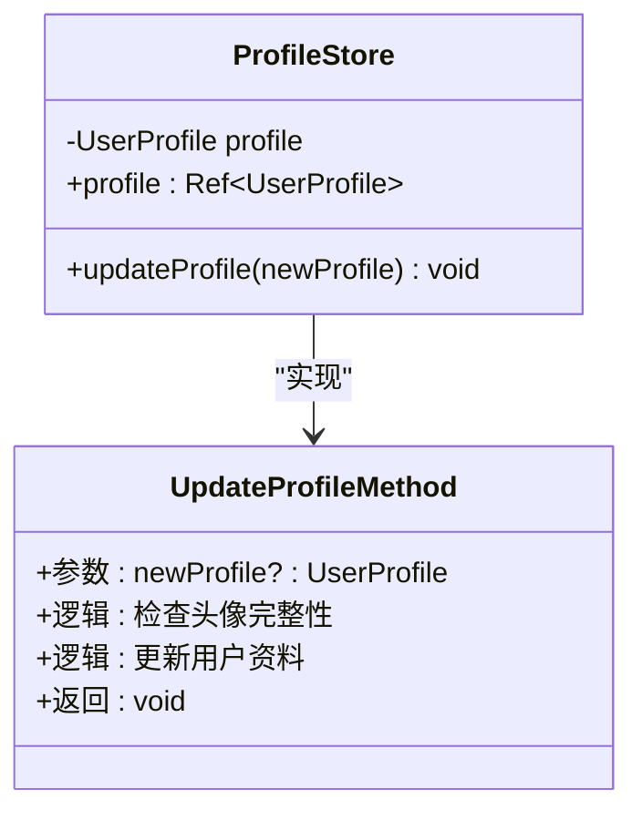

**图表来源**
- [src/stores/profile/index.ts:6-24](file://src/stores/profile/index.ts#L6-L24)

#### 头像状态管理

头像状态管理是ProfileStore的重要特性，通过智能合并策略避免不必要的数据丢失：

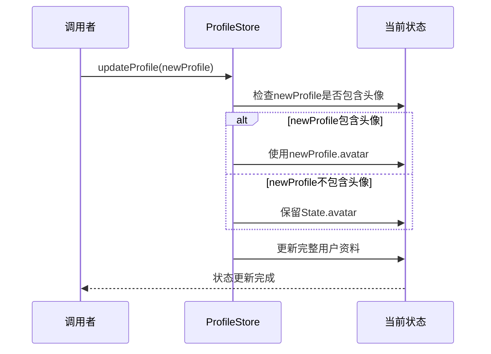

**图表来源**
- [src/stores/profile/index.ts:11-16](file://src/stores/profile/index.ts#L11-L16)

**章节来源**
- [src/stores/profile/index.ts:1-25](file://src/stores/profile/index.ts#L1-L25)

### API 集成模式

个人资料API提供了完整的CRUD操作支持，采用统一的响应格式：

#### API 响应类型设计

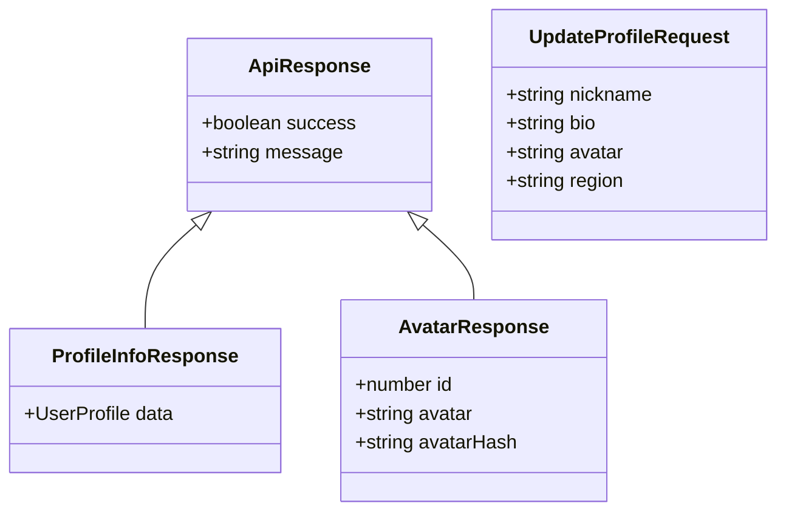

**图表来源**
- [src/types/api/profile.ts:3-32](file://src/types/api/profile.ts#L3-L32)

#### 异步操作处理

API工具模块实现了标准化的异步操作处理，包括错误处理和重试机制：

**章节来源**
- [src/types/api/profile.ts:1-33](file://src/types/api/profile.ts#L1-L33)
- [src/utils/api/profile.ts:1-28](file://src/utils/api/profile.ts#L1-L28)

### 视图组件集成

个人资料状态管理与多个视图组件深度集成，提供一致的用户体验：

#### ProfilePage 页面组件

ProfilePage实现了用户资料的编辑和展示功能：

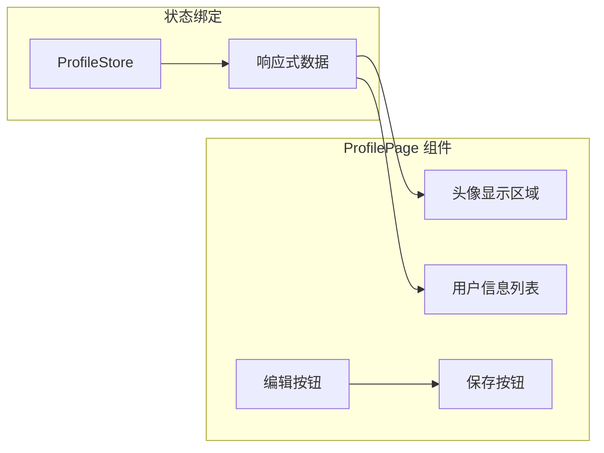

**图表来源**
- [src/pages/stack/ProfilePage.vue:1-134](file://src/pages/stack/ProfilePage.vue#L1-L134)

#### ProfileCard 卡片组件

ProfileCard提供了用户资料的快速预览功能：

**章节来源**
- [src/pages/stack/ProfilePage.vue:1-134](file://src/pages/stack/ProfilePage.vue#L1-L134)
- [src/components/me/ProfileCard.vue:1-48](file://src/components/me/ProfileCard.vue#L1-L48)

### 缓存策略与数据同步

系统实现了智能的缓存策略，通过头像哈希值判断是否需要重新下载头像：

#### 缓存同步机制

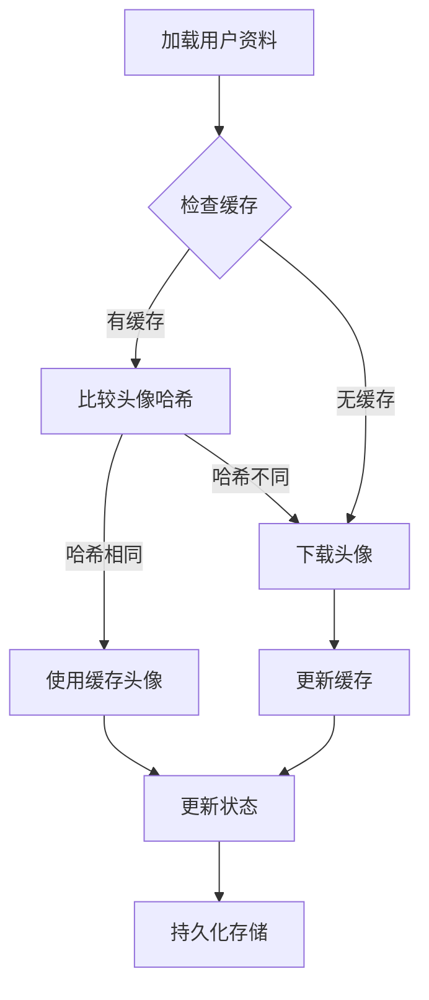

**图表来源**
- [src/App.vue:39-56](file://src/App.vue#L39-L56)
- [src/utils/account.ts:17-40](file://src/utils/account.ts#L17-L40)

**章节来源**
- [src/App.vue:39-56](file://src/App.vue#L39-L56)
- [src/utils/account.ts:17-40](file://src/utils/account.ts#L17-L40)

## 依赖关系分析

个人资料状态管理模块的依赖关系清晰明确，遵循单一职责原则：

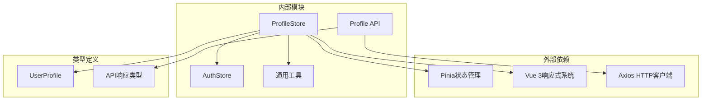

**图表来源**
- [src/stores/profile/index.ts:1-5](file://src/stores/profile/index.ts#L1-L5)
- [src/utils/api/profile.ts:1-6](file://src/utils/api/profile.ts#L1-L6)

### 循环依赖检测

经过分析，个人资料状态管理模块没有发现循环依赖问题：
- ProfileStore只依赖Profile类型定义
- API工具模块独立于状态管理
- 视图组件通过Pinia进行松耦合集成

**章节来源**
- [src/stores/profile/index.ts:1-5](file://src/stores/profile/index.ts#L1-L5)
- [src/utils/api/profile.ts:1-6](file://src/utils/api/profile.ts#L1-L6)

## 性能考虑

### 状态持久化优化

系统采用Pinia持久化插件，通过自定义键名实现精确的状态存储控制：

```mermaid
classDiagram
class PersistedStatePlugin {
+auto : true
+key : Function
+storage : sessionStorage
}
class CustomKeyFunction {
+参数 : storeId
+返回 : "ai-pet-team.le-bot-frontend.{storeId}"
}
PersistedStatePlugin --> CustomKeyFunction : "使用"
```

**图表来源**
- [src/stores/index.ts:28-33](file://src/stores/index.ts#L28-L33)

### 并发请求优化

应用入口组件使用Promise.all并行处理多个异步请求，提升初始化性能：

**章节来源**
- [src/stores/index.ts:28-33](file://src/stores/index.ts#L28-L33)
- [src/App.vue:65-68](file://src/App.vue#L65-L68)

## 故障排除指南

### 常见问题诊断

#### 访问令牌验证失败

当访问令牌验证失败时，系统会执行清理流程：

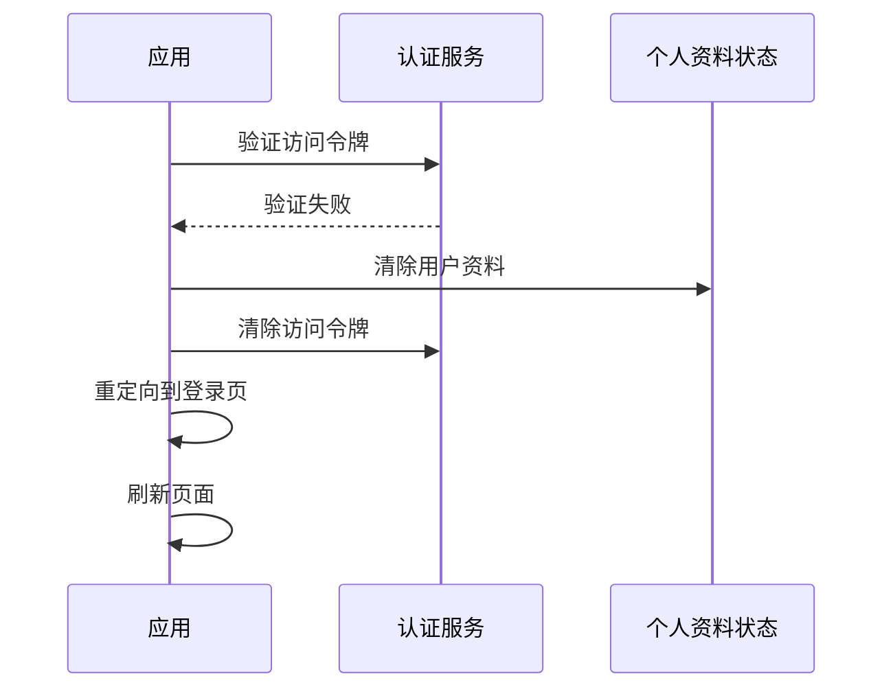

**图表来源**
- [src/App.vue:70-76](file://src/App.vue#L70-L76)

#### 头像更新异常

当头像更新失败时，系统会回退到之前的头像状态：

**章节来源**
- [src/App.vue:52-55](file://src/App.vue#L52-L55)
- [src/utils/account.ts:33-38](file://src/utils/account.ts#L33-L38)

### 错误恢复机制

系统实现了多层次的错误恢复机制：

1. **网络异常处理**: API调用失败时记录错误日志并提示用户
2. **状态回滚**: 更新失败时自动回滚到之前的稳定状态
3. **缓存降级**: 服务器不可用时使用本地缓存数据
4. **重试机制**: 关键操作支持有限次数的自动重试

## 结论

个人资料状态管理模块展现了现代前端应用的最佳实践，通过以下关键特性实现了高质量的用户资料管理：

### 技术优势

- **类型安全**: 完整的TypeScript类型定义确保编译时错误检测
- **状态一致性**: 智能的头像哈希比较机制保证数据同步准确性
- **性能优化**: 并行请求处理和智能缓存策略提升用户体验
- **可维护性**: 清晰的模块划分和依赖关系便于代码维护

### 安全考虑

- **访问令牌管理**: 通过认证状态管理确保API调用的安全性
- **数据加密**: 头像数据传输采用HTTPS协议保护
- **隐私保护**: 用户敏感信息仅在必要时传输和存储

### 扩展性

模块设计充分考虑了未来的功能扩展需求，包括：
- 支持更多用户属性字段
- 集成第三方头像服务
- 实现更复杂的缓存策略
- 添加用户行为追踪功能

该模块为整个应用提供了可靠的基础状态管理能力，是构建复杂前端应用的重要基础设施。