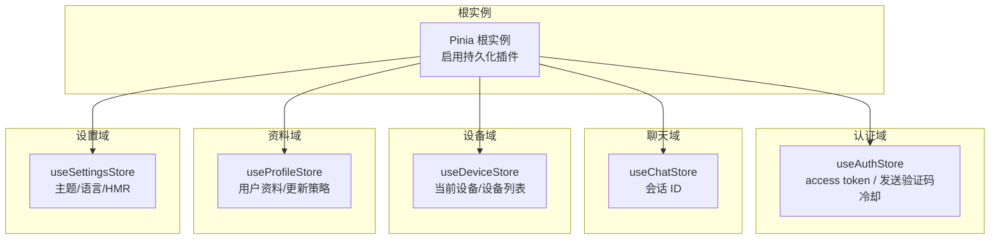
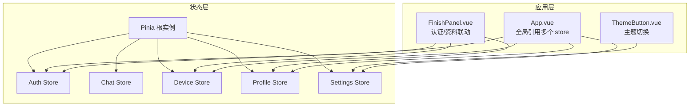
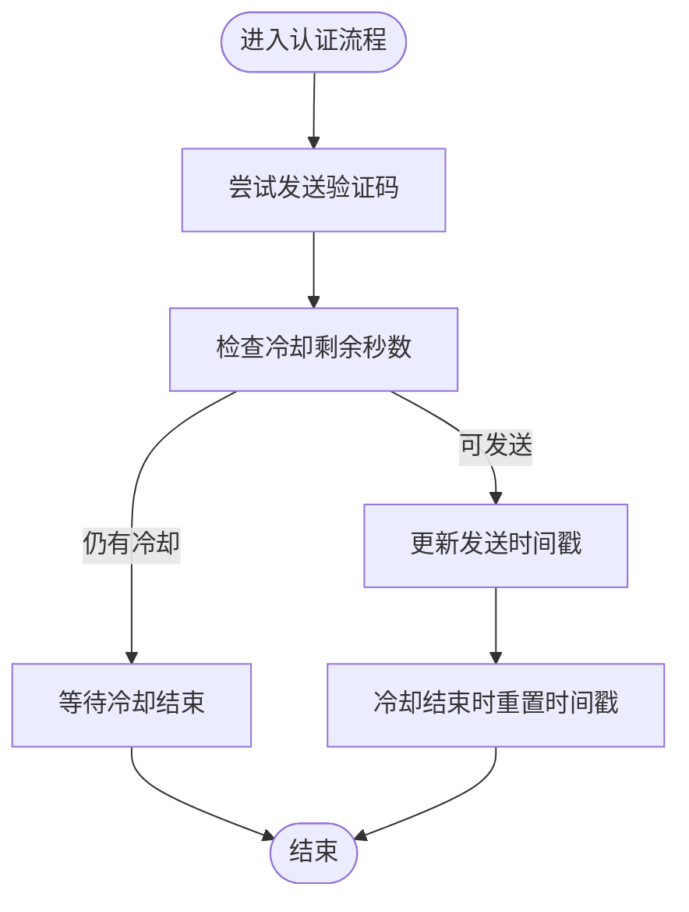
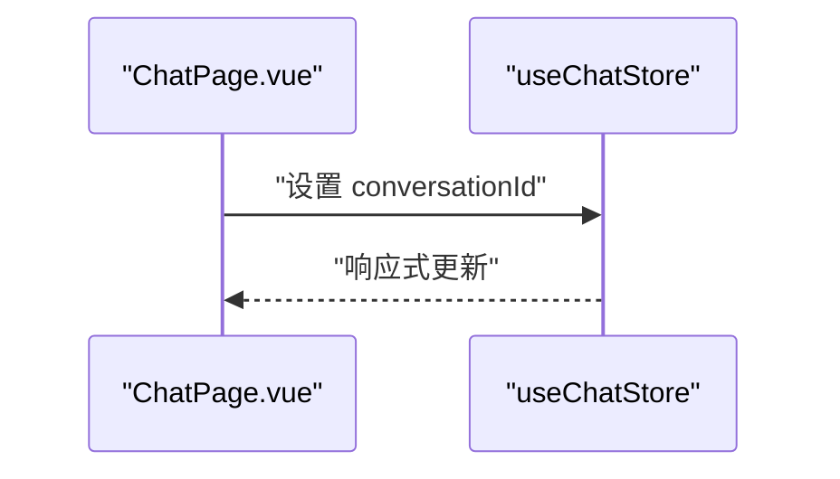
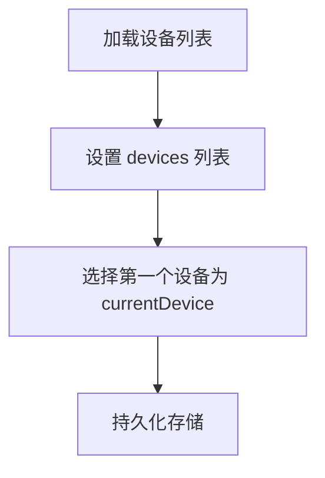
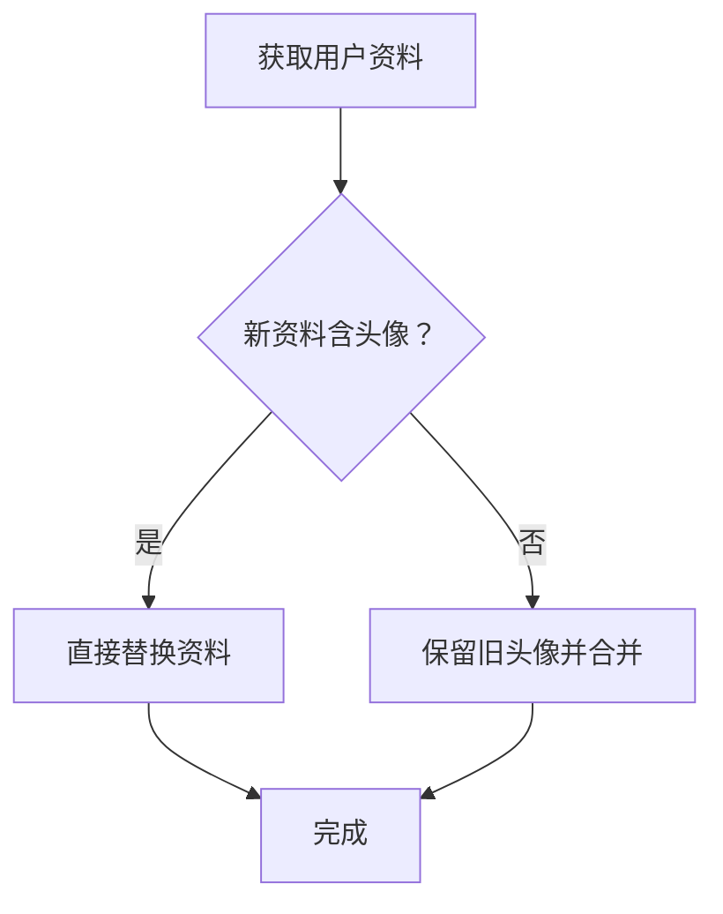
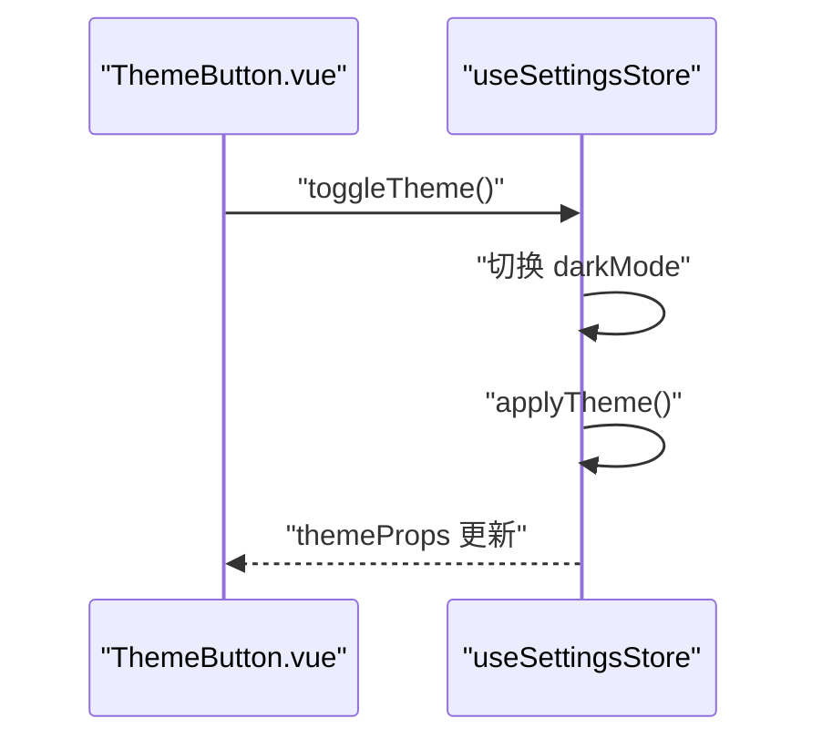
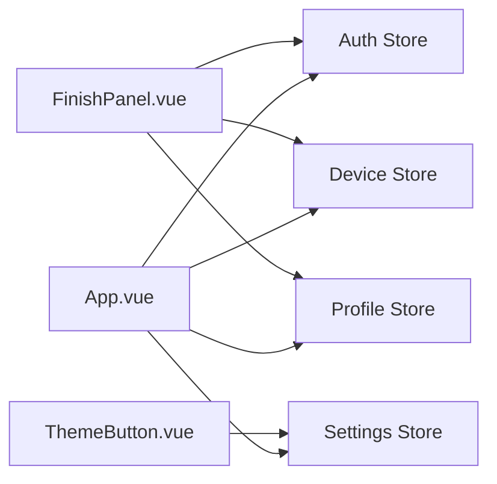

# 状态管理

<cite>
**本文引用的文件**
- [src/stores/index.ts](file://src/stores/index.ts)
- [src/stores/auth/index.ts](file://src/stores/auth/index.ts)
- [src/stores/auth/constants.ts](file://src/stores/auth/constants.ts)
- [src/stores/chat/index.ts](file://src/stores/chat/index.ts)
- [src/stores/device/index.ts](file://src/stores/device/index.ts)
- [src/stores/device/types.ts](file://src/stores/device/types.ts)
- [src/stores/profile/index.ts](file://src/stores/profile/index.ts)
- [src/stores/profile/types.ts](file://src/stores/profile/types.ts)
- [src/stores/settings/index.ts](file://src/stores/settings/index.ts)
- [src/stores/settings/constants.ts](file://src/stores/settings/constants.ts)
- [src/stores/settings/types.ts](file://src/stores/settings/types.ts)
- [src/App.vue](file://src/App.vue)
- [src/components/ThemeButton.vue](file://src/components/ThemeButton.vue)
- [src/components/auth/FinishPanel.vue](file://src/components/auth/FinishPanel.vue)
- [src/pages/stack/ChatPage.vue](file://src/pages/stack/ChatPage.vue)
</cite>

## 目录
1. [引言](#引言)
2. [项目结构](#项目结构)
3. [核心组件](#核心组件)
4. [架构总览](#架构总览)
5. [详细组件分析](#详细组件分析)
6. [依赖分析](#依赖分析)
7. [性能考虑](#性能考虑)
8. [故障排查指南](#故障排查指南)
9. [结论](#结论)
10. [附录](#附录)

## 引言
本文件系统性梳理 Le Bot 前端的状态管理方案，围绕基于 Pinia 的架构进行深入解析。内容涵盖：store 模块职责划分、状态结构设计、数据流转机制、异步处理与副作用、状态持久化策略、跨组件共享模式、更新流程与性能优化、最佳实践与调试方法，以及与 Vue 响应式系统和组合式函数（Composition API）的协同方式。

## 项目结构
本项目采用按功能域划分的 store 组织方式，每个领域一个独立 store，并通过根级 Pinia 实例统一注册与持久化配置。整体结构如下：

图表来源
- [src/stores/index.ts:26-35](file://src/stores/index.ts#L26-L35)
- [src/stores/auth/index.ts:6-34](file://src/stores/auth/index.ts#L6-L34)
- [src/stores/chat/index.ts:4-16](file://src/stores/chat/index.ts#L4-L16)
- [src/stores/device/index.ts:6-26](file://src/stores/device/index.ts#L6-L26)
- [src/stores/profile/index.ts:6-24](file://src/stores/profile/index.ts#L6-L24)
- [src/stores/settings/index.ts:9-52](file://src/stores/settings/index.ts#L9-L52)

章节来源
- [src/stores/index.ts:1-36](file://src/stores/index.ts#L1-L36)
- [src/stores/auth/index.ts:1-35](file://src/stores/auth/index.ts#L1-L35)
- [src/stores/chat/index.ts:1-17](file://src/stores/chat/index.ts#L1-L17)
- [src/stores/device/index.ts:1-27](file://src/stores/device/index.ts#L1-L27)
- [src/stores/profile/index.ts:1-25](file://src/stores/profile/index.ts#L1-L25)
- [src/stores/settings/index.ts:1-57](file://src/stores/settings/index.ts#L1-L57)

## 核心组件
- Pinia 根实例与持久化插件
  - 在根实例中启用持久化插件，自动持久化所有标记为 persist: true 的 store；自定义存储键前缀以避免命名冲突。
  - 参考路径：[src/stores/index.ts:26-35](file://src/stores/index.ts#L26-L35)
- 认证域（Auth）
  - 管理访问令牌与发送验证码的冷却时间；提供冷却剩余秒数与重置逻辑；持久化开关开启。
  - 参考路径：[src/stores/auth/index.ts:6-34](file://src/stores/auth/index.ts#L6-L34)，[src/stores/auth/constants.ts:1-2](file://src/stores/auth/constants.ts#L1-L2)
- 聊天域（Chat）
  - 维护当前会话 ID；持久化开关开启。
  - 参考路径：[src/stores/chat/index.ts:4-16](file://src/stores/chat/index.ts#L4-L16)
- 设备域（Device）
  - 维护设备列表与当前设备；提供批量更新设备列表并同步当前设备的方法；持久化开关开启。
  - 参考路径：[src/stores/device/index.ts:6-26](file://src/stores/device/index.ts#L6-L26)，[src/stores/device/types.ts:1-17](file://src/stores/device/types.ts#L1-L17)
- 资料域（Profile）
  - 维护用户资料；提供更新方法，支持保留已有头像等字段；持久化开关开启。
  - 参考路径：[src/stores/profile/index.ts:6-24](file://src/stores/profile/index.ts#L6-L24)，[src/stores/profile/types.ts:1-13](file://src/stores/profile/types.ts#L1-L13)
- 设置域（Settings）
  - 维护主题模式（浅色/深色/自动）与语言；提供切换主题与应用主题的方法；语言读写绑定到全局 i18n；开启持久化与 HMR 支持。
  - 参考路径：[src/stores/settings/index.ts:9-52](file://src/stores/settings/index.ts#L9-L52)，[src/stores/settings/constants.ts:1-4](file://src/stores/settings/constants.ts#L1-L4)，[src/stores/settings/types.ts:1-4](file://src/stores/settings/types.ts#L1-L4)

章节来源
- [src/stores/index.ts:26-35](file://src/stores/index.ts#L26-L35)
- [src/stores/auth/index.ts:6-34](file://src/stores/auth/index.ts#L6-L34)
- [src/stores/chat/index.ts:4-16](file://src/stores/chat/index.ts#L4-L16)
- [src/stores/device/index.ts:6-26](file://src/stores/device/index.ts#L6-L26)
- [src/stores/profile/index.ts:6-24](file://src/stores/profile/index.ts#L6-L24)
- [src/stores/settings/index.ts:9-52](file://src/stores/settings/index.ts#L9-L52)

## 架构总览
Pinia 作为单一事实来源，各业务域 store 通过组合式 API 定义状态与行为。组件通过组合式函数调用 store，实现跨组件状态共享与响应式更新。持久化插件确保关键状态在页面刷新后得以恢复。

图表来源
- [src/App.vue:7-17](file://src/App.vue#L7-L17)
- [src/components/ThemeButton.vue:4-7](file://src/components/ThemeButton.vue#L4-L7)
- [src/components/auth/FinishPanel.vue:9-27](file://src/components/auth/FinishPanel.vue#L9-L27)
- [src/stores/index.ts:26-35](file://src/stores/index.ts#L26-L35)

## 详细组件分析

### 认证域（Auth）分析
- 状态结构
  - 访问令牌：用于鉴权标识。
  - 上次发送验证码时间：用于计算冷却剩余秒数。
- 行为与副作用
  - 冷却剩余秒数由当前时间与上次发送时间差推导，提供只读计算属性。
  - 提供冷却重置方法，当冷却结束时将时间戳归零。
- 数据流
  - 组件读取访问令牌与冷却信息；在发送验证码成功后更新时间戳；冷却结束时触发重置。
- 性能与持久化
  - 仅保存必要字段，避免冗余；冷却计算为纯函数式，无额外开销。
- 使用示例（路径）
  - [src/App.vue:12-13](file://src/App.vue#L12-L13)
  - [src/components/auth/FinishPanel.vue:25](file://src/components/auth/FinishPanel.vue#L25)

图表来源
- [src/stores/auth/index.ts:13-22](file://src/stores/auth/index.ts#L13-L22)
- [src/stores/auth/constants.ts:1](file://src/stores/auth/constants.ts#L1)

章节来源
- [src/stores/auth/index.ts:6-34](file://src/stores/auth/index.ts#L6-L34)
- [src/stores/auth/constants.ts:1-2](file://src/stores/auth/constants.ts#L1-L2)
- [src/App.vue:12-13](file://src/App.vue#L12-L13)
- [src/components/auth/FinishPanel.vue:25](file://src/components/auth/FinishPanel.vue#L25)

### 聊天域（Chat）分析
- 状态结构
  - 当前会话 ID：标识当前对话上下文。
- 行为与副作用
  - 通过外部事件或路由变化更新会话 ID；持久化确保刷新后仍保持当前会话。
- 数据流
  - 页面组件读取会话 ID 并据此加载消息列表；更新时写入 store。
- 使用示例（路径）
  - [src/pages/stack/ChatPage.vue:12](file://src/pages/stack/ChatPage.vue#L12)

图表来源
- [src/pages/stack/ChatPage.vue:12](file://src/pages/stack/ChatPage.vue#L12)
- [src/stores/chat/index.ts:7-11](file://src/stores/chat/index.ts#L7-L11)

章节来源
- [src/stores/chat/index.ts:4-16](file://src/stores/chat/index.ts#L4-L16)
- [src/pages/stack/ChatPage.vue:12](file://src/pages/stack/ChatPage.vue#L12)

### 设备域（Device）分析
- 状态结构
  - 设备列表：维护用户拥有的设备集合。
  - 当前设备：指向列表中的默认或选中设备。
- 行为与副作用
  - 批量更新设备列表时，同时选择第一个设备作为当前设备，保证一致性。
- 数据流
  - 初始化或登录后拉取设备列表；组件根据当前设备渲染设备卡片；切换设备时更新当前设备。
- 类型约束
  - 设备信息接口包含标识、类型、模型、名称、配置等字段。
- 使用示例（路径）
  - [src/App.vue:14](file://src/App.vue#L14)
  - [src/components/auth/FinishPanel.vue:26](file://src/components/auth/FinishPanel.vue#L26)

图表来源
- [src/stores/device/index.ts:12-15](file://src/stores/device/index.ts#L12-L15)
- [src/stores/device/types.ts:3-16](file://src/stores/device/types.ts#L3-L16)

章节来源
- [src/stores/device/index.ts:6-26](file://src/stores/device/index.ts#L6-L26)
- [src/stores/device/types.ts:1-17](file://src/stores/device/types.ts#L1-L17)
- [src/App.vue:14](file://src/App.vue#L14)
- [src/components/auth/FinishPanel.vue:26](file://src/components/auth/FinishPanel.vue#L26)

### 资料域（Profile）分析
- 状态结构
  - 用户资料对象：包含基础信息、头像、地区等。
- 行为与副作用
  - 更新资料时，若新资料未提供头像则保留旧头像，避免不必要的覆盖。
- 数据流
  - 登录后拉取资料；设置页编辑资料；提交后更新 store；头像变更通过外部上传流程完成。
- 使用示例（路径）
  - [src/App.vue:15-16](file://src/App.vue#L15-L16)
  - [src/components/auth/FinishPanel.vue:27](file://src/components/auth/FinishPanel.vue#L27)

图表来源
- [src/stores/profile/index.ts:11-16](file://src/stores/profile/index.ts#L11-L16)

章节来源
- [src/stores/profile/index.ts:6-24](file://src/stores/profile/index.ts#L6-L24)
- [src/stores/profile/types.ts:1-13](file://src/stores/profile/types.ts#L1-L13)
- [src/App.vue:15-16](file://src/App.vue#L15-L16)
- [src/components/auth/FinishPanel.vue:27](file://src/components/auth/FinishPanel.vue#L27)

### 设置域（Settings）分析
- 状态结构
  - 主题模式：浅色、深色、自动。
  - 语言：通过全局 i18n 的读写器绑定。
- 行为与副作用
  - 主题切换时应用到 Quasar Dark 模式；提供主题属性计算值用于 UI 渲染。
  - 语言设置通过 setter 写入 i18n 全局实例。
  - 开启 HMR 支持以便开发时热更新。
- 数据流
  - 组件读取主题与语言；用户操作触发切换；状态持久化保存用户偏好。
- 使用示例（路径）
  - [src/components/ThemeButton.vue:6-7](file://src/components/ThemeButton.vue#L6-L7)
  - [src/App.vue:17](file://src/App.vue#L17)

图表来源
- [src/stores/settings/index.ts:35-39](file://src/stores/settings/index.ts#L35-L39)
- [src/stores/settings/index.ts:31-33](file://src/stores/settings/index.ts#L31-L33)
- [src/components/ThemeButton.vue:6-7](file://src/components/ThemeButton.vue#L6-L7)

章节来源
- [src/stores/settings/index.ts:9-52](file://src/stores/settings/index.ts#L9-L52)
- [src/stores/settings/constants.ts:1-4](file://src/stores/settings/constants.ts#L1-L4)
- [src/stores/settings/types.ts:1-4](file://src/stores/settings/types.ts#L1-L4)
- [src/components/ThemeButton.vue:4-7](file://src/components/ThemeButton.vue#L4-L7)
- [src/App.vue:17](file://src/App.vue#L17)

## 依赖分析
- 模块耦合
  - 各 store 之间低耦合，通过组件协调跨域协作（如认证成功后初始化设备与资料）。
- 外部依赖
  - 持久化：pinia-plugin-persistedstate。
  - 主题：Quasar Dark 模式。
  - 国际化：全局 i18n 实例。
- 关键依赖链
  - App.vue 作为入口，集中引入并驱动多个 store 的读写。
  - ThemeButton.vue 与 Settings 交互，体现主题域对 UI 的直接影响。

图表来源
- [src/App.vue:7-17](file://src/App.vue#L7-L17)
- [src/components/ThemeButton.vue:4-7](file://src/components/ThemeButton.vue#L4-L7)
- [src/components/auth/FinishPanel.vue:9-27](file://src/components/auth/FinishPanel.vue#L9-L27)

章节来源
- [src/App.vue:7-17](file://src/App.vue#L7-L17)
- [src/components/ThemeButton.vue:4-7](file://src/components/ThemeButton.vue#L4-L7)
- [src/components/auth/FinishPanel.vue:9-27](file://src/components/auth/FinishPanel.vue#L9-L27)

## 性能考虑
- 响应式粒度
  - 将可独立变化的状态拆分为细粒度 ref/computed，减少不必要渲染。
- 计算属性优先
  - 冷却剩余秒数、主题属性等派生状态使用 computed，避免重复计算。
- 持久化范围控制
  - 仅对需要跨会话保留的状态开启持久化，降低存储压力。
- 避免频繁写入
  - 对于高频更新的临时状态，尽量放在内存中，不持久化。
- 组合式函数复用
  - 将跨组件共用的状态逻辑封装为 composable，提升复用与测试性。

## 故障排查指南
- 现象：刷新后状态丢失
  - 排查：确认对应 store 是否声明 persist: true，且持久化插件已正确安装。
  - 参考路径：[src/stores/index.ts:28-33](file://src/stores/index.ts#L28-L33)，[src/stores/auth/index.ts:32](file://src/stores/auth/index.ts#L32)
- 现象：主题切换无效
  - 排查：确认 toggleTheme 已被调用，且 applyTheme 正确应用到 Dark 模式。
  - 参考路径：[src/stores/settings/index.ts:35-39](file://src/stores/settings/index.ts#L35-L39)，[src/stores/settings/index.ts:31-33](file://src/stores/settings/index.ts#L31-L33)
- 现象：设备列表为空
  - 排查：确认 updateDevices 已被调用并传入有效数组；currentDevice 是否被正确赋值。
  - 参考路径：[src/stores/device/index.ts:12-15](file://src/stores/device/index.ts#L12-L15)
- 现象：头像被意外清空
  - 排查：确认更新资料时未传入空头像；必要时保留旧头像。
  - 参考路径：[src/stores/profile/index.ts:11-16](file://src/stores/profile/index.ts#L11-L16)

章节来源
- [src/stores/index.ts:28-33](file://src/stores/index.ts#L28-L33)
- [src/stores/auth/index.ts:32](file://src/stores/auth/index.ts#L32)
- [src/stores/settings/index.ts:35-39](file://src/stores/settings/index.ts#L35-L39)
- [src/stores/settings/index.ts:31-33](file://src/stores/settings/index.ts#L31-L33)
- [src/stores/device/index.ts:12-15](file://src/stores/device/index.ts#L12-L15)
- [src/stores/profile/index.ts:11-16](file://src/stores/profile/index.ts#L11-L16)

## 结论
本项目采用清晰的领域化 store 架构，结合 Pinia 的组合式 API 与持久化插件，实现了高内聚、低耦合的状态管理。通过计算属性与细粒度响应式设计，兼顾了性能与可维护性；通过 HMR 与全局入口组件的协调，提升了开发体验与跨组件协作效率。建议在后续迭代中持续关注状态演进边界，保持 store 的单一职责与最小暴露面。

## 附录
- 最佳实践
  - 明确区分“状态”与“派生状态”，优先使用 computed。
  - 对外暴露简洁的 action，内部实现可复用的工具函数。
  - 严格控制持久化范围，避免存储敏感或大体量数据。
  - 在组件中使用 storeToRefs 读取响应式状态，避免解构丢失响应性。
- 调试工具
  - 浏览器扩展：Vue DevTools（查看组件树与响应式状态）。
  - Pinia 官方调试：在开发环境启用严格模式与日志输出。
- 常见问题
  - 状态未持久化：检查 persist: true 与插件配置。
  - 主题不生效：确认 Dark.set 已执行且与 UI 组件绑定。
  - 多 store 协作：通过组件协调，避免 store 间直接互相依赖。