# 聊天状态管理

<cite>
**本文档引用的文件**
- [src/stores/chat/index.ts](file://src/stores/chat/index.ts)
- [src/types/chat/types.ts](file://src/types/chat/types.ts)
- [src/composables/useChatSession.ts](file://src/composables/useChatSession.ts)
- [src/composables/useWsClient.ts](file://src/composables/useWsClient.ts)
- [src/types/websocket/types.ts](file://src/types/websocket/types.ts)
- [src/types/websocket/index.ts](file://src/types/websocket/index.ts)
- [src/components/chat/ChatMessageList.vue](file://src/components/chat/ChatMessageList.vue)
- [src/components/chat/ChatMessageItem.vue](file://src/components/chat/ChatMessageItem.vue)
- [src/composables/useChatRecorder.ts](file://src/composables/useChatRecorder.ts)
- [src/composables/useChatPlayer.ts](file://src/composables/useChatPlayer.ts)
- [src/composables/useSilenceDetector.ts](file://src/composables/useSilenceDetector.ts)
- [src/composables/useWakeWord.ts](file://src/composables/useWakeWord.ts)
- [src/pages/stack/ChatPage.vue](file://src/pages/stack/ChatPage.vue)
- [src/stores/index.ts](file://src/stores/index.ts)
</cite>

## 目录
1. [简介](#简介)
2. [项目结构](#项目结构)
3. [核心组件](#核心组件)
4. [架构概览](#架构概览)
5. [详细组件分析](#详细组件分析)
6. [依赖关系分析](#依赖关系分析)
7. [性能考虑](#性能考虑)
8. [故障排除指南](#故障排除指南)
9. [结论](#结论)

## 简介

本文件详细阐述了LeBot聊天状态管理模块的设计与实现。该模块采用Vue 3 Composition API和Pinia状态管理库，实现了完整的聊天会话生命周期管理，包括音频录制、播放、静音检测、唤醒词识别、WebSocket通信以及消息状态管理等功能。系统通过三态状态机（Idle、WaitingResponse、Active）精确控制聊天流程，并提供了完善的实时更新策略和错误处理机制。

## 项目结构

聊天状态管理模块主要分布在以下目录中：

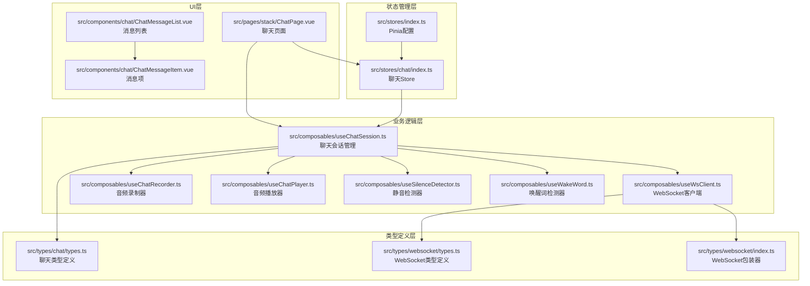

**图表来源**
- [src/stores/chat/index.ts:1-17](file://src/stores/chat/index.ts#L1-L17)
- [src/composables/useChatSession.ts:1-589](file://src/composables/useChatSession.ts#L1-L589)
- [src/types/chat/types.ts:1-96](file://src/types/chat/types.ts#L1-L96)

**章节来源**
- [src/stores/chat/index.ts:1-17](file://src/stores/chat/index.ts#L1-L17)
- [src/stores/index.ts:1-36](file://src/stores/index.ts#L1-L36)

## 核心组件

### 聊天状态类型定义

系统定义了完整的聊天状态类型体系，确保类型安全和开发体验：

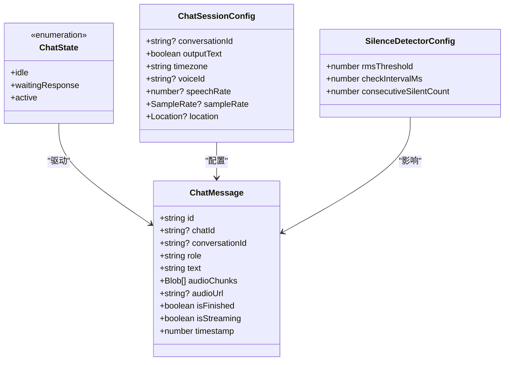

**图表来源**
- [src/types/chat/types.ts:12-43](file://src/types/chat/types.ts#L12-L43)
- [src/types/chat/types.ts:46-54](file://src/types/chat/types.ts#L46-L54)
- [src/types/chat/types.ts:57-73](file://src/types/chat/types.ts#L57-L73)

### WebSocket通信协议

系统采用统一的WebSocket通信协议，支持多种消息类型的双向通信：

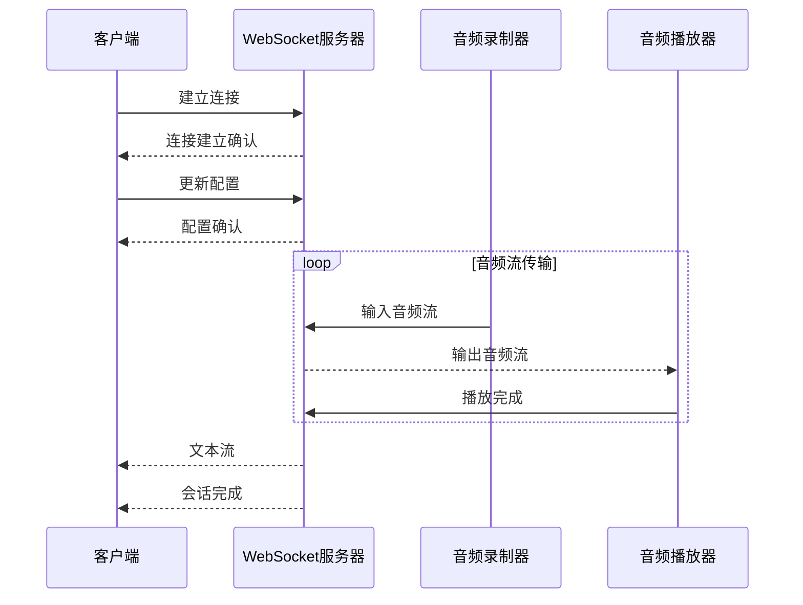

**图表来源**
- [src/composables/useWsClient.ts:29-102](file://src/composables/useWsClient.ts#L29-L102)
- [src/types/websocket/types.ts:3-15](file://src/types/websocket/types.ts#L3-L15)

**章节来源**
- [src/types/chat/types.ts:1-96](file://src/types/chat/types.ts#L1-L96)
- [src/types/websocket/types.ts:1-226](file://src/types/websocket/types.ts#L1-L226)

## 架构概览

聊天状态管理系统采用分层架构设计，各层职责明确，耦合度低：

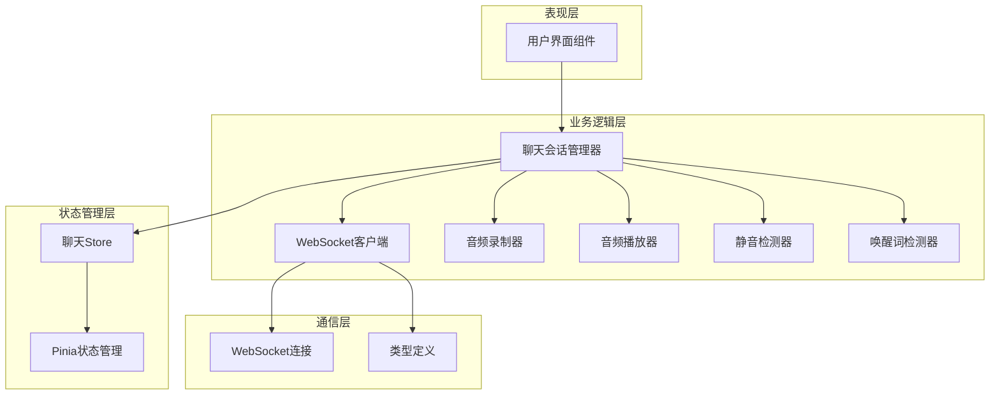

**图表来源**
- [src/composables/useChatSession.ts:74-571](file://src/composables/useChatSession.ts#L74-L571)
- [src/stores/chat/index.ts:4-16](file://src/stores/chat/index.ts#L4-L16)

### 状态机设计

系统实现了精确的三态状态机，确保聊天流程的可控性：

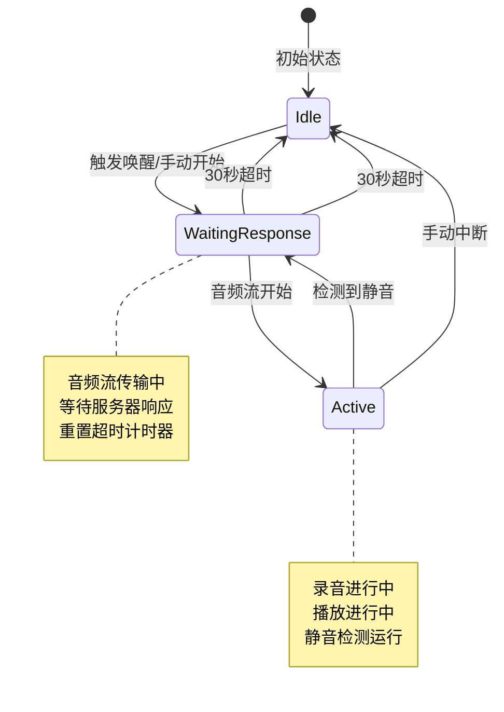

**图表来源**
- [src/types/chat/types.ts:4-19](file://src/types/chat/types.ts#L4-L19)
- [src/composables/useChatSession.ts:244-303](file://src/composables/useChatSession.ts#L244-L303)

**章节来源**
- [src/composables/useChatSession.ts:63-74](file://src/composables/useChatSession.ts#L63-L74)

## 详细组件分析

### 聊天会话管理器

`useChatSession`是整个聊天系统的核心，负责协调所有子组件和状态管理：

#### 主要功能特性

1. **状态管理**：维护聊天状态机的完整生命周期
2. **消息处理**：处理用户和助手消息的创建、更新和删除
3. **WebSocket集成**：封装WebSocket通信协议
4. **媒体处理**：协调录音、播放和静音检测
5. **错误处理**：提供完善的异常处理和恢复机制

#### 关键方法分析

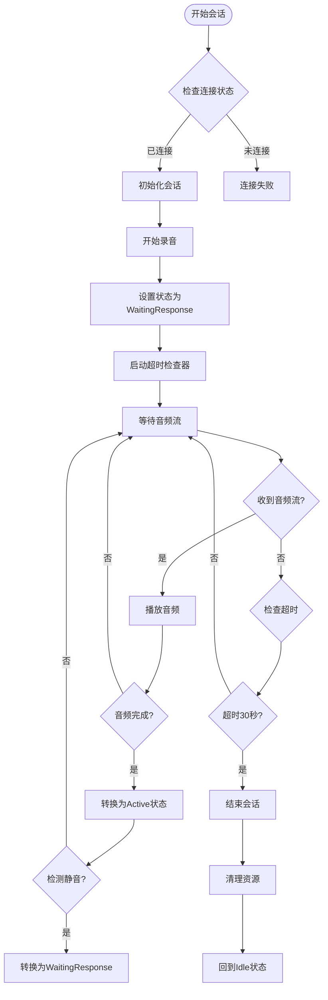

**图表来源**
- [src/composables/useChatSession.ts:309-326](file://src/composables/useChatSession.ts#L309-L326)
- [src/composables/useChatSession.ts:346-365](file://src/composables/useChatSession.ts#L346-L365)

#### 消息管理机制

系统采用智能的消息查找和创建策略：

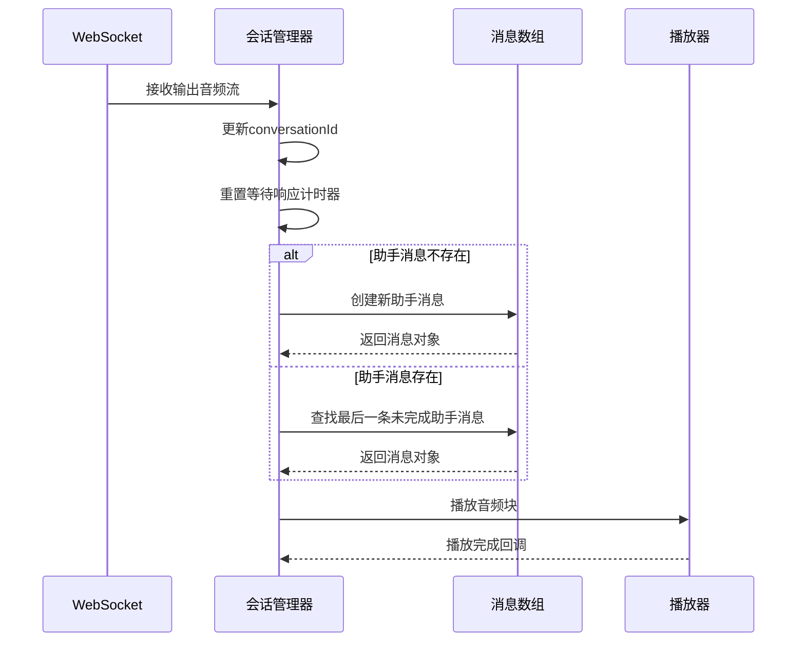

**图表来源**
- [src/composables/useChatSession.ts:130-147](file://src/composables/useChatSession.ts#L130-L147)
- [src/composables/useChatSession.ts:499-521](file://src/composables/useChatSession.ts#L499-L521)

**章节来源**
- [src/composables/useChatSession.ts:74-571](file://src/composables/useChatSession.ts#L74-L571)

### WebSocket客户端封装

`useWsClient`提供了对底层WebSocket的高级封装，支持自动重连和事件处理：

#### 连接状态管理

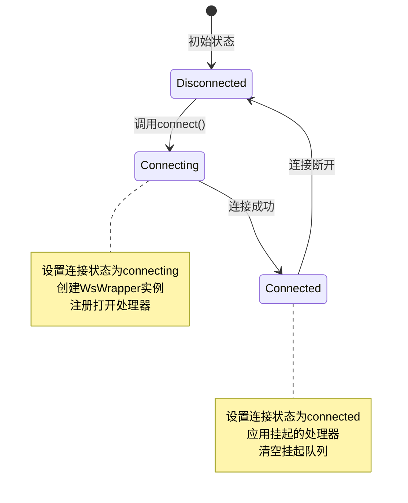

**图表来源**
- [src/composables/useWsClient.ts:37-55](file://src/composables/useWsClient.ts#L37-L55)
- [src/composables/useWsClient.ts:29-102](file://src/composables/useWsClient.ts#L29-L102)

#### 请求/响应映射

系统定义了完整的请求-响应映射关系，确保类型安全：

| 请求类型 | 响应类型 | 描述 |
|---------|---------|------|
| WsUpdateConfigRequest | WsUpdateConfigResponseSuccess | 更新会话配置 |
| WsInputAudioStreamRequest | WsInputAudioStreamRequest | 音频流输入 |
| WsInputAudioCompleteRequest | WsInputAudioCompleteResponseSuccess | 音频输入完成 |
| WsOutputAudioStreamRequest | WsOutputAudioStreamResponseSuccess | 音频流输出 |
| WsOutputTextStreamRequest | WsOutputTextStreamResponseSuccess | 文本流输出 |
| WsCancelOutputRequest | WsCancelOutputResponseSuccess | 取消输出 |

**章节来源**
- [src/composables/useWsClient.ts:29-102](file://src/composables/useWsClient.ts#L29-L102)
- [src/types/websocket/types.ts:204-216](file://src/types/websocket/types.ts#L204-L216)

### 媒体处理组件

#### 音频录制器

`useChatRecorder`实现了高质量的音频录制功能：

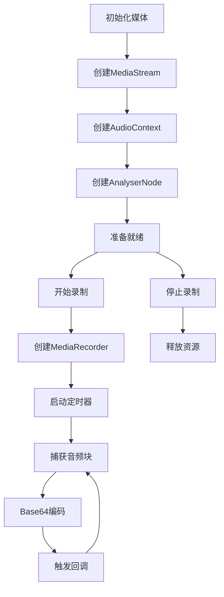

**图表来源**
- [src/composables/useChatRecorder.ts:47-70](file://src/composables/useChatRecorder.ts#L47-L70)
- [src/composables/useChatRecorder.ts:72-91](file://src/composables/useChatRecorder.ts#L72-L91)

#### 音频播放器

`useChatPlayer`实现了无缝的音频播放功能：

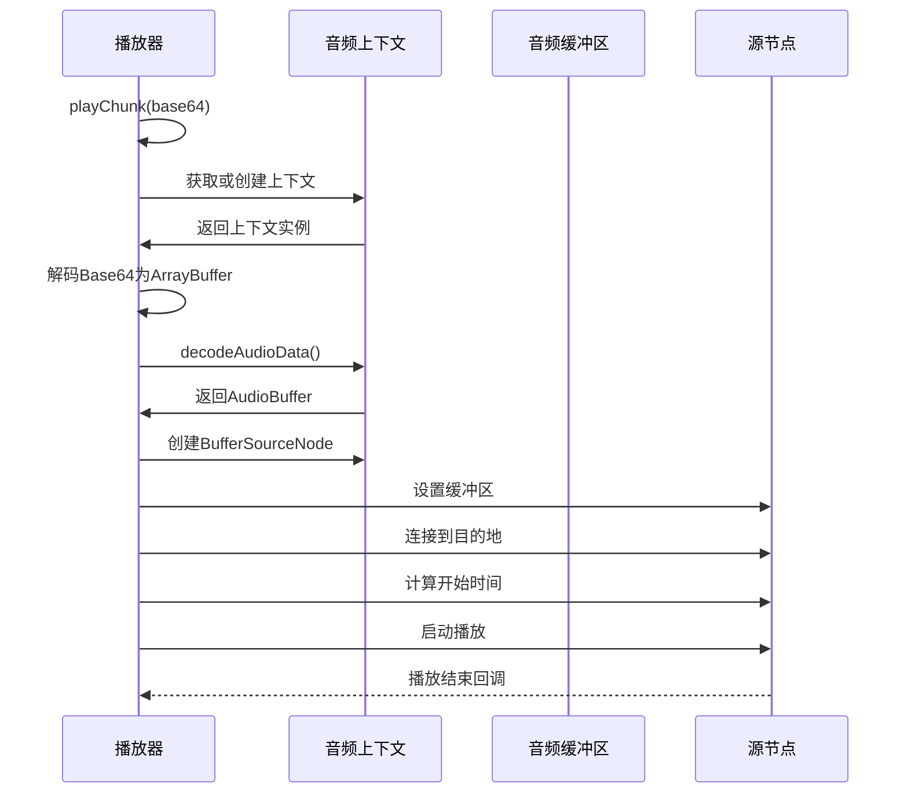

**图表来源**
- [src/composables/useChatPlayer.ts:53-96](file://src/composables/useChatPlayer.ts#L53-L96)
- [src/composables/useChatPlayer.ts:35-160](file://src/composables/useChatPlayer.ts#L35-L160)

**章节来源**
- [src/composables/useChatRecorder.ts:36-148](file://src/composables/useChatRecorder.ts#L36-L148)
- [src/composables/useChatPlayer.ts:22-161](file://src/composables/useChatPlayer.ts#L22-L161)

### UI组件集成

#### 消息列表组件

`ChatMessageList`实现了智能的滚动和渲染机制：

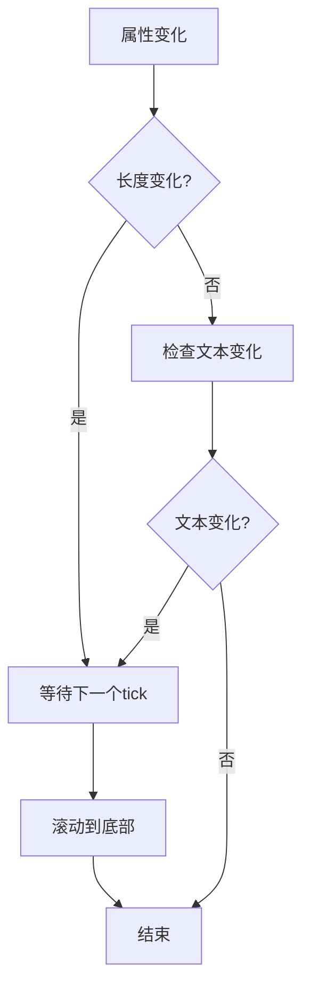

**图表来源**
- [src/components/chat/ChatMessageList.vue:14-33](file://src/components/chat/ChatMessageList.vue#L14-L33)

#### 消息项组件

`ChatMessageItem`提供了丰富的UI反馈：

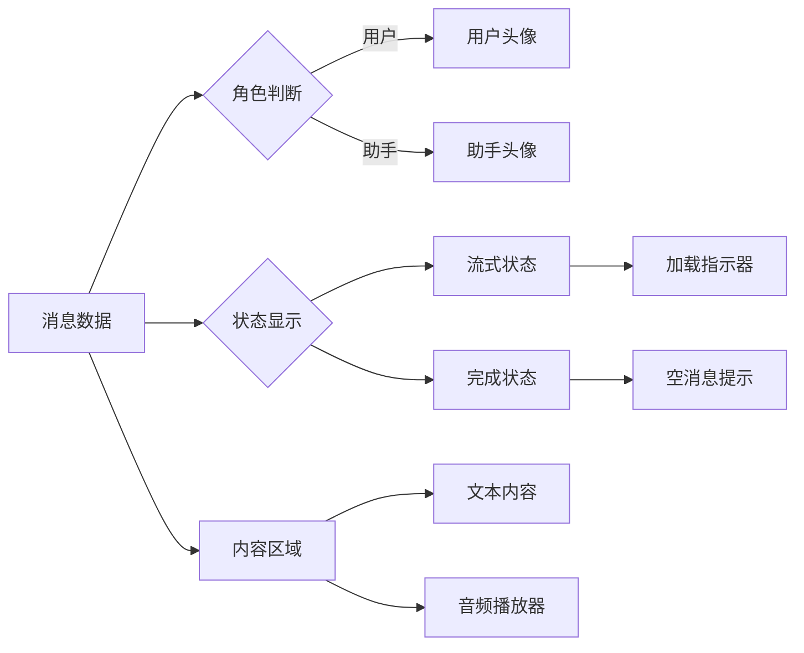

**图表来源**
- [src/components/chat/ChatMessageItem.vue:10-16](file://src/components/chat/ChatMessageItem.vue#L10-L16)
- [src/components/chat/ChatMessageItem.vue:29-49](file://src/components/chat/ChatMessageItem.vue#L29-L49)

**章节来源**
- [src/components/chat/ChatMessageList.vue:1-68](file://src/components/chat/ChatMessageList.vue#L1-L68)
- [src/components/chat/ChatMessageItem.vue:1-73](file://src/components/chat/ChatMessageItem.vue#L1-L73)

## 依赖关系分析

### 组件间依赖图

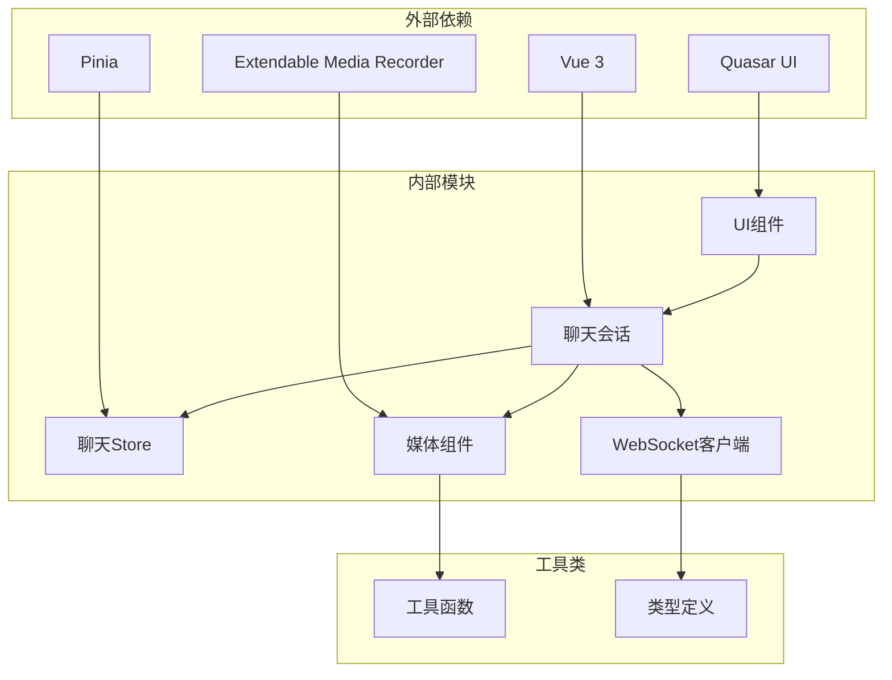

**图表来源**
- [src/composables/useChatSession.ts:8-28](file://src/composables/useChatSession.ts#L8-L28)
- [src/stores/chat/index.ts:1-2](file://src/stores/chat/index.ts#L1-L2)

### 数据流向分析

系统采用单向数据流设计，确保状态的一致性和可预测性：

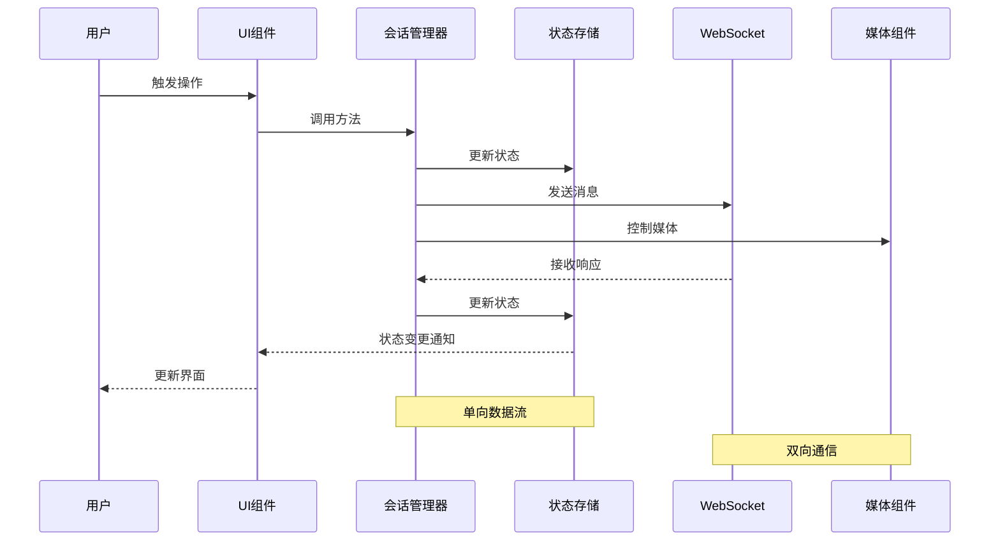

**图表来源**
- [src/composables/useChatSession.ts:379-425](file://src/composables/useChatSession.ts#L379-L425)
- [src/stores/chat/index.ts:6-11](file://src/stores/chat/index.ts#L6-L11)

**章节来源**
- [src/composables/useChatSession.ts:1-589](file://src/composables/useChatSession.ts#L1-L589)
- [src/stores/chat/index.ts:1-17](file://src/stores/chat/index.ts#L1-L17)

## 性能考虑

### 内存管理策略

1. **音频URL管理**：在断开连接时自动撤销所有音频URL，防止内存泄漏
2. **定时器清理**：在状态转换时清理定时器，避免重复执行
3. **资源释放**：音频上下文和媒体流在适当时候及时释放

### 优化技巧

1. **增量渲染**：消息列表仅在必要时重新渲染
2. **懒加载**：音频URL按需创建和销毁
3. **节流处理**：WebSocket消息处理采用节流机制
4. **缓存策略**：会话ID持久化存储，支持状态恢复

### 性能监控

系统提供了完整的性能监控点：

- 状态转换日志
- WebSocket连接状态
- 媒体组件状态
- 错误处理统计

**章节来源**
- [src/composables/useChatSession.ts:442-447](file://src/composables/useChatSession.ts#L442-L447)
- [src/composables/useChatPlayer.ts:140-148](file://src/composables/useChatPlayer.ts#L140-L148)

## 故障排除指南

### 常见问题及解决方案

#### WebSocket连接问题

| 问题症状 | 可能原因 | 解决方案 |
|---------|---------|---------|
| 连接频繁断开 | 网络不稳定 | 检查网络连接，查看重连日志 |
| 无法发送消息 | 未连接状态 | 确认连接状态，重新连接 |
| 消息丢失 | 重连期间 | 实现消息重传机制 |

#### 音频处理问题

| 问题症状 | 可能原因 | 解决方案 |
|---------|---------|---------|
| 录音无声 | 权限未授予 | 检查浏览器权限设置 |
| 播放卡顿 | 缓冲不足 | 增加缓冲区大小 |
| 延迟过高 | 网络延迟 | 优化网络配置 |

#### 状态同步问题

| 问题症状 | 可能原因 | 解决方案 |
|---------|---------|---------|
| 状态不一致 | 异步操作竞态 | 使用状态锁机制 |
| UI不同步 | 响应式更新延迟 | 使用nextTick确保更新 |
| 会话丢失 | 页面刷新 | 启用持久化存储 |

### 调试工具

1. **浏览器开发者工具**：监控WebSocket通信
2. **Vue DevTools**：检查状态树变化
3. **性能面板**：分析内存使用情况
4. **网络面板**：监控音频流传输

**章节来源**
- [src/composables/useWsClient.ts:57-63](file://src/composables/useWsClient.ts#L57-L63)
- [src/composables/useChatSession.ts:427-447](file://src/composables/useChatSession.ts#L427-L447)

## 结论

LeBot聊天状态管理模块展现了现代前端应用的最佳实践，通过清晰的分层架构、完善的类型系统和优雅的错误处理机制，实现了可靠的聊天体验。系统的主要优势包括：

1. **架构清晰**：分层设计使得代码易于理解和维护
2. **类型安全**：完整的TypeScript类型定义确保开发质量
3. **状态可控**：精确的状态机设计保证了聊天流程的稳定性
4. **性能优化**：合理的内存管理和资源控制提升了用户体验
5. **扩展性强**：模块化的组件设计便于功能扩展

该模块为类似聊天应用的开发提供了优秀的参考模板，其设计理念和实现方式值得在其他项目中借鉴和应用。