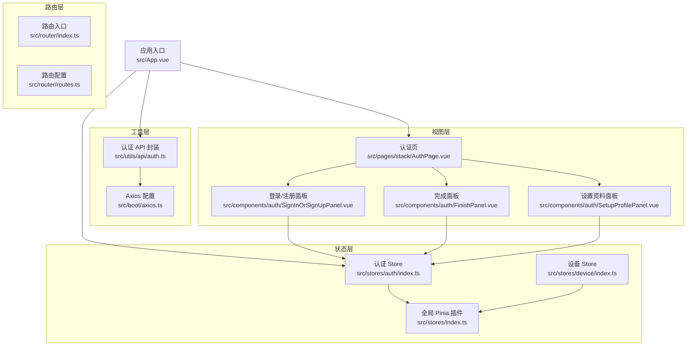
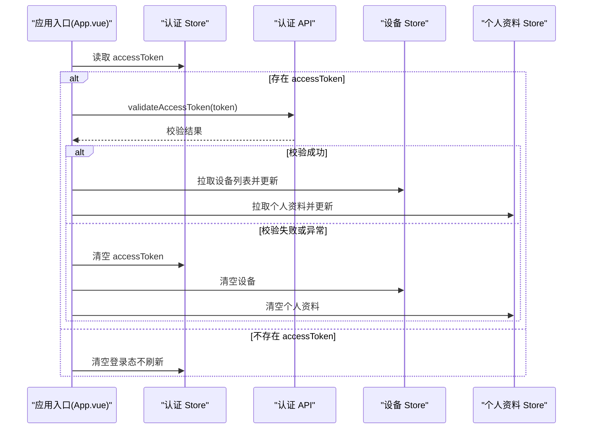
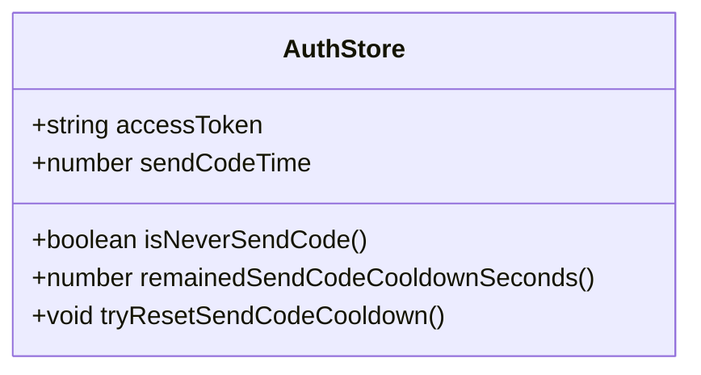
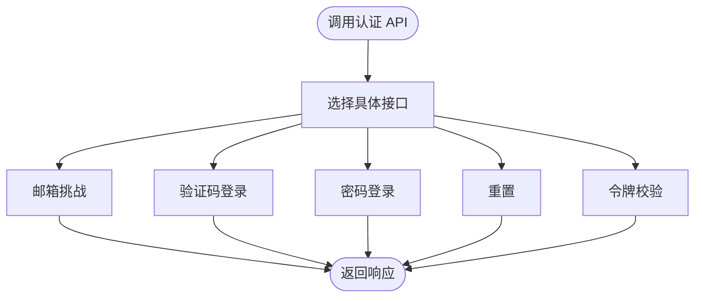
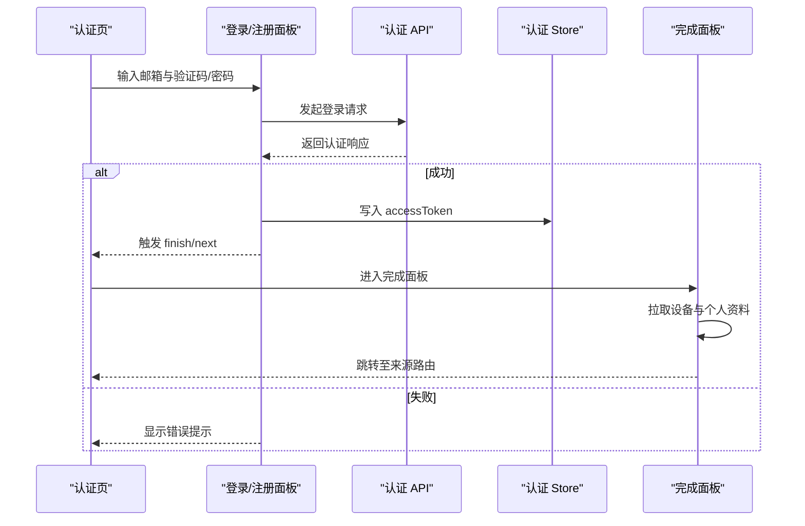
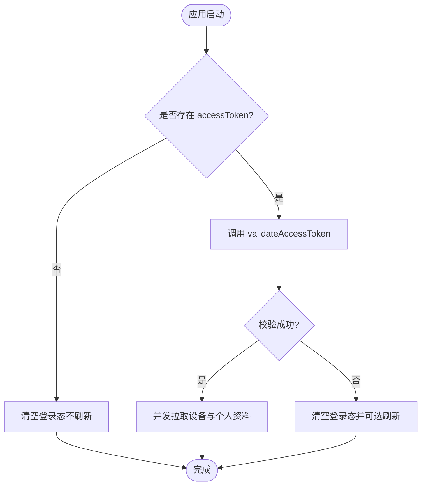
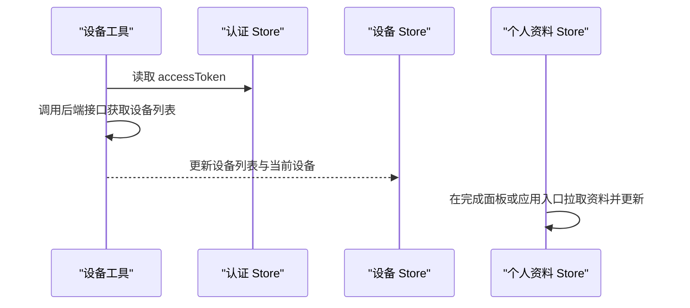
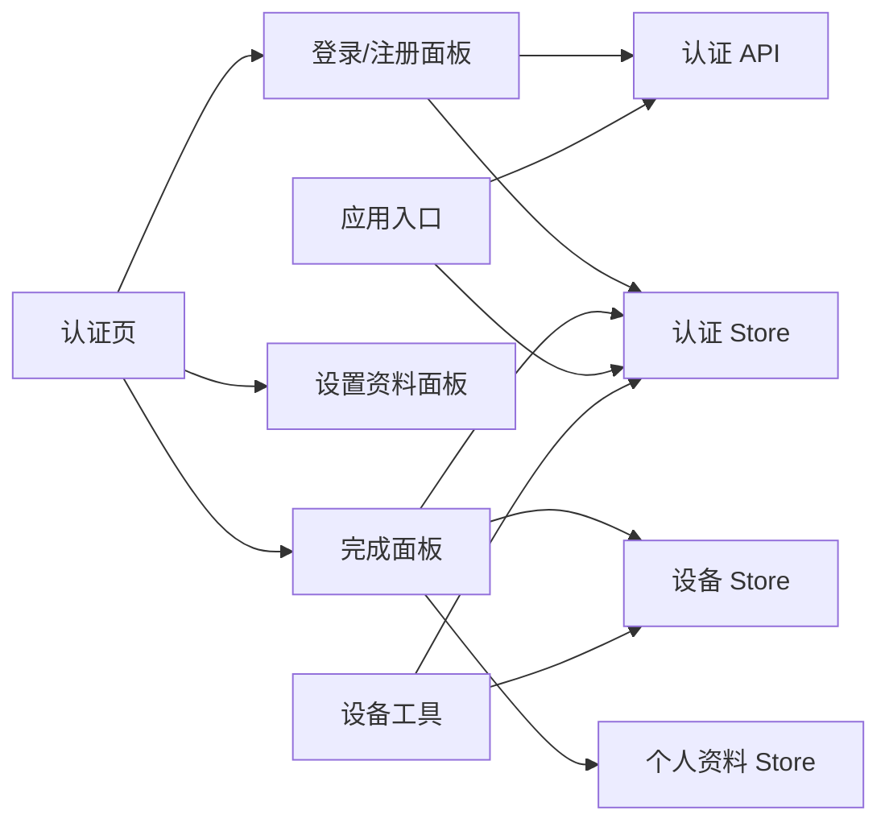

# 认证状态管理

<cite>
**本文引用的文件**
- [src/stores/auth/index.ts](file://src/stores/auth/index.ts)
- [src/stores/auth/constants.ts](file://src/stores/auth/constants.ts)
- [src/stores/index.ts](file://src/stores/index.ts)
- [src/utils/api/auth.ts](file://src/utils/api/auth.ts)
- [src/boot/axios.ts](file://src/boot/axios.ts)
- [src/App.vue](file://src/App.vue)
- [src/pages/stack/AuthPage.vue](file://src/pages/stack/AuthPage.vue)
- [src/components/auth/SignInOrSignUpPanel.vue](file://src/components/auth/SignInOrSignUpPanel.vue)
- [src/components/auth/FinishPanel.vue](file://src/components/auth/FinishPanel.vue)
- [src/components/auth/SetupProfilePanel.vue](file://src/components/auth/SetupProfilePanel.vue)
- [src/router/index.ts](file://src/router/index.ts)
- [src/router/routes.ts](file://src/router/routes.ts)
- [src/utils/device.ts](file://src/utils/device.ts)
- [src/stores/device/index.ts](file://src/stores/device/index.ts)
</cite>

## 目录
1. [简介](#简介)
2. [项目结构](#项目结构)
3. [核心组件](#核心组件)
4. [架构总览](#架构总览)
5. [详细组件分析](#详细组件分析)
6. [依赖关系分析](#依赖关系分析)
7. [性能考量](#性能考量)
8. [故障排查指南](#故障排查指南)
9. [结论](#结论)
10. [附录](#附录)

## 简介
本文件系统性梳理前端认证状态管理模块的设计与实现，重点覆盖以下方面：
- 认证 store 的设计理念与状态结构
- 用户登录状态、JWT 令牌管理、会话持久化与自动登录机制
- 认证流程中的状态变化、错误处理与重定向逻辑
- 认证状态与其他 store 的交互模式与数据共享策略
- 认证中间件与路由守卫的集成与安全考虑
- 最佳实践、调试技巧与常见问题解决方案

## 项目结构
认证相关代码主要分布在以下位置：
- 状态层：Pinia 认证 store、设备与个人资料 store
- 工具层：认证 API 封装（Axios 集成）
- 视图层：认证页面与多步骤面板组件
- 路由层：路由定义与入口初始化
- 应用入口：应用挂载时的自动登录与令牌校验

图表来源
- [src/stores/auth/index.ts:1-35](file://src/stores/auth/index.ts#L1-L35)
- [src/stores/device/index.ts:1-26](file://src/stores/device/index.ts#L1-L26)
- [src/stores/index.ts:1-36](file://src/stores/index.ts#L1-L36)
- [src/utils/api/auth.ts:1-28](file://src/utils/api/auth.ts#L1-L28)
- [src/boot/axios.ts:1-27](file://src/boot/axios.ts#L1-L27)
- [src/pages/stack/AuthPage.vue:1-69](file://src/pages/stack/AuthPage.vue#L1-L69)
- [src/components/auth/SignInOrSignUpPanel.vue:1-117](file://src/components/auth/SignInOrSignUpPanel.vue#L1-L117)
- [src/components/auth/FinishPanel.vue:1-80](file://src/components/auth/FinishPanel.vue#L1-L80)
- [src/components/auth/SetupProfilePanel.vue:1-133](file://src/components/auth/SetupProfilePanel.vue#L1-L133)
- [src/router/index.ts:1-38](file://src/router/index.ts#L1-L38)
- [src/router/routes.ts:1-160](file://src/router/routes.ts#L1-L160)
- [src/App.vue:1-84](file://src/App.vue#L1-L84)

章节来源
- [src/stores/auth/index.ts:1-35](file://src/stores/auth/index.ts#L1-L35)
- [src/stores/index.ts:1-36](file://src/stores/index.ts#L1-L36)
- [src/utils/api/auth.ts:1-28](file://src/utils/api/auth.ts#L1-L28)
- [src/boot/axios.ts:1-27](file://src/boot/axios.ts#L1-L27)
- [src/App.vue:1-84](file://src/App.vue#L1-L84)
- [src/pages/stack/AuthPage.vue:1-69](file://src/pages/stack/AuthPage.vue#L1-L69)
- [src/components/auth/SignInOrSignUpPanel.vue:1-117](file://src/components/auth/SignInOrSignUpPanel.vue#L1-L117)
- [src/components/auth/FinishPanel.vue:1-80](file://src/components/auth/FinishPanel.vue#L1-L80)
- [src/components/auth/SetupProfilePanel.vue:1-133](file://src/components/auth/SetupProfilePanel.vue#L1-L133)
- [src/router/index.ts:1-38](file://src/router/index.ts#L1-L38)
- [src/router/routes.ts:1-160](file://src/router/routes.ts#L1-L160)

## 核心组件
- 认证 Store（Pinia）
  - 状态：访问令牌、验证码发送时间戳
  - 计算属性：是否从未发送验证码、剩余冷却秒数
  - 方法：重置验证码冷却
  - 持久化：启用持久化
- 设备 Store（Pinia）
  - 状态：当前设备、设备列表
  - 方法：批量更新设备
  - 持久化：启用持久化
- 认证 API 封装
  - 提供邮箱挑战、验证码登录、密码登录、重置、令牌校验等接口
  - 基于 Axios 实例，统一前缀与类型
- 应用入口自动登录
  - 启动时校验本地令牌有效性
  - 成功则拉取设备与个人资料；失败则清空登录态并可选择刷新

章节来源
- [src/stores/auth/index.ts:1-35](file://src/stores/auth/index.ts#L1-L35)
- [src/stores/device/index.ts:1-26](file://src/stores/device/index.ts#L1-L26)
- [src/utils/api/auth.ts:1-28](file://src/utils/api/auth.ts#L1-L28)
- [src/App.vue:1-84](file://src/App.vue#L1-L84)

## 架构总览
认证状态管理采用“状态驱动 + API 驱动”的双轮模式：
- 状态驱动：Pinia Store 维护访问令牌与业务状态，组件通过 storeToRefs 获取响应式状态
- API 驱动：通过 utils/api/auth.ts 封装的异步方法与后端交互，成功后写入 store
- 自动登录：应用启动时读取 store 中的令牌并进行有效性校验，成功则预拉取设备与个人资料
- 持久化：全局 Pinia 插件开启持久化，确保刷新后仍保持登录态

图表来源
- [src/App.vue:58-80](file://src/App.vue#L58-L80)
- [src/utils/api/auth.ts:21-27](file://src/utils/api/auth.ts#L21-L27)
- [src/stores/auth/index.ts:9-29](file://src/stores/auth/index.ts#L9-L29)

## 详细组件分析

### 认证 Store 设计与状态结构
- 状态字段
  - accessToken：JWT 访问令牌
  - sendCodeTime：验证码发送时间戳（毫秒），用于冷却控制
- 计算属性
  - isNeverSendCode：从未发送验证码
  - remainedSendCodeCooldownSeconds：剩余冷却秒数（基于常量冷却间隔）
- 方法
  - tryResetSendCodeCooldown：当冷却结束时重置 sendCodeTime
- 持久化策略
  - 通过 Pinia 插件持久化到本地存储，键名包含命名空间

图表来源
- [src/stores/auth/index.ts:6-34](file://src/stores/auth/index.ts#L6-L34)

章节来源
- [src/stores/auth/index.ts:1-35](file://src/stores/auth/index.ts#L1-L35)
- [src/stores/auth/constants.ts:1-2](file://src/stores/auth/constants.ts#L1-L2)
- [src/stores/index.ts:26-35](file://src/stores/index.ts#L26-L35)

### 认证 API 封装与类型
- 接口职责
  - 邮箱挑战：触发发送验证码
  - 验证码登录：使用邮箱+验证码换取访问令牌
  - 密码登录：使用邮箱+密码换取访问令牌
  - 重置：邮箱+验证码+新密码重置
  - 令牌校验：携带 x-access-token 头部验证令牌有效性
- 类型定义
  - ChallengeResponse：挑战响应（成功/失败）
  - AuthResponse：认证响应（成功/失败，包含访问令牌、是否新用户、是否无密码）

图表来源
- [src/utils/api/auth.ts:5-27](file://src/utils/api/auth.ts#L5-L27)
- [src/types/api/auth.ts:1-19](file://src/types/api/auth.ts#L1-L19)

章节来源
- [src/utils/api/auth.ts:1-28](file://src/utils/api/auth.ts#L1-L28)
- [src/types/api/auth.ts:1-19](file://src/types/api/auth.ts#L1-L19)

### 登录流程与状态变化
- 流程概览
  - 用户在认证页输入邮箱与验证码/密码
  - 触发登录请求，成功后将访问令牌写入认证 store
  - 完成面板加载设备与个人资料，随后根据来源参数进行重定向
- 关键状态变化
  - 登录成功：accessToken 写入 store
  - 新用户/无密码：触发下一步流程
  - 完成面板：成功后自动跳转，失败则清理状态并允许重新开始

图表来源
- [src/pages/stack/AuthPage.vue:42-62](file://src/pages/stack/AuthPage.vue#L42-L62)
- [src/components/auth/SignInOrSignUpPanel.vue:40-75](file://src/components/auth/SignInOrSignUpPanel.vue#L40-L75)
- [src/utils/api/auth.ts:9-15](file://src/utils/api/auth.ts#L9-L15)
- [src/components/auth/FinishPanel.vue:39-58](file://src/components/auth/FinishPanel.vue#L39-L58)

章节来源
- [src/pages/stack/AuthPage.vue:1-69](file://src/pages/stack/AuthPage.vue#L1-L69)
- [src/components/auth/SignInOrSignUpPanel.vue:1-117](file://src/components/auth/SignInOrSignUpPanel.vue#L1-L117)
- [src/components/auth/FinishPanel.vue:1-80](file://src/components/auth/FinishPanel.vue#L1-L80)

### 令牌校验与自动登录机制
- 应用启动时
  - 读取认证 store 中的 accessToken
  - 调用 validateAccessToken 校验令牌有效性
  - 成功：并发拉取设备与个人资料并更新对应 store
  - 失败：清空登录态并可选刷新页面
- 会话持久化
  - 全局 Pinia 插件启用持久化，确保刷新后仍保留登录态

图表来源
- [src/App.vue:58-80](file://src/App.vue#L58-L80)
- [src/utils/api/auth.ts:21-27](file://src/utils/api/auth.ts#L21-L27)
- [src/stores/index.ts:26-35](file://src/stores/index.ts#L26-L35)

章节来源
- [src/App.vue:1-84](file://src/App.vue#L1-L84)
- [src/utils/api/auth.ts:1-28](file://src/utils/api/auth.ts#L1-L28)
- [src/stores/index.ts:1-36](file://src/stores/index.ts#L1-L36)

### 与其他 Store 的交互与数据共享
- 设备与个人资料的获取
  - 设备：通过 utils/device.ts 读取认证 store 的 accessToken 并调用后端接口
  - 个人资料：在应用入口与完成面板中分别拉取并更新对应 store
- 数据共享策略
  - 以 storeToRefs 读取认证 store 的响应式状态
  - 在需要鉴权的请求中，将 accessToken 作为请求头携带
  - 通过 store 的方法（如 updateDevices、updateProfile）集中更新状态

图表来源
- [src/utils/device.ts:5-17](file://src/utils/device.ts#L5-L17)
- [src/stores/device/index.ts:12-15](file://src/stores/device/index.ts#L12-L15)
- [src/App.vue:39-56](file://src/App.vue#L39-L56)
- [src/components/auth/FinishPanel.vue:41-42](file://src/components/auth/FinishPanel.vue#L41-L42)

章节来源
- [src/utils/device.ts:1-17](file://src/utils/device.ts#L1-L17)
- [src/stores/device/index.ts:1-26](file://src/stores/device/index.ts#L1-L26)
- [src/App.vue:1-84](file://src/App.vue#L1-L84)
- [src/components/auth/FinishPanel.vue:1-80](file://src/components/auth/FinishPanel.vue#L1-L80)

### 路由与导航集成
- 路由定义
  - 认证页位于栈式布局下，名称为 auth
  - 应用入口通过路由守卫（未在代码中显式声明）实现登录态控制
- 重定向逻辑
  - 完成面板根据 query.from 参数决定跳转目标，若为空则回退到根路径

章节来源
- [src/router/routes.ts:54-59](file://src/router/routes.ts#L54-L59)
- [src/components/auth/FinishPanel.vue:44-47](file://src/components/auth/FinishPanel.vue#L44-L47)

## 依赖关系分析
- 组件依赖
  - 登录/注册面板依赖认证 store 与认证 API
  - 完成面板依赖认证 store、设备 store、个人资料 store 与路由
  - 认证页聚合多个子面板并通过事件驱动状态流转
- 工具依赖
  - 认证 API 依赖 Axios 实例与后端接口
  - 设备工具依赖认证 store 与设备 API
- 状态依赖
  - 应用入口依赖认证 store 的令牌进行自动登录
  - 设备与个人资料 store 的初始数据来源于认证后的拉取

图表来源
- [src/components/auth/SignInOrSignUpPanel.vue:6-22](file://src/components/auth/SignInOrSignUpPanel.vue#L6-L22)
- [src/components/auth/FinishPanel.vue:7-28](file://src/components/auth/FinishPanel.vue#L7-L28)
- [src/pages/stack/AuthPage.vue:4-16](file://src/pages/stack/AuthPage.vue#L4-L16)
- [src/App.vue:8-18](file://src/App.vue#L8-L18)
- [src/utils/device.ts:5-17](file://src/utils/device.ts#L5-L17)

章节来源
- [src/components/auth/SignInOrSignUpPanel.vue:1-117](file://src/components/auth/SignInOrSignUpPanel.vue#L1-L117)
- [src/components/auth/FinishPanel.vue:1-80](file://src/components/auth/FinishPanel.vue#L1-L80)
- [src/pages/stack/AuthPage.vue:1-69](file://src/pages/stack/AuthPage.vue#L1-L69)
- [src/App.vue:1-84](file://src/App.vue#L1-L84)
- [src/utils/device.ts:1-17](file://src/utils/device.ts#L1-L17)

## 性能考量
- 并发拉取
  - 应用入口与完成面板均采用并发方式拉取设备与个人资料，减少总等待时间
- 冷却控制
  - 验证码发送冷却通过 store 计算属性实时反馈，避免频繁请求
- 持久化优化
  - Pinia 持久化仅保存必要字段，降低序列化开销

## 故障排查指南
- 令牌无效或过期
  - 现象：应用启动时自动登录失败，触发清空登录态
  - 处理：检查后端令牌签发与有效期；确认前端未篡改 store
- 设备/资料拉取失败
  - 现象：完成面板显示失败，自动清理状态
  - 处理：确认网络连通性与后端接口可用；检查 accessToken 是否正确传递
- 验证码发送过于频繁
  - 现象：按钮不可点击或提示剩余冷却秒数
  - 处理：等待冷却结束；检查 sendCodeTime 是否被正确更新
- 路由重定向异常
  - 现象：完成面板未按预期跳转
  - 处理：检查 query.from 参数来源；确认路由名称存在且可访问

章节来源
- [src/App.vue:61-76](file://src/App.vue#L61-L76)
- [src/components/auth/FinishPanel.vue:49-57](file://src/components/auth/FinishPanel.vue#L49-L57)
- [src/stores/auth/index.ts:12-22](file://src/stores/auth/index.ts#L12-L22)

## 结论
该认证状态管理模块以 Pinia 为核心，结合 Axios 封装与应用入口自动登录机制，实现了简洁可靠的登录态管理。通过 store-to-ref 的响应式绑定与并发数据拉取，提升了用户体验；借助持久化与冷却控制，兼顾了易用性与安全性。后续可在路由守卫与权限拦截方面进一步增强，以满足更严格的访问控制需求。

## 附录
- 最佳实践
  - 使用 storeToRefs 读取响应式状态，避免直接修改 store 引用
  - 对所有需要鉴权的请求统一注入 accessToken
  - 在关键流程（登录、完成面板）增加错误兜底与用户提示
  - 合理利用并发拉取，缩短首屏等待时间
- 调试技巧
  - 打印 store 状态变化与 API 请求响应，定位异常环节
  - 利用浏览器开发者工具查看本地存储中的持久化数据
  - 在路由守卫处添加日志，追踪重定向链路
- 常见问题
  - 令牌丢失：检查持久化插件配置与命名空间
  - 冷却不生效：确认计算属性与定时器逻辑
  - 资料未更新：确认拉取流程与 store 更新方法调用