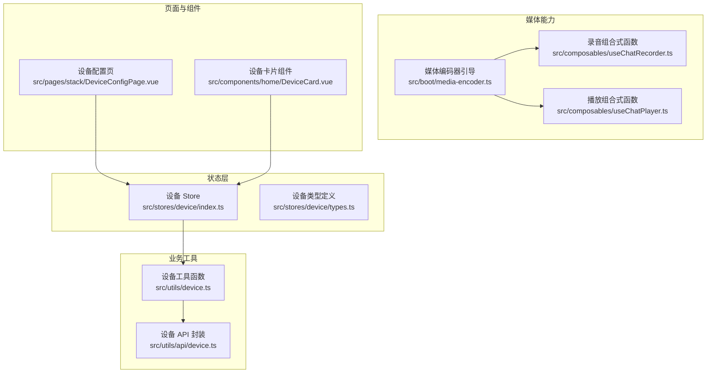
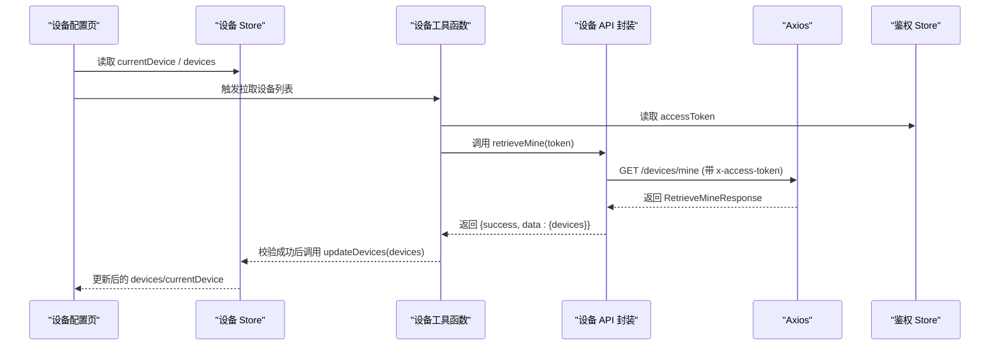
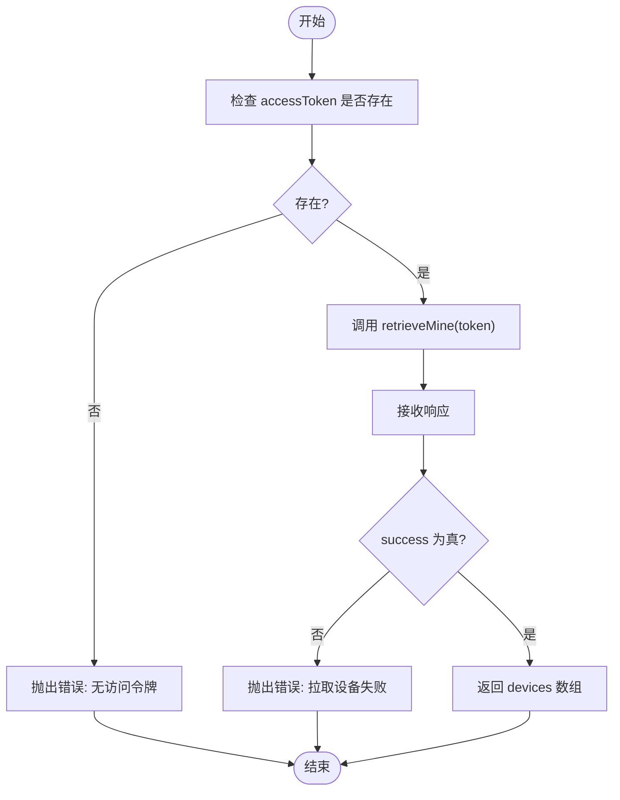
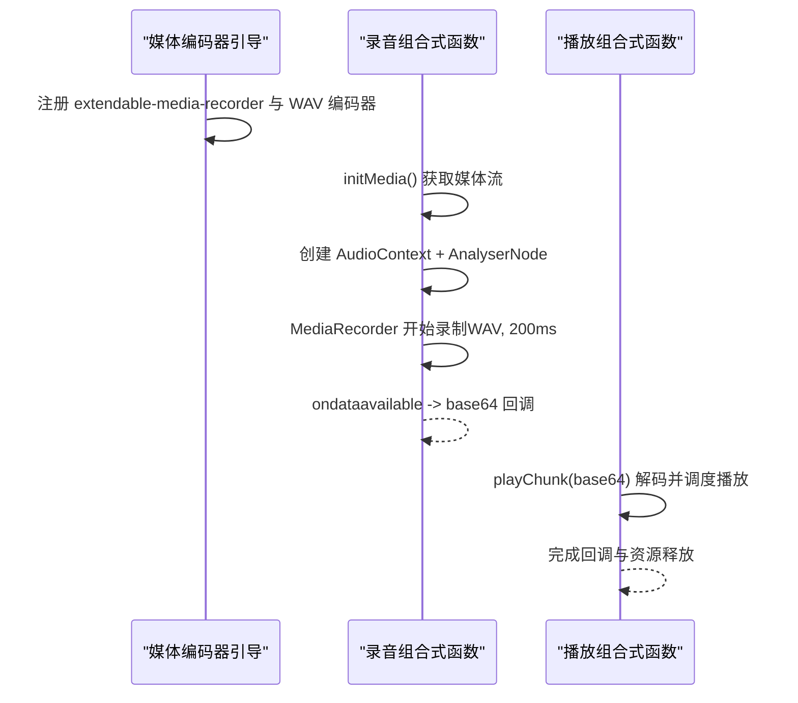
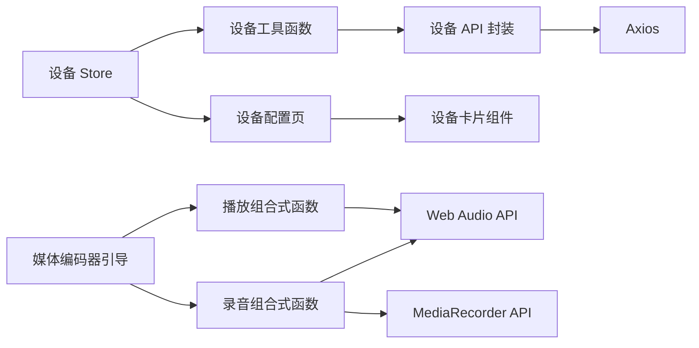

# 设备状态管理

<cite>
**本文引用的文件**
- [src/stores/device/index.ts](file://src/stores/device/index.ts)
- [src/stores/device/types.ts](file://src/stores/device/types.ts)
- [src/utils/device.ts](file://src/utils/device.ts)
- [src/utils/api/device.ts](file://src/utils/api/device.ts)
- [src/boot/media-encoder.ts](file://src/boot/media-encoder.ts)
- [src/composables/useChatRecorder.ts](file://src/composables/useChatRecorder.ts)
- [src/composables/useChatPlayer.ts](file://src/composables/useChatPlayer.ts)
- [src/pages/stack/DeviceConfigPage.vue](file://src/pages/stack/DeviceConfigPage.vue)
- [src/components/home/DeviceCard.vue](file://src/components/home/DeviceCard.vue)
- [src/types/audio/types.ts](file://src/types/audio/types.ts)
- [src/types/audio/constants.ts](file://src/types/audio/constants.ts)
- [src/types/api/device.ts](file://src/types/api/device.ts)
</cite>

## 目录
1. [简介](#简介)
2. [项目结构](#项目结构)
3. [核心组件](#核心组件)
4. [架构总览](#架构总览)
5. [详细组件分析](#详细组件分析)
6. [依赖分析](#依赖分析)
7. [性能考量](#性能考量)
8. [故障排除指南](#故障排除指南)
9. [结论](#结论)
10. [附录](#附录)

## 简介
本文件系统化梳理前端设备状态管理模块，重点覆盖以下方面：
- 设备 store 的状态结构设计与持久化策略
- 硬件设备（麦克风/扬声器）的采集、播放与静音检测机制
- 设备配置项的读取与展示路径
- 设备信息的拉取流程与鉴权集成
- 实时更新、变更监听与状态同步机制
- 与浏览器媒体 API 的集成、权限请求处理与错误状态管理
- 跨浏览器兼容性、性能优化与用户体验建议
- 调试技巧、故障排除与最佳实践

## 项目结构
围绕“设备状态管理”的关键目录与文件如下：
- Pinia 设备 store：集中管理当前设备与设备列表，并启用持久化
- 设备工具函数：封装设备列表拉取逻辑，依赖鉴权令牌
- 设备 API 封装：通过 axios 访问后端接口
- 媒体编码器引导：注册 extendable-media-recorder 及 WAV 编码器
- 录音与播放组合式函数：基于 Web Audio API 和 MediaRecorder 实现录音与播放
- 页面与组件：设备配置页、设备卡片等用于展示与入口



图表来源
- [src/stores/device/index.ts:1-27](file://src/stores/device/index.ts#L1-L27)
- [src/stores/device/types.ts:1-17](file://src/stores/device/types.ts#L1-L17)
- [src/utils/device.ts:1-18](file://src/utils/device.ts#L1-L18)
- [src/utils/api/device.ts:1-11](file://src/utils/api/device.ts#L1-L11)
- [src/boot/media-encoder.ts:1-8](file://src/boot/media-encoder.ts#L1-L8)
- [src/composables/useChatRecorder.ts:1-148](file://src/composables/useChatRecorder.ts#L1-L148)
- [src/composables/useChatPlayer.ts:1-161](file://src/composables/useChatPlayer.ts#L1-L161)
- [src/pages/stack/DeviceConfigPage.vue:1-55](file://src/pages/stack/DeviceConfigPage.vue#L1-L55)
- [src/components/home/DeviceCard.vue:1-31](file://src/components/home/DeviceCard.vue#L1-L31)

章节来源
- [src/stores/device/index.ts:1-27](file://src/stores/device/index.ts#L1-L27)
- [src/stores/device/types.ts:1-17](file://src/stores/device/types.ts#L1-L17)
- [src/utils/device.ts:1-18](file://src/utils/device.ts#L1-L18)
- [src/utils/api/device.ts:1-11](file://src/utils/api/device.ts#L1-L11)
- [src/boot/media-encoder.ts:1-8](file://src/boot/media-encoder.ts#L1-L8)
- [src/composables/useChatRecorder.ts:1-148](file://src/composables/useChatRecorder.ts#L1-L148)
- [src/composables/useChatPlayer.ts:1-161](file://src/composables/useChatPlayer.ts#L1-L161)
- [src/pages/stack/DeviceConfigPage.vue:1-55](file://src/pages/stack/DeviceConfigPage.vue#L1-L55)
- [src/components/home/DeviceCard.vue:1-31](file://src/components/home/DeviceCard.vue#L1-L31)

## 核心组件
- 设备 Store（Pinia）
  - 状态：当前设备 currentDevice、设备列表 devices
  - 方法：updateDevices 用于批量更新设备列表并设置当前设备
  - 持久化：启用持久化，确保刷新后仍保留设备选择
- 设备类型定义
  - 设备类型枚举、设备信息结构（含标识、归属、型号、名称、状态、配置等）
- 设备工具函数
  - 从后端拉取用户设备列表，依赖鉴权 store 的访问令牌
  - 对响应进行校验，返回 devices 数组
- 设备 API 封装
  - 通过 axios 发起 GET 请求到 /devices/mine，携带 x-access-token 头
- 媒体编码器引导
  - 在应用启动阶段注册 extendable-media-recorder 与 WAV 编码器，为录音提供支持
- 录音组合式函数
  - 通过 navigator.mediaDevices.getUserMedia 获取媒体流
  - 使用 MediaRecorder 以 WAV 格式输出 200ms 片段
  - 创建 AudioContext 与 AnalyserNode 进行静音检测
- 播放组合式函数
  - 基于 Web Audio API 解码 base64 音频片段，实现无缝调度播放
  - 支持停止、清空缓冲、完成回调与资源释放

章节来源
- [src/stores/device/index.ts:1-27](file://src/stores/device/index.ts#L1-L27)
- [src/stores/device/types.ts:1-17](file://src/stores/device/types.ts#L1-L17)
- [src/utils/device.ts:1-18](file://src/utils/device.ts#L1-L18)
- [src/utils/api/device.ts:1-11](file://src/utils/api/device.ts#L1-L11)
- [src/boot/media-encoder.ts:1-8](file://src/boot/media-encoder.ts#L1-L8)
- [src/composables/useChatRecorder.ts:1-148](file://src/composables/useChatRecorder.ts#L1-L148)
- [src/composables/useChatPlayer.ts:1-161](file://src/composables/useChatPlayer.ts#L1-L161)

## 架构总览
设备状态管理在前端的总体交互链路如下：



图表来源
- [src/pages/stack/DeviceConfigPage.vue:1-55](file://src/pages/stack/DeviceConfigPage.vue#L1-L55)
- [src/stores/device/index.ts:1-27](file://src/stores/device/index.ts#L1-L27)
- [src/utils/device.ts:1-18](file://src/utils/device.ts#L1-L18)
- [src/utils/api/device.ts:1-11](file://src/utils/api/device.ts#L1-L11)
- [src/types/api/device.ts:1-14](file://src/types/api/device.ts#L1-L14)

## 详细组件分析

### 设备 Store 与类型定义
- 状态结构
  - currentDevice：当前选中的设备对象
  - devices：设备数组
- 行为
  - updateDevices：替换设备列表并自动将第一个设备设为当前设备
- 持久化
  - 启用持久化，避免刷新丢失设备选择
- 类型定义
  - DeviceType：设备类型枚举
  - DeviceInfo：包含 id、createdAt、updatedAt、identifier、ownerId、type、model、name、status、config（含 voiceStyle）

```mermaid
classDiagram
class DeviceStore {
+currentDevice : DeviceInfo
+devices : DeviceInfo[]
+updateDevices(newDevices)
}
class DeviceInfo {
+id : string
+identifier : string
+ownerId : number
+type : DeviceType
+model : string
+name : string
+status : unknown
+config : { voiceStyle : string } | null
}
DeviceStore --> DeviceInfo : "管理"
```

图表来源
- [src/stores/device/index.ts:1-27](file://src/stores/device/index.ts#L1-L27)
- [src/stores/device/types.ts:1-17](file://src/stores/device/types.ts#L1-L17)

章节来源
- [src/stores/device/index.ts:1-27](file://src/stores/device/index.ts#L1-L27)
- [src/stores/device/types.ts:1-17](file://src/stores/device/types.ts#L1-L17)

### 设备工具函数与 API 封装
- 设备工具函数
  - 依赖鉴权 store 的 accessToken
  - 调用 retrieveMine 并对响应 success 字段进行校验
  - 成功时返回 devices 数组
- 设备 API 封装
  - 通过 axios 发送 GET 请求至 /devices/mine
  - 请求头携带 x-access-token



图表来源
- [src/utils/device.ts:1-18](file://src/utils/device.ts#L1-L18)
- [src/utils/api/device.ts:1-11](file://src/utils/api/device.ts#L1-L11)
- [src/types/api/device.ts:1-14](file://src/types/api/device.ts#L1-L14)

章节来源
- [src/utils/device.ts:1-18](file://src/utils/device.ts#L1-L18)
- [src/utils/api/device.ts:1-11](file://src/utils/api/device.ts#L1-L11)
- [src/types/api/device.ts:1-14](file://src/types/api/device.ts#L1-L14)

### 媒体编码器引导与录音播放管线
- 媒体编码器引导
  - 在应用启动时注册 extendable-media-recorder 与 WAV 编码器
- 录音管线（useChatRecorder）
  - 通过 getUserMedia 获取媒体流（采样率、位深、声道数、回声消除、降噪、自动增益）
  - 使用 MediaRecorder 以 audio/wav 输出 200ms 片段
  - 创建 AudioContext 与 AnalyserNode 进行静音检测
- 播放管线（useChatPlayer）
  - 接收 base64 音频片段，解码为 AudioBuffer
  - 基于 AudioContext 调度无缝播放
  - 支持停止、清空缓冲、完成回调与资源释放



图表来源
- [src/boot/media-encoder.ts:1-8](file://src/boot/media-encoder.ts#L1-L8)
- [src/composables/useChatRecorder.ts:1-148](file://src/composables/useChatRecorder.ts#L1-L148)
- [src/composables/useChatPlayer.ts:1-161](file://src/composables/useChatPlayer.ts#L1-L161)

章节来源
- [src/boot/media-encoder.ts:1-8](file://src/boot/media-encoder.ts#L1-L8)
- [src/composables/useChatRecorder.ts:1-148](file://src/composables/useChatRecorder.ts#L1-L148)
- [src/composables/useChatPlayer.ts:1-161](file://src/composables/useChatPlayer.ts#L1-L161)

### 页面与组件集成
- 设备配置页
  - 读取设备 store 中的 currentDevice
  - 展示语音风格、语言、个性调整、WiFi 管理、固件更新、关于设备等菜单项
  - 若未选择设备则回退上一页
- 设备卡片组件
  - 展示“无设备”提示与添加新设备入口

章节来源
- [src/pages/stack/DeviceConfigPage.vue:1-55](file://src/pages/stack/DeviceConfigPage.vue#L1-L55)
- [src/components/home/DeviceCard.vue:1-31](file://src/components/home/DeviceCard.vue#L1-L31)

## 依赖分析
- 组件耦合与内聚
  - 设备 Store 与设备工具函数/API 封装低耦合，职责清晰
  - 录音/播放组合式函数独立于设备状态，便于复用
- 直接与间接依赖
  - 设备工具函数依赖鉴权 store 与设备 API 封装
  - 页面组件依赖设备 store
  - 媒体能力依赖引导模块
- 外部依赖与集成点
  - extendable-media-recorder 与 extendable-media-recorder-wav-encoder
  - Web Audio API 与 MediaRecorder API
  - axios 作为 HTTP 客户端
- 接口契约
  - 设备 API 返回结构包含 success 与 data.devices
  - 设备类型定义包含 voiceStyle 配置字段



图表来源
- [src/stores/device/index.ts:1-27](file://src/stores/device/index.ts#L1-L27)
- [src/utils/device.ts:1-18](file://src/utils/device.ts#L1-L18)
- [src/utils/api/device.ts:1-11](file://src/utils/api/device.ts#L1-L11)
- [src/pages/stack/DeviceConfigPage.vue:1-55](file://src/pages/stack/DeviceConfigPage.vue#L1-L55)
- [src/components/home/DeviceCard.vue:1-31](file://src/components/home/DeviceCard.vue#L1-L31)
- [src/boot/media-encoder.ts:1-8](file://src/boot/media-encoder.ts#L1-L8)
- [src/composables/useChatRecorder.ts:1-148](file://src/composables/useChatRecorder.ts#L1-L148)
- [src/composables/useChatPlayer.ts:1-161](file://src/composables/useChatPlayer.ts#L1-L161)

章节来源
- [src/stores/device/index.ts:1-27](file://src/stores/device/index.ts#L1-L27)
- [src/utils/device.ts:1-18](file://src/utils/device.ts#L1-L18)
- [src/utils/api/device.ts:1-11](file://src/utils/api/device.ts#L1-L11)
- [src/pages/stack/DeviceConfigPage.vue:1-55](file://src/pages/stack/DeviceConfigPage.vue#L1-L55)
- [src/components/home/DeviceCard.vue:1-31](file://src/components/home/DeviceCard.vue#L1-L31)
- [src/boot/media-encoder.ts:1-8](file://src/boot/media-encoder.ts#L1-L8)
- [src/composables/useChatRecorder.ts:1-148](file://src/composables/useChatRecorder.ts#L1-L148)
- [src/composables/useChatPlayer.ts:1-161](file://src/composables/useChatPlayer.ts#L1-L161)

## 性能考量
- 录音片段大小与时序
  - 使用 200ms 片段平衡延迟与开销；结合 WAV 编码减少转码成本
- 静音检测
  - 仅使用 AnalyserNode 分析，不连接输出设备，避免回放开销
- 播放调度
  - 基于 AudioContext 时间线进行无缝调度，降低拼接噪声与抖动
- 资源释放
  - 录音停止后及时关闭 MediaRecorder、停止轨道、释放 AudioContext
  - 播放停止后断开所有源并重置时间线
- 持久化
  - 设备选择持久化，减少重复拉取与渲染抖动

## 故障排除指南
- 无法获取设备列表
  - 检查鉴权令牌是否存在与有效
  - 确认 /devices/mine 接口返回 success 为真
- 录音无声音或报错
  - 确认浏览器已授予媒体权限
  - 检查 extendable-media-recorder 与 WAV 编码器是否正确注册
  - 验证采样率、声道数、位深参数与浏览器支持情况
- 播放卡顿或破音
  - 检查 base64 数据完整性与解码流程
  - 确保无缝调度逻辑正确，避免时间线跳跃
- 设备配置页空白
  - 确认 currentDevice 已被设置
  - 检查路由守卫逻辑与页面回退行为

章节来源
- [src/utils/device.ts:1-18](file://src/utils/device.ts#L1-L18)
- [src/utils/api/device.ts:1-11](file://src/utils/api/device.ts#L1-L11)
- [src/boot/media-encoder.ts:1-8](file://src/boot/media-encoder.ts#L1-L8)
- [src/composables/useChatRecorder.ts:1-148](file://src/composables/useChatRecorder.ts#L1-L148)
- [src/composables/useChatPlayer.ts:1-161](file://src/composables/useChatPlayer.ts#L1-L161)
- [src/pages/stack/DeviceConfigPage.vue:1-55](file://src/pages/stack/DeviceConfigPage.vue#L1-L55)

## 结论
该设备状态管理模块以 Pinia Store 为核心，结合设备工具函数与 API 封装，实现了设备列表的拉取、持久化与展示；同时通过媒体引导与录音/播放组合式函数，提供了完整的音频采集与播放能力。整体架构清晰、职责分离明确，具备良好的可扩展性与可维护性。

## 附录
- 跨浏览器兼容性建议
  - MediaRecorder 与 WAV 编码器需确认目标浏览器支持情况，必要时提供降级方案
  - Web Audio API 的采样率与通道数需与设备实际能力匹配
- 用户体验建议
  - 提供录音前的环境提示与静音检测反馈
  - 在播放过程中提供进度与完成提示
- 最佳实践
  - 严格区分“设备状态”与“媒体状态”，避免相互污染
  - 在组件卸载时统一释放媒体资源，防止内存泄漏
  - 对网络请求与音频处理增加超时与重试策略