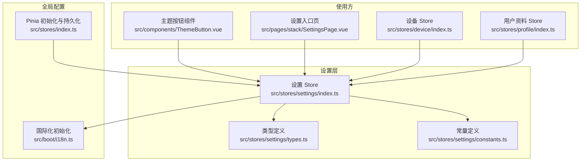
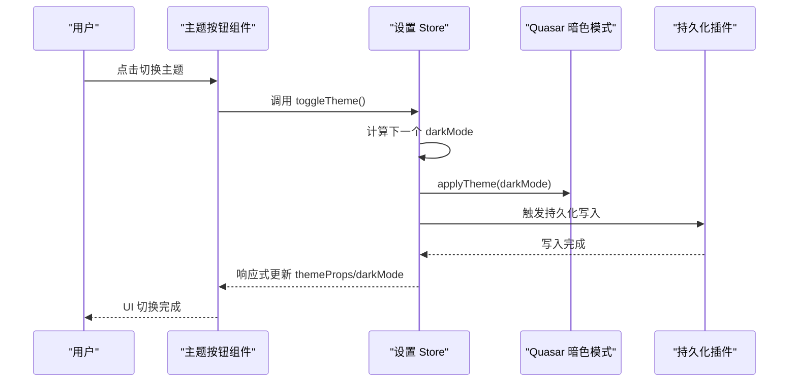
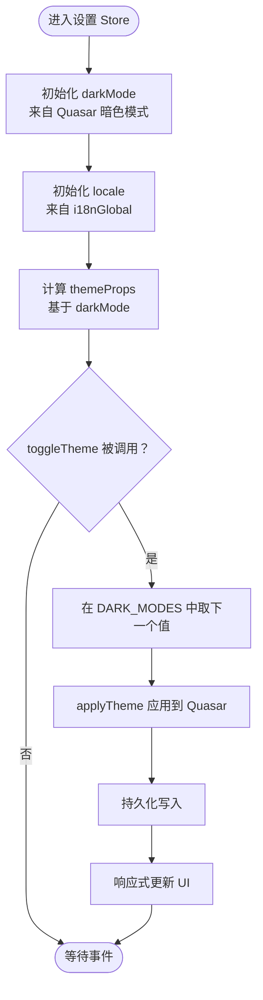
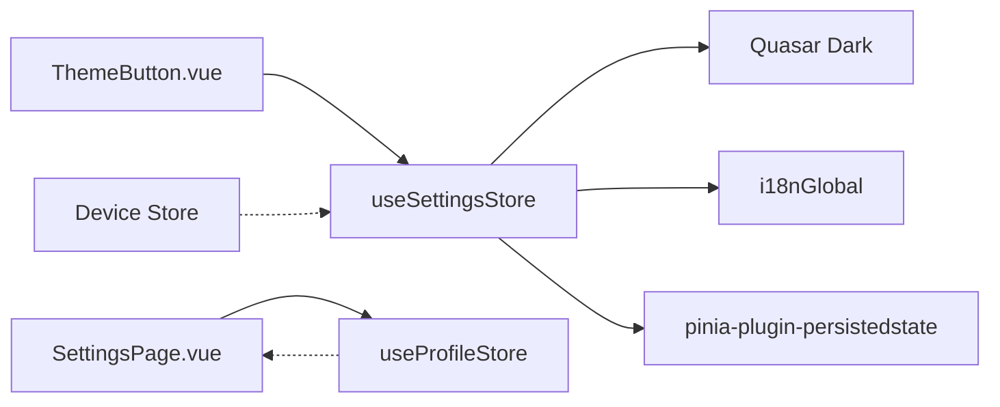

# 设置状态管理

<cite>
**本文引用的文件**
- [src/stores/settings/index.ts](file://src/stores/settings/index.ts)
- [src/stores/settings/types.ts](file://src/stores/settings/types.ts)
- [src/stores/settings/constants.ts](file://src/stores/settings/constants.ts)
- [src/stores/index.ts](file://src/stores/index.ts)
- [src/boot/i18n.ts](file://src/boot/i18n.ts)
- [src/components/ThemeButton.vue](file://src/components/ThemeButton.vue)
- [src/pages/stack/SettingsPage.vue](file://src/pages/stack/SettingsPage.vue)
- [src/stores/device/index.ts](file://src/stores/device/index.ts)
- [src/stores/device/types.ts](file://src/stores/device/types.ts)
- [src/stores/profile/index.ts](file://src/stores/profile/index.ts)
- [src/stores/profile/types.ts](file://src/stores/profile/types.ts)
- [src/utils/validation.ts](file://src/utils/validation.ts)
</cite>

## 目录
1. [简介](#简介)
2. [项目结构](#项目结构)
3. [核心组件](#核心组件)
4. [架构总览](#架构总览)
5. [详细组件分析](#详细组件分析)
6. [依赖关系分析](#依赖关系分析)
7. [性能考量](#性能考量)
8. [故障排查指南](#故障排查指南)
9. [结论](#结论)
10. [附录](#附录)

## 简介
本文件系统性梳理前端设置状态管理模块的设计与实现，重点覆盖以下方面：
- 设置 store 的状态结构设计与配置管理机制
- 用户偏好设置（语言）、主题与设备参数的存储策略
- 设置状态的持久化机制、默认值管理与配置迁移策略
- 设置变更的响应式更新、全局状态同步与组件订阅机制
- 设置状态的验证规则、类型安全保证与错误处理方案
- 最佳实践、调试方法与性能优化建议

## 项目结构
设置状态管理位于 Pinia store 层，围绕“主题/语言”两大维度构建，并通过持久化插件实现跨会话保存。主要文件分布如下：
- 设置 store：src/stores/settings/index.ts
- 类型定义：src/stores/settings/types.ts
- 常量定义：src/stores/settings/constants.ts
- 全局 Pinia 初始化与持久化插件：src/stores/index.ts
- 国际化初始化：src/boot/i18n.ts
- 使用示例（主题切换按钮）：src/components/ThemeButton.vue
- 设置入口页：src/pages/stack/SettingsPage.vue
- 设备信息 store（用于设备参数展示）：src/stores/device/index.ts、src/stores/device/types.ts
- 用户资料 store（用于设置入口联动）：src/stores/profile/index.ts、src/stores/profile/types.ts
- 校验工具：src/utils/validation.ts

图表来源
- [src/stores/settings/index.ts:1-57](file://src/stores/settings/index.ts#L1-L57)
- [src/stores/settings/types.ts:1-4](file://src/stores/settings/types.ts#L1-L4)
- [src/stores/settings/constants.ts:1-4](file://src/stores/settings/constants.ts#L1-L4)
- [src/stores/index.ts:1-36](file://src/stores/index.ts#L1-L36)
- [src/boot/i18n.ts:1-34](file://src/boot/i18n.ts#L1-L34)
- [src/components/ThemeButton.vue:1-28](file://src/components/ThemeButton.vue#L1-L28)
- [src/pages/stack/SettingsPage.vue:1-127](file://src/pages/stack/SettingsPage.vue#L1-L127)
- [src/stores/device/index.ts:1-26](file://src/stores/device/index.ts#L1-L26)
- [src/stores/profile/index.ts:1-24](file://src/stores/profile/index.ts#L1-L24)

章节来源
- [src/stores/settings/index.ts:1-57](file://src/stores/settings/index.ts#L1-L57)
- [src/stores/index.ts:1-36](file://src/stores/index.ts#L1-L36)

## 核心组件
- 设置 store（useSettingsStore）
  - 状态字段
    - darkMode：主题模式，支持 false/auto/true 三种枚举值
    - locale：当前语言，基于全局 i18n 实现双向绑定
    - themeProps：根据 darkMode 计算出的主题颜色与图标
  - 行为方法
    - applyTheme：将 darkMode 应用到 Quasar 暗色模式
    - toggleTheme：在主题模式枚举中循环切换
  - 持久化
    - store 配置 persist: true，结合全局持久化插件实现自动持久化

- 类型与常量
  - Locales：由国际化资源动态推断的语言键集合
  - DARK_MODES：主题模式枚举数组，确保切换边界安全

- 全局 Pinia 与持久化
  - 在 Pinia 实例上安装持久化插件，统一 key 前缀，开启 auto 模式

- 国际化集成
  - i18nGlobal.locale 作为 locale 的 getter/setter，实现语言切换与持久化

章节来源
- [src/stores/settings/index.ts:9-52](file://src/stores/settings/index.ts#L9-L52)
- [src/stores/settings/types.ts:1-4](file://src/stores/settings/types.ts#L1-L4)
- [src/stores/settings/constants.ts:1-4](file://src/stores/settings/constants.ts#L1-L4)
- [src/stores/index.ts:26-35](file://src/stores/index.ts#L26-L35)
- [src/boot/i18n.ts:23-29](file://src/boot/i18n.ts#L23-L29)

## 架构总览
设置状态管理采用“单点 store + 全局持久化插件”的轻量架构，主题与语言分别对接 Quasar 暗色模式与 vue-i18n，形成低耦合、高内聚的状态域。

图表来源
- [src/components/ThemeButton.vue:7-8](file://src/components/ThemeButton.vue#L7-L8)
- [src/stores/settings/index.ts:35-39](file://src/stores/settings/index.ts#L35-L39)
- [src/stores/index.ts:28-33](file://src/stores/index.ts#L28-L33)

## 详细组件分析

### 设置 Store（useSettingsStore）
- 状态结构
  - darkMode：Ref<T>，初始值来自 Quasar 当前暗色模式；通过枚举数组限定取值范围
  - locale：ComputedRef，get 从 i18nGlobal.locale 读取，set 写回 i18nGlobal.locale
  - themeProps：ComputedRef，依据 darkMode 返回颜色与图标
- 行为逻辑
  - applyTheme：调用 Quasar Dark.set 将 darkMode 应用到 UI
  - toggleTheme：在 DARK_MODES 中按序轮转，更新 darkMode 并立即应用
- 持久化策略
  - store 级别 persist: true，结合全局插件自动序列化/反序列化
- 响应式与订阅
  - 组件通过 storeToRefs/useSettingsStore 订阅 darkMode/locale/themeProps，实现 UI 自动刷新

图表来源
- [src/stores/settings/index.ts:12-39](file://src/stores/settings/index.ts#L12-L39)
- [src/stores/settings/constants.ts:3](file://src/stores/settings/constants.ts#L3)
- [src/stores/index.ts:28-33](file://src/stores/index.ts#L28-L33)

章节来源
- [src/stores/settings/index.ts:9-52](file://src/stores/settings/index.ts#L9-L52)
- [src/stores/settings/constants.ts:1-4](file://src/stores/settings/constants.ts#L1-L4)

### 类型与常量
- Locales
  - 通过国际化消息资源动态推断，确保语言键集合与实际可用语言一致
- DARK_MODES
  - 显式枚举 [false, 'auto', true]，避免运行时越界与非法值

章节来源
- [src/stores/settings/types.ts:1-4](file://src/stores/settings/types.ts#L1-L4)
- [src/stores/settings/constants.ts:1-4](file://src/stores/settings/constants.ts#L1-L4)

### 国际化与主题联动
- 主题按钮组件
  - 通过 storeToRefs 获取 themeProps 与 toggleTheme，实现点击切换与提示文案
- 设置入口页
  - 提供语言设置入口，引导至语言子页面（具体实现可扩展）

章节来源
- [src/components/ThemeButton.vue:7-8](file://src/components/ThemeButton.vue#L7-L8)
- [src/pages/stack/SettingsPage.vue:32-34](file://src/pages/stack/SettingsPage.vue#L32-L34)

### 设备参数与设置的关系
- 设备 Store
  - 存储设备列表与当前设备，包含 config 字段（如 voiceStyle）
  - 可用于在设置页展示或编辑设备侧偏好（例如语音风格）
- 设置 Store 与设备 Store 的关系
  - 设置 Store 负责全局主题/语言；设备 Store 负责设备侧参数
  - 两者通过路由与页面导航进行解耦协作

章节来源
- [src/stores/device/index.ts:6-22](file://src/stores/device/index.ts#L6-L22)
- [src/stores/device/types.ts:3-16](file://src/stores/device/types.ts#L3-L16)

### 用户资料与设置入口联动
- 用户资料 Store
  - 存储用户档案，影响设置入口页的菜单项与行为（如登录/登出）
- 设置入口页
  - 根据是否存在 profile 动态显示“个人资料设置”“语音特征设置”等入口

章节来源
- [src/stores/profile/index.ts:6-22](file://src/stores/profile/index.ts#L6-L22)
- [src/stores/profile/types.ts:1-13](file://src/stores/profile/types.ts#L1-L13)
- [src/pages/stack/SettingsPage.vue:10-10](file://src/pages/stack/SettingsPage.vue#L10-L10)

## 依赖关系分析
- 组件依赖
  - ThemeButton 依赖 useSettingsStore 的 toggleTheme 与 themeProps
  - SettingsPage 依赖 useProfileStore 的 profile 状态以控制菜单可用性
- 外部依赖
  - Quasar Dark：提供暗色模式能力与初始值
  - vue-i18n：提供多语言能力与全局 locale
  - pinia-plugin-persistedstate：提供自动持久化能力
- 数据流向
  - 用户交互 → 组件 → Store 方法 → 应用外部（Quasar/DOM）/持久化插件 → 下次启动恢复

图表来源
- [src/components/ThemeButton.vue:5-8](file://src/components/ThemeButton.vue#L5-L8)
- [src/pages/stack/SettingsPage.vue:6-10](file://src/pages/stack/SettingsPage.vue#L6-L10)
- [src/stores/settings/index.ts:2-7](file://src/stores/settings/index.ts#L2-L7)
- [src/stores/index.ts:28-33](file://src/stores/index.ts#L28-L33)

章节来源
- [src/components/ThemeButton.vue:1-28](file://src/components/ThemeButton.vue#L1-L28)
- [src/pages/stack/SettingsPage.vue:1-127](file://src/pages/stack/SettingsPage.vue#L1-L127)
- [src/stores/settings/index.ts:1-57](file://src/stores/settings/index.ts#L1-L57)
- [src/stores/index.ts:1-36](file://src/stores/index.ts#L1-L36)

## 性能考量
- 响应式粒度
  - 将 darkMode 与 locale 分离，避免无关状态变更触发重渲染
- 计算属性复用
  - themeProps 由 darkMode 计算得出，减少重复判断
- 持久化策略
  - 使用全局持久化插件 auto: true，减少手动序列化开销
- 组件订阅
  - 使用 storeToRefs 仅订阅所需字段，降低渲染成本

## 故障排查指南
- 语言切换无效
  - 检查 i18nGlobal.locale 是否被正确赋值与持久化
  - 确认 Pinia 持久化插件是否启用且 key 前缀正确
- 主题切换不生效
  - 检查 applyTheme 是否被调用，以及 Quasar Dark.set 是否成功
  - 确认 DARK_MODES 顺序与索引计算无误
- 重启后设置丢失
  - 检查持久化插件配置与浏览器存储权限
  - 确认 store 配置 persist: true 已生效
- 类型错误或语言键不存在
  - Locales 由国际化资源动态推断，若新增语言需同步更新 i18n 资源

章节来源
- [src/stores/settings/index.ts:13-18](file://src/stores/settings/index.ts#L13-L18)
- [src/stores/index.ts:28-33](file://src/stores/index.ts#L28-L33)
- [src/stores/settings/constants.ts:3](file://src/stores/settings/constants.ts#L3)
- [src/stores/settings/types.ts:1-4](file://src/stores/settings/types.ts#L1-L4)

## 结论
该设置状态管理模块以极简设计实现了主题与语言的全局配置与持久化，配合 Pinia 的响应式与类型系统，提供了良好的开发体验与运行效率。后续可在以下方向演进：
- 扩展更多设置项（如消息通知、隐私偏好等），并保持单一 store 的职责边界
- 引入配置校验与默认值管理，增强健壮性
- 对复杂设置页引入分片持久化，避免单 store 过大

## 附录

### 默认值管理与配置迁移
- 默认值来源
  - darkMode：来自 Quasar 当前暗色模式
  - locale：来自 i18n 初始化的默认语言
- 迁移策略
  - 新增设置项时，建议在 store 初始化阶段提供兼容逻辑，避免因旧版本数据缺失导致异常
  - 对于枚举类字段（如 DARK_MODES），可通过白名单过滤与兜底值保障类型安全

章节来源
- [src/stores/settings/index.ts:12-12](file://src/stores/settings/index.ts#L12-L12)
- [src/stores/settings/constants.ts:3](file://src/stores/settings/constants.ts#L3)
- [src/boot/i18n.ts:23-27](file://src/boot/i18n.ts#L23-L27)

### 验证规则与类型安全
- 类型安全
  - Locales 由国际化资源动态推断，确保语言键集合与实际可用语言一致
  - DARK_MODES 为显式枚举，避免非法值进入状态
- 校验工具
  - 可参考通用校验工具（如邮箱/手机号校验）在表单场景中复用

章节来源
- [src/stores/settings/types.ts:1-4](file://src/stores/settings/types.ts#L1-L4)
- [src/stores/settings/constants.ts:3](file://src/stores/settings/constants.ts#L3)
- [src/utils/validation.ts:1-7](file://src/utils/validation.ts#L1-L7)