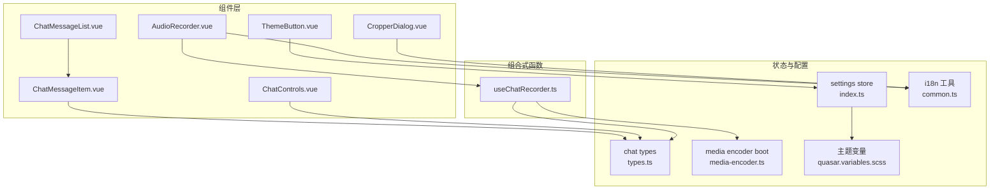
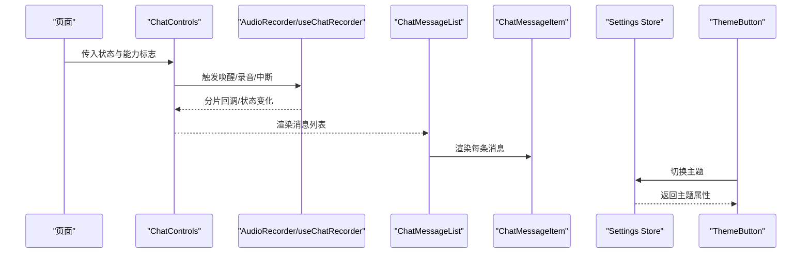
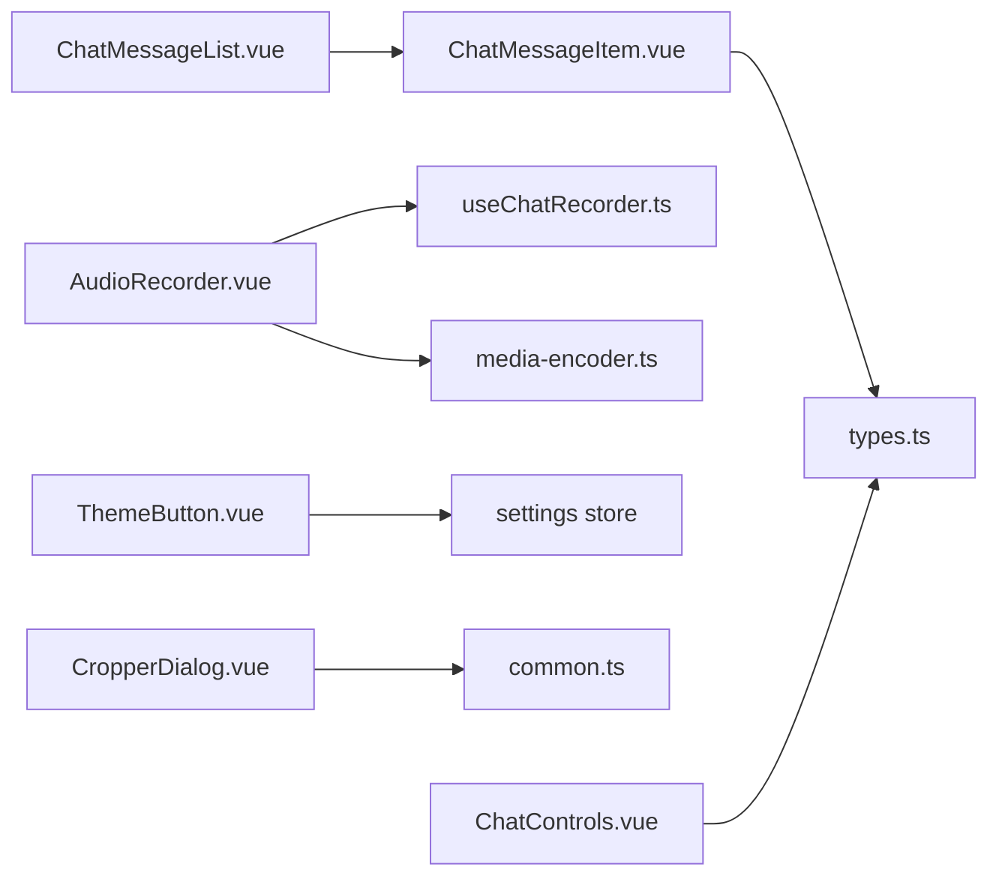
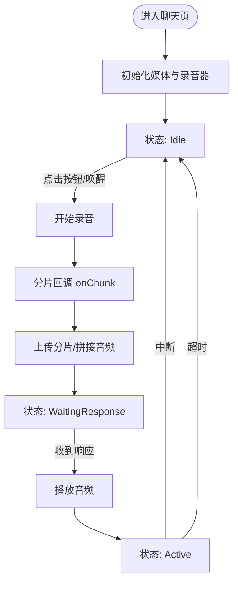

# UI基础组件

<cite>
**本文引用的文件**
- [AudioRecorder.vue](file://src/components/AudioRecorder.vue)
- [CropperDialog.vue](file://src/components/CropperDialog.vue)
- [ThemeButton.vue](file://src/components/ThemeButton.vue)
- [ChatMessageItem.vue](file://src/components/chat/ChatMessageItem.vue)
- [ChatMessageList.vue](file://src/components/chat/ChatMessageList.vue)
- [ChatControls.vue](file://src/components/chat/ChatControls.vue)
- [useChatRecorder.ts](file://src/composables/useChatRecorder.ts)
- [types.ts](file://src/types/chat/types.ts)
- [index.ts](file://src/stores/settings/index.ts)
- [media-encoder.ts](file://src/boot/media-encoder.ts)
- [common.ts](file://src/utils/common.ts)
- [quasar.variables.scss](file://src/css/quasar.variables.scss)
</cite>

## 目录
1. [简介](#简介)
2. [项目结构](#项目结构)
3. [核心组件](#核心组件)
4. [架构总览](#架构总览)
5. [组件详细分析](#组件详细分析)
6. [依赖关系分析](#依赖关系分析)
7. [性能考量](#性能考量)
8. [故障排查指南](#故障排查指南)
9. [结论](#结论)
10. [附录](#附录)

## 简介
本文件系统化梳理 Le Bot 前端 UI 基础组件，覆盖以下核心组件：消息项组件、音频录制器、主题按钮、裁剪对话框，并补充与之配套的录音组合式函数与聊天控制组件，帮助开发者理解组件的设计原则、接口约定、事件与插槽、样式定制、交互行为与可访问性支持，同时给出组合使用模式与状态管理策略。

## 项目结构
本项目采用按功能域分层的组织方式，UI 基础组件主要位于 src/components 及其子目录中；聊天相关组件位于 src/components/chat；录音能力通过组合式函数 useChatRecorder 抽象；主题切换由 Pinia store 管理；国际化工具统一通过 i18nSubPath 提供；媒体编码器在启动阶段注册以支持 WAVE 录制。

图表来源
- [AudioRecorder.vue:1-113](file://src/components/AudioRecorder.vue#L1-L113)
- [CropperDialog.vue:1-154](file://src/components/CropperDialog.vue#L1-L154)
- [ThemeButton.vue:1-28](file://src/components/ThemeButton.vue#L1-L28)
- [ChatMessageItem.vue:1-73](file://src/components/chat/ChatMessageItem.vue#L1-L73)
- [ChatMessageList.vue:1-68](file://src/components/chat/ChatMessageList.vue#L1-L68)
- [ChatControls.vue:1-204](file://src/components/chat/ChatControls.vue#L1-L204)
- [useChatRecorder.ts:1-148](file://src/composables/useChatRecorder.ts#L1-L148)
- [types.ts:1-96](file://src/types/chat/types.ts#L1-L96)
- [index.ts:1-57](file://src/stores/settings/index.ts#L1-L57)
- [media-encoder.ts:1-8](file://src/boot/media-encoder.ts#L1-L8)
- [common.ts:1-52](file://src/utils/common.ts#L1-L52)
- [quasar.variables.scss:1-26](file://src/css/quasar.variables.scss#L1-L26)

章节来源
- [AudioRecorder.vue:1-113](file://src/components/AudioRecorder.vue#L1-L113)
- [CropperDialog.vue:1-154](file://src/components/CropperDialog.vue#L1-L154)
- [ThemeButton.vue:1-28](file://src/components/ThemeButton.vue#L1-L28)
- [ChatMessageItem.vue:1-73](file://src/components/chat/ChatMessageItem.vue#L1-L73)
- [ChatMessageList.vue:1-68](file://src/components/chat/ChatMessageList.vue#L1-L68)
- [ChatControls.vue:1-204](file://src/components/chat/ChatControls.vue#L1-L204)
- [useChatRecorder.ts:1-148](file://src/composables/useChatRecorder.ts#L1-L148)
- [types.ts:1-96](file://src/types/chat/types.ts#L1-L96)
- [index.ts:1-57](file://src/stores/settings/index.ts#L1-L57)
- [media-encoder.ts:1-8](file://src/boot/media-encoder.ts#L1-L8)
- [common.ts:1-52](file://src/utils/common.ts#L1-L52)
- [quasar.variables.scss:1-26](file://src/css/quasar.variables.scss#L1-L26)

## 核心组件
- 消息项组件：渲染单条聊天消息，支持文本、音频播放、流式状态与时间戳展示。
- 音频录制器：封装浏览器麦克风采集与 MediaRecorder 录制，输出 WAV 片段并通过事件向外传递。
- 主题按钮：基于 Pinia store 切换深浅/自动主题，显示当前主题图标与颜色。
- 裁剪对话框：提供图片选择与矩形裁剪、翻转旋转缩放操作，返回裁剪后的数据。
- 录音组合式函数：抽象连续录音、分片回调、静音检测分析节点获取与资源释放。
- 聊天控制组件：根据会话状态机驱动主按钮与状态提示，提供连接/断开、唤醒/打断等动作。

章节来源
- [ChatMessageItem.vue:1-73](file://src/components/chat/ChatMessageItem.vue#L1-L73)
- [AudioRecorder.vue:1-113](file://src/components/AudioRecorder.vue#L1-L113)
- [ThemeButton.vue:1-28](file://src/components/ThemeButton.vue#L1-L28)
- [CropperDialog.vue:1-154](file://src/components/CropperDialog.vue#L1-L154)
- [useChatRecorder.ts:1-148](file://src/composables/useChatRecorder.ts#L1-L148)
- [ChatControls.vue:1-204](file://src/components/chat/ChatControls.vue#L1-L204)

## 架构总览
下图展示了组件间的数据流与交互：页面通过状态机驱动聊天控制组件，控制组件触发录音或中断；录音器与组合式函数负责音频采集与分片；消息列表与消息项负责渲染；主题按钮与设置 store 共同维护主题状态；裁剪对话框用于头像编辑。

图表来源
- [ChatControls.vue:1-204](file://src/components/chat/ChatControls.vue#L1-L204)
- [useChatRecorder.ts:1-148](file://src/composables/useChatRecorder.ts#L1-L148)
- [ChatMessageList.vue:1-68](file://src/components/chat/ChatMessageList.vue#L1-L68)
- [ChatMessageItem.vue:1-73](file://src/components/chat/ChatMessageItem.vue#L1-L73)
- [ThemeButton.vue:1-28](file://src/components/ThemeButton.vue#L1-L28)
- [index.ts:1-57](file://src/stores/settings/index.ts#L1-L57)

## 组件详细分析

### 消息项组件（ChatMessageItem）
- 设计原则
  - 单一职责：仅负责渲染一条消息的文本、音频与流式状态。
  - 可扩展性：通过具名插槽暴露头像区域，便于自定义。
  - 可读性：时间戳本地化显示，空消息提示。
- Props 接口
  - message: ChatMessage（见类型定义）
- 插槽
  - avatar：用于自定义头像区域（如用户/助手头像）。
- 事件
  - 无显式事件发射；音频播放由原生 HTMLAudioElement 控制。
- 样式定制
  - 文本区域支持换行与断词；音频播放器宽度自适应。
- 交互行为
  - 流式状态：未完成且正在流式时显示“听/思考”指示。
  - 空消息：当既无文本也无音频时显示占位提示。
- 可访问性
  - 使用语义化标签与可读的提示文案；避免纯图标无文字。
- 最佳实践
  - 在父组件中确保 message 的字段完整性（id、timestamp、role 等）。
  - 对长文本建议配合滚动容器使用，避免布局抖动。

章节来源
- [ChatMessageItem.vue:1-73](file://src/components/chat/ChatMessageItem.vue#L1-L73)
- [types.ts:21-43](file://src/types/chat/types.ts#L21-L43)

### 音频录制器（AudioRecorder）
- 设计原则
  - 封装浏览器媒体设备与 MediaRecorder，提供简洁的 start/stop/data 事件。
  - 默认采样率、通道数与编码格式与后端一致，保证兼容性。
- Props 接口
  - disable?: boolean（禁用按钮）
- 事件
  - data: (blobData: Blob) — 每 200ms 输出一次 WAV 片段
  - start: (recordId: string) — 开始录制时发出
  - stop: () — 录制结束时发出
- 插槽
  - 无
- 样式定制
  - 内置圆形主控件与录制指示器，可通过外部容器调整尺寸与间距。
- 交互行为
  - 首次挂载时申请麦克风权限；录制中显示红色旋转指示与“录制中”提示；错误时弹出通知。
- 可访问性
  - 按钮具备图标与文本提示；录制状态通过视觉与文案双重提示。
- 最佳实践
  - 在父组件中监听 data 事件进行分片上传或拼接；注意在组件卸载时释放媒体轨道。
  - 结合 useChatRecorder 获取分析节点实现静音检测。

章节来源
- [AudioRecorder.vue:1-113](file://src/components/AudioRecorder.vue#L1-L113)
- [media-encoder.ts:1-8](file://src/boot/media-encoder.ts#L1-L8)

### 主题按钮（ThemeButton）
- 设计原则
  - 轻量交互：单击切换主题模式，即时生效。
  - 信息明确：根据当前模式显示对应图标与颜色。
- Props 接口
  - 无
- 事件
  - 无
- 插槽
  - 无
- 样式定制
  - 图标与文字色由 store 动态计算；可结合主题变量调整配色。
- 交互行为
  - 点击后循环切换深色/浅色/自动模式，并应用到全局暗色模式。
- 可访问性
  - 悬停提示包含切换说明，便于无障碍使用。
- 最佳实践
  - 将该按钮放置于全局可见位置（如页眉），并保持持久化存储。

章节来源
- [ThemeButton.vue:1-28](file://src/components/ThemeButton.vue#L1-L28)
- [index.ts:1-57](file://src/stores/settings/index.ts#L1-L57)
- [quasar.variables.scss:15-25](file://src/css/quasar.variables.scss#L15-L25)

### 裁剪对话框（CropperDialog）
- 设计原则
  - 完整流程：文件选择 → 预览 → 裁剪 → 确认返回。
  - 操作丰富：支持水平/垂直翻转、旋转、缩放。
- Props 接口
  - src?: string | undefined（初始图片地址）
- 事件
  - 通过 useDialogPluginComponent 提供标准对话框事件（确认/取消/隐藏）。
- 插槽
  - 无
- 样式定制
  - 对话框最大宽度限制；工具栏按钮尺寸微调。
- 交互行为
  - 选择文件后读取为 DataURL 并预览；点击确认返回裁剪后的 Canvas DataURL。
  - 无图片或无效文件时弹出通知。
- 可访问性
  - 表单控件具备标签与提示；图标按钮提供 hover 提示。
- 最佳实践
  - 在父组件中接收确认结果并写回表单字段；对返回的 DataURL 进一步压缩或转换为 Blob。

章节来源
- [CropperDialog.vue:1-154](file://src/components/CropperDialog.vue#L1-L154)

### 录音组合式函数（useChatRecorder）
- 设计原则
  - 复用性强：在多个会话中复用同一 MediaStream，降低初始化成本。
  - 明确生命周期：initMedia/startRecording/stopRecording/releaseMedia。
  - 静音检测：提供 AnalyserNode 用于 RMS 计算与静音判断。
- 返回值
  - isRecording: Ref<boolean>
  - isMediaReady: Ref<boolean>
  - initMedia(): Promise<void>
  - startRecording(): void
  - stopRecording(): void
  - releaseMedia(): void
  - onChunk(callback): void
  - getAnalyserNode(): AnalyserNode | undefined
- 数据常量
  - AUDIO_CONSTANTS：采样率、通道数、位深、分片时长等与后端一致。
- 最佳实践
  - 先调用 initMedia，再 startRecording；在会话结束时 releaseMedia 释放资源。
  - onChunk 回调中将 base64 分片上传或拼接为完整音频。

章节来源
- [useChatRecorder.ts:1-148](file://src/composables/useChatRecorder.ts#L1-L148)
- [types.ts:85-96](file://src/types/chat/types.ts#L85-L96)

### 聊天控制组件（ChatControls）
- 设计原则
  - 状态驱动：根据 ChatState 与连接/媒体/唤醒状态动态生成主按钮与状态文案。
  - 一致性：不同状态下按钮颜色、图标、脉冲动画与禁用状态清晰区分。
- Props 接口
  - state: ChatState
  - isConnected: boolean
  - isMediaReady: boolean
  - isWakeWordSupported: boolean
  - isWakeWordListening: boolean
  - isRecording: boolean
  - isAudioPlaying: boolean
- 事件
  - wake: 发起唤醒/开始录音
  - interrupt: 中断等待/播放
  - connect/disconnect: 连接/断开
- 插槽
  - 无
- 样式定制
  - 脉冲动画与录制指示点动画增强状态反馈；深色模式适配。
- 交互行为
  - Idle：可唤醒或点击按钮；Listening/Wake word active 状态下按钮脉冲。
  - WaitingResponse/Active：显示等待/播放状态与中断按钮。
- 最佳实践
  - 将 ChatControls 作为聊天页底部控制区的核心入口，集中处理用户交互与状态变更。

章节来源
- [ChatControls.vue:1-204](file://src/components/chat/ChatControls.vue#L1-L204)
- [types.ts:11-19](file://src/types/chat/types.ts#L11-L19)

## 依赖关系分析
- 组件耦合
  - ChatMessageItem 依赖 ChatMessage 类型；ChatMessageList 依赖其渲染。
  - AudioRecorder 依赖 extendable-media-recorder 与 Quasar UI；useChatRecorder 抽象了其复杂逻辑。
  - ThemeButton 依赖 settings store；store 依赖 Quasar Dark 模式与 i18n。
  - CropperDialog 依赖 vue-advanced-cropper 与 Quasar 文件选择器。
- 外部依赖
  - 媒体编码器在启动阶段注册，确保 MediaRecorder 支持 WAV。
  - 国际化工具 i18nSubPath 为各组件提供本地化文案。
- 循环依赖
  - 未发现直接循环依赖；组件间通过 props/事件单向通信。

图表来源
- [ChatMessageItem.vue:1-73](file://src/components/chat/ChatMessageItem.vue#L1-L73)
- [ChatMessageList.vue:1-68](file://src/components/chat/ChatMessageList.vue#L1-L68)
- [AudioRecorder.vue:1-113](file://src/components/AudioRecorder.vue#L1-L113)
- [useChatRecorder.ts:1-148](file://src/composables/useChatRecorder.ts#L1-L148)
- [media-encoder.ts:1-8](file://src/boot/media-encoder.ts#L1-L8)
- [ThemeButton.vue:1-28](file://src/components/ThemeButton.vue#L1-L28)
- [CropperDialog.vue:1-154](file://src/components/CropperDialog.vue#L1-L154)
- [common.ts:1-52](file://src/utils/common.ts#L1-L52)
- [types.ts:1-96](file://src/types/chat/types.ts#L1-L96)
- [index.ts:1-57](file://src/stores/settings/index.ts#L1-L57)

## 性能考量
- 录音分片
  - 200ms 分片兼顾实时性与网络传输效率；建议在服务端进行拼接与校验。
- 媒体资源
  - 复用 MediaStream 与 AudioContext，避免重复初始化；会话结束后及时释放。
- 渲染优化
  - 消息列表使用虚拟滚动（若消息量大）；音频播放器使用预加载 metadata。
- 主题与样式
  - 深色模式切换为即时应用，减少重排；主题变量集中管理，便于统一风格。

## 故障排查指南
- 录音无声音/无法开始
  - 检查浏览器权限是否已授权；确认 initMedia 是否成功；查看通知提示。
  - 参考路径：[AudioRecorder.vue:69-80](file://src/components/AudioRecorder.vue#L69-L80)
- 录音事件未触发
  - 确认 MediaRecorder 初始化与 start 调用顺序；检查 ondataavailable 是否绑定。
  - 参考路径：[useChatRecorder.ts:72-91](file://src/composables/useChatRecorder.ts#L72-L91)
- 主题切换无效
  - 确认 Dark.set 已被调用；检查 DARK_MODES 序列与当前模式索引。
  - 参考路径：[index.ts:31-39](file://src/stores/settings/index.ts#L31-L39)
- 裁剪无结果
  - 确认已选择有效图片；检查 Cropper 实例是否存在；查看通知提示。
  - 参考路径：[CropperDialog.vue:23-33](file://src/components/CropperDialog.vue#L23-L33)
- 消息不更新
  - 检查消息数组是否被替换（Vue 响应性要求）；确认 watch 逻辑与滚动目标。
  - 参考路径：[ChatMessageList.vue:14-41](file://src/components/chat/ChatMessageList.vue#L14-L41)

## 结论
上述基础组件围绕“单一职责、状态驱动、可组合”的设计思想构建，配合组合式函数与 Pinia store 实现了从录音采集到消息渲染再到主题切换的完整链路。通过标准化的 props/事件/插槽与样式定制接口，开发者可以快速集成并扩展功能，同时保持良好的可维护性与可访问性。

## 附录

### 组件使用示例与参数配置
- 消息项组件
  - 在父组件中传入完整的 ChatMessage；如需自定义头像，使用 avatar 插槽。
  - 参考路径：[ChatMessageItem.vue:19-51](file://src/components/chat/ChatMessageItem.vue#L19-L51)
- 音频录制器
  - 在父组件监听 data 事件进行分片处理；start/stop 事件用于 UI 状态同步。
  - 参考路径：[AudioRecorder.vue:9-13](file://src/components/AudioRecorder.vue#L9-L13)
- 主题按钮
  - 在页眉或侧边栏放置按钮；点击后自动切换模式并应用。
  - 参考路径：[ThemeButton.vue:14-24](file://src/components/ThemeButton.vue#L14-L24)
- 裁剪对话框
  - 通过 onDialogOK 接收裁剪结果；在父组件中设置默认 src。
  - 参考路径：[CropperDialog.vue:16-33](file://src/components/CropperDialog.vue#L16-L33)
- 录音组合式函数
  - 先 initMedia，再 onChunk 注册回调；会话结束调用 releaseMedia。
  - 参考路径：[useChatRecorder.ts:47-124](file://src/composables/useChatRecorder.ts#L47-L124)
- 聊天控制组件
  - 将 ChatState 与能力标志传入；根据事件更新上层状态。
  - 参考路径：[ChatControls.vue:6-28](file://src/components/chat/ChatControls.vue#L6-L28)

### 组件间组合使用模式
- 聊天页典型流程
  - ChatControls 根据状态决定主按钮；点击后触发录音；录音器分片回调交给服务端；消息列表自动滚动至底部；播放完成后状态回到 Idle。
- 主题与国际化
  - ThemeButton 与 settings store 协作；i18nSubPath 为各组件提供本地化文案。
- 媒体编码器
  - 在应用启动阶段注册，确保后续录音可用。

图表来源
- [ChatControls.vue:30-81](file://src/components/chat/ChatControls.vue#L30-L81)
- [useChatRecorder.ts:72-124](file://src/composables/useChatRecorder.ts#L72-L124)
- [types.ts:11-19](file://src/types/chat/types.ts#L11-L19)