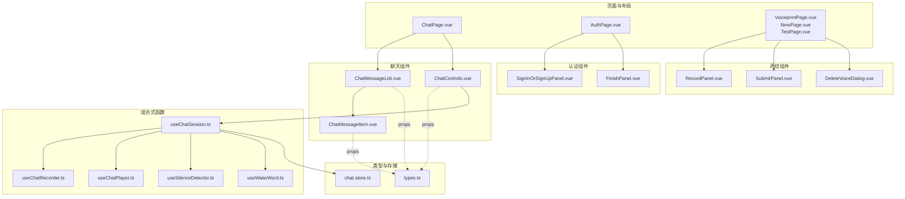
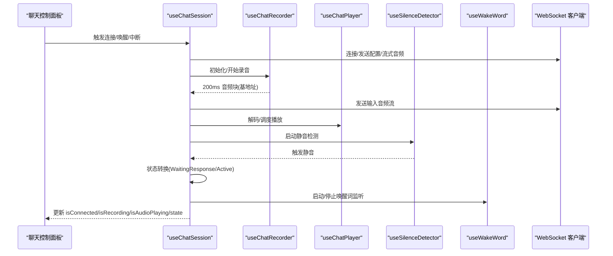
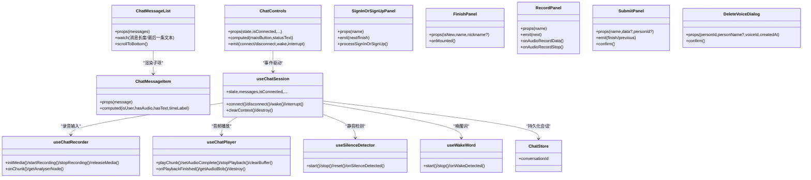

# 业务功能组件

<cite>
**本文引用的文件**
- [ChatMessageList.vue](file://src/components/chat/ChatMessageList.vue)
- [ChatControls.vue](file://src/components/chat/ChatControls.vue)
- [ChatMessageItem.vue](file://src/components/chat/ChatMessageItem.vue)
- [SignInOrSignUpPanel.vue](file://src/components/auth/SignInOrSignUpPanel.vue)
- [FinishPanel.vue](file://src/components/auth/FinishPanel.vue)
- [RecordPanel.vue](file://src/components/settings/voiceprint/RecordPanel.vue)
- [SubmitPanel.vue](file://src/components/settings/voiceprint/SubmitPanel.vue)
- [DeleteVoiceDialog.vue](file://src/components/settings/voiceprint/DeleteVoiceDialog.vue)
- [useChatSession.ts](file://src/composables/useChatSession.ts)
- [useChatRecorder.ts](file://src/composables/useChatRecorder.ts)
- [useChatPlayer.ts](file://src/composables/useChatPlayer.ts)
- [useSilenceDetector.ts](file://src/composables/useSilenceDetector.ts)
- [useWakeWord.ts](file://src/composables/useWakeWord.ts)
- [types.ts](file://src/types/chat/types.ts)
- [chat.store.ts](file://src/stores/chat/index.ts)
</cite>

## 目录
1. [简介](#简介)
2. [项目结构](#项目结构)
3. [核心组件](#核心组件)
4. [架构总览](#架构总览)
5. [组件详解](#组件详解)
6. [依赖关系分析](#依赖关系分析)
7. [性能考量](#性能考量)
8. [故障排查指南](#故障排查指南)
9. [结论](#结论)
10. [附录](#附录)

## 简介
本文件面向 Le Bot 前端业务功能组件，系统性梳理聊天消息列表、聊天控制面板、用户认证面板、声纹管理组件的设计模式与实现策略，重点说明数据绑定、事件处理与状态管理；阐述组件与业务逻辑的分离模式及与组合式函数（composables）的协作方式；给出配置项、使用场景与集成示例，并总结错误处理、加载状态与用户体验优化策略。

## 项目结构
前端采用“页面/布局 + 组件 + 组合式函数 + 类型/存储”的分层组织方式：
- 页面与布局：承载路由与容器，负责导航与内容编排
- 组件：可复用的 UI 单元，如聊天消息列表、控制面板、认证面板、声纹管理
- 组合式函数：封装跨组件的业务逻辑（会话、录音、播放、静音检测、唤醒词）
- 类型与存储：统一定义消息与状态类型，持久化会话上下文

图表来源
- [ChatMessageList.vue:1-68](file://src/components/chat/ChatMessageList.vue#L1-L68)
- [ChatControls.vue:1-204](file://src/components/chat/ChatControls.vue#L1-L204)
- [ChatMessageItem.vue:1-73](file://src/components/chat/ChatMessageItem.vue#L1-L73)
- [SignInOrSignUpPanel.vue:1-117](file://src/components/auth/SignInOrSignUpPanel.vue#L1-L117)
- [FinishPanel.vue:1-80](file://src/components/auth/FinishPanel.vue#L1-L80)
- [RecordPanel.vue:1-104](file://src/components/settings/voiceprint/RecordPanel.vue#L1-L104)
- [SubmitPanel.vue:1-158](file://src/components/settings/voiceprint/SubmitPanel.vue#L1-L158)
- [DeleteVoiceDialog.vue:1-99](file://src/components/settings/voiceprint/DeleteVoiceDialog.vue#L1-L99)
- [useChatSession.ts:1-589](file://src/composables/useChatSession.ts#L1-L589)
- [useChatRecorder.ts:1-148](file://src/composables/useChatRecorder.ts#L1-L148)
- [useChatPlayer.ts:1-161](file://src/composables/useChatPlayer.ts#L1-L161)
- [useSilenceDetector.ts:1-104](file://src/composables/useSilenceDetector.ts#L1-L104)
- [useWakeWord.ts:1-163](file://src/composables/useWakeWord.ts#L1-L163)
- [types.ts:1-96](file://src/types/chat/types.ts#L1-L96)
- [chat.store.ts:1-17](file://src/stores/chat/index.ts#L1-L17)

章节来源
- [ChatMessageList.vue:1-68](file://src/components/chat/ChatMessageList.vue#L1-L68)
- [ChatControls.vue:1-204](file://src/components/chat/ChatControls.vue#L1-L204)
- [SignInOrSignUpPanel.vue:1-117](file://src/components/auth/SignInOrSignUpPanel.vue#L1-L117)
- [FinishPanel.vue:1-80](file://src/components/auth/FinishPanel.vue#L1-L80)
- [RecordPanel.vue:1-104](file://src/components/settings/voiceprint/RecordPanel.vue#L1-L104)
- [SubmitPanel.vue:1-158](file://src/components/settings/voiceprint/SubmitPanel.vue#L1-L158)
- [DeleteVoiceDialog.vue:1-99](file://src/components/settings/voiceprint/DeleteVoiceDialog.vue#L1-L99)
- [useChatSession.ts:1-589](file://src/composables/useChatSession.ts#L1-L589)
- [useChatRecorder.ts:1-148](file://src/composables/useChatRecorder.ts#L1-L148)
- [useChatPlayer.ts:1-161](file://src/composables/useChatPlayer.ts#L1-L161)
- [useSilenceDetector.ts:1-104](file://src/composables/useSilenceDetector.ts#L1-L104)
- [useWakeWord.ts:1-163](file://src/composables/useWakeWord.ts#L1-L163)
- [types.ts:1-96](file://src/types/chat/types.ts#L1-L96)
- [chat.store.ts:1-17](file://src/stores/chat/index.ts#L1-L17)

## 核心组件
- 聊天消息列表：负责渲染消息、空态提示与自动滚动
- 聊天控制面板：根据状态机与媒体/网络状态动态呈现主按钮与状态文本
- 认证面板：支持邮箱验证码/密码登录，切换登录方式，触发下一步或完成流程
- 声纹管理：录音准备提示、朗读短语指导、音频预览与提交注册

章节来源
- [ChatMessageList.vue:1-68](file://src/components/chat/ChatMessageList.vue#L1-L68)
- [ChatControls.vue:1-204](file://src/components/chat/ChatControls.vue#L1-L204)
- [SignInOrSignUpPanel.vue:1-117](file://src/components/auth/SignInOrSignUpPanel.vue#L1-L117)
- [RecordPanel.vue:1-104](file://src/components/settings/voiceprint/RecordPanel.vue#L1-L104)

## 架构总览
组件与组合式函数的协作遵循“UI 组件只做展示与事件转发，业务逻辑下沉到 composable”的原则。聊天会话通过 useChatSession 统一编排 WebSocket、录音、播放、静音检测与唤醒词，状态通过 Pinia store 持久化。

图表来源
- [useChatSession.ts:1-589](file://src/composables/useChatSession.ts#L1-L589)
- [useChatRecorder.ts:1-148](file://src/composables/useChatRecorder.ts#L1-L148)
- [useChatPlayer.ts:1-161](file://src/composables/useChatPlayer.ts#L1-L161)
- [useSilenceDetector.ts:1-104](file://src/composables/useSilenceDetector.ts#L1-L104)
- [useWakeWord.ts:1-163](file://src/composables/useWakeWord.ts#L1-L163)

## 组件详解

### 聊天消息列表 ChatMessageList
- 数据绑定
  - 接收消息数组 props.messages，内部维护滚动区域引用
- 事件与状态
  - 监听消息长度变化与最后一条消息文本/完成状态变化，自动滚动到底部
- 空态与渲染
  - 无消息时显示“就绪聊天”空态；有消息时逐条渲染 ChatMessageItem
- 性能与体验
  - 使用 nextTick 确保 DOM 更新后再滚动，避免抖动
  - 仅在需要时滚动，减少不必要的重排

章节来源
- [ChatMessageList.vue:1-68](file://src/components/chat/ChatMessageList.vue#L1-L68)

### 聊天控制面板 ChatControls
- 数据绑定
  - 接收状态 state、连接状态 isConnected、麦克风就绪 isMediaReady、唤醒词支持/监听 isWakeWordSupported/isWakeWordListening、录音中 isRecording、播放中 isAudioPlaying
- 动态行为
  - 主按钮图标/颜色/标签/脉冲动画随状态变化；禁用条件基于媒体/连接状态
  - 状态栏文本根据连接、媒体、状态机生成
- 事件发射
  - 连接/断开、唤醒、打断等动作通过自定义事件向上抛出，由父组件驱动 useChatSession

章节来源
- [ChatControls.vue:1-204](file://src/components/chat/ChatControls.vue#L1-L204)

### 聊天消息项 ChatMessageItem
- 数据绑定
  - 接收单条消息 props.message，计算是否为用户消息、是否有文本/音频
- 渲染细节
  - 用户/助手头像与时间戳
  - 流式指示器（未完成且正在流式）
  - 文本内容与音频播放器（audioUrl 存在时）
  - 空消息占位提示

章节来源
- [ChatMessageItem.vue:1-73](file://src/components/chat/ChatMessageItem.vue#L1-L73)

### 认证面板 SignInOrSignUpPanel
- 数据绑定
  - 邮箱、验证码/密码、登录方式切换
- 事件与状态
  - 校验邮箱格式与验证码长度；调用后端接口进行登录/注册
  - 成功后设置 accessToken，并根据是否新用户/无密码触发 next 或 finish
- 错误处理
  - 使用通知组件反馈错误；捕获异常并提示未知错误

章节来源
- [SignInOrSignUpPanel.vue:1-117](file://src/components/auth/SignInOrSignUpPanel.vue#L1-L117)

### 认证完成面板 FinishPanel
- 数据绑定
  - 新用户欢迎/老用户欢迎文案，昵称占位
- 生命周期
  - 安装后拉取设备与个人资料，成功后自动跳转至来源页或首页
  - 失败则清理令牌并回到失败状态

章节来源
- [FinishPanel.vue:1-80](file://src/components/auth/FinishPanel.vue#L1-L80)

### 声纹录音 RecordPanel
- 数据绑定
  - 准备事项列表、录音音频 Blob 累积、对象 URL
- 事件与状态
  - 录音数据回调累积 Blob；停止时生成对象 URL 供预览
  - 组件卸载时释放对象 URL
- 用户体验
  - 提供环境、语音自然度、距离等准备提示，增强录制质量

章节来源
- [RecordPanel.vue:1-104](file://src/components/settings/voiceprint/RecordPanel.vue#L1-L104)

### 声纹提交 SubmitPanel
- 数据绑定
  - 传入音频 Blob；可选 personId；当无 personId 时需填写姓名与关系
- 事件与状态
  - 将 Blob 转为 Data URL，调用注册或添加声纹接口
  - 成功后通知并延时触发 finish；失败弹出错误通知
- 安全与健壮性
  - 缺少令牌或数据时直接返回
  - 组件挂载时若无数据则回退上一步

章节来源
- [SubmitPanel.vue:1-158](file://src/components/settings/voiceprint/SubmitPanel.vue#L1-L158)

### 声纹删除对话框 DeleteVoiceDialog
- 数据绑定
  - 接收 personId、personName、voiceId、创建时间
- 事件与状态
  - 打开即校验令牌；确认后调用删除接口，成功/失败分别通知并关闭对话框
- 友好提示
  - 展示创建时间与 ID，二次确认提示

章节来源
- [DeleteVoiceDialog.vue:1-99](file://src/components/settings/voiceprint/DeleteVoiceDialog.vue#L1-L99)

### 组合式函数协作

#### useChatSession：会话编排
- 职责
  - 管理三态状态机：Idle → WaitingResponse → Active
  - WebSocket 连接与消息路由、音频流式传输、播放、静音检测、唤醒词
  - 会话超时、中断冷却、请求 ID、消息聚合
- 关键交互
  - 连接时初始化媒体与唤醒词，启动录音与静音检测
  - 录音回调将音频块推送到服务器；播放回调更新 UI 状态
  - 超时检查与静音检测驱动状态转换
- 与 store 的协作
  - 通过 useChatStore 持久化 conversationId，确保跨会话一致性

章节来源
- [useChatSession.ts:1-589](file://src/composables/useChatSession.ts#L1-L589)
- [chat.store.ts:1-17](file://src/stores/chat/index.ts#L1-L17)

#### useChatRecorder：录音管线
- 职责
  - 获取媒体流、创建 MediaRecorder（WAV，200ms 切片）、导出 Base64 音频块
  - 创建 AnalyserNode 用于静音检测
- 与 useChatSession 协作
  - 作为音频输入源，向会话提供流式音频块

章节来源
- [useChatRecorder.ts:1-148](file://src/composables/useChatRecorder.ts#L1-L148)

#### useChatPlayer：播放管线
- 职责
  - 解码 Base64 音频块、基于 AudioContext 调度无缝播放
  - 跟踪播放完成状态，支持立即中断
- 与 useChatSession 协作
  - 在收到输出音频流时解码并播放，完成后推进状态机

章节来源
- [useChatPlayer.ts:1-161](file://src/composables/useChatPlayer.ts#L1-L161)

#### useSilenceDetector：静音检测
- 职责
  - 基于 RMS 计算与环形缓冲区判断持续静音
- 与 useChatSession 协作
  - 在 Active 状态启动，静音触发 WaitingResponse

章节来源
- [useSilenceDetector.ts:1-104](file://src/composables/useSilenceDetector.ts#L1-L104)

#### useWakeWord：唤醒词
- 职责
  - 使用 Web Speech API 持续监听中文唤醒短语，匹配后回调
- 与 useChatSession 协作
  - Idle 状态启动监听；检测到唤醒后停止监听并开始会话

章节来源
- [useWakeWord.ts:1-163](file://src/composables/useWakeWord.ts#L1-L163)

#### 类型与常量
- ChatState：三态状态机
- ChatMessage：消息模型（含文本、音频块、URL、完成/流式标记）
- AUDIO_CONSTANTS/CHAT_TIMEOUTS：录音采样参数与超时常量
- 默认静音检测配置：阈值、采样间隔、连续静音计数

章节来源
- [types.ts:1-96](file://src/types/chat/types.ts#L1-L96)

## 依赖关系分析

图表来源
- [ChatMessageList.vue:1-68](file://src/components/chat/ChatMessageList.vue#L1-L68)
- [ChatControls.vue:1-204](file://src/components/chat/ChatControls.vue#L1-L204)
- [ChatMessageItem.vue:1-73](file://src/components/chat/ChatMessageItem.vue#L1-L73)
- [SignInOrSignUpPanel.vue:1-117](file://src/components/auth/SignInOrSignUpPanel.vue#L1-L117)
- [FinishPanel.vue:1-80](file://src/components/auth/FinishPanel.vue#L1-L80)
- [RecordPanel.vue:1-104](file://src/components/settings/voiceprint/RecordPanel.vue#L1-L104)
- [SubmitPanel.vue:1-158](file://src/components/settings/voiceprint/SubmitPanel.vue#L1-L158)
- [DeleteVoiceDialog.vue:1-99](file://src/components/settings/voiceprint/DeleteVoiceDialog.vue#L1-L99)
- [useChatSession.ts:1-589](file://src/composables/useChatSession.ts#L1-L589)
- [useChatRecorder.ts:1-148](file://src/composables/useChatRecorder.ts#L1-L148)
- [useChatPlayer.ts:1-161](file://src/composables/useChatPlayer.ts#L1-L161)
- [useSilenceDetector.ts:1-104](file://src/composables/useSilenceDetector.ts#L1-L104)
- [useWakeWord.ts:1-163](file://src/composables/useWakeWord.ts#L1-L163)
- [chat.store.ts:1-17](file://src/stores/chat/index.ts#L1-L17)

## 性能考量
- 自动滚动优化：在消息变更后使用 nextTick 再滚动，避免重复渲染与抖动
- 音频管线：录音切片 200ms，播放使用 AudioContext 调度，减少卡顿
- 静音检测：环形缓冲与阈值判定，避免误判；Grace period 防止早期触发
- 资源释放：断开会话时撤销所有对象 URL、停止媒体轨道、关闭 AudioContext
- 状态持久化：会话 ID 持久化，减少重复初始化成本

## 故障排查指南
- 连接失败
  - 检查 WebSocket 地址与令牌；确认 isMediaReady 与浏览器权限
- 唤醒词不工作
  - 确认 isWakeWordSupported 与 isWakeWordListening；浏览器需支持 Web Speech API
- 录音无声
  - 检查 initMedia 是否成功；确认麦克风权限与设备可用
- 播放卡顿
  - 查看 isPlaying 与音频块解码日志；确认网络与服务端音频流
- 静音检测不灵敏
  - 调整静音阈值与采样间隔；确保录音质量与环境噪声
- 删除声纹失败
  - 校验访问令牌与参数；查看后端返回的消息并提示用户

章节来源
- [useChatSession.ts:1-589](file://src/composables/useChatSession.ts#L1-L589)
- [useWakeWord.ts:1-163](file://src/composables/useWakeWord.ts#L1-L163)
- [useChatRecorder.ts:1-148](file://src/composables/useChatRecorder.ts#L1-L148)
- [useChatPlayer.ts:1-161](file://src/composables/useChatPlayer.ts#L1-L161)
- [useSilenceDetector.ts:1-104](file://src/composables/useSilenceDetector.ts#L1-L104)
- [DeleteVoiceDialog.vue:1-99](file://src/components/settings/voiceprint/DeleteVoiceDialog.vue#L1-L99)

## 结论
本项目通过“组件 + 组合式函数 + 类型/存储”的分层设计，实现了清晰的职责划分与良好的可维护性。聊天组件以 useChatSession 为核心编排，认证与声纹组件分别覆盖登录与生物特征管理的关键路径。建议在后续迭代中进一步完善国际化文案、错误码映射与埋点统计，以提升全球化与可观测性。

## 附录

### 组件配置与使用场景
- 聊天消息列表
  - 配置：接收消息数组
  - 场景：聊天页面消息展示与滚动
- 聊天控制面板
  - 配置：状态、连接、媒体、唤醒词、录音、播放状态
  - 场景：控制会话生命周期（连接/断开、唤醒、打断）
- 认证面板
  - 配置：登录方式（验证码/密码）、邮箱校验
  - 场景：登录/注册流程中的邮箱验证与密码登录
- 声纹录音
  - 配置：准备提示、录音数据回调
  - 场景：声纹注册前的音频采集
- 声纹提交
  - 配置：音频数据、可选人员信息
  - 场景：声纹注册或添加到已有人员
- 声纹删除
  - 配置：人员与声纹标识
  - 场景：移除不再使用的声纹

### 集成示例（路径指引）
- 在聊天页面集成控制面板与消息列表
  - 控制面板通过事件驱动 useChatSession 的 connect/wake/interrupt
  - 消息列表接收 useChatSession.messages 并自动滚动
- 在认证页面集成登录面板与完成面板
  - 登录面板触发 finish/next，完成面板拉取资料并跳转
- 在声纹设置页集成录音、提交与删除组件
  - 录音完成后传递 Blob 至提交面板；删除对话框确认后刷新列表