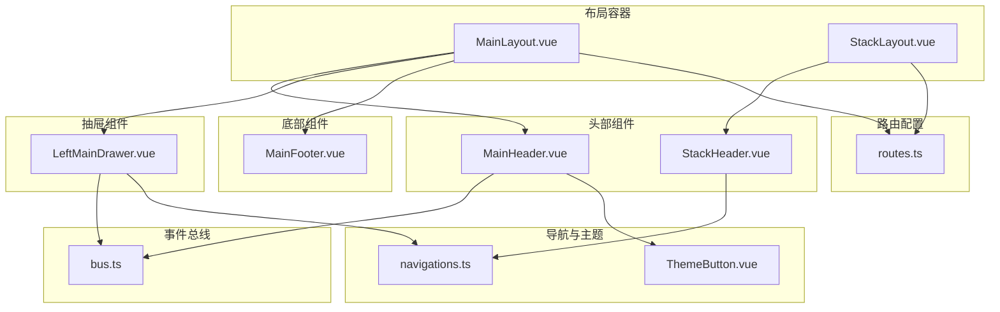
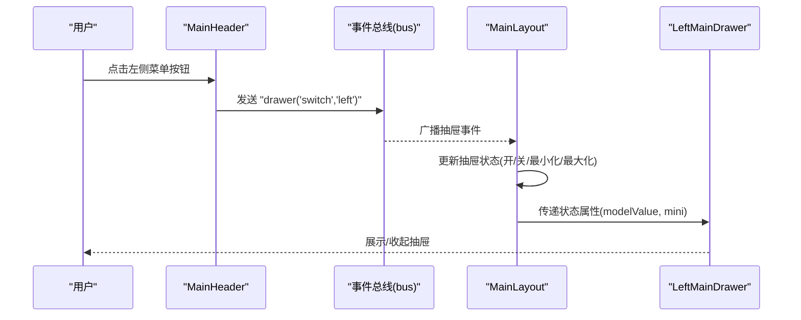
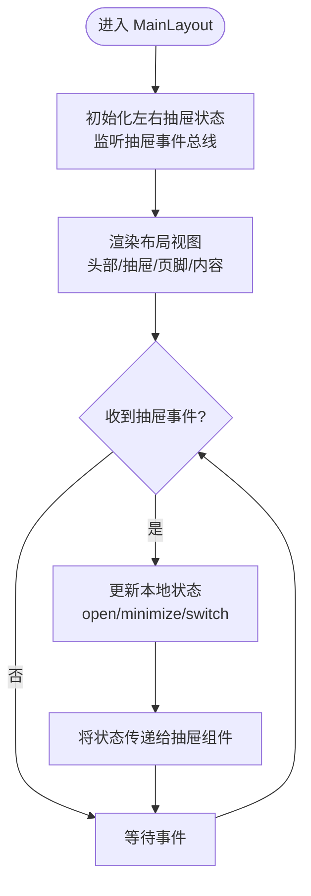
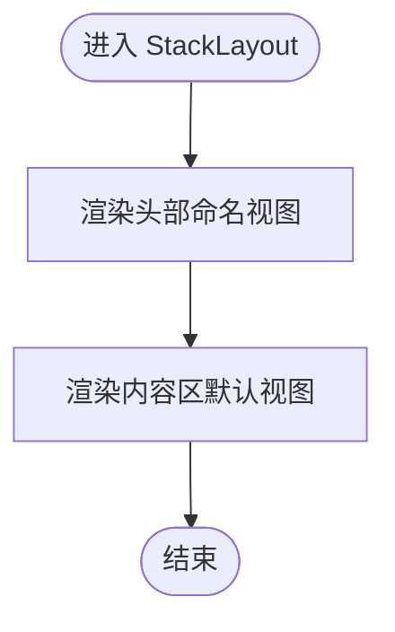
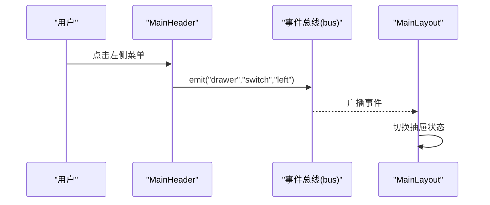
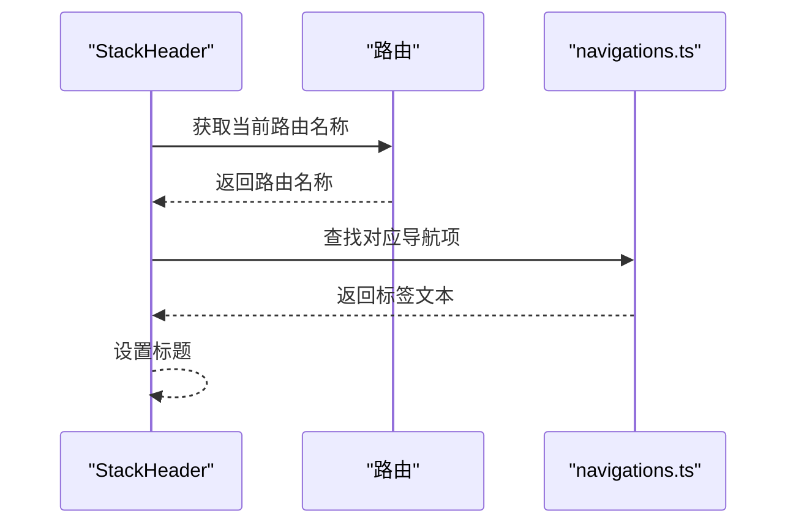
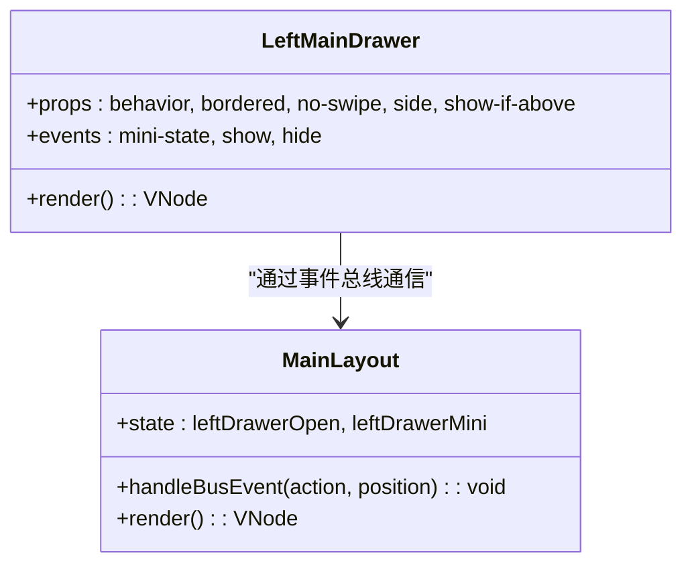
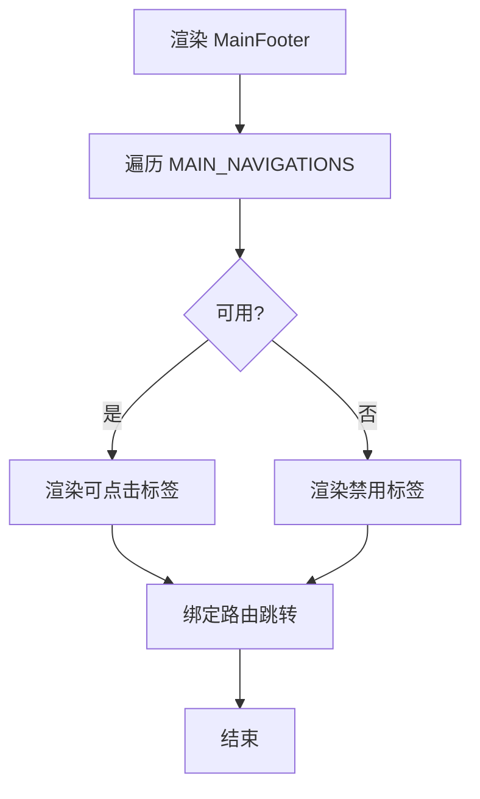
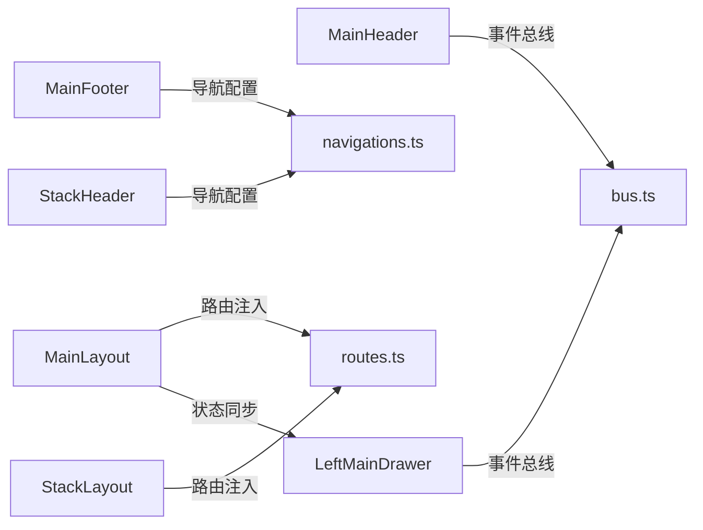

# 布局组件

<cite>
**本文引用的文件**
- [MainLayout.vue](file://src/layouts/MainLayout.vue)
- [StackLayout.vue](file://src/layouts/StackLayout.vue)
- [MainHeader.vue](file://src/layouts/headers/MainHeader.vue)
- [StackHeader.vue](file://src/layouts/headers/StackHeader.vue)
- [LeftMainDrawer.vue](file://src/layouts/drawers/LeftMainDrawer.vue)
- [MainFooter.vue](file://src/layouts/footers/MainFooter.vue)
- [navigations.ts](file://src/components/navigations.ts)
- [ThemeButton.vue](file://src/components/ThemeButton.vue)
- [bus.ts](file://src/boot/bus.ts)
- [routes.ts](file://src/router/routes.ts)
- [HomePage.vue](file://src/pages/main/HomePage.vue)
- [VoiceprintPage.vue](file://src/pages/stack/settings/VoiceprintPage.vue)
</cite>

## 目录
1. [简介](#简介)
2. [项目结构](#项目结构)
3. [核心组件](#核心组件)
4. [架构总览](#架构总览)
5. [详细组件分析](#详细组件分析)
6. [依赖分析](#依赖分析)
7. [性能考虑](#性能考虑)
8. [故障排查指南](#故障排查指南)
9. [结论](#结论)
10. [附录](#附录)

## 简介
本文件系统化梳理 Le Bot 前端的布局体系，覆盖主布局与堆叠布局两类容器，以及头部、侧边栏抽屉、底部等子组件。文档重点阐述：
- 布局系统的层级关系与职责划分
- 响应式设计与屏幕尺寸适配策略
- 导航集成与路由配置联动
- 布局切换、导航管理与内容区域渲染机制
- 主题适配与交互事件总线
- 性能优化与可维护性设计原则

## 项目结构
布局系统位于 src/layouts 目录下，采用“容器 + 子视图”的组合模式，配合路由多命名视图实现灵活的页面结构。主要文件与职责如下：
- 容器布局
  - MainLayout.vue：主布局容器，支持左右抽屉、头部、页脚的多命名视图渲染
  - StackLayout.vue：堆叠布局容器，适用于移动端或特定场景的单列布局
- 头部组件
  - MainHeader.vue：主布局头部，提供菜单按钮与主题切换入口
  - StackHeader.vue：堆叠布局头部，根据当前路由动态显示标题
- 抽屉组件
  - LeftMainDrawer.vue：左侧主抽屉，基于全局导航配置生成菜单项
- 底部组件
  - MainFooter.vue：主布局底部导航，移动端使用底部标签页
- 导航与主题
  - navigations.ts：定义主布局与堆叠布局的导航集合
  - ThemeButton.vue：主题切换按钮，绑定设置存储中的主题状态
- 事件总线
  - bus.ts：定义抽屉事件总线类型，供头部与抽屉组件通信
- 路由配置
  - routes.ts：在不同路径下按平台与屏幕条件注入不同的命名视图

图表来源
- [MainLayout.vue:1-51](file://src/layouts/MainLayout.vue#L1-L51)
- [StackLayout.vue:1-17](file://src/layouts/StackLayout.vue#L1-L17)
- [MainHeader.vue:1-27](file://src/layouts/headers/MainHeader.vue#L1-L27)
- [StackHeader.vue:1-38](file://src/layouts/headers/StackHeader.vue#L1-L38)
- [LeftMainDrawer.vue:1-35](file://src/layouts/drawers/LeftMainDrawer.vue#L1-L35)
- [MainFooter.vue:1-28](file://src/layouts/footers/MainFooter.vue#L1-L28)
- [navigations.ts:1-95](file://src/components/navigations.ts#L1-L95)
- [ThemeButton.vue:1-28](file://src/components/ThemeButton.vue#L1-L28)
- [bus.ts:1-18](file://src/boot/bus.ts#L1-L18)
- [routes.ts:1-160](file://src/router/routes.ts#L1-L160)

章节来源
- [MainLayout.vue:1-51](file://src/layouts/MainLayout.vue#L1-L51)
- [StackLayout.vue:1-17](file://src/layouts/StackLayout.vue#L1-L17)
- [routes.ts:1-160](file://src/router/routes.ts#L1-L160)

## 核心组件
- 主布局 MainLayout
  - 使用 Quasar 布局视图模板，通过命名视图渲染头部、左侧抽屉、右侧抽屉与页脚
  - 通过屏幕断点控制移动端与桌面端的布局差异（如移动端隐藏左侧抽屉、显示底部导航）
  - 统一监听抽屉事件总线，集中管理抽屉的打开/关闭/最小化/最大化/切换状态
- 堆叠布局 StackLayout
  - 简化布局容器，仅渲染头部与内容区，适合移动端或特定功能栈式页面
- 头部组件
  - MainHeader：提供左右菜单按钮，触发抽屉切换；集成主题按钮
  - StackHeader：根据当前路由名称动态解析标题，提供返回按钮
- 抽屉组件
  - LeftMainDrawer：基于全局导航配置渲染菜单项，支持禁用态与图标展示，并向总线发送抽屉状态变化事件
- 底部组件
  - MainFooter：移动端底部标签导航，与全局导航配置保持一致
- 导航与主题
  - navigations.ts：集中定义主布局与堆叠布局的导航项（标签、图标、可用性、路由）
  - ThemeButton：绑定设置存储的主题状态，提供切换与提示
- 事件总线
  - bus.ts：定义抽屉事件类型，供头部与抽屉组件跨层级通信

章节来源
- [MainLayout.vue:1-51](file://src/layouts/MainLayout.vue#L1-L51)
- [StackLayout.vue:1-17](file://src/layouts/StackLayout.vue#L1-L17)
- [MainHeader.vue:1-27](file://src/layouts/headers/MainHeader.vue#L1-L27)
- [StackHeader.vue:1-38](file://src/layouts/headers/StackHeader.vue#L1-L38)
- [LeftMainDrawer.vue:1-35](file://src/layouts/drawers/LeftMainDrawer.vue#L1-L35)
- [MainFooter.vue:1-28](file://src/layouts/footers/MainFooter.vue#L1-L28)
- [navigations.ts:1-95](file://src/components/navigations.ts#L1-L95)
- [ThemeButton.vue:1-28](file://src/components/ThemeButton.vue#L1-L28)
- [bus.ts:1-18](file://src/boot/bus.ts#L1-L18)

## 架构总览
布局系统围绕“容器 + 多命名视图”的架构展开，结合 Quasar 的布局视图模板与 Vue Router 的命名视图能力，实现灵活的页面结构组合。

图表来源
- [MainHeader.vue:12-21](file://src/layouts/headers/MainHeader.vue#L12-L21)
- [bus.ts:11-13](file://src/boot/bus.ts#L11-L13)
- [MainLayout.vue:14-37](file://src/layouts/MainLayout.vue#L14-L37)
- [LeftMainDrawer.vue:15-17](file://src/layouts/drawers/LeftMainDrawer.vue#L15-L17)

## 详细组件分析

### 主布局 MainLayout
- 视图模板
  - 使用 Quasar 布局视图模板，分别挂载头部、左侧抽屉、右侧抽屉与页脚的命名视图
  - 内容区通过默认命名视图渲染当前页面
- 响应式策略
  - 通过屏幕断点判断移动端，决定是否渲染底部导航或左侧抽屉
- 抽屉状态管理
  - 通过事件总线接收抽屉事件，统一更新本地状态，再传递给抽屉组件
- 交互流程
  - 头部菜单按钮触发总线事件，布局容器根据事件类型切换抽屉状态

图表来源
- [MainLayout.vue:14-37](file://src/layouts/MainLayout.vue#L14-L37)
- [bus.ts:11-13](file://src/boot/bus.ts#L11-L13)

章节来源
- [MainLayout.vue:1-51](file://src/layouts/MainLayout.vue#L1-L51)

### 堆叠布局 StackLayout
- 视图模板
  - 渲染头部与内容区，适合移动端或需要简洁顶部导航的场景
- 响应式策略
  - 同样使用屏幕断点参数，但不包含抽屉与底部导航

图表来源
- [StackLayout.vue:8-13](file://src/layouts/StackLayout.vue#L8-L13)

章节来源
- [StackLayout.vue:1-17](file://src/layouts/StackLayout.vue#L1-L17)

### 头部组件 MainHeader
- 功能
  - 左侧菜单按钮用于切换左侧抽屉
  - 右侧菜单按钮用于切换右侧抽屉
  - 集成主题切换按钮
- 事件
  - 点击按钮通过事件总线发送抽屉事件，布局容器统一处理

图表来源
- [MainHeader.vue:12-21](file://src/layouts/headers/MainHeader.vue#L12-L21)
- [bus.ts:11-13](file://src/boot/bus.ts#L11-L13)
- [MainLayout.vue:14-37](file://src/layouts/MainLayout.vue#L14-L37)

章节来源
- [MainHeader.vue:1-27](file://src/layouts/headers/MainHeader.vue#L1-L27)

### 头部组件 StackHeader
- 功能
  - 根据当前路由名称从导航配置中解析标题
  - 提供返回按钮，便于在堆叠页面间导航
- 与导航配置联动
  - 依赖 navigations.ts 中的 STACK_NAVIGATIONS

图表来源
- [StackHeader.vue:13-15](file://src/layouts/headers/StackHeader.vue#L13-L15)
- [navigations.ts:39-94](file://src/components/navigations.ts#L39-L94)

章节来源
- [StackHeader.vue:1-38](file://src/layouts/headers/StackHeader.vue#L1-L38)
- [navigations.ts:1-95](file://src/components/navigations.ts#L1-L95)

### 抽屉组件 LeftMainDrawer
- 功能
  - 基于全局导航配置渲染菜单项
  - 支持禁用态与图标展示
  - 通过事件总线上报抽屉的最小化/最大化/显示/隐藏状态
- 与布局容器协作
  - 接收来自 MainLayout 的 open/minimize 状态属性
  - 将状态变化回传至 MainLayout

图表来源
- [LeftMainDrawer.vue:7-31](file://src/layouts/drawers/LeftMainDrawer.vue#L7-L31)
- [MainLayout.vue:14-37](file://src/layouts/MainLayout.vue#L14-L37)
- [bus.ts:11-13](file://src/boot/bus.ts#L11-L13)

章节来源
- [LeftMainDrawer.vue:1-35](file://src/layouts/drawers/LeftMainDrawer.vue#L1-L35)
- [MainLayout.vue:1-51](file://src/layouts/MainLayout.vue#L1-L51)
- [bus.ts:1-18](file://src/boot/bus.ts#L1-L18)

### 底部组件 MainFooter
- 功能
  - 移动端底部标签导航，与全局导航配置保持一致
  - 支持禁用态与图标展示
- 与导航配置联动
  - 依赖 navigations.ts 中的 MAIN_NAVIGATIONS

图表来源
- [MainFooter.vue:12-22](file://src/layouts/footers/MainFooter.vue#L12-L22)
- [navigations.ts:12-37](file://src/components/navigations.ts#L12-L37)

章节来源
- [MainFooter.vue:1-28](file://src/layouts/footers/MainFooter.vue#L1-L28)
- [navigations.ts:1-95](file://src/components/navigations.ts#L1-L95)

### 导航配置 navigations.ts
- 主布局导航 MAIN_NAVIGATIONS
  - 包含首页、成长数据、商城、我的等路由项
  - 控制可用性与图标
- 堆叠布局导航 STACK_NAVIGATIONS
  - 包含关于、认证、聊天、个人资料、设备配置、设置及声纹相关页面
  - 与路由配置严格对应

章节来源
- [navigations.ts:1-95](file://src/components/navigations.ts#L1-L95)

### 主题按钮 ThemeButton
- 功能
  - 绑定设置存储的主题状态，提供切换与提示
- 与布局头部集成
  - 在 MainHeader 中直接使用，实现主题切换

章节来源
- [ThemeButton.vue:1-28](file://src/components/ThemeButton.vue#L1-L28)
- [MainHeader.vue:20](file://src/layouts/headers/MainHeader.vue#L20)

### 事件总线 bus.ts
- 类型定义
  - 定义抽屉事件类型，包含动作与位置参数
- 全局注册
  - 在引导阶段注册到全局配置，供组件使用

章节来源
- [bus.ts:1-18](file://src/boot/bus.ts#L1-L18)

### 路由配置 routes.ts
- 主布局路由
  - /main 路径下，根据平台与屏幕条件注入不同的命名视图
  - 桌面端：默认页面 + 左侧抽屉 + 头部
  - 移动端：默认页面 + 底部导航
- 堆叠布局路由
  - /stack 路径下，统一使用 StackLayout，并为各页面注入 StackHeader

章节来源
- [routes.ts:14-38](file://src/router/routes.ts#L14-L38)
- [routes.ts:42-147](file://src/router/routes.ts#L42-L147)

## 依赖分析
- 组件耦合
  - MainHeader 与 bus.ts 强耦合，负责触发抽屉事件
  - LeftMainDrawer 与 bus.ts 强耦合，负责上报抽屉状态
  - MainLayout 作为协调者，聚合事件并驱动抽屉状态
  - StackHeader 依赖路由与 navigations.ts
  - MainFooter 依赖 navigations.ts
- 外部依赖
  - Quasar 布局、抽屉、工具栏、标签等组件
  - Vue Router 命名视图与路由守卫
  - Pinia 设置存储（主题状态）

图表来源
- [MainHeader.vue:12-21](file://src/layouts/headers/MainHeader.vue#L12-L21)
- [LeftMainDrawer.vue:15-17](file://src/layouts/drawers/LeftMainDrawer.vue#L15-L17)
- [MainLayout.vue:14-37](file://src/layouts/MainLayout.vue#L14-L37)
- [StackHeader.vue:13-15](file://src/layouts/headers/StackHeader.vue#L13-L15)
- [navigations.ts:12-94](file://src/components/navigations.ts#L12-L94)
- [routes.ts:14-147](file://src/router/routes.ts#L14-L147)

章节来源
- [MainHeader.vue:1-27](file://src/layouts/headers/MainHeader.vue#L1-L27)
- [LeftMainDrawer.vue:1-35](file://src/layouts/drawers/LeftMainDrawer.vue#L1-L35)
- [MainLayout.vue:1-51](file://src/layouts/MainLayout.vue#L1-L51)
- [StackHeader.vue:1-38](file://src/layouts/headers/StackHeader.vue#L1-L38)
- [navigations.ts:1-95](file://src/components/navigations.ts#L1-L95)
- [routes.ts:1-160](file://src/router/routes.ts#L1-L160)

## 性能考虑
- 抽屉事件总线
  - 通过集中事件总线处理抽屉状态，避免组件间直接通信导致的复杂耦合，降低重渲染成本
- 命名视图按需加载
  - 路由配置中使用异步组件导入，减少初始包体与首屏渲染压力
- 响应式条件注入
  - 根据平台与屏幕断点选择性注入命名视图，避免不必要的 DOM 结构
- 导航配置复用
  - 导航项集中管理，减少重复渲染与逻辑分散带来的性能损耗
- 主题状态绑定
  - 主题切换通过设置存储绑定，避免频繁计算与样式重绘

## 故障排查指南
- 抽屉无法切换
  - 检查 MainHeader 是否正确触发事件总线
  - 检查 MainLayout 是否监听并更新抽屉状态
  - 检查 LeftMainDrawer 是否正确上报状态变化
- 底部导航不显示
  - 确认路由配置中移动端是否注入了底部导航视图
  - 确认 navigations.ts 中对应导航项是否可用
- 栈式页面标题不显示
  - 确认路由名称与 navigations.ts 中的 STACK_NAVIGATIONS 对应
  - 确认 StackHeader 是否正确解析当前路由名称
- 页面未登录跳转
  - 示例页面在挂载时进行访问令牌校验，若未登录会跳转到认证页
  - 检查路由守卫与认证状态存储

章节来源
- [MainHeader.vue:12-21](file://src/layouts/headers/MainHeader.vue#L12-L21)
- [MainLayout.vue:14-37](file://src/layouts/MainLayout.vue#L14-L37)
- [LeftMainDrawer.vue:15-17](file://src/layouts/drawers/LeftMainDrawer.vue#L15-L17)
- [routes.ts:14-38](file://src/router/routes.ts#L14-L38)
- [navigations.ts:39-94](file://src/components/navigations.ts#L39-L94)
- [StackHeader.vue:13-15](file://src/layouts/headers/StackHeader.vue#L13-L15)
- [HomePage.vue:24-28](file://src/pages/main/HomePage.vue#L24-L28)
- [VoiceprintPage.vue:17-33](file://src/pages/stack/settings/VoiceprintPage.vue#L17-L33)

## 结论
该布局系统以容器 + 多命名视图为核心，结合事件总线与路由配置，实现了清晰的层级关系与灵活的响应式布局。通过集中化的导航配置与主题适配，提升了可维护性与一致性。建议在后续迭代中进一步完善抽屉动画与过渡效果，并持续优化命名视图的按需加载策略，以获得更佳的用户体验与性能表现。

## 附录
- 布局切换与导航管理
  - 通过 MainHeader 的菜单按钮与事件总线实现抽屉切换
  - 通过 StackHeader 的返回按钮与路由跳转实现页面导航
- 内容区域渲染
  - 默认命名视图渲染当前页面组件
  - 命名视图按平台与屏幕条件注入头部、抽屉、底部等子组件
- 主题适配与屏幕尺寸适配
  - 通过 Quasar 的 dark 主题与 screen 断点实现主题与布局适配
- 性能优化与可维护性
  - 事件总线集中处理、异步组件按需加载、导航配置复用，提升整体性能与可维护性